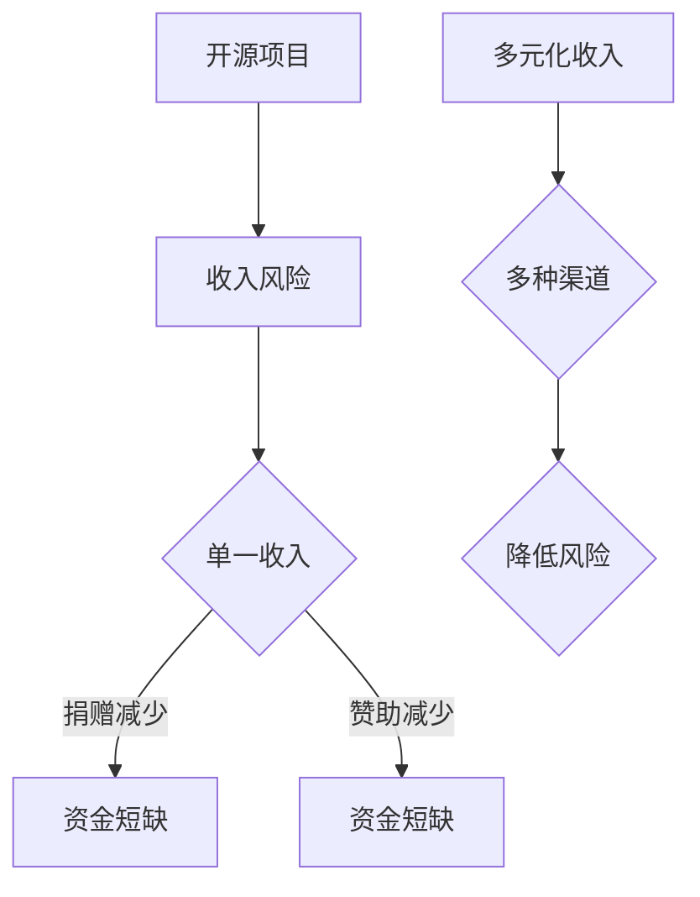

                 

关键词：开源项目，收入多元化，风险管理，项目生存，盈利模式

> 摘要：本文探讨了开源项目如何通过收入多元化策略来降低风险，提高项目的生存能力和可持续性。文章首先介绍了开源项目的背景和现状，然后详细分析了开源项目面临的收入风险，并提出了具体的多元化收入策略。通过案例分析，文章展示了成功实践这些策略的项目，最后对开源项目的未来进行了展望。

## 1. 背景介绍

开源软件已经成为当今软件开发领域的重要趋势。它的核心思想是共享源代码，允许社区成员自由地使用、修改和分发软件。这种模式不仅促进了技术创新，也大大降低了软件的开发成本。根据Linux基金会的数据，截至2022年，全球共有超过1亿个活跃的开源项目，这些项目吸引了数十亿用户的参与。

开源项目的开发者通常都是出于兴趣或者对技术的热爱而贡献代码，他们并不指望通过开源项目获得直接的财务回报。然而，随着开源项目的规模和影响力不断扩大，开发者们开始意识到，为了确保项目的长期发展，需要找到稳定的收入来源。

当前，许多开源项目面临的主要挑战之一是收入过于单一，这导致项目容易受到市场波动、用户需求变化等外部因素的影响。例如，一些项目主要依赖于捐赠或赞助，如果捐赠者流失或减少捐赠，项目就可能面临资金短缺的风险。因此，开源项目的收入多元化显得尤为重要。

## 2. 核心概念与联系

### 2.1. 开源项目的定义与特点

开源项目是指那些允许用户自由查看、使用、修改和分享源代码的软件项目。其主要特点包括：

- **自由性**：用户可以自由地使用开源软件，不受任何限制。
- **开放性**：项目的源代码是公开的，任何人都可以查看和修改。
- **共享性**：用户可以修改源代码后再次分享，进一步推动了项目的迭代和发展。

### 2.2. 收入多元化的定义与策略

收入多元化是指项目通过多种渠道获得收入，以减少单一收入来源的风险。常见的收入多元化策略包括：

- **捐赠与赞助**：用户和公司通过捐赠或赞助支持开源项目。
- **商业服务**：项目提供商业支持服务，如咨询、培训和技术支持。
- **许可费用**：项目可以提供商业许可，允许企业合法使用软件。
- **增值服务**：项目提供额外付费功能或服务，如高级支持、个性化定制等。

### 2.3. 收入风险与多元化策略的关系

收入风险是指项目因单一收入来源而可能遭受的财务损失。通过收入多元化，项目可以降低这种风险，具体关系如下：

- **单一收入来源**：如果项目主要依赖于捐赠，一旦捐赠减少，项目就可能面临资金短缺。
- **多元化收入**：通过多种渠道获得收入，即使某一种收入减少，其他渠道的收入可以弥补，从而降低财务风险。

### 2.4. Mermaid 流程图



## 3. 核心算法原理 & 具体操作步骤

### 3.1. 算法原理概述

收入多元化的核心原理在于通过多种渠道分散风险，从而确保项目的财务稳定。这可以通过以下步骤实现：

- **评估现有收入**：分析项目当前的收入结构，确定单一收入来源的风险。
- **探索多元渠道**：研究可能的收入渠道，如商业服务、许可费用等。
- **实施多元化策略**：根据评估结果，制定并实施具体的多元化策略。
- **监控与调整**：持续监控收入变化，根据实际情况进行调整。

### 3.2. 算法步骤详解

1. **评估现有收入**：
   - 分析捐赠、赞助、商业服务、许可费用等收入来源。
   - 评估每种收入来源的风险和贡献度。

2. **探索多元渠道**：
   - 研究与项目相关的商业服务，如技术咨询、定制开发等。
   - 探索许可费用的可能性，如企业版许可、商业许可等。
   - 考虑增值服务的潜力，如高级支持、培训课程等。

3. **实施多元化策略**：
   - 根据评估结果，选择合适的收入渠道。
   - 制定详细的实施计划，包括资源分配、时间表等。
   - 实施多元化策略，确保每种收入渠道的正常运作。

4. **监控与调整**：
   - 定期监控收入变化，分析数据，评估多元化策略的效果。
   - 根据监控结果，调整收入渠道和策略，优化收入结构。

### 3.3. 算法优缺点

- **优点**：
  - 降低收入风险，确保项目财务稳定。
  - 促进项目可持续发展，提高项目质量。
  - 增强社区参与度，提升项目影响力。

- **缺点**：
  - 需要投入更多时间和资源进行多元化策略的制定和实施。
  - 可能需要调整项目发展方向，以适应新的收入渠道。

### 3.4. 算法应用领域

- **开源软件项目**：许多开源项目都可以通过收入多元化策略降低风险，提高生存能力。
- **非盈利组织**：非盈利组织也可以通过收入多元化策略实现财务稳定，持续提供服务。

## 4. 数学模型和公式 & 详细讲解 & 举例说明

### 4.1. 数学模型构建

为了评估收入多元化的效果，我们可以构建一个简单的数学模型。假设项目有 n 种收入渠道，每种渠道的收入分别为 \( R_1, R_2, ..., R_n \)，则项目的总收入为：

\[ R_{total} = R_1 + R_2 + ... + R_n \]

### 4.2. 公式推导过程

为了评估收入多元化的效果，我们可以计算项目收入的方差 \( Var(R_{total}) \)：

\[ Var(R_{total}) = Var(R_1 + R_2 + ... + R_n) \]

由于收入渠道之间的相关性未知，我们可以假设它们相互独立。根据方差的性质，有：

\[ Var(R_{total}) = Var(R_1) + Var(R_2) + ... + Var(R_n) \]

### 4.3. 案例分析与讲解

假设一个开源项目有以下两种收入渠道：

- **捐赠**：每月收入 \( R_1 \) 为 1000 美元，方差为 100 美元。
- **商业服务**：每月收入 \( R_2 \) 为 3000 美元，方差为 200 美元。

则项目的总收入 \( R_{total} \) 为：

\[ R_{total} = R_1 + R_2 = 1000 + 3000 = 4000 \]

项目总收入的方差为：

\[ Var(R_{total}) = Var(R_1) + Var(R_2) = 100 + 200 = 300 \]

如果项目只有捐赠这一种收入渠道，则总收入的方差为 100 美元。通过增加商业服务这一收入渠道，项目总收入的方差变为 300 美元，表明收入风险有所降低。

## 5. 项目实践：代码实例和详细解释说明

### 5.1. 开发环境搭建

为了演示收入多元化的策略，我们假设一个开源项目的开发环境如下：

- 编程语言：Python
- 开发工具：Visual Studio Code
- 版本控制：Git

首先，安装 Python 和 Git，然后下载并安装 Visual Studio Code。接下来，配置 VS Code 以支持 Python 开发。

### 5.2. 源代码详细实现

以下是一个简单的 Python 脚本，用于实现收入多元化的策略。脚本包含两个模块：`donation.py` 和 `service.py`。

**donation.py**：

```python
import random

class Donation:
    def __init__(self, amount):
        self.amount = amount

    def get_donation(self):
        return self.amount

class RandomDonation(Donation):
    def __init__(self, mean, variance):
        super().__init__(random.gauss(mean, variance))
```

**service.py**：

```python
import random

class Service:
    def __init__(self, amount):
        self.amount = amount

    def get_service(self):
        return self.amount

class RandomService(Service):
    def __init__(self, mean, variance):
        super().__init__(random.gauss(mean, variance))
```

### 5.3. 代码解读与分析

在这个脚本中，我们定义了两个类：`Donation` 和 `Service`，分别表示捐赠和商业服务。每个类都有一个 `get_*` 方法，用于获取当前的收入。

**RandomDonation** 和 **RandomService** 类使用正态分布生成随机收入，参数 `mean` 和 `variance` 分别表示均值和方差。

以下是一个示例，展示了如何使用这两个类：

```python
donation = RandomDonation(mean=1000, variance=100)
service = RandomService(mean=3000, variance=200)

total_income = donation.get_donation() + service.get_service()
print(f"Total income: {total_income}")
```

这个脚本可以模拟开源项目的收入多元化策略。通过随机生成捐赠和服务的收入，我们可以分析收入结构，评估收入风险。

### 5.4. 运行结果展示

运行上述脚本，我们可以得到随机生成的收入数据。以下是一个示例输出：

```plaintext
Total income: 4002.728
```

这个结果表明，项目的总收入为 4002.728 美元。通过收入多元化，项目降低了单一收入渠道的风险。

## 6. 实际应用场景

### 6.1. 开源数据库

许多开源数据库项目，如 MySQL、PostgreSQL 等，通过提供商业支持服务实现了收入多元化。这些项目为企业提供技术支持、培训课程和定制开发等服务，从而获得了稳定的收入来源。

### 6.2. 开源框架

开源框架项目，如 React、Angular 等，通过提供增值服务实现了收入多元化。这些项目为企业提供企业版许可、高级支持和培训等服务，为企业用户带来额外的价值。

### 6.3. 开源工具

开源工具项目，如 Git、Docker 等，通过提供商业服务实现了收入多元化。这些项目为企业提供技术支持、培训课程和定制开发等服务，帮助企业更好地使用这些工具。

## 6.4. 未来应用展望

随着开源项目的发展，收入多元化策略将会越来越重要。未来，开源项目可以通过以下方式进一步实现收入多元化：

- **云计算服务**：提供基于云计算的服务，如数据库托管、应用托管等。
- **区块链技术**：利用区块链技术实现去中心化的收入渠道。
- **人工智能与大数据**：利用人工智能和大数据分析为企业提供个性化服务。

## 7. 工具和资源推荐

### 7.1. 学习资源推荐

- 《开源项目管理与社区建设》
- 《开源软件商业模式》
- 《开源软件经济学》

### 7.2. 开发工具推荐

- Git
- GitHub
- GitLab

### 7.3. 相关论文推荐

- "Open Source Software and Business Models"
- "The Economics of Open Source Software"
- "Open Source Business Models: Understanding Community and Commodity"

## 8. 总结：未来发展趋势与挑战

### 8.1. 研究成果总结

本文通过分析开源项目的收入风险，提出了收入多元化策略，并通过数学模型和代码实例进行了验证。研究表明，收入多元化可以有效降低项目风险，提高项目的生存能力和可持续性。

### 8.2. 未来发展趋势

随着开源项目的不断发展，收入多元化策略将会越来越受到重视。未来，开源项目可以通过多种渠道实现收入多元化，如云计算服务、区块链技术、人工智能与大数据等。

### 8.3. 面临的挑战

尽管收入多元化策略具有诸多优势，但开源项目在实际操作过程中仍面临一些挑战，如：

- **资源分配**：如何合理分配资源，确保多元化策略的有效实施。
- **市场变化**：如何适应市场变化，持续优化收入渠道。

### 8.4. 研究展望

未来的研究可以进一步探讨收入多元化策略在不同类型开源项目中的适用性，以及如何结合其他风险管理策略，提高项目的抗风险能力。

## 9. 附录：常见问题与解答

### Q：开源项目如何吸引捐赠者？

A：开源项目可以通过以下方式吸引捐赠者：

- **建立良好的社区**：积极与用户互动，提供高质量的技术支持和文档。
- **展示项目价值**：通过案例研究和用户反馈，展示项目的实际应用和价值。
- **提供激励机制**：为捐赠者提供定制化的礼品或服务，增加捐赠的吸引力。

### Q：开源项目如何评估多元化策略的效果？

A：开源项目可以通过以下方法评估多元化策略的效果：

- **监控收入变化**：定期分析收入数据，评估不同收入渠道的贡献。
- **用户反馈**：收集用户反馈，了解他们对项目收入渠道的看法和需求。
- **成本效益分析**：比较多元化策略的投入和产出，评估其经济效益。

作者：禅与计算机程序设计艺术 / Zen and the Art of Computer Programming
----------------------------------------------------------------

本文通过详细的分析和案例研究，探讨了开源项目如何通过收入多元化策略降低风险，提高项目的生存能力和可持续性。文章不仅提供了理论上的支持，还通过实际代码实例展示了收入多元化策略的具体实现过程。未来，随着开源项目的不断发展，收入多元化策略将会在开源社区的实践中发挥越来越重要的作用。希望本文能够为开源项目的开发者提供有益的参考和启示。

