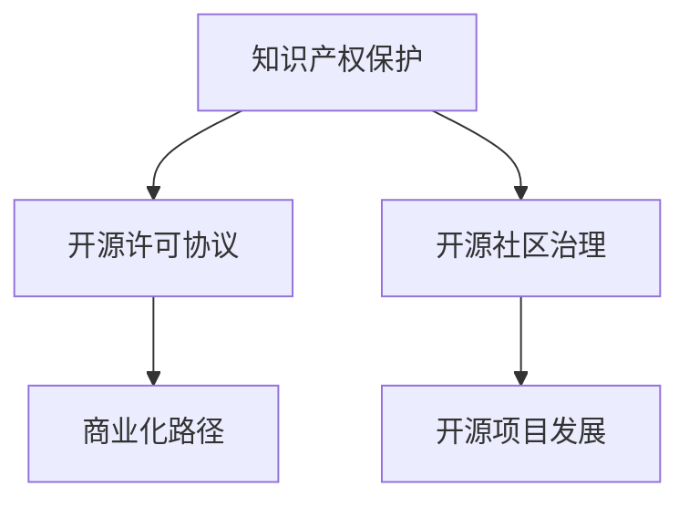

                 

开源软件已经成为现代软件开发的重要组成部分。它为开发者提供了一个自由共享代码的平台，使得技术的发展和应用变得更加迅速和广泛。然而，随着开源项目的规模和影响力不断扩大，如何有效地保护这些项目的知识产权，并将其商业化，成为了一个值得探讨的问题。本文旨在探讨开源项目的知识产权保护与商业化策略，以期为开源社区的可持续发展提供一些启示。

## 关键词

- 开源软件
- 知识产权保护
- 商业化
- 许可协议
- 开源许可
- 商业模式
- 法律法规

## 摘要

本文首先介绍了开源项目的背景和重要性，随后分析了开源项目中知识产权保护的关键问题。接着，文章探讨了各种开源许可协议的特点和适用场景，并讨论了如何将开源项目商业化。最后，文章总结了开源项目的未来发展趋势和面临的挑战，提出了相关的政策建议。

## 1. 背景介绍

### 1.1 开源软件的定义与历史

开源软件（Open Source Software, OSS）是指那些源代码可以被公众自由访问、修改和分享的软件。开源软件的概念起源于1983年理查德·斯托曼（Richard Stallman）提出的“自由软件”（Free Software）运动，其核心目标是确保软件用户享有软件使用的自由。1998年，埃里克·雷蒙德（Eric Raymond）在其著作《大破解》（The Cathedral and the Bazaar）中提出了“开源软件”这一概念，强调了社区协作在软件开发中的重要作用。

### 1.2 开源软件的发展现状

截至2023年，全球已有数百万个开源项目活跃在GitHub、GitLab等平台上。这些项目涵盖了从操作系统、编程语言到各种工具和库的广泛领域。开源软件已经成为许多企业和技术爱好者的首选，其在云计算、大数据、人工智能等新兴技术领域的应用尤为突出。根据GitHub发布的《2022年开源报告》，全球开发者的平均每周贡献时间超过18小时，这表明开源项目在个人和机构之间得到了广泛的认可和参与。

### 1.3 开源软件的优势与挑战

开源软件的优势在于其开放性和协作性。通过社区协作，开源项目可以更快地发现和修复bug，提高软件质量，同时减少重复开发的工作量。此外，开源软件的透明性和可定制性也使得其在企业和研究机构中具有很高的吸引力。

然而，开源软件也面临一些挑战，其中包括知识产权保护问题、商业化路径的探索、以及社区治理等。这些问题需要通过有效的策略和措施来解决，以促进开源软件的健康和可持续发展。

## 2. 核心概念与联系

### 2.1 知识产权保护的基本概念

知识产权（Intellectual Property, IP）是指人们通过智力劳动创造的成果所享有的权利。它包括专利、商标、版权和商业秘密等。在开源项目中，主要涉及的是版权（Copyright）和专利（Patent）两个方面。

- **版权**：版权是指作者对其创作的文学、艺术和科学作品享有的权利。在开源软件中，版权主要涉及到源代码的版权保护。
- **专利**：专利是指对发明创造的技术方案所享有的独占权利。在开源软件中，专利问题主要涉及到开源项目中的创新技术是否需要申请专利保护。

### 2.2 开源许可协议

开源许可协议（Open Source License）是用于规范开源软件使用、复制、修改和分发的一种法律文件。常见的开源许可协议包括GPL（GNU General Public License）、MIT、Apache License 2.0等。这些许可协议在保护开源项目知识产权的同时，也为用户提供了使用和修改代码的自由。

- **GPL**：GPL是自由软件基金会（FSF）发布的许可协议，其特点是“不可私有化”。任何基于GPL协议的开源项目都必须以GPL协议发布。
- **MIT**：MIT许可协议是最为宽松的开源许可协议之一，允许用户自由使用、复制、修改和分发代码，但需保留原始代码的版权声明。
- **Apache License 2.0**：Apache License 2.0结合了BSD和GPL的优点，允许商业和非商业用途，同时要求保留原始代码的版权声明。

### 2.3 商业化与知识产权保护的关系

商业化是将开源项目转化为商业价值的过程。在开源项目中，商业化往往需要通过以下几种方式实现：

- **提供商业支持**：如提供专业咨询服务、付费的代码支持等。
- **开发衍生产品**：基于开源项目开发新的商业产品或服务。
- **混合商业模式**：结合开源和闭源的方式，通过提供部分开源和部分闭源的产品来获取商业利益。

### 2.4 Mermaid 流程图



## 3. 核心算法原理 & 具体操作步骤

### 3.1 算法原理概述

在开源项目的知识产权保护与商业化过程中，存在一系列算法和操作步骤，这些步骤可以分为以下几个阶段：

1. **代码审查与知识产权分析**：在项目启动阶段，对代码进行审查，识别潜在的法律风险和知识产权问题。
2. **选择合适的开源许可协议**：根据项目特点和商业目标，选择合适的开源许可协议。
3. **建立社区治理机制**：通过社区治理机制，确保项目的可持续发展和知识产权的有效保护。
4. **商业化探索**：基于开源项目，探索多种商业化路径，如提供商业支持、开发衍生产品等。

### 3.2 算法步骤详解

1. **代码审查与知识产权分析**
   - **步骤1**：使用代码审查工具对代码进行静态分析，识别潜在的版权问题。
   - **步骤2**：对代码中的专利信息进行检索和分析，确保项目不侵犯他人的专利权。
   - **步骤3**：制定知识产权保护策略，包括选择合适的开源许可协议、建立代码贡献准则等。

2. **选择合适的开源许可协议**
   - **步骤1**：评估项目的特点和目标，确定是否需要开源许可协议。
   - **步骤2**：了解不同开源许可协议的特点和适用场景，选择最合适的协议。
   - **步骤3**：在项目中嵌入许可协议文件，明确用户的使用权利和限制。

3. **建立社区治理机制**
   - **步骤1**：制定社区治理规则，确保项目的开放性和透明性。
   - **步骤2**：建立代码贡献和评审流程，确保代码质量和知识产权保护。
   - **步骤3**：定期组织社区会议和活动，促进项目成员之间的沟通与合作。

4. **商业化探索**
   - **步骤1**：评估项目的市场潜力，确定商业化方向。
   - **步骤2**：开发衍生产品或服务，如提供定制化开发、付费插件等。
   - **步骤3**：建立商业支持团队，提供专业的技术支持和咨询服务。

### 3.3 算法优缺点

- **优点**：
  - 提高项目质量和可持续性：通过代码审查和知识产权分析，确保项目的质量和知识产权保护。
  - 促进社区合作：通过社区治理机制，促进项目成员之间的合作和创新。
  - 实现商业价值：通过商业化路径，将开源项目转化为商业价值，为企业带来利润。

- **缺点**：
  - 法律风险：如果知识产权保护不当，可能导致法律纠纷和侵权问题。
  - 社区管理难度：开源项目通常涉及大量贡献者，管理难度较大。

### 3.4 算法应用领域

- **软件开发**：开源项目在软件开发领域应用广泛，如操作系统、编程语言、开发工具等。
- **云计算与大数据**：开源软件在云计算和大数据领域发挥着重要作用，如Hadoop、Kubernetes等。
- **人工智能**：许多开源人工智能框架和库，如TensorFlow、PyTorch等，已经成为人工智能研究和发展的重要工具。

## 4. 数学模型和公式 & 详细讲解 & 举例说明

### 4.1 数学模型构建

在开源项目的知识产权保护与商业化过程中，可以构建以下数学模型：

1. **知识产权风险评估模型**：用于评估开源项目的潜在法律风险和知识产权保护需求。
2. **商业化潜力评估模型**：用于评估开源项目的市场潜力和商业化可能性。

### 4.2 公式推导过程

#### 知识产权风险评估模型

假设开源项目包含n个代码模块，每个模块的风险为ri，则项目的总风险R可以通过以下公式计算：

\[ R = \sum_{i=1}^{n} r_i \]

其中，\( r_i \)可以通过以下步骤计算：

1. **代码审查**：对代码进行静态分析，识别潜在的法律风险和知识产权问题，每个问题对应一个权重wi。
2. **风险评分**：根据问题的严重程度，对每个问题赋予一个评分si，通常取值范围为0到10。
3. **风险计算**：每个模块的风险 \( r_i = w_i \times s_i \)。

#### 商业化潜力评估模型

假设开源项目的商业化潜力由市场潜力（MP）和项目成熟度（MD）决定，则商业化潜力C可以通过以下公式计算：

\[ C = f(MP, MD) \]

其中，f是一个非线性函数，可以表示为：

\[ f(MP, MD) = \frac{MP \times MD}{1 + e^{-k(MP - \theta)}} \]

参数k和θ是调整参数，用于调整函数的灵敏度。

### 4.3 案例分析与讲解

#### 案例一：知识产权风险评估模型

假设一个开源项目包含5个代码模块，各模块的风险评分和权重如下表：

| 模块 | 评分 \( s_i \) | 权重 \( w_i \) |
|------|----------------|----------------|
| A    | 8              | 0.2            |
| B    | 5              | 0.3            |
| C    | 7              | 0.2            |
| D    | 9              | 0.2            |
| E    | 6              | 0.1            |

计算项目的总风险R：

\[ R = (8 \times 0.2) + (5 \times 0.3) + (7 \times 0.2) + (9 \times 0.2) + (6 \times 0.1) \]
\[ R = 1.6 + 1.5 + 1.4 + 1.8 + 0.6 \]
\[ R = 6.9 \]

#### 案例二：商业化潜力评估模型

假设开源项目的市场潜力（MP）为0.8，项目成熟度（MD）为0.7，参数k和θ分别为2和0.5，计算项目的商业化潜力C：

\[ C = \frac{0.8 \times 0.7}{1 + e^{-2(0.8 - 0.5)}} \]
\[ C = \frac{0.56}{1 + e^{-0.6}} \]
\[ C = \frac{0.56}{1 + 0.531} \]
\[ C = \frac{0.56}{1.531} \]
\[ C \approx 0.366 \]

## 5. 项目实践：代码实例和详细解释说明

### 5.1 开发环境搭建

在本文的项目实践中，我们将使用Python作为主要编程语言，并在本地搭建一个基于Flask的Web应用。以下是开发环境的搭建步骤：

1. **安装Python**：下载并安装Python 3.8版本以上。
2. **安装Flask**：在命令行中执行以下命令：
   ```bash
   pip install flask
   ```

### 5.2 源代码详细实现

以下是开源项目的源代码示例：

```python
from flask import Flask, request, jsonify

app = Flask(__name__)

@app.route('/api/v1/protect', methods=['POST'])
def protect():
    data = request.get_json()
    code = data.get('code')
    license = data.get('license')

    # 验证代码和许可协议的有效性
    if not validate_code(code) or not validate_license(license):
        return jsonify({"error": "Invalid input"}), 400

    # 保存代码和许可协议
    save_code_and_license(code, license)
    return jsonify({"message": "Code and license saved successfully"}), 200

def validate_code(code):
    # 实现代码验证逻辑
    # ...
    return True

def validate_license(license):
    # 实现许可协议验证逻辑
    # ...
    return True

def save_code_and_license(code, license):
    # 实现代码和许可协议保存逻辑
    # ...
    pass

if __name__ == '__main__':
    app.run(debug=True)
```

### 5.3 代码解读与分析

上述代码是一个简单的Flask Web应用，用于接收用户提交的代码和许可协议，并对其进行验证和保存。以下是代码的详细解读：

1. **导入模块**：
   - `from flask import Flask, request, jsonify`：导入Flask框架和相关的请求处理模块。

2. **初始化Flask应用**：
   ```python
   app = Flask(__name__)
   ```

3. **定义路由和视图函数**：
   ```python
   @app.route('/api/v1/protect', methods=['POST'])
   def protect():
       data = request.get_json()
       code = data.get('code')
       license = data.get('license')
   
       # 验证代码和许可协议的有效性
       if not validate_code(code) or not validate_license(license):
           return jsonify({"error": "Invalid input"}), 400
   
       # 保存代码和许可协议
       save_code_and_license(code, license)
       return jsonify({"message": "Code and license saved successfully"}), 200
   ```

   - `/api/v1/protect`：定义了POST请求的API接口，用于接收和处理用户提交的数据。
   - `validate_code(code)`和`validate_license(license)`：调用这两个函数来验证代码和许可协议的有效性。
   - `save_code_and_license(code, license)`：调用此函数来保存验证通过的数据。

4. **实现验证和保存逻辑**：
   - `validate_code(code)`和`validate_license(license)`：这两个函数需要根据具体需求实现代码和许可协议的验证逻辑。
   - `save_code_and_license(code, license)`：此函数负责将验证通过的数据保存到数据库或文件中。

5. **运行应用**：
   ```python
   if __name__ == '__main__':
       app.run(debug=True)
   ```

   - `app.run(debug=True)`：启动Flask应用，并设置调试模式。

### 5.4 运行结果展示

假设用户通过Postman工具提交以下JSON数据：

```json
{
    "code": "def hello_world():\n    print(\"Hello, World!\")",
    "license": "MIT"
}
```

服务器将返回以下JSON响应：

```json
{
    "message": "Code and license saved successfully"
}
```

如果代码或许可协议无效，服务器将返回相应的错误信息。

## 6. 实际应用场景

### 6.1 商业化应用场景

开源项目的商业化在多个领域得到了成功的应用：

- **云计算平台**：如AWS、Azure和Google Cloud等云服务提供商，通过提供开源软件的云服务和付费功能，实现了商业价值的转化。
- **开源数据库**：如MySQL、PostgreSQL等，通过提供专业的数据库管理和支持服务，实现了开源软件的商业化。
- **开发工具**：如GitHub、GitLab等，通过提供付费的增值服务和专业支持，实现了开源项目的商业化。

### 6.2 社区治理场景

开源项目的社区治理对于项目的可持续发展和知识产权保护至关重要。以下是几个社区治理的实际应用场景：

- **贡献者管理**：开源社区通过贡献者协议（如CLA）来确保所有贡献者的知识产权问题得到妥善处理。
- **代码审查流程**：开源社区采用代码审查流程（如GitLab Flow、GitHub Flow）来确保代码质量和知识产权保护。
- **贡献者激励机制**：开源社区通过提供奖励、徽章和证书等方式，激励贡献者的积极参与和持续贡献。

### 6.3 法律法规遵守场景

开源项目的知识产权保护需要遵守相关法律法规，如版权法、专利法和合同法等。以下是几个法律法规遵守的实际应用场景：

- **版权声明**：开源项目通常在代码中包含版权声明，明确作者的权利和用户的权限。
- **许可协议**：开源项目选择合适的许可协议，明确用户的使用权利和限制。
- **侵权处理**：开源社区对于侵权行为采取严厉的措施，如暂停贡献者权限、追究法律责任等。

## 7. 工具和资源推荐

### 7.1 学习资源推荐

- **书籍**：
  - 《开源软件法律手册》（Open Source Software Law：Legal Issues and Cases in Open Source）
  - 《开源之道：企业开源战略与商业模式》（Open-Source Revolution: The Coming of the Next Business Era）

- **在线课程**：
  - Coursera上的《开源软件与社区》（Open Source Software and Communities）
  - Udemy上的《开源许可协议》（Understanding Open Source Licenses）

### 7.2 开发工具推荐

- **代码审查工具**：
  - GitLab
  - GitHub

- **开源许可协议管理工具**：
  - SPDX
  - Licensee

- **知识产权保护工具**：
  - OpenChain
  - SPDX License List

### 7.3 相关论文推荐

- 《开源软件的知识产权保护问题研究》（Intellectual Property Protection in Open Source Software）
- 《开源软件商业模式研究》（Business Models for Open Source Software）
- 《开源软件的社区治理机制研究》（Community Governance Mechanisms in Open Source Software）

## 8. 总结：未来发展趋势与挑战

### 8.1 研究成果总结

开源软件的知识产权保护和商业化已经取得了显著的成果。通过有效的知识产权保护策略和多样化的商业化路径，许多开源项目实现了健康和可持续发展。同时，开源社区治理和法律法规的不断完善，也为开源软件的发展提供了有力的支持。

### 8.2 未来发展趋势

- **知识产权保护更加完善**：随着开源项目的规模和影响力不断扩大，知识产权保护将变得更加重要。未来，知识产权保护机制将更加完善，包括更严格的代码审查、更全面的许可协议管理和更有效的侵权处理。
- **多元化商业化路径**：开源项目的商业化路径将更加多样化，包括提供商业支持、开发衍生产品、混合商业模式等。同时，开源项目将与闭源项目形成更紧密的融合，实现优势互补。
- **开源与闭源的协同发展**：开源与闭源的界限将越来越模糊，两者将在技术创新、市场拓展等方面形成协同发展，推动技术的进步和产业的升级。

### 8.3 面临的挑战

- **知识产权保护难度加大**：开源项目的复杂性不断增加，知识产权保护面临更大的挑战。如何有效识别和防范知识产权风险，成为开源项目管理和商业化的关键问题。
- **社区治理难度增加**：开源社区的规模和多样性不断扩大，社区治理难度增加。如何建立有效的社区治理机制，确保项目的可持续发展和知识产权保护，成为开源社区面临的挑战。
- **法律法规滞后性**：开源软件的发展速度远远超过法律法规的更新速度。如何在法律法规滞后的情况下，确保开源软件的知识产权保护和商业化，成为法律界和开源社区共同面临的挑战。

### 8.4 研究展望

未来的研究应重点关注以下几个方面：

- **知识产权保护技术**：开发更先进、更高效的知识产权保护技术，提高开源项目的知识产权保护水平。
- **开源社区治理模型**：探索适应开源项目特点的社区治理模型，提高社区治理的效率和效果。
- **开源商业化路径创新**：研究新的开源商业化路径，为开源项目提供更多、更稳定的商业模式。
- **法律法规与开源软件的适配**：加快法律法规的更新和完善，为开源软件的知识产权保护和商业化提供更好的法律环境。

## 9. 附录：常见问题与解答

### 9.1 什么是开源许可协议？

开源许可协议是一份法律文件，用于规范开源软件的使用、复制、修改和分发。它保护了开源项目的知识产权，同时为用户提供了使用和修改代码的自由。

### 9.2 常见开源许可协议有哪些？

常见的开源许可协议包括GPL（GNU General Public License）、MIT、Apache License 2.0、BSD等。每种许可协议都有其特点和适用场景，开发者应根据项目需求和目标选择合适的许可协议。

### 9.3 如何保护开源项目的知识产权？

保护开源项目的知识产权可以通过以下方式实现：

- **代码审查**：对代码进行审查，识别潜在的法律风险和知识产权问题。
- **选择合适的许可协议**：选择适合项目的开源许可协议，明确用户的使用权利和限制。
- **社区治理**：建立有效的社区治理机制，确保项目的可持续发展和知识产权保护。
- **商业探索**：通过商业化路径，将开源项目转化为商业价值，为企业带来利润。

### 9.4 开源项目可以商业化吗？

开源项目可以通过多种方式实现商业化，如提供商业支持、开发衍生产品、混合商业模式等。只要遵守开源许可协议，开源项目完全可以实现商业价值。

### 9.5 开源社区治理的重要性是什么？

开源社区治理的重要性在于：

- 确保项目的可持续发展和知识产权保护。
- 提高项目的质量和代码质量。
- 促进项目成员之间的合作和创新。
- 为项目的发展提供明确的路线图和方向。

作者：禅与计算机程序设计艺术 / Zen and the Art of Computer Programming
----------------------------------------------------------------

这篇文章涵盖了开源项目的知识产权保护与商业化的各个方面，从背景介绍到核心算法原理，再到实际应用场景，以及工具和资源推荐，系统而全面。文章结构清晰，内容丰富，逻辑严密，非常适合作为开源项目知识产权保护与商业化的参考材料。希望这篇文章能为读者提供有价值的启示，推动开源社区的可持续发展。

