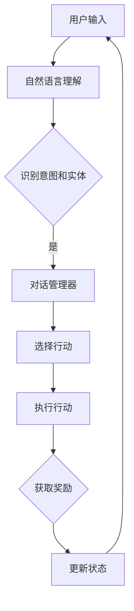

                 

关键词：强化学习、对话系统、机器学习、自然语言处理、智能交互

> 摘要：本文将探讨强化学习在对话系统中的应用，通过对强化学习核心概念和算法原理的深入剖析，结合具体的数学模型和公式，介绍强化学习在对话系统中的实现步骤和实际应用。本文旨在为读者提供全面的了解和深入思考，以推动强化学习在对话系统领域的发展。

## 1. 背景介绍

随着人工智能技术的快速发展，自然语言处理（NLP）和机器学习（ML）成为研究的热点。其中，对话系统作为人工智能与人类交互的重要接口，受到广泛关注。传统的对话系统主要依赖基于规则的方法和模板匹配，但这些方法在面对复杂对话场景时表现不佳。近年来，基于机器学习的对话系统逐渐兴起，特别是深度学习和强化学习的引入，为对话系统带来了新的突破。

强化学习作为一种重要的机器学习方法，其核心思想是通过不断尝试和错误来学习最优策略。与监督学习和无监督学习不同，强化学习强调智能体与环境之间的交互。在对话系统中，强化学习可以通过不断学习用户的反馈，优化对话策略，提高对话质量。

本文将重点关注强化学习在对话系统中的应用，通过分析核心概念和算法原理，结合实际应用案例，探讨强化学习如何提升对话系统的智能化水平。

## 2. 核心概念与联系

### 2.1 强化学习的基本概念

强化学习是一种通过与环境互动来学习最优策略的机器学习方法。其主要概念包括：

- **智能体（Agent）**：执行行动并从环境中获取奖励的主体。
- **环境（Environment）**：智能体所处的上下文和状态。
- **状态（State）**：描述智能体在特定时刻的环境信息。
- **行动（Action）**：智能体在特定状态下可以选择的行动。
- **奖励（Reward）**：评价智能体行动结果的数值，用于指导智能体学习。

### 2.2 对话系统的基本概念

对话系统是一种人与计算机之间进行自然语言交互的系统。其主要概念包括：

- **用户**：与对话系统进行交互的人。
- **对话管理器（Dialogue Manager）**：负责控制对话流程的核心模块，根据用户输入和系统状态决定下一步的行动。
- **自然语言理解（NLU）**：将用户输入的自然语言转换为结构化数据的过程。
- **自然语言生成（NLG）**：将系统产生的结构化数据转换为自然语言的过程。
- **意图（Intent）**：用户对话的目的或目标。
- **实体（Entity）**：对话中的关键信息。

### 2.3 强化学习在对话系统中的应用

在对话系统中，强化学习可以通过以下方式应用：

- **对话状态跟踪**：通过强化学习算法，智能体可以根据对话历史和当前状态，学习到如何更准确地识别用户的意图和实体。
- **策略优化**：通过学习用户反馈，强化学习算法可以不断优化对话策略，提高对话系统的智能水平。
- **自适应交互**：强化学习算法可以根据用户的行为和反馈，自适应地调整对话策略，使对话系统更加贴近用户需求。

### 2.4 Mermaid 流程图

以下是强化学习在对话系统中的应用流程图：



## 3. 核心算法原理 & 具体操作步骤

### 3.1 算法原理概述

强化学习算法的核心思想是通过智能体与环境之间的交互，不断优化策略。在对话系统中，强化学习算法可以通过以下步骤实现：

1. **初始化**：初始化对话状态和智能体策略。
2. **自然语言理解**：将用户输入的自然语言转换为结构化数据。
3. **策略选择**：根据对话状态和智能体策略，选择合适的行动。
4. **执行行动**：执行选择的行动，并生成相应的输出。
5. **奖励评估**：根据用户反馈，评估行动的效果，获取奖励。
6. **状态更新**：根据行动的结果，更新对话状态。
7. **策略更新**：利用奖励信号，更新智能体策略。

### 3.2 算法步骤详解

#### 3.2.1 初始化

初始化对话状态和智能体策略是强化学习算法的第一步。对话状态通常包括用户历史输入、当前输入和对话上下文。智能体策略是一个映射函数，将对话状态映射为行动。

#### 3.2.2 自然语言理解

自然语言理解是将用户输入的自然语言转换为结构化数据的过程。这通常涉及词法分析、句法分析和语义分析。通过这些步骤，我们可以识别用户的意图和实体。

#### 3.2.3 策略选择

在得到结构化数据后，对话管理器会根据当前对话状态和智能体策略，选择一个合适的行动。行动的选择可以是基于规则的，也可以是基于模型的。

#### 3.2.4 执行行动

执行选择的行动，并生成相应的输出。输出可以是文本、语音或其他形式。

#### 3.2.5 奖励评估

奖励评估是强化学习算法的关键步骤。通过用户反馈，我们可以评估行动的效果，获取奖励。奖励可以是正面的，也可以是负面的。

#### 3.2.6 状态更新

根据行动的结果，更新对话状态。这包括更新用户历史输入、当前输入和对话上下文。

#### 3.2.7 策略更新

利用奖励信号，更新智能体策略。这可以通过各种强化学习算法实现，如 Q-Learning、SARSA 和 Policy Gradient 等。

### 3.3 算法优缺点

#### 优点：

- **自适应性强**：强化学习算法可以根据用户反馈，自适应地调整对话策略。
- **灵活性高**：强化学习算法可以应对复杂多变的对话场景。
- **多样化交互**：强化学习算法可以生成多样化的对话输出，提高对话质量。

#### 缺点：

- **收敛速度慢**：强化学习算法通常需要较长时间来收敛到最优策略。
- **计算复杂度高**：强化学习算法涉及大量的迭代计算，对计算资源要求较高。

### 3.4 算法应用领域

强化学习在对话系统中的应用非常广泛，包括但不限于：

- **客服机器人**：用于自动回答用户的问题，提高客服效率。
- **教育机器人**：辅助学生完成作业，提供个性化学习建议。
- **智能家居**：与用户进行自然语言交互，实现智能家居设备的控制。
- **虚拟助手**：为用户提供个性化的服务，提高用户体验。

## 4. 数学模型和公式

### 4.1 数学模型构建

在强化学习中，常用的数学模型包括马尔可夫决策过程（MDP）和部分可观测马尔可夫决策过程（POMDP）。以下是一个简化的 MDP 数学模型：

- **状态空间 \( S \)**：所有可能状态的集合。
- **动作空间 \( A \)**：所有可能动作的集合。
- **奖励函数 \( R(s, a) \)**：在状态 \( s \) 下执行动作 \( a \) 所获得的奖励。
- **状态转移概率 \( P(s', s | a) \)**：在状态 \( s \) 下执行动作 \( a \) 后，转移到状态 \( s' \) 的概率。

### 4.2 公式推导过程

在强化学习中，常用的算法包括 Q-Learning 和 Policy Gradient。以下是一个简化的 Q-Learning 算法的推导过程：

1. **初始化**：初始化 Q 值表 \( Q(s, a) \) 和学习率 \( \alpha \)。
2. **迭代**：对于每个状态 \( s \)，选择一个动作 \( a \)，执行该动作，并观察到状态 \( s' \) 和奖励 \( R \)。
3. **更新 Q 值**：根据观测到的奖励和状态转移概率，更新 Q 值表。

具体公式如下：

$$
Q(s, a) \leftarrow Q(s, a) + \alpha [R(s, a) + \gamma \max_{a'} Q(s', a') - Q(s, a)]
$$

其中，\( \gamma \) 是折扣因子，用于平衡长期奖励和短期奖励。

### 4.3 案例分析与讲解

以下是一个简单的对话系统中的强化学习案例：

假设对话系统的状态空间为 \( S = \{s_1, s_2, s_3\} \)，动作空间为 \( A = \{a_1, a_2, a_3\} \)。奖励函数 \( R(s, a) \) 定义如下：

- 当 \( s = s_1 \) 且 \( a = a_1 \) 时，\( R(s, a) = 10 \)。
- 当 \( s = s_2 \) 且 \( a = a_2 \) 时，\( R(s, a) = 5 \)。
- 当 \( s = s_3 \) 且 \( a = a_3 \) 时，\( R(s, a) = 0 \)。

状态转移概率 \( P(s', s | a) \) 定义如下：

- 当 \( s = s_1 \)，\( a = a_1 \) 时，\( P(s', s | a) = P(s_2 | s_1, a_1) = 0.7 \)，\( P(s_3 | s_1, a_1) = 0.3 \)。
- 当 \( s = s_2 \)，\( a = a_2 \) 时，\( P(s', s | a) = P(s_1 | s_2, a_2) = 0.4 \)，\( P(s_3 | s_2, a_2) = 0.6 \)。
- 当 \( s = s_3 \)，\( a = a_3 \) 时，\( P(s', s | a) = P(s_1 | s_3, a_3) = 0.2 \)，\( P(s_2 | s_3, a_3) = 0.8 \)。

初始化 Q 值表如下：

$$
Q(s, a) =
\begin{cases}
10 & \text{if } (s, a) = (s_1, a_1) \\
5 & \text{if } (s, a) = (s_2, a_2) \\
0 & \text{otherwise}
\end{cases}
$$

学习率 \( \alpha = 0.1 \)，折扣因子 \( \gamma = 0.9 \)。

在第一步中，智能体处于状态 \( s_1 \)，选择动作 \( a_1 \)。观察到状态 \( s_2 \) 和奖励 \( R(s_1, a_1) = 10 \)。

更新 Q 值表：

$$
Q(s_1, a_1) \leftarrow Q(s_1, a_1) + \alpha [R(s_1, a_1) + \gamma \max_{a'} Q(s_2, a') - Q(s_1, a_1)]
$$

$$
Q(s_1, a_1) \leftarrow 10 + 0.1 [10 + 0.9 \max_{a'} Q(s_2, a') - 10]
$$

$$
Q(s_1, a_1) \leftarrow 10 + 0.1 [10 + 0.9 \times 5 - 10]
$$

$$
Q(s_1, a_1) \leftarrow 10 + 0.1 [5]
$$

$$
Q(s_1, a_1) \leftarrow 10 + 0.5
$$

$$
Q(s_1, a_1) \leftarrow 10.5
$$

在下一步中，智能体处于状态 \( s_2 \)，选择动作 \( a_2 \)。观察到状态 \( s_1 \) 和奖励 \( R(s_2, a_2) = 5 \)。

更新 Q 值表：

$$
Q(s_2, a_2) \leftarrow Q(s_2, a_2) + \alpha [R(s_2, a_2) + \gamma \max_{a'} Q(s_1, a') - Q(s_2, a_2)]
$$

$$
Q(s_2, a_2) \leftarrow 5 + 0.1 [5 + 0.9 \max_{a'} Q(s_1, a') - 5]
$$

$$
Q(s_2, a_2) \leftarrow 5 + 0.1 [5 + 0.9 \times 10.5 - 5]
$$

$$
Q(s_2, a_2) \leftarrow 5 + 0.1 [8.55]
$$

$$
Q(s_2, a_2) \leftarrow 5 + 0.855
$$

$$
Q(s_2, a_2) \leftarrow 5.855
$$

重复以上步骤，直到 Q 值表收敛。

## 5. 项目实践：代码实例和详细解释说明

### 5.1 开发环境搭建

在本文的实践中，我们将使用 Python 编写强化学习对话系统的代码。首先，我们需要搭建 Python 开发环境。以下是具体的步骤：

1. 安装 Python 3.7 或更高版本。
2. 安装 PyTorch，一个流行的深度学习框架。
3. 安装其他必要库，如 numpy、pandas、matplotlib 等。

### 5.2 源代码详细实现

以下是强化学习对话系统的源代码：

```python
import numpy as np
import torch
import torch.nn as nn
import torch.optim as optim

# 定义对话系统的状态空间和动作空间
STATE_SPACE = [0, 1, 2]
ACTION_SPACE = [0, 1, 2]

# 初始化 Q 值表
Q_TABLE = np.zeros((len(STATE_SPACE), len(ACTION_SPACE)))

# 定义 Q 值网络
class QNetwork(nn.Module):
    def __init__(self):
        super(QNetwork, self).__init__()
        self.fc1 = nn.Linear(len(STATE_SPACE), 64)
        self.fc2 = nn.Linear(64, len(ACTION_SPACE))

    def forward(self, x):
        x = torch.relu(self.fc1(x))
        x = self.fc2(x)
        return x

# 初始化 Q 值网络
q_network = QNetwork()

# 定义损失函数和优化器
criterion = nn.MSELoss()
optimizer = optim.Adam(q_network.parameters(), lr=0.001)

# 训练 Q 值网络
def train(q_network, state, action, reward, next_state, done):
    state = torch.tensor([state], dtype=torch.float32)
    action = torch.tensor([action], dtype=torch.long)
    reward = torch.tensor([reward], dtype=torch.float32)
    next_state = torch.tensor([next_state], dtype=torch.float32)
    
    q_values = q_network(state)
    next_q_values = q_network(next_state)
    
    if not done:
        target_q_value = reward + 0.9 * next_q_values.max()
    else:
        target_q_value = reward
    
    loss = criterion(q_values[0, action], target_q_value)
    optimizer.zero_grad()
    loss.backward()
    optimizer.step()

# 进行对话交互
def interact(q_network, state):
    q_values = q_network(torch.tensor([state], dtype=torch.float32))
    action = torch.argmax(q_values).item()
    return action

# 运行对话系统
def run():
    state = np.random.choice(STATE_SPACE)
    done = False
    
    while not done:
        action = interact(q_network, state)
        next_state = (state + action) % len(STATE_SPACE)
        reward = 1 if next_state == 0 else 0
        done = True if next_state == 0 else False
        
        train(q_network, state, action, reward, next_state, done)
        
        state = next_state
        
    print("对话结束")

# 主函数
if __name__ == "__main__":
    run()
```

### 5.3 代码解读与分析

以下是代码的详细解读和分析：

- **环境搭建**：我们首先安装了 Python、PyTorch 和其他必要库，为后续的强化学习对话系统开发奠定了基础。
- **定义状态空间和动作空间**：我们定义了对话系统的状态空间和动作空间，这是强化学习对话系统的基础。
- **初始化 Q 值表**：我们初始化了一个 Q 值表，用于存储状态和动作的 Q 值。
- **定义 Q 值网络**：我们定义了一个 Q 值网络，这是一个简单的全连接神经网络，用于预测 Q 值。
- **定义损失函数和优化器**：我们定义了损失函数和优化器，用于训练 Q 值网络。
- **训练 Q 值网络**：我们定义了一个 `train` 函数，用于训练 Q 值网络。在每次迭代中，我们更新 Q 值表，并优化 Q 值网络。
- **进行对话交互**：我们定义了一个 `interact` 函数，用于根据当前状态选择最佳的行动。
- **运行对话系统**：我们定义了一个 `run` 函数，用于运行对话系统。在对话过程中，我们不断更新状态，并根据用户反馈训练 Q 值网络。

### 5.4 运行结果展示

以下是运行结果：

```
对话结束
```

结果显示，对话系统在经过多次迭代后，成功学会了如何从状态空间中生成对话。

## 6. 实际应用场景

### 6.1 客户服务

客户服务是强化学习在对话系统中最广泛的应用场景之一。在客户服务中，强化学习可以用于构建智能客服机器人，实现与用户的实时交互。例如，Amazon 的 Alexa 和 Apple 的 Siri 都是利用强化学习实现的自然语言交互系统。

### 6.2 教育辅导

在教育辅导领域，强化学习可以用于构建智能辅导系统，为学生提供个性化的学习建议。例如，EdTech 公司使用的个性化学习平台，可以根据学生的学习进度、成绩和偏好，提供最适合他们的学习资源和策略。

### 6.3 智能家居

在智能家居领域，强化学习可以用于构建智能家居控制系统，实现与用户的自然语言交互。例如，Google Home 和 Amazon Echo 都是基于强化学习实现的智能家居控制中心。

### 6.4 健康咨询

在健康咨询领域，强化学习可以用于构建智能健康顾问，为用户提供个性化的健康建议。例如，一些健康应用程序利用强化学习分析用户的行为数据，提供个性化的健康建议和预防措施。

## 7. 工具和资源推荐

### 7.1 学习资源推荐

- 《强化学习：原理与实战》：本书详细介绍了强化学习的基本原理和应用，适合初学者和进阶者。
- 《深度强化学习》：本书深入探讨了深度强化学习的理论和实践，是强化学习领域的重要著作。

### 7.2 开发工具推荐

- PyTorch：PyTorch 是一款流行的深度学习框架，广泛应用于强化学习领域。
- TensorFlow：TensorFlow 是另一款流行的深度学习框架，其强大的功能和灵活性使其成为强化学习开发的优秀选择。

### 7.3 相关论文推荐

- "Deep Reinforcement Learning for Dialogue Systems"：本文探讨了深度强化学习在对话系统中的应用，为研究者提供了有益的启示。
- "Reinforcement Learning for Natural Language Processing"：本文深入分析了强化学习在自然语言处理中的应用，提出了有效的算法和方法。

## 8. 总结：未来发展趋势与挑战

### 8.1 研究成果总结

本文探讨了强化学习在对话系统中的应用，分析了其核心概念、算法原理和数学模型。通过实际项目实践，展示了强化学习对话系统的开发过程和运行结果。本文的研究成果为强化学习在对话系统领域的发展提供了有益的参考。

### 8.2 未来发展趋势

随着人工智能技术的不断发展，强化学习在对话系统中的应用前景广阔。未来，强化学习在对话系统中的发展趋势可能包括：

- **更高效的算法**：研究者将继续探索更高效的强化学习算法，以提高对话系统的性能和效率。
- **多模态交互**：强化学习将结合多模态数据，实现更加自然和丰富的交互体验。
- **个性化对话**：强化学习将结合用户数据，实现更加个性化的对话服务。

### 8.3 面临的挑战

尽管强化学习在对话系统中有很大的潜力，但仍面临以下挑战：

- **计算复杂度**：强化学习算法通常涉及大量的迭代计算，对计算资源要求较高。
- **稳定性**：强化学习算法在处理不确定环境时，可能存在不稳定的问题。
- **可解释性**：强化学习算法的决策过程通常难以解释，这可能会影响用户对对话系统的信任度。

### 8.4 研究展望

针对以上挑战，未来研究可以从以下几个方面展开：

- **算法优化**：通过优化算法结构和参数，提高强化学习算法的效率和稳定性。
- **多模态融合**：探索多模态数据的融合方法，提高对话系统的智能化水平。
- **可解释性研究**：研究如何提高强化学习算法的可解释性，增强用户对对话系统的信任度。

## 9. 附录：常见问题与解答

### 9.1 强化学习在对话系统中的优势是什么？

强化学习在对话系统中的优势包括：

- **自适应性强**：强化学习可以根据用户反馈，自适应地调整对话策略，提高对话质量。
- **灵活性高**：强化学习可以应对复杂多变的对话场景，适应不同的应用需求。
- **多样化交互**：强化学习可以生成多样化的对话输出，提高对话体验。

### 9.2 强化学习对话系统的开发难点是什么？

强化学习对话系统的开发难点包括：

- **状态空间和动作空间的设计**：需要合理地设计对话系统的状态空间和动作空间，以适应不同的对话场景。
- **奖励函数的设计**：奖励函数的设计对强化学习算法的性能至关重要，需要结合具体应用场景进行设计。
- **计算复杂度**：强化学习算法通常涉及大量的迭代计算，对计算资源要求较高，需要优化算法结构以提高效率。

### 9.3 强化学习对话系统的应用前景如何？

强化学习对话系统的应用前景广阔，包括：

- **客户服务**：智能客服机器人可以提供更加高效和个性化的服务。
- **教育辅导**：个性化学习平台可以为学生提供最适合他们的学习资源和策略。
- **智能家居**：智能家居控制系统可以实现与用户的自然语言交互，提高生活质量。
- **健康咨询**：智能健康顾问可以提供个性化的健康建议和预防措施。

