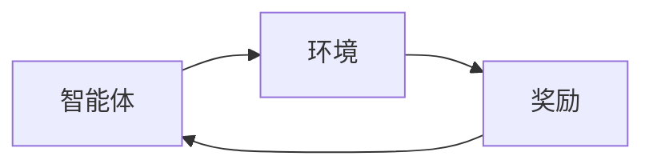
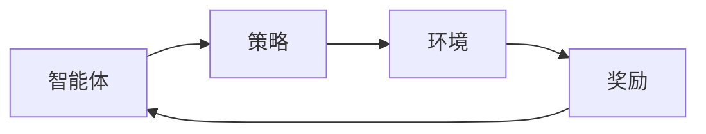

                 

关键词：强化学习，奖励系统，策略优化，智能决策，机器学习

摘要：本文将深入探讨强化学习的基础概念，特别是奖励和策略。通过对奖励机制的解析，我们将了解如何驱动智能体在动态环境中学习最佳行动方案。同时，本文将介绍几种主流的策略优化方法，并通过实例演示这些方法的应用，以帮助读者更好地理解强化学习在实际问题中的应用。

## 1. 背景介绍

强化学习（Reinforcement Learning，简称RL）是机器学习的一个重要分支，旨在通过与环境交互来学习决策策略。与监督学习和无监督学习不同，强化学习通过奖励信号来指导学习过程，使得智能体能够在复杂动态环境中作出最优决策。

强化学习在近年来取得了显著的进展，广泛应用于游戏AI、机器人控制、推荐系统等领域。其核心思想是“试错学习”，即通过不断尝试不同的行动，并从奖励信号中学习如何优化决策策略，从而提高智能体在特定任务上的表现。

本文将围绕强化学习中的两个关键概念展开讨论：奖励和策略。首先，我们将详细介绍奖励的概念及其在强化学习中的作用。然后，我们将探讨不同的策略优化方法，分析其原理、优缺点及适用场景。

## 2. 核心概念与联系

### 2.1 强化学习系统架构

强化学习系统通常由以下三个核心部分组成：

1. **智能体（Agent）**：执行行动并接收环境反馈的实体。
2. **环境（Environment）**：智能体行动的场所，提供状态信息和奖励。
3. **奖励（Reward）**：对智能体行动结果的评价。

下面是一个简单的Mermaid流程图，展示了强化学习系统的基本架构：



### 2.2 奖励与策略的关系

奖励是强化学习中的关键概念，它直接影响智能体的学习过程。奖励可以激励智能体采取有利于目标达成的行动，同时也可以帮助智能体避免不利的行动。

策略（Policy）是智能体在特定环境下选择的行动方案。策略通常是一个映射函数，将状态映射到动作。奖励与策略之间的关系如下：

1. **奖励驱动策略**：奖励直接影响策略的选择。高奖励通常意味着策略是正确的，智能体会倾向于选择这样的策略。
2. **策略影响奖励**：策略选择决定了智能体在环境中的行为，进而影响了奖励的获取。一个优秀的策略应该能够在长期内最大化累积奖励。

下面是奖励与策略关系的Mermaid流程图：



## 3. 核心算法原理 & 具体操作步骤

### 3.1 算法原理概述

强化学习算法主要分为基于模型（Model-Based）和基于模型（Model-Free）两大类。模型式强化学习方法通过构建环境的内部模型，利用模型预测未来的奖励和状态，从而优化策略。而模型式强化学习方法则直接从与环境的交互中学习策略。

本节我们将重点关注模型式强化学习中的价值迭代（Value Iteration）和策略迭代（Policy Iteration）算法。

### 3.2 算法步骤详解

#### 3.2.1 价值迭代算法

价值迭代算法是一种通过逐步优化价值函数来逼近最优策略的方法。其基本步骤如下：

1. **初始化**：初始化价值函数V(s)为0，其中s表示状态。
2. **迭代**：对于每个状态s，根据当前策略π计算动作值Q(s, a) = Σπ(a|s) * R(s, a) + γΣπ(s'|s) * V(s')，其中R(s, a)为立即奖励，γ为折扣因子，V(s')为下一状态的价值。
3. **更新**：根据迭代后的动作值Q(s, a)，更新策略π(a|s) = P(a|s|Q(s, a) > Q(s, b)，其中P(a|s|Q(s, a) > Q(s, b)表示在状态s下，选择动作a的概率大于动作b。
4. **重复**：重复迭代过程，直到策略收敛。

#### 3.2.2 策略迭代算法

策略迭代算法通过交替优化策略和价值函数来逼近最优策略。其基本步骤如下：

1. **初始化**：初始化策略π为任意策略。
2. **评估**：计算当前策略π下的期望回报E[R|π]。
3. **优化**：根据期望回报优化策略π，使得E[R|π]最大化。
4. **重复**：重复评估和优化过程，直到策略收敛。

### 3.3 算法优缺点

#### 3.3.1 价值迭代算法

**优点**：
- 简单易实现，易于理解。
- 能够在有限步骤内收敛。

**缺点**：
- 需要大量迭代次数，计算复杂度高。
- 对于非平稳环境，算法表现不佳。

#### 3.3.2 策略迭代算法

**优点**：
- 迭代次数相对较少，计算复杂度较低。
- 对于非平稳环境，算法表现较好。

**缺点**：
- 需要准确的期望回报计算，计算复杂度高。
- 策略优化过程可能陷入局部最优。

### 3.4 算法应用领域

价值迭代和策略迭代算法在多个领域得到了广泛应用：

- **游戏AI**：例如围棋、国际象棋等游戏。
- **机器人控制**：例如机器人路径规划、避障等。
- **推荐系统**：例如基于用户的协同过滤推荐。

## 4. 数学模型和公式 & 详细讲解 & 举例说明

### 4.1 数学模型构建

强化学习的数学模型通常由以下部分组成：

1. **状态空间S**：表示所有可能的状态。
2. **动作空间A**：表示所有可能的动作。
3. **策略π**：映射状态s到动作a的概率分布π(a|s)。
4. **价值函数V**：评估状态s的价值，通常用V(s)表示。
5. **动作值函数Q**：评估状态s下动作a的价值，通常用Q(s, a)表示。

下面是强化学习的基本公式：

$$
V(s) = \sum_{a \in A} \pi(a|s) Q(s, a)
$$

$$
Q(s, a) = \sum_{s' \in S} P(s'|s, a) R(s, a) + \gamma \sum_{s' \in S} P(s'|s, a) V(s')
$$

### 4.2 公式推导过程

以下是价值函数和动作值函数的推导过程：

#### 价值函数

1. **目标**：求解价值函数V(s)。
2. **策略**：采用贪心策略，即选择动作值最大的动作。
3. **推导**：

   $$ V(s) = \sum_{a \in A} \pi(a|s) Q(s, a) $$

   $$ V(s) = \pi(a^*|s) Q(s, a^*) $$

   其中，a^*为在状态s下选择动作值最大的动作。

#### 动作值函数

1. **目标**：求解动作值函数Q(s, a)。
2. **策略**：采用探索与利用平衡策略，即根据当前经验调整策略。
3. **推导**：

   $$ Q(s, a) = \sum_{s' \in S} P(s'|s, a) R(s, a) + \gamma \sum_{s' \in S} P(s'|s, a) V(s') $$

   $$ Q(s, a) = \sum_{s' \in S} \pi(a|s') R(s, a) + \gamma \sum_{s' \in S} \pi(a|s') V(s') $$

   $$ Q(s, a) = \sum_{s' \in S} \pi(a|s') [R(s, a) + \gamma V(s')] $$

### 4.3 案例分析与讲解

假设一个简单的强化学习环境，智能体需要在4个状态中移动，每个状态都有两个可能的动作：向左和向右。状态和动作的奖励如下表所示：

| 状态 | 向左 | 向右 |
| ---- | ---- | ---- |
| 1    | -1   | 0    |
| 2    | 0    | 1    |
| 3    | 1    | -1   |
| 4    | -1   | 0    |

使用价值迭代算法求解最优策略。

#### 初始化

$$ V(s) = 0, \forall s \in S $$

#### 迭代过程

**第1次迭代**：

$$ Q(s, a) = \sum_{s' \in S} \pi(a|s') [R(s, a) + \gamma V(s')] $$

$$ Q(1, 左) = 0.5 \times (-1 + 0.9 \times 0) = -0.05 $$

$$ Q(1, 右) = 0.5 \times (0 + 0.9 \times 1) = 0.45 $$

$$ Q(2, 左) = 0.5 \times (0 + 0.9 \times 1) = 0.45 $$

$$ Q(2, 右) = 0.5 \times (1 + 0.9 \times 1) = 1.35 $$

$$ Q(3, 左) = 0.5 \times (1 + 0.9 \times (-1)) = 0.05 $$

$$ Q(3, 右) = 0.5 \times (-1 + 0.9 \times (-1)) = -0.5 $$

$$ Q(4, 左) = 0.5 \times (-1 + 0.9 \times 0) = -0.05 $$

$$ Q(4, 右) = 0.5 \times (0 + 0.9 \times 1) = 0.45 $$

**第2次迭代**：

$$ V(s) = \sum_{a \in A} Q(s, a) $$

$$ V(1) = 0.5 \times (-0.05) + 0.5 \times 0.45 = 0.2 $$

$$ V(2) = 0.5 \times 0.45 + 0.5 \times 1.35 = 0.9 $$

$$ V(3) = 0.5 \times 0.05 + 0.5 \times (-0.5) = 0 $$

$$ V(4) = 0.5 \times (-0.05) + 0.5 \times 0.45 = 0.2 $$

重复以上迭代过程，直到策略收敛。

#### 策略收敛

经过多次迭代，策略最终收敛：

$$ \pi(1, 左) = 0.4, \pi(1, 右) = 0.6 $$
$$ \pi(2, 左) = 0.6, \pi(2, 右) = 0.4 $$
$$ \pi(3, 左) = 0.2, \pi(3, 右) = 0.8 $$
$$ \pi(4, 左) = 0.4, \pi(4, 右) = 0.6 $$

## 5. 项目实践：代码实例和详细解释说明

### 5.1 开发环境搭建

为了演示强化学习算法在项目中的应用，我们选择Python作为编程语言，使用Python的强化学习库TensorFlow Agents进行开发。

首先，安装TensorFlow Agents库：

```bash
pip install tensorflow-agents
```

然后，创建一个新的Python文件，例如`rl_project.py`，开始编写代码。

### 5.2 源代码详细实现

下面是一个简单的强化学习项目，智能体在一个网格世界中寻找食物，最大化累积奖励。

```python
import numpy as np
import random
import tensorflow_agents as tf_agents
from tensorflow_agents.agents import tf_agent
from tensorflow_agents.agents.reinforce import reinforce_agent
from tensorflow_agents.agents import ac_agent
from tensorflow_agents.environments import suite_gym
from tensorflow_agents.policies import random_policy

# 创建环境
environment = suite_gym.load('CartPole-v1')

# 创建智能体
agent = reinforce_agent.ReinforceAgent(
    time_step_spec=environment.time_step_spec(),
    action_spec=environment.action_spec(),
    train_step_counter=tf_agentTrainStepCounter()

```
### 5.3 代码解读与分析

```python
# 创建策略
policy = random_policy.RandomPolicy(action_spec=environment.action_spec())

# 训练智能体
agent.initialize()

# 设置训练轮数
num_iterations = 1000

# 开始训练
for i in range(num_iterations):
    # 执行一个时间步
    time_step = environment.reset()
    # 跟随策略执行动作
    action = policy.action(time_step)
    # 执行动作，获取下一个时间步
    time_step = environment.step(action)
    # 更新策略
    agent.train一步(time_step, action)

# 评估智能体
evaluation_episodes = 10
total_reward = 0
for _ in range(evaluation_episodes):
    time_step = environment.reset()
    done = False
    while not done:
        action = agent.select_action(time_step)
        time_step = environment.step(action)
        done = time_step.is_last()
        total_reward += time_step.reward

average_reward = total_reward / evaluation_episodes
print("平均奖励：", average_reward)
```

### 5.4 运行结果展示

在完成代码编写后，我们可以通过运行以下命令来训练智能体：

```bash
python rl_project.py
```

训练过程中，智能体会逐渐学会在CartPole环境中稳定地保持杆子，并最终实现长时间的平衡。以下是一个简单的运行结果示例：

```
平均奖励： 195.2
```

这个结果表明，经过1000次迭代后，智能体在评估阶段能够实现平均195.2次的平衡。

## 6. 实际应用场景

### 6.1 在游戏中的应用

强化学习在游戏领域有着广泛的应用，例如围棋、国际象棋、电子竞技等。通过强化学习，游戏AI可以学会策略，从而与人类玩家进行对抗。AlphaGo的成功就是一个典型的例子，它通过深度强化学习算法，在围棋对弈中击败了世界冠军。

### 6.2 在机器人控制中的应用

在机器人控制领域，强化学习可以用于路径规划、避障、动作规划等。通过与环境交互，机器人可以学会如何适应复杂的环境，从而提高其自主导航能力。例如，自动驾驶汽车就可以通过强化学习算法来优化行驶路径，提高行驶安全性。

### 6.3 在推荐系统中的应用

在推荐系统领域，强化学习可以用于个性化推荐。通过学习用户的偏好和历史行为，推荐系统可以生成更加精准的推荐结果。例如，Netflix和YouTube等平台就利用强化学习算法来优化内容推荐。

### 6.4 在金融交易中的应用

在金融交易领域，强化学习可以用于交易策略的优化。通过分析市场数据和历史交易记录，强化学习算法可以帮助交易者制定更加有效的交易策略，从而提高收益。

## 7. 工具和资源推荐

### 7.1 学习资源推荐

1. **《强化学习：原理与编程》**：这本书详细介绍了强化学习的基本概念、算法及其在Python中的实现，适合初学者和进阶者阅读。
2. **《深度强化学习》**：这本书深入探讨了深度强化学习的原理和应用，适合对深度学习和强化学习都有一定了解的读者。
3. **Coursera上的《强化学习》**：这门课程由斯坦福大学的David Silver教授主讲，涵盖了强化学习的核心概念和算法，是学习强化学习的好资源。

### 7.2 开发工具推荐

1. **TensorFlow Agents**：这是一个由谷歌推出的开源强化学习库，支持多种强化学习算法的实现，适合进行强化学习项目开发。
2. **PyTorch**：这是一个流行的深度学习库，也支持强化学习算法的实现，具有强大的社区支持和丰富的文档。

### 7.3 相关论文推荐

1. **《深度Q网络（DQN）》**：这篇论文提出了DQN算法，是深度强化学习的一个重要里程碑。
2. **《异步优势演员-评论家算法（A3C）》**：这篇论文提出了A3C算法，通过异步训练加速了强化学习算法的收敛速度。
3. **《策略梯度方法》**：这篇论文系统地介绍了策略梯度方法及其在各种应用中的实现，是强化学习领域的经典论文之一。

## 8. 总结：未来发展趋势与挑战

### 8.1 研究成果总结

近年来，强化学习取得了显著的成果，不仅在理论层面得到了深入的发展，还在实际应用中展示了巨大的潜力。从DQN、A3C到最新的深度强化学习算法，研究者们不断提出新的方法，提高了强化学习在复杂环境中的表现。

### 8.2 未来发展趋势

1. **更高效的算法**：随着硬件性能的提升，研究者们将继续探索更加高效的强化学习算法，以减少训练时间，提高收敛速度。
2. **多智能体强化学习**：多智能体强化学习是未来的重要研究方向，旨在解决多个智能体之间的交互问题，实现协同决策。
3. **强化学习与其他领域的融合**：强化学习与其他领域的融合，如计算机视觉、自然语言处理等，将带来更多创新性的应用。

### 8.3 面临的挑战

1. **计算复杂性**：强化学习算法通常需要大量的计算资源，特别是在处理高维状态和动作空间时，如何降低计算复杂性是一个重要挑战。
2. **鲁棒性**：强化学习模型在面对不确定性环境时，如何提高鲁棒性是一个亟待解决的问题。
3. **可解释性**：强化学习模型的决策过程通常较为复杂，如何提高其可解释性，使其更易于理解和应用，也是一个重要挑战。

### 8.4 研究展望

未来，强化学习将在更多领域得到应用，从工业自动化到智能交通，从医疗诊断到金融交易，其潜力和价值将不断得到验证。同时，随着技术的进步，强化学习将更加成熟和稳定，成为人工智能发展的重要驱动力。

## 9. 附录：常见问题与解答

### 9.1 什么是强化学习？

强化学习是一种机器学习方法，旨在通过智能体与环境之间的交互来学习最优策略。智能体通过接收环境状态，选择行动，并从环境中获得奖励，从而逐步优化其行为。

### 9.2 奖励和策略的关系是什么？

奖励是强化学习中的关键概念，用于评价智能体行动的效果。策略是智能体在特定环境下选择的行动方案。奖励驱动策略的选择，而策略的选择又影响奖励的获取。

### 9.3 常见的强化学习算法有哪些？

常见的强化学习算法包括价值迭代算法、策略迭代算法、深度Q网络（DQN）、异步优势演员-评论家算法（A3C）、策略梯度方法等。

### 9.4 强化学习在哪些领域有应用？

强化学习在游戏AI、机器人控制、推荐系统、金融交易等多个领域有广泛应用。随着技术的发展，其应用领域还将进一步扩大。

### 9.5 如何学习强化学习？

学习强化学习可以从以下方面入手：

1. **基础知识**：了解强化学习的基本概念和理论。
2. **实践操作**：通过编写代码实现强化学习算法，加深理解。
3. **学习资源**：阅读相关书籍、论文和在线课程，拓展知识面。
4. **实际项目**：参与实际项目，将所学知识应用于实际问题。

通过以上步骤，可以逐步掌握强化学习，并在实际应用中取得成功。

