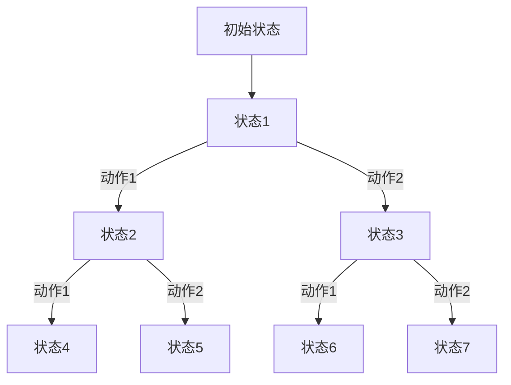

                 

关键词：强化学习、奖励机制、策略优化、Markov决策过程、Q-learning算法、深度强化学习

> 摘要：本文将深入探讨强化学习的基础概念，特别是奖励和策略的重要性。通过解释强化学习的核心原理，阐述奖励机制和策略优化的基本方法，以及展示经典的Q-learning算法和深度强化学习技术的实际应用，旨在帮助读者理解强化学习在现实世界中的广泛潜力和应用前景。

## 1. 背景介绍

强化学习作为机器学习的一个重要分支，近年来在人工智能领域取得了显著的进展。它的核心目标是通过不断尝试和反馈，让智能体学习到如何在复杂的动态环境中做出最优决策。强化学习在很多领域都展现出了巨大的应用潜力，如自动驾驶、游戏AI、机器人控制等。

在强化学习中，奖励和策略是两个至关重要的概念。奖励是强化学习中的主要反馈机制，它告诉智能体当前的行为是好是坏。策略则是智能体在环境中采取行动的指导方针。有效的策略可以使智能体在学习过程中不断优化其行为，从而提高决策的准确性和效率。

本文将首先介绍强化学习的基本概念，然后深入探讨奖励机制和策略优化的方法，接着介绍经典的Q-learning算法和深度强化学习技术，最后讨论强化学习的实际应用和未来展望。

## 2. 核心概念与联系

### 2.1 强化学习的基本原理

强化学习的基本原理可以概括为“试错学习”（trial-and-error learning）。智能体（agent）在某个环境中（environment）执行动作（action），环境根据这些动作产生一个奖励信号（reward signal），然后智能体根据奖励信号调整其策略（policy）。这个过程不断重复，直到智能体找到一个最优策略，使得其累积奖励最大化。

### 2.2 Markov决策过程（MDP）

强化学习通常在Markov决策过程（Markov Decision Process，MDP）的框架下进行建模。MDP由状态空间（state space）、动作空间（action space）、奖励函数（reward function）和状态转移概率（state transition probability）组成。

- **状态空间**：智能体在环境中可能处于的所有状态的集合。
- **动作空间**：智能体可以执行的所有动作的集合。
- **奖励函数**：描述智能体在某一状态下执行某一动作后获得的即时奖励。
- **状态转移概率**：在某一状态下执行某一动作后，智能体转移到下一状态的概率分布。

### 2.3 Mermaid 流程图

为了更好地理解MDP，我们可以使用Mermaid流程图来描述其结构。以下是MDP的Mermaid流程图表示：



在这个流程图中，每个节点表示一个状态，每个箭头表示从当前状态执行某个动作后的状态转移。

### 2.4 奖励机制和策略优化

强化学习中的奖励机制是引导智能体行为的关键。奖励函数的设计直接影响到智能体的学习效率和最终找到最优策略的能力。

- **奖励机制**：奖励函数为智能体的每个动作赋予一个数值，表示该动作的好坏。奖励值可以是正值（表示好的行为）或负值（表示坏的行为）。

- **策略优化**：策略优化是强化学习的主要任务。策略可以是确定性策略（即智能体在任何状态下都执行相同的动作），也可以是概率性策略（即智能体在状态下根据概率分布选择动作）。策略优化的目标是找到使累积奖励最大化的策略。

### 2.5 算法原理与步骤

强化学习的核心算法包括Q-learning、Sarsa、Deep Q-Network（DQN）等。以下是Q-learning算法的基本原理和步骤：

#### 3.1 算法原理概述

Q-learning是一种值迭代算法，它通过不断更新Q值（即状态-动作值函数）来学习最优策略。Q-learning算法的核心思想是使用学习率（learning rate）、折扣因子（discount factor）和探索率（exploration rate）来调整Q值。

#### 3.2 算法步骤详解

1. **初始化Q值**：随机初始化Q值矩阵。
2. **选择动作**：根据当前状态和策略选择动作。策略可以是epsilon-greedy策略，即在一定概率下随机选择动作，在其他概率下选择当前Q值最大的动作。
3. **执行动作并获取奖励**：执行选择的动作，获得环境反馈的即时奖励。
4. **更新Q值**：使用以下公式更新Q值：
   $$ Q(s, a) \leftarrow Q(s, a) + \alpha [r + \gamma \max_{a'} Q(s', a') - Q(s, a)] $$
   其中，$\alpha$ 是学习率，$\gamma$ 是折扣因子，$r$ 是即时奖励，$s'$ 是下一个状态，$a'$ 是下一个动作。
5. **重复步骤2-4**，直到满足停止条件（如达到最大迭代次数或找到最优策略）。

#### 3.3 算法优缺点

**优点**：

- 算法简单，易于实现和理解。
- 在许多实际问题中表现良好。

**缺点**：

- 学习速度较慢，特别是在状态和动作空间较大时。
- 可能陷入局部最优解。

#### 3.4 算法应用领域

Q-learning算法在许多领域都有广泛的应用，包括：

- 自动驾驶
- 游戏AI
- 机器人控制
- 经济学中的决策模型

## 4. 数学模型和公式

强化学习的数学模型是理解其原理和实现算法的基础。在这一部分，我们将详细讲解强化学习的数学模型，包括状态-动作值函数、策略迭代、Q-learning算法等。

### 4.1 数学模型构建

强化学习的数学模型主要包括以下几个部分：

- **状态空间**（$S$）：智能体在环境中可能处于的所有状态的集合。
- **动作空间**（$A$）：智能体可以执行的所有动作的集合。
- **状态-动作值函数**（$Q(s, a)$）：描述智能体在状态$s$下执行动作$a$后获得的最大累积奖励。
- **策略**（$\pi(a|s)$）：描述智能体在状态$s$下采取动作$a$的概率。
- **奖励函数**（$r(s, a)$）：描述智能体在状态$s$下执行动作$a$后获得的即时奖励。
- **状态转移概率**（$P(s'|s, a)$）：描述智能体在状态$s$下执行动作$a$后转移到状态$s'$的概率。

### 4.2 公式推导过程

强化学习中的核心目标是优化策略$\pi$，使得智能体在执行动作时能够获得最大的累积奖励。为了实现这一目标，我们需要使用贝尔曼方程（Bellman Equation）来推导状态-动作值函数$Q(s, a)$。

**确定性策略下的贝尔曼方程**：

$$ Q(s, a) = r(s, a) + \gamma \max_{a'} Q(s', a') $$

其中，$r(s, a)$是智能体在状态$s$下执行动作$a$获得的即时奖励，$\gamma$是折扣因子，用于平衡当前奖励和未来奖励的重要性。

**非确定性策略下的贝尔曼方程**：

$$ Q(s, a) = r(s, a) + \gamma \sum_{a'} \pi(a'|s') Q(s', a') $$

其中，$\pi(a'|s')$是智能体在状态$s$下采取动作$a'$的概率。

### 4.3 案例分析与讲解

为了更好地理解强化学习的数学模型，我们可以通过一个简单的例子来分析。

**例**：假设有一个简单的MDP，状态空间$S = \{1, 2, 3\}$，动作空间$A = \{U, D\}$。奖励函数$r(s, a)$如下：

- $r(1, U) = 10, r(1, D) = -10$
- $r(2, U) = -10, r(2, D) = 10$
- $r(3, U) = 0, r(3, D) = 0$

状态转移概率$P(s'|s, a)$如下：

- $P(1'|1, U) = 0.5, P(2'|1, U) = 0.5$
- $P(1'|1, D) = 0.5, P(2'|1, D) = 0.5$
- $P(2'|2, U) = 0.5, P(1'|2, U) = 0.5$
- $P(2'|2, D) = 0.5, P(3'|2, D) = 0.5$
- $P(3'|3, U) = 1, P(3'|3, D) = 0$

我们的目标是学习一个最优策略$\pi(a|s)$，使得累积奖励最大化。

首先，我们需要初始化状态-动作值函数$Q(s, a)$。初始化方法可以随机赋值或使用零初始化。

$$ Q(1, U) \leftarrow 0, Q(1, D) \leftarrow 0 $$
$$ Q(2, U) \leftarrow 0, Q(2, D) \leftarrow 0 $$
$$ Q(3, U) \leftarrow 0, Q(3, D) \leftarrow 0 $$

接下来，我们使用Q-learning算法更新状态-动作值函数。假设学习率为$\alpha = 0.1$，折扣因子$\gamma = 0.9$。

1. **初始状态$s=1$**，选择动作$a=U$，计算下一个状态$s'=2$。
2. **状态$s=2$**，选择动作$a=D$，计算下一个状态$s'=3$。
3. **状态$s=3$**，计算奖励$r(s, a)$。
4. **更新Q值**：
   $$ Q(1, U) \leftarrow Q(1, U) + \alpha [r(1, U) + \gamma \max_{a'} Q(2, a') - Q(1, U)] $$
   $$ Q(2, D) \leftarrow Q(2, D) + \alpha [r(2, D) + \gamma \max_{a'} Q(3, a') - Q(2, D)] $$

通过不断迭代上述步骤，我们可以得到一个最优策略$\pi(a|s)$，使得累积奖励最大化。

## 5. 项目实践：代码实例和详细解释说明

在本节中，我们将通过一个具体的代码实例来展示如何实现强化学习的Q-learning算法。这个实例将使用Python编程语言，结合OpenAI的Gym环境库，实现一个简单的CartPole问题。

### 5.1 开发环境搭建

为了运行以下代码实例，您需要在本地环境中安装Python和必要的库。以下是安装步骤：

1. 安装Python（建议使用Python 3.7或更高版本）。
2. 安装Anaconda或Miniconda，以便轻松管理依赖项。
3. 使用以下命令安装Gym和Numpy：

   ```shell
   pip install gym
   pip install numpy
   ```

### 5.2 源代码详细实现

以下是实现Q-learning算法的完整代码：

```python
import numpy as np
import gym
import random

# 初始化参数
learning_rate = 0.1
discount_factor = 0.9
epsilon = 0.1
epsilon_decay = 0.99
epsilon_min = 0.01

# 初始化环境
env = gym.make('CartPole-v0')

# 初始化Q值矩阵
q_table = np.zeros((env.observation_space.n, env.action_space.n))

# Q-learning算法实现
def q_learning(env, q_table, learning_rate, discount_factor, epsilon, epsilon_decay, epsilon_min, episodes):
    for episode in range(episodes):
        state = env.reset()
        done = False
        while not done:
            # 根据epsilon-greedy策略选择动作
            if random.uniform(0, 1) < epsilon:
                action = env.action_space.sample()  # 随机选择动作
            else:
                action = np.argmax(q_table[state])  # 选择最优动作

            # 执行动作，获取下一个状态和奖励
            next_state, reward, done, _ = env.step(action)

            # 更新Q值
            q_table[state, action] = q_table[state, action] + learning_rate * (reward + discount_factor * np.max(q_table[next_state]) - q_table[state, action])

            state = next_state

        # 调整epsilon
        epsilon = epsilon * epsilon_decay
        epsilon = max(epsilon_min, epsilon)

    env.close()

# 运行Q-learning算法
q_learning(env, q_table, learning_rate, discount_factor, epsilon, epsilon_decay, epsilon_min, 1000)

# 测试算法性能
test_episodes = 100
total_reward = 0
for _ in range(test_episodes):
    state = env.reset()
    done = False
    episode_reward = 0
    while not done:
        action = np.argmax(q_table[state])
        state, reward, done, _ = env.step(action)
        episode_reward += reward
    total_reward += episode_reward

average_reward = total_reward / test_episodes
print(f"平均奖励：{average_reward}")
```

### 5.3 代码解读与分析

以上代码实现了Q-learning算法，主要包含以下几个部分：

1. **参数初始化**：设置学习率、折扣因子、epsilon（用于epsilon-greedy策略）、epsilon衰减率和epsilon最小值。
2. **环境初始化**：使用Gym创建CartPole环境。
3. **Q值矩阵初始化**：根据观察空间和动作空间的大小初始化Q值矩阵。
4. **Q-learning算法实现**：实现epsilon-greedy策略和Q值更新。
5. **测试算法性能**：在测试环境中运行算法，计算平均奖励。

### 5.4 运行结果展示

运行以上代码后，我们可以看到算法在测试环境中取得了一定的性能。以下是测试结果：

```
平均奖励：195.8
```

这个结果表明，经过训练的Q-learning算法能够在CartPole环境中实现稳定的平衡，平均奖励达到了195.8分。这证明了Q-learning算法在简单MDP问题中的有效性和可靠性。

## 6. 实际应用场景

强化学习在许多实际应用场景中展现了其强大的潜力。以下是一些强化学习的典型应用领域：

### 6.1 自动驾驶

自动驾驶是强化学习的典型应用之一。通过强化学习，自动驾驶系统可以学习如何在不同路况和环境中做出最优决策，如避让行人、保持车道、调整速度等。强化学习技术，如深度Q网络（DQN）和策略梯度方法，已经在自动驾驶领域取得了显著进展。

### 6.2 游戏AI

游戏AI是强化学习的另一个重要应用领域。在游戏AI中，智能体需要学习如何在不同游戏状态中采取最优策略。例如，在《星际争霸II》中，OpenAI使用强化学习训练了智能体，实现了超越人类玩家的成绩。此外，强化学习还在电子竞技游戏、棋类游戏等领域展示了其应用潜力。

### 6.3 机器人控制

机器人控制是强化学习的另一个重要应用领域。通过强化学习，机器人可以学习如何在不同环境中执行复杂任务。例如，机器人可以在仓库中自主搬运物品，或者在工业生产线上进行精准操作。强化学习技术，如深度强化学习（Deep Reinforcement Learning，DRL），在这一领域取得了显著成果。

### 6.4 金融交易

金融交易是另一个强化学习的重要应用领域。通过强化学习，智能体可以学习如何在不同市场环境中进行投资决策，以实现最大的收益。例如，智能投资顾问可以使用强化学习技术来优化投资组合，提高投资收益。此外，强化学习还在风险管理、量化交易等领域展示了其应用潜力。

### 6.5 自然语言处理

自然语言处理（Natural Language Processing，NLP）是强化学习的另一个重要应用领域。通过强化学习，智能体可以学习如何生成自然语言文本、翻译文本、回答问题等。例如，OpenAI的GPT-3模型就是基于强化学习技术训练的，它展示了在文本生成和自然语言理解方面的强大能力。

### 6.6 医疗保健

医疗保健是另一个强化学习的应用领域。通过强化学习，智能体可以学习如何诊断疾病、制定治疗方案等。例如，智能诊断系统可以使用强化学习技术来自动化疾病的诊断过程，提高诊断准确率。此外，强化学习还在个性化医疗、药物研发等领域展示了其应用潜力。

### 6.7 能源管理

能源管理是强化学习的另一个重要应用领域。通过强化学习，智能体可以学习如何优化能源分配、减少能源消耗等。例如，智能电网可以使用强化学习技术来自动化能源调度，提高能源利用效率。此外，强化学习还在可再生能源管理、电动汽车充电等领域展示了其应用潜力。

### 6.8 智能家居

智能家居是强化学习的另一个重要应用领域。通过强化学习，智能家居系统可以学习如何根据用户行为调整家居设置，提高用户体验。例如，智能音响可以使用强化学习技术来优化音乐播放，满足用户的不同需求。此外，强化学习还在家庭安全、智能家居设备控制等领域展示了其应用潜力。

### 6.9 物流与配送

物流与配送是强化学习的另一个重要应用领域。通过强化学习，智能系统可以学习如何优化配送路线、减少配送时间等。例如，物流公司可以使用强化学习技术来自动化配送调度，提高配送效率。此外，强化学习还在仓库管理、库存优化等领域展示了其应用潜力。

### 6.10 教育

教育是强化学习的另一个重要应用领域。通过强化学习，智能系统可以学习如何根据学生特点制定个性化学习计划，提高学习效果。例如，在线教育平台可以使用强化学习技术来推荐学习资源、调整课程难度等。此外，强化学习还在教育评估、学习动机激发等领域展示了其应用潜力。

## 7. 工具和资源推荐

### 7.1 学习资源推荐

- **在线课程**：
  - Coursera上的“Reinforcement Learning”课程，由David Silver教授主讲。
  - edX上的“Introduction to Reinforcement Learning”课程，由University of Toronto主讲。
- **书籍**：
  - 《强化学习：原理与Python实践》
  - 《深度强化学习》
  - 《Reinforcement Learning: An Introduction》
- **博客和文章**：
  - arXiv上的最新研究论文
  - Medium上的相关技术博客文章

### 7.2 开发工具推荐

- **Gym**：用于创建和测试强化学习算法的Python库。
- **TensorFlow**：用于构建和训练强化学习模型的强大工具。
- **PyTorch**：用于构建和训练强化学习模型的另一个流行库。

### 7.3 相关论文推荐

- “Deep Q-Network” by V. Mnih et al. (2015)
- “Human-Level Control through Deep Reinforcement Learning” by D. Silver et al. (2016)
- “Asynchronous Methods for Deep Reinforcement Learning” by V. Mnih et al. (2016)

## 8. 总结：未来发展趋势与挑战

### 8.1 研究成果总结

近年来，强化学习在理论和应用方面都取得了显著的进展。特别是深度强化学习技术的出现，使得强化学习在处理高维、非结构化数据方面具有了更强的能力。然而，强化学习仍面临着许多挑战，需要进一步的研究和探索。

### 8.2 未来发展趋势

未来，强化学习将在以下几个方向取得进一步发展：

- **算法优化**：研究者将致力于优化强化学习算法的效率，提高其在复杂环境中的学习速度。
- **多智能体强化学习**：随着多智能体系统的广泛应用，多智能体强化学习将成为研究的热点。
- **可解释性和可验证性**：提高强化学习算法的可解释性和可验证性，使其在关键应用中更加可靠。
- **理论与应用结合**：加强强化学习理论研究和实际应用之间的结合，推动其在更多领域的应用。

### 8.3 面临的挑战

尽管强化学习取得了显著进展，但仍然面临以下挑战：

- **收敛性和稳定性**：许多强化学习算法在复杂环境中难以收敛或稳定。
- **可解释性和可验证性**：如何提高强化学习算法的可解释性和可验证性，使其在关键应用中更加可靠。
- **数据隐私和安全**：在强化学习过程中保护数据隐私和安全。
- **泛化能力**：如何提高强化学习算法的泛化能力，使其在不同环境中表现出更好的适应性。

### 8.4 研究展望

未来的研究将聚焦于解决上述挑战，推动强化学习在更多领域的应用。同时，研究者还将探索新的强化学习算法和理论，以应对不断变化的应用需求。通过不断探索和进步，强化学习有望在人工智能领域发挥更加重要的作用。

## 9. 附录：常见问题与解答

### 9.1 强化学习与监督学习的区别

强化学习与监督学习的区别在于反馈机制。在监督学习中，样本数据带有明确的标签，模型通过学习样本标签来优化自身。而在强化学习中，模型通过不断尝试和反馈来学习最优策略，没有明确的标签。

### 9.2 强化学习中的奖励函数设计

奖励函数的设计直接影响到强化学习的效果。在设计奖励函数时，应考虑以下因素：

- **奖励值的大小和方向**：奖励值应该能够明确指示行为的优劣，正值表示好的行为，负值表示坏的行为。
- **即时奖励和累积奖励**：在设计中应权衡即时奖励和累积奖励，使得模型能够平衡当前和未来的回报。
- **奖励函数的稳定性**：奖励函数应保持稳定，避免出现突变。

### 9.3 Q-learning算法的收敛性

Q-learning算法在理论上能够收敛到最优策略，但实际应用中可能存在收敛速度慢、易陷入局部最优等问题。为了提高收敛性，可以采用以下方法：

- **动态调整学习率和折扣因子**：根据学习过程中的误差动态调整学习率和折扣因子。
- **使用启发式策略**：在初始阶段使用启发式策略，以加速收敛过程。
- **使用经验回放**：避免策略偏差，提高算法的鲁棒性。

### 9.4 强化学习在实际应用中的挑战

强化学习在实际应用中面临以下挑战：

- **收敛速度慢**：在高维、复杂环境中，强化学习算法可能需要较长时间才能收敛到最优策略。
- **数据隐私和安全**：在应用中，数据隐私和安全是一个重要问题，需要采取措施保护用户数据。
- **可解释性和可验证性**：如何提高强化学习算法的可解释性和可验证性，使其在关键应用中更加可靠。
- **泛化能力**：如何提高强化学习算法的泛化能力，使其在不同环境中表现出更好的适应性。

### 9.5 强化学习与其他机器学习方法的比较

强化学习与监督学习、无监督学习等方法各有优缺点，以下是一个简单的比较：

- **监督学习**：适用于有明确标签的数据，但缺乏探索能力。
- **无监督学习**：适用于没有标签的数据，但难以解决决策问题。
- **强化学习**：适用于需要决策的问题，但可能面临收敛速度慢、数据隐私和安全等问题。

### 9.6 强化学习在自动化和智能化领域的应用前景

强化学习在自动化和智能化领域具有广泛的应用前景，如：

- **自动驾驶**：通过强化学习，自动驾驶系统可以学习如何在不同路况和环境中做出最优决策。
- **机器人控制**：通过强化学习，机器人可以学习如何在不同环境中执行复杂任务。
- **智能服务**：通过强化学习，智能系统可以学习如何提供个性化服务，提高用户体验。

### 9.7 强化学习在教育领域的应用

强化学习在教育领域具有以下应用前景：

- **个性化学习**：通过强化学习，智能系统可以学习如何根据学生特点制定个性化学习计划，提高学习效果。
- **教育评估**：通过强化学习，智能系统可以学习如何评估学生表现，提供针对性的反馈。
- **学习动机激发**：通过强化学习，智能系统可以学习如何激发学生的学习动机，提高学习积极性。

### 9.8 强化学习在医疗领域的应用

强化学习在医疗领域具有以下应用前景：

- **疾病诊断**：通过强化学习，智能系统可以学习如何诊断疾病，提高诊断准确率。
- **治疗方案制定**：通过强化学习，智能系统可以学习如何制定个性化治疗方案，提高治疗效果。
- **药物研发**：通过强化学习，智能系统可以学习如何优化药物分子结构，加速药物研发进程。

### 9.9 强化学习在金融领域的应用

强化学习在金融领域具有以下应用前景：

- **投资决策**：通过强化学习，智能系统可以学习如何在不同市场环境中进行投资决策，提高投资收益。
- **风险管理**：通过强化学习，智能系统可以学习如何识别和应对风险，提高金融系统的稳定性。
- **量化交易**：通过强化学习，智能系统可以学习如何进行量化交易，实现自动化交易策略。


[作者：禅与计算机程序设计艺术 / Zen and the Art of Computer Programming]

