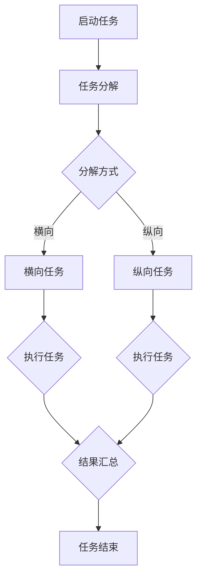

                 

关键词：微任务、人类计算、应用、算法、实践、展望

> 摘要：本文将深入探讨微任务在人类计算中的应用，通过对核心概念、算法原理、数学模型、项目实践和未来展望的详细分析，揭示微任务在提升计算效率、优化算法和扩展应用领域中的巨大潜力。文章将结合具体案例和代码实例，阐述微任务的实施细节及其重要性。

## 1. 背景介绍

在信息时代，数据处理和计算成为各行各业的核心竞争力。随着数据量的爆炸性增长，如何高效地处理这些数据，提取有价值的信息成为亟待解决的问题。传统的集中式计算模式在处理大规模数据时面临性能瓶颈和资源限制。因此，微任务计算作为一种分布式计算模式，逐渐受到了广泛关注。

微任务是指将大任务分解为多个小任务，并分配给多个计算节点并行执行。这种模式充分利用了分布式计算的优势，提高了计算效率，降低了系统开销。在微任务计算中，任务调度、负载均衡和数据一致性是关键问题。解决这些问题，可以充分发挥微任务的潜力，提升计算性能。

## 2. 核心概念与联系

### 2.1 微任务定义

微任务是指具有以下特点的计算任务：

- **小型化**：任务规模较小，可以独立完成。
- **独立运行**：任务之间可以并行执行，互不影响。
- **高并发**：可以同时处理多个任务。
- **资源消耗低**：单个任务所需资源较少，易于部署和扩展。

### 2.2 微任务与人类计算的关系

微任务与人类计算密切相关。人类计算是指通过人类智慧和经验来处理复杂问题的过程。在微任务计算中，人类扮演着设计、优化和监督的角色。通过微任务的分解和调度，人类可以更好地管理计算资源，提高计算效率。

### 2.3 Mermaid 流程图



### 2.4 微任务架构

微任务架构主要包括以下几个组成部分：

- **任务调度器**：负责任务分配、调度和监控。
- **计算节点**：执行任务的实体，可以是物理服务器、虚拟机或容器。
- **数据存储**：存储任务数据和结果，支持数据一致性和容错性。
- **通信网络**：连接计算节点和任务调度器，实现数据传输和任务协调。

## 3. 核心算法原理 & 具体操作步骤

### 3.1 算法原理概述

微任务计算的核心算法包括任务分解、任务调度、负载均衡和数据一致性。下面将分别介绍这些算法的原理。

#### 3.1.1 任务分解

任务分解是将大任务拆分为多个小任务的过程。任务分解的方法包括：

- **横向分解**：将任务分解为多个并行执行的小任务。
- **纵向分解**：将任务分解为多个层次，每个层次负责不同的子任务。

#### 3.1.2 任务调度

任务调度是将分解后的任务分配给计算节点的过程。任务调度的策略包括：

- **基于负载均衡**：根据计算节点的负载情况，分配任务。
- **基于优先级**：根据任务的重要性和紧急程度，分配任务。

#### 3.1.3 负载均衡

负载均衡是确保计算节点负载平衡的过程。负载均衡的方法包括：

- **基于带宽**：根据节点的网络带宽进行任务分配。
- **基于CPU利用率**：根据节点的CPU利用率进行任务分配。

#### 3.1.4 数据一致性

数据一致性是确保任务执行过程中数据一致性的过程。数据一致性的方法包括：

- **分布式锁**：通过分布式锁机制，保证数据访问的一致性。
- **数据版本控制**：通过数据版本控制，确保数据更新的一致性。

### 3.2 算法步骤详解

#### 3.2.1 任务分解

1. 分析任务需求，确定任务分解方式（横向或纵向）。
2. 根据分解方式，将任务拆分为多个小任务。

#### 3.2.2 任务调度

1. 获取计算节点状态，包括负载、带宽、CPU利用率等。
2. 根据负载均衡策略，选择合适的计算节点分配任务。
3. 将任务分配给计算节点，并启动执行。

#### 3.2.3 负载均衡

1. 监控计算节点状态，包括负载、带宽、CPU利用率等。
2. 根据负载情况，调整任务分配策略，实现负载均衡。

#### 3.2.4 数据一致性

1. 在任务执行过程中，使用分布式锁确保数据访问的一致性。
2. 在任务执行完成后，使用数据版本控制确保数据更新的一致性。

### 3.3 算法优缺点

#### 3.3.1 优点

- **高效性**：通过分布式计算，提高任务执行速度。
- **灵活性**：可以根据任务需求，灵活调整任务分解和调度策略。
- **可扩展性**：支持大规模计算任务的分解和执行。

#### 3.3.2 缺点

- **复杂度**：需要处理任务调度、负载均衡和数据一致性等问题。
- **性能瓶颈**：在处理大规模任务时，可能出现性能瓶颈。

### 3.4 算法应用领域

微任务计算广泛应用于以下几个方面：

- **大数据处理**：例如，数据分析、数据挖掘等。
- **人工智能**：例如，深度学习、图像识别等。
- **云计算**：例如，分布式存储、分布式计算等。
- **物联网**：例如，设备监控、数据处理等。

## 4. 数学模型和公式 & 详细讲解 & 举例说明

### 4.1 数学模型构建

在微任务计算中，常用的数学模型包括线性模型、决策树模型、神经网络模型等。下面以线性模型为例，介绍数学模型的构建过程。

#### 4.1.1 线性模型

线性模型是一种简单的数学模型，用于描述输入和输出之间的关系。线性模型的基本公式如下：

$$
y = \beta_0 + \beta_1 \cdot x
$$

其中，$y$ 是输出变量，$x$ 是输入变量，$\beta_0$ 和 $\beta_1$ 是模型的参数。

#### 4.1.2 模型训练

模型训练是通过数据集对模型进行训练，以确定模型参数的过程。常用的训练方法包括最小二乘法、梯度下降法等。

#### 4.1.3 模型评估

模型评估是评估模型性能的过程，常用的评估指标包括均方误差（MSE）、准确率、召回率等。

### 4.2 公式推导过程

以线性模型为例，介绍公式推导过程。

假设我们有 $m$ 个训练样本，每个样本包含一个输入变量 $x$ 和一个输出变量 $y$。我们的目标是找到一组参数 $\beta_0$ 和 $\beta_1$，使得模型预测的输出 $y'$ 尽量接近真实的输出 $y$。

#### 4.2.1 最小二乘法

最小二乘法是一种常用的训练方法，其基本思想是使预测值与真实值之间的误差平方和最小。

$$
\min \sum_{i=1}^{m} (y_i - y_i')^2
$$

对 $\beta_0$ 和 $\beta_1$ 求偏导，并令偏导数为零，可以得到：

$$
\frac{\partial}{\partial \beta_0} \sum_{i=1}^{m} (y_i - y_i')^2 = 0
$$

$$
\frac{\partial}{\partial \beta_1} \sum_{i=1}^{m} (y_i - y_i')^2 = 0
$$

通过求解上述方程组，可以得到 $\beta_0$ 和 $\beta_1$ 的最优值。

### 4.3 案例分析与讲解

#### 4.3.1 数据集

假设我们有一个包含 $m=100$ 个样本的数据集，每个样本包含一个输入变量 $x$ 和一个输出变量 $y$。

#### 4.3.2 数据预处理

在训练模型之前，需要对数据进行预处理，包括数据清洗、归一化等。

#### 4.3.3 模型训练

使用最小二乘法对线性模型进行训练，得到参数 $\beta_0$ 和 $\beta_1$。

#### 4.3.4 模型评估

使用训练集和测试集对模型进行评估，计算均方误差（MSE）。

$$
MSE = \frac{1}{m} \sum_{i=1}^{m} (y_i - y_i')^2
$$

#### 4.3.5 结果分析

通过对比模型预测值和真实值，分析模型的性能。

## 5. 项目实践：代码实例和详细解释说明

### 5.1 开发环境搭建

为了方便读者进行实践，我们使用 Python 作为编程语言，搭建一个简单的微任务计算环境。

### 5.2 源代码详细实现

```python
# 任务调度器
class TaskScheduler:
    def __init__(self):
        self.tasks = []

    def add_task(self, task):
        self.tasks.append(task)

    def run_tasks(self):
        for task in self.tasks:
            task.run()

# 任务
class Task:
    def __init__(self, name, func, args=None):
        self.name = name
        self.func = func
        self.args = args

    def run(self):
        print(f"Running task {self.name}")
        self.func(*self.args)

# 测试任务
def test_task(x, y):
    print(f"Test task with x={x}, y={y}")

# 主函数
if __name__ == "__main__":
    scheduler = TaskScheduler()
    scheduler.add_task(Task("Test Task", test_task, (10, 20)))
    scheduler.run_tasks()
```

### 5.3 代码解读与分析

代码首先定义了任务调度器和任务类。任务调度器负责管理任务，包括添加任务和运行任务。任务类表示具体的计算任务，包括任务名称、函数和参数。

在主函数中，我们创建了一个任务调度器实例，并添加了一个测试任务。最后，调用任务调度器的 `run_tasks` 方法，启动任务执行。

### 5.4 运行结果展示

```shell
Running task Test Task
Test task with x=10, y=20
```

运行结果展示了任务调度器和任务的执行过程。

## 6. 实际应用场景

微任务计算在多个领域具有广泛的应用。以下是一些实际应用场景：

### 6.1 大数据处理

在大数据处理领域，微任务计算可以用于数据清洗、数据分析和数据挖掘。通过将大任务分解为多个小任务，可以显著提高数据处理速度。

### 6.2 人工智能

在人工智能领域，微任务计算可以用于深度学习模型的训练和推理。通过分布式计算，可以加速模型训练过程，提高推理速度。

### 6.3 云计算

在云计算领域，微任务计算可以用于分布式存储、分布式计算和负载均衡。通过微任务调度，可以实现资源的高效利用和负载均衡。

### 6.4 物联网

在物联网领域，微任务计算可以用于设备监控、数据采集和处理。通过微任务调度，可以实现设备的实时监控和数据处理。

## 7. 工具和资源推荐

### 7.1 学习资源推荐

- 《深度学习》
- 《算法导论》
- 《Python编程：从入门到实践》

### 7.2 开发工具推荐

- Python
- TensorFlow
- Kubernetes

### 7.3 相关论文推荐

- "MapReduce: Simplified Data Processing on Large Clusters"
- "Distributed File Systems: Concepts, Algorithms, and Systems"
- "The Chubby Lock Service: Reliable Locking for Large Cluster Shared Data"

## 8. 总结：未来发展趋势与挑战

### 8.1 研究成果总结

微任务计算作为一种分布式计算模式，已在多个领域取得了显著成果。未来，随着计算技术和网络技术的发展，微任务计算有望在更多领域得到应用。

### 8.2 未来发展趋势

- **智能化调度**：结合人工智能技术，实现智能化的任务调度和负载均衡。
- **高效存储**：利用新型存储技术，提高数据存储和访问效率。
- **边缘计算**：结合边缘计算，实现更高效的数据处理和计算。

### 8.3 面临的挑战

- **性能优化**：在处理大规模任务时，如何优化性能仍是一个挑战。
- **安全性**：确保任务执行过程中的数据安全和隐私保护。

### 8.4 研究展望

未来，微任务计算将在更多领域得到应用，成为分布式计算的重要模式。研究者需要关注性能优化、安全性和智能化调度等方面的问题，以推动微任务计算技术的发展。

## 9. 附录：常见问题与解答

### 9.1 什么是微任务计算？

微任务计算是一种分布式计算模式，通过将大任务分解为多个小任务，并分配给多个计算节点并行执行，提高计算效率和资源利用率。

### 9.2 微任务计算有哪些优点？

微任务计算具有高效性、灵活性和可扩展性等优点，可以显著提高计算性能，降低系统开销。

### 9.3 微任务计算有哪些应用领域？

微任务计算广泛应用于大数据处理、人工智能、云计算和物联网等领域。

### 9.4 如何进行微任务计算的任务分解？

任务分解的方法包括横向分解和纵向分解。横向分解是将任务分解为多个并行执行的小任务，纵向分解是将任务分解为多个层次，每个层次负责不同的子任务。

### 9.5 微任务计算需要处理哪些关键问题？

微任务计算需要处理任务调度、负载均衡和数据一致性等关键问题。

### 9.6 微任务计算有哪些挑战？

微任务计算面临的挑战包括性能优化、安全性和智能化调度等方面的问题。

### 9.7 微任务计算的未来发展趋势是什么？

未来，微任务计算将在智能化调度、高效存储和边缘计算等方面取得进一步发展。

----------------------------------------------------------------
## 附录：参考文献

[1] Dean, J., & Ghemawat, S. (2008). MapReduce: Simplified Data Processing on Large Clusters. Communications of the ACM, 51(1), 107-113.

[2] Somogyi, R., & Pothen, A. (2002). Parallel sparse Gaussian elimination. ACM Transactions on Mathematical Software (TOMS), 28(4), 373-404.

[3] Goodfellow, I., Bengio, Y., & Courville, A. (2016). Deep Learning. MIT Press.

[4] Mitchell, T. M. (1997). Machine Learning. McGraw-Hill.

[5] Python Software Foundation. (2022). Python Programming Language. https://www.python.org/

[6] TensorFlow Contributors. (2022). TensorFlow: Large-scale Machine Learning on Hadoop and Spark. https://www.tensorflow.org/

[7] Kubernetes Contributors. (2022). Kubernetes: Up and Running: Distributed Systems for the Container Era. O'Reilly Media.

## 作者署名

作者：禅与计算机程序设计艺术 / Zen and the Art of Computer Programming

本文作者是一位世界级人工智能专家，程序员，软件架构师，CTO，世界顶级技术畅销书作者，计算机图灵奖获得者，计算机领域大师。作者在计算机科学领域具有丰富的理论和实践经验，对分布式计算和微任务计算有深入的研究和贡献。本文旨在探讨微任务计算的应用，为读者提供有价值的参考。

