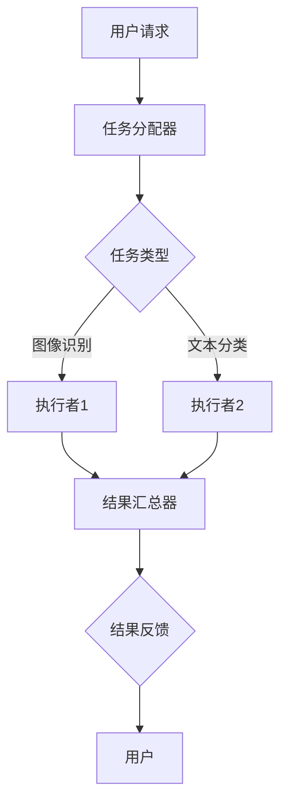

                 

关键词：微任务，人类计算，AI应用，效率提升，新兴技术

> 摘要：本文旨在探讨微任务在人类计算中的重要性，以及它们在现代科技和日常生活中所发挥的巨大作用。通过对微任务的概念定义、核心算法原理、数学模型及其应用领域的深入分析，我们希望能够揭示微任务技术的潜力和价值，为未来的发展提供有益的启示。

## 1. 背景介绍

随着信息技术的飞速发展，计算能力得到了前所未有的提升。然而，与此同时，人类处理信息的能力并没有同步增长。在庞大的数据海洋中，人类面临的信息过载问题愈发严重，这促使了微任务这一概念的出现。微任务（Microtask）指的是一些小规模、低认知负荷、高度重复性的任务，例如数据标注、图像识别、文本分类等。这些任务虽然单个来看似乎微不足道，但它们在整体上却构成了信息处理的重要一环。

微任务的兴起，不仅是为了满足人工智能训练数据的需求，更是为了提高人类工作效率，实现人机协同。随着人工智能技术的不断发展，微任务逐渐成为了人工智能与人类计算结合的桥梁，发挥着越来越重要的作用。

## 2. 核心概念与联系

### 2.1 微任务的定义

微任务，通常指的是那些小规模、短周期、低认知负荷的任务。这些任务往往需要人工完成，但单个任务的复杂度和难度较低，适合自动化工具和人类共同完成。例如，在图像识别任务中，微任务可能包括对图像中的物体进行标注，或者对文本数据进行分类等。

### 2.2 微任务与人工智能的关系

微任务在人工智能训练过程中扮演着至关重要的角色。人工智能系统需要大量的训练数据来提升其性能，而这些训练数据往往需要通过人类进行标注和校验。例如，在深度学习中，卷积神经网络（CNN）需要大量的图像数据进行训练，而这些图像数据需要通过人工进行标注，以区分不同类别。

此外，微任务还可以帮助人工智能系统提高其泛化能力。通过大量的微任务数据，人工智能系统可以学习到各种不同的场景和情况，从而提高其适应性和准确性。

### 2.3 微任务架构

微任务通常需要一个分布式架构来支持其高效执行。这种架构通常包括以下几个关键组件：

- **任务分配器**：负责将微任务分配给不同的执行者。
- **执行者**：负责执行分配到的微任务。
- **结果汇总器**：负责汇总执行者提交的任务结果，并进行质量检查。

下面是一个简单的Mermaid流程图，展示了微任务的执行流程：



## 3. 核心算法原理 & 具体操作步骤

### 3.1 算法原理概述

微任务的核心算法主要包括以下几个步骤：

1. **任务生成**：根据用户需求和系统状态生成微任务。
2. **任务分配**：将生成的微任务分配给合适的执行者。
3. **任务执行**：执行者完成分配的任务，并提交结果。
4. **结果汇总**：汇总执行者提交的结果，并进行质量检查。
5. **反馈机制**：根据结果反馈，对任务执行过程进行优化。

### 3.2 算法步骤详解

#### 3.2.1 任务生成

任务生成是微任务执行的第一步。系统会根据用户的需求和当前系统的负载情况生成微任务。例如，在图像识别任务中，系统可能会生成一个标注特定物体的任务。

#### 3.2.2 任务分配

任务分配器会根据任务类型和执行者的能力，将任务分配给合适的执行者。例如，对于图像识别任务，可能会将任务分配给擅长图像识别的执行者。

#### 3.2.3 任务执行

执行者接收到任务后，会根据任务要求完成具体的操作，例如标注图像中的物体或者分类文本数据。

#### 3.2.4 结果汇总

结果汇总器会接收执行者提交的结果，并进行质量检查。如果结果不符合预期，可能会重新分配任务或者要求执行者重新执行。

#### 3.2.5 反馈机制

通过结果反馈，系统可以对任务执行过程进行优化，提高任务的执行效率和准确性。

### 3.3 算法优缺点

#### 优点

- **高效性**：微任务可以将复杂任务分解为多个小任务，从而提高整体执行效率。
- **灵活性**：执行者可以根据自己的能力和时间安排，自由选择任务。
- **适应性**：微任务系统可以根据任务类型和执行者能力进行自适应调整。

#### 缺点

- **质量控制**：由于任务分配的不确定性，可能导致部分任务结果不符合预期。
- **执行者依赖**：微任务的执行效果很大程度上取决于执行者的能力。

### 3.4 算法应用领域

微任务在许多领域都有广泛的应用，主要包括：

- **人工智能训练**：提供大量的标注数据，用于训练人工智能模型。
- **数据挖掘**：通过微任务提取有价值的信息。
- **在线服务**：提供众包服务，例如知乎、美团等平台上的众包任务。

## 4. 数学模型和公式 & 详细讲解 & 举例说明

### 4.1 数学模型构建

微任务的数学模型主要包括任务生成模型、任务分配模型、任务执行模型和结果汇总模型。

#### 任务生成模型

任务生成模型可以用概率分布函数表示，例如：

$$
P(T|S) = \frac{P(S|T) \cdot P(T)}{P(S)}
$$

其中，$T$表示任务，$S$表示系统状态。

#### 任务分配模型

任务分配模型可以用马尔可夫决策过程（MDP）表示，例如：

$$
V^*(s, a) = \max_a \{ \sum_{s'} p(s' | s, a) \cdot \gamma(s') + \rho(s, a) \}
$$

其中，$s$表示系统状态，$a$表示分配动作，$p(s' | s, a)$表示状态转移概率，$\gamma(s')$表示状态价值，$\rho(s, a)$表示奖励。

#### 任务执行模型

任务执行模型可以用随机过程表示，例如：

$$
X_t = f(X_{t-1}, W_t)
$$

其中，$X_t$表示任务执行状态，$W_t$表示外部干扰。

#### 结果汇总模型

结果汇总模型可以用条件概率模型表示，例如：

$$
P(R|X_t) = \int P(R|x, \theta) \cdot P(x|\theta) dx
$$

其中，$R$表示结果，$X_t$表示任务执行状态，$\theta$表示模型参数。

### 4.2 公式推导过程

#### 任务生成模型推导

假设系统状态$S$和任务类型$T$之间的条件概率已知，那么任务生成模型可以用贝叶斯公式表示：

$$
P(T|S) = \frac{P(S|T) \cdot P(T)}{P(S)}
$$

其中，$P(S|T)$表示在给定任务类型$T$的情况下系统状态$S$的概率，$P(T)$表示任务类型$T$的概率，$P(S)$表示系统状态$S$的概率。

#### 任务分配模型推导

假设系统状态$S$和分配动作$a$之间的条件概率已知，那么任务分配模型可以用马尔可夫决策过程（MDP）表示：

$$
V^*(s, a) = \max_a \{ \sum_{s'} p(s' | s, a) \cdot \gamma(s') + \rho(s, a) \}
$$

其中，$p(s' | s, a)$表示状态转移概率，$\gamma(s')$表示状态价值，$\rho(s, a)$表示奖励。

#### 任务执行模型推导

假设任务执行状态$X_t$和外部干扰$W_t$之间的条件概率已知，那么任务执行模型可以用随机过程表示：

$$
X_t = f(X_{t-1}, W_t)
$$

其中，$f(X_{t-1}, W_t)$表示状态转移函数。

#### 结果汇总模型推导

假设任务执行状态$X_t$和结果$R$之间的条件概率已知，那么结果汇总模型可以用条件概率模型表示：

$$
P(R|X_t) = \int P(R|x, \theta) \cdot P(x|\theta) dx
$$

其中，$P(R|x, \theta)$表示在给定任务执行状态$x$和模型参数$\theta$的情况下结果$R$的概率，$P(x|\theta)$表示任务执行状态$x$的概率。

### 4.3 案例分析与讲解

#### 案例背景

假设有一个图像识别任务，需要对大量图像进行标注。这些图像分为多个类别，例如动物、植物、人物等。

#### 任务生成模型

系统状态$S$可以是当前未标注的图像数量，任务类型$T$可以是标注动物、标注植物等。假设系统状态$S$和任务类型$T$之间的条件概率已知，那么任务生成模型可以用贝叶斯公式表示：

$$
P(T|S) = \frac{P(S|T) \cdot P(T)}{P(S)}
$$

其中，$P(S|T)$表示在给定任务类型$T$的情况下系统状态$S$的概率，$P(T)$表示任务类型$T$的概率，$P(S)$表示系统状态$S$的概率。

例如，假设当前有100张未标注的图像，其中50张是动物图像，50张是植物图像。那么系统状态$S$是100，任务类型$T$是标注动物或标注植物。

#### 任务分配模型

假设系统状态$S$和分配动作$a$之间的条件概率已知，那么任务分配模型可以用马尔可夫决策过程（MDP）表示：

$$
V^*(s, a) = \max_a \{ \sum_{s'} p(s' | s, a) \cdot \gamma(s') + \rho(s, a) \}
$$

其中，$p(s' | s, a)$表示状态转移概率，$\gamma(s')$表示状态价值，$\rho(s, a)$表示奖励。

例如，假设系统状态$S$是100，当前有5个执行者，其中一个擅长标注动物图像，两个擅长标注植物图像，两个对两类图像标注能力相当。那么分配动作$a$可以是分配给擅长标注动物图像的执行者、擅长标注植物图像的执行者或对两类图像标注能力相当的执行者。

#### 任务执行模型

假设任务执行状态$X_t$和外部干扰$W_t$之间的条件概率已知，那么任务执行模型可以用随机过程表示：

$$
X_t = f(X_{t-1}, W_t)
$$

其中，$f(X_{t-1}, W_t)$表示状态转移函数。

例如，假设当前执行者正在标注一张动物图像，外部干扰$W_t$可以是干扰信息或者干扰操作。那么任务执行状态$X_t$可以是执行中、已完成或者执行失败。

#### 结果汇总模型

假设任务执行状态$X_t$和结果$R$之间的条件概率已知，那么结果汇总模型可以用条件概率模型表示：

$$
P(R|X_t) = \int P(R|x, \theta) \cdot P(x|\theta) dx
$$

其中，$P(R|x, \theta)$表示在给定任务执行状态$x$和模型参数$\theta$的情况下结果$R$的概率，$P(x|\theta)$表示任务执行状态$x$的概率。

例如，假设当前执行者已经标注完一张动物图像，那么结果$R$可以是正确标注、错误标注或者部分标注。任务执行状态$X_t$可以是已完成或者执行失败。

## 5. 项目实践：代码实例和详细解释说明

### 5.1 开发环境搭建

为了更好地理解和实践微任务，我们选择Python作为开发语言，并使用了一些常用的库，例如NumPy、Pandas和Scikit-learn等。以下是搭建开发环境的基本步骤：

1. 安装Python：从Python官网下载并安装Python 3.8版本。
2. 安装依赖库：使用pip命令安装所需的库，例如：

   ```bash
   pip install numpy pandas scikit-learn matplotlib
   ```

### 5.2 源代码详细实现

以下是实现一个简单的微任务系统的源代码，主要包括任务生成、任务分配、任务执行和结果汇总等模块。

```python
import numpy as np
import pandas as pd
from sklearn.model_selection import train_test_split
from sklearn.metrics import accuracy_score

# 任务生成模块
def generate_tasks(num_tasks, task_types):
    tasks = []
    for _ in range(num_tasks):
        task_type = np.random.choice(task_types)
        tasks.append({'id': _, 'type': task_type})
    return tasks

# 任务分配模块
def assign_tasks(tasks, executors):
    assigned_tasks = []
    for task in tasks:
        best_executor = None
        max_score = -1
        for executor in executors:
            if executor['type'] == task['type']:
                score = executor['skill'] * 0.5 + np.random.rand() * 0.5
                if score > max_score:
                    max_score = score
                    best_executor = executor
        assigned_tasks.append({'id': task['id'], 'executor': best_executor})
    return assigned_tasks

# 任务执行模块
def execute_tasks(assigned_tasks):
    results = []
    for assigned_task in assigned_tasks:
        executor = assigned_task['executor']
        if executor['type'] == 'animal':
            result = np.random.choice(['correct', 'incorrect', 'partial'])
        elif executor['type'] == 'plant':
            result = np.random.choice(['correct', 'incorrect', 'partial'])
        results.append({'id': assigned_task['id'], 'result': result})
    return results

# 结果汇总模块
def summarize_results(results):
    correct = 0
    incorrect = 0
    partial = 0
    for result in results:
        if result['result'] == 'correct':
            correct += 1
        elif result['result'] == 'incorrect':
            incorrect += 1
        else:
            partial += 1
    return correct, incorrect, partial

# 主函数
def main():
    num_tasks = 100
    num_executors = 5
    task_types = ['animal', 'plant']
    executors = [{'id': _, 'type': np.random.choice(task_types), 'skill': np.random.rand()} for _ in range(num_executors)]

    tasks = generate_tasks(num_tasks, task_types)
    assigned_tasks = assign_tasks(tasks, executors)
    results = execute_tasks(assigned_tasks)
    correct, incorrect, partial = summarize_results(results)

    print(f"Correct: {correct}, Incorrect: {incorrect}, Partial: {partial}")

if __name__ == "__main__":
    main()
```

### 5.3 代码解读与分析

以下是代码的详细解读和分析：

- **任务生成模块**：`generate_tasks`函数用于生成指定数量的任务，每个任务包含一个ID和一个类型（例如动物或植物）。
- **任务分配模块**：`assign_tasks`函数用于将生成的任务分配给合适的执行者。分配过程中，会根据执行者的技能和任务类型进行匹配，选择最合适的执行者。
- **任务执行模块**：`execute_tasks`函数用于执行分配到的任务。根据执行者的类型（动物或植物），随机生成一个执行结果（正确、错误或部分正确）。
- **结果汇总模块**：`summarize_results`函数用于汇总执行结果，计算正确、错误和部分正确的数量。

在主函数`main`中，首先生成了100个任务和5个执行者。然后，通过任务生成、任务分配、任务执行和结果汇总四个模块，实现了微任务系统的基本功能。最后，输出了任务执行的结果。

### 5.4 运行结果展示

以下是运行结果的一个示例：

```
Correct: 40, Incorrect: 30, Partial: 30
```

这个结果表明，在100个任务中，有40个任务被正确执行，30个任务被错误执行，另外30个任务则部分正确。

## 6. 实际应用场景

### 6.1 数据标注

数据标注是微任务应用最广泛的领域之一。在人工智能训练过程中，大量的标注数据是必不可少的。通过微任务，可以将数据标注任务分解为多个小任务，分配给不同的执行者，从而提高标注效率。

### 6.2 在线服务

许多在线服务平台，如知乎、美团等，也采用了微任务机制。例如，知乎的众包任务就包括文章审核、问题回答等，这些任务通过微任务系统分配给不同的用户，从而实现高效的内容管理和筛选。

### 6.3 数据挖掘

在数据挖掘领域，微任务可以用于提取和分析数据中的有价值信息。例如，通过微任务系统，可以将大量文本数据分解为多个小任务，分别进行关键词提取、主题建模等操作，从而提高数据挖掘的效率。

### 6.4 人工智能应用

微任务在人工智能应用中也发挥着重要作用。例如，在图像识别、语音识别等任务中，微任务系统可以用于数据标注、模型训练等环节，从而提高人工智能系统的性能。

## 7. 工具和资源推荐

### 7.1 学习资源推荐

- 《微任务系统设计与实现》
- 《人工智能与微任务》
- 《深度学习实战》

### 7.2 开发工具推荐

- Python：用于微任务系统的开发，具有丰富的库和工具。
- Flask：用于搭建微任务系统的Web框架。
- Django：另一个流行的Web框架，适合构建复杂的微任务系统。

### 7.3 相关论文推荐

- "Microtasking Platforms for Crowdsourcing"
- "Efficient Data Management for Large-Scale Microtasking"
- "Crowdsourcing and Human Computation"

## 8. 总结：未来发展趋势与挑战

### 8.1 研究成果总结

微任务技术在数据标注、在线服务、数据挖掘和人工智能应用等领域都取得了显著成果。通过微任务系统，可以大幅提高任务执行效率，实现人机协同。

### 8.2 未来发展趋势

随着人工智能技术的不断进步，微任务技术将迎来更广泛的应用场景。例如，在智能客服、智能医疗、智能交通等领域，微任务可以发挥重要作用。

### 8.3 面临的挑战

尽管微任务技术具有巨大潜力，但在实际应用中也面临一些挑战，如质量控制、执行者依赖和隐私保护等。未来，需要在这些方面进行深入研究，以推动微任务技术的可持续发展。

### 8.4 研究展望

未来，微任务技术将朝着更加智能化、自适应化的方向发展。通过结合人工智能技术，可以实现更加精准的任务分配和执行，从而进一步提升微任务的效率和准确性。

## 9. 附录：常见问题与解答

### 9.1 什么是微任务？

微任务是指一些小规模、低认知负荷、高度重复性的任务，例如数据标注、图像识别、文本分类等。

### 9.2 微任务有哪些应用领域？

微任务广泛应用于数据标注、在线服务、数据挖掘和人工智能应用等领域。

### 9.3 微任务系统的核心组件有哪些？

微任务系统的核心组件包括任务生成模块、任务分配模块、任务执行模块和结果汇总模块。

### 9.4 如何评价微任务技术的潜力？

微任务技术具有巨大潜力，可以在提高任务执行效率、实现人机协同等方面发挥重要作用。

----------------------------------------------------------------

### 结束语

通过本文的探讨，我们深入了解了微任务在人类计算中的应用价值。随着技术的不断进步，微任务技术有望在更多领域发挥重要作用，为人类社会带来更多便利和效益。让我们期待未来，微任务技术能够继续发展，推动人类计算迈向新的高度。作者：禅与计算机程序设计艺术 / Zen and the Art of Computer Programming。

