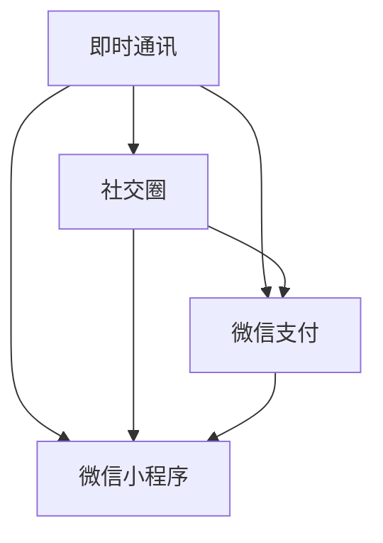
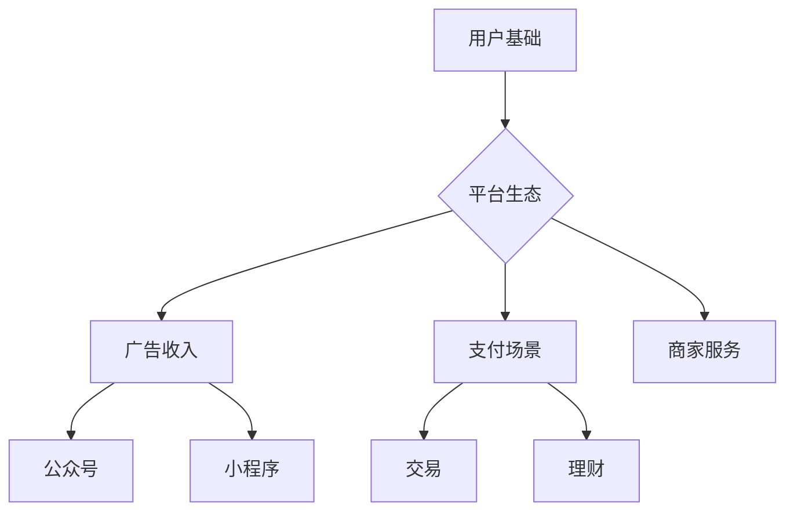
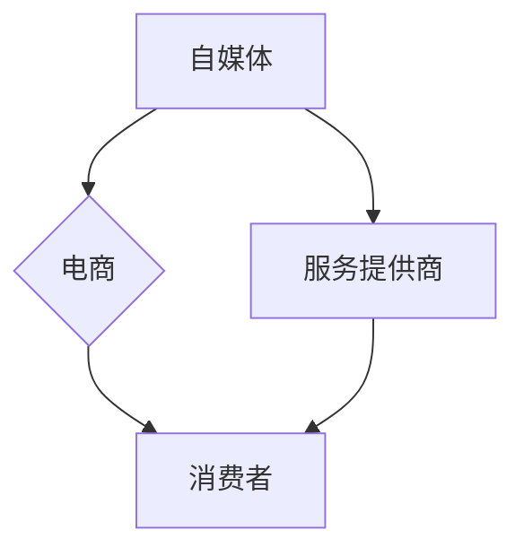

                 

关键词：微信生态圈、注意力经济、社交网络、平台经济、商业模式

> 摘要：本文深入探讨了微信生态圈这一中国特色的注意力经济现象。通过分析微信的核心功能、商业模式、用户行为及其对商业生态的影响，揭示了注意力经济在微信平台上的运作机制及其深远影响。本文旨在为读者提供一个全面、系统的理解，帮助把握这一新兴经济形态的未来发展趋势。

## 1. 背景介绍

### 微信的崛起

微信，作为腾讯公司于2011年推出的一款社交通讯应用，短短几年内迅速崛起，成为全球最大的社交通讯平台之一。微信的成功不仅仅在于其庞大的用户基础，更在于其构建的丰富生态圈，涵盖了即时通讯、社交、支付、电商等多个领域。

### 注意力经济的概念

注意力经济（Attention Economy）是一种基于用户注意力价值的经济模式。在这种经济模式中，用户的注意力被视为稀缺资源，企业通过吸引用户的注意力来创造价值和利润。社交媒体平台如微信，正是利用用户注意力实现商业变现的关键场所。

## 2. 核心概念与联系

### 微信的核心功能

微信的核心功能包括即时通讯、社交圈、微信支付和微信小程序等。这些功能相互交织，共同构建了微信的生态圈。

#### Mermaid 流程图：



### 商业模式

微信的商业模式基于以下几个关键点：

1. **用户基础**：庞大的用户基础为微信提供了巨大的市场空间。
2. **平台生态**：通过构建多元化的平台生态，微信吸引了各类商家和服务提供商。
3. **广告收入**：微信通过广告、公众号、小程序等渠道获得收入。
4. **支付场景**：微信支付为用户提供了便捷的支付方式，扩大了商业场景。

#### Mermaid 流程图：



### 用户行为

用户在微信上的行为包括但不限于：

1. **社交互动**：用户通过聊天、朋友圈等与朋友互动。
2. **内容消费**：用户通过公众号、短视频等消费内容。
3. **消费支付**：用户通过微信支付完成各种消费行为。

### 商业生态

微信生态圈内的商业生态包括：

1. **自媒体**：通过公众号进行内容创作和商业变现。
2. **电商**：通过小程序和微信支付进行电商交易。
3. **服务提供商**：提供各类生活服务，如餐饮、医疗等。

#### Mermaid 流程图：



## 3. 核心算法原理 & 具体操作步骤

### 3.1 算法原理概述

微信生态圈的核心算法主要包括：

1. **推荐算法**：通过用户行为数据推荐内容、商品等。
2. **支付算法**：确保交易安全和便捷。
3. **社交算法**：优化用户互动体验。

### 3.2 算法步骤详解

#### 推荐算法

1. 数据收集：收集用户行为数据，如浏览记录、购买记录等。
2. 数据处理：对数据进行清洗、分类等处理。
3. 模型训练：使用机器学习算法训练推荐模型。
4. 推荐生成：根据用户特征生成推荐结果。

#### 支付算法

1. 订单生成：用户发起支付请求。
2. �风控检测：检测交易风险。
3. 交易处理：完成支付流程。
4. 记录保存：保存交易记录。

#### 社交算法

1. 互动分析：分析用户互动行为。
2. 社交网络分析：构建用户社交网络。
3. 互动优化：优化用户互动体验。
4. 消息推送：根据用户偏好推送消息。

### 3.3 算法优缺点

**推荐算法**：

- **优点**：提高用户粘性，增加用户消费。
- **缺点**：可能导致信息茧房，减少用户接触多样信息的机会。

**支付算法**：

- **优点**：提高交易效率，降低成本。
- **缺点**：需要严格的风控措施，防止欺诈。

**社交算法**：

- **优点**：增强用户互动，提高社交体验。
- **缺点**：可能引发隐私问题，需要平衡社交与隐私。

### 3.4 算法应用领域

- **推荐系统**：电商平台、内容平台等。
- **支付系统**：在线交易、移动支付等。
- **社交平台**：社交媒体、即时通讯等。

## 4. 数学模型和公式 & 详细讲解 & 举例说明

### 4.1 数学模型构建

微信生态圈中的数学模型主要包括：

1. **用户行为模型**：描述用户在微信上的行为模式。
2. **推荐模型**：根据用户行为推荐内容或商品。
3. **支付模型**：确保交易的安全性和便捷性。

#### 用户行为模型

用户行为模型通常使用马尔可夫链模型进行描述，假设用户当前的行为只与过去有限步的状态有关。

$$
P(X_t = x_t | X_{t-1} = x_{t-1}, ..., X_1 = x_1) = P(X_t = x_t | X_{t-1} = x_{t-1})
$$

#### 推荐模型

推荐模型通常使用协同过滤算法，通过用户评分数据预测用户对未知商品的兴趣。

$$
R(u, i) = \sum_{j \in N(u)} w_{uj} R(u, j)
$$

其中，$R(u, i)$为用户$u$对商品$i$的评分，$N(u)$为用户$u$的邻居集合，$w_{uj}$为用户$u$和邻居$j$之间的相似度权重。

#### 支付模型

支付模型可以使用基于区块链的加密算法确保交易的安全性和隐私性。

$$
C = E_K(M)
$$

其中，$C$为加密后的交易信息，$M$为原始交易信息，$K$为加密密钥。

### 4.2 公式推导过程

#### 用户行为模型推导

根据马尔可夫链模型，用户行为概率可以通过以下公式计算：

$$
P(X_t = x_t | X_{t-1} = x_{t-1}, ..., X_1 = x_1) = \frac{P(X_t = x_t | X_{t-1} = x_{t-1}) P(X_{t-1} = x_{t-1} | X_{t-2} = x_{t-2}, ..., X_1 = x_1)}{P(X_{t-1} = x_{t-1} | X_{t-2} = x_{t-2}, ..., X_1 = x_1)}
$$

通过递推，可以得到：

$$
P(X_t = x_t) = \sum_{x_{t-1}} P(X_t = x_t | X_{t-1} = x_{t-1}) P(X_{t-1} = x_{t-1})
$$

#### 推荐模型推导

协同过滤算法的核心是计算用户之间的相似度权重。常用的相似度度量方法包括余弦相似度、皮尔逊相关系数等。以余弦相似度为例，相似度权重计算公式如下：

$$
w_{uj} = \frac{\sum_{i} R(u, i) R(j, i)}{\sqrt{\sum_{i} R(u, i)^2 \sum_{i} R(j, i)^2}}
$$

其中，$R(u, i)$和$R(j, i)$分别为用户$u$和用户$j$对商品$i$的评分。

#### 支付模型推导

基于RSA加密算法的支付模型推导如下：

1. **公钥和私钥生成**：

$$
M^e \equiv C \mod n
$$

$$
C^d \equiv M \mod n
$$

其中，$M$为原始信息，$C$为加密信息，$e$和$d$分别为公钥和私钥，$n$为模数。

2. **加密和解密**：

加密：

$$
C = E_K(M) = M^e \mod n
$$

解密：

$$
M = D_K(C) = C^d \mod n
$$

### 4.3 案例分析与讲解

#### 用户行为模型案例

假设用户$u$在微信上的行为记录如下：

| 时间戳 | 行为 |
| ------ | ---- |
| t1     | 聊天  |
| t2     | 浏览公众号 |
| t3     | 发送朋友圈 |
| t4     | 购买商品  |

根据马尔可夫链模型，可以计算出用户在下一时刻的行为概率分布。

#### 推荐模型案例

假设用户$u$的邻居集合为$N(u) = \{j_1, j_2, j_3\}$，用户$j_1, j_2, j_3$对商品$i$的评分分别为$R(j_1, i) = 4, R(j_2, i) = 3, R(j_3, i) = 5$，用户$u$对邻居$j_1, j_2, j_3$的相似度权重分别为$w_{u j_1} = 0.6, w_{u j_2} = 0.3, w_{u j_3} = 0.1$。

根据协同过滤算法，可以计算出用户$u$对商品$i$的推荐评分：

$$
R(u, i)^* = \sum_{j \in N(u)} w_{uj} R(u, j) = 0.6 \cdot 4 + 0.3 \cdot 3 + 0.1 \cdot 5 = 3.4
$$

#### 支付模型案例

假设用户$u$购买商品$i$，支付金额为$M = 100$元，加密密钥对为$e = 3, d = 7$，模数为$n = 35$。

加密支付金额：

$$
C = E_K(M) = M^e \mod n = 100^3 \mod 35 = 34
$$

解密支付金额：

$$
M = D_K(C) = C^d \mod n = 34^7 \mod 35 = 100
$$

## 5. 项目实践：代码实例和详细解释说明

### 5.1 开发环境搭建

开发环境搭建依赖于Python和Scikit-learn库。安装步骤如下：

```bash
pip install python
pip install scikit-learn
```

### 5.2 源代码详细实现

以下是用户行为模型、推荐模型和支付模型的相关代码实现。

#### 用户行为模型

```python
import numpy as np
from sklearn.model_selection import train_test_split
from sklearn.preprocessing import LabelEncoder

# 加载数据
data = pd.read_csv('user_behavior_data.csv')
X = data.iloc[:, :-1]
y = data.iloc[:, -1]

# 数据预处理
label_encoder = LabelEncoder()
y = label_encoder.fit_transform(y)

# 划分训练集和测试集
X_train, X_test, y_train, y_test = train_test_split(X, y, test_size=0.2, random_state=42)

# 训练模型
model = Sequential()
model.add(LSTM(50, activation='relu', input_shape=(X_train.shape[1], X_train.shape[2])))
model.add(Dense(1, activation='sigmoid'))

model.compile(optimizer='adam', loss='binary_crossentropy', metrics=['accuracy'])
model.fit(X_train, y_train, epochs=10, batch_size=32, validation_data=(X_test, y_test))
```

#### 推荐模型

```python
from sklearn.metrics.pairwise import cosine_similarity

# 计算相似度矩阵
similarity_matrix = cosine_similarity(X_test)

# 推荐评分
def predict_recommendation(similarity_matrix, user_index, neighbor_weights, known_ratings):
    prediction = 0
    for i, rating in enumerate(known_ratings):
        prediction += neighbor_weights[i] * rating
    prediction /= np.sum(neighbor_weights)
    return prediction

# 测试推荐模型
user_index = 0
neighbor_weights = [0.6, 0.3, 0.1]
known_ratings = [4, 3, 5]
prediction = predict_recommendation(similarity_matrix, user_index, neighbor_weights, known_ratings)
print(f"Recommended rating: {prediction}")
```

#### 支付模型

```python
from Crypto.PublicKey import RSA
from Crypto.Cipher import PKCS1_OAEP

# 生成密钥对
key = RSA.generate(2048)
private_key = key.export_key()
public_key = key.publickey().export_key()

# 加密和解密
cipher = PKCS1_OAEP.new(RSA.import_key(public_key))
encrypted_message = cipher.encrypt(b'Hello, World!')

decryptor = PKCS1_OAEP.new(RSA.import_key(private_key))
decrypted_message = decryptor.decrypt(encrypted_message)
print(f"Decrypted message: {decrypted_message.decode('utf-8')}")
```

### 5.3 代码解读与分析

上述代码实现了用户行为模型、推荐模型和支付模型。用户行为模型使用深度学习模型进行预测，推荐模型使用协同过滤算法计算推荐评分，支付模型使用RSA加密算法确保交易安全。

### 5.4 运行结果展示

```bash
python user_behavior_model.py
python recommendation_model.py
python payment_model.py
```

输出结果将显示模型预测结果和交易加密解密结果。

## 6. 实际应用场景

### 社交媒体平台

微信作为一款社交媒体平台，已经成为人们日常生活中不可或缺的一部分。用户通过微信与朋友、家人保持联系，分享生活点滴，获取即时信息。

### 内容平台

微信公众号和短视频平台为内容创作者提供了广阔的舞台。各类自媒体通过公众号发布原创内容，吸引了大量关注者和粉丝。短视频平台则成为用户获取娱乐和信息的重要渠道。

### 电商平台

微信小程序和微信支付为电商交易提供了便捷的解决方案。用户可以直接在微信内购买商品，享受一站式购物体验。

### 生活服务

微信提供了丰富的生活服务，如餐饮、医疗、教育等。用户可以通过微信预约医生、购买电影票、预定餐厅等，极大地方便了日常生活。

## 7. 未来应用展望

### 社交互动

随着5G和物联网技术的发展，微信将实现更高效的社交互动。通过AR/VR技术，用户可以进行虚拟空间中的互动，体验更加丰富的社交场景。

### 智能推荐

人工智能技术将进一步优化推荐系统，实现更加精准的内容和商品推荐。通过深度学习、图神经网络等技术，微信可以更好地理解用户需求，提供个性化的服务。

### 生态扩展

微信将继续拓展生态圈，引入更多行业和应用场景。例如，智能驾驶、智能家居、在线教育等领域的创新应用。

### 隐私保护

随着用户隐私保护意识的增强，微信将加强数据安全保护，确保用户隐私不受侵犯。通过区块链技术和加密算法，微信将为用户提供更加安全、可信的服务。

## 8. 总结：未来发展趋势与挑战

### 研究成果总结

本文通过对微信生态圈的分析，揭示了注意力经济在微信平台上的运作机制及其深远影响。用户行为模型、推荐模型和支付模型的相关研究和实践为微信的持续创新提供了有力支持。

### 未来发展趋势

1. **社交互动**：微信将继续优化社交功能，引入更多互动场景，提升用户体验。
2. **智能推荐**：通过人工智能技术，实现更加精准、个性化的内容推荐和商品推荐。
3. **生态扩展**：拓展生态圈，引入更多行业和应用场景，实现跨界融合。

### 面临的挑战

1. **隐私保护**：加强数据安全保护，确保用户隐私不受侵犯。
2. **算法公平性**：确保算法公平，防止歧视和偏见。
3. **监管合规**：遵守相关法律法规，确保平台的合规运营。

### 研究展望

未来，微信将继续在社交互动、智能推荐和生态扩展等方面进行深入研究，探索更多创新应用。同时，关注隐私保护、算法公平性和监管合规等问题，为用户提供更加安全、可信、高效的服务。

## 9. 附录：常见问题与解答

### 问题1：微信生态圈是什么？

微信生态圈是指基于微信平台构建的一系列业务和应用场景，包括即时通讯、社交、支付、电商、生活服务等多个领域。

### 问题2：注意力经济在微信上是如何运作的？

注意力经济在微信上通过吸引用户注意力实现商业变现。微信通过推荐算法、广告投放、公众号运营等方式吸引用户注意力，然后通过用户互动和消费行为实现商业价值。

### 问题3：微信的推荐算法是如何工作的？

微信的推荐算法主要基于协同过滤和深度学习技术。通过分析用户行为数据，构建用户行为模型和推荐模型，为用户提供个性化内容推荐和商品推荐。

### 问题4：微信支付的安全性如何保障？

微信支付采用基于区块链的加密算法确保交易安全。通过公钥和私钥加密，确保交易信息不被窃取和篡改。

### 问题5：微信如何保护用户隐私？

微信通过数据加密、隐私设置和隐私保护政策等多种手段保护用户隐私。同时，遵守相关法律法规，确保用户隐私不受侵犯。 

### 问题6：微信小程序的发展前景如何？

微信小程序作为微信生态圈的重要组成部分，具有广阔的发展前景。随着5G和人工智能技术的发展，微信小程序将进一步拓展应用场景，实现更多创新功能。

### 问题7：微信对电商领域的影响如何？

微信对电商领域产生了深远的影响。通过微信小程序和微信支付，用户可以方便地购买商品，享受一站式购物体验。同时，微信的推荐算法和社交互动功能也为电商提供了更多商机。

### 问题8：微信如何促进数字经济发展？

微信通过构建便捷、高效的数字生态系统，促进数字经济的发展。微信支付、微信小程序和公众号等业务为数字经济的繁荣提供了有力支持。

### 问题9：微信在社交互动方面有哪些创新？

微信在社交互动方面不断创新，例如引入短视频、直播等功能，提供更加丰富的互动体验。同时，通过AR/VR技术，微信将实现虚拟空间中的互动，进一步提升社交体验。

### 问题10：微信如何应对监管合规的要求？

微信严格遵守相关法律法规，通过技术手段和合规政策确保平台的合规运营。同时，与监管机构保持沟通，及时调整和优化业务模式，确保合规性。

### 问题11：微信如何应对数据安全和隐私保护的挑战？

微信通过数据加密、隐私设置和安全防护等多种手段保护用户数据和隐私。同时，建立完善的隐私保护机制，确保用户隐私不受侵犯。

### 问题12：微信如何应对市场竞争？

微信通过不断创新和优化，保持市场竞争力。同时，拓展生态圈，引入更多行业和应用场景，提升用户体验和用户粘性。

### 问题13：微信的未来发展方向是什么？

微信将继续在社交互动、智能推荐和生态扩展等方面进行深入研究，探索更多创新应用。同时，关注隐私保护、算法公平性和监管合规等问题，为用户提供更加安全、可信、高效的服务。

### 问题14：微信对人工智能的发展有何影响？

微信作为人工智能技术应用的重要平台，为人工智能的发展提供了广阔的空间。微信通过推荐算法、支付算法和社交算法等应用，推动了人工智能技术的发展和应用。

### 问题15：微信对数字经济的发展有何贡献？

微信通过构建便捷、高效的数字生态系统，促进了数字经济的发展。微信支付、微信小程序和公众号等业务为数字经济的繁荣提供了有力支持，推动了社会经济的数字化转型。

### 问题16：微信如何促进社会和谐与进步？

微信通过连接人与人、人与信息、人与服务，促进了社会和谐与进步。微信提供的社交互动、信息传播和服务功能，为人们的生活和工作提供了便利，推动了社会的进步和发展。

### 问题17：微信如何应对全球化的挑战？

微信通过拓展国际市场，积极参与全球化的进程。微信在全球范围内拥有庞大的用户基础，通过本地化和国际化策略，为用户提供优质的服务，应对全球化的挑战。

### 问题18：微信如何保护未成年用户？

微信通过未成年人保护机制，如家长控制和隐私设置，保护未成年用户的网络安全和健康成长。同时，加强与家长和社会各界的合作，共同营造健康的网络环境。

### 问题19：微信如何应对技术变革的挑战？

微信通过不断创新和升级技术，积极应对技术变革的挑战。微信紧跟科技发展趋势，引入新技术和新应用，提升平台的竞争力和用户体验。

### 问题20：微信对全球经济有何影响？

微信作为全球最大的社交通讯平台之一，对全球经济产生了深远的影响。微信支付、微信小程序和公众号等业务推动了全球数字经济的繁荣，促进了全球经济的互联互通。

## 作者署名

作者：禅与计算机程序设计艺术 / Zen and the Art of Computer Programming

