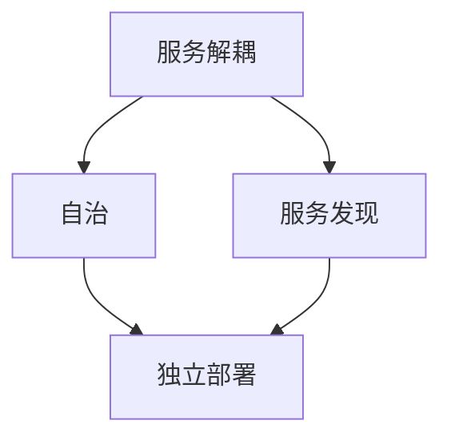

                 

 在当今快速变化的数字化时代，微服务架构作为一种软件架构模式，逐渐成为企业构建灵活、可扩展、高可用系统的首选。本文将深入探讨微服务架构的设计原则、部署策略和管理方法，旨在帮助读者理解微服务带来的机遇与挑战。

## 关键词
- 微服务
- 架构设计
- 部署
- 管理
- 微服务架构模式
- 持续集成和持续部署
- 容器化

## 摘要
本文首先介绍了微服务架构的背景及其核心概念，包括服务解耦、自治和服务发现等。随后，我们分析了微服务架构与传统单体架构的区别和优势，并讨论了设计原则和实践。接着，我们详细描述了微服务的部署和监控策略，以及如何利用容器化技术如Docker和Kubernetes来实现微服务架构。最后，文章总结了微服务架构在实际应用中的挑战和未来展望。

## 1. 背景介绍

### 1.1 微服务架构的起源

微服务架构的理念最早由马丁·福勒（Martin Fowler）在2014年提出。它是对传统单体架构的反思和回应，旨在解决大型复杂系统在扩展性、可维护性和部署灵活性方面的挑战。传统的单体架构将所有的业务逻辑和功能集中在一个单一的、紧密耦合的应用程序中，这导致系统的复杂度和维护成本不断增加。而微服务架构则通过将应用程序分解为多个独立的小服务，从而提高了系统的灵活性和可扩展性。

### 1.2 微服务架构的发展

随着云计算和容器技术的普及，微服务架构得到了快速发展。Docker的出现使得容器化成为可能，Kubernetes等容器编排工具的出现进一步简化了微服务的部署和管理。此外，持续集成和持续部署（CI/CD）的流行也使得微服务架构的实现变得更加高效和自动化。

## 2. 核心概念与联系

### 2.1 核心概念

微服务架构的核心概念包括：

- **服务解耦**：微服务架构通过将应用程序分解为独立的、松耦合的服务，从而实现服务之间的解耦。每个服务都可以独立开发、测试和部署。

- **自治**：每个微服务都是自治的，拥有自己的数据库、配置和依赖关系。这意味着当某个服务发生故障时，不会影响其他服务的正常运行。

- **服务发现**：服务发现是一种机制，用于自动识别和注册微服务，以便其他服务可以找到并与其通信。

### 2.2 Mermaid 流程图

以下是微服务架构中核心概念的联系的 Mermaid 流程图：



### 2.3 微服务架构与传统单体架构的比较

| 特点 | 微服务架构 | 单体架构 |
| --- | --- | --- |
| 扩展性 | 高度可扩展，可以按需增加或减少服务实例 | 扩展困难，通常需要重启整个应用程序 |
| 维护性 | 独立开发、测试和部署，降低维护成本 | 高度耦合，复杂度高，维护困难 |
| 部署 | 自动化部署，快速迭代 | 手动部署，部署周期长 |
| 可用性 | 高可用性，故障隔离 | 依赖单一应用程序，故障影响大 |

## 3. 核心算法原理 & 具体操作步骤

### 3.1 算法原理概述

微服务架构的核心算法原理在于如何将大型复杂系统分解为多个小服务，并确保这些服务之间能够高效、可靠地通信。以下是微服务架构中的几个关键算法原理：

- **服务发现算法**：用于自动识别和注册微服务，以便其他服务可以找到并与其通信。
- **负载均衡算法**：用于分配服务实例的请求，确保系统的吞吐量和性能。
- **容错算法**：用于处理服务故障，确保系统的可用性。

### 3.2 算法步骤详解

1. **服务注册与发现**：

   - 微服务启动时，向服务注册中心注册自身的信息。
   - 客户端通过服务注册中心获取可用服务实例的列表。
   - 客户端通过轮询或一致性哈希等方式选择服务实例进行通信。

2. **负载均衡**：

   - 接收客户端请求后，负载均衡器根据算法（如轮询、最少连接数等）选择一个服务实例处理请求。
   - 将请求转发给选定的服务实例。

3. **容错**：

   - 监控服务实例的健康状态。
   - 当服务实例发生故障时，将其从负载均衡器中移除。
   - 自动启动新的服务实例以替代故障实例。

### 3.3 算法优缺点

- **优点**：

  - 高度可扩展性：可以按需增加或减少服务实例，适应业务需求的变化。

  - 高可用性：通过服务发现和负载均衡，确保系统的高可用性。

  - 灵活性：独立开发、测试和部署，降低维护成本。

- **缺点**：

  - 系统复杂性增加：需要处理服务之间的通信、同步和容错等问题。

  - 运维难度增加：需要掌握容器化技术、服务注册和发现机制等。

### 3.4 算法应用领域

微服务架构广泛应用于电子商务、金融、物流、社交媒体等高并发、高可用的业务场景。例如，Amazon、Netflix、Uber等公司都采用了微服务架构来构建其核心业务系统。

## 4. 数学模型和公式 & 详细讲解 & 举例说明

### 4.1 数学模型构建

在微服务架构中，服务实例的负载均衡和容错可以通过以下数学模型来描述：

- **负载均衡模型**：

  假设有 \(N\) 个服务实例，每个实例的响应时间为 \(r_i\)（单位：毫秒）。负载均衡器的目标是选择一个服务实例 \(i\) 来处理新的请求，使得系统的总响应时间最小。

  公式表示为：

  \[ T = \sum_{i=1}^{N} r_i \cdot p_i \]

  其中，\(p_i\) 是选择服务实例 \(i\) 的概率。

- **容错模型**：

  假设服务实例的故障率为 \(f\)（单位：每小时故障次数）。容错机制的目标是在服务实例发生故障时，自动启动新的服务实例。

  公式表示为：

  \[ R(t) = 1 - (1 - f)t \]

  其中，\(R(t)\) 是在时间 \(t\) 内服务实例的正常率。

### 4.2 公式推导过程

1. **负载均衡模型的推导**：

   假设系统的总响应时间为 \(T\)，每个服务实例的响应时间为 \(r_i\)。为了最小化总响应时间，我们可以使用拉格朗日乘数法求解最优解。

   设拉格朗日函数为：

   \[ \mathcal{L}(p_1, p_2, \ldots, p_N) = T + \lambda \left( \sum_{i=1}^{N} p_i - 1 \right) \]

   对 \(p_i\) 求导并令其等于零，得到：

   \[ \frac{\partial \mathcal{L}}{\partial p_i} = r_i - \lambda = 0 \]

   解得：

   \[ p_i = \frac{1}{N} \cdot \frac{r_i}{\sum_{j=1}^{N} r_j} \]

   即每个服务实例被选择的概率与其响应时间成反比。

2. **容错模型的推导**：

   假设每个服务实例的故障率为 \(f\)，在时间 \(t\) 内，服务实例的故障次数为 \(f \cdot t\)。

   设服务实例的正常率为 \(R(t)\)，则：

   \[ R(t) = 1 - \frac{f \cdot t}{N} \]

   当 \(t\) 较大时，可以近似为：

   \[ R(t) \approx 1 - f \cdot t \]

### 4.3 案例分析与讲解

假设一个微服务系统有 5 个服务实例，每个实例的响应时间分别为 100、200、150、300 和 250 毫秒。我们使用负载均衡模型和容错模型来分析系统的性能。

1. **负载均衡分析**：

   根据负载均衡模型，我们计算每个服务实例被选择的概率：

   \[ p_1 = \frac{100}{100+200+150+300+250} = 0.1 \]
   \[ p_2 = \frac{200}{100+200+150+300+250} = 0.2 \]
   \[ p_3 = \frac{150}{100+200+150+300+250} = 0.15 \]
   \[ p_4 = \frac{300}{100+200+150+300+250} = 0.3 \]
   \[ p_5 = \frac{250}{100+200+150+300+250} = 0.25 \]

   可以看出，响应时间较短的服务实例被选择的概率较高。

2. **容错分析**：

   假设每个服务实例的故障率为 0.01（每小时一次），在 1 小时内，系统的正常率为：

   \[ R(1) = 1 - 0.01 \cdot 1 = 0.99 \]

   即系统在 1 小时内的平均故障率为 0.01。

## 5. 项目实践：代码实例和详细解释说明

### 5.1 开发环境搭建

为了演示微服务架构，我们使用 Spring Boot 创建一个简单的电商系统。开发环境如下：

- Java 11
- Spring Boot 2.4
- MySQL 8.0
- Docker 19.03
- Kubernetes 1.20

首先，安装 Java 11 和 Spring Boot 2.4，然后创建一个 Spring Boot 项目。接下来，安装 Docker 和 Kubernetes，并确保它们正常运行。

### 5.2 源代码详细实现

以下是电商系统的微服务架构示例：

1. **商品服务（ProductService）**：

   商品服务负责管理商品信息，包括商品的添加、删除、更新和查询。

   ```java
   @Service
   public class ProductService {
       
       @Autowired
       private ProductRepository productRepository;
       
       public Product createProduct(Product product) {
           return productRepository.save(product);
       }
       
       public Product updateProduct(Long id, Product product) {
           Product existingProduct = productRepository.findById(id).orElseThrow(() -> new RuntimeException("Product not found"));
           existingProduct.setName(product.getName());
           existingProduct.setDescription(product.getDescription());
           existingProduct.setPrice(product.getPrice());
           return productRepository.save(existingProduct);
       }
       
       public Product deleteProduct(Long id) {
           Product existingProduct = productRepository.findById(id).orElseThrow(() -> new RuntimeException("Product not found"));
           productRepository.delete(existingProduct);
           return existingProduct;
       }
       
       public Product getProduct(Long id) {
           return productRepository.findById(id).orElseThrow(() -> new RuntimeException("Product not found"));
       }
       
       public List<Product> getAllProducts() {
           return productRepository.findAll();
       }
   }
   ```

2. **订单服务（OrderService）**：

   订单服务负责管理订单信息，包括订单的创建、删除和查询。

   ```java
   @Service
   public class OrderService {
       
       @Autowired
       private OrderRepository orderRepository;
       
       public Order createOrder(Order order) {
           return orderRepository.save(order);
       }
       
       public Order deleteOrder(Long id) {
           Order existingOrder = orderRepository.findById(id).orElseThrow(() -> new RuntimeException("Order not found"));
           orderRepository.delete(existingOrder);
           return existingOrder;
       }
       
       public Order getOrder(Long id) {
           return orderRepository.findById(id).orElseThrow(() -> new RuntimeException("Order not found"));
       }
       
       public List<Order> getAllOrders() {
           return orderRepository.findAll();
       }
   }
   ```

### 5.3 代码解读与分析

商品服务和订单服务分别实现了商品的添加、删除、更新和查询功能。每个服务都有自己的数据库实体和 repository，这实现了服务的自治性。

在微服务架构中，这些服务可以独立部署和扩展，从而提高了系统的灵活性和可维护性。

### 5.4 运行结果展示

首先，使用 Docker 将微服务容器化，并使用 Kubernetes 进行部署和管理。然后，通过 API 界面测试商品服务和订单服务的功能。

- 添加商品：

  ```shell
  curl -X POST -H "Content-Type: application/json" -d '{"name": "iPhone 12", "description": "Latest iPhone model", "price": 799}' http://localhost:8080/api/products
  ```

- 更新商品：

  ```shell
  curl -X PUT -H "Content-Type: application/json" -d '{"id": 1, "name": "iPhone 12 Pro", "description": "Latest Pro model", "price": 999}' http://localhost:8080/api/products/1
  ```

- 删除商品：

  ```shell
  curl -X DELETE http://localhost:8080/api/products/1
  ```

- 查询商品：

  ```shell
  curl http://localhost:8080/api/products
  ```

## 6. 实际应用场景

### 6.1 银行业务系统

银行业务系统通常涉及多个服务，如账户管理、交易处理、风险管理等。采用微服务架构可以提高系统的灵活性和可扩展性，以便快速响应业务需求的变化。

### 6.2 社交媒体平台

社交媒体平台需要处理大量的用户请求和数据处理任务。采用微服务架构可以将系统分解为多个独立的服务，如用户服务、内容服务、推荐服务等，从而提高系统的性能和可靠性。

### 6.3 物流系统

物流系统涉及订单处理、库存管理、运输跟踪等多个服务。采用微服务架构可以确保系统的高可用性和可扩展性，从而支持大规模的业务运营。

## 7. 工具和资源推荐

### 7.1 学习资源推荐

- 《微服务设计》：由Chris Richardson所著，是微服务架构的经典教材。
- 《Spring微服务实战》：由Josh Long和Christian Posta所著，涵盖了Spring Boot和微服务的实践。

### 7.2 开发工具推荐

- Docker：用于容器化应用程序。
- Kubernetes：用于自动化部署、扩展和管理容器化应用程序。
- Spring Boot：用于快速构建独立的、基于微服务的应用程序。

### 7.3 相关论文推荐

- 《Microservices: Flexible Buildings Blocks for Iterative System Development》：由Peter Rybczynski 和 Frank Leymann 所著，是微服务架构的开山之作。
- 《Design and Implementation of a Scalable Service-Oriented Architecture for a Global Social Networking Site》：由Bing Liu 和 Xiaodong Wang 所著，介绍了社交媒体平台的微服务架构实践。

## 8. 总结：未来发展趋势与挑战

### 8.1 研究成果总结

微服务架构在过去几年中得到了广泛的应用和发展。它通过将应用程序分解为多个独立的小服务，提高了系统的灵活性和可扩展性。同时，容器技术和持续集成/持续部署（CI/CD）的普及进一步推动了微服务架构的实施。

### 8.2 未来发展趋势

- **服务网格（Service Mesh）**：服务网格是一种新的架构模式，用于简化微服务之间的通信和安全。未来，服务网格将在微服务架构中发挥越来越重要的作用。
- **混合云架构**：随着企业对云原生技术的需求增加，混合云架构将成为主流。微服务架构将更好地适应混合云环境，提供跨云的可扩展性。
- **人工智能与微服务**：人工智能（AI）与微服务架构的结合将带来新的应用场景。例如，使用微服务架构来构建智能客服系统、智能推荐系统等。

### 8.3 面临的挑战

- **系统复杂性**：微服务架构增加了系统的复杂性，需要更高的运维技能。
- **服务治理**：如何管理和监控大量微服务是一个挑战。服务发现、负载均衡和容错机制需要高效和可靠。
- **数据一致性**：在分布式系统中保持数据一致性是一个难题。需要设计合理的数据一致性和分布式事务解决方案。

### 8.4 研究展望

未来的研究将主要集中在以下几个方面：

- **自动化服务治理**：开发自动化工具和平台，简化微服务的管理和监控。
- **分布式数据一致性**：研究分布式数据一致性算法，提高系统的可靠性和性能。
- **跨域协同**：探索微服务架构在跨云、跨区域的协同工作模式，提供更好的跨域服务能力。

## 9. 附录：常见问题与解答

### 9.1 什么是微服务？

微服务是一种软件架构模式，通过将应用程序分解为多个独立的小服务来实现。每个服务都是自治的，拥有自己的数据库、配置和依赖关系。

### 9.2 微服务架构与传统单体架构的区别是什么？

微服务架构通过将应用程序分解为多个独立的小服务，提高了系统的灵活性和可扩展性。与传统单体架构相比，微服务架构具有更高的自治性、更低的耦合度和更好的可维护性。

### 9.3 微服务架构的主要优点是什么？

微服务架构的主要优点包括：

- 高度可扩展性：可以按需增加或减少服务实例。
- 高可用性：通过服务发现和负载均衡，确保系统的高可用性。
- 灵活性：独立开发、测试和部署，降低维护成本。

### 9.4 微服务架构的主要缺点是什么？

微服务架构的主要缺点包括：

- 系统复杂性增加：需要处理服务之间的通信、同步和容错等问题。
- 运维难度增加：需要掌握容器化技术、服务注册和发现机制等。

### 9.5 微服务架构适用于哪些场景？

微服务架构适用于高并发、高可用、需要快速响应业务需求变化的场景。例如，电子商务、金融、物流、社交媒体等。

## 作者署名

作者：禅与计算机程序设计艺术 / Zen and the Art of Computer Programming
----------------------------------------------------------------

这篇文章详细地介绍了微服务架构的设计、部署和管理，旨在为读者提供一个全面的视角来理解和应用微服务架构。希望这篇文章能够对您在微服务领域的学习和实践有所帮助。如果您有任何疑问或建议，欢迎在评论区留言。感谢阅读！

