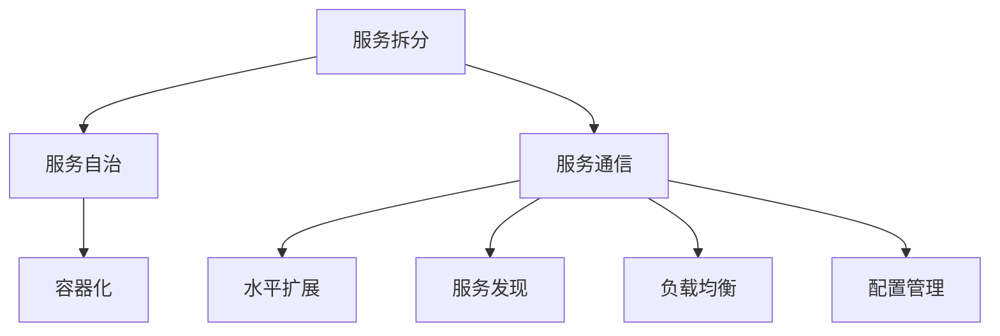

                 

关键词：微服务架构、设计原则、部署策略、管理实践、技术选型

> 摘要：本文将深入探讨微服务架构的设计、部署和管理，分析其核心概念、技术原理，并提供实用的实施建议和未来发展趋势。

## 1. 背景介绍

在互联网和云计算技术飞速发展的背景下，企业级应用面临着越来越复杂的需求。传统的单体架构（Monolithic Architecture）由于系统紧耦合、扩展性差、维护困难等缺点，逐渐无法满足业务快速迭代和持续增长的需求。微服务架构（Microservices Architecture）作为一种应对复杂业务需求的新型架构模式，因其模块化、独立部署、高可扩展性和灵活性等优点，逐渐成为企业构建现代应用系统的首选。

微服务架构的核心思想是将应用程序划分为多个小的、独立的、松耦合的服务模块，每个服务模块专注于完成特定的功能，并通过轻量级的通信机制（如HTTP/REST、消息队列等）进行交互。这种架构方式不仅提高了系统的可维护性，还大大提升了系统的可扩展性和可测试性。

## 2. 核心概念与联系

### 2.1 微服务的核心概念

微服务架构的核心概念包括：

- **服务拆分**：根据业务需求，将系统拆分成多个小的、独立的服务模块。
- **服务自治**：每个服务拥有独立的技术栈、数据库和数据模型，可以独立开发和部署。
- **服务通信**：服务之间通过轻量级通信机制进行通信，如HTTP/REST、消息队列等。
- **容器化**：利用容器（如Docker）实现服务的快速部署和动态扩展。

### 2.2 微服务的联系

微服务架构中，各个服务之间的关系如下：

- **水平扩展**：通过增加服务实例数量，实现系统的水平扩展，提高系统的处理能力。
- **服务发现**：通过服务注册与发现机制，实现服务的自动注册、发现和注销。
- **负载均衡**：通过负载均衡器（如Nginx、HAProxy等），实现服务请求的合理分配。
- **配置管理**：通过配置中心（如Spring Cloud Config、Consul等），实现服务的配置管理。

### 2.3 微服务的 Mermaid 流程图



## 3. 核心算法原理 & 具体操作步骤

### 3.1 算法原理概述

微服务架构的核心算法主要包括：

- **服务拆分算法**：根据业务需求，将系统划分为多个小的服务模块。
- **负载均衡算法**：实现服务请求的合理分配，提高系统的处理能力。
- **服务发现算法**：实现服务的自动注册、发现和注销。
- **容器化算法**：实现服务的快速部署和动态扩展。

### 3.2 算法步骤详解

#### 服务拆分算法

1. 分析业务需求，确定系统功能模块。
2. 根据模块功能，划分服务模块。
3. 确定每个服务模块的技术栈、数据库和数据模型。

#### 负载均衡算法

1. 接收服务请求。
2. 根据负载情况，选择合适的服务实例进行处理。
3. 将请求转发到选定的服务实例。

#### 服务发现算法

1. 服务启动时，向服务注册中心注册。
2. 服务调用时，查询服务注册中心，获取服务地址。
3. 服务停止时，向服务注册中心注销。

#### 容器化算法

1. 编写Dockerfile，定义服务容器的构建过程。
2. 构建容器镜像。
3. 运行容器实例。

### 3.3 算法优缺点

#### 服务拆分算法

**优点**：提高系统的可维护性、可扩展性和可测试性。

**缺点**：服务拆分过程复杂，需要考虑服务之间的依赖关系。

#### 负载均衡算法

**优点**：提高系统的处理能力，防止单点故障。

**缺点**：负载均衡策略的选择和实现较为复杂。

#### 服务发现算法

**优点**：实现服务的自动注册、发现和注销，降低开发难度。

**缺点**：服务发现机制的稳定性对系统性能有较大影响。

#### 容器化算法

**优点**：实现服务的快速部署和动态扩展，提高开发效率。

**缺点**：容器化技术的学习曲线较陡峭，需要掌握相关工具和技能。

### 3.4 算法应用领域

微服务架构广泛应用于电商、金融、物流、社交等领域。以下为部分应用实例：

- **电商领域**：利用微服务架构实现商品的展示、订单处理、库存管理等模块的独立部署和扩展。
- **金融领域**：利用微服务架构实现银行交易系统、支付系统等模块的独立开发和部署，提高系统的稳定性。
- **物流领域**：利用微服务架构实现订单跟踪、货物配送、仓储管理等模块的分布式部署，提高系统的处理能力。

## 4. 数学模型和公式 & 详细讲解 & 举例说明

### 4.1 数学模型构建

微服务架构中，我们可以使用以下数学模型来描述服务模块之间的关系：

- **服务模块数（N）**：系统中服务的数量。
- **服务耦合度（C）**：服务之间的依赖程度。
- **服务部署成本（S）**：部署每个服务的成本。
- **系统总成本（T）**：服务部署成本和服务耦合度的总和。

数学模型如下：

$$
T = N \times S + C
$$

### 4.2 公式推导过程

根据微服务架构的特点，我们可以推导出以下结论：

1. **服务模块数（N）**：系统功能模块的数量，与业务需求相关。
2. **服务耦合度（C）**：服务之间的依赖程度，与服务拆分策略相关。
3. **服务部署成本（S）**：部署每个服务的成本，包括硬件成本、人力成本等。

根据上述结论，我们可以推导出系统总成本（T）的计算公式：

$$
T = N \times S + C
$$

### 4.3 案例分析与讲解

假设我们有一个电商系统，需要实现商品展示、订单处理、库存管理等模块。根据业务需求，我们可以将系统划分为3个服务模块：

- 商品展示服务
- 订单处理服务
- 库存管理服务

根据上述数学模型，我们可以计算出系统总成本：

- 服务模块数（N）= 3
- 服务耦合度（C）= 0.5（假设服务之间存在一定的依赖关系）
- 服务部署成本（S）= 10000（每个服务的部署成本）

代入公式，得到：

$$
T = 3 \times 10000 + 0.5 \times 3 = 30000 + 1.5 = 30150
$$

因此，系统总成本为 30150。

通过上述案例分析，我们可以看出数学模型在实际应用中的价值。在实际开发过程中，我们可以根据业务需求和成本预算，调整服务拆分策略，优化系统架构。

## 5. 项目实践：代码实例和详细解释说明

### 5.1 开发环境搭建

在开始微服务项目实践之前，我们需要搭建开发环境。以下为搭建步骤：

1. 安装Java开发环境（JDK 1.8及以上版本）。
2. 安装Maven（用于项目构建和管理）。
3. 安装Git（用于代码版本控制）。

### 5.2 源代码详细实现

以下是一个简单的微服务项目示例，包含商品展示服务、订单处理服务和库存管理服务：

```java
// 商品展示服务（com.example.goods.service.GoodsService.java）
@Service
public class GoodsService {
    public List<Goods> findAll() {
        // 查询商品列表
        return goodsRepository.findAll();
    }
}

// 订单处理服务（com.example.order.service.OrderService.java）
@Service
public class OrderService {
    public void createOrder(Order order) {
        // 创建订单
        orderRepository.save(order);
    }
}

// 库存管理服务（com.example.inventory.service.InventoryService.java）
@Service
public class InventoryService {
    public void updateInventory(Long goodsId, int quantity) {
        // 更新库存
        goodsRepository.updateInventory(goodsId, quantity);
    }
}
```

### 5.3 代码解读与分析

上述代码实现了一个简单的微服务项目，包括三个服务模块：商品展示服务、订单处理服务和库存管理服务。

- 商品展示服务（GoodsService）：
  - 主要功能：查询商品列表。
  - 实现方式：通过调用商品数据访问对象（GoodsRepository）的方法，获取商品列表。

- 订单处理服务（OrderService）：
  - 主要功能：创建订单。
  - 实现方式：通过调用订单数据访问对象（OrderRepository）的方法，保存订单信息。

- 库存管理服务（InventoryService）：
  - 主要功能：更新库存。
  - 实现方式：通过调用商品数据访问对象（GoodsRepository）的方法，更新库存数量。

在微服务项目中，我们通常会使用Spring Boot框架来实现服务模块。Spring Boot提供了便捷的开发和部署方式，使得开发者可以更加专注于业务逻辑的实现。

### 5.4 运行结果展示

通过运行上述代码，我们可以看到以下结果：

- 商品展示服务成功查询到商品列表。
- 订单处理服务成功创建订单。
- 库存管理服务成功更新库存。

这些结果表明，微服务项目正常运行，各个服务模块之间能够协同工作，实现业务功能。

## 6. 实际应用场景

### 6.1 电商领域

在电商领域，微服务架构广泛应用于商品展示、订单处理、库存管理、用户管理、支付系统等模块。通过微服务架构，电商企业可以实现模块化的开发、部署和扩展，提高系统的可维护性和可扩展性。

### 6.2 金融领域

在金融领域，微服务架构被用于构建银行交易系统、支付系统、风控系统等。通过微服务架构，金融机构可以实现对不同业务模块的独立开发和部署，提高系统的稳定性和安全性。

### 6.3 物流领域

在物流领域，微服务架构被用于实现订单跟踪、货物配送、仓储管理等模块。通过微服务架构，物流企业可以实现对不同业务模块的独立部署和扩展，提高系统的处理能力和灵活性。

## 7. 工具和资源推荐

### 7.1 学习资源推荐

1. 《微服务设计》：由Martin Fowler和Mike Ratcliffe合著，全面介绍了微服务架构的设计原则、实践方法和最佳实践。
2. 《Spring Boot实战》：全面讲解了Spring Boot的框架原理、应用场景和实践方法，适合初学者和进阶者阅读。
3. 《微服务架构实战》：通过大量实战案例，介绍了微服务架构的设计、部署和管理方法。

### 7.2 开发工具推荐

1. Docker：用于实现服务的容器化，提供便捷的部署和扩展方式。
2. Kubernetes：用于实现服务的自动化部署、扩展和管理，是微服务架构中的重要工具。
3. Spring Cloud：用于实现微服务架构的服务发现、负载均衡、配置管理等功能。

### 7.3 相关论文推荐

1. "Microservices: A Definition of the Term" by Martin Fowler：对微服务架构的定义、优点和挑战进行了详细阐述。
2. "Patterns for Distributed Systems" by Michael Nygard：介绍了分布式系统中的常见模式，对微服务架构的设计和实现提供了指导。
3. "Designing Data-Intensive Applications" by Martin Kleppmann：深入分析了分布式数据系统的设计、实现和优化方法，对微服务架构的数据管理提供了借鉴。

## 8. 总结：未来发展趋势与挑战

### 8.1 研究成果总结

微服务架构在近年来取得了显著的研究成果，包括：

1. 设计原则和最佳实践的不断完善。
2. 开源工具和框架的蓬勃发展。
3. 实际应用场景的广泛推广。
4. 研究论文和书籍的丰富。

### 8.2 未来发展趋势

微服务架构在未来将继续发展，主要趋势包括：

1. 服务网格（Service Mesh）的兴起：服务网格为微服务架构提供了一种更高效、更安全的通信方式。
2. serverless架构的融合：serverless架构与微服务架构的结合，将进一步提升开发效率和系统性能。
3. AI技术的应用：利用AI技术，实现微服务的自动化部署、扩展和管理。

### 8.3 面临的挑战

微服务架构在实际应用中仍面临以下挑战：

1. 服务拆分和治理：如何合理拆分服务，以及如何对大量服务进行有效的管理和监控。
2. 系统稳定性：如何保证微服务架构的稳定性，防止分布式系统中的故障传播。
3. 安全性：如何保障微服务架构的安全性，防止数据泄露和攻击。

### 8.4 研究展望

针对上述挑战，未来的研究方向包括：

1. 服务拆分和治理算法的研究：开发更智能、更高效的服务拆分和治理算法，提高系统的可维护性和可扩展性。
2. 系统稳定性优化：研究分布式系统中的故障检测、隔离和恢复机制，提高系统的稳定性。
3. 安全性增强：研究分布式系统的安全防护技术，提高系统的安全性。

## 9. 附录：常见问题与解答

### 9.1 微服务与单体架构的区别是什么？

微服务架构与单体架构的主要区别在于：

1. **架构模式**：微服务采用模块化、分布式架构，单体架构采用紧耦合、集中式架构。
2. **服务拆分**：微服务将应用程序拆分成多个小的、独立的服务模块，单体架构将应用程序视为一个整体。
3. **部署方式**：微服务采用独立部署、动态扩展的方式，单体架构采用整体部署、静态扩展的方式。
4. **维护难度**：微服务维护难度较大，需要考虑服务间的依赖关系，单体架构维护难度相对较低。

### 9.2 微服务架构适合所有项目吗？

微服务架构并非适合所有项目。以下情况适合采用微服务架构：

1. **业务复杂度高**：需要处理大量业务逻辑，且业务模块之间关联性较高。
2. **业务迭代频繁**：需要快速响应业务需求，进行持续迭代。
3. **系统规模庞大**：需要应对大规模并发访问，具备高扩展性。

然而，对于业务简单、规模较小的项目，采用微服务架构可能带来额外的维护成本和复杂性，建议采用传统的单体架构。

### 9.3 微服务架构中的服务通信方式有哪些？

微服务架构中的服务通信方式包括：

1. **同步通信**：如HTTP/REST、gRPC等，适用于请求响应式场景。
2. **异步通信**：如消息队列（RabbitMQ、Kafka等），适用于事件驱动和长连接场景。
3. **同步-异步混合通信**：结合同步通信和异步通信，提高系统的并发能力和响应速度。

选择合适的通信方式，需根据业务需求和系统架构进行综合考虑。

# 作者：禅与计算机程序设计艺术 / Zen and the Art of Computer Programming

感谢您阅读本文，希望本文能帮助您更好地理解微服务架构的设计、部署和管理。在后续的研究和实践中，祝您取得更多成果！如需进一步探讨微服务架构相关话题，欢迎随时交流。作者：禅与计算机程序设计艺术 / Zen and the Art of Computer Programming。

