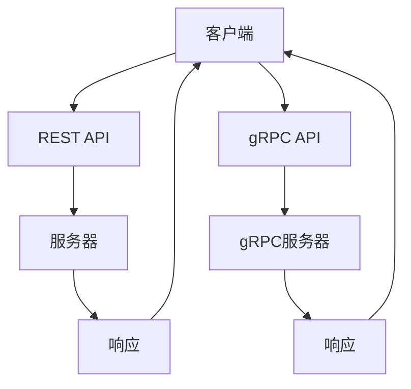

                 

## 摘要

本文将深入探讨微服务通信中两个重要的协议：REST 和 gRPC。首先，我们将回顾微服务的基本概念和通信需求，然后分别详细介绍 REST 和 gRPC 的原理、特点、优势以及应用场景。通过比较两种协议，我们希望能够帮助读者理解在何种情况下选择 REST 更为合适，以及在何种情况下 gRPC 更具优势。最后，我们将展望这两种协议在未来的发展趋势和潜在挑战。

## 1. 背景介绍

### 微服务的基本概念

微服务（Microservices）是一种架构风格，旨在通过将应用程序构建为一组小型、独立的服务来实现系统的可扩展性和可维护性。每个微服务负责特定的业务功能，可以独立部署、扩展和更新，无需影响其他服务。这种架构风格带来了许多优势，包括：

- **可扩展性**：通过水平扩展单个服务，可以轻松处理高并发请求。
- **容错性**：单个服务的故障不会影响整个系统的正常运行。
- **开发灵活性**：不同的服务可以使用不同的编程语言、数据库和数据存储，促进了技术创新和团队协作。
- **部署便捷性**：服务可以独立部署和更新，避免了传统单体应用的发布风险。

### 微服务通信的需求

在微服务架构中，服务之间需要进行频繁的通信，以协同完成复杂的业务流程。这带来了一些特定的通信需求：

- **低延迟**：服务之间的通信应该快速高效，以保持整体系统的响应速度。
- **可靠性**：通信协议需要确保消息的准确传递，避免数据丢失或重复。
- **高可用性**：在服务发生故障时，系统应该具备自动恢复的能力。
- **安全性**：通信协议需要支持身份验证和授权，保护数据免受未经授权的访问。

### 微服务通信的挑战

微服务通信也带来了一些挑战，主要包括：

- **复杂性**：服务数量增多，导致通信路径变得复杂，增加了系统的维护难度。
- **分布式系统的一致性**：服务之间的状态一致性难以保证，特别是在数据更新时。
- **网络依赖**：服务之间的通信依赖于网络，网络故障可能影响系统的可用性。

为了应对这些挑战，开发者需要选择合适的通信协议，并设计合理的通信架构。接下来，我们将详细介绍两种常用的微服务通信协议：REST 和 gRPC。

## 2. 核心概念与联系

### REST

#### REST（Representational State Transfer）是一种网络通信协议，起源于HTTP协议，并借鉴了多种网络协议和设计原则。REST的主要特点是资源导向、无状态、客户端-服务器架构。

#### REST的核心概念包括：

- **资源**：资源的表示和操作是REST架构的核心。每个资源都有一个唯一的URL，可以通过HTTP方法（GET、POST、PUT、DELETE等）进行操作。
- **无状态**：REST协议是无状态的，每次请求都是独立的，服务器不会保留关于客户端的任何信息。
- **统一接口**：REST提供了一套统一的接口，包括统一的URL结构、HTTP方法和状态码等。
- **状态转移**：客户端通过发送请求来更新资源的表示，这些请求可以触发一系列状态转移。

#### REST的架构包括以下几个部分：

- **客户端**：负责发送请求和展示响应。
- **服务器**：处理请求，返回响应。
- **URI**：统一资源标识符，用于定位资源。
- **HTTP**：超文本传输协议，用于在客户端和服务器之间传输数据。

#### REST的优点包括：

- **简单性**：REST使用广泛接受的HTTP协议，易于实现和理解。
- **可扩展性**：REST允许通过添加新的URL和HTTP方法来扩展功能。
- **灵活性**：REST支持各种数据格式，如JSON和XML。

#### REST的缺点包括：

- **性能**：REST通常使用文本格式（如JSON或XML）传输数据，可能导致较高的网络开销。
- **分布式系统的一致性**：REST的无状态特性可能导致分布式系统的一致性挑战。

### gRPC

#### gRPC（gRPC Remote Procedure Call）是由Google开发的一种高性能、跨语言的远程过程调用（RPC）系统。它基于HTTP/2协议，支持多语言、多平台，并提供了一种高效、可靠的通信方式。

#### gRPC的核心概念包括：

- **服务定义**：使用Protocol Buffers（简称Protobuf）定义服务接口和消息类型。
- **RPC调用**：客户端通过生成的方法调用服务器上的函数。
- **流式通信**：gRPC支持双向流式通信，可以实现连续的数据传输。
- **多语言支持**：gRPC支持多种编程语言，如Java、Python、Go等。

#### gRPC的架构包括以下几个部分：

- **客户端**：生成服务调用代码，发送请求并处理响应。
- **gRPC服务器**：处理请求，执行服务方法并返回响应。
- **Protobuf**：用于定义服务和消息的序列化协议。

#### gRPC的优点包括：

- **性能**：gRPC使用Protobuf进行序列化，效率高，降低了网络开销。
- **语言支持**：gRPC支持多种编程语言，便于跨语言开发。
- **流式通信**：gRPC支持双向流式通信，适用于实时数据传输。

#### gRPC的缺点包括：

- **复杂性**：gRPC的实现较为复杂，需要额外的工具和依赖。
- **学习曲线**：对于初学者来说，gRPC的学习曲线可能较陡峭。

### Mermaid 流程图

以下是一个简单的Mermaid流程图，展示了REST和gRPC的架构和通信流程：



通过这个流程图，我们可以看到REST和gRPC在架构上的相似性和差异性。REST使用基于HTTP的请求-响应模式，而gRPC则使用基于HTTP/2的RPC调用模式。

## 3. 核心算法原理 & 具体操作步骤

### 3.1 算法原理概述

#### REST

REST（Representational State Transfer）是一种基于HTTP协议的架构风格，用于设计网络服务。其核心原理可以概括为以下几点：

- **资源导向**：REST的核心是资源，每个资源都有一个唯一的URL。客户端通过发送HTTP请求来操作资源。
- **无状态**：REST是无状态的，每次请求都是独立的，服务器不会保留关于客户端的任何信息。
- **统一接口**：REST提供了一套统一的接口，包括统一的URL结构、HTTP方法和状态码等。
- **状态转移**：客户端通过发送请求来更新资源的表示，这些请求可以触发一系列状态转移。

#### gRPC

gRPC是一种高性能、跨语言的远程过程调用（RPC）系统。其核心原理可以概括为以下几点：

- **服务定义**：使用Protocol Buffers（简称Protobuf）定义服务接口和消息类型。
- **RPC调用**：客户端通过生成的方法调用服务器上的函数。
- **流式通信**：gRPC支持双向流式通信，可以实现连续的数据传输。
- **多语言支持**：gRPC支持多种编程语言，如Java、Python、Go等。

### 3.2 算法步骤详解

#### REST

1. **定义资源**：首先，需要定义应用程序中的资源，并为每个资源分配唯一的URL。
2. **客户端发送请求**：客户端通过发送HTTP请求来访问资源。请求包括URL、HTTP方法和请求体。
3. **服务器处理请求**：服务器接收到请求后，根据URL和方法处理请求。处理结果以HTTP响应的形式返回给客户端。
4. **状态转移**：客户端发送请求后，服务器会根据请求结果进行状态转移。例如，创建资源时，服务器可能会返回201（创建成功）状态码；更新资源时，服务器可能会返回204（无内容）状态码。
5. **客户端处理响应**：客户端接收到服务器返回的响应后，会根据响应结果进行相应的操作。例如，如果请求成功，客户端可以继续进行下一步操作；如果请求失败，客户端可以显示错误信息。

#### gRPC

1. **定义服务**：使用Protocol Buffers（Protobuf）定义服务接口和消息类型。定义文件以`.proto`为后缀。
2. **生成代码**：使用Protobuf编译器生成服务代码。生成的代码包括服务接口、客户端和服务端的实现。
3. **客户端调用服务**：客户端通过生成的服务代码调用服务器上的函数。调用方法包括同步和异步调用。
4. **服务器处理请求**：服务器接收到请求后，根据服务接口和消息类型处理请求。处理结果通过生成的服务代码返回给客户端。
5. **流式通信**：gRPC支持双向流式通信。客户端和服务器可以通过流式通信发送和接收连续的数据。

### 3.3 算法优缺点

#### REST

**优点**：

- **简单性**：REST使用广泛接受的HTTP协议，易于实现和理解。
- **可扩展性**：REST允许通过添加新的URL和HTTP方法来扩展功能。
- **灵活性**：REST支持各种数据格式，如JSON和XML。

**缺点**：

- **性能**：REST通常使用文本格式（如JSON或XML）传输数据，可能导致较高的网络开销。
- **分布式系统的一致性**：REST的无状态特性可能导致分布式系统的一致性挑战。

#### gRPC

**优点**：

- **性能**：gRPC使用Protobuf进行序列化，效率高，降低了网络开销。
- **语言支持**：gRPC支持多种编程语言，便于跨语言开发。
- **流式通信**：gRPC支持双向流式通信，适用于实时数据传输。

**缺点**：

- **复杂性**：gRPC的实现较为复杂，需要额外的工具和依赖。
- **学习曲线**：对于初学者来说，gRPC的学习曲线可能较陡峭。

### 3.4 算法应用领域

#### REST

**应用领域**：

- **Web服务**：REST是构建Web服务的标准协议，广泛用于API开发。
- **移动应用**：REST可以用于移动应用与服务器之间的数据通信。
- **微服务**：REST适用于微服务架构中的服务间通信。

#### gRPC

**应用领域**：

- **高性能应用**：gRPC适用于需要高性能、低延迟的应用场景。
- **跨语言开发**：gRPC支持多种编程语言，适用于跨语言开发的场景。
- **实时通信**：gRPC适用于需要实时通信的应用，如在线游戏、直播应用等。

## 4. 数学模型和公式 & 详细讲解 & 举例说明

### 4.1 数学模型构建

#### REST

在REST架构中，可以使用以下数学模型来描述资源、请求和响应之间的关系：

- **资源**：每个资源可以表示为一个二元组 \((R, V)\)，其中 \(R\) 表示资源的标识符，\(V\) 表示资源的值。
- **请求**：请求可以表示为一个三元组 \((R, M, B)\)，其中 \(R\) 表示资源的标识符，\(M\) 表示请求的方法（如GET、POST等），\(B\) 表示请求体。
- **响应**：响应可以表示为一个四元组 \((R, M, V, S)\)，其中 \(R\) 表示资源的标识符，\(M\) 表示响应的方法（如GET、POST等），\(V\) 表示资源的值，\(S\) 表示响应的状态码。

#### gRPC

在gRPC架构中，可以使用以下数学模型来描述服务调用、流式通信和响应：

- **服务调用**：服务调用可以表示为一个四元组 \((S, M, I, O)\)，其中 \(S\) 表示服务的名称，\(M\) 表示方法名称，\(I\) 表示输入参数，\(O\) 表示输出结果。
- **流式通信**：流式通信可以表示为一个二元组 \((I, O)\)，其中 \(I\) 表示输入流，\(O\) 表示输出流。
- **响应**：响应可以表示为一个三元组 \((R, V, S)\)，其中 \(R\) 表示响应码，\(V\) 表示返回值，\(S\) 表示状态码。

### 4.2 公式推导过程

#### REST

对于REST架构，可以推导出以下公式来描述资源、请求和响应之间的关系：

- **资源表示**：\(R \rightarrow V\)
- **请求处理**：\(R, M, B \rightarrow V, S\)
- **响应结果**：\(R, M, V, S \rightarrow R, V, S\)

#### gRPC

对于gRPC架构，可以推导出以下公式来描述服务调用、流式通信和响应之间的关系：

- **服务调用**：\(S, M, I, O \rightarrow R, V, S\)
- **流式通信**：\(I, O \rightarrow I', O'\)
- **响应结果**：\(R, V, S \rightarrow R, V, S\)

### 4.3 案例分析与讲解

#### REST

以下是一个简单的REST服务调用示例：

- **资源**：用户（User）
- **请求**：GET /users/{id}
- **响应**：200 OK，返回用户信息

**数学模型表示**：

- **资源表示**：\((User, \{id\}) \rightarrow V\)
- **请求处理**：\((User, GET, \{id\}) \rightarrow V, 200\)
- **响应结果**：\((User, GET, \{id\}, V, 200) \rightarrow (User, V, 200)\)

#### gRPC

以下是一个简单的gRPC服务调用示例：

- **服务**：用户服务（UserService）
- **方法**：获取用户信息（GetUserInfo）
- **输入参数**：用户ID
- **输出结果**：用户信息

**数学模型表示**：

- **服务调用**：\((UserService, GetUserInfo, \{id\}, \{user\}) \rightarrow R, \{user\}, 200\)
- **响应结果**：\((R, \{user\}, 200) \rightarrow (R, \{user\}, 200)\)

## 5. 项目实践：代码实例和详细解释说明

### 5.1 开发环境搭建

为了实践REST和gRPC通信，我们需要搭建一个简单的开发环境。以下是一个基于Spring Boot和gRPC的示例项目。

1. **安装Java环境**：确保已经安装了Java 11及以上版本。
2. **创建Maven项目**：使用Spring Initializr创建一个Maven项目，选择Spring Boot、Web、gRPC等依赖。
3. **引入依赖**：在项目的`pom.xml`文件中添加以下依赖：

   ```xml
   <dependencies>
       <dependency>
           <groupId>org.springframework.boot</groupId>
           <artifactId>spring-boot-starter-web</artifactId>
       </dependency>
       <dependency>
           <groupId>io.grpc</groupId>
           <artifactId>grpc-netty</artifactId>
       </dependency>
       <dependency>
           <groupId>io.grpc</groupId>
           <artifactId>grpc-protobuf</artifactId>
       </dependency>
       <dependency>
           <groupId>io.grpc</groupId>
           <artifactId>grpc-stub</artifactId>
       </dependency>
   </dependencies>
   ```

### 5.2 源代码详细实现

#### REST服务

1. **定义资源**：创建一个`User`类，表示用户资源。

   ```java
   public class User {
       private String id;
       private String name;
       // 省略getter和setter方法
   }
   ```

2. **创建REST控制器**：创建一个`UserController`类，处理用户资源的请求。

   ```java
   @RestController
   public class UserController {
       @GetMapping("/users/{id}")
       public User getUser(@PathVariable String id) {
           // 根据ID查询用户信息，并返回
           return new User(id, "张三");
       }
   }
   ```

#### gRPC服务

1. **定义服务接口**：使用Protocol Buffers定义一个`user.proto`文件。

   ```proto
   syntax = "proto3";

   service UserService {
       rpc GetUserInfo (UserRequest) returns (UserResponse);
   }

   message UserRequest {
       string id = 1;
   }

   message UserResponse {
       string id = 1;
       string name = 2;
   }
   ```

2. **生成服务代码**：使用Protobuf编译器生成Java服务代码。

   ```shell
   protoc --java_out=./src/main/java -I ./src/main/proto ./src/main/proto/user.proto
   ```

3. **实现服务方法**：创建一个`UserServiceImpl`类，实现`UserService`接口。

   ```java
   public class UserServiceImpl extends UserServiceGrpc.UserServiceImplBase {
       @Override
       public void getUserUserInfo(Call< UserRequest > call, ResponseObserver< UserResponse > responseObserver) {
           String id = call.request().getId();
           // 根据ID查询用户信息，并返回
           UserResponse response = UserResponse.newBuilder().setId(id).setName("张三").build();
           responseObserver.onNext(response);
           responseObserver.onCompleted();
       }
   }
   ```

4. **启动gRPC服务器**：创建一个`GrpcServer`类，启动gRPC服务器。

   ```java
   public class GrpcServer {
       public static void main(String[] args) {
           Server server = ServerBuilder.forPort(9090)
                   .addService(new UserServiceImpl())
                   .build();
           server.start();
           server.awaitTermination();
       }
   }
   ```

### 5.3 代码解读与分析

#### REST服务

1. **定义资源**：`User`类表示用户资源，包括ID和名称。
2. **创建REST控制器**：`UserController`类处理用户资源的GET请求，根据ID查询用户信息并返回。
3. **请求处理**：使用Spring MVC框架处理HTTP请求，通过URL中的参数获取用户ID。

#### gRPC服务

1. **定义服务接口**：使用Protocol Buffers定义服务接口，包括请求和响应消息。
2. **生成服务代码**：使用Protobuf编译器生成Java服务代码，包括服务接口和实现类。
3. **实现服务方法**：`UserServiceImpl`类实现服务接口的方法，根据ID查询用户信息并返回。
4. **启动gRPC服务器**：使用Netty启动gRPC服务器，监听指定的端口。

通过这个简单的示例，我们可以看到REST和gRPC的基本实现流程。在实际项目中，可以根据需求选择合适的通信协议，并实现相应的服务接口和方法。

### 5.4 运行结果展示

1. **REST服务**：启动Spring Boot应用程序，访问`http://localhost:8080/users/{id}`，例如`http://localhost:8080/users/1`，返回用户信息。

   ```json
   {
       "id": "1",
       "name": "张三"
   }
   ```

2. **gRPC服务**：启动gRPC服务器，使用gRPC客户端调用`GetUserInfo`方法，传递用户ID，返回用户信息。

   ```json
   {
       "id": "1",
       "name": "张三"
   }
   ```

通过运行结果展示，我们可以看到REST和gRPC服务均能正确处理用户请求并返回预期的响应。

## 6. 实际应用场景

### REST

REST协议由于其简单性和广泛接受性，在实际应用中被广泛使用。以下是一些典型的应用场景：

- **Web API**：大多数现代Web服务都使用REST协议提供API，例如社交网络API、地图API等。
- **移动应用**：移动应用通常使用REST协议与服务器通信，以获取和更新数据。
- **微服务**：在微服务架构中，REST用于服务间的通信，确保系统的可扩展性和可维护性。

### gRPC

gRPC协议由于其高性能和跨语言支持，适用于以下应用场景：

- **高并发系统**：在需要处理大量请求的系统（如电商平台、直播平台）中，gRPC的高性能优势显著。
- **跨语言开发**：当项目需要使用多种编程语言时，gRPC的跨语言支持可以简化开发过程。
- **实时通信**：在实时通信应用（如在线游戏、直播应用）中，gRPC的双向流式通信支持可以提供更好的用户体验。

### 对比

REST和gRPC各有优劣，选择哪种协议取决于具体应用场景和需求：

- **简单性**：REST更简单，易于实现和理解，适合大多数场景。
- **性能**：gRPC性能更高，适用于高并发和实时通信场景。
- **灵活性**：REST支持更多的数据格式，但gRPC在性能和跨语言支持方面更具优势。
- **开发难度**：gRPC开发难度较大，需要额外的工具和依赖，但性能优势明显。

### 选择建议

- 如果应用场景要求高性能和低延迟，可以选择gRPC。
- 如果应用场景对性能要求不高，且希望简化开发过程，可以选择REST。

## 7. 工具和资源推荐

### 7.1 学习资源推荐

1. **书籍**：
   - 《RESTful Web Services》
   - 《gRPC: The Definitive Guide》
2. **在线教程**：
   - RESTful Web Services tutorial
   - gRPC official documentation
3. **视频课程**：
   - REST and gRPC: Fundamentals and Best Practices
   - Building Microservices with REST and gRPC

### 7.2 开发工具推荐

1. **IDE**：
   - IntelliJ IDEA
   - Eclipse
2. **构建工具**：
   - Maven
   - Gradle
3. **代码生成工具**：
   - Protobuf compiler
   - grpc-tools

### 7.3 相关论文推荐

1. **REST**：
   - "Representational State Transfer" by Roy Fielding
   - "Architectural Styles and the Design of Network-based Software Architectures" by Roy Fielding
2. **gRPC**：
   - "gRPC: The Next-Generation Remote Procedure Call System" by Michael Kristensen et al.
   - "High Performance gRPC with Protocol Buffers" by Ethan Jackson

## 8. 总结：未来发展趋势与挑战

### 8.1 研究成果总结

近年来，微服务架构和REST、gRPC等通信协议取得了显著的成果。REST因其简单性和广泛接受性，成为构建Web服务和微服务架构的首选协议。gRPC则凭借其高性能和跨语言支持，逐渐在分布式系统和实时通信场景中占据了一席之地。此外，随着云原生技术和容器化技术的发展，微服务架构和REST、gRPC等协议的应用场景和实现方式也在不断扩展和优化。

### 8.2 未来发展趋势

1. **云原生技术**：随着Kubernetes等云原生技术的发展，微服务架构和REST、gRPC等协议将更加适应云原生环境，提供更高效、更灵活的部署和管理方式。
2. **边缘计算**：随着5G和物联网技术的普及，边缘计算成为新的热点。REST和gRPC将逐渐应用于边缘设备和服务之间的通信，提供低延迟、高带宽的通信能力。
3. **智能化与自动化**：人工智能和自动化技术的发展，将使得REST和gRPC等协议在服务发现、负载均衡、故障恢复等方面更加智能化，提升系统的稳定性和可用性。

### 8.3 面临的挑战

1. **分布式系统的一致性**：随着分布式系统的规模不断扩大，如何保证数据的一致性和一致性是未来面临的一大挑战。
2. **安全性**：随着网络攻击手段的不断升级，如何保障数据的安全传输和系统的安全性是另一个重要挑战。
3. **开发复杂性**：虽然REST和gRPC提供了强大的功能和性能，但其实现过程较为复杂，对于开发者来说是一个挑战。

### 8.4 研究展望

未来，REST和gRPC等通信协议将继续发展，结合新的技术和应用场景，为分布式系统提供更加高效、安全和可靠的通信方式。同时，随着云原生、边缘计算、智能化与自动化等技术的发展，REST和gRPC的应用范围和实现方式也将不断扩展和优化。

## 9. 附录：常见问题与解答

### Q1：什么是微服务？

**A1**：微服务（Microservices）是一种软件架构风格，旨在通过将应用程序构建为一组小型、独立的服务来实现系统的可扩展性和可维护性。每个微服务负责特定的业务功能，可以独立部署、扩展和更新，无需影响其他服务。

### Q2：REST和gRPC的主要区别是什么？

**A2**：REST（Representational State Transfer）是一种基于HTTP协议的架构风格，用于设计网络服务。gRPC（gRPC Remote Procedure Call）是一种高性能、跨语言的远程过程调用（RPC）系统，基于HTTP/2协议。REST通常使用文本格式（如JSON或XML）传输数据，而gRPC使用Protobuf进行序列化，效率更高。

### Q3：在哪些场景下选择REST更合适？

**A3**：在选择通信协议时，以下场景下选择REST更合适：

- 对性能要求不高，但希望简化开发过程。
- 需要与其他系统进行集成，如Web服务和移动应用。
- 应用场景较为简单，无需复杂的流式通信。

### Q4：在哪些场景下选择gRPC更合适？

**A4**：在选择通信协议时，以下场景下选择gRPC更合适：

- 需要高性能和低延迟。
- 应用场景涉及实时通信，如在线游戏、直播应用。
- 项目需要跨语言开发，gRPC支持多种编程语言。

### Q5：如何选择合适的通信协议？

**A5**：选择合适的通信协议时，需要考虑以下因素：

- 性能要求：如果性能是关键因素，可以考虑使用gRPC。
- 开发难度：如果希望简化开发过程，可以选择REST。
- 应用场景：根据具体应用场景选择合适的协议，如Web服务选择REST，实时通信选择gRPC。
- 集成需求：如果需要与其他系统进行集成，选择支持广泛、易于集成的协议。

通过综合考虑这些因素，可以做出更合适的选择。在实际开发过程中，也可以根据项目需求逐步调整和优化通信协议。

