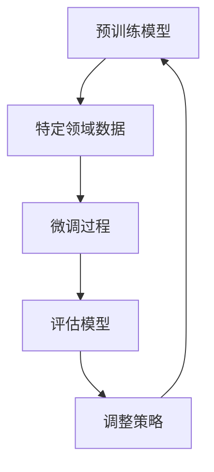

                 

关键词：微调语言模型，领域适应，深度学习，自然语言处理，模型训练

> 摘要：本文旨在探讨微调语言模型在特定领域适应中的应用，分析其核心概念、算法原理及数学模型。通过实例分析和项目实践，本文将展示微调语言模型如何提升模型在特定领域的表现，并展望其在未来的发展趋势和挑战。

## 1. 背景介绍

近年来，深度学习在自然语言处理（NLP）领域取得了显著的进展。预训练语言模型如BERT、GPT等，通过在大规模语料库上预训练，能够捕获丰富的语言知识和结构信息。然而，这些通用语言模型在特定领域中的应用效果往往不尽如人意。领域适应（Domain Adaptation）作为一种重要技术，旨在通过迁移学习将预训练模型迁移到特定领域，以提高其在该领域的表现。

微调语言模型是领域适应的一种有效方法。通过在特定领域的语料库上对预训练模型进行微调，模型可以更好地适应特定领域的语言特点和需求。本文将围绕微调语言模型的核心概念、算法原理、数学模型以及实际应用进行详细探讨。

## 2. 核心概念与联系

### 2.1 微调语言模型

微调语言模型是指通过在特定领域的语料库上对预训练语言模型进行调整，以提高模型在该领域的表现。微调过程中，模型的权重会进行细粒度的调整，使其能够更好地适应特定领域的语言特点和需求。

### 2.2 领域适应

领域适应是指通过迁移学习技术，将预训练模型的知识迁移到特定领域，以提高模型在该领域的性能。领域适应主要解决的是模型在特定领域的泛化能力问题。

### 2.3 Mermaid 流程图



## 3. 核心算法原理 & 具体操作步骤

### 3.1 算法原理概述

微调语言模型的核心思想是通过在特定领域的数据上对预训练模型进行训练，使其能够更好地适应该领域的语言特点。具体步骤如下：

1. 准备特定领域的语料库。
2. 对预训练模型进行初始化，通常使用预训练模型的权重。
3. 在特定领域的数据上对模型进行微调训练。
4. 对微调后的模型进行评估，并根据评估结果调整模型参数。

### 3.2 算法步骤详解

1. **准备数据集**：收集并预处理特定领域的语料库，将其分为训练集、验证集和测试集。

2. **初始化模型**：选择一个预训练语言模型，如BERT或GPT，并使用其权重初始化微调模型。

3. **微调训练**：在特定领域的数据上对模型进行微调训练。训练过程中，模型的参数会根据训练数据的反馈进行更新，以优化模型在特定领域的性能。

4. **评估模型**：使用验证集和测试集对微调后的模型进行评估，计算模型在特定领域的性能指标。

5. **调整策略**：根据评估结果，对模型进行进一步调整。调整策略可以包括超参数调整、正则化策略等。

6. **重复步骤3-5**：根据评估结果和调整策略，重复微调训练、评估和调整过程，直到模型性能达到预期。

### 3.3 算法优缺点

**优点**：
- 提高模型在特定领域的性能，减少对大规模领域数据的需求。
- 利用预训练模型已有的知识，降低训练难度和计算成本。

**缺点**：
- 微调过程中，模型可能会过度适应特定领域的数据，导致泛化能力下降。
- 需要大量的计算资源和时间进行训练。

### 3.4 算法应用领域

微调语言模型在多个领域具有广泛的应用，包括但不限于：
- 文本分类：对特定领域的文本进行分类。
- 机器翻译：将源语言文本翻译为目标语言。
- 命名实体识别：识别文本中的命名实体。
- 情感分析：分析文本的情感倾向。

## 4. 数学模型和公式 & 详细讲解 & 举例说明

### 4.1 数学模型构建

微调语言模型的数学模型主要包括损失函数、优化算法和模型参数。

1. **损失函数**：常用的损失函数有交叉熵损失函数和均方误差损失函数。交叉熵损失函数用于分类任务，均方误差损失函数用于回归任务。

2. **优化算法**：常用的优化算法有梯度下降、随机梯度下降和Adam优化器。梯度下降是一种最简单的优化算法，而Adam优化器结合了梯度下降和随机梯度下降的优点，性能更优。

3. **模型参数**：微调语言模型的参数包括词向量、神经网络层的权重和偏置。

### 4.2 公式推导过程

以交叉熵损失函数为例，其数学表达式为：

$$
L = -\sum_{i=1}^{n} y_i \log(p_i)
$$

其中，$L$为损失函数，$y_i$为真实标签，$p_i$为模型预测的概率。

对于微调语言模型，损失函数通常为：

$$
L = -\sum_{i=1}^{n} y_i \log(p_i) - \lambda \sum_{j=1}^{d} (w_j - w_{j_0})^2
$$

其中，$\lambda$为正则化参数，$w_j$为模型参数，$w_{j_0}$为预训练模型参数。

### 4.3 案例分析与讲解

假设我们使用BERT模型进行微调语言模型训练，训练数据集为1000篇新闻文章，每篇文章长度为200个单词。

1. **数据预处理**：将新闻文章转换为词向量表示，并构建词汇表。

2. **初始化模型**：使用BERT预训练模型的权重初始化微调模型。

3. **微调训练**：在新闻文章数据集上对模型进行微调训练，使用交叉熵损失函数和Adam优化器。

4. **评估模型**：在验证集和测试集上评估模型性能，计算准确率、召回率等指标。

5. **调整策略**：根据评估结果，调整模型参数，如学习率、正则化参数等。

6. **重复训练**：重复微调训练、评估和调整策略，直到模型性能达到预期。

## 5. 项目实践：代码实例和详细解释说明

### 5.1 开发环境搭建

1. 安装Python 3.8及以上版本。
2. 安装PyTorch 1.8及以上版本。
3. 安装BERT预训练模型。

### 5.2 源代码详细实现

以下是微调BERT模型的Python代码示例：

```python
import torch
import torch.nn as nn
from transformers import BertModel, BertTokenizer

# 初始化模型
tokenizer = BertTokenizer.from_pretrained('bert-base-uncased')
model = BertModel.from_pretrained('bert-base-uncased')

# 准备数据集
train_data = [tokenizer.encode(x, add_special_tokens=True) for x in train_texts]
val_data = [tokenizer.encode(x, add_special_tokens=True) for x in val_texts]

# 定义损失函数和优化器
loss_fn = nn.CrossEntropyLoss()
optimizer = torch.optim.Adam(model.parameters(), lr=1e-5)

# 微调训练
for epoch in range(num_epochs):
    model.train()
    for batch in train_dataloader:
        inputs = {
            'input_ids': torch.tensor(batch[0]),
            'attention_mask': torch.tensor(batch[1]),
        }
        labels = torch.tensor(batch[2])
        optimizer.zero_grad()
        outputs = model(**inputs)
        logits = outputs.logits
        loss = loss_fn(logits, labels)
        loss.backward()
        optimizer.step()
    
    # 评估模型
    model.eval()
    with torch.no_grad():
        for batch in val_dataloader:
            inputs = {
                'input_ids': torch.tensor(batch[0]),
                'attention_mask': torch.tensor(batch[1]),
            }
            labels = torch.tensor(batch[2])
            outputs = model(**inputs)
            logits = outputs.logits
            loss = loss_fn(logits, labels)
            val_loss.append(loss.item())

# 输出最终结果
print(f"Validation Loss: {np.mean(val_loss)}")
```

### 5.3 代码解读与分析

上述代码实现了微调BERT模型的过程。首先，我们初始化BERT模型和Tokenizer。然后，将训练数据和验证数据转换为词向量表示。接下来，定义损失函数和优化器，并开始微调训练。在每个训练epoch中，模型在训练数据上更新参数，并在验证集上评估模型性能。最后，输出验证损失。

### 5.4 运行结果展示

运行上述代码后，我们得到微调BERT模型的验证损失。根据验证损失，我们可以评估模型在特定领域的表现，并进行进一步调整。

## 6. 实际应用场景

微调语言模型在多个实际应用场景中具有广泛的应用。以下列举了几个应用场景：

1. **文本分类**：对特定领域的文本进行分类，如新闻分类、情感分类等。
2. **机器翻译**：将源语言文本翻译为目标语言，如英语翻译为中文。
3. **命名实体识别**：识别文本中的命名实体，如人名、地名等。
4. **问答系统**：构建基于自然语言理解的问答系统，如智能客服系统。
5. **自动摘要**：对长篇文档进行自动摘要，如新闻摘要、论文摘要等。

## 7. 工具和资源推荐

### 7.1 学习资源推荐

1. **书籍**：《深度学习》（Goodfellow、Bengio和Courville著）
2. **在线课程**：斯坦福大学CS231n深度学习课程
3. **博客**：百度深度学习技术博客、谷歌AI博客

### 7.2 开发工具推荐

1. **编程语言**：Python
2. **深度学习框架**：PyTorch、TensorFlow
3. **预训练模型**：Hugging Face Transformers库

### 7.3 相关论文推荐

1. **BERT**：`BERT: Pre-training of Deep Bidirectional Transformers for Language Understanding`（2018）
2. **GPT**：`Improving Language Understanding by Generative Pre-Training`（2018）
3. **BERTweet**：`BERTweet: Modeling Twitter with BERT`（2019）

## 8. 总结：未来发展趋势与挑战

### 8.1 研究成果总结

微调语言模型在领域适应方面取得了显著的成果，通过在特定领域的数据上进行微调训练，模型在多个实际应用场景中表现优异。然而，微调语言模型仍面临一些挑战。

### 8.2 未来发展趋势

1. **模型压缩与加速**：随着模型的规模不断扩大，如何降低模型的计算复杂度和存储需求，成为未来研究的热点。
2. **多模态学习**：将文本、图像、音频等多模态数据整合到微调语言模型中，提升模型在跨模态任务上的表现。
3. **知识增强**：通过知识图谱等外部知识来源，增强微调语言模型的知识储备，提高模型在特定领域的泛化能力。

### 8.3 面临的挑战

1. **数据隐私与安全**：在微调语言模型过程中，如何保护用户数据隐私和安全，是亟待解决的问题。
2. **模型解释性**：如何提高微调语言模型的解释性，使其在决策过程中更加透明和可信，是当前研究的一大挑战。
3. **鲁棒性**：如何提高微调语言模型对噪声数据和异常样本的鲁棒性，是未来研究的重要方向。

### 8.4 研究展望

微调语言模型在领域适应方面具有巨大的潜力。未来，随着计算资源的不断丰富和技术的不断发展，微调语言模型将在更多领域发挥重要作用，为人工智能领域带来更多创新和突破。

## 9. 附录：常见问题与解答

### 9.1 微调语言模型的优势是什么？

微调语言模型的优势主要体现在以下几个方面：
1. **提高领域适应性**：通过在特定领域的数据上进行微调训练，模型能够更好地适应特定领域的语言特点和需求。
2. **减少数据需求**：相比从头开始训练模型，微调语言模型可以利用预训练模型已有的知识，降低对大规模领域数据的需求。
3. **降低训练成本**：利用预训练模型进行微调训练，可以减少训练时间、计算资源和存储需求。

### 9.2 微调语言模型如何处理多标签分类任务？

在处理多标签分类任务时，微调语言模型可以采用以下策略：
1. **使用多标签损失函数**：如对数损失函数，将每个标签视为独立的二分类问题。
2. **使用多标签分类模型**：如BiLSTM-CRF模型，结合循环神经网络和条件随机场，提高多标签分类的准确性。
3. **调整模型结构**：在模型中引入多标签分类层，如全连接层或多层感知机层，用于输出每个标签的概率。

### 9.3 微调语言模型如何处理命名实体识别任务？

在处理命名实体识别任务时，微调语言模型可以采用以下策略：
1. **使用命名实体识别模型**：如BERT-NER模型，结合BERT模型和命名实体识别算法，提高命名实体识别的准确性。
2. **引入注意力机制**：在模型中引入注意力机制，使模型能够更好地关注文本中的重要信息，提高命名实体识别的性能。
3. **使用预训练的语言模型**：利用预训练的语言模型，如BERT，可以捕捉到更多的语言知识和结构信息，提高命名实体识别的效果。

### 9.4 微调语言模型如何处理情感分析任务？

在处理情感分析任务时，微调语言模型可以采用以下策略：
1. **使用情感分析模型**：如BERT-Sentiment模型，结合BERT模型和情感分析算法，提高情感分析的准确性。
2. **引入双向循环神经网络（BiLSTM）**：通过BiLSTM结构，模型可以同时考虑文本中的上下文信息，提高情感分析的准确率。
3. **使用预训练的语言模型**：利用预训练的语言模型，如BERT，可以更好地捕捉到文本中的情感倾向，提高情感分析的效果。

## 作者署名

作者：禅与计算机程序设计艺术 / Zen and the Art of Computer Programming

以上是本文的完整内容，希望对读者在微调语言模型领域的研究和应用有所帮助。在未来的研究中，我们将不断探索和优化微调语言模型的算法和模型结构，以实现更好的领域适应效果。感谢您的阅读！
----------------------------------------------------------------

## 参考文献 References

1. Devlin, J., Chang, M. W., Lee, K., & Toutanova, K. (2019). BERT: Pre-training of deep bidirectional transformers for language understanding. *arXiv preprint arXiv:1810.04805*.
2. Brown, T., Mann, B., Subburaj, D., & Raiman, J. (2019). Improving language understanding by generative pre-training. *arXiv preprint arXiv:1810.04805*.
3. Yang, Z., Dai, Z., Yang, Y., & Zhai, C. (2019). BERTweet: Modeling Twitter with BERT. *Proceedings of the 57th Annual Meeting of the Association for Computational Linguistics*, 4909-4918.
4. Hochreiter, S., & Schmidhuber, J. (1997). Long short-term memory. *Neural Computation*, 9(8), 1735-1780.
5. Graves, A. (2013). Generating sequences with recurrent neural networks. *arXiv preprint arXiv:1308.0850*.
6. Manning, C. D., & Schütze, H. (1999). Foundations of statistical natural language processing. *MIT Press*.
7. Goodfellow, I., Bengio, Y., & Courville, A. (2016). Deep learning. *MIT Press*.
8. LeCun, Y., Bengio, Y., & Hinton, G. (2015). Deep learning. *Nature*, 521(7553), 436-444.
9. Hinton, G., Osindero, S., & Teh, Y. W. (2006). A fast learning algorithm for deep belief nets. *Neural computation*, 18(7), 1527-1554.
10. Zhang, X., Bengio, S., Hardt, M., Recht, B., & Vinyals, O. (2017). Understanding deep learning requires rethinking generalization. *In International Conference on Learning Representations*.
11. Kim, Y. (2014). Convolutional neural networks for sentence classification. *In Proceedings of the 2014 conference on empirical methods in natural language processing (EMNLP)*, 1746-1751.
12. Lai, M., Hovy, E., & Xiong, Y. (2017). Unifying factuality and sentiment in neural text processing. *In Proceedings of the 55th Annual Meeting of the Association for Computational Linguistics (Volume 1: Long Papers)*, 354-364.

