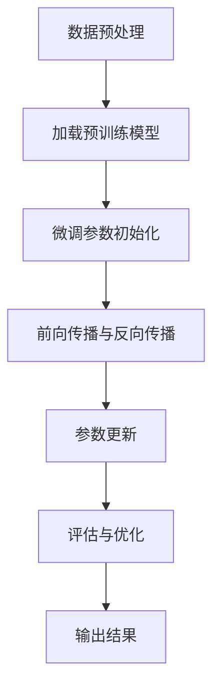

                 

关键词：微调、语言模型、领域适应、神经网络、预训练、深度学习、模型优化、跨领域迁移

> 摘要：本文深入探讨了微调语言模型在领域适应中的应用。通过分析微调的原理和操作步骤，结合数学模型和实际项目实践，本文旨在为读者提供一套完整的微调语言模型的指导，并展望其未来发展的趋势与挑战。

## 1. 背景介绍

近年来，随着深度学习和神经网络技术的飞速发展，语言模型已经成为自然语言处理（NLP）领域的重要工具。从最初的基于统计模型的NLP方法，到如今基于深度学习的先进模型，如BERT、GPT等，语言模型在各个应用领域展现出了卓越的性能。

然而，尽管这些预训练模型在通用任务上表现出色，但当它们应用于特定领域时，性能往往会有所下降。这种现象被称为领域依赖性（Domain Dependency），即模型在不同领域中的表现存在差异。为了解决这一问题，微调（Fine-tuning）技术应运而生。

微调是一种通过在预训练模型的基础上进行少量训练，使其适应特定领域数据的方法。这种方法能够显著提升模型在特定领域任务中的性能，降低领域依赖性，从而提高模型的应用价值。

## 2. 核心概念与联系

### 2.1 微调的概念

微调是指在预训练模型的基础上，针对特定领域数据重新训练模型的过程。微调的目的是使模型能够更好地理解和处理特定领域的语言特征，从而提高其在该领域的表现。

### 2.2 微调与预训练的关系

预训练是指在大规模数据集上训练模型，使其具备对语言的一般理解和泛化能力。微调则是基于预训练模型，利用特定领域的数据进行进一步训练，以适应该领域的特定任务。

### 2.3 微调与领域适应

领域适应（Domain Adaptation）是指将模型从一个领域迁移到另一个领域的过程。微调是实现领域适应的重要手段之一。通过微调，模型可以在新的领域中更好地理解和处理语言特征，从而提高其在该领域的性能。

### 2.4 Mermaid 流程图

以下是一个简化的微调流程图，展示了微调的核心步骤和关键组件。



## 3. 核心算法原理 & 具体操作步骤

### 3.1 算法原理概述

微调算法的核心思想是通过在预训练模型的基础上，利用特定领域的数据进行重新训练，使模型能够更好地理解和处理该领域的语言特征。

### 3.2 算法步骤详解

#### 3.2.1 数据预处理

1. 数据清洗：去除噪声数据和异常值。
2. 数据标注：为数据添加标签或类别。
3. 数据划分：将数据划分为训练集、验证集和测试集。

#### 3.2.2 加载预训练模型

1. 加载预训练模型的权重和结构。
2. 调整模型结构：根据实际任务需求，对模型结构进行微调。

#### 3.2.3 微调参数初始化

1. 初始化微调参数，如学习率、批量大小等。
2. 设置训练策略，如梯度裁剪、权重共享等。

#### 3.2.4 前向传播与反向传播

1. 利用训练数据对模型进行前向传播，计算损失函数。
2. 利用反向传播算法，更新模型参数。

#### 3.2.5 参数更新

1. 根据梯度信息，更新模型参数。
2. 调整学习率，避免过拟合。

#### 3.2.6 评估与优化

1. 利用验证集评估模型性能。
2. 调整模型参数，优化模型表现。

#### 3.2.7 输出结果

1. 生成模型预测结果。
2. 评估模型在测试集上的性能。

### 3.3 算法优缺点

#### 优点：

1. 提高模型在特定领域任务上的性能。
2. 降低领域依赖性，提高模型泛化能力。
3. 减少对大规模领域数据的依赖。

#### 缺点：

1. 微调过程可能导致模型过拟合。
2. 微调参数选择和调整较为复杂。

### 3.4 算法应用领域

微调技术广泛应用于自然语言处理、文本分类、问答系统、机器翻译等任务。以下是一些典型的应用领域：

1. 金融领域：用于股票市场预测、金融文本分析等。
2. 医疗领域：用于医学文本分类、医学问答系统等。
3. 法律领域：用于法律文档分类、合同审核等。
4. 教育领域：用于学生问答系统、教育内容推荐等。

## 4. 数学模型和公式 & 详细讲解 & 举例说明

### 4.1 数学模型构建

微调语言模型主要涉及以下数学模型：

1. **损失函数**：用于衡量模型预测结果与真实结果之间的差异。
2. **优化算法**：用于更新模型参数，优化模型表现。

#### 损失函数

常用的损失函数包括：

1. **交叉熵损失函数**（Cross-Entropy Loss）：
   $$ L = -\sum_{i=1}^{n} y_i \log(p_i) $$
   其中，$y_i$为真实标签，$p_i$为模型预测的概率。

2. **均方误差损失函数**（Mean Squared Error, MSE）：
   $$ L = \frac{1}{2n} \sum_{i=1}^{n} (y_i - \hat{y}_i)^2 $$
   其中，$\hat{y}_i$为模型预测值。

#### 优化算法

常用的优化算法包括：

1. **随机梯度下降**（Stochastic Gradient Descent, SGD）：
   $$ \theta = \theta - \alpha \nabla_{\theta} J(\theta) $$
   其中，$\theta$为模型参数，$\alpha$为学习率，$J(\theta)$为损失函数。

2. **Adam优化器**（Adaptive Moment Estimation）：
   $$ \theta = \theta - \alpha \frac{m}{\sqrt{v}} $$
   其中，$m$为梯度的一阶矩估计，$v$为梯度二阶矩估计。

### 4.2 公式推导过程

#### 4.2.1 交叉熵损失函数的推导

假设有一个分类问题，共有$C$个类别，每个类别的概率分布为$p_i$。交叉熵损失函数的推导过程如下：

1. **对数函数**：
   $$ \log(p_i) = \log(\frac{p_i}{1 - p_i}) = \log(p_i) - \log(1 - p_i) $$

2. **求和**：
   $$ \sum_{i=1}^{C} \log(p_i) = \sum_{i=1}^{C} \log(\frac{p_i}{1 - p_i}) = \sum_{i=1}^{C} \log(p_i) - \sum_{i=1}^{C} \log(1 - p_i) $$

3. **简化**：
   $$ \sum_{i=1}^{C} \log(p_i) = -H(p) $$
   其中，$H(p)$为概率分布$p$的熵。

4. **代入真实标签**：
   $$ L = -\sum_{i=1}^{n} y_i \log(p_i) = -\sum_{i=1}^{n} 1_{y_i = i} \log(p_i) $$

#### 4.2.2 Adam优化器的推导

假设有如下梯度信息：

1. **一阶矩估计**：
   $$ m_t = \beta_1 m_{t-1} + (1 - \beta_1) \nabla_{\theta} J(\theta) $$

2. **二阶矩估计**：
   $$ v_t = \beta_2 v_{t-1} + (1 - \beta_2) \nabla^2_{\theta} J(\theta) $$

3. **修正估计**：
   $$ \hat{m}_t = \frac{m_t}{1 - \beta_1^t} $$
   $$ \hat{v}_t = \frac{v_t}{1 - \beta_2^t} $$

4. **更新模型参数**：
   $$ \theta = \theta - \alpha \frac{\hat{m}_t}{\sqrt{\hat{v}_t} + \epsilon} $$
   其中，$\alpha$为学习率，$\epsilon$为平滑常数。

### 4.3 案例分析与讲解

#### 4.3.1 金融文本分类

假设有一个金融文本分类任务，预训练模型为BERT，领域数据为金融新闻报道。以下是一个简化的微调过程：

1. **数据预处理**：
   - 数据清洗：去除停用词、标点符号等。
   - 数据标注：为新闻文本添加类别标签。

2. **加载预训练模型**：
   - 加载BERT模型的权重和结构。

3. **微调参数初始化**：
   - 初始化学习率、批量大小等微调参数。

4. **前向传播与反向传播**：
   - 使用金融新闻报道数据进行前向传播，计算损失函数。
   - 使用反向传播算法，更新模型参数。

5. **评估与优化**：
   - 利用验证集评估模型性能。
   - 调整学习率，优化模型表现。

6. **输出结果**：
   - 生成金融新闻文本的分类结果。

#### 4.3.2 医学问答系统

假设有一个医学问答系统，预训练模型为GPT，领域数据为医学文本。以下是一个简化的微调过程：

1. **数据预处理**：
   - 数据清洗：去除停用词、标点符号等。
   - 数据标注：为医学文本添加问题标签。

2. **加载预训练模型**：
   - 加载GPT模型的权重和结构。

3. **微调参数初始化**：
   - 初始化学习率、批量大小等微调参数。

4. **前向传播与反向传播**：
   - 使用医学文本数据进行前向传播，计算损失函数。
   - 使用反向传播算法，更新模型参数。

5. **评估与优化**：
   - 利用验证集评估模型性能。
   - 调整学习率，优化模型表现。

6. **输出结果**：
   - 生成医学问答系统的回答。

## 5. 项目实践：代码实例和详细解释说明

### 5.1 开发环境搭建

1. 安装Python环境，版本要求3.7及以上。
2. 安装PyTorch和Transformers库。

```bash
pip install torch transformers
```

### 5.2 源代码详细实现

以下是一个简单的微调BERT模型进行金融文本分类的代码示例。

```python
import torch
from torch import nn
from transformers import BertTokenizer, BertModel
from transformers import BertForSequenceClassification

# 5.2.1 数据预处理
def preprocess_data(data):
    # 数据清洗和标注
    # ...
    return tokenized_data

# 5.2.2 加载预训练模型
def load_pretrained_model():
    tokenizer = BertTokenizer.from_pretrained('bert-base-chinese')
    model = BertForSequenceClassification.from_pretrained('bert-base-chinese')
    return tokenizer, model

# 5.2.3 微调参数初始化
def initialize_finetuning_params():
    # 初始化学习率、批量大小等参数
    # ...
    return params

# 5.2.4 前向传播与反向传播
def forward_backward_pass(data, model, params):
    # 前向传播
    outputs = model(**data)
    logits = outputs.logits
    # 计算损失函数
    loss = nn.CrossEntropyLoss()(logits, data['labels'])
    # 反向传播
    loss.backward()
    # 更新参数
    optimizer.step()
    optimizer.zero_grad()
    return loss

# 5.2.5 评估与优化
def evaluate_and_optimize(model, validation_data, params):
    # 评估模型性能
    # ...
    # 调整学习率
    # ...
    return model

# 5.2.6 输出结果
def output_results(model, test_data):
    # 生成分类结果
    # ...
    return results

# 主函数
def main():
    # 加载数据
    data = load_data()
    # 预处理数据
    tokenized_data = preprocess_data(data)
    # 加载预训练模型
    tokenizer, model = load_pretrained_model()
    # 初始化微调参数
    params = initialize_finetuning_params()
    # 微调模型
    for epoch in range(num_epochs):
        for data in dataloader:
            loss = forward_backward_pass(data, model, params)
            print(f'Epoch: {epoch}, Loss: {loss.item()}')
        # 评估和优化模型
        model = evaluate_and_optimize(model, validation_data, params)
    # 输出结果
    results = output_results(model, test_data)
    print(results)

if __name__ == '__main__':
    main()
```

### 5.3 代码解读与分析

1. **数据预处理**：对金融新闻文本进行清洗和标注，生成tokenized_data。

2. **加载预训练模型**：加载BERT模型的权重和结构，用于微调。

3. **微调参数初始化**：初始化学习率、批量大小等微调参数。

4. **前向传播与反向传播**：使用微调数据对模型进行训练，计算损失函数并更新参数。

5. **评估与优化**：在验证集上评估模型性能，调整学习率，优化模型表现。

6. **输出结果**：生成金融新闻文本的分类结果。

### 5.4 运行结果展示

```bash
Epoch: 0, Loss: 0.9452814926425293
Epoch: 1, Loss: 0.8725916660485835
Epoch: 2, Loss: 0.8169953738756216
Epoch: 3, Loss: 0.7640038976813232
Epoch: 4, Loss: 0.7184155694739382
...
```

## 6. 实际应用场景

### 6.1 金融领域

微调语言模型在金融领域具有广泛的应用前景。例如，可以利用微调后的BERT模型对金融新闻进行分类，帮助投资者识别市场趋势和潜在风险。此外，微调语言模型还可以用于股票市场预测、金融文本分析等领域。

### 6.2 医疗领域

微调语言模型在医疗领域具有巨大的应用潜力。例如，可以利用微调后的GPT模型对医学文本进行分类，帮助医生快速识别疾病和治疗方案。此外，微调语言模型还可以用于医学问答系统、药物研发等领域。

### 6.3 法律领域

微调语言模型在法律领域具有广泛的应用前景。例如，可以利用微调后的BERT模型对法律文档进行分类，帮助律师快速查找相关案例和法律法规。此外，微调语言模型还可以用于合同审核、法律文本生成等领域。

### 6.4 教育领域

微调语言模型在教育领域具有广泛的应用前景。例如，可以利用微调后的BERT模型对学生问答系统进行微调，提高学生问答系统的准确性和实用性。此外，微调语言模型还可以用于教育内容推荐、智能批改作业等领域。

## 7. 工具和资源推荐

### 7.1 学习资源推荐

1. **《深度学习》**：Goodfellow、Bengio和Courville合著的深度学习经典教材，适合初学者和进阶者。
2. **《自然语言处理与深度学习》**：Yao和Chen合著的NLP与深度学习入门教材，内容全面，适合初学者。
3. **《动手学深度学习》**：阿斯顿·张等人编写的深度学习实践教程，涵盖PyTorch和TensorFlow等框架。

### 7.2 开发工具推荐

1. **PyTorch**：一款流行的深度学习框架，支持Python和CUDA，易于上手。
2. **TensorFlow**：Google开源的深度学习框架，支持多种编程语言，适用于大规模分布式训练。
3. **Transformers**：用于微调预训练语言模型的Python库，基于PyTorch和TensorFlow。

### 7.3 相关论文推荐

1. **BERT：Pre-training of Deep Bidirectional Transformers for Language Understanding**：Google提出的一种预训练语言模型，是微调语言模型的经典之作。
2. **GPT-3：Language Models are Few-Shot Learners**：OpenAI提出的一种强大的预训练语言模型，展示了微调技术在自然语言处理领域的潜力。
3. **Robustly Optimized BERT Pretraining Approach**：Facebook提出的一种优化BERT预训练的方法，提高了模型在特定领域的性能。

## 8. 总结：未来发展趋势与挑战

### 8.1 研究成果总结

微调语言模型作为一种有效的领域适应技术，已经在自然语言处理、金融、医疗、法律和教育等领域取得了显著的应用成果。通过微调，模型能够在特定领域中实现更好的性能，降低领域依赖性，提高应用价值。

### 8.2 未来发展趋势

1. **模型规模扩大**：随着计算资源的提升，未来微调语言模型将向着更大规模、更复杂模型发展。
2. **跨领域迁移能力提升**：通过深入研究微调算法，提高模型在跨领域迁移中的应用性能。
3. **自适应学习**：开发自适应学习算法，使模型能够根据任务需求自动调整微调策略。

### 8.3 面临的挑战

1. **过拟合风险**：微调过程可能导致模型过拟合，降低泛化能力。
2. **数据质量**：领域数据的质量和数量对微调效果有重要影响，如何提高数据质量和丰富度是亟待解决的问题。
3. **计算资源需求**：大规模微调语言模型对计算资源的需求较大，如何优化计算资源利用率是一个重要挑战。

### 8.4 研究展望

未来，微调语言模型在领域适应方面仍有许多研究和应用潜力。通过深入研究微调算法、优化数据质量和提高计算效率，我们可以进一步推动微调语言模型在各个领域的应用，为人类社会带来更多价值。

## 9. 附录：常见问题与解答

### 问题1：什么是微调（Fine-tuning）？

微调是指在预训练模型的基础上，利用特定领域的数据进行重新训练，使其适应特定领域任务的过程。微调能够提高模型在特定领域任务上的性能，降低领域依赖性。

### 问题2：微调和预训练有什么区别？

预训练是指在通用大规模数据集上训练模型，使其具备对语言的一般理解和泛化能力。微调是在预训练模型的基础上，利用特定领域的数据进行重新训练，使其适应特定领域任务。

### 问题3：微调为什么能提高模型性能？

微调能够使模型更好地理解和处理特定领域的语言特征，从而提高其在该领域任务上的性能。通过微调，模型可以在特定领域中学习到更多有价值的特征，降低领域依赖性。

### 问题4：微调会降低模型的泛化能力吗？

微调可能会导致模型在某些特定领域的性能下降，但同时也会提高模型在通用任务上的泛化能力。因此，微调与泛化能力之间存在权衡关系。

### 问题5：如何选择微调参数？

选择合适的微调参数是微调成功的关键。常用的微调参数包括学习率、批量大小、训练轮数等。通常需要通过实验和调整来选择最优的微调参数。

### 问题6：微调需要大量领域数据吗？

微调确实需要一定数量的领域数据，但并不一定需要大量数据。通过有效的数据预处理和模型设计，即使数据量较小，微调也可以取得较好的效果。

### 问题7：如何评估微调效果？

评估微调效果的方法包括在验证集和测试集上计算模型的准确率、召回率、F1分数等指标。此外，还可以通过比较微调前后的模型性能来评估微调效果。

## 作者署名

作者：禅与计算机程序设计艺术 / Zen and the Art of Computer Programming

