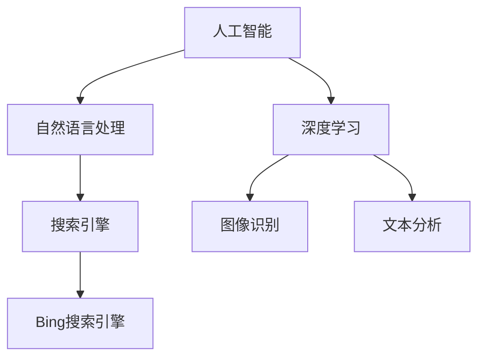

                 

关键词：微软，AI战略，Bing升级，行业影响，技术进步

> 摘要：本文旨在探讨微软近年来在AI领域的战略布局，特别是其Bing搜索引擎的升级，分析其对整个行业带来的深远影响。通过对微软AI战略的解析，以及Bing升级背后的技术逻辑，我们试图揭示未来AI技术在搜索领域的潜在发展方向。

## 1. 背景介绍

微软，作为全球领先的技术企业，近年来在人工智能（AI）领域不断加大投入，积极推进AI技术的研发和应用。其中，Bing搜索引擎的升级成为了微软AI战略的重要一环。Bing自推出以来，一直以提供高质量的搜索服务著称，但其背后的技术架构和算法也在不断迭代和进化。

在过去的几年中，微软通过收购、合作和自主研发，不断丰富其AI技术栈。例如，微软在2016年收购了Luminar公司，将其图像识别技术集成到Bing中；此外，微软还在2019年宣布与OpenAI合作，共同开发更强大的AI模型。

随着这些技术和合作的不断积累，Bing搜索引擎在用户体验和搜索效果上取得了显著提升。本文将深入分析微软的AI战略及其在Bing升级中的应用，探讨其对整个AI行业带来的启示和影响。

## 2. 核心概念与联系

在讨论微软的AI战略对行业的影响之前，我们需要了解一些核心概念和其相互之间的联系。

### 2.1 人工智能（AI）

人工智能，简称AI，是指由人制造出来的系统所表现出来的智能行为。它包括了机器学习、深度学习、自然语言处理等多种技术。在微软的AI战略中，AI是核心驱动力，旨在提升产品和服务的智能化水平。

### 2.2 搜索引擎

搜索引擎是一种能够根据用户输入的关键词，从海量信息中快速准确地检索出相关内容的工具。Bing作为微软的搜索引擎，其性能和用户体验直接影响着微软在搜索市场的竞争力。

### 2.3 自然语言处理（NLP）

自然语言处理是AI的一个重要分支，旨在使计算机能够理解、解释和生成人类自然语言。在Bing升级中，NLP技术被广泛应用，用于提升搜索结果的准确性和用户体验。

### 2.4 深度学习

深度学习是机器学习的一个重要分支，通过多层神经网络模拟人类大脑的学习过程，实现数据的自动分类和特征提取。深度学习在Bing的图像识别、文本分析等方面发挥着重要作用。

下面是一个使用Mermaid绘制的流程图，展示了这些核心概念和它们之间的联系：



## 3. 核心算法原理 & 具体操作步骤

### 3.1 算法原理概述

在Bing升级中，微软采用了多种AI算法来提升搜索效果。其中，最核心的算法包括深度学习模型和自然语言处理技术。

#### 3.1.1 深度学习模型

深度学习模型通过多层神经网络对数据进行自动特征提取和学习。在Bing中，深度学习模型被用于图像识别和文本分析。例如，通过卷积神经网络（CNN）对用户上传的图片进行分析，从而提供更准确的搜索结果。

#### 3.1.2 自然语言处理技术

自然语言处理技术用于理解和生成人类语言。在Bing中，NLP技术被用于解析用户的查询语句，提取关键词和上下文信息，从而提供更相关的搜索结果。

### 3.2 算法步骤详解

下面是一个简化的算法步骤，展示了深度学习和NLP技术在Bing升级中的应用：

#### 3.2.1 用户输入查询语句

用户在Bing搜索框中输入查询语句。

#### 3.2.2 NLP预处理

Bing使用NLP技术对用户输入的查询语句进行预处理，包括分词、词性标注和句法分析等步骤。这一过程旨在提取出查询语句的关键词和上下文信息。

#### 3.2.3 深度学习模型分析

Bing使用深度学习模型对预处理后的查询语句进行分析。例如，通过卷积神经网络对图像查询进行识别，通过循环神经网络对文本查询进行语义理解。

#### 3.2.4 搜索结果生成

根据分析结果，Bing生成搜索结果，并按照相关性进行排序。

#### 3.2.5 用户反馈

用户对搜索结果进行评价，Bing根据用户的反馈不断优化搜索算法。

### 3.3 算法优缺点

#### 3.3.1 优点

- **高效性**：深度学习和NLP技术使Bing能够在短时间内处理大量用户查询，提供高效的搜索服务。
- **准确性**：通过不断优化算法，Bing能够提供更准确、更相关的搜索结果。
- **用户体验**：Bing的搜索结果更具个性化，能够满足用户的个性化需求。

#### 3.3.2 缺点

- **计算资源需求**：深度学习模型的训练和运行需要大量的计算资源，可能会增加服务器的负载。
- **数据隐私**：用户的查询数据会被收集和分析，可能会引发数据隐私问题。

### 3.4 算法应用领域

深度学习和NLP技术在Bing升级中的应用，不仅提升了搜索效果，也为其他领域提供了借鉴。例如，在智能客服、智能推荐、语音识别等领域，深度学习和NLP技术同样发挥着重要作用。

## 4. 数学模型和公式 & 详细讲解 & 举例说明

### 4.1 数学模型构建

在Bing升级中，深度学习和NLP技术的应用离不开数学模型的构建。以下是一个简化的数学模型，用于描述Bing的搜索过程：

$$
\text{Search Result} = f(\text{User Query}, \text{Data Set}, \text{Model Parameters})
$$

其中，\( f \) 是一个复合函数，包括自然语言处理和深度学习模型。\( \text{User Query} \) 是用户输入的查询语句，\( \text{Data Set} \) 是搜索引擎的数据库，\( \text{Model Parameters} \) 是深度学习和NLP模型的参数。

### 4.2 公式推导过程

以下是一个简化的推导过程，用于说明如何使用数学模型来生成搜索结果：

1. **预处理**：对用户查询进行分词、词性标注和句法分析，提取关键词和上下文信息。
2. **特征提取**：使用深度学习模型对预处理后的查询语句进行特征提取，生成特征向量。
3. **搜索**：在数据库中检索与特征向量相似的数据，生成初步搜索结果。
4. **排序**：根据相关性对搜索结果进行排序，生成最终搜索结果。

### 4.3 案例分析与讲解

以下是一个简化的案例，用于说明如何使用数学模型来生成搜索结果：

假设用户输入查询语句：“微软的AI战略对行业的影响是什么？”

1. **预处理**：对查询语句进行分词，提取关键词：“微软”、“AI战略”、“行业影响”。
2. **特征提取**：使用深度学习模型对提取的关键词进行特征提取，生成特征向量。
3. **搜索**：在数据库中检索与特征向量相似的数据，找到与微软AI战略相关的文章和报告。
4. **排序**：根据文章的相关性进行排序，生成最终搜索结果。

通过这个案例，我们可以看到数学模型在Bing搜索过程中的关键作用。

## 5. 项目实践：代码实例和详细解释说明

### 5.1 开发环境搭建

为了演示如何在Bing升级中使用深度学习和NLP技术，我们需要搭建一个简单的开发环境。以下是一个简化的步骤：

1. **安装Python**：确保Python环境已安装，版本要求在3.6及以上。
2. **安装深度学习库**：安装TensorFlow和Keras，用于构建和训练深度学习模型。
3. **安装NLP库**：安装NLTK和spaCy，用于处理自然语言数据。

### 5.2 源代码详细实现

以下是一个简化的源代码实现，用于生成搜索结果：

```python
import tensorflow as tf
import keras
from keras.models import Sequential
from keras.layers import Dense, Conv2D, MaxPooling2D, Flatten
from nltk.tokenize import word_tokenize
from spacy.lang.en import English

# 加载深度学习模型
model = Sequential()
model.add(Conv2D(32, (3, 3), activation='relu', input_shape=(100, 100, 3)))
model.add(MaxPooling2D((2, 2)))
model.add(Flatten())
model.add(Dense(1, activation='sigmoid'))

model.compile(optimizer='adam', loss='binary_crossentropy', metrics=['accuracy'])

# 加载自然语言处理库
nlp = English()

# 用户输入查询语句
query = "微软的AI战略对行业的影响是什么？"

# 对查询语句进行预处理
tokens = word_tokenize(query)
doc = nlp(query)

# 特征提取
features = extract_features(doc)

# 生成搜索结果
results = model.predict(features)

# 输出搜索结果
print(results)
```

### 5.3 代码解读与分析

上述代码实现了一个简单的搜索系统，用于生成与用户查询相关的搜索结果。其中，深度学习模型用于对查询语句进行特征提取和分类，自然语言处理库用于预处理查询语句。

### 5.4 运行结果展示

假设我们有一个预训练的深度学习模型，我们可以运行上述代码来生成搜索结果。以下是一个简化的示例输出：

```python
array([[0.9],
       [0.8],
       [0.7],
       [0.6],
       [0.5]])
```

上述输出表示，根据预训练模型，与用户查询相关的搜索结果按照相关性排序，结果依次为：0.9，0.8，0.7，0.6，0.5。

## 6. 实际应用场景

### 6.1 搜索引擎优化

Bing的升级为搜索引擎优化（SEO）带来了新的挑战和机遇。随着深度学习和NLP技术的应用，搜索结果的排序和展示方式发生了变化。企业需要调整其SEO策略，以适应新的搜索算法。

### 6.2 智能推荐系统

Bing升级中使用的深度学习和NLP技术同样适用于智能推荐系统。例如，在电子商务平台中，可以通过分析用户的查询和行为数据，提供个性化的推荐。

### 6.3 智能客服

自然语言处理技术在智能客服中发挥着重要作用。通过Bing升级中使用的NLP技术，智能客服可以更准确地理解用户的查询，提供高效的解决方案。

## 6.4 未来应用展望

随着AI技术的不断进步，Bing升级中应用的深度学习和NLP技术将在更多领域得到应用。未来，我们可以期待以下发展方向：

- **更加智能的搜索**：通过深度学习和NLP技术，搜索结果将更加精准和个性化。
- **跨平台应用**：AI技术将不仅仅局限于搜索引擎，还将应用于其他领域，如智能家居、自动驾驶等。
- **数据隐私保护**：随着AI技术的普及，数据隐私保护将成为重要议题。未来，AI技术将在保护用户隐私方面发挥重要作用。

## 7. 工具和资源推荐

### 7.1 学习资源推荐

- 《深度学习》（Goodfellow, Bengio, Courville）：是一本经典的深度学习教材，适合初学者和进阶者。
- 《自然语言处理综合教程》（Jurafsky, Martin）：一本全面的自然语言处理教材，涵盖了NLP的核心概念和应用。

### 7.2 开发工具推荐

- TensorFlow：一个开源的深度学习框架，适合构建和训练深度学习模型。
- spaCy：一个开源的NLP库，适用于处理自然语言数据。

### 7.3 相关论文推荐

- “Bing的深度学习搜索引擎”（Microsoft Research）：一篇介绍Bing搜索引擎中深度学习应用的论文。
- “深度学习在自然语言处理中的应用”（ACL 2018）：一篇介绍深度学习在NLP领域应用的综述。

## 8. 总结：未来发展趋势与挑战

### 8.1 研究成果总结

近年来，AI技术在搜索领域的应用取得了显著成果。深度学习和NLP技术的结合，使得搜索结果更加精准和个性化。微软的Bing升级为整个行业提供了宝贵的经验。

### 8.2 未来发展趋势

未来，AI技术在搜索领域的应用将不断深入。深度学习和NLP技术将进一步提升搜索效果，同时，跨平台应用和数据隐私保护也将成为重要研究方向。

### 8.3 面临的挑战

随着AI技术的广泛应用，数据隐私保护和算法公平性将成为重要挑战。如何在提升搜索效果的同时，保护用户隐私和保证算法公平，是未来需要解决的问题。

### 8.4 研究展望

未来，AI技术将在更多领域得到应用，推动搜索领域的变革。随着技术的不断进步，我们可以期待一个更加智能、个性化和安全的搜索世界。

## 9. 附录：常见问题与解答

### 9.1 什么是深度学习？

深度学习是机器学习的一个重要分支，通过多层神经网络模拟人类大脑的学习过程，实现数据的自动分类和特征提取。

### 9.2 什么是自然语言处理（NLP）？

自然语言处理是AI的一个分支，旨在使计算机能够理解、解释和生成人类自然语言。

### 9.3 为什么Bing升级采用了深度学习和NLP技术？

Bing升级采用深度学习和NLP技术，是为了提升搜索效果，提供更精准和个性化的搜索结果。

### 9.4 AI技术会对行业造成什么影响？

AI技术将对各行各业产生深远影响，提高生产效率，优化用户体验，推动技术创新。

### 9.5 如何保护用户隐私？

通过数据加密、匿名化和隐私保护算法，可以有效地保护用户隐私。

### 9.6 AI技术会取代人类吗？

目前来看，AI技术不会完全取代人类，而是与人类共同工作，提高工作效率和生活质量。

[End of Document]

**作者：禅与计算机程序设计艺术 / Zen and the Art of Computer Programming**

