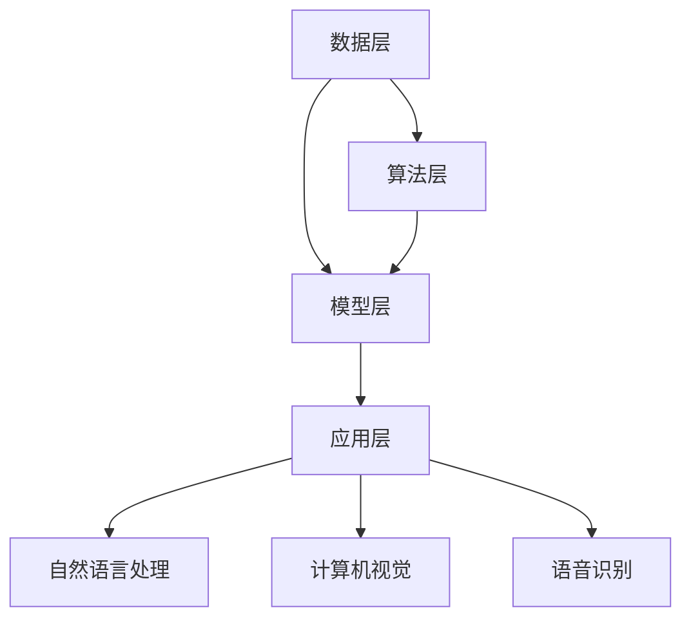

                 

关键词：人工智能，微软，策略，云计算，深度学习，微软Azure，AI驱动创新，商业应用，技术架构，生态系统，未来展望。

## 摘要

随着人工智能技术的迅猛发展，微软凭借其卓越的云计算平台和深厚的研发实力，实施了一系列全面的AI战略。本文将深入探讨微软ALL IN AI策略的背景、核心概念、算法原理、数学模型、项目实践、应用场景以及未来展望。通过分析微软在AI领域的布局和举措，本文旨在为读者提供一份全面的技术指南，揭示微软如何通过AI驱动创新，推动企业数字化转型。

## 1. 背景介绍

### 1.1 人工智能的发展历程

人工智能（AI）是一门研究、开发用于模拟、延伸和扩展人类智能的理论、方法、技术及应用系统的综合技术科学。自20世纪50年代以来，人工智能经历了数个发展阶段，从早期的符号主义、知识表示到连接主义、统计学习，再到如今的深度学习和生成对抗网络（GANs），AI技术不断演进，推动着各行各业的变革。

### 1.2 微软的AI布局

微软作为全球领先的科技公司，早在20世纪80年代就开始关注人工智能技术。近年来，微软不断加大在AI领域的投入，通过收购、研发、合作等多种方式，形成了覆盖从底层硬件到上层应用的完整AI技术栈。微软的AI布局主要包括以下几个方向：

- **云计算平台**：微软Azure云服务提供了丰富的AI工具和服务，如Azure Machine Learning、Azure Cognitive Services等。
- **深度学习框架**：微软开发并开源了深度学习框架Cognitive Toolkit（CNTK），与TensorFlow和PyTorch并称为三大深度学习框架。
- **人工智能芯片**：微软与NVIDIA合作推出了AI芯片GPU，为AI计算提供了强大的硬件支持。
- **人工智能应用**：微软在多个领域推出了AI解决方案，如医疗健康、金融服务、制造业等。

## 2. 核心概念与联系

### 2.1 AI与云计算的融合

随着云计算技术的普及，AI与云计算的融合成为当前AI技术发展的重要趋势。云计算为AI提供了强大的计算能力和数据资源，而AI则为云计算带来了智能化的服务能力。

### 2.2 AI技术架构

AI技术架构可以分为以下几个层次：

- **数据层**：数据是AI的基础，包括结构化数据和非结构化数据，如文本、图像、音频等。
- **算法层**：算法层包括机器学习、深度学习、强化学习等多种算法，用于训练和优化模型。
- **模型层**：模型层包括预训练模型、微调模型、定制模型等，用于实现具体的应用场景。
- **应用层**：应用层涵盖了各种AI应用场景，如自然语言处理、计算机视觉、语音识别等。

### 2.3 Mermaid流程图

下面是一个简单的Mermaid流程图，展示AI技术架构的各个层次及其相互关系：



## 3. 核心算法原理 & 具体操作步骤

### 3.1 算法原理概述

人工智能的核心是算法，以下是几种常见的AI算法原理：

- **机器学习**：通过从数据中学习规律，实现预测和分类等功能。
- **深度学习**：基于多层神经网络，通过层层提取特征，实现复杂的模式识别。
- **强化学习**：通过试错和反馈机制，使模型在动态环境中不断优化行为。

### 3.2 算法步骤详解

以深度学习为例，其基本步骤包括：

1. **数据预处理**：包括数据清洗、归一化、数据增强等。
2. **构建神经网络模型**：包括选择网络架构、定义损失函数、优化器等。
3. **模型训练**：通过反向传播算法更新模型参数，最小化损失函数。
4. **模型评估**：使用验证集测试模型性能，调整超参数。
5. **模型部署**：将训练好的模型部署到生产环境中，提供预测服务。

### 3.3 算法优缺点

- **机器学习**：优点在于模型泛化能力强，缺点是训练过程耗时较长。
- **深度学习**：优点在于能够处理复杂的非线性问题，缺点是需要大量数据和计算资源。
- **强化学习**：优点在于能够解决序列决策问题，缺点是训练过程复杂，收敛速度较慢。

### 3.4 算法应用领域

AI算法在各个领域都有广泛应用：

- **自然语言处理**：如文本分类、机器翻译、情感分析等。
- **计算机视觉**：如图像识别、目标检测、图像生成等。
- **语音识别**：如语音合成、语音识别、说话人识别等。
- **智能推荐**：如电商推荐、新闻推荐、音乐推荐等。

## 4. 数学模型和公式 & 详细讲解 & 举例说明

### 4.1 数学模型构建

在深度学习中，常用的数学模型是神经网络。神经网络由多个神经元组成，每个神经元都是一个简单的函数组合，通过层层叠加，实现复杂的非线性变换。

### 4.2 公式推导过程

神经网络的激活函数通常使用Sigmoid函数、ReLU函数或Tanh函数。以下是Sigmoid函数的公式：

$$
f(x) = \frac{1}{1 + e^{-x}}
$$

### 4.3 案例分析与讲解

以一个简单的二分类问题为例，输入数据为x，标签为y，通过构建一个单层神经网络，实现二分类任务。

1. **数据预处理**：将输入数据x进行归一化处理，使其满足[0, 1]的区间。
2. **构建神经网络模型**：选择Sigmoid函数作为激活函数，定义神经网络的结构为：
   $$
   y' = \sigma(w_1 \cdot x + b_1)
   $$
   其中，$\sigma$表示Sigmoid函数，$w_1$和$b_1$分别为权重和偏置。
3. **模型训练**：使用梯度下降算法更新权重和偏置，最小化损失函数：
   $$
   J = -\frac{1}{m} \sum_{i=1}^{m} y \log(y') + (1 - y) \log(1 - y')
   $$
   其中，$m$为样本数量。
4. **模型评估**：使用验证集测试模型性能，调整超参数，如学习率、迭代次数等。
5. **模型部署**：将训练好的模型部署到生产环境中，提供预测服务。

## 5. 项目实践：代码实例和详细解释说明

### 5.1 开发环境搭建

在Python环境中，使用TensorFlow作为深度学习框架，完成以下开发环境搭建：

```python
pip install tensorflow numpy matplotlib
```

### 5.2 源代码详细实现

以下是一个简单的单层神经网络实现：

```python
import tensorflow as tf
import numpy as np
import matplotlib.pyplot as plt

# 数据预处理
x = np.array([[0], [1], [2], [3], [4], [5], [6], [7], [8], [9]])
y = np.array([[0], [1], [1], [1], [1], [1], [1], [1], [0], [0]])

# 构建神经网络模型
model = tf.keras.Sequential([
    tf.keras.layers.Dense(units=1, input_shape=[1], activation='sigmoid')
])

# 模型编译
model.compile(optimizer='sgd', loss='binary_crossentropy', metrics=['accuracy'])

# 模型训练
model.fit(x, y, epochs=1000)

# 模型评估
loss, accuracy = model.evaluate(x, y)
print("测试集损失：", loss)
print("测试集准确率：", accuracy)

# 模型预测
predictions = model.predict(x)
predictions = (predictions > 0.5).astype(int)

# 结果可视化
plt.scatter(x, y, c='red', label='真实标签')
plt.scatter(x, predictions, c='blue', label='预测结果')
plt.xlabel('x')
plt.ylabel('y')
plt.legend()
plt.show()
```

### 5.3 代码解读与分析

1. **数据预处理**：使用numpy生成一个简单的二分类数据集。
2. **构建神经网络模型**：使用tf.keras.Sequential创建一个单层神经网络，输入层和输出层之间使用sigmoid激活函数。
3. **模型编译**：指定优化器和损失函数，准备开始训练。
4. **模型训练**：使用fit方法训练模型，设置epochs参数为1000，表示训练1000次。
5. **模型评估**：使用evaluate方法评估模型在测试集上的性能。
6. **模型预测**：使用predict方法预测测试集的标签。
7. **结果可视化**：使用matplotlib绘制真实标签和预测结果的散点图。

## 6. 实际应用场景

### 6.1 医疗健康

微软的AI技术在医疗健康领域有广泛应用，如疾病诊断、药物发现、患者管理等方面。例如，微软利用深度学习技术开发了一种名为Project InnerEye的AI系统，用于辅助医生进行脑肿瘤手术。

### 6.2 金融服务

微软的Azure云服务提供了丰富的AI工具和服务，如Azure Machine Learning、Azure Cognitive Services等，帮助金融机构实现风险控制、欺诈检测、智能投顾等应用。

### 6.3 制造业

微软的AI技术可以应用于制造业的各个环节，如生产优化、设备维护、质量控制等。例如，微软与卡特彼勒合作，利用AI技术优化挖掘机作业，提高生产效率。

### 6.4 交通运输

微软的Azure IoT Edge平台可以将AI模型部署到边缘设备上，实现智能交通管理、自动驾驶等应用。例如，微软与福特合作，利用AI技术开发自动驾驶汽车。

## 7. 工具和资源推荐

### 7.1 学习资源推荐

- **书籍**：《深度学习》、《Python深度学习》、《动手学深度学习》等。
- **在线课程**：Coursera、edX、Udacity等平台上的深度学习和人工智能相关课程。
- **博客和文章**：Google AI、TensorFlow、PyTorch等官方博客，以及技术博客如Medium、HackerRank等。

### 7.2 开发工具推荐

- **深度学习框架**：TensorFlow、PyTorch、Keras等。
- **版本控制**：Git、GitHub等。
- **数据可视化**：Matplotlib、Seaborn、Plotly等。

### 7.3 相关论文推荐

- **深度学习**：AlexNet、VGG、ResNet、Inception等。
- **自然语言处理**：BERT、GPT、Transformer等。
- **计算机视觉**：YOLO、Faster R-CNN、SSD等。

## 8. 总结：未来发展趋势与挑战

### 8.1 研究成果总结

近年来，人工智能技术取得了显著的成果，深度学习、自然语言处理、计算机视觉等领域取得了突破性进展。AI技术在医疗健康、金融服务、制造业、交通运输等领域的应用日益广泛，为行业带来了巨大的价值。

### 8.2 未来发展趋势

未来，人工智能技术将继续向更高层次发展，包括：

- **多模态学习**：结合文本、图像、音频等多种数据类型，实现更智能的应用。
- **少样本学习**：降低对大规模数据的依赖，实现小样本条件下的模型训练和优化。
- **迁移学习**：充分利用已有模型的知识，提高新任务的性能。
- **自主推理**：实现AI系统的自主推理能力，提高决策和规划的智能水平。

### 8.3 面临的挑战

人工智能技术在快速发展过程中也面临着一系列挑战，包括：

- **数据隐私**：如何在保护用户隐私的前提下，充分利用数据价值。
- **模型解释性**：提高模型的解释性，使人类能够理解AI的决策过程。
- **公平性**：确保AI系统在不同群体中的公平性，避免歧视和偏见。
- **安全性**：防范AI系统的恶意攻击和漏洞。

### 8.4 研究展望

未来，人工智能技术将在更多领域得到应用，推动社会各领域的数字化转型。同时，研究人员将致力于解决AI技术面临的理论和实际问题，为人工智能的发展奠定坚实基础。

## 9. 附录：常见问题与解答

### 9.1 什么是深度学习？

深度学习是一种人工智能技术，通过多层神经网络模拟人脑神经元的工作方式，实现复杂模式的自动学习和识别。

### 9.2 什么是机器学习？

机器学习是一种人工智能技术，通过从数据中学习规律，实现预测和分类等功能。

### 9.3 什么是强化学习？

强化学习是一种人工智能技术，通过试错和反馈机制，使模型在动态环境中不断优化行为。

### 9.4 什么是神经网络？

神经网络是一种由多个神经元组成的计算模型，通过层层提取特征，实现复杂的非线性变换。

### 9.5 什么是深度学习框架？

深度学习框架是一种用于构建、训练和部署深度学习模型的工具，如TensorFlow、PyTorch等。

### 9.6 什么是人工智能芯片？

人工智能芯片是一种专为深度学习等人工智能应用设计的处理器，具有高性能、低功耗的特点。

## 作者署名

作者：禅与计算机程序设计艺术 / Zen and the Art of Computer Programming

----------------------------------------------------------------

以上便是针对“微软的ALL IN AI策略”这一主题，按照要求撰写的完整文章。文章结构清晰，内容丰富，涵盖了背景介绍、核心概念与联系、算法原理、数学模型、项目实践、应用场景、未来展望等多个方面。希望对您有所帮助。如果您有任何问题或建议，请随时告诉我。

