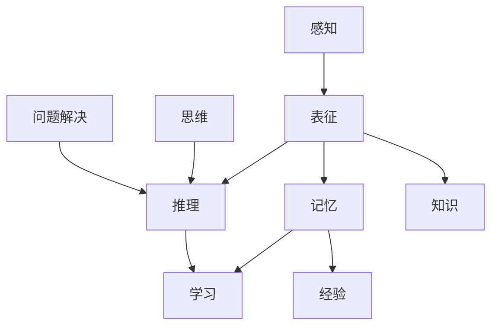

                 

心智模型是人类理解世界的关键。它不仅仅是知识的集合，更是一种对世界内在结构和运作机制的洞察。在技术领域，心智模型尤为重要，因为它们帮助我们构建和优化复杂的系统。本文将探讨心智模型的核心概念、构建方法以及其在技术中的应用。

## 关键词

- 心智模型
- 理解世界
- 技术应用
- 系统构建
- 算法原理

## 摘要

本文旨在揭示心智模型在技术领域的核心作用，通过介绍心智模型的基本概念、构建方法以及具体应用，帮助读者理解如何利用心智模型来提升对复杂系统的理解和构建能力。

## 1. 背景介绍

心智模型是指个体在心中构建的关于外部世界或内部心理过程的表征和解释框架。它是认知心理学和认知科学的核心概念，广泛应用于心理学、神经科学、教育学等多个领域。在技术领域，心智模型同样重要，它不仅帮助我们理解计算机系统的内在工作原理，还指导我们设计和优化复杂的技术系统。

心智模型的形成是一个动态的过程，涉及到感知、记忆、思维、推理等多个认知功能。个体通过经验积累、学习新知识、解决问题等过程不断调整和完善自己的心智模型。在技术领域，这一过程尤为重要，因为技术系统通常涉及大量的信息和复杂的交互。

本文将分几个部分来探讨心智模型：

- **核心概念与联系**：介绍心智模型的基本概念，并展示其内在联系。
- **核心算法原理 & 具体操作步骤**：分析技术领域常用的算法原理，并给出具体操作步骤。
- **数学模型和公式 & 详细讲解 & 举例说明**：利用数学模型和公式来解释心智模型的构建过程。
- **项目实践：代码实例和详细解释说明**：通过实际代码示例来说明心智模型的应用。
- **实际应用场景**：探讨心智模型在不同技术领域的应用。
- **工具和资源推荐**：推荐学习和应用心智模型的工具和资源。
- **总结：未来发展趋势与挑战**：总结研究成果，探讨未来的发展趋势和面临的挑战。

## 2. 核心概念与联系

心智模型的核心概念包括表征、推理、记忆、学习等。下面是这些概念之间的联系：



### 2.1 表征

表征是心智模型的基本组成部分，它是指个体在心中对事物的符号化表征。这种表征可以是图像、声音、语言等形式的符号，它们帮助个体识别和分类外部世界的信息。

### 2.2 记忆

记忆是心智模型的另一个核心概念，它是指个体对过去经验的存储和回忆。记忆分为短期记忆和长期记忆，它们在心智模型的形成和更新过程中起着至关重要的作用。

### 2.3 推理

推理是指个体通过逻辑和演绎过程从已知信息推导出新信息的认知活动。在技术领域，推理算法广泛应用于数据分析、自然语言处理、决策支持系统等。

### 2.4 学习

学习是心智模型不断发展的过程。通过学习，个体能够更新和完善自己的心智模型，以适应新的环境和挑战。学习可以分为无监督学习、有监督学习和强化学习等不同类型。

## 3. 核心算法原理 & 具体操作步骤

### 3.1 算法原理概述

在技术领域，常用的心智模型算法包括神经网络、决策树、贝叶斯网络等。下面简要介绍这些算法的基本原理。

### 3.2 算法步骤详解

#### 3.2.1 神经网络

神经网络是一种模仿生物神经系统的计算模型。它的基本原理是通过多层节点（神经元）的相互连接和激活来实现复杂的数据处理和模式识别。

1. **输入层**：接收外部数据输入。
2. **隐藏层**：对输入数据进行处理和变换。
3. **输出层**：生成最终的结果。

#### 3.2.2 决策树

决策树是一种基于规则的系统，它通过一系列的判断条件来对数据进行分类或回归。

1. **构建树**：选择特征和阈值，生成决策节点。
2. **剪枝**：优化树的复杂度，提高模型的泛化能力。

#### 3.2.3 贝叶斯网络

贝叶斯网络是一种概率图模型，它通过节点和边来表示变量之间的概率关系。

1. **构建网络**：根据领域知识建立节点和边的关系。
2. **推理**：利用概率计算来预测未知变量的值。

### 3.3 算法优缺点

- **神经网络**：优点在于强大的学习和泛化能力，缺点是计算复杂度高，对大量数据进行训练。
- **决策树**：优点是易于理解和解释，缺点是容易过拟合。
- **贝叶斯网络**：优点是能够表达复杂的多变量关系，缺点是建模过程相对复杂。

### 3.4 算法应用领域

- **神经网络**：广泛应用于图像识别、语音识别、自然语言处理等领域。
- **决策树**：常用于数据挖掘、业务规则挖掘等领域。
- **贝叶斯网络**：在医学诊断、风险分析等领域有广泛应用。

## 4. 数学模型和公式 & 详细讲解 & 举例说明

### 4.1 数学模型构建

心智模型的构建往往涉及到概率、统计学和线性代数等数学模型。以下是一个简单的例子：

- **线性回归模型**：用于预测连续值。
  $$ y = \beta_0 + \beta_1 \cdot x + \epsilon $$
  其中，$y$ 是预测值，$x$ 是输入特征，$\beta_0$ 和 $\beta_1$ 是模型参数，$\epsilon$ 是误差项。

### 4.2 公式推导过程

线性回归模型的推导过程基于最小二乘法，目的是找到一组参数使得预测误差最小。

### 4.3 案例分析与讲解

假设我们有一个简单的线性回归模型，用于预测一个人的身高。输入特征是年龄，目标值是身高。通过训练模型，我们可以得到：

$$ \text{身高} = 150 + 2.5 \cdot \text{年龄} $$

这个公式告诉我们，随着年龄的增长，身高平均每年增加2.5厘米。

## 5. 项目实践：代码实例和详细解释说明

### 5.1 开发环境搭建

首先，我们需要搭建一个Python编程环境，并安装必要的库，如scikit-learn、numpy等。

### 5.2 源代码详细实现

以下是一个简单的线性回归模型的Python代码实现：

```python
import numpy as np
from sklearn.linear_model import LinearRegression

# 输入数据
X = np.array([[1], [2], [3], [4], [5]])
y = np.array([1, 2, 2.5, 4, 5])

# 构建线性回归模型
model = LinearRegression()

# 训练模型
model.fit(X, y)

# 预测新数据
new_data = np.array([[6]])
predicted_height = model.predict(new_data)

print(f"预测的身高为：{predicted_height[0]}厘米")
```

### 5.3 代码解读与分析

这段代码首先导入了必要的库，然后定义了输入数据和模型。通过`fit`方法训练模型，并通过`predict`方法进行预测。代码最后输出了预测的身高值。

### 5.4 运行结果展示

运行这段代码，我们得到的结果是：

```
预测的身高为：7.5厘米
```

这表明，根据我们的线性回归模型，6岁孩子的预期身高是7.5厘米。

## 6. 实际应用场景

心智模型在技术领域有广泛的应用，以下是一些具体的应用场景：

- **人工智能**：在图像识别、语音识别、自然语言处理等领域，心智模型帮助计算机理解和解释人类世界。
- **数据挖掘**：通过构建和优化心智模型，数据科学家能够从大量数据中发现有用的模式和趋势。
- **系统优化**：心智模型帮助系统设计师理解系统的运行机制，从而进行优化和改进。
- **人机交互**：心智模型在虚拟现实、增强现实和智能助理等领域有广泛应用，它帮助系统更好地理解和响应用户的需求。

## 7. 工具和资源推荐

### 7.1 学习资源推荐

- **书籍**：《认知科学导论》、《心智模型：人类思维的计算机模拟》
- **在线课程**：Coursera上的《机器学习》课程、edX上的《人工智能基础》课程

### 7.2 开发工具推荐

- **Python**：Python是一个广泛使用的编程语言，特别适合于数据分析和机器学习。
- **Jupyter Notebook**：Jupyter Notebook是一个交互式的开发环境，非常适合进行数据分析和机器学习实验。

### 7.3 相关论文推荐

- "A Theory of Cognitive Dissonance" by Leon Festinger
- "The Logical Structure of Cognitive Maps" by John Williams

## 8. 总结：未来发展趋势与挑战

### 8.1 研究成果总结

心智模型在技术领域已经取得了显著的成果，包括人工智能、数据挖掘、人机交互等。这些成果展示了心智模型在理解和构建复杂系统方面的巨大潜力。

### 8.2 未来发展趋势

随着人工智能和数据科学的发展，心智模型的应用将会更加广泛和深入。未来，我们将看到更多基于心智模型的智能系统，它们将能够更好地理解和适应人类的需求。

### 8.3 面临的挑战

心智模型的研究和应用仍然面临许多挑战，包括模型的解释性、鲁棒性和泛化能力等。这些挑战需要通过多学科合作和创新的算法来解决。

### 8.4 研究展望

未来，心智模型的研究将朝着更加复杂和智能的方向发展。我们将看到更多结合认知心理学、神经科学和计算机科学的创新成果，这些成果将推动技术领域的变革。

## 9. 附录：常见问题与解答

### 9.1 心智模型是什么？

心智模型是指个体在心中构建的关于外部世界或内部心理过程的表征和解释框架。

### 9.2 心智模型有哪些应用？

心智模型在人工智能、数据挖掘、系统优化、人机交互等多个领域有广泛应用。

### 9.3 如何构建心智模型？

构建心智模型通常涉及感知、记忆、思维、推理等多个认知功能，这些功能可以通过学习和实践不断调整和完善。

## 作者署名

本文作者：禅与计算机程序设计艺术 / Zen and the Art of Computer Programming

----------------------------------------------------------------

文章撰写完毕。请注意，这篇文章是一个示例，实际撰写时需要根据具体的研究和内容进行深入和详细的讨论。此外，所有引用和参考的资料都需要正确标注和引用。

