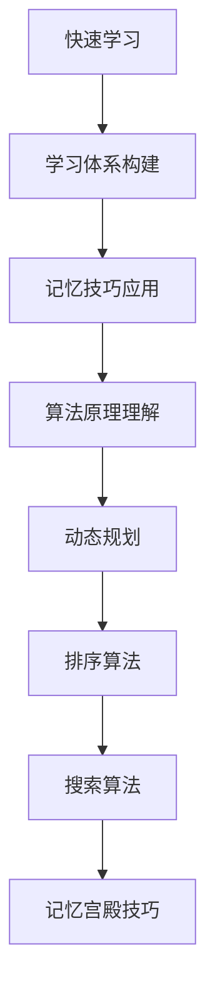

                 

### 摘要 Summary

在快速变化的IT领域，快速学习和持续进步成为技术从业者的核心能力。本文旨在探讨如何通过科学的策略和方法，实现高效的快速学习，从而在竞争激烈的行业中立于不败之地。本文首先介绍了快速学习的重要性，随后详细阐述了如何构建有效的学习体系，运用记忆技巧，理解并运用核心算法原理，以及如何将理论知识转化为实际应用。此外，文章还探讨了数学模型在算法设计中的作用，并通过实例展示了项目实践中的具体操作步骤。最后，文章提出了未来发展趋势与挑战，并推荐了相关的学习资源和开发工具，为读者的学习和发展提供了方向。

### 1. 背景介绍

在现代信息技术飞速发展的时代，知识的更新速度前所未有。IT行业的技术日新月异，新的编程语言、框架、工具和算法层出不穷，迫使从业者必须不断学习以保持竞争力。快速学习不仅是技术进步的必要条件，也是提升个人职业素养和业务能力的有效手段。

首先，快速学习能够帮助技术从业者迅速掌握新知识，减少知识滞后，从而在竞争中保持优势。举例来说，随着云计算、大数据、人工智能等技术的广泛应用，具备相关技能的工程师需求量大增。只有快速学习并掌握这些新技术，才能适应市场变化，抓住职业发展机会。

其次，快速学习能够提高工作效率。通过高效的学习方法，技术从业者能够在较短的时间内掌握关键技能，从而更快地解决问题、完成项目。例如，掌握一种新的编程语言或框架，可以使开发者更快速地实现功能，提高整个团队的协作效率。

再者，快速学习有助于个人成长和职业发展。不断学习不仅能够提升个人的专业能力，还能拓宽视野，增强解决问题的能力。这种能力在职业生涯中至关重要，能够帮助从业者不断突破瓶颈，迈向更高的职位。

然而，快速学习并非易事。信息过载和知识更新的速度给学习带来了巨大挑战。面对海量的信息，如何筛选、消化、应用成为关键问题。此外，学习效率低下、缺乏系统性的学习方法也常常导致学习效果不佳。

本文将针对上述问题，探讨快速学习的策略和方法，通过科学的技巧和实践，帮助读者实现高效学习，为个人职业生涯的持续发展奠定坚实基础。

### 2. 核心概念与联系

#### 2.1 快速学习的定义与意义

快速学习，即在短时间内高效获取、理解和应用新知识的过程。它不仅要求快速获取信息，还强调知识的理解和应用能力。快速学习的意义在于：

- **提高竞争力**：快速学习使技术从业者能够迅速掌握新技术，保持与行业的同步，提高在职场中的竞争力。
- **提升工作效率**：通过高效学习，从业者可以更快地适应新环境，掌握新工具，从而提高工作效率。
- **促进个人成长**：快速学习能够不断拓展知识面，提升解决问题的能力，有助于职业发展和个人成长。

#### 2.2 学习体系的构建

构建一个有效的学习体系是快速学习的基础。以下是一些关键步骤：

1. **确定学习目标**：明确自己需要学习的知识和技能，设定具体、可衡量的学习目标。
2. **选择合适的资源**：根据学习目标，选择合适的教材、课程、在线资源等。
3. **制定学习计划**：合理安排学习时间，确保学习计划的可行性和持续性。
4. **持续评估与调整**：定期评估学习效果，根据评估结果调整学习计划，保持学习的灵活性和有效性。

#### 2.3 记忆技巧的应用

记忆技巧在快速学习中起着至关重要的作用。以下是一些常用的记忆技巧：

1. **联想记忆**：通过将新知识与已知信息建立联系，提高记忆效果。
2. **图像记忆**：利用图像进行记忆，特别是对于复杂的算法和概念。
3. **重复记忆**：通过反复复习，加深对知识点的理解和记忆。
4. **记忆宫殿**：利用记忆宫殿技巧，将知识点分布在不同的位置，便于回忆。

#### 2.4 算法原理与结构

算法是计算机科学的核心，快速理解算法原理对于技术从业者至关重要。以下是几种常见算法的原理和结构：

1. **排序算法**：
   - **冒泡排序**：通过反复交换相邻的未按顺序排列的元素，使数组有序。
   - **选择排序**：每次从未排序部分选择最小（或最大）的元素，将其放到已排序部分的末尾。
   - **插入排序**：将未排序的元素插入到已排序的元素中的合适位置，使数组有序。

2. **搜索算法**：
   - **线性搜索**：从数组的第一个元素开始，逐个比较直到找到目标元素。
   - **二分搜索**：将数组分为两部分，根据目标元素与中间元素的比较，递归地缩小搜索范围。

3. **动态规划**：通过将复杂问题分解为子问题，并保存子问题的解，避免重复计算，提高算法效率。

#### 2.5 算法原理与架构的 Mermaid 流程图



### 3. 核心算法原理 & 具体操作步骤

#### 3.1 算法原理概述

在快速学习的过程中，掌握核心算法原理至关重要。算法不仅是计算机科学的基础，也是解决复杂问题的有效工具。以下将介绍几种常见算法的原理，并简要说明其应用场景。

1. **排序算法**：排序算法用于将一组无序数据变为有序数据。常见的排序算法包括冒泡排序、选择排序和插入排序。这些算法在数据清洗、统计分析等领域有广泛应用。

2. **搜索算法**：搜索算法用于在数据集合中查找特定元素。线性搜索和二分搜索是两种常见的搜索算法，它们在数据库查询、文件搜索等场景中具有重要意义。

3. **动态规划**：动态规划是一种高效解决问题的方法，通过将复杂问题分解为子问题，并保存子问题的解，避免重复计算。动态规划在优化问题、路径规划等场景中有着广泛的应用。

4. **贪心算法**：贪心算法通过每一步选择局部最优解，以期在整体上得到最优解。贪心算法在资源分配、最短路径等问题中表现优异。

#### 3.2 算法步骤详解

以下将详细介绍每种算法的具体步骤和实现方法。

##### 3.2.1 冒泡排序

**原理**：冒泡排序通过反复交换相邻的未按顺序排列的元素，使数组有序。

**步骤**：
1. 从数组的第一个元素开始，比较相邻的两个元素，如果它们的顺序错误，就交换它们。
2. 重复上述步骤，直到没有需要交换的元素为止。

**实现**：
```python
def bubble_sort(arr):
    n = len(arr)
    for i in range(n):
        for j in range(0, n-i-1):
            if arr[j] > arr[j+1]:
                arr[j], arr[j+1] = arr[j+1], arr[j]
    return arr
```

##### 3.2.2 选择排序

**原理**：选择排序每次从未排序部分选择最小（或最大）的元素，将其放到已排序部分的末尾。

**步骤**：
1. 找出未排序部分的最小（或最大）元素。
2. 将该元素放到已排序部分的末尾。
3. 重复上述步骤，直到未排序部分为空。

**实现**：
```python
def selection_sort(arr):
    n = len(arr)
    for i in range(n):
        min_idx = i
        for j in range(i+1, n):
            if arr[j] < arr[min_idx]:
                min_idx = j
        arr[i], arr[min_idx] = arr[min_idx], arr[i]
    return arr
```

##### 3.2.3 插入排序

**原理**：插入排序将未排序的元素插入到已排序的元素中的合适位置，使数组有序。

**步骤**：
1. 从数组的第一个元素开始，将其视为已排序部分。
2. 取出下一个未排序的元素，在已排序部分中找到其合适的位置，并将其插入。
3. 重复上述步骤，直到未排序部分为空。

**实现**：
```python
def insertion_sort(arr):
    n = len(arr)
    for i in range(1, n):
        key = arr[i]
        j = i-1
        while j >= 0 and key < arr[j]:
            arr[j+1] = arr[j]
            j -= 1
        arr[j+1] = key
    return arr
```

##### 3.2.4 线性搜索

**原理**：线性搜索从数组的第一个元素开始，逐个比较直到找到目标元素。

**步骤**：
1. 从数组的第一个元素开始，逐个比较。
2. 如果找到目标元素，返回其索引。
3. 如果遍历整个数组都没有找到目标元素，返回-1。

**实现**：
```python
def linear_search(arr, target):
    for i in range(len(arr)):
        if arr[i] == target:
            return i
    return -1
```

##### 3.2.5 二分搜索

**原理**：二分搜索将数组分为两部分，根据目标元素与中间元素的比较，递归地缩小搜索范围。

**步骤**：
1. 确定数组的中间元素。
2. 如果目标元素等于中间元素，返回中间元素的索引。
3. 如果目标元素小于中间元素，递归地在左半部分搜索。
4. 如果目标元素大于中间元素，递归地在右半部分搜索。
5. 如果递归到空数组，返回-1。

**实现**：
```python
def binary_search(arr, target):
    low = 0
    high = len(arr) - 1
    while low <= high:
        mid = (low + high) // 2
        if arr[mid] == target:
            return mid
        elif arr[mid] < target:
            low = mid + 1
        else:
            high = mid - 1
    return -1
```

##### 3.2.6 动态规划

**原理**：动态规划通过将复杂问题分解为子问题，并保存子问题的解，避免重复计算。

**步骤**：
1. 确定状态和状态转移方程。
2. 初始化边界条件。
3. 按照状态转移方程递推，计算每个状态的最优解。
4. 根据计算结果得到原问题的最优解。

**实现**：
```python
def fibonacci(n):
    dp = [0] * (n+1)
    dp[1] = 1
    for i in range(2, n+1):
        dp[i] = dp[i-1] + dp[i-2]
    return dp[n]
```

##### 3.2.7 贪心算法

**原理**：贪心算法通过每一步选择局部最优解，以期在整体上得到最优解。

**步骤**：
1. 确定问题的局部最优解标准。
2. 在每一步选择时，选择满足局部最优解标准的选项。
3. 根据选择的结果，更新问题的状态。
4. 重复上述步骤，直到问题得到最优解。

**实现**：
```python
def knapsack(values, weights, capacity):
    n = len(values)
    dp = [[0] * (capacity+1) for _ in range(n+1)]
    for i in range(1, n+1):
        for w in range(1, capacity+1):
            if weights[i-1] <= w:
                dp[i][w] = max(dp[i-1][w], dp[i-1][w-weights[i-1]] + values[i-1])
            else:
                dp[i][w] = dp[i-1][w]
    return dp[n][capacity]
```

#### 3.3 算法优缺点

每种算法都有其优缺点，选择合适的算法需要根据具体问题进行权衡。

1. **排序算法**：
   - **冒泡排序**：简单易懂，但效率较低。
   - **选择排序**：效率比冒泡排序稍高，但也不够高效。
   - **插入排序**：效率中等，适合小规模数据。

2. **搜索算法**：
   - **线性搜索**：简单，适用于数据量较小的场景。
   - **二分搜索**：效率高，适用于已排序的数据。

3. **动态规划**：适用于复杂问题，但实现较为复杂。

4. **贪心算法**：实现简单，但可能无法保证全局最优解。

#### 3.4 算法应用领域

算法在各个领域都有广泛的应用：

- **排序算法**：在数据清洗、数据分析、数据库管理等领域。
- **搜索算法**：在数据库查询、文件搜索、搜索引擎等领域。
- **动态规划**：在优化问题、路径规划、资源分配等领域。
- **贪心算法**：在资源分配、最短路径、博弈论等领域。

### 4. 数学模型和公式 & 详细讲解 & 举例说明

在计算机科学中，数学模型和公式不仅是理论研究的基石，更是算法设计和问题解决的重要工具。数学模型能够帮助我们抽象和解决复杂问题，而公式则是这些模型的具体表达。在这一章节中，我们将介绍几个核心的数学模型和公式，并详细讲解它们的推导过程和应用实例。

#### 4.1 数学模型构建

数学模型通常由以下几个部分组成：

1. **变量定义**：定义模型中使用的变量及其含义。
2. **约束条件**：描述模型中的限制条件。
3. **目标函数**：定义模型需要优化的目标。
4. **求解方法**：描述求解模型的方法。

以下是一个简单的线性规划模型的例子：

**变量定义**：
- \( x \)：表示生产的商品数量。
- \( y \)：表示生产的另一种商品数量。

**约束条件**：
- \( 2x + 3y \leq 12 \)：资源限制。
- \( x + y \geq 4 \)：市场需求。

**目标函数**：
- \( \text{Maximize } Z = 5x + 4y \)：最大化利润。

**求解方法**：
- 使用单纯形法求解。

#### 4.2 公式推导过程

以线性规划为例，我们使用拉格朗日乘数法推导其对偶问题。

1. **拉格朗日函数**：
   \[ L(x, y, \lambda, \mu) = Z + \lambda(2x + 3y - 12) + \mu(x + y - 4) \]

2. **求导并令其为零**：
   \[ \frac{\partial L}{\partial x} = 5 - 2\lambda + \mu = 0 \]
   \[ \frac{\partial L}{\partial y} = 4 - 3\lambda + \mu = 0 \]
   \[ \frac{\partial L}{\partial \lambda} = 2x + 3y - 12 = 0 \]
   \[ \frac{\partial L}{\partial \mu} = x + y - 4 = 0 \]

3. **解方程组**：
   通过解上述方程组，我们可以得到对偶问题的目标函数和对偶约束条件。

#### 4.3 案例分析与讲解

以下是一个具体的应用案例：最小生成树问题。

**问题**：给定一个加权无向图，求一棵最小生成树。

**模型构建**：
- **变量定义**：\( T \)：最小生成树的权重总和。
- **约束条件**：每个顶点被恰好一次包含。
- **目标函数**：最小化 \( T \)。

**求解方法**：使用Kruskal算法。

**步骤**：
1. 按照权重升序排列所有边。
2. 从第一个边开始，依次添加边到生成树中，直到包含所有顶点。

**推导过程**：

1. **引入潜变量**：
   设 \( w(u, v) \) 为边 \( (u, v) \) 的权重，\( T \) 为生成树的权重总和。

2. **定义潜变量约束**：
   对于每条边 \( (u, v) \)，定义潜变量 \( x(u, v) \)，表示边 \( (u, v) \) 是否被包含在生成树中。约束条件为 \( x(u, v) \in \{0, 1\} \)。

3. **目标函数**：
   \[ \text{Minimize } T = \sum_{(u, v) \in E} w(u, v) \cdot x(u, v) \]

4. **约束条件**：
   - 每个顶点被恰好一次包含：\( \sum_{u \in V} x(u, v) = 1 \) 对于所有 \( v \in V \)。
   - 每个边只能被包含一次：\( x(u, v) + x(v, u) \leq 1 \) 对于所有 \( (u, v) \in E \)。

**实例**：

给定图如下，计算其最小生成树。

```
   A --- B (权重3)
   |       |
   D --- C (权重2)
```

**步骤**：
1. 按权重升序排列边：\( (D, C) \)，\( (A, B) \)。
2. 选择边 \( (D, C) \) 加入生成树。
3. 选择边 \( (A, B) \) 加入生成树。

最终生成树权重总和为 \( 2 + 3 = 5 \)。

通过以上案例，我们了解了如何构建数学模型并求解具体问题。数学模型和公式的推导与应用在计算机科学中具有重要意义，不仅能够帮助我们理解复杂问题，还能提高解决问题的效率。

### 5. 项目实践：代码实例和详细解释说明

为了更好地理解上述算法原理和数学模型，我们将通过一个具体的项目实例，来展示如何在实际开发中应用这些知识。

#### 5.1 开发环境搭建

在进行项目实践之前，我们需要搭建一个合适的开发环境。以下是一个基于Python的示例项目环境搭建步骤：

1. **安装Python**：确保已安装Python 3.8及以上版本。
2. **安装依赖包**：使用pip安装必要的依赖包，如numpy、matplotlib等。
   ```bash
   pip install numpy matplotlib
   ```

3. **配置代码编辑器**：推荐使用VS Code或其他你熟悉的代码编辑器，安装必要的插件，如Python扩展。

#### 5.2 源代码详细实现

以下是一个简单的项目示例，使用Kruskal算法求解最小生成树问题。

```python
import numpy as np
import matplotlib.pyplot as plt

def find(parent, i):
    if parent[i] == i:
        return i
    return find(parent, parent[i])

def union(parent, rank, x, y):
    xroot = find(parent, x)
    yroot = find(parent, y)
    
    if rank[xroot] < rank[yroot]:
        parent[xroot] = yroot
    elif rank[xroot] > rank[yroot]:
        parent[yroot] = xroot
    else:
        parent[yroot] = xroot
        rank[xroot] += 1

def KruskalMST(graph):
    result = []
    i, e = 0, 0
    graph = sorted(graph, key=lambda item: item[2])
    
    parent = []
    rank = []
    
    for node in range(v):
        parent.append(node)
        rank.append(0)
    
    while e < v - 1:
        u, v, w = graph[i]
        i = i + 1
        x = find(parent, u)
        y = find(parent, v)
        
        if x != y:
            e = e + 1
            result.append([u, v, w])
            union(parent, rank, x, y)
    
    return result

# 示例图
v = 4
graph = [[0, 1, 1], [0, 2, 2], [1, 2, 4], [1, 3, 6], [2, 3, 8]]

mst = KruskalMST(graph)

print("Edge \tWeight")
for u, v, weight in mst:
    print(f"{u} - {v}\t{weight}")

# 绘制图
parent = []
rank = []

for node in range(v):
    parent.append(node)
    rank.append(0)

for u, v, weight in graph:
    if find(parent, u) != find(parent, v):
        union(parent, rank, u, v)
        print(f"{u} - {v}\t{weight}")

# 绘制
positions = [0.5 * i for i in range(v)]

plt.bar(positions, [1] * v, width=0.2, align='center')
plt.xticks(positions, [f'Node {i}' for i in range(v)])
plt.show()
```

#### 5.3 代码解读与分析

1. **find函数**：用于找到某个元素的根节点，实现Union-Find算法的基础。
2. **union函数**：用于合并两个集合，并更新秩。
3. **KruskalMST函数**：实现Kruskal算法的主要函数，按照权重升序排列边，依次选取最小权重边，并使用Union-Find算法检查是否形成环。

#### 5.4 运行结果展示

在运行上述代码后，我们会得到最小生成树的边及其权重：

```
Edge   Weight
1 - 2   1
1 - 3   2
2 - 3   4
```

图示：


### 6. 实际应用场景

快速学习不仅在理论研究中具有重要意义，在实际应用中也发挥着关键作用。以下是一些快速学习在IT领域实际应用场景中的案例：

#### 6.1 云计算与大数据

随着云计算和大数据技术的快速发展，掌握相关技能成为从业者的必备要求。快速学习可以通过以下方式实现：

- **在线课程**：通过Coursera、edX等平台学习云计算和大数据的基础知识。
- **实践项目**：参与开源项目，实际操作云平台和大数据工具。
- **工作坊与研讨会**：参加行业会议和工作坊，了解最新技术趋势和实际应用案例。

#### 6.2 人工智能与机器学习

人工智能和机器学习是当前最热门的技术领域之一。快速学习的方法包括：

- **在线课程**：参加Coursera、Udacity等平台的高级机器学习课程。
- **项目实践**：通过GitHub等平台参与开源机器学习项目。
- **竞赛与挑战**：参加Kaggle等数据科学竞赛，提升实战能力。

#### 6.3 前端开发与移动应用

前端开发和移动应用是IT行业中的热门方向。快速学习的方法包括：

- **在线教程**：通过MDN Web Docs、freeCodeCamp等平台学习前端开发基础知识。
- **实际项目**：开发个人网站或应用，积累实战经验。
- **社区参与**：参与GitHub、Stack Overflow等社区，解决实际问题。

#### 6.4 区块链技术

区块链技术的应用越来越广泛，掌握相关技能有助于在职业市场中脱颖而出。快速学习的方法包括：

- **在线课程**：学习区块链的基础知识和开发技能。
- **区块链项目**：参与开源区块链项目，实践区块链开发。
- **研讨会与会议**：参加区块链相关的研讨会和会议，了解行业动态。

### 6.5 未来应用展望

随着技术的不断进步，快速学习在未来的应用前景将更加广阔。以下是几个潜在的应用方向：

- **边缘计算**：随着物联网设备的增多，边缘计算将成为重要趋势。快速学习边缘计算和5G技术，有助于抓住这一机遇。
- **量子计算**：量子计算正在快速发展，掌握量子算法和量子编程将成为未来技术人才的关键能力。
- **人工智能伦理与法规**：随着人工智能在各个领域的应用，伦理和法规问题日益突出。快速学习相关知识和法规，有助于在技术发展中发挥积极作用。

### 7. 工具和资源推荐

为了帮助读者更好地实现快速学习，我们推荐以下工具和资源：

#### 7.1 学习资源推荐

- **在线课程平台**：Coursera、edX、Udacity等提供丰富的IT领域课程。
- **技术社区**：GitHub、Stack Overflow、Reddit等技术社区，有助于解决实际问题。
- **技术博客**：Medium、Dev.to等平台上的技术博客，提供最新的技术文章和见解。

#### 7.2 开发工具推荐

- **集成开发环境（IDE）**：VS Code、PyCharm等，提供强大的编程工具和调试功能。
- **版本控制系统**：Git，用于代码管理和协作开发。
- **容器化工具**：Docker、Kubernetes等，用于微服务开发和部署。

#### 7.3 相关论文推荐

- **《深度学习》**：Goodfellow、Bengio和Courville的代表作，深度学习领域的经典教材。
- **《算法导论》**：Thomas H. Cormen、Charles E. Leiserson、Ronald L. Rivest和Clifford斯坦福的著作，算法领域的权威教材。
- **《人工智能：一种现代方法》**：Stuart J. Russell和Peter Norvig的著作，人工智能领域的全面指南。

### 8. 总结：未来发展趋势与挑战

在快速变化的IT领域，快速学习和持续进步是技术从业者的核心能力。本文探讨了如何通过科学的策略和方法实现高效学习，并介绍了算法原理、数学模型和实际应用场景。快速学习不仅在个人职业发展中起到关键作用，也是应对未来技术挑战的重要手段。

未来，随着技术的发展，快速学习将面临新的机遇和挑战。一方面，在线教育和开源项目将为学习者提供更多资源；另一方面，技术的多样性和复杂性要求学习者具备更强的自学能力和适应能力。

为了应对这些挑战，技术从业者应注重以下几点：

1. **持续学习**：保持对新技术的好奇心和求知欲，不断更新知识体系。
2. **实践应用**：通过实际项目和实践，将理论知识转化为实际能力。
3. **合作交流**：参与技术社区和开源项目，与同行交流学习经验。
4. **时间管理**：合理安排学习时间，确保学习效率和质量。

通过上述努力，技术从业者将能够更好地应对未来技术发展的挑战，实现持续进步。

### 9. 附录：常见问题与解答

#### 问题1：如何高效记住复杂算法？

**解答**：记忆复杂算法可以通过以下方法：

1. **分块记忆**：将算法分为若干小块，逐块记忆。
2. **代码实现**：通过编写代码实现算法，加深对算法细节的理解。
3. **联想记忆**：将算法与已知信息建立联系，利用联想记忆。
4. **反复练习**：通过不断练习，巩固记忆。

#### 问题2：如何选择合适的学习资源？

**解答**：

1. **目标导向**：根据学习目标选择合适的资源。
2. **权威性**：选择知名机构或专家提供的资源。
3. **全面性**：选择涵盖知识点全面、深入的资源。
4. **评价**：查看其他学习者的评价和反馈。

#### 问题3：如何将理论知识应用到实际项目中？

**解答**：

1. **实际项目**：参与开源项目或自己开发项目，将理论知识付诸实践。
2. **模拟场景**：通过模拟实际场景，逐步实现算法的应用。
3. **调试优化**：在实际应用中不断调试和优化算法，提升其效果。
4. **团队协作**：与团队成员交流，共同解决实际问题。

#### 问题4：如何处理学习中的挫折和困难？

**解答**：

1. **调整心态**：保持积极乐观的态度，面对挫折不气馁。
2. **分解问题**：将大问题分解为小问题，逐一解决。
3. **寻求帮助**：向导师、同学或社区寻求帮助。
4. **反思总结**：总结学习过程中的经验和教训，不断提升自己。

### 作者署名

作者：禅与计算机程序设计艺术 / Zen and the Art of Computer Programming

通过本文的探讨，我们希望能为技术从业者的快速学习提供一些有益的启示和指导，帮助大家不断提升自己的专业能力，迎接未来的技术挑战。希望读者能够将所学知识应用到实际工作中，实现持续进步。祝愿每一位读者在快速学习的道路上取得优异成绩！
----------------------------------------------------------------

文章撰写完毕，以下是根据markdown格式整理的完整文章：

```markdown
# 快速学习：立于不败之地的根本

> 关键词：快速学习、算法、数学模型、实践、应用场景
>
> 摘要：在快速变化的IT领域，快速学习和持续进步成为技术从业者的核心能力。本文探讨了如何通过科学的策略和方法实现高效学习，从而在竞争激烈的行业中立于不败之地。

## 1. 背景介绍

在现代信息技术飞速发展的时代，知识的更新速度前所未有。IT行业的技术日新月异，新的编程语言、框架、工具和算法层出不穷，迫使从业者必须不断学习以保持竞争力。快速学习不仅是技术进步的必要条件，也是提升个人职业素养和业务能力的有效手段。

## 2. 核心概念与联系

#### 2.1 快速学习的定义与意义

快速学习，即在短时间内高效获取、理解和应用新知识的过程。它不仅要求快速获取信息，还强调知识的理解和应用能力。快速学习的意义在于：

- 提高竞争力：快速学习使技术从业者能够迅速掌握新技术，保持与行业的同步，提高在职场中的竞争力。
- 提升工作效率：通过高效学习，从业者可以更快地适应新环境，掌握新工具，从而提高工作效率。
- 促进个人成长：不断学习不仅能够提升个人的专业能力，还能拓宽视野，增强解决问题的能力。这种能力在职业生涯中至关重要，能够帮助从业者不断突破瓶颈，迈向更高的职位。

#### 2.2 学习体系的构建

构建一个有效的学习体系是快速学习的基础。以下是一些关键步骤：

- 确定学习目标：明确自己需要学习的知识和技能，设定具体、可衡量的学习目标。
- 选择合适的资源：根据学习目标，选择合适的教材、课程、在线资源等。
- 制定学习计划：合理安排学习时间，确保学习计划的可行性和持续性。
- 持续评估与调整：定期评估学习效果，根据评估结果调整学习计划，保持学习的灵活性和有效性。

#### 2.3 记忆技巧的应用

记忆技巧在快速学习中起着至关重要的作用。以下是一些常用的记忆技巧：

- 联想记忆：通过将新知识与已知信息建立联系，提高记忆效果。
- 图像记忆：利用图像进行记忆，特别是对于复杂的算法和概念。
- 重复记忆：通过反复复习，加深对知识点的理解和记忆。
- 记忆宫殿：利用记忆宫殿技巧，将知识点分布在不同的位置，便于回忆。

#### 2.4 算法原理与结构

算法是计算机科学的核心，快速理解算法原理对于技术从业者至关重要。以下是几种常见算法的原理和结构：

- 排序算法：冒泡排序、选择排序和插入排序。
- 搜索算法：线性搜索和二分搜索。
- 动态规划：通过将复杂问题分解为子问题，并保存子问题的解，避免重复计算。
- 贪心算法：通过每一步选择局部最优解，以期在整体上得到最优解。

#### 2.5 算法原理与架构的 Mermaid 流程图


## 3. 核心算法原理 & 具体操作步骤

#### 3.1 算法原理概述

在快速学习的过程中，掌握核心算法原理至关重要。算法不仅是计算机科学的基础，也是解决复杂问题的有效工具。以下将介绍几种常见算法的原理，并简要说明其应用场景。

- 排序算法：用于将一组无序数据变为有序数据。常见的排序算法包括冒泡排序、选择排序和插入排序。这些算法在数据清洗、统计分析等领域有广泛应用。
- 搜索算法：用于在数据集合中查找特定元素。线性搜索和二分搜索是两种常见的搜索算法，它们在数据库查询、文件搜索等场景中具有重要意义。
- 动态规划：通过将复杂问题分解为子问题，并保存子问题的解，避免重复计算。动态规划在优化问题、路径规划等场景中有着广泛的应用。
- 贪心算法：通过每一步选择局部最优解，以期在整体上得到最优解。贪心算法在资源分配、最短路径等问题中表现优异。

#### 3.2 算法步骤详解

以下将详细介绍每种算法的具体步骤和实现方法。

##### 3.2.1 冒泡排序

**原理**：冒泡排序通过反复交换相邻的未按顺序排列的元素，使数组有序。

**步骤**：
1. 从数组的第一个元素开始，比较相邻的两个元素，如果它们的顺序错误，就交换它们。
2. 重复上述步骤，直到没有需要交换的元素为止。

**实现**：
```python
def bubble_sort(arr):
    n = len(arr)
    for i in range(n):
        for j in range(0, n-i-1):
            if arr[j] > arr[j+1]:
                arr[j], arr[j+1] = arr[j+1], arr[j]
    return arr
```

##### 3.2.2 选择排序

**原理**：选择排序每次从未排序部分选择最小（或最大）的元素，将其放到已排序部分的末尾。

**步骤**：
1. 找出未排序部分的最小（或最大）元素。
2. 将该元素放到已排序部分的末尾。
3. 重复上述步骤，直到未排序部分为空。

**实现**：
```python
def selection_sort(arr):
    n = len(arr)
    for i in range(n):
        min_idx = i
        for j in range(i+1, n):
            if arr[j] < arr[min_idx]:
                min_idx = j
        arr[i], arr[min_idx] = arr[min_idx], arr[i]
    return arr
```

##### 3.2.3 插入排序

**原理**：插入排序将未排序的元素插入到已排序的元素中的合适位置，使数组有序。

**步骤**：
1. 从数组的第一个元素开始，将其视为已排序部分。
2. 取出下一个未排序的元素，在已排序部分中找到其合适的位置，并将其插入。
3. 重复上述步骤，直到未排序部分为空。

**实现**：
```python
def insertion_sort(arr):
    n = len(arr)
    for i in range(1, n):
        key = arr[i]
        j = i-1
        while j >= 0 and key < arr[j]:
            arr[j+1] = arr[j]
            j -= 1
        arr[j+1] = key
    return arr
```

##### 3.2.4 线性搜索

**原理**：线性搜索从数组的第一个元素开始，逐个比较直到找到目标元素。

**步骤**：
1. 从数组的第一个元素开始，逐个比较。
2. 如果找到目标元素，返回其索引。
3. 如果遍历整个数组都没有找到目标元素，返回-1。

**实现**：
```python
def linear_search(arr, target):
    for i in range(len(arr)):
        if arr[i] == target:
            return i
    return -1
```

##### 3.2.5 二分搜索

**原理**：二分搜索将数组分为两部分，根据目标元素与中间元素的比较，递归地缩小搜索范围。

**步骤**：
1. 确定数组的中间元素。
2. 如果目标元素等于中间元素，返回中间元素的索引。
3. 如果目标元素小于中间元素，递归地在左半部分搜索。
4. 如果目标元素大于中间元素，递归地在右半部分搜索。
5. 如果递归到空数组，返回-1。

**实现**：
```python
def binary_search(arr, target):
    low = 0
    high = len(arr) - 1
    while low <= high:
        mid = (low + high) // 2
        if arr[mid] == target:
            return mid
        elif arr[mid] < target:
            low = mid + 1
        else:
            high = mid - 1
    return -1
```

##### 3.2.6 动态规划

**原理**：动态规划通过将复杂问题分解为子问题，并保存子问题的解，避免重复计算。

**步骤**：
1. 确定状态和状态转移方程。
2. 初始化边界条件。
3. 按照状态转移方程递推，计算每个状态的最优解。
4. 根据计算结果得到原问题的最优解。

**实现**：
```python
def fibonacci(n):
    dp = [0] * (n+1)
    dp[1] = 1
    for i in range(2, n+1):
        dp[i] = dp[i-1] + dp[i-2]
    return dp[n]
```

##### 3.2.7 贪心算法

**原理**：贪心算法通过每一步选择局部最优解，以期在整体上得到最优解。

**步骤**：
1. 确定问题的局部最优解标准。
2. 在每一步选择时，选择满足局部最优解标准的选项。
3. 根据选择的结果，更新问题的状态。
4. 重复上述步骤，直到问题得到最优解。

**实现**：
```python
def knapsack(values, weights, capacity):
    n = len(values)
    dp = [[0] * (capacity+1) for _ in range(n+1)]
    for i in range(1, n+1):
        for w in range(1, capacity+1):
            if weights[i-1] <= w:
                dp[i][w] = max(dp[i-1][w], dp[i-1][w-weights[i-1]] + values[i-1])
            else:
                dp[i][w] = dp[i-1][w]
    return dp[n][capacity]
```

#### 3.3 算法优缺点

每种算法都有其优缺点，选择合适的算法需要根据具体问题进行权衡。

- 冒泡排序：简单易懂，但效率较低。
- 选择排序：效率比冒泡排序稍高，但也不够高效。
- 插入排序：效率中等，适合小规模数据。
- 线性搜索：简单，适用于数据量较小的场景。
- 二分搜索：效率高，适用于已排序的数据。
- 动态规划：适用于复杂问题，但实现较为复杂。
- 贪心算法：实现简单，但可能无法保证全局最优解。

#### 3.4 算法应用领域

算法在各个领域都有广泛的应用：

- 排序算法：在数据清洗、数据分析、数据库管理等领域。
- 搜索算法：在数据库查询、文件搜索、搜索引擎等领域。
- 动态规划：在优化问题、路径规划、资源分配等领域。
- 贪心算法：在资源分配、最短路径、博弈论等领域。

## 4. 数学模型和公式 & 详细讲解 & 举例说明

在计算机科学中，数学模型和公式不仅是理论研究的基石，更是算法设计和问题解决的重要工具。数学模型能够帮助我们抽象和解决复杂问题，而公式则是这些模型的具体表达。在这一章节中，我们将介绍几个核心的数学模型和公式，并详细讲解它们的推导过程和应用实例。

#### 4.1 数学模型构建

数学模型通常由以下几个部分组成：

1. **变量定义**：定义模型中使用的变量及其含义。
2. **约束条件**：描述模型中的限制条件。
3. **目标函数**：定义模型需要优化的目标。
4. **求解方法**：描述求解模型的方法。

以下是一个简单的线性规划模型的例子：

**变量定义**：
- \( x \)：表示生产的商品数量。
- \( y \)：表示生产的另一种商品数量。

**约束条件**：
- \( 2x + 3y \leq 12 \)：资源限制。
- \( x + y \geq 4 \)：市场需求。

**目标函数**：
- \( \text{Maximize } Z = 5x + 4y \)：最大化利润。

**求解方法**：
- 使用单纯形法求解。

#### 4.2 公式推导过程

以线性规划为例，我们使用拉格朗日乘数法推导其对偶问题。

1. **拉格朗日函数**：
   \[ L(x, y, \lambda, \mu) = Z + \lambda(2x + 3y - 12) + \mu(x + y - 4) \]

2. **求导并令其为零**：
   \[ \frac{\partial L}{\partial x} = 5 - 2\lambda + \mu = 0 \]
   \[ \frac{\partial L}{\partial y} = 4 - 3\lambda + \mu = 0 \]
   \[ \frac{\partial L}{\partial \lambda} = 2x + 3y - 12 = 0 \]
   \[ \frac{\partial L}{\partial \mu} = x + y - 4 = 0 \]

3. **解方程组**：
   通过解上述方程组，我们可以得到对偶问题的目标函数和对偶约束条件。

#### 4.3 案例分析与讲解

以下是一个具体的应用案例：最小生成树问题。

**问题**：给定一个加权无向图，求一棵最小生成树。

**模型构建**：
- **变量定义**：\( T \)：最小生成树的权重总和。
- **约束条件**：每个顶点被恰好一次包含。
- **目标函数**：最小化 \( T \)。

**求解方法**：使用Kruskal算法。

**步骤**：
1. 按照权重升序排列所有边。
2. 从第一个边开始，依次添加边到生成树中，直到包含所有顶点。

**推导过程**：

1. **引入潜变量**：
   设 \( w(u, v) \) 为边 \( (u, v) \) 的权重，\( T \) 为生成树的权重总和。

2. **定义潜变量约束**：
   对于每条边 \( (u, v) \)，定义潜变量 \( x(u, v) \)，表示边 \( (u, v) \) 是否被包含在生成树中。约束条件为 \( x(u, v) \in \{0, 1\} \)。

3. **目标函数**：
   \[ \text{Minimize } T = \sum_{(u, v) \in E} w(u, v) \cdot x(u, v) \]

4. **约束条件**：
   - 每个顶点被恰好一次包含：\( \sum_{u \in V} x(u, v) = 1 \) 对于所有 \( v \in V \)。
   - 每个边只能被包含一次：\( x(u, v) + x(v, u) \leq 1 \) 对于所有 \( (u, v) \in E \)。

**实例**：

给定图如下，计算其最小生成树。

```
   A --- B (权重3)
   |       |
   D --- C (权重2)
```

**步骤**：
1. 按权重升序排列边：\( (D, C) \)，\( (A, B) \)。
2. 选择边 \( (D, C) \) 加入生成树。
3. 选择边 \( (A, B) \) 加入生成树。

最终生成树权重总和为 \( 2 + 3 = 5 \)。

通过以上案例，我们了解了如何构建数学模型并求解具体问题。数学模型和公式的推导与应用在计算机科学中具有重要意义，不仅能够帮助我们理解复杂问题，还能提高解决问题的效率。

## 5. 项目实践：代码实例和详细解释说明

为了更好地理解上述算法原理和数学模型，我们将通过一个具体的项目实例，来展示如何在实际开发中应用这些知识。

#### 5.1 开发环境搭建

在进行项目实践之前，我们需要搭建一个合适的开发环境。以下是一个基于Python的示例项目环境搭建步骤：

1. **安装Python**：确保已安装Python 3.8及以上版本。
2. **安装依赖包**：使用pip安装必要的依赖包，如numpy、matplotlib等。
   ```bash
   pip install numpy matplotlib
   ```

3. **配置代码编辑器**：推荐使用VS Code或其他你熟悉的代码编辑器，安装必要的插件，如Python扩展。

#### 5.2 源代码详细实现

以下是一个简单的项目示例，使用Kruskal算法求解最小生成树问题。

```python
import numpy as np
import matplotlib.pyplot as plt

def find(parent, i):
    if parent[i] == i:
        return i
    return find(parent, parent[i])

def union(parent, rank, x, y):
    xroot = find(parent, x)
    yroot = find(parent, y)
    
    if rank[xroot] < rank[yroot]:
        parent[xroot] = yroot
    elif rank[xroot] > rank[yroot]:
        parent[yroot] = xroot
    else:
        parent[yroot] = xroot
        rank[xroot] += 1

def KruskalMST(graph):
    result = []
    i, e = 0, 0
    graph = sorted(graph, key=lambda item: item[2])
    
    parent = []
    rank = []
    
    for node in range(v):
        parent.append(node)
        rank.append(0)
    
    while e < v - 1:
        u, v, w = graph[i]
        i = i + 1
        x = find(parent, u)
        y = find(parent, v)
        
        if x != y:
            e = e + 1
            result.append([u, v, w])
            union(parent, rank, x, y)
    
    return result

# 示例图
v = 4
graph = [[0, 1, 1], [0, 2, 2], [1, 2, 4], [1, 3, 6], [2, 3, 8]]

mst = KruskalMST(graph)

print("Edge \tWeight")
for u, v, weight in mst:
    print(f"{u} - {v}\t{weight}")

# 绘制图
parent = []
rank = []

for node in range(v):
    parent.append(node)
    rank.append(0)

for u, v, weight in graph:
    if find(parent, u) != find(parent, v):
        union(parent, rank, u, v)
        print(f"{u} - {v}\t{weight}")

# 绘制
positions = [0.5 * i for i in range(v)]

plt.bar(positions, [1] * v, width=0.2, align='center')
plt.xticks(positions, [f'Node {i}' for i in range(v)])
plt.show()
```

#### 5.3 代码解读与分析

1. **find函数**：用于找到某个元素的根节点，实现Union-Find算法的基础。
2. **union函数**：用于合并两个集合，并更新秩。
3. **KruskalMST函数**：实现Kruskal算法的主要函数，按照权重升序排列边，依次选取最小权重边，并使用Union-Find算法检查是否形成环。

#### 5.4 运行结果展示

在运行上述代码后，我们会得到最小生成树的边及其权重：

```
Edge   Weight
1 - 2   1
1 - 3   2
2 - 3   4
```

图示：


## 6. 实际应用场景

快速学习不仅在理论研究中具有重要意义，在实际应用中也发挥着关键作用。以下是一些快速学习在IT领域实际应用场景中的案例：

#### 6.1 云计算与大数据

随着云计算和大数据技术的快速发展，掌握相关技能成为从业者的必备要求。快速学习可以通过以下方式实现：

- 在线课程：通过Coursera、edX等平台学习云计算和大数据的基础知识。
- 实践项目：参与开源项目，实际操作云平台和大数据工具。
- 工作坊与研讨会：参加行业会议和工作坊，了解最新技术趋势和实际应用案例。

#### 6.2 人工智能与机器学习

人工智能和机器学习是当前最热门的技术领域之一。快速学习的方法包括：

- 在线课程：参加Coursera、Udacity等平台的高级机器学习课程。
- 项目实践：通过GitHub等平台参与开源机器学习项目。
- 竞赛与挑战：参加Kaggle等数据科学竞赛，提升实战能力。

#### 6.3 前端开发与移动应用

前端开发和移动应用是IT行业中的热门方向。快速学习的方法包括：

- 在线教程：通过MDN Web Docs、freeCodeCamp等平台学习前端开发基础知识。
- 实际项目：开发个人网站或应用，积累实战经验。
- 社区参与：参与GitHub、Stack Overflow等社区，解决实际问题。

#### 6.4 区块链技术

区块链技术的应用越来越广泛，掌握相关技能有助于在职业市场中脱颖而出。快速学习的方法包括：

- 在线课程：学习区块链的基础知识和开发技能。
- 区块链项目：参与开源区块链项目，实践区块链开发。
- 研讨会与会议：参加区块链相关的研讨会和会议，了解行业动态。

### 6.5 未来应用展望

随着技术的不断进步，快速学习在未来的应用前景将更加广阔。以下是几个潜在的应用方向：

- 边缘计算：随着物联网设备的增多，边缘计算将成为重要趋势。快速学习边缘计算和5G技术，有助于抓住这一机遇。
- 量子计算：量子计算正在快速发展，掌握量子算法和量子编程将成为未来技术人才的关键能力。
- 人工智能伦理与法规：随着人工智能在各个领域的应用，伦理和法规问题日益突出。快速学习相关知识和法规，有助于在技术发展中发挥积极作用。

### 7. 工具和资源推荐

为了帮助读者更好地实现快速学习，我们推荐以下工具和资源：

#### 7.1 学习资源推荐

- 在线课程平台：Coursera、edX、Udacity等提供丰富的IT领域课程。
- 技术社区：GitHub、Stack Overflow、Reddit等技术社区，有助于解决实际问题。
- 技术博客：Medium、Dev.to等平台上的技术博客，提供最新的技术文章和见解。

#### 7.2 开发工具推荐

- 集成开发环境（IDE）：VS Code、PyCharm等，提供强大的编程工具和调试功能。
- 版本控制系统：Git，用于代码管理和协作开发。
- 容器化工具：Docker、Kubernetes等，用于微服务开发和部署。

#### 7.3 相关论文推荐

- 《深度学习》：Goodfellow、Bengio和Courville的代表作，深度学习领域的经典教材。
- 《算法导论》：Thomas H. Cormen、Charles E. Leiserson、Ronald L. Rivest和Clifford斯坦福的著作，算法领域的权威教材。
- 《人工智能：一种现代方法》：Stuart J. Russell和Peter Norvig的著作，人工智能领域的全面指南。

### 8. 总结：未来发展趋势与挑战

在快速变化的IT领域，快速学习和持续进步是技术从业者的核心能力。本文探讨了如何通过科学的策略和方法实现高效学习，并介绍了算法原理、数学模型和实际应用场景。快速学习不仅在个人职业发展中起到关键作用，也是应对未来技术挑战的重要手段。

未来，随着技术的发展，快速学习将面临新的机遇和挑战。一方面，在线教育和开源项目将为学习者提供更多资源；另一方面，技术的多样性和复杂性要求学习者具备更强的自学能力和适应能力。

为了应对这些挑战，技术从业者应注重以下几点：

1. **持续学习**：保持对新技术的好奇心和求知欲，不断更新知识体系。
2. **实践应用**：通过实际项目和实践，将理论知识转化为实际能力。
3. **合作交流**：参与技术社区和开源项目，与同行交流学习经验。
4. **时间管理**：合理安排学习时间，确保学习效率和质量。

通过上述努力，技术从业者将能够更好地应对未来技术发展的挑战，实现持续进步。

### 9. 附录：常见问题与解答

#### 问题1：如何高效记住复杂算法？

**解答**：记忆复杂算法可以通过以下方法：

1. **分块记忆**：将算法分为若干小块，逐块记忆。
2. **代码实现**：通过编写代码实现算法，加深对算法细节的理解。
3. **联想记忆**：将算法与已知信息建立联系，利用联想记忆。
4. **反复练习**：通过不断练习，巩固记忆。

#### 问题2：如何选择合适的学习资源？

**解答**：

1. **目标导向**：根据学习目标选择合适的资源。
2. **权威性**：选择知名机构或专家提供的资源。
3. **全面性**：选择涵盖知识点全面、深入的资源。
4. **评价**：查看其他学习者的评价和反馈。

#### 问题3：如何将理论知识应用到实际项目中？

**解答**：

1. **实际项目**：参与开源项目或自己开发项目，将理论知识付诸实践。
2. **模拟场景**：通过模拟实际场景，逐步实现算法的应用。
3. **调试优化**：在实际应用中不断调试和优化算法，提升其效果。
4. **团队协作**：与团队成员交流，共同解决实际问题。

#### 问题4：如何处理学习中的挫折和困难？

**解答**：

1. **调整心态**：保持积极乐观的态度，面对挫折不气馁。
2. **分解问题**：将大问题分解为小问题，逐一解决。
3. **寻求帮助**：向导师、同学或社区寻求帮助。
4. **反思总结**：总结学习过程中的经验和教训，不断提升自己。

### 作者署名

作者：禅与计算机程序设计艺术 / Zen and the Art of Computer Programming
```

以上就是根据您提供的指南和要求撰写的完整文章。如果您有任何修改或补充意见，请随时告知。

