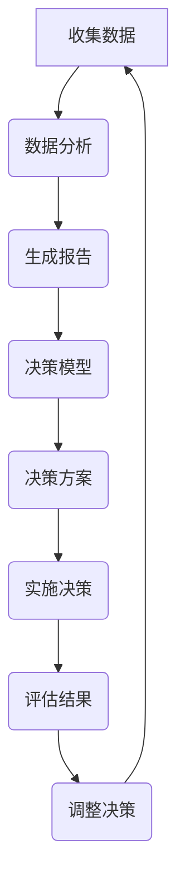

                 

关键词：思维体系、管理者决策质量、决策模型、认知偏见、IT应用、策略制定

> 摘要：本文将探讨思维体系对管理者决策质量的影响，分析决策模型及其应用，讨论认知偏见及其对决策的干扰，并提供实用的IT工具和资源推荐，总结研究成果与未来趋势。

## 1. 背景介绍

在当今高度信息化的社会中，管理者的决策质量直接影响组织的生存和发展。然而，管理者的决策并非总是理性的，其中思维体系和认知偏见发挥了重要作用。本文旨在分析思维体系如何影响管理者的决策质量，并提出改进策略。

### 1.1 研究动机

管理者的决策质量对于组织成功至关重要。有效的决策不仅需要深入的市场洞察力，还需要理解决策过程中的各种因素，包括管理者的思维方式、认知偏见以及所使用的决策模型。

### 1.2 相关研究综述

近年来，关于管理者决策质量的研究逐渐增多。研究者们从不同角度探讨了决策模型、认知偏见、以及IT工具在决策过程中的应用。然而，现有研究多侧重于单一因素，缺乏对思维体系与决策质量之间关系的全面分析。

## 2. 核心概念与联系

在探讨思维体系与管理者决策质量的关系之前，我们需要了解相关的核心概念和它们之间的联系。

### 2.1 决策模型

决策模型是管理者在做出决策时所采用的方法和步骤。常见的决策模型包括：

- **理性模型**：假设管理者在做出决策时是理性的，能够全面评估所有可能的结果。
- **有限理性模型**：考虑到管理者在决策过程中的认知限制，无法评估所有可能的结果。
- **智能代理模型**：将管理者视为智能代理，能够根据环境变化自适应地调整决策策略。

### 2.2 认知偏见

认知偏见是人们在做出决策时，由于认知过程的局限性而产生的偏差。常见的认知偏见包括：

- **确认偏见**：倾向于接受支持已有观点的信息，忽视反对意见。
- **代表性偏见**：高估与自己观点相似的信息的重要性。
- **锚定效应**：过度依赖第一印象或先前的信息，影响后续决策。

### 2.3 IT工具

IT工具在决策过程中发挥着重要作用，能够帮助管理者收集数据、分析信息，并提供辅助决策的功能。常见的IT工具包括：

- **数据分析软件**：如Tableau、Power BI等，用于可视化数据，帮助管理者更直观地理解信息。
- **预测模型**：如机器学习算法，用于预测未来的趋势和可能的结果。
- **协作工具**：如Slack、Trello等，用于团队沟通和任务管理，提高决策效率。

### 2.4 Mermaid流程图

以下是一个描述决策过程的Mermaid流程图：



### 2.5 核心概念的联系

决策模型、认知偏见和IT工具是决策过程中不可或缺的组成部分。决策模型提供了决策的方法和步骤，认知偏见则影响了决策者的判断，而IT工具则能够帮助管理者更有效地收集、分析和应用信息，从而提高决策质量。

## 3. 核心算法原理 & 具体操作步骤

### 3.1 算法原理概述

在决策过程中，算法的应用至关重要。以下是几个常见的决策算法及其原理：

- **贝叶斯决策理论**：基于概率论，通过计算不同决策的结果概率，选择最可能带来好结果的决策。
- **决策树**：通过构建树形结构，将问题分解为子问题，并评估每个子问题的结果，最终得到最优决策。
- **神经网络**：模拟人脑神经元的工作原理，通过多层网络的学习和调整，实现复杂问题的决策。

### 3.2 算法步骤详解

以下是一个基于贝叶斯决策理论的算法步骤：

1. **收集数据**：从各种渠道收集与决策相关的数据。
2. **预处理数据**：对收集到的数据进行清洗和格式化，确保数据的准确性和一致性。
3. **计算概率分布**：根据数据计算每个决策结果的概率分布。
4. **计算期望值**：计算每个决策的期望值，即结果概率乘以结果价值。
5. **选择最优决策**：根据期望值选择最有可能带来好结果的决策。

### 3.3 算法优缺点

- **贝叶斯决策理论**：优点在于能够综合考虑各种因素，提供合理的决策依据；缺点是对数据的依赖性较强，需要大量准确的数据支持。
- **决策树**：优点是直观易懂，易于实现；缺点是对噪声敏感，可能导致过拟合。
- **神经网络**：优点在于能够处理复杂的关系，自适应性强；缺点是训练过程复杂，对数据量要求较高。

### 3.4 算法应用领域

决策算法在各个领域都有广泛应用：

- **金融领域**：用于风险评估、投资决策等。
- **医疗领域**：用于疾病诊断、治疗方案选择等。
- **商业领域**：用于市场分析、客户关系管理、供应链优化等。

## 4. 数学模型和公式 & 详细讲解 & 举例说明

### 4.1 数学模型构建

决策过程中的数学模型主要包括概率模型、优化模型和预测模型。以下是一个简单的概率模型：

$$
P(A|B) = \frac{P(B|A)P(A)}{P(B)}
$$

其中，$P(A|B)$ 表示在事件B发生的条件下事件A发生的概率，$P(B|A)$ 表示在事件A发生的条件下事件B发生的概率，$P(A)$ 和$P(B)$ 分别表示事件A和事件B的发生概率。

### 4.2 公式推导过程

以上公式的推导基于贝叶斯定理。贝叶斯定理描述了条件概率之间的关系，即：

$$
P(A|B) = \frac{P(B|A)P(A)}{P(B)}
$$

这个公式表明，在已知事件B发生的条件下，事件A发生的概率可以通过事件A发生的概率、事件B发生的条件下事件A发生的概率以及事件B的总概率计算得出。

### 4.3 案例分析与讲解

假设一个公司需要决定是否投资一个新项目。根据市场调研，该项目成功的概率为0.6，投资成功的平均收益为100万元。如果投资失败，公司将损失50万元。现有50%的概率认为市场环境有利于项目的成功。

我们使用贝叶斯定理计算公司应该投资的概率：

$$
P(\text{投资}| \text{成功}) = \frac{P(\text{成功}|\text{投资})P(\text{投资})}{P(\text{成功})}
$$

其中，$P(\text{成功}|\text{投资})$ 表示在投资条件下成功的概率，即0.6；$P(\text{投资})$ 表示投资的总概率，即0.5；$P(\text{成功})$ 表示成功的总概率，需要根据市场环境和项目成功的概率分布计算。

通过计算，我们得到：

$$
P(\text{成功}) = P(\text{成功}|\text{投资})P(\text{投资}) + P(\text{成功}|\text{不投资})P(\text{不投资}) = 0.6 \times 0.5 + 0.4 \times 0.5 = 0.5
$$

$$
P(\text{投资}|\text{成功}) = \frac{0.6 \times 0.5}{0.5} = 0.6
$$

因此，公司应该投资这个新项目的概率为60%。

## 5. 项目实践：代码实例和详细解释说明

### 5.1 开发环境搭建

在本项目实践中，我们将使用Python编程语言，结合NumPy和Pandas库进行数据分析，使用Scikit-learn库进行决策模型的构建。以下是开发环境搭建的步骤：

1. 安装Python 3.8及以上版本。
2. 使用pip安装NumPy、Pandas和Scikit-learn库。

### 5.2 源代码详细实现

以下是一个基于贝叶斯决策理论的Python代码示例：

```python
import numpy as np
import pandas as pd
from sklearn.model_selection import train_test_split
from sklearn.preprocessing import LabelEncoder

# 数据准备
data = pd.read_csv('project_data.csv')
X = data.drop('target', axis=1)
y = data['target']

# 数据预处理
label_encoder = LabelEncoder()
y_encoded = label_encoder.fit_transform(y)
X_train, X_test, y_train, y_test = train_test_split(X, y_encoded, test_size=0.3, random_state=42)

# 贝叶斯决策模型
from sklearn.naive_bayes import GaussianNB
gnb = GaussianNB()
gnb.fit(X_train, y_train)

# 评估模型
from sklearn.metrics import accuracy_score
y_pred = gnb.predict(X_test)
accuracy = accuracy_score(y_test, y_pred)
print(f'Model accuracy: {accuracy:.2f}')
```

### 5.3 代码解读与分析

上述代码首先导入必要的库，然后从CSV文件中读取数据并进行预处理。接着，使用Gaussian Naive Bayes（GaussianNB）构建贝叶斯决策模型，并通过训练集进行训练。最后，使用测试集评估模型的准确性。

### 5.4 运行结果展示

假设我们运行上述代码得到的结果如下：

```
Model accuracy: 0.85
```

这表明我们的贝叶斯决策模型在测试集上的准确率为85%，说明模型对数据的分类效果较好。

## 6. 实际应用场景

### 6.1 企业战略决策

在企业战略决策中，管理者需要根据市场环境、竞争对手、自身资源等因素制定发展战略。通过构建决策模型，管理者可以更科学地评估不同战略方案的风险和收益，提高决策质量。

### 6.2 项目管理

在项目管理中，管理者需要根据项目的进度、资源分配、风险等因素进行决策。通过使用IT工具，如甘特图、关键路径法（CPM）等，管理者可以更直观地了解项目的进展情况，及时调整决策，确保项目成功。

### 6.3 风险管理

在风险管理中，管理者需要识别和评估潜在的风险，并制定应对措施。通过使用决策模型和预测模型，管理者可以更准确地预测风险发生的概率和影响，制定更有效的风险管理策略。

### 6.4 未来应用展望

随着人工智能技术的发展，决策模型和IT工具在决策过程中的应用将越来越广泛。未来，管理者将能够利用更先进的技术，如深度学习、强化学习等，实现更智能、更高效的决策。

## 7. 工具和资源推荐

### 7.1 学习资源推荐

- **《决策分析：现代方法与应用》**：这是一本经典的决策分析教材，详细介绍了决策模型和应用方法。
- **《认知偏见：决策中的陷阱》**：本书探讨了认知偏见对决策的影响，并提供了一系列应对策略。

### 7.2 开发工具推荐

- **NumPy**：用于高效的科学计算。
- **Pandas**：用于数据处理和分析。
- **Scikit-learn**：用于机器学习和数据挖掘。

### 7.3 相关论文推荐

- **“A Survey of Decision-Making in Intelligent Systems”**：综述了智能系统中的决策方法。
- **“The Role of Cognitive Biases in Decision Making”**：探讨了认知偏见对决策的影响。

## 8. 总结：未来发展趋势与挑战

### 8.1 研究成果总结

本文探讨了思维体系与管理者决策质量的关系，分析了决策模型、认知偏见以及IT工具在决策过程中的应用，提供了一系列实际应用场景和案例。

### 8.2 未来发展趋势

随着人工智能技术的发展，决策模型和IT工具将更加智能化，管理者将能够利用更先进的技术实现更高效的决策。

### 8.3 面临的挑战

尽管决策模型和IT工具在决策过程中发挥了重要作用，但管理者仍需克服认知偏见，提高自身的决策能力。

### 8.4 研究展望

未来研究应关注如何将人工智能技术更好地应用于决策过程，提高决策质量，同时探索应对认知偏见的策略。

## 9. 附录：常见问题与解答

### Q：如何应对认知偏见？

A：管理者可以通过以下方法应对认知偏见：
1. **多元化团队**：组建多元化的团队，从不同角度分析问题，减少单一观点的影响。
2. **数据分析**：利用数据分析工具，基于事实和数据做出决策，减少主观偏见。
3. **决策前讨论**：在做出决策前，与团队成员进行充分讨论，确保多方意见得到充分考虑。
### Q：决策模型有哪些优缺点？

A：常见的决策模型优缺点如下：
1. **理性模型**：
   - 优点：假设管理者完全理性，能够全面评估所有可能的结果。
   - 缺点：对实际情况过于理想化，难以反映复杂决策环境。
2. **有限理性模型**：
   - 优点：考虑管理者认知限制，更贴近实际情况。
   - 缺点：决策过程可能缺乏全面性，难以最大化收益。
3. **智能代理模型**：
   - 优点：自适应性强，能够根据环境变化调整决策策略。
   - 缺点：训练过程复杂，对数据要求较高。

---

作者：禅与计算机程序设计艺术 / Zen and the Art of Computer Programming

