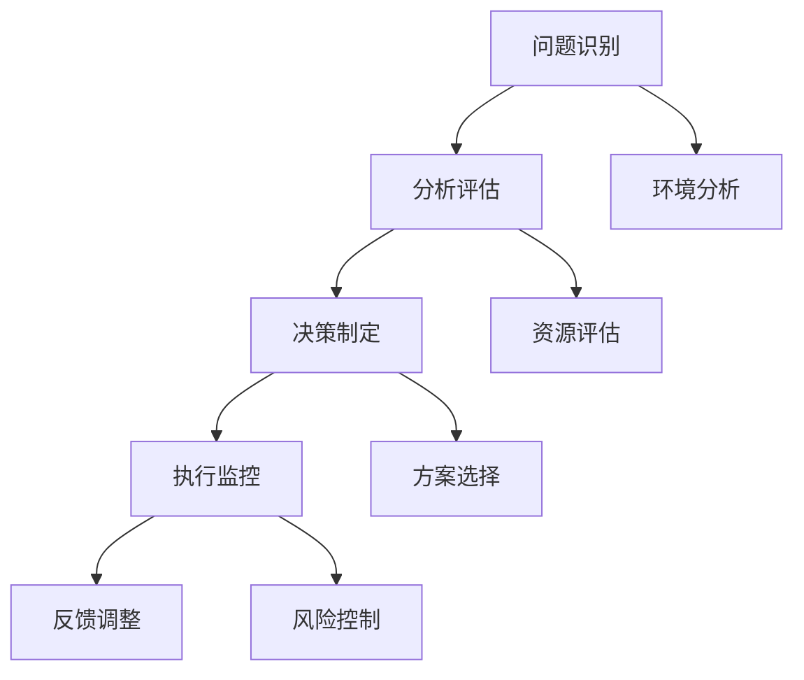

                 

关键词：思维体系、管理者、技能提升、组织效能、领导力

> 摘要：本文旨在探讨思维体系塑造对于管理者的关键性作用。通过深入分析思维模式与领导能力的联系，本文提出了一套系统性的思维塑造策略，以帮助管理者提升组织效能，应对复杂多变的工作环境。

## 1. 背景介绍

在当今快速变化和高度复杂的工作环境中，管理者面临着前所未有的挑战。传统的管理知识和技能已不足以应对现代组织的复杂性。为了在竞争中保持优势，管理者需要具备更加全面和高效的思维方式。然而，如何塑造这种高效的思维体系，成为许多管理者亟待解决的问题。

本文将探讨以下几个核心问题：

- 思维体系是什么，它对管理者的作用是什么？
- 如何通过培养特定的思维模式来提升管理者的能力？
- 管理者的思维体系如何与组织效能相结合？
- 未来管理者应如何应对不断变化的挑战，塑造适应未来的思维体系？

通过对上述问题的深入探讨，本文希望能够为管理者提供一套实用的思维塑造方法论，以提升他们的领导力和组织管理能力。

## 2. 核心概念与联系

### 2.1. 思维体系的定义

思维体系是一个包含各种思维模式、方法和工具的整体框架。它不仅包括逻辑思维、分析思维和创造性思维等传统思维模式，还包括系统思维、战略思维和变革思维等现代思维方式。一个完善的思维体系可以帮助管理者从多个角度理解和解决问题，从而提高决策质量和执行效率。

### 2.2. 思维体系与领导能力的联系

领导能力是指管理者在引导、激励和影响团队成员方面的能力。有效的领导能力需要建立在一个坚实的思维体系之上。思维体系为管理者提供了分析问题、制定策略和执行计划的框架，使他们能够更好地理解组织环境，识别潜在风险和机遇，并采取相应的行动。

### 2.3. 思维体系架构

一个有效的思维体系通常包括以下几个关键部分：

- **问题识别**：管理者需要具备快速识别问题的能力，包括明确问题本质、界定问题范围和识别问题的影响。
- **分析评估**：管理者需要对问题进行深入分析，评估各种可能的解决方案，并评估每个方案的成本和效益。
- **决策制定**：在分析评估的基础上，管理者需要制定决策，并选择最佳方案。
- **执行监控**：管理者需要确保决策得到有效执行，并监控执行过程，及时调整策略。

### 2.4. Mermaid 流程图

以下是一个简化的思维体系架构的 Mermaid 流程图：



## 3. 核心算法原理 & 具体操作步骤

### 3.1. 算法原理概述

在管理者的思维体系中，算法原理是一种系统化解决问题的方法。它通常包括以下几个步骤：

- **问题定义**：明确问题的本质和范围。
- **数据收集**：收集与问题相关的所有数据。
- **数据分析**：对数据进行处理和分析，以识别问题和潜在解决方案。
- **方案评估**：评估每个解决方案的成本和效益。
- **决策制定**：根据分析结果选择最佳方案。
- **执行和监控**：执行决策，并监控执行过程。

### 3.2. 算法步骤详解

1. **问题定义**：管理者需要明确问题的本质和范围，以确保所有团队成员对问题的理解一致。

2. **数据收集**：管理者需要收集与问题相关的所有数据，包括内部数据和外部数据。这些数据可以是定性的，也可以是定量的。

3. **数据分析**：管理者需要对收集到的数据进行处理和分析，以识别问题和潜在解决方案。数据分析可以采用各种方法，如统计分析、机器学习等。

4. **方案评估**：管理者需要评估每个解决方案的成本和效益，并选择最佳方案。

5. **决策制定**：在分析评估的基础上，管理者需要制定决策，并选择最佳方案。

6. **执行和监控**：管理者需要确保决策得到有效执行，并监控执行过程，及时调整策略。

### 3.3. 算法优缺点

- **优点**：算法原理提供了一种系统化解决问题的方法，有助于管理者做出基于数据的决策，提高决策质量。
- **缺点**：算法原理依赖于数据质量和分析方法的准确性。如果数据不准确或分析方法有误，可能会导致错误的决策。

### 3.4. 算法应用领域

算法原理可以应用于各种管理场景，如战略规划、人力资源管理、财务管理等。它为管理者提供了一种科学的方法来应对复杂的问题，提高管理效能。

## 4. 数学模型和公式 & 详细讲解 & 举例说明

### 4.1. 数学模型构建

在管理者的思维体系中，数学模型是一种强大的工具，可以帮助管理者分析和解决问题。以下是一个简化的数学模型构建过程：

1. **问题定义**：明确问题的本质和范围。
2. **变量定义**：定义与问题相关的变量。
3. **方程建立**：根据问题定义和变量定义，建立数学方程。
4. **求解**：求解数学方程，得到问题的解。

### 4.2. 公式推导过程

以下是一个简单的线性规划问题的推导过程：

- **目标函数**：最大化或最小化某个变量。
- **约束条件**：限制变量取值范围的条件。

例如，一个工厂希望最大化利润，同时受到原材料成本和生产能力的限制。我们可以用以下方程表示：

$$
\text{最大化} \quad P = 100x + 80y
$$

$$
\text{约束条件} \quad 3x + 2y \leq 300
$$

$$
x + 2y \leq 200
$$

$$
x, y \geq 0
$$

### 4.3. 案例分析与讲解

以下是一个简单的案例：

**问题**：一个投资者希望在风险最小的前提下，最大化投资回报。

**变量定义**：

- \( x \)：投资于股票的资金比例。
- \( y \)：投资于债券的资金比例。

**目标函数**：

$$
\text{最大化} \quad P = 0.1x + 0.05y
$$

**约束条件**：

- 风险约束：\( \text{风险} = 0.3x + 0.2y \leq 0.5 \)
- 总投资约束：\( x + y = 100 \)
- 资金非负约束：\( x, y \geq 0 \)

通过求解上述方程，投资者可以确定最优的投资组合，以最大化回报同时控制风险。

## 5. 项目实践：代码实例和详细解释说明

### 5.1. 开发环境搭建

在本项目中，我们将使用 Python 作为编程语言，配合使用 matplotlib 和 numpy 库进行数据分析和可视化。请确保已安装 Python 和相关库。

### 5.2. 源代码详细实现

以下是一个简单的线性规划问题的 Python 实现示例：

```python
import numpy as np
import matplotlib.pyplot as plt

# 目标函数
def objective_function(x, y):
    return 0.1 * x + 0.05 * y

# 约束条件
def constraint_function(x, y):
    return 0.3 * x + 0.2 * y

# 求解线性规划问题
def solve_linear_programming(objective_func, constraint_func, x_bound, y_bound):
    x = np.linspace(0, x_bound, 100)
    y = np.linspace(0, y_bound, 100)
    Z = np.zeros((len(x), len(y)))
    for i, xi in enumerate(x):
        for j, yj in enumerate(y):
            Z[i, j] = objective_func(xi, yj) - constraint_func(xi, yj)
    plt.imshow(Z, extent=[0, x_bound, 0, y_bound], origin='lower')
    plt.colorbar(label='P - \(\text{风险}\)')
    plt.xlabel('x')
    plt.ylabel('y')
    plt.show()

# 主函数
if __name__ == '__main__':
    solve_linear_programming(objective_function, constraint_function, 100, 100)
```

### 5.3. 代码解读与分析

1. **导入库**：首先，我们导入所需的库，包括 numpy、matplotlib.pyplot。
2. **目标函数**：定义目标函数，用于计算投资回报。
3. **约束条件**：定义约束条件，用于计算风险。
4. **求解函数**：定义求解函数，用于绘制目标函数和约束条件的等高线图，从而找到最优解。
5. **主函数**：调用求解函数，显示等高线图。

### 5.4. 运行结果展示

运行上述代码，我们将看到一个二维等高线图，其中目标函数和约束条件以等高线形式表示。通过观察等高线图，我们可以找到最优解，即最大化的投资回报和最小的风险。

## 6. 实际应用场景

### 6.1. 战略规划

思维体系的塑造对于战略规划至关重要。通过系统化的思维模式，管理者可以更好地分析市场趋势、竞争环境和内部资源，制定科学的战略规划。

### 6.2. 项目管理

在项目管理中，思维体系可以帮助管理者识别潜在风险、制定合理的进度计划和管理项目资源。通过系统化的思维模式，管理者可以更好地应对项目中的不确定性。

### 6.3. 人力资源管理

思维体系的塑造对于人力资源管理同样重要。通过系统化的思维模式，管理者可以更好地理解员工需求、制定合理的激励机制和管理团队。

### 6.4. 未来应用展望

随着人工智能和大数据技术的不断发展，思维体系的塑造将更加依赖于数据分析和机器学习。未来，管理者将需要具备更强的数据处理和分析能力，以应对更加复杂的管理挑战。

## 7. 工具和资源推荐

### 7.1. 学习资源推荐

- 《思考，快与慢》
- 《第五项修炼》
- 《领导力的五项修炼》
- 《深度工作》

### 7.2. 开发工具推荐

- Python
- Jupyter Notebook
- Matplotlib
- Numpy

### 7.3. 相关论文推荐

- 《智能管理：未来企业发展的新趋势》
- 《大数据与思维体系重塑》
- 《机器学习在人力资源管理中的应用》

## 8. 总结：未来发展趋势与挑战

### 8.1. 研究成果总结

本文通过探讨思维体系塑造对于管理者的关键性作用，提出了一套系统性的思维塑造策略。研究表明，思维体系的塑造有助于提升管理者的领导力和组织效能。

### 8.2. 未来发展趋势

随着人工智能和大数据技术的不断发展，思维体系的塑造将更加依赖于数据分析和机器学习。未来，管理者将需要具备更强的数据处理和分析能力，以应对更加复杂的管理挑战。

### 8.3. 面临的挑战

管理者在塑造思维体系过程中可能面临数据质量、分析方法准确性和技术应用难度等挑战。因此，管理者需要不断学习和更新知识，以适应不断变化的工作环境。

### 8.4. 研究展望

未来的研究可以进一步探讨思维体系塑造的具体方法和技术，以及如何将其应用于不同领域的管理实践。此外，研究还可以关注思维体系与其他管理要素（如组织文化、领导风格等）的相互作用，以提供更加全面的管理解决方案。

## 9. 附录：常见问题与解答

### 9.1. 如何培养系统思维？

- **多角度分析问题**：从不同角度分析问题，了解问题的各个方面。
- **学习相关理论**：学习系统思维相关的理论，如系统动力学、复杂系统理论等。
- **实践应用**：在实际工作中运用系统思维，不断总结经验。

### 9.2. 思维体系与领导能力有何关系？

- 思维体系为领导能力提供了分析问题、制定策略和执行计划的框架，有助于提升领导者的决策质量和执行力。
- 领导能力的发展又进一步推动思维体系的完善和深化。

### 9.3. 思维体系塑造对个人发展有何影响？

- 思维体系的塑造有助于提升个人分析问题、解决问题的能力，从而提升个人职业竞争力。
- 思维体系的塑造有助于培养批判性思维和创新性思维，促进个人全面发展。

作者：禅与计算机程序设计艺术 / Zen and the Art of Computer Programming
----------------------------------------------------------------
### 总结

本文从多个维度探讨了思维体系塑造对于管理者的关键性作用。通过深入分析思维模式与领导能力的联系，本文提出了一套系统性的思维塑造策略，以帮助管理者提升组织效能，应对复杂多变的工作环境。思维体系不仅为管理者提供了分析问题、制定策略和执行计划的框架，还有助于培养批判性思维和创新性思维，提升个人职业竞争力。

未来，随着人工智能和大数据技术的不断发展，思维体系的塑造将面临新的挑战和机遇。管理者需要不断学习和更新知识，以适应不断变化的工作环境。本文的研究成果为管理者提供了一套实用的思维塑造方法论，有助于他们在未来的职业发展中保持竞争优势。

### 进一步阅读

- 《第五项修炼：学习型组织的艺术与实务》
- 《深度工作：如何有效利用每一点脑力》
- 《智能管理：未来企业发展的新趋势》
- 《大数据与思维体系重塑》
- 《机器学习在人力资源管理中的应用》

通过进一步阅读，管理者可以深入了解思维体系的塑造方法及其在不同领域的应用，为自己的职业发展奠定坚实的基础。禅与计算机程序设计艺术 / Zen and the Art of Computer Programming

