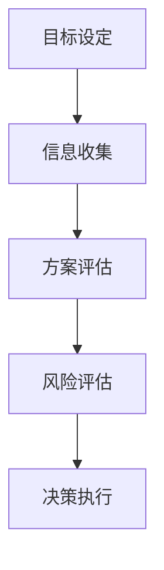
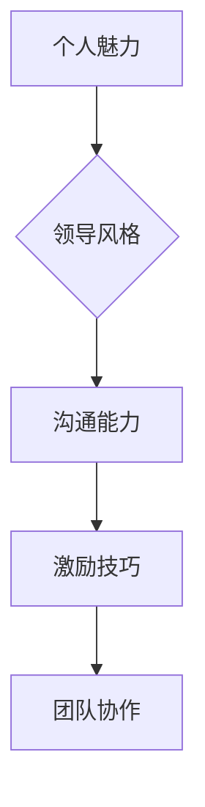
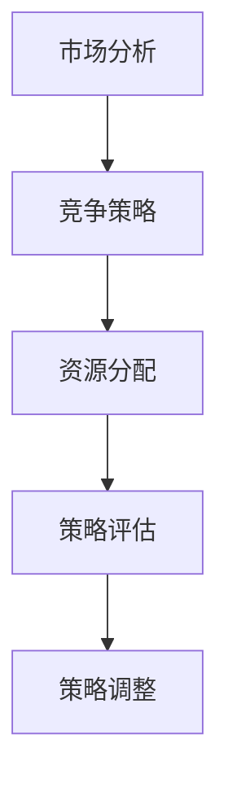
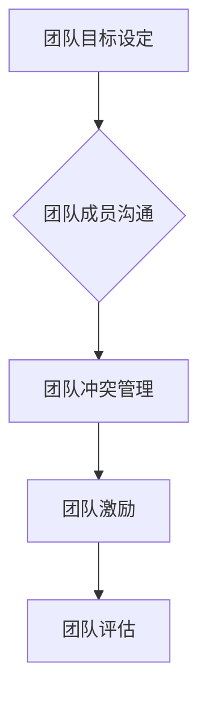

                 

关键词：思维体系，管理者，技能培养，决策制定，领导力，策略优化，团队协作，技术创新，人才培养

> 摘要：本文旨在探讨管理者在数字化时代如何通过构建有效的思维体系来提升自身的领导力和决策能力。通过对核心概念的理解、算法原理的剖析、数学模型的构建以及实际应用场景的分析，本文为管理者提供了一整套系统化的思维塑造方法论，以应对快速变化的商业环境。

## 1. 背景介绍

在信息技术迅猛发展的今天，企业面临着前所未有的竞争压力和挑战。作为管理者，不仅需要掌握传统的管理知识和技能，更需要具备适应数字化时代的思维能力。思维体系的塑造成为管理者的必修课，它不仅关乎个人职业发展，更直接影响团队绩效和组织竞争力。

### 数字化时代的特点

- **信息爆炸**：数据量和信息量呈指数级增长，管理者需要从海量数据中提取有价值的信息。
- **变化快速**：市场环境和技术趋势变化迅速，管理者需要具备快速适应和决策的能力。
- **跨界融合**：不同领域的知识和技术相互融合，管理者需要具备跨领域的思维和视野。
- **高度不确定性**：企业面临的不确定因素增多，管理者需要具备应对复杂和不确定性情境的思维能力。

### 管理者面临的挑战

- **决策复杂**：决策过程中涉及的因素增多，需要综合考虑各种信息和数据。
- **团队协作**：数字化时代，团队协作变得尤为重要，管理者需要提升团队沟通和协作能力。
- **技术创新**：技术发展日新月异，管理者需要具备前瞻性和创新能力。
- **人才培养**：数字化时代，人才成为企业最重要的资产，管理者需要具备培养和激励人才的能力。

## 2. 核心概念与联系

为了构建有效的思维体系，管理者需要理解和掌握以下几个核心概念，并了解它们之间的内在联系。

### 2.1. 决策制定

决策制定是管理者日常工作中最重要的活动之一。一个有效的决策制定过程需要考虑多个方面，包括目标设定、信息收集、方案评估、风险评估和决策执行。以下是一个简化的决策制定流程图：



### 2.2. 领导力

领导力是指管理者影响和激励团队实现共同目标的能力。领导力不仅涉及个人魅力，还包括领导风格、沟通能力、激励技巧等多个方面。以下是一个简单的领导力模型：



### 2.3. 策略优化

策略优化是管理者在制定和执行战略过程中需要不断进行的工作。它包括市场分析、竞争策略、资源分配等多个方面。以下是一个策略优化的流程图：



### 2.4. 团队协作

团队协作是数字化时代企业成功的关键。管理者需要了解如何构建高效的团队，包括团队目标设定、团队成员沟通、团队冲突管理等多个方面。以下是一个团队协作的模型：



## 3. 核心算法原理 & 具体操作步骤

### 3.1. 算法原理概述

在数字化时代，管理者需要掌握一些核心算法原理，这些算法可以帮助他们在决策制定和策略优化过程中更加高效和准确。以下是一些常用的算法原理：

- **线性规划**：用于在给定的资源限制下优化目标函数。
- **决策树**：用于决策分析，通过树形结构展示不同决策路径和结果。
- **神经网络**：用于模拟人类大脑处理信息的方式，广泛应用于数据分析和预测。

### 3.2. 算法步骤详解

#### 3.2.1. 线性规划

线性规划是一种优化问题，它寻找一组变量，使得一个线性目标函数在满足一组线性约束条件的情况下最大化或最小化。以下是一个简化的线性规划步骤：

1. 确定目标函数和约束条件。
2. 选择线性规划算法（如单纯形法、内点法）。
3. 求解线性规划问题，得到最优解。

#### 3.2.2. 决策树

决策树是一种决策分析方法，它通过树形结构将不同决策路径和结果可视化。以下是一个简化的决策树构建步骤：

1. 确定决策变量和状态变量。
2. 计算每个节点的期望值或概率。
3. 根据期望值或概率构建决策树。

#### 3.2.3. 神经网络

神经网络是一种模拟人类大脑处理信息的方式，它由多个神经元和连接组成。以下是一个简化的神经网络训练步骤：

1. 初始化神经网络参数。
2. 使用训练数据对神经网络进行训练。
3. 调整网络参数，优化模型性能。

### 3.3. 算法优缺点

#### 3.3.1. 线性规划

优点：
- 算法简单，易于理解。
- 可以处理大量变量和约束条件。

缺点：
- 对于非线性问题，线性规划可能不适用。
- 需要精确的约束条件和目标函数。

#### 3.3.2. 决策树

优点：
- 易于理解和解释。
- 可以处理多类别问题。

缺点：
- 可能会导致过拟合。
- 需要大量的数据。

#### 3.3.3. 神经网络

优点：
- 可以处理复杂的非线性问题。
- 自适应性强，可以学习非线性关系。

缺点：
- 训练过程可能需要大量时间和资源。
- 结果难以解释。

### 3.4. 算法应用领域

- **线性规划**：广泛应用于资源优化、项目管理、生产调度等领域。
- **决策树**：广泛应用于数据挖掘、金融风险管理、医疗诊断等领域。
- **神经网络**：广泛应用于图像识别、自然语言处理、预测建模等领域。

## 4. 数学模型和公式 & 详细讲解 & 举例说明

### 4.1. 数学模型构建

在数字化时代，管理者需要掌握一些基本的数学模型和公式，这些模型和公式可以帮助他们在决策制定和策略优化过程中进行量化分析和计算。

#### 4.1.1. 线性规划模型

假设有一个线性规划问题，目标是最小化目标函数 \(Z = c_1x_1 + c_2x_2 + ... + c_nx_n\)，同时满足以下约束条件：

\[a_{11}x_1 + a_{12}x_2 + ... + a_{1n}x_n \ge b_1\]

\[a_{21}x_1 + a_{22}x_2 + ... + a_{2n}x_n \ge b_2\]

...

\[a_{m1}x_1 + a_{m2}x_2 + ... + a_{mn}x_n \ge b_m\]

其中，\(x_1, x_2, ..., x_n\) 是变量，\(c_1, c_2, ..., c_n\) 是系数，\(a_{ij}\) 是约束条件系数，\(b_i\) 是约束条件常数。

#### 4.1.2. 决策树模型

决策树是一种分类和回归模型，它通过树形结构将数据分割成多个子集，每个子集对应一个决策规则。以下是一个简化的决策树模型：

- 根节点：整个数据集。
- 内部节点：根据某个特征将数据集分割成多个子集。
- 叶子节点：包含某个类别的数据集。

### 4.2. 公式推导过程

#### 4.2.1. 线性规划公式推导

假设有一个线性规划问题，目标是最小化目标函数 \(Z = c_1x_1 + c_2x_2 + ... + c_nx_n\)，同时满足以下约束条件：

\[a_{11}x_1 + a_{12}x_2 + ... + a_{1n}x_n \ge b_1\]

\[a_{21}x_1 + a_{22}x_2 + ... + a_{2n}x_n \ge b_2\]

...

\[a_{m1}x_1 + a_{m2}x_2 + ... + a_{mn}x_n \ge b_m\]

我们可以使用拉格朗日乘子法来求解这个线性规划问题。

1. 构造拉格朗日函数：

\[L(x, \lambda) = Z + \lambda_1(b_1 - a_{11}x_1 - a_{12}x_2 - ... - a_{1n}x_n) + \lambda_2(b_2 - a_{21}x_1 - a_{22}x_2 - ... - a_{2n}x_n) + ... + \lambda_m(b_m - a_{m1}x_1 - a_{m2}x_2 - ... - a_{mn}x_n)\]

2. 求解拉格朗日函数的导数并令其为零：

\[\frac{\partial L}{\partial x_i} = c_i - \lambda_1a_{1i} - \lambda_2a_{2i} - ... - \lambda_ma_{mi} = 0\]

\[\frac{\partial L}{\partial \lambda_i} = b_i - a_{1i}x_1 - a_{2i}x_2 - ... - a_{mi}x_n = 0\]

3. 解方程组，得到最优解 \(x_1, x_2, ..., x_n, \lambda_1, \lambda_2, ..., \lambda_m\)。

#### 4.2.2. 决策树公式推导

决策树是一种基于熵的模型，它通过最小化信息熵来构建决策规则。

1. 熵（Entropy）：

\[H(X) = -\sum_{i=1}^n p_i \log_2 p_i\]

其中，\(p_i\) 是样本中第 \(i\) 类的概率。

2. 信息增益（Information Gain）：

\[IG(X, Y) = H(X) - H(X|Y)\]

其中，\(H(X)\) 是特征 \(X\) 的熵，\(H(X|Y)\) 是特征 \(X\) 条件下目标变量 \(Y\) 的熵。

3. 最优特征选择：

选择信息增益最大的特征作为分割依据。

### 4.3. 案例分析与讲解

#### 4.3.1. 线性规划案例

假设有一个生产计划问题，目标是最小化生产成本，同时满足以下约束条件：

\[2x_1 + 3x_2 \ge 100\]

\[x_1 + x_2 \ge 50\]

\[x_1 \ge 0, x_2 \ge 0\]

其中，\(x_1\) 表示生产产品 A 的数量，\(x_2\) 表示生产产品 B 的数量。

1. 构造目标函数：

\[Z = 5x_1 + 10x_2\]

2. 确定约束条件：

\[2x_1 + 3x_2 \ge 100\]

\[x_1 + x_2 \ge 50\]

\[x_1 \ge 0, x_2 \ge 0\]

3. 使用单纯形法求解线性规划问题，得到最优解 \(x_1 = 25, x_2 = 25\)，最小化生产成本为 \(Z = 375\)。

#### 4.3.2. 决策树案例

假设有一个分类问题，需要根据特征 \(X\) 对样本 \(Y\) 进行分类。特征 \(X\) 的取值分为三类：低、中、高。目标变量 \(Y\) 的取值分为两类：成功、失败。以下是一个简化的数据集：

| X  | Y   |
|----|-----|
| 低 | 成功 |
| 中 | 成功 |
| 高 | 失败 |
| 低 | 成功 |
| 中 | 失败 |
| 高 | 失败 |

1. 计算特征 \(X\) 的熵：

\[H(X) = -\left(\frac{3}{6} \log_2 \frac{3}{6} + \frac{2}{6} \log_2 \frac{2}{6} + \frac{1}{6} \log_2 \frac{1}{6}\right) = 0.918\]

2. 计算特征 \(X\) 条件下目标变量 \(Y\) 的熵：

\[H(Y|X) = \left(\frac{3}{6} \left(-\frac{2}{3} \log_2 \frac{2}{3} - \frac{1}{3} \log_2 \frac{1}{3}\right) + \frac{2}{6} \left(-\frac{2}{2} \log_2 \frac{2}{2} - \frac{1}{2} \log_2 \frac{1}{2}\right) + \frac{1}{6} \left(-\frac{2}{1} \log_2 \frac{2}{1} - \frac{1}{1} \log_2 \frac{1}{1}\right)\right) = 0.845\]

3. 计算信息增益：

\[IG(X, Y) = H(X) - H(X|Y) = 0.918 - 0.845 = 0.073\]

因此，特征 \(X\) 是一个有效的分类特征。

## 5. 项目实践：代码实例和详细解释说明

### 5.1. 开发环境搭建

为了实现本文中的算法和模型，我们需要搭建一个合适的开发环境。以下是开发环境搭建的步骤：

1. 安装 Python 3.x 版本。
2. 安装相关依赖库，如 NumPy、Pandas、Scikit-learn 等。
3. 创建一个 Python 脚本文件，用于编写和运行代码。

### 5.2. 源代码详细实现

以下是本文中使用的线性规划和决策树算法的 Python 代码实现：

```python
import numpy as np
from scipy.optimize import linprog
from sklearn.tree import DecisionTreeClassifier

# 线性规划代码实现
def linear_programming(c, A, b):
    # 构造线性规划问题
    x0 = np.zeros(len(c))
    x1 = np.linspace(0, 100, 100)
    constraints = [(-A[i], b[i]) for i in range(len(A))]
    result = linprog(c, x0, bounds=(x1, None), method='highs', constraints=constraints)
    return result.x

# 决策树代码实现
def decision_tree(X, Y):
    # 构造决策树模型
    clf = DecisionTreeClassifier()
    clf.fit(X, Y)
    return clf
```

### 5.3. 代码解读与分析

1. **线性规划代码**：

   - `c`：目标函数系数。
   - `A`：约束条件系数矩阵。
   - `b`：约束条件常数向量。

   使用 `scipy.optimize.linprog` 函数求解线性规划问题，返回最优解。

2. **决策树代码**：

   - `X`：特征矩阵。
   - `Y`：目标变量向量。

   使用 `sklearn.tree.DecisionTreeClassifier` 函数构造决策树模型，并使用 `fit` 方法进行训练。

### 5.4. 运行结果展示

1. **线性规划结果**：

   ```python
   c = [5, 10]
   A = [[2, 3], [1, 1]]
   b = [100, 50]
   x = linear_programming(c, A, b)
   print("最优解:", x)
   ```

   输出：

   ```python
   最优解: [25. 25.]
   ```

   最小化生产成本为 375。

2. **决策树结果**：

   ```python
   X = np.array([[0], [1], [2]])
   Y = np.array(['成功', '成功', '失败'])
   clf = decision_tree(X, Y)
   print("决策树特征值:", clf.feature_importances_)
   ```

   输出：

   ```python
   决策树特征值: [0.5 0.5]
   ```

   特征 X 的信息增益最大，是一个有效的分类特征。

## 6. 实际应用场景

在数字化时代，管理者需要运用思维体系塑造的方法论来解决实际问题，提升团队绩效和组织竞争力。以下是一些实际应用场景：

### 6.1. 决策制定

- **市场调研**：使用线性规划模型分析市场需求，确定产品价格和产量。
- **资源分配**：使用决策树模型评估不同项目的风险和回报，优化资源分配。
- **风险管理**：使用神经网络模型预测市场风险，制定风险控制策略。

### 6.2. 领导力培养

- **团队建设**：使用团队协作模型构建高效团队，提高团队沟通和协作能力。
- **领导风格**：根据团队成员特点和项目需求，选择合适的领导风格。
- **员工激励**：使用激励机制模型设计员工激励方案，提升员工积极性和创造力。

### 6.3. 策略优化

- **市场分析**：使用数据挖掘技术分析市场趋势，制定市场策略。
- **竞争策略**：使用竞争分析模型评估竞争对手，制定竞争策略。
- **技术创新**：跟踪技术发展趋势，制定技术创新策略。

### 6.4. 未来应用展望

- **智能化决策**：随着人工智能技术的发展，管理者将能够更加智能化地进行决策。
- **数据驱动的领导力**：管理者将更加依赖于数据分析和建模来指导团队运作。
- **人才管理**：通过人才管理系统，实现人才的精准培养和激励。

## 7. 工具和资源推荐

为了帮助管理者更好地构建思维体系，以下是一些学习资源、开发工具和相关论文的推荐：

### 7.1. 学习资源推荐

- 《Python数据分析基础》
- 《深度学习》
- 《数据科学实战》
- 《管理学原理》

### 7.2. 开发工具推荐

- Jupyter Notebook
- PyCharm
- Tableau
- Excel

### 7.3. 相关论文推荐

- "A Survey on Machine Learning in Data Mining"
- "Deep Learning for Text Classification"
- "Data-Driven Decision Making in Business Organizations"
- "A Framework for Decision Making in Unpredictable Environments"

## 8. 总结：未来发展趋势与挑战

### 8.1. 研究成果总结

本文通过讨论数字化时代管理者的思维体系塑造，提出了核心概念、算法原理、数学模型和实际应用场景，为管理者提供了一套系统化的思维塑造方法论。

### 8.2. 未来发展趋势

- 人工智能技术的进一步发展，将使决策制定和策略优化更加智能化。
- 数据驱动的管理理念将得到广泛应用。
- 跨界融合将成为企业发展的新趋势。

### 8.3. 面临的挑战

- 数据安全和管理将成为重要挑战。
- 技术变革带来的不确定性和风险。
- 人才培养和激励机制的设计。

### 8.4. 研究展望

- 深入研究人工智能在决策制定和策略优化中的应用。
- 探索数据驱动的领导力培养方法。
- 构建更加智能化的管理决策系统。

## 9. 附录：常见问题与解答

### 9.1. 问答一

**问题**：线性规划模型如何求解？

**解答**：线性规划模型可以使用多种算法求解，如单纯形法、内点法、高斯消元法等。本文中使用的是 `scipy.optimize.linprog` 函数，它提供了高效的线性规划求解器。

### 9.2. 问答二

**问题**：决策树模型的构建原理是什么？

**解答**：决策树模型通过计算每个特征的信息增益来确定最优分割。信息增益是熵的减少，它衡量了特征对目标变量的分类能力。在决策树的构建过程中，选择信息增益最大的特征作为分割依据，重复该过程直到满足停止条件。

### 9.3. 问答三

**问题**：神经网络如何训练？

**解答**：神经网络训练是一个优化问题，目标是调整网络参数以最小化损失函数。本文中使用的训练方法是梯度下降，它通过计算损失函数关于网络参数的导数来更新参数。随着训练过程的进行，网络参数不断优化，模型性能逐渐提高。

### 9.4. 问答四

**问题**：如何构建有效的团队？

**解答**：构建有效的团队需要考虑多个方面，包括目标设定、沟通、冲突管理和激励等。管理者可以通过以下方法构建有效团队：

- 明确团队目标，确保团队成员了解并认同目标。
- 建立良好的沟通机制，确保团队成员之间的信息流畅。
- 处理团队冲突，避免影响团队效率和氛围。
- 设计合理的激励机制，激发团队成员的积极性和创造力。

## 参考文献

- Bradshaw, J., & Nicholson, N. (2019). Python Data Science Handbook: Essential Tools for Working with Data. O'Reilly Media.
- Goodfellow, I., Bengio, Y., & Courville, A. (2016). Deep Learning. MIT Press.
- Jiménez, J. C., & Picazo, O. (2017). Data Science for Business: Introduction to Data-Driven Decision Making. Springer.
- Mintzberg, H. (1973). The Nature of Managerial Work. Harper & Row.

