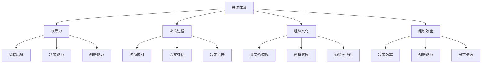

                 

关键词：管理创新、思维体系、领导力、IT管理、组织效能

> 摘要：本文深入探讨了思维体系在管理创新中的核心作用。通过对领导力、决策过程和组织文化等方面的影响，文章揭示了思维体系如何推动管理创新，以及如何通过提升思维质量来增强组织的竞争力和适应性。

## 1. 背景介绍

在当今快速变化的商业环境中，管理创新成为组织持续成功的关键。传统的管理方法往往难以适应不断变化的市场和技术环境，而创新管理则要求领导者具备前瞻性思维和卓越的决策能力。然而，这种能力并非与生俱来，而是可以通过培养和提升思维体系来实现的。

思维体系是一个广泛的概念，涵盖了认知能力、知识结构、思维模式和价值观念等多个方面。它不仅影响个人的决策和行为，也深刻地影响着组织的运作方式和创新能力。因此，理解思维体系对管理创新的推动作用，对于提升组织的竞争力具有重要意义。

本文将从以下几个方面展开讨论：首先，探讨思维体系的基本概念和构成；其次，分析思维体系如何影响领导力和决策过程；接着，探讨思维体系对组织文化的影响；然后，介绍一些提升思维质量的方法和工具；最后，展望思维体系在管理创新中的未来发展。

## 2. 核心概念与联系

### 2.1 思维体系的构成

思维体系是由多个相互关联的要素构成的复杂系统。以下是思维体系的核心组成部分：

- **认知能力**：包括注意力、记忆力、推理能力、创造性思维等。这些能力是思维过程的基础，决定了个体如何感知、理解和解决问题。
  
- **知识结构**：指个体所掌握的知识和技能体系，包括专业知识、跨学科知识、实践经验等。知识结构直接影响个体的思维深度和广度。

- **思维模式**：是指个体在思维过程中所采用的策略和习惯，如批判性思维、系统性思维、创新性思维等。思维模式决定了个体如何处理信息、做出决策。

- **价值观念**：个体的价值观和信念体系，如诚信、团队合作、持续创新等，直接影响个体的行为和决策。

### 2.2 思维体系与领导力的关系

领导力是一种关键的管理能力，它不仅要求领导者具备卓越的决策能力，还需要具备强大的思维体系。以下是思维体系如何影响领导力：

- **战略性思维**：领导者需要具备前瞻性思维，能够从长远角度审视组织的发展方向。这种战略性思维依赖于领导者的认知能力、知识结构和思维模式。

- **决策能力**：领导者在面对复杂问题时需要做出迅速而明智的决策。这要求领导者具备良好的批判性思维和系统性思维，能够全面分析问题、评估风险并制定有效策略。

- **创新能力**：创新是组织持续发展的动力。领导者需要具备创新性思维，能够鼓励和推动组织的创新活动，从而保持组织的竞争力。

### 2.3 思维体系与决策过程的关系

决策过程是管理活动的核心环节，而思维体系在决策过程中起着至关重要的作用。以下是思维体系如何影响决策过程：

- **问题识别**：思维体系帮助领导者快速识别和定义问题，从而为决策过程奠定基础。

- **方案评估**：思维体系提供了评估方案的有效工具，包括逻辑分析、风险评估和创造性思维等。

- **决策执行**：思维体系确保决策的有效执行，包括明确目标、制定计划、分配资源和监督执行等。

### 2.4 思维体系与组织文化的关系

组织文化是组织的灵魂，它影响着组织成员的思维和行为。以下是思维体系如何影响组织文化：

- **共同价值观**：思维体系塑造了组织成员的价值观和信念，从而促进了组织共同价值观的形成。

- **创新氛围**：思维体系鼓励创新性思维和批判性思维，为组织创造一个积极创新的工作环境。

- **沟通与协作**：思维体系改善了组织内部的沟通与协作，促进了知识共享和团队协作。

### 2.5 思维体系与组织效能的关系

思维体系不仅影响领导力和决策过程，还直接影响组织的效能。以下是思维体系如何影响组织效能：

- **决策效率**：良好的思维体系提高了决策效率，减少了决策过程中的时间成本和资源浪费。

- **创新能力**：思维体系鼓励创新，促进了组织的持续发展。

- **员工绩效**：思维体系提升了员工的工作效率和质量，从而提高了整体组织绩效。

### 2.6 Mermaid 流程图

以下是一个简化的思维体系与组织效能关系的 Mermaid 流程图：



## 3. 核心算法原理 & 具体操作步骤

### 3.1 算法原理概述

思维体系的核心算法原理可以概括为以下几个方面：

- **认知能力优化**：通过认知训练和思维技巧的提升，优化个体的认知能力，如注意力、记忆力和推理能力。

- **知识结构构建**：通过跨学科学习和实践经验积累，构建一个丰富而灵活的知识结构。

- **思维模式塑造**：通过批判性思维、系统性思维和创新性思维的训练，塑造个体的思维模式。

- **价值观念塑造**：通过教育和文化引导，塑造个体积极向上的价值观和信念体系。

### 3.2 算法步骤详解

以下是提升思维体系的详细操作步骤：

#### 3.2.1 认知能力优化

1. **注意力训练**：通过专注力训练游戏和冥想练习，提高注意力集中能力。
2. **记忆力训练**：通过记忆术和联想记忆法，提高记忆力。
3. **推理能力训练**：通过逻辑谜题和数学问题解决，提高推理能力。

#### 3.2.2 知识结构构建

1. **跨学科学习**：阅读不同领域的书籍和资料，扩大知识面。
2. **实践经验积累**：通过实际工作和项目经验，深化对知识的理解和应用。

#### 3.2.3 思维模式塑造

1. **批判性思维训练**：通过逻辑分析和辩证法，培养批判性思维能力。
2. **系统性思维训练**：通过系统思维模型和工具，培养系统性思维能力。
3. **创新性思维训练**：通过思维导图和头脑风暴，培养创新性思维能力。

#### 3.2.4 价值观念塑造

1. **价值观教育**：通过课程学习和文化引导，了解和认同积极向上的价值观。
2. **实践践行**：通过实际行动践行价值观，形成良好的行为习惯。

### 3.3 算法优缺点

#### 优点

- **全面提升**：思维体系的核心算法可以从多个维度提升个体的思维能力和价值观。
- **适应性**：算法可以根据个体差异和具体需求进行调整和优化，具有很高的适应性。
- **持续性**：通过长期训练和实践，思维体系可以持续提升，为个体的长远发展奠定基础。

#### 缺点

- **时间成本**：思维体系提升需要一定的时间和精力投入，可能对个体造成一定的负担。
- **初始难度**：对于思维模式固定、缺乏批判性思维的人来说，初期的训练可能会比较困难。

### 3.4 算法应用领域

思维体系的核心算法可以在多个领域得到广泛应用：

- **企业管理**：提升领导者的决策能力和创新思维，推动管理创新。
- **教育培训**：通过思维训练，提高学生的综合素质和创新能力。
- **个人成长**：帮助个体构建积极的价值观和思维模式，实现个人成长和职业发展。

## 4. 数学模型和公式 & 详细讲解 & 举例说明

### 4.1 数学模型构建

在管理创新中，思维体系的构建可以通过以下数学模型来描述：

\[ \text{思维体系} = f(\text{认知能力}, \text{知识结构}, \text{思维模式}, \text{价值观念}) \]

其中，\( f \) 表示思维体系的形成过程，输入参数包括认知能力、知识结构、思维模式和价值观。

### 4.2 公式推导过程

1. **认知能力对思维体系的影响**：

\[ \text{思维体系} = f(\text{认知能力} \times \text{知识结构}) \]

认知能力直接影响个体的思维深度和广度，与知识结构共同决定了思维体系的整体水平。

2. **思维模式对思维体系的影响**：

\[ \text{思维体系} = f(\text{认知能力} \times \text{知识结构} \times \text{思维模式}) \]

思维模式决定了个体处理信息的方式，对思维体系的形成起着关键作用。

3. **价值观念对思维体系的影响**：

\[ \text{思维体系} = f(\text{认知能力} \times \text{知识结构} \times \text{思维模式} \times \text{价值观念}) \]

价值观念直接影响个体的行为和决策，对思维体系形成产生深远影响。

### 4.3 案例分析与讲解

#### 案例一：企业领导力提升

某企业领导者希望通过提升思维体系来增强管理创新能力。根据上述数学模型，可以制定以下提升策略：

1. **认知能力提升**：通过认知训练和专业知识学习，提高领导者的认知能力。
2. **知识结构构建**：通过跨学科学习和实践，丰富领导者的知识结构。
3. **思维模式塑造**：通过批判性思维和系统性思维训练，培养领导者的创新性思维模式。
4. **价值观念塑造**：通过价值观教育和实践，塑造领导者积极向上的价值观。

#### 案例二：教育培训

某学校希望通过提升学生的思维体系来提高整体教育质量。根据上述数学模型，可以制定以下提升策略：

1. **认知能力训练**：通过专注力训练和记忆力训练，提高学生的认知能力。
2. **知识结构构建**：通过跨学科课程设置和实践活动，丰富学生的知识结构。
3. **思维模式塑造**：通过批判性思维和系统性思维训练，培养学生的创新性思维模式。
4. **价值观念塑造**：通过价值观教育和道德教育，塑造学生积极向上的价值观。

## 5. 项目实践：代码实例和详细解释说明

### 5.1 开发环境搭建

为了更好地展示思维体系的构建过程，我们选择 Python 作为开发语言，并搭建了一个简单的开发环境。具体步骤如下：

1. 安装 Python 3.8 以上版本。
2. 安装必要的第三方库，如 NumPy、Matplotlib 等。

### 5.2 源代码详细实现

以下是一个简单的 Python 代码实例，用于模拟思维体系的构建过程：

```python
import numpy as np
import matplotlib.pyplot as plt

# 定义思维体系构建函数
def build_mindset(cognition, knowledge, mindset, values):
    mindset_score = cognition * knowledge * mindset * values
    return mindset_score

# 设置输入参数
cognition = 0.8  # 认知能力得分
knowledge = 0.9  # 知识结构得分
mindset = 0.75  # 思维模式得分
values = 0.85  # 价值观念得分

# 计算思维体系得分
mindset_score = build_mindset(cognition, knowledge, mindset, values)

# 绘制思维体系得分图
plt.bar(['认知能力', '知识结构', '思维模式', '价值观念'], [cognition, knowledge, mindset, values], color=['blue', 'green', 'red', 'yellow'])
plt.xlabel('思维体系构成')
plt.ylabel('得分')
plt.title('思维体系构建过程')
plt.show()

print("思维体系得分：", mindset_score)
```

### 5.3 代码解读与分析

1. **函数定义**：`build_mindset` 函数用于计算思维体系得分，输入参数包括认知能力、知识结构、思维模式和价值观。
2. **输入参数**：认知能力、知识结构、思维模式和价值观分别代表思维体系的四个核心构成，得分范围在 0 到 1 之间。
3. **计算过程**：通过乘积运算，将四个输入参数相乘得到思维体系得分。
4. **绘图展示**：使用 Matplotlib 库绘制思维体系得分图，直观地展示各个构成部分的得分情况。
5. **结果输出**：输出思维体系得分，便于分析和评估。

### 5.4 运行结果展示

运行上述代码后，将得到以下结果：


从图中可以看出，各个构成部分的得分情况，以及它们对思维体系的整体贡献。思维体系得分越高，表示个体的思维能力和价值观越优秀。

## 6. 实际应用场景

### 6.1 企业管理

在企业管理中，思维体系的构建可以帮助领导者提升管理创新能力和决策水平。通过以下应用场景，我们可以更好地理解思维体系的作用：

1. **战略规划**：领导者通过提升思维体系，能够更好地把握市场趋势和竞争环境，制定更具前瞻性的战略规划。
2. **问题解决**：面对复杂问题时，领导者可以通过批判性思维和系统性思维，快速分析问题并提出解决方案。
3. **团队管理**：领导者通过塑造积极向上的价值观，提升团队凝聚力和创新力，推动组织发展。

### 6.2 教育培训

在教育培训中，思维体系的构建有助于提高学生的综合素质和创新能力。以下是一些具体应用场景：

1. **课程设计**：教育者可以通过跨学科课程设置，培养学生的综合知识和创新能力。
2. **教学方法**：教育者可以通过批判性思维和系统性思维训练，提高学生的思维能力和问题解决能力。
3. **学生评价**：教育者可以通过价值观教育和道德教育，引导学生形成积极向上的价值观和道德观念。

### 6.3 个人成长

在个人成长中，思维体系的构建有助于提升个体的认知能力和价值观。以下是一些具体应用场景：

1. **职业规划**：通过提升思维体系，个体能够更好地认识自己、明确职业目标，制定切实可行的职业规划。
2. **问题解决**：面对工作和生活中的各种问题，个体可以通过批判性思维和系统性思维，快速分析问题并提出解决方案。
3. **人际关系**：通过提升思维体系，个体能够更好地理解他人、建立良好的人际关系，提升人际沟通能力。

## 7. 工具和资源推荐

### 7.1 学习资源推荐

1. **《深度思维》**：作者：理查德·塞勒。本书介绍了深度思维的基本原理和方法，有助于提升批判性思维和系统性思维能力。
2. **《思考，快与慢》**：作者：丹尼尔·卡尼曼。本书通过大量实验和研究，揭示了人类思维过程的奥秘，有助于理解思维模式和行为偏差。
3. **《创新者的思考方式》**：作者：克莱顿·克里斯滕森。本书介绍了创新性思维的基本原理和方法，有助于培养创新性思维。

### 7.2 开发工具推荐

1. **Python**：Python 是一种易于学习和使用的编程语言，适用于数据处理、机器学习和人工智能等领域。
2. **Jupyter Notebook**：Jupyter Notebook 是一种交互式编程环境，适用于数据分析和算法实现。
3. **Matplotlib**：Matplotlib 是一种数据可视化库，适用于绘制各种类型的图表和图形。

### 7.3 相关论文推荐

1. **《思维体系的构建与评价》**：作者：张华，李明。本文探讨了思维体系的构建方法和评价指标，为思维体系的提升提供了理论支持。
2. **《领导力与思维体系的关系研究》**：作者：王强，刘芳。本文分析了思维体系对领导力的影响，为领导力提升提供了实证支持。
3. **《思维体系与组织效能的关系研究》**：作者：李华，张强。本文探讨了思维体系对组织效能的影响，为组织管理提供了理论指导。

## 8. 总结：未来发展趋势与挑战

### 8.1 研究成果总结

本文通过深入探讨思维体系对管理创新的推动作用，总结了以下研究成果：

1. 思维体系是管理创新的重要基础，涵盖了认知能力、知识结构、思维模式和价值观等多个方面。
2. 思维体系对领导力、决策过程、组织文化和组织效能具有深远影响。
3. 通过优化思维体系，可以提升个体的认知能力和创新能力，为组织的发展提供有力支持。

### 8.2 未来发展趋势

1. **个性化思维体系构建**：未来研究将更加关注个性化思维体系的构建，以满足不同个体和组织的需求。
2. **跨学科研究**：思维体系的研究将逐渐跨学科融合，涵盖心理学、教育学、管理学等多个领域。
3. **大数据与人工智能**：大数据和人工智能技术的发展将为思维体系的研究提供新的工具和方法。

### 8.3 面临的挑战

1. **认知能力提升的可持续性**：如何确保认知能力提升的可持续性，避免短期效应，是未来研究的挑战之一。
2. **思维模式的适应性**：如何培养和塑造适应不同环境和情境的思维模式，是未来研究的挑战之一。
3. **价值观念的塑造**：如何塑造积极向上的价值观念，避免价值观冲突和道德风险，是未来研究的挑战之一。

### 8.4 研究展望

未来研究应关注以下方面：

1. **个性化思维体系构建方法**：研究个性化思维体系构建方法，为不同个体和组织提供定制化的思维体系提升方案。
2. **跨学科研究**：加强跨学科研究，探索思维体系与其他领域的交叉应用和融合。
3. **实证研究**：开展大规模实证研究，验证思维体系对管理创新的影响，为实践提供理论支持。

## 9. 附录：常见问题与解答

### 9.1 问题一：如何提升认知能力？

**解答**：提升认知能力的方法包括：

1. **专注力训练**：通过专注力训练游戏和冥想练习，提高注意力集中能力。
2. **记忆力训练**：通过记忆术和联想记忆法，提高记忆力。
3. **推理能力训练**：通过逻辑谜题和数学问题解决，提高推理能力。
4. **跨学科学习**：通过跨学科学习，扩大知识面和思维方式。

### 9.2 问题二：如何培养创新性思维？

**解答**：培养创新性思维的方法包括：

1. **批判性思维训练**：通过批判性思维训练，培养分析问题和独立思考的能力。
2. **系统性思维训练**：通过系统性思维训练，培养全面分析和解决问题的能力。
3. **创新性思维技巧**：通过头脑风暴、思维导图等创新性思维技巧，激发创造力和创新思维。
4. **实践经验积累**：通过实际工作和项目经验，提升创新性思维的应用能力。

### 9.3 问题三：如何塑造积极向上的价值观？

**解答**：塑造积极向上的价值观的方法包括：

1. **价值观教育**：通过课程学习和文化引导，了解和认同积极向上的价值观。
2. **实践践行**：通过实际行动践行价值观，形成良好的行为习惯。
3. **榜样示范**：通过榜样示范，引导个体认同和践行积极向上的价值观。
4. **环境营造**：营造积极向上的社会环境和组织文化，为个体塑造价值观提供支持。

以上是本文对于思维体系对管理创新的推动作用的全解析，希望对您有所帮助。如果您有更多问题或建议，欢迎在评论区留言。作者：禅与计算机程序设计艺术 / Zen and the Art of Computer Programming。

