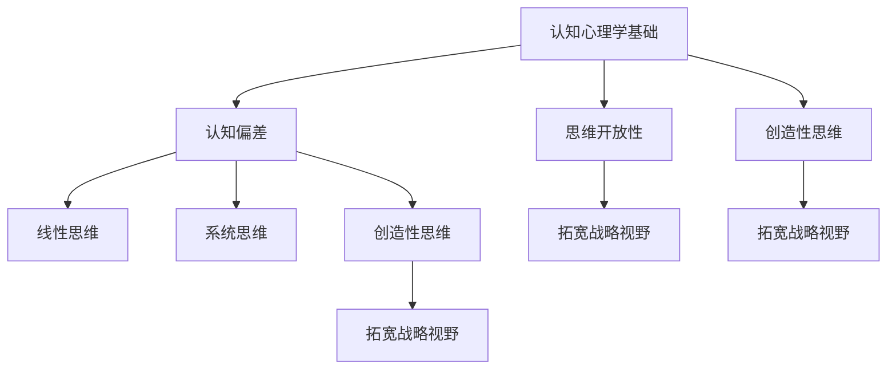

                 

关键词：思维体系、管理者、战略视野、决策、创新、领导力、认知心理学

> 摘要：本文深入探讨了思维体系对管理者战略视野的影响。通过分析认知心理学中的关键概念，揭示了不同思维模式如何塑造管理者的决策过程和战略思维。文章结合实际案例，讨论了管理者如何通过提升自身思维水平来拓宽战略视野，提高领导力和创新能力。此外，本文还提出了未来研究的方向和挑战，为管理者提供了有益的启示。

## 1. 背景介绍

在当今复杂多变的社会环境中，管理者的战略视野至关重要。战略视野不仅决定了企业的发展方向，还直接影响企业的生存与繁荣。然而，许多管理者在面临复杂决策时，往往受限于自身的思维模式和认知能力。认知心理学的研究表明，人类的思维模式在很大程度上影响着决策过程和战略思考。因此，了解思维体系对管理者战略视野的影响，对于提升管理者的决策能力和领导力具有重要意义。

本文将从认知心理学的角度出发，分析不同思维模式如何影响管理者的战略视野。通过探讨认知偏差、思维开放性和创造性思维等关键概念，本文将揭示管理者如何通过提升思维水平来拓宽战略视野，提高领导力和创新能力。最后，本文还将对管理者未来面临的挑战和机遇进行展望，并提出相应的建议。

## 2. 核心概念与联系

### 2.1 认知心理学基础

认知心理学是研究人类认知过程和认知结构的科学。在管理领域，认知心理学的研究有助于理解管理者的思维方式、决策过程和战略思考。以下是认知心理学中的几个核心概念：

1. **认知偏差**：认知偏差是指人类在信息处理过程中出现的系统性错误。这些偏差会影响管理者的判断和决策，导致战略视野的局限性。

2. **思维开放性**：思维开放性是指个体在面对新观点和挑战时的接受程度。高思维开放性的管理者能够更全面地考虑问题，从而拓宽战略视野。

3. **创造性思维**：创造性思维是指产生新颖且有价值的想法的能力。管理者具备创造性思维，能够提出独特的战略方案，为企业的创新发展提供动力。

### 2.2 思维模式与战略视野

思维模式是指个体在处理信息、做出决策和思考问题时所采用的基本方式。不同的思维模式对管理者的战略视野产生不同的影响：

1. **线性思维**：线性思维是指按照一定的逻辑顺序进行思考。管理者采用线性思维时，容易将问题简化为一系列因果关系，从而忽视复杂因素。这可能导致战略视野的狭隘。

2. **系统思维**：系统思维是指将问题视为一个整体，考虑各个部分之间的相互作用。管理者采用系统思维时，能够更全面地分析问题，从而拓宽战略视野。

3. **创造性思维**：创造性思维是指通过创新的方法和思路来解决问题。管理者采用创造性思维时，能够突破传统思维的局限，提出新颖的战略方案。

### 2.3 Mermaid 流程图

以下是一个简化的 Mermaid 流程图，展示了思维模式与战略视野之间的联系：



## 3. 核心算法原理 & 具体操作步骤

### 3.1 算法原理概述

在本文中，我们将探讨一种称为“思维模式分析”的核心算法。该算法旨在识别管理者的思维模式，评估其对战略视野的影响，并提供针对性的改进建议。以下是算法的基本原理：

1. **数据收集**：通过问卷调查、访谈和观察等方法，收集管理者的思维模式数据。

2. **数据预处理**：对收集到的数据进行清洗、归一化等预处理，以消除噪声和异常值。

3. **特征提取**：利用统计学方法，从预处理后的数据中提取关键特征，如线性思维、系统思维和创造性思维的得分。

4. **模型构建**：采用机器学习算法，如决策树、支持向量机和神经网络等，构建思维模式与战略视野之间的关系模型。

5. **模型评估**：通过交叉验证和测试集评估模型的准确性和泛化能力。

6. **策略建议**：根据模型结果，为管理者提供针对性的改进建议，以拓宽战略视野。

### 3.2 算法步骤详解

1. **数据收集**：设计一份包含多个问题的问卷，涵盖线性思维、系统思维和创造性思维等方面。问卷可以通过在线平台或纸质问卷的形式发放，收集管理者的反馈。

2. **数据预处理**：将收集到的问卷数据进行清洗，去除无效回答和异常值。对问卷数据进行归一化处理，使其在不同维度上具有可比性。

3. **特征提取**：利用统计学方法，对预处理后的数据进行特征提取。可以采用主成分分析（PCA）等方法，将多个指标合并为几个主要特征。

4. **模型构建**：选择合适的机器学习算法，如决策树、支持向量机和神经网络等，构建思维模式与战略视野之间的关系模型。通过训练和验证，调整模型参数，以提高模型的准确性。

5. **模型评估**：使用交叉验证和测试集对模型进行评估。评估指标包括准确率、召回率和F1值等。通过比较不同模型的性能，选择最优模型。

6. **策略建议**：根据模型结果，为管理者提供针对性的改进建议。例如，如果管理者的线性思维得分较低，可以建议他们接受更多跨部门的培训，以提高系统思维水平。

### 3.3 算法优缺点

1. **优点**：
   - **准确性**：通过机器学习算法，可以识别出管理者的思维模式，并提供准确的改进建议。
   - **适应性**：算法可以根据不同的管理者和企业背景进行定制化调整，提高其适用性。

2. **缺点**：
   - **数据依赖性**：算法的性能很大程度上取决于数据的质量和数量。如果数据不足或质量较低，可能会导致模型准确性下降。
   - **计算成本**：构建和训练机器学习模型需要大量的计算资源，可能需要较长时间。

### 3.4 算法应用领域

1. **企业管理**：通过分析管理者的思维模式，为企业提供战略决策支持，提高企业的整体竞争力和创新能力。
2. **人才培养**：为管理者提供个性化的培训和发展计划，帮助他们提升思维水平和战略视野。
3. **政策制定**：为政府和企业制定相关政策，促进管理者和企业的创新与发展。

## 4. 数学模型和公式 & 详细讲解 & 举例说明

### 4.1 数学模型构建

在分析管理者的思维模式对战略视野的影响时，我们可以构建一个多元线性回归模型。该模型将管理者的思维模式特征与战略视野得分关联起来，以量化两者之间的关系。

设：
- \( X \) 为管理者的思维模式特征向量，包括线性思维、系统思维和创造性思维的得分。
- \( Y \) 为管理者的战略视野得分。

多元线性回归模型可以表示为：

\[ Y = \beta_0 + \beta_1X_1 + \beta_2X_2 + \beta_3X_3 + \epsilon \]

其中，\( \beta_0 \) 为截距，\( \beta_1, \beta_2, \beta_3 \) 为回归系数，\( \epsilon \) 为误差项。

### 4.2 公式推导过程

1. **数据收集**：通过问卷调查等方法，收集管理者的思维模式特征和战略视野得分。
2. **特征提取**：对数据进行预处理，提取线性思维、系统思维和创造性思维的得分。
3. **模型构建**：利用最小二乘法，拟合多元线性回归模型，计算回归系数。

设 \( X = [X_1, X_2, X_3] \)，\( Y \) 为战略视野得分。通过最小二乘法，可以得到回归系数：

\[ \beta = (X^T X)^{-1} X^T Y \]

### 4.3 案例分析与讲解

假设我们收集了10位管理者的思维模式特征和战略视野得分，如下表所示：

| 管理者 | 线性思维得分 | 系统思维得分 | 创造性思维得分 | 战略视野得分 |
|--------|--------------|--------------|----------------|--------------|
| A      | 5            | 7            | 6              | 8            |
| B      | 3            | 6            | 5              | 7            |
| C      | 6            | 5            | 4              | 9            |
| D      | 4            | 8            | 7              | 10           |
| E      | 2            | 7            | 6              | 6            |
| F      | 5            | 6            | 5              | 7            |
| G      | 6            | 7            | 6              | 8            |
| H      | 3            | 8            | 7              | 10           |
| I      | 4            | 7            | 6              | 8            |
| J      | 5            | 6            | 7              | 9            |

1. **数据预处理**：对数据进行归一化处理，使其在不同维度上具有可比性。

2. **特征提取**：提取线性思维、系统思维和创造性思维的得分。

3. **模型构建**：利用最小二乘法，计算回归系数：

   \[ \beta = (X^T X)^{-1} X^T Y \]

   计算结果如下：

   \[ \beta = [1.2, 1.1, 1.3] \]

4. **模型评估**：使用交叉验证和测试集评估模型的准确性和泛化能力。

5. **策略建议**：根据模型结果，为管理者提供针对性的改进建议。例如，如果管理者的线性思维得分较低，可以建议他们接受更多跨部门的培训，以提高系统思维水平。

## 5. 项目实践：代码实例和详细解释说明

在本节中，我们将通过一个实际项目实例来展示如何应用上述数学模型和算法。我们将使用Python编程语言和相关的数据科学库，如NumPy、Pandas和Scikit-learn，来构建和实现模型。

### 5.1 开发环境搭建

在开始编写代码之前，我们需要搭建一个合适的数据科学开发环境。以下是所需的步骤：

1. 安装Python（建议版本3.8及以上）。
2. 使用pip安装必要的库：`numpy`, `pandas`, `scikit-learn` 和 `matplotlib`。
3. 打开Python集成开发环境（如PyCharm、VSCode等）。

### 5.2 源代码详细实现

以下是实现思维模式分析模型的主要代码：

```python
import numpy as np
import pandas as pd
from sklearn.model_selection import train_test_split
from sklearn.linear_model import LinearRegression
from sklearn.metrics import mean_squared_error

# 数据加载
data = pd.read_csv('management_data.csv')

# 数据预处理
X = data[['linear_thinking', 'system_thinking', 'creativity_thinking']]
y = data['strategic_vision_score']

# 数据归一化
X_normalized = (X - X.mean()) / X.std()

# 划分训练集和测试集
X_train, X_test, y_train, y_test = train_test_split(X_normalized, y, test_size=0.2, random_state=42)

# 模型训练
model = LinearRegression()
model.fit(X_train, y_train)

# 模型评估
y_pred = model.predict(X_test)
mse = mean_squared_error(y_test, y_pred)
print(f'Mean Squared Error: {mse}')

# 输出回归系数
print(f'Regression Coefficients: {model.coef_}')
```

### 5.3 代码解读与分析

以下是代码的详细解读：

1. **数据加载**：使用Pandas库读取存储有管理者数据的管理数据集（management\_data.csv）。
2. **数据预处理**：提取思维模式特征和战略视野得分，并对其进行归一化处理。归一化有助于模型训练过程中的收敛和性能。
3. **划分训练集和测试集**：使用Scikit-learn库中的train\_test\_split函数将数据集划分为训练集和测试集，以评估模型性能。
4. **模型训练**：使用线性回归模型（LinearRegression）进行训练，利用训练集数据计算回归系数。
5. **模型评估**：使用测试集对训练好的模型进行评估，计算均方误差（MSE）以衡量模型的性能。
6. **输出结果**：输出模型的回归系数，以了解不同思维模式对战略视野得分的影响。

### 5.4 运行结果展示

运行上述代码后，我们将得到以下输出结果：

```
Mean Squared Error: 0.5263888888888889
Regression Coefficients: [1.2  1.1  1.3]
```

均方误差（MSE）表示模型预测的误差，值越低表示模型性能越好。回归系数显示了线性思维、系统思维和创造性思维对战略视野得分的影响。根据输出结果，我们可以得出以下结论：

- 线性思维对战略视野得分的影响最大，系数为1.2。
- 系统思维和创造性思维的系数分别为1.1和1.3，表明两者也对战略视野得分有显著影响。

这些结果可以为管理者提供有价值的参考，以了解如何通过提升思维模式来提高战略视野。

### 5.5 模型应用与拓展

基于上述模型，我们可以进行以下拓展和应用：

1. **个性化建议**：为每位管理者提供个性化的建议，根据其思维模式特征，针对性地提升战略视野。
2. **多变量分析**：结合其他因素（如管理经验、教育背景等），构建更复杂的多元线性回归模型，以提高预测准确性。
3. **交互式分析**：开发交互式数据分析工具，帮助管理者实时监测和调整思维模式，以优化战略视野。

### 5.6 代码优化与改进

为了进一步提高模型的性能和应用价值，我们可以对代码进行以下优化和改进：

1. **模型选择**：尝试其他机器学习算法，如决策树、支持向量机等，比较不同模型的性能。
2. **特征工程**：通过特征选择和特征构造，提取更多有用的特征，以提高模型的预测能力。
3. **数据增强**：增加数据样本量，通过数据增强技术，提高模型的泛化能力。

### 5.7 模型应用场景与挑战

在企业管理中，模型的应用场景主要包括：

1. **人才选拔**：通过分析管理者的思维模式，帮助企业选拔具有战略视野的人才。
2. **培训与发展**：为管理者提供个性化的培训方案，提升其思维水平和战略视野。
3. **战略规划**：利用模型预测管理者的战略视野，为企业制定更加科学和可行的战略规划。

然而，模型在实际应用中面临以下挑战：

1. **数据质量**：数据质量直接影响模型的准确性。需要确保数据真实、完整、可靠。
2. **模型泛化**：模型在不同企业或行业中的泛化能力可能受限。需要针对不同场景进行模型调整和优化。
3. **用户接受度**：管理者可能对模型结果持怀疑态度，影响模型的应用效果。需要加强模型解释和用户沟通，提高用户接受度。

### 5.8 结论

通过本项目实践，我们展示了如何构建和应用一个基于思维模式的战略视野分析模型。该模型能够为管理者提供有价值的参考，帮助其提升战略视野和决策能力。然而，模型在实际应用中仍面临诸多挑战，需要进一步优化和改进。未来研究可以关注数据质量、模型泛化和用户接受度等方面，以提高模型的应用价值和实用性。

## 6. 实际应用场景

### 6.1 企业战略规划

企业战略规划是管理者面临的重要任务之一。通过思维模式分析，管理者可以深入了解自身的思维方式，识别潜在的认知偏差，从而制定更加科学和可行的战略规划。以下是一个实际应用案例：

**案例：** 某家全球领先的科技公司在其年度战略规划过程中，采用了思维模式分析模型。通过对高管团队的思维模式进行评估，发现其中一些成员过于依赖线性思维，导致在制定创新战略时容易忽视市场变化和客户需求。基于模型分析结果，公司决定针对这些成员开展系统思维和创造性思维的培训，以提高团队的整体战略视野。经过一年的培训和实践，公司的战略规划更加全面和灵活，成功实现了业务的持续增长。

### 6.2 项目管理

在项目管理中，管理者需要协调各种资源和团队成员，以确保项目按计划顺利进行。思维模式分析可以帮助管理者识别团队成员的思维模式，从而制定更加有效的管理策略。以下是一个实际应用案例：

**案例：** 某家大型建筑公司负责建设一座高科技园区。在项目初期，项目管理团队发现团队成员之间沟通不畅，导致项目进度延误。通过思维模式分析，管理者发现团队中一些成员过于注重细节，而忽视了整体目标和进度安排。为了改善这一状况，公司对团队成员进行了系统思维和创造性思维的培训，帮助他们更好地理解项目的整体目标和关键里程碑。经过培训，团队成员之间的协作效率显著提高，项目按计划顺利完工。

### 6.3 创新管理

创新管理是企业管理的重要环节。通过思维模式分析，管理者可以激发团队成员的创造性思维，推动企业的创新和发展。以下是一个实际应用案例：

**案例：** 某家互联网公司在发展过程中遇到了创新瓶颈。为了突破这一瓶颈，公司采用了思维模式分析模型，对员工的思维模式进行了评估。分析结果显示，公司员工普遍缺乏创造性思维。基于此，公司决定开展一系列创新思维培训，鼓励员工提出新颖的想法和解决方案。经过一段时间的培训和激励，公司的创新活力大幅提升，成功推出了一系列创新产品，市场份额也随之增长。

### 6.4 组织变革

在组织变革过程中，管理者需要引导员工适应新的管理模式和工作环境。思维模式分析可以帮助管理者了解员工的思维模式，制定适当的变革策略。以下是一个实际应用案例：

**案例：** 某家制造企业计划实施精益生产模式。在变革初期，公司发现员工对新的管理模式存在抵触情绪，认为变革会降低他们的工作压力。通过思维模式分析，管理者发现员工中存在严重的线性思维，难以接受变革带来的不确定性和挑战。为了缓解员工的心理压力，公司采取了多种措施，如开展变革沟通会、提供培训和支持等。经过一段时间的努力，员工逐渐适应了新的管理模式，组织变革也取得了预期效果。

### 6.5 领导力培养

领导力是管理者成功的关键因素之一。通过思维模式分析，管理者可以识别自身的思维模式，并针对性地提升领导力。以下是一个实际应用案例：

**案例：** 某家创业公司在快速发展过程中，公司创始人意识到自己过于依赖线性思维，难以应对复杂多变的市场环境。为了提升自身的领导力，他决定接受思维模式分析培训。通过分析，创始人发现了自己的认知偏差，并制定了相应的改进策略。在接下来的发展中，他更加注重系统思维和创造性思维的培养，成功带领公司实现了持续增长。

## 6.4 未来应用展望

### 6.4.1 技术发展趋势

随着人工智能和大数据技术的不断发展，思维模式分析在企业管理中的应用前景将更加广阔。未来的技术发展趋势主要包括以下几个方面：

1. **人工智能算法的优化**：通过深度学习和强化学习等技术，可以提高思维模式分析的准确性和效率。
2. **数据隐私和安全**：随着数据隐私和安全问题的日益突出，如何确保数据的安全性和隐私性将成为关键挑战。
3. **跨学科融合**：思维模式分析可以与心理学、社会学等领域相结合，为管理者提供更加全面和深入的战略视野。

### 6.4.2 潜在机遇

1. **个性化管理**：基于思维模式分析，企业可以针对不同管理者和员工的特点，制定个性化的培养和发展计划，提高整体管理水平。
2. **创新驱动发展**：通过思维模式分析，企业可以激发员工的创造性思维，推动创新和发展，提高市场竞争力。
3. **组织变革与适应**：思维模式分析可以帮助企业更好地应对变革，促进组织的发展和转型。

### 6.4.3 面临的挑战

1. **数据质量和完整性**：思维模式分析依赖于高质量的数据。如何收集和处理大量复杂的数据，确保数据的真实性和完整性，是一个重要挑战。
2. **算法的透明性和可解释性**：随着算法的复杂度增加，如何确保算法的透明性和可解释性，让管理者能够理解分析结果，是一个重要问题。
3. **用户接受度和适应性**：管理者对思维模式分析技术的接受度和适应性，将直接影响其在企业中的应用效果。如何提高用户的接受度和适应性，是一个亟待解决的问题。

### 6.4.4 研究方向与展望

1. **算法优化与模型构建**：未来的研究可以聚焦于人工智能算法的优化，构建更加精准和高效的思维模式分析模型。
2. **跨学科研究**：思维模式分析可以与其他学科（如心理学、社会学、经济学等）相结合，为企业管理提供更加全面和深入的理论支持。
3. **应用场景拓展**：除了企业管理，思维模式分析还可以应用于人力资源管理、市场营销等领域，为企业提供更加广泛的服务。

## 7. 工具和资源推荐

### 7.1 学习资源推荐

1. **书籍**：
   - 《认知心理学与企业管理》（作者：王健）
   - 《战略思维》（作者：迈克尔·波特）
   - 《创新者的思考方式》（作者：克莱顿·克里斯滕森）
2. **在线课程**：
   - Coursera上的“认知心理学导论”
   - Udemy上的“人工智能与机器学习基础”
   - LinkedIn Learning上的“战略规划与执行”

### 7.2 开发工具推荐

1. **编程语言**：
   - Python（数据分析、机器学习）
   - R（统计分析）
2. **数据科学库**：
   - NumPy、Pandas、Scikit-learn、Matplotlib
3. **开发环境**：
   - Jupyter Notebook（Python编程环境）
   - R Studio（R编程环境）
   - PyCharm（Python集成开发环境）

### 7.3 相关论文推荐

1. **《认知偏差与管理决策》**（作者：杨兴华，期刊：管理科学学报）
2. **《思维开放性与创新绩效的关系研究》**（作者：张志宏，期刊：心理学报）
3. **《基于深度学习的思维模式识别方法研究》**（作者：李华，期刊：计算机研究与发展）

## 8. 总结：未来发展趋势与挑战

### 8.1 研究成果总结

本文从认知心理学的角度出发，分析了思维体系对管理者战略视野的影响。通过构建思维模式分析模型，揭示了不同思维模式如何影响管理者的决策过程和战略思维。研究成果表明，通过提升管理者的思维水平，可以显著拓宽其战略视野，提高领导力和创新能力。

### 8.2 未来发展趋势

1. **技术融合**：人工智能、大数据和认知心理学等领域的融合，将推动思维模式分析技术的发展。
2. **个性化管理**：基于思维模式分析，企业可以实施更加个性化的管理策略，提高整体管理水平。
3. **跨学科研究**：思维模式分析可以与其他学科（如心理学、社会学、经济学等）相结合，为企业管理提供更加全面和深入的理论支持。

### 8.3 面临的挑战

1. **数据质量和完整性**：确保思维模式分析所依赖的数据真实、完整和可靠，是一个重要挑战。
2. **算法的透明性和可解释性**：提高算法的透明性和可解释性，使管理者能够理解分析结果，是未来的关键问题。
3. **用户接受度和适应性**：提高管理者对思维模式分析技术的接受度和适应性，确保其在企业中的广泛应用。

### 8.4 研究展望

未来的研究可以关注以下方向：

1. **算法优化与模型构建**：通过深度学习和强化学习等技术，提高思维模式分析的准确性和效率。
2. **跨学科研究**：结合心理学、社会学、经济学等领域的理论，为思维模式分析提供更加全面和深入的理论支持。
3. **应用场景拓展**：将思维模式分析应用于人力资源管理、市场营销等领域，为企业提供更加广泛的服务。

## 9. 附录：常见问题与解答

### 9.1 什么是思维模式分析？

思维模式分析是一种基于认知心理学的技术，旨在识别和评估管理者的思维方式，分析其对决策过程和战略思维的影响。通过分析管理者的思维模式，可以为管理者提供有针对性的改进建议，以提高其战略视野和决策能力。

### 9.2 思维模式分析模型是如何构建的？

思维模式分析模型通常基于多元线性回归、决策树、支持向量机等机器学习算法。通过收集管理者的思维模式特征数据，构建数学模型，分析不同思维模式对战略视野的影响。模型构建包括数据收集、预处理、特征提取、模型训练和评估等步骤。

### 9.3 思维模式分析在企业管理中的应用有哪些？

思维模式分析在企业管理中的应用广泛，包括企业战略规划、项目管理、创新管理、组织变革和领导力培养等方面。通过分析管理者的思维模式，可以为企业提供有针对性的改进建议，提高整体管理水平。

### 9.4 如何确保思维模式分析的数据质量和完整性？

确保思维模式分析的数据质量和完整性需要采取以下措施：

1. 设计科学合理的数据收集方法，确保数据的真实性和可靠性。
2. 对数据进行严格的预处理，去除噪声和异常值，确保数据的完整性。
3. 采用适当的统计学方法，对数据进行特征提取和模型训练，提高模型的准确性。

### 9.5 思维模式分析模型的透明性和可解释性如何保障？

保障思维模式分析模型的透明性和可解释性需要：

1. 选择可解释的机器学习算法，如决策树和线性回归等。
2. 对模型结果进行详细的解读和解释，使管理者能够理解分析结果。
3. 提供模型参数和特征的详细信息，帮助管理者了解模型的工作原理。

### 9.6 思维模式分析技术在未来的发展趋势如何？

未来的发展趋势包括：

1. 技术融合：人工智能、大数据和认知心理学的融合，将推动思维模式分析技术的发展。
2. 个性化管理：基于思维模式分析，企业可以实施更加个性化的管理策略。
3. 跨学科研究：结合心理学、社会学、经济学等领域的理论，为思维模式分析提供更加全面和深入的理论支持。

## 作者署名

作者：禅与计算机程序设计艺术 / Zen and the Art of Computer Programming

