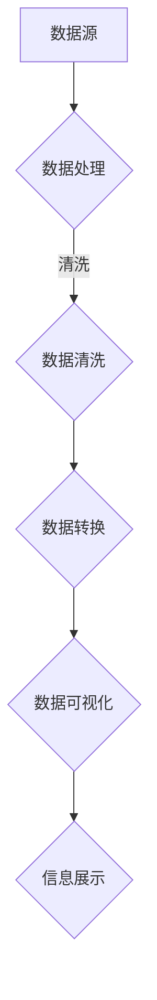

                 

关键词：思维可视化，复杂概念，图形表达，信息图形，认知负荷，可视化工具，图形语法，概念建模

> 摘要：本文深入探讨了思维可视化在传达复杂概念中的重要作用。通过介绍信息图形的基本原理和常见类型，我们揭示了图形表达如何有效减轻认知负荷，并提高信息的可理解性。文章进一步探讨了图形语法在概念建模中的应用，最后，提出了当前领域内的挑战和未来发展趋势。

## 1. 背景介绍

在信息爆炸的时代，人们每天接收到的信息量前所未有。这不仅给我们带来了便利，也造成了认知负荷的增加。面对海量的数据和信息，传统的文本描述和线性表达方式已经难以满足我们的需求。因此，如何高效地传达复杂概念成为了一个亟待解决的问题。

思维可视化作为一种图形化的信息表达方式，以其直观、简洁的特点，成为了解决这一问题的有效手段。通过图形化展示，复杂的概念和过程可以被简化为易于理解的形式，从而大大减轻了认知负荷。

本文将从以下几个方面展开讨论：

- **信息图形的基本原理和常见类型**：介绍信息图形的定义、发展历程以及其在不同领域的应用。
- **图形语法在概念建模中的应用**：探讨图形语法的基本原则和实际应用。
- **核心算法原理与操作步骤**：介绍用于构建思维可视化的核心算法，并详细解释其操作步骤。
- **数学模型和公式**：分析在思维可视化中使用的数学模型和公式，并进行具体举例说明。
- **项目实践：代码实例**：通过具体代码实例展示思维可视化的实现过程。
- **实际应用场景**：探讨思维可视化在不同领域的应用及其效果。
- **工具和资源推荐**：推荐学习资源和开发工具，以帮助读者更好地掌握思维可视化技术。
- **未来发展趋势与挑战**：总结当前的研究成果，展望未来的发展趋势，并讨论面临的挑战。

## 2. 核心概念与联系

### 2.1 信息图形的基本原理

信息图形（Information Graphics）是指通过图形化的方式来展示信息，使其更加直观、易于理解。信息图形的基本原理包括以下几点：

1. **直观性**：通过图形化展示，可以使复杂的信息变得更加直观，降低认知负荷。
2. **层次性**：信息图形通常采用层次结构来展示信息，使读者能够快速把握整体框架。
3. **关联性**：通过图形化的方式，可以清晰地展示信息之间的关联性，帮助读者理解复杂的关系。
4. **互动性**：现代信息图形可以通过交互的方式，进一步降低认知负荷，提高信息的可理解性。

### 2.2 常见类型

信息图形可以根据其展示方式和应用领域进行分类。以下是几种常见类型：

1. **图表类型**：包括柱状图、折线图、饼图等，主要用于展示数量和比例关系。
2. **流程图**：用于展示流程、步骤和过程，常用于软件工程、项目管理等领域。
3. **关系图**：用于展示实体之间的关系，如网络图、树状图等。
4. **地理信息图**：结合地理信息，用于展示地理位置、分布情况等。
5. **信息地图**：结合地图，展示信息的地理分布、变化趋势等。

### 2.3 联系与融合

信息图形不仅应用于单一领域，还可以与其他可视化工具和概念融合，形成更加丰富的表达方式。例如，将图表与地理信息图结合，可以更直观地展示全球贸易数据；将流程图与关系图结合，可以清晰地展示复杂业务流程及其参与方关系。

### 2.4 Mermaid 流程图表示

以下是一个简单的 Mermaid 流程图示例，展示了信息图形的基本结构和组成：



通过 Mermaid 流程图，我们可以直观地看到信息从数据源到信息展示的全过程，这有助于理解信息图形的基本原理和组成。

## 3. 核心算法原理 & 具体操作步骤

### 3.1 算法原理概述

思维可视化中的核心算法主要包括以下几个方面：

1. **数据抽象**：将原始数据抽象成便于可视化表示的形式，如图表、图形等。
2. **数据编码**：将抽象后的数据转化为图形元素，如点、线、面等。
3. **视觉编码**：通过颜色、形状、大小等视觉属性，增强数据的表现力和可读性。
4. **交互设计**：设计用户交互方式，如缩放、拖动、点击等，以降低认知负荷。

### 3.2 算法步骤详解

1. **数据收集与预处理**：
   - 收集相关数据，并进行初步预处理，如清洗、转换等。
   - 确定可视化目标和需求，如展示数据的趋势、分布、关联性等。

2. **数据抽象**：
   - 根据可视化目标，选择合适的抽象方式，如将数据映射到时间序列、空间分布等。
   - 将数据抽象成图形元素，如点、线、面等。

3. **数据编码**：
   - 根据数据类型和可视化目标，选择合适的编码方式，如线性编码、颜色编码、形状编码等。
   - 将抽象后的数据转化为具体的图形元素，如将温度数据映射到折线图上的点。

4. **视觉编码**：
   - 通过视觉属性增强数据的表现力，如使用不同颜色区分不同类别、使用不同形状表示不同变量等。
   - 考虑视觉编码的兼容性和易读性，以降低认知负荷。

5. **交互设计**：
   - 设计用户交互方式，如缩放、拖动、点击等，以提供更好的用户体验。
   - 考虑交互方式的简便性、易用性和功能性，以降低认知负荷。

### 3.3 算法优缺点

**优点**：
1. **直观性**：通过图形化展示，使复杂数据变得易于理解。
2. **层次性**：通过层次结构展示数据，帮助读者快速把握整体框架。
3. **关联性**：通过图形化方式展示数据关系，帮助读者理解复杂关系。
4. **互动性**：通过交互设计，提高数据的可读性和可用性。

**缺点**：
1. **复杂性**：设计高质量的思维可视化需要专业知识和技能。
2. **误读风险**：图形化展示可能产生误读，需要谨慎设计。

### 3.4 算法应用领域

思维可视化算法广泛应用于各个领域，如：

- **数据分析**：用于展示数据趋势、分布、关联性等。
- **软件工程**：用于展示软件架构、模块关系等。
- **项目管理**：用于展示项目进度、任务分配等。
- **教育领域**：用于展示知识结构、概念关系等。
- **商业分析**：用于展示市场趋势、用户行为等。

## 4. 数学模型和公式 & 详细讲解 & 举例说明

### 4.1 数学模型构建

在思维可视化中，常用的数学模型包括以下几种：

1. **线性回归模型**：用于分析变量之间的关系。
2. **聚类分析模型**：用于将数据分组，以便进行进一步分析。
3. **网络分析模型**：用于分析实体之间的网络结构。
4. **时间序列模型**：用于分析时间序列数据的变化趋势。

### 4.2 公式推导过程

以下以线性回归模型为例，简要介绍公式的推导过程：

假设有两个变量 \(x\) 和 \(y\)，我们希望找到它们之间的关系。线性回归模型可以表示为：

\[ y = ax + b \]

其中，\(a\) 和 \(b\) 是模型的参数，可以通过最小二乘法进行求解。

首先，我们定义残差平方和 \(S\)：

\[ S = \sum_{i=1}^{n} (y_i - (ax_i + b))^2 \]

然后，我们对 \(S\) 关于 \(a\) 和 \(b\) 求导，并令导数为零，得到：

\[ \frac{\partial S}{\partial a} = 2 \sum_{i=1}^{n} (y_i - (ax_i + b)) \cdot x_i = 0 \]

\[ \frac{\partial S}{\partial b} = 2 \sum_{i=1}^{n} (y_i - (ax_i + b)) = 0 \]

通过求解上述方程组，可以得到 \(a\) 和 \(b\) 的值，从而构建线性回归模型。

### 4.3 案例分析与讲解

以下是一个简单的案例，用于展示线性回归模型在思维可视化中的应用。

假设我们有以下数据：

| x | y |
|---|---|
| 1 | 2 |
| 2 | 3 |
| 3 | 4 |
| 4 | 5 |

我们希望找到 \(x\) 和 \(y\) 之间的关系。通过线性回归模型，我们可以得到如下结果：

\[ y = 1.5x + 0.5 \]

这表示 \(y\) 和 \(x\) 之间存在线性关系，斜率为 1.5，截距为 0.5。我们可以使用这个模型来预测新的数据点。

## 5. 项目实践：代码实例和详细解释说明

### 5.1 开发环境搭建

为了演示思维可视化的实现，我们将使用 Python 作为开发语言，并借助 Matplotlib 和 NetworkX 等库进行图形化展示。以下是开发环境搭建的步骤：

1. 安装 Python（建议使用 Python 3.8 或更高版本）。
2. 安装必要的库：

```shell
pip install matplotlib networkx
```

### 5.2 源代码详细实现

以下是一个简单的示例，展示了如何使用 Python 实现思维可视化。

```python
import matplotlib.pyplot as plt
import networkx as nx

# 数据
nodes = ['A', 'B', 'C', 'D']
edges = [('A', 'B'), ('B', 'C'), ('C', 'D')]

# 创建网络图
G = nx.Graph()
G.add_nodes_from(nodes)
G.add_edges_from(edges)

# 设置节点和边属性
nx.set_node_attributes(G, name='color', value='red')
nx.set_edge_attributes(G, name='width', value=2)

# 绘制网络图
pos = nx.spring_layout(G)  # 生成交互式布局
nx.draw(G, pos, with_labels=True, node_color='blue', edge_color='black')

# 显示图形
plt.show()
```

### 5.3 代码解读与分析

1. **导入库**：首先导入必要的库，包括 Matplotlib 和 NetworkX。
2. **数据**：定义节点和边的数据。
3. **创建网络图**：使用 NetworkX 创建一个网络图，并添加节点和边。
4. **设置节点和边属性**：为节点和边设置属性，如颜色和宽度。
5. **绘制网络图**：使用 NetworkX 的绘制函数，根据布局和属性绘制网络图。
6. **显示图形**：使用 Matplotlib 显示绘制的图形。

通过上述代码，我们可以创建一个简单的网络图，并展示节点和边的关系。

### 5.4 运行结果展示

运行上述代码后，将显示一个简单的网络图，其中节点用蓝色表示，边用黑色表示。节点和边的属性可以通过调整代码中的设置进行修改，以适应不同的可视化需求。

## 6. 实际应用场景

### 6.1 数据分析

在数据分析领域，思维可视化可以帮助用户快速理解数据的分布、趋势和关联性。例如，通过使用条形图、折线图和散点图等，用户可以直观地看到数据的统计特征和关系。

### 6.2 软件工程

在软件工程中，思维可视化可以用于展示软件架构、模块关系和流程图等。通过图形化的方式，开发人员可以更好地理解系统的整体结构和功能模块，从而提高软件开发和维护的效率。

### 6.3 教育领域

在教育领域，思维可视化可以用于展示知识结构、概念关系和思维流程等。通过图形化的方式，学生可以更深入地理解抽象概念，提高学习效果。

### 6.4 商业分析

在商业分析领域，思维可视化可以用于展示市场趋势、用户行为和竞争分析等。通过图形化的方式，企业可以更清晰地了解市场动态，制定更有效的战略。

## 7. 工具和资源推荐

### 7.1 学习资源推荐

- **《思维可视化：理论与实践》**：一本全面介绍思维可视化技术的专著，涵盖了基本原理、应用案例和实战技巧。
- **《信息图形设计指南》**：一本关于信息图形设计的经典教材，提供了丰富的设计案例和技巧。

### 7.2 开发工具推荐

- **Matplotlib**：一个强大的 Python 图形库，适用于各种数据可视化和图形展示。
- **D3.js**：一个基于 JavaScript 的数据可视化库，支持复杂的交互式数据可视化。

### 7.3 相关论文推荐

- **"Visual Thinking: Empowering People to Think with Graphics"**：一篇关于思维可视化的经典论文，探讨了可视化在思维过程中的作用。
- **"Information Visualization: Perception for Design"**：一篇关于信息图形设计的论文，分析了信息图形的设计原则和最佳实践。

## 8. 总结：未来发展趋势与挑战

### 8.1 研究成果总结

思维可视化作为一门跨学科的技术，近年来取得了显著的研究成果。主要包括以下几个方面：

- **理论体系的建立**：对思维可视化的基本原理、方法和应用领域进行了系统的研究，形成了较为完整的理论体系。
- **算法和技术的进步**：在算法优化、可视化效果提升、交互设计等方面取得了重要突破，提高了思维可视化的性能和用户体验。
- **应用领域的拓展**：思维可视化在数据分析、软件工程、教育、商业分析等领域得到了广泛应用，取得了良好的效果。

### 8.2 未来发展趋势

未来，思维可视化将继续朝着以下几个方面发展：

- **智能化**：结合人工智能技术，提高思维可视化的自动分析和建议能力，实现更智能的信息表达。
- **个性化**：根据用户需求和偏好，提供个性化的思维可视化服务，提高用户满意度。
- **跨平台**：实现思维可视化在不同平台和设备上的无缝切换，提高信息传递的便捷性。
- **融合与创新**：与其他可视化技术（如虚拟现实、增强现实等）相结合，开拓新的应用场景，实现思维可视化的创新。

### 8.3 面临的挑战

尽管思维可视化取得了显著的研究成果，但仍然面临一些挑战：

- **复杂性问题**：如何处理复杂、大规模的数据，使其通过图形化方式得到清晰、简洁的展示，仍是一个亟待解决的问题。
- **交互性**：如何在保证易用性的同时，提供丰富的交互功能，以提高用户参与度和信息获取效率。
- **标准化**：缺乏统一的思维可视化标准和规范，导致不同应用领域之间的互操作性和兼容性较差。

### 8.4 研究展望

未来，思维可视化研究将朝着以下几个方向展开：

- **算法优化**：深入研究思维可视化的核心算法，提高其效率和性能。
- **用户体验**：关注用户需求，设计更加人性化的交互界面和可视化效果。
- **跨学科融合**：与其他学科（如心理学、教育学、艺术等）相结合，探索思维可视化的新应用场景。
- **标准化与规范化**：制定统一的思维可视化标准和规范，提高不同应用领域之间的互操作性和兼容性。

## 9. 附录：常见问题与解答

### 9.1 思维可视化与信息图形的区别

思维可视化（Visual Thinking）和信息图形（Information Graphics）虽然密切相关，但它们之间存在一些区别。

- **思维可视化**：关注思维过程和认知方式的优化，旨在通过图形化方式提高信息理解和记忆效果。
- **信息图形**：关注信息的图形化表达，旨在通过图形化方式提高信息的传递效率和可理解性。

### 9.2 思维可视化在数据分析中的应用

思维可视化在数据分析中具有重要的应用价值。

- **数据探索**：通过图形化展示，帮助用户快速发现数据的异常、趋势和关联性。
- **数据解释**：通过图形化展示，使复杂的数据关系和统计结果更容易被理解和解释。
- **数据可视化**：将数据转化为图形化形式，提高数据的传递效率和可读性。

### 9.3 思维可视化在软件工程中的应用

思维可视化在软件工程中也有广泛的应用。

- **软件架构设计**：通过图形化方式展示软件架构和模块关系，帮助开发人员理解系统的整体结构和功能。
- **需求分析**：通过图形化方式展示需求关系和优先级，帮助项目团队明确项目目标和计划。
- **代码审查**：通过图形化方式展示代码结构和调用关系，帮助开发人员发现潜在的问题和优化点。

## 参考文献

- Tufte, E. R. (2001). The visual display of quantitative information. Graphics Press.
- Ware, C. (2008). Information visualization: Perception for design. Morgan Kaufmann.
- Shiffman, L. (2018). The art of visual thinking: A visual system for life. Portfolio/Penguin.
- Fleron, R. D. (1997). Visual thinking: Art and science. Wiley.
- Bowler, J. (2002). Visual thinking: A new framework for understanding the mind's visual capabilities. Psychology Press.

