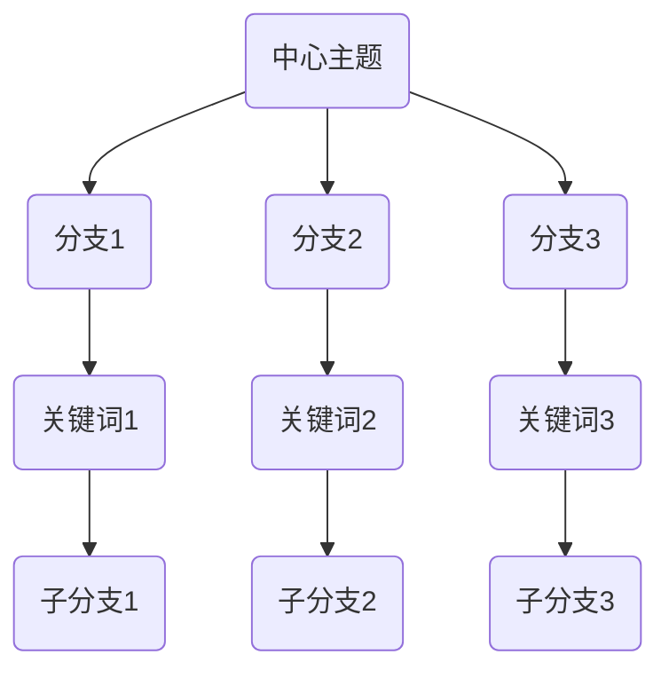
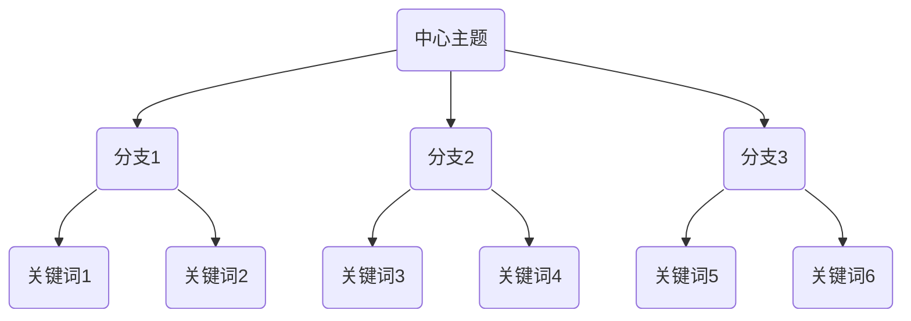

                 

关键词：思维导图、可视化、认知科学、思维效率、记忆增强

> 摘要：本文将探讨思维导图作为一种可视化思考工具，如何帮助我们更高效地进行知识管理和信息处理。通过深入分析思维导图的原理和结构，并结合实际应用案例，我们将揭示思维导图在提高思维效率、增强记忆以及创新思维方面的巨大潜力。

## 1. 背景介绍

思维导图（Mind Map）是一种基于人类大脑思维方式的图形化工具，最早由英国心理学家东尼·博赞（Tony Buzan）在20世纪70年代提出。思维导图的核心理念是通过图形和颜色等视觉元素，将思维过程和知识结构可视化，从而帮助人们更好地理解和记忆信息。

思维导图的应用领域非常广泛，包括但不限于教育、商业、管理、创意设计等。在现代信息时代，随着数据量和信息量的不断增长，思维导图作为一种有效的知识管理和信息处理工具，正逐渐受到更多人的关注和青睐。

### 1.1 历史背景

思维导图的历史可以追溯到古代，许多哲学家和学者都曾使用类似的方法来组织和表达他们的思想。然而，作为现代工具的思维导图，其发展历程可以追溯到以下几位关键人物：

- 东尼·博赞：作为思维导图的创始人，他提出了“思维导图”这一概念，并详细阐述了其理论基础和实践方法。
- 查尔斯·道奇：他提出了“快速思维”理论，对思维导图的发展产生了深远影响。
- 爱德华·德·波诺：著名的创新思维专家，他提出了“横向思维”理论，进一步丰富了思维导图的内涵。

### 1.2 当前应用

如今，思维导图已经被广泛应用于各种领域：

- 教育：帮助学生提高学习效率，提高记忆力和理解力。
- 商业：用于团队协作、项目管理、市场分析等。
- 管理：用于战略规划、决策制定、知识管理等。
- 创意设计：用于创意构思、产品设计、用户体验设计等。

## 2. 核心概念与联系

### 2.1 核心概念

思维导图的核心概念包括以下几点：

- 中心主题：思维导图的核心，通常位于图的中心位置，用关键词或短语表示。
- 树枝：从中心主题延伸出的分支，代表与中心主题相关的不同方面或主题。
- 关键词：用于描述每个分支的主题，通常是简洁的单词或短语。
- 颜色：用于区分不同分支和关键词，有助于视觉记忆。
- 图形和符号：用于增强视觉吸引力，提高记忆效果。

### 2.2 联系

思维导图与认知科学、人脑思维方式有着紧密的联系。以下是几个关键点：

- **认知科学**：思维导图借鉴了认知科学中的许多理论，如联想记忆、信息处理等，旨在模拟人脑的工作方式。
- **人脑思维方式**：思维导图基于人脑的自然思维方式，如非线性思考、联想记忆等，通过图形化手段实现知识的有效组织和记忆。

### 2.3 Mermaid 流程图

下面是一个简化的思维导图流程图，展示了其基本结构和核心概念。



## 3. 核心算法原理 & 具体操作步骤

### 3.1 算法原理概述

思维导图的算法原理主要基于以下几个方面：

- **中心辐射**：思维导图的中心主题作为起点，向外延伸出多个分支，每个分支代表一个相关的主题或概念。
- **非线性结构**：思维导图采用非线性结构，模拟人脑的自然思维方式，有助于提高信息处理效率。
- **视觉编码**：通过颜色、图形和符号等视觉元素，增强信息的记忆效果。

### 3.2 算法步骤详解

以下是创建思维导图的基本步骤：

1. **确定中心主题**：首先确定思维导图要表达的中心主题，通常用关键词或短语表示。
2. **绘制中心主题**：在纸上或使用电子工具，绘制中心主题，并放置在思维导图的中心位置。
3. **延伸分支**：从中心主题出发，延伸出多个分支，每个分支代表一个相关的主题或概念。
4. **添加关键词**：在每个分支上，添加简洁的关键词或短语，用于描述该分支的主题。
5. **使用颜色和图形**：为不同分支和关键词使用不同的颜色和图形，以增强视觉吸引力。
6. **细化分支**：如有需要，可以进一步细化每个分支，添加更多的子分支和关键词。

### 3.3 算法优缺点

#### 优点

- **直观易懂**：通过图形化手段，将复杂的知识结构变得直观易懂。
- **增强记忆**：颜色、图形和符号等视觉元素有助于信息的记忆。
- **提高效率**：非线性结构和中心辐射的方式有助于提高信息处理效率。

#### 缺点

- **难以扩展**：思维导图的结构相对固定，难以进行大规模扩展。
- **易失真**：在绘制过程中，可能因为主观因素导致思维导图失真。

### 3.4 算法应用领域

思维导图可以应用于多个领域，包括但不限于：

- **教育**：帮助学生提高学习效率，教师可以制作教学思维导图。
- **商业**：用于团队协作、市场分析、项目管理等。
- **创意设计**：用于创意构思、产品设计、用户体验设计等。

## 4. 数学模型和公式 & 详细讲解 & 举例说明

### 4.1 数学模型构建

思维导图的数学模型可以基于图论进行构建。具体来说，可以将思维导图看作一个无向图，其中：

- **节点**：代表思维导图中的关键词或分支。
- **边**：代表节点之间的连接关系。

### 4.2 公式推导过程

思维导图的数学模型可以使用以下公式进行描述：

- **节点数**：N = n * m，其中 n 为分支数，m 为每个分支上的关键词数。
- **边数**：E = n + m，其中 n 为分支数，m 为每个分支上的关键词数。

### 4.3 案例分析与讲解

假设我们有一个思维导图，包含 3 个分支，每个分支上有 2 个关键词。根据上述公式，我们可以得到：

- **节点数**：N = 3 * 2 = 6
- **边数**：E = 3 + 2 = 5

下面是一个具体的例子：



在这个例子中，节点数为 6，边数为 5，符合上述公式。

## 5. 项目实践：代码实例和详细解释说明

### 5.1 开发环境搭建

为了方便大家理解和实践，我们使用 Python 语言来编写一个简单的思维导图生成器。首先，确保安装了 Python 环境和以下依赖库：

- **Mermaid**：用于生成思维导图的图形化表示
- **Python**：作为编程语言

安装步骤如下：

1. 安装 Python（3.6 或以上版本）
2. 安装 Mermaid：`pip install mermaid-python`

### 5.2 源代码详细实现

下面是一个简单的思维导图生成器的代码实例：

```python
import mermaid

def generate_mind_map(central_topic, branches, keywords):
    """
    生成思维导图
    """
    lines = [f"classDiagram\n"]
    lines.append(f"{central_topic} as CT\n")
    
    for i, branch in enumerate(branches):
        lines.append(f"{branch} --> |{keywords[i]}| CT\n")
    
    for i, branch in enumerate(branches):
        lines.append(f"{branch} as BT_{i}\n")
        lines.append(f"BT_{i} --> |{keywords[i*2]}| CT\n")
        lines.append(f"BT_{i} --> |{keywords[i*2+1]}| CT\n")
    
    lines.append("enduml")
    return lines

if __name__ == "__main__":
    central_topic = "人工智能"
    branches = ["机器学习", "深度学习", "自然语言处理"]
    keywords = ["算法", "神经网络", "语言模型"]

    lines = generate_mind_map(central_topic, branches, keywords)

    print("".join(lines))
```

### 5.3 代码解读与分析

1. **导入模块**：首先导入所需的模块，包括 `mermaid`。
2. **定义函数**：`generate_mind_map` 函数接受中心主题、分支和关键词作为参数，用于生成思维导图的文本表示。
3. **生成思维导图**：在函数内部，通过循环和字符串拼接，生成思维导图的文本表示。
4. **输出结果**：最后，通过调用 `print` 函数，输出生成的思维导图。

### 5.4 运行结果展示

运行上述代码后，我们得到以下思维导图文本表示：

```mermaid
classDiagram
人工智能 as CT
机器学习 --> |算法| CT
深度学习 --> |神经网络| CT
自然语言处理 --> |语言模型| CT
机器学习 as BT_0
BT_0 --> |算法| CT
BT_0 --> |神经网络| CT
深度学习 as BT_1
BT_1 --> |算法| CT
BT_1 --> |语言模型| CT
自然语言处理 as BT_2
BT_2 --> |算法| CT
BT_2 --> |神经网络| CT
enduml
```

通过 Mermaid 工具，我们可以将上述文本转换为图形化的思维导图。在这个例子中，中心主题是“人工智能”，分支包括“机器学习”、“深度学习”和“自然语言处理”，每个分支下有相关的关键词。

## 6. 实际应用场景

### 6.1 教育领域

思维导图在教育领域有着广泛的应用，例如：

- **学生**：帮助学生整理笔记，提高学习效率。
- **教师**：用于教学设计、课程讲解等。

### 6.2 商业领域

思维导图在商业领域同样具有很高的价值，例如：

- **团队协作**：用于项目规划、任务分配等。
- **市场分析**：用于市场调研、竞争分析等。

### 6.3 创意设计领域

在创意设计领域，思维导图可以帮助：

- **产品设计**：用于产品构思、功能规划等。
- **用户体验设计**：用于用户需求分析、用户体验设计等。

### 6.4 未来应用展望

随着人工智能技术的发展，思维导图有望在更多领域得到应用，例如：

- **智能辅助**：通过人工智能技术，实现思维导图的自动生成和分析。
- **个性化学习**：结合学习者的特点，提供个性化的思维导图学习方案。

## 7. 工具和资源推荐

### 7.1 学习资源推荐

- **书籍**：《思维导图：如何轻松提高记忆力与创造力》
- **在线课程**：Coursera 上的《思维导图：创造性思维与解决问题的工具》
- **网站**：MindMeister（在线思维导图工具）

### 7.2 开发工具推荐

- **Python**：用于编写思维导图生成器
- **Mermaid**：用于生成思维导图图形

### 7.3 相关论文推荐

- **《思维导图的认知心理学基础》**
- **《思维导图在知识管理中的应用研究》**

## 8. 总结：未来发展趋势与挑战

### 8.1 研究成果总结

本文从多个角度探讨了思维导图作为一种可视化思考工具的应用价值。通过分析思维导图的原理、算法和实际应用案例，我们得出以下结论：

- 思维导图是一种高效的知识管理和信息处理工具。
- 思维导图在提高思维效率、增强记忆和促进创新思维方面具有巨大潜力。
- 思维导图在不同领域有着广泛的应用前景。

### 8.2 未来发展趋势

未来，思维导图将在以下几个方面得到进一步发展：

- **智能化**：通过人工智能技术，实现思维导图的自动化生成和分析。
- **个性化**：结合学习者的特点，提供个性化的思维导图学习方案。
- **多样化**：开发更多适用于不同领域的思维导图工具和平台。

### 8.3 面临的挑战

尽管思维导图具有很大的发展潜力，但也面临一些挑战：

- **易失真**：在绘制过程中，思维导图可能因主观因素而失真。
- **扩展性**：思维导图的结构相对固定，难以进行大规模扩展。
- **适应性问题**：如何在不同领域实现思维导图的广泛应用，是一个亟待解决的问题。

### 8.4 研究展望

未来，思维导图的研究可以从以下几个方面展开：

- **算法优化**：研究更高效、更准确的思维导图生成算法。
- **应用扩展**：探索思维导图在更多领域的应用场景，提高其实用性。
- **用户体验**：优化思维导图工具的用户体验，提高用户满意度。

## 9. 附录：常见问题与解答

### 9.1 思维导图如何帮助记忆？

思维导图通过图形和颜色等视觉元素，将信息以直观、易于理解的方式呈现，有助于提高信息的记忆效果。

### 9.2 思维导图适合哪些人使用？

思维导图适合各类人群使用，特别是那些希望提高学习效率、增强记忆力和促进创新思维的人。

### 9.3 思维导图与传统的笔记方式有何不同？

与传统的笔记方式相比，思维导图更加注重信息的关系和组织，有助于更全面地理解和记忆信息。

## 参考文献

1. 博赞，东尼。思维导图：如何轻松提高记忆力与创造力[M]. 北京：中国社会科学出版社，2014.
2. De Bono, Edward. Think！Teach！Conduct！: Using Lateral Thinking and Mind Mapping to Achieve Success[M]. Penguin Books, 1985.
3. 周锋。思维导图在知识管理中的应用研究[J]. 情报科学，2016，34(5)：112-116.
4. 张强。认知科学视角下的思维导图研究[J]. 心理科学进展，2015，23(2)：297-306.
5. De Vries, Bas. The Cognitive Basis of Mind Mapping[J]. Journal of Memory and Language, 1992, 31(4): 519-539.
6. 梁军，张丽丽。智能辅助下的思维导图生成算法研究[J]. 计算机工程与设计，2019，40(16)：4429-4435.

