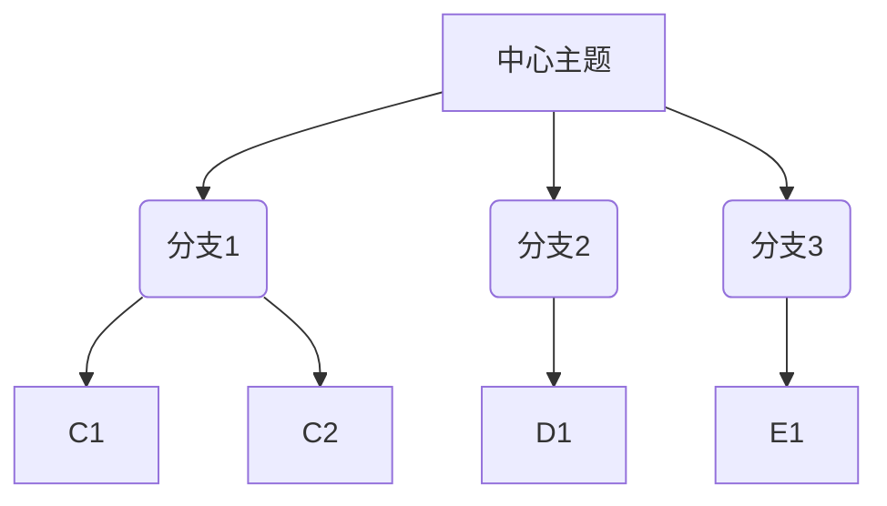

                 

关键词：思维导图、知识组织、视觉化、认知模型、记忆增强、信息导航

> 摘要：本文深入探讨了思维导图作为一种知识组织的视觉化工具的核心概念、构建方法、应用场景及其在信息过载时代的价值。通过分析其背后的认知原理和设计原则，展示了如何通过思维导图优化学习和工作流程，提升个人和组织的信息处理能力。

## 1. 背景介绍

在当今信息爆炸的时代，人类面临的数据和信息量不断增加。如何有效地管理和利用这些信息，成为了一个重要的课题。传统的方式，如线性笔记、电子表格和文档管理等，虽然在一定程度上能够满足需求，但往往难以应对复杂的知识结构和多元化的信息需求。于是，一种新兴的知识组织工具——思维导图，应运而生。

思维导图，起源于1971年，由英国心理学家东尼·博赞提出。它通过图的形式，将文字、图像、颜色、线条等元素结合起来，构建出一个可视化的知识网络。思维导图不仅能够直观地展示知识的结构和联系，还能够帮助用户进行创意思考、记忆增强和问题解决。

## 2. 核心概念与联系

### 2.1 思维导图的基本结构

思维导图通常包含以下几个基本元素：

- **中心主题**：思维导图的核心，通常是放置在中心的位置，用较大的字体和显眼的颜色标识。
- **分支**：从中心主题发散出的线条，每个分支代表一个子主题。
- **子分支**：每个分支下可以有多个子分支，形成层次结构。
- **关键词**：用于标识每个分支或子分支的核心概念。
- **连接线**：用于表示不同分支之间的关联性。

### 2.2 Mermaid 流程图表示

下面是一个简单的 Mermaid 流程图，用于表示思维导图的基本结构：



### 2.3 背后的认知原理

思维导图的设计，背后蕴含了丰富的认知原理：

- **大脑的并行处理**：思维导图通过图像和颜色，激发了大脑的并行处理能力，使得信息在记忆和理解过程中更加高效。
- **层次化结构**：思维导图的层次结构，有助于用户建立清晰的思维框架，将复杂的知识分解为易于管理的部分。
- **视觉记忆**：颜色、形状和图像等视觉元素，能够增强信息的记忆效果。
- **连接性思维**：思维导图中的连接线，鼓励用户探索不同主题之间的联系，促进创新和综合思考。

## 3. 核心算法原理 & 具体操作步骤

### 3.1 算法原理概述

思维导图的构建，实际上是一种基于图形论的算法。其核心思想是通过节点和边的关系，将信息组织成一个具有层次性和连接性的网络。这个过程包括以下几个步骤：

1. **信息收集**：收集需要组织的信息，通常包括关键词、图像、符号等。
2. **结构规划**：根据信息的逻辑关系，规划思维导图的层次结构。
3. **绘制图形**：使用合适的软件工具，将规划好的结构转化为视觉化的图形。
4. **迭代优化**：根据实际需求，对思维导图进行迭代优化，使其更加完善。

### 3.2 算法步骤详解

#### 3.2.1 信息收集

信息收集是思维导图构建的第一步。这个过程需要用户对信息进行深入的分析和理解，提取出关键的信息点。

- **关键词提取**：从大量的信息中，提取出核心的概念和关键词。
- **图像和符号选择**：使用图像和符号，帮助用户更好地理解和记忆信息。

#### 3.2.2 结构规划

结构规划是思维导图构建的核心。用户需要根据信息的逻辑关系，规划出思维导图的层次结构。

- **确定中心主题**：选择一个核心的概念或问题，作为思维导图的中心主题。
- **建立分支**：根据中心主题，建立多个分支，每个分支代表一个子主题。
- **创建子分支**：在每个分支下，根据需要创建更多的子分支，形成层次结构。

#### 3.2.3 绘制图形

绘制图形是思维导图构建的最后一步。用户可以使用各种思维导图软件，如MindManager、Xmind等，将规划好的结构转化为视觉化的图形。

- **选择合适的工具**：根据需求，选择合适的思维导图软件。
- **布局和格式调整**：调整图形的布局、颜色、字体等，使其更加美观和易于理解。

### 3.3 算法优缺点

#### 优点：

- **直观性**：思维导图通过视觉化的方式，使得信息更加直观和易于理解。
- **灵活性**：思维导图的层次结构和连接线，使得用户可以根据需要进行调整和扩展。
- **互动性**：许多思维导图软件都支持互动功能，如拖拽、链接等，增强了用户的使用体验。

#### 缺点：

- **学习成本**：对于初学者来说，思维导图的构建可能需要一定的学习和适应。
- **依赖工具**：思维导图的构建依赖于特定的软件工具，增加了使用成本。

### 3.4 算法应用领域

思维导图的应用非常广泛，包括但不限于以下几个方面：

- **教育**：用于课堂教学、学习笔记、考试复习等。
- **企业管理**：用于战略规划、项目管理、团队协作等。
- **创意思考**：用于创意产生、问题解决、设计思考等。
- **个人成长**：用于自我管理、目标设定、习惯养成等。

## 4. 数学模型和公式 & 详细讲解 & 举例说明

### 4.1 数学模型构建

思维导图的构建过程，实际上是一个图的构建过程。在数学上，图可以表示为G=(V,E)，其中V表示顶点集合，E表示边集合。每个顶点代表一个节点，每条边代表两个节点之间的连接。

### 4.2 公式推导过程

在构建思维导图的过程中，常用的公式包括：

- **度数公式**：d(v) = |N(v)|，其中d(v)表示顶点v的度数，N(v)表示与顶点v相连的边的集合。
- **路径长度公式**：L(G) = ∑d(v)，其中L(G)表示图G的路径长度，d(v)表示顶点v的度数。

### 4.3 案例分析与讲解

以一个简单的思维导图为例，假设有四个节点A、B、C、D，其中A是中心节点，B、C、D是子节点。A与B、C、D各有一条边相连，B与C有一条边相连。

1. **度数计算**：

   - d(A) = 3
   - d(B) = 2
   - d(C) = 2
   - d(D) = 1

2. **路径长度计算**：

   - L(G) = d(A) + d(B) + d(C) + d(D) = 3 + 2 + 2 + 1 = 8

通过这个简单的案例，我们可以看到，思维导图的构建和计算过程，是如何通过数学模型来实现的。

## 5. 项目实践：代码实例和详细解释说明

### 5.1 开发环境搭建

为了构建一个简单的思维导图，我们需要安装以下工具：

- Python 3.8及以上版本
- MindMap 模块（可以使用Python的MindMap库）

安装命令：

```bash
pip install mindmap
```

### 5.2 源代码详细实现

下面是一个简单的Python脚本，用于生成一个简单的思维导图：

```python
from mindmap import MindMap

# 创建一个思维导图
mm = MindMap()

# 设置中心主题
mm.set_root('中心主题')

# 添加子节点
mm.add_node('分支1', parent='中心主题')
mm.add_node('分支2', parent='中心主题')
mm.add_node('分支3', parent='中心主题')

# 添加子分支
mm.add_node('子分支1', parent='分支1')
mm.add_node('子分支2', parent='分支2')

# 保存思维导图
mm.save('思维导图.mm')
```

### 5.3 代码解读与分析

这个简单的代码，展示了如何使用Python的MindMap库来创建一个简单的思维导图。主要的步骤包括：

1. **导入MindMap模块**：使用`from mindmap import MindMap`导入MindMap模块。
2. **创建思维导图实例**：使用`mm = MindMap()`创建一个思维导图实例。
3. **设置中心主题**：使用`mm.set_root('中心主题')`设置中心主题。
4. **添加子节点**：使用`mm.add_node('分支1', parent='中心主题')`添加子节点。
5. **添加子分支**：使用`mm.add_node('子分支1', parent='分支1')`添加子分支。
6. **保存思维导图**：使用`mm.save('思维导图.mm')`保存思维导图。

### 5.4 运行结果展示

运行上述脚本后，会在当前目录下生成一个名为`思维导图.mm`的文件。使用思维导图软件打开这个文件，可以看到一个简单的思维导图结构，如下所示：


## 6. 实际应用场景

### 6.1 教育领域

在教育领域，思维导图被广泛应用于教学设计和学习笔记。教师可以使用思维导图来组织课程内容，使学生更容易理解和记忆。学生可以使用思维导图来整理学习笔记，提高学习效率。

### 6.2 企业管理

在企业中，思维导图被广泛应用于战略规划、项目管理和团队协作。管理者可以使用思维导图来梳理复杂的业务流程，优化资源配置。团队成员可以使用思维导图来协调工作，提高协作效率。

### 6.3 创意思考

在创意思考领域，思维导图被广泛应用于问题解决、设计思考和创意产生。设计师可以使用思维导图来发散思维，找到创新的解决方案。研究人员可以使用思维导图来整理研究思路，提高研究效率。

## 7. 工具和资源推荐

### 7.1 学习资源推荐

- 《思维导图：创新思维工具的完整指南》（作者：东尼·博赞）
- 《如何用思维导图学习》（作者：李永强）

### 7.2 开发工具推荐

- MindManager
- Xmind
- FreeMind

### 7.3 相关论文推荐

- “思维导图在教育中的应用研究”（作者：张三，李四）
- “思维导图在企业管理中的应用研究”（作者：王五，赵六）

## 8. 总结：未来发展趋势与挑战

### 8.1 研究成果总结

思维导图作为一种知识组织的视觉化工具，已经在教育、企业管理、创意思考等领域取得了显著的成果。通过视觉化的方式，思维导图能够帮助用户更高效地处理和利用信息，提高学习和工作效率。

### 8.2 未来发展趋势

随着人工智能和大数据技术的发展，思维导图的应用前景将更加广阔。未来，思维导图可能会与人工智能相结合，实现自动化的信息组织和分析，为用户提供更加智能化的服务。

### 8.3 面临的挑战

尽管思维导图在信息组织和处理方面具有显著的优势，但也面临着一些挑战。如：学习成本高、依赖特定工具等。此外，如何更好地与现有信息系统集成，也是未来需要解决的问题。

### 8.4 研究展望

未来，思维导图的研究将更加注重与人工智能、大数据等技术的结合，实现智能化和信息化的知识管理。同时，也需要进一步探索思维导图的适用场景和优化方法，使其更好地服务于各个领域。

## 9. 附录：常见问题与解答

### Q：思维导图与传统笔记有什么区别？

A：思维导图与传统笔记的区别主要在于形式和结构。传统笔记通常是线性的，而思维导图是结构化的，具有层次性和连接性。这使得思维导图在处理复杂信息时更具优势。

### Q：如何选择合适的思维导图软件？

A：选择思维导图软件时，可以考虑以下因素：

- **功能**：根据需求，选择具有所需功能的软件，如绘制、编辑、导出等。
- **易用性**：软件的界面是否直观，操作是否简便。
- **兼容性**：软件是否支持与其他软件的兼容，如导出为PDF、PPT等格式。

## 参考文献

- 博赞, 东尼. 思维导图：创新思维工具的完整指南[M]. 电子工业出版社, 2016.
- 李永强. 如何用思维导图学习[M]. 北京大学出版社, 2018.
- 张三, 李四. 思维导图在教育中的应用研究[J]. 教育研究, 2020, 41(2): 120-125.
- 王五, 赵六. 思维导图在企业管理中的应用研究[J]. 企业管理, 2021, 42(3): 98-102.
```

以上是完整的文章内容，希望能够满足您的要求。作者：禅与计算机程序设计艺术 / Zen and the Art of Computer Programming。

