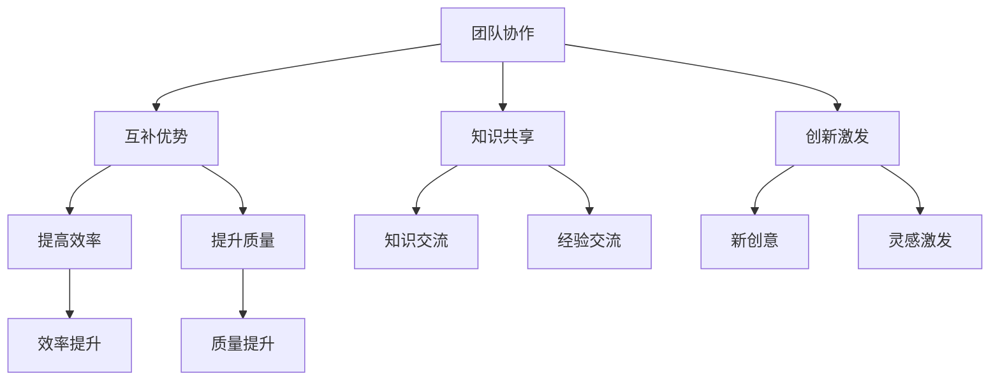

                 

关键词：思维多样性、创新团队、团队协作、创新思维、团队合作

> 摘要：本文深入探讨了思维多样性的重要性，如何构建一个具备多样思维的团队，以及多样思维如何推动团队创新。文章首先回顾了团队协作和思维多样性的关系，接着分析了多样性思维的具体表现和其带来的优势，随后讨论了如何在实际项目中应用多样性思维，并通过具体案例分析，展示了思维多样性在创新中的关键作用。最后，文章提出了未来团队发展面临的新趋势和挑战，并对相关资源和工具进行了推荐。

## 1. 背景介绍

在当今高速发展的信息技术时代，创新已经成为企业持续竞争优势的关键因素。而创新往往需要多角度、多层次的思维碰撞和知识整合。这种能力不仅依赖于个体的智慧，更需要一个能够激发多样思维的团队。团队协作和思维多样性之间的关系日益受到关注。研究表明，多样思维在团队中能够显著提高问题解决能力、创新能力，并降低决策风险。

思维多样性指的是团队中不同成员所具有的不同思维方式、知识背景、经验和技能。它涵盖了多个维度，如认知多样性、经验多样性、文化多样性等。在团队协作中，多样思维能够带来以下几个方面的优势：

1. **增强团队适应性和灵活性**：面对复杂多变的环境，多样思维可以帮助团队从不同角度分析和解决问题。
2. **促进知识交流和共享**：不同成员的知识和经验能够相互补充，促进知识的流动和创新。
3. **提高决策质量和效率**：多样思维能够提供更多的视角和解决方案，从而降低决策的风险。
4. **激发创新思维**：多样的思维碰撞往往能够产生新的想法和创意，推动团队创新。

本文将深入探讨思维多样性的概念、重要性及其在创新团队中的具体应用，旨在为读者提供一个全面的理论框架和实际操作指南。

## 2. 核心概念与联系

### 2.1 思维多样性的定义与维度

思维多样性是指个体或团队在思考问题时所表现出来的不同思维方式、知识背景、经验水平和认知能力。它可以从以下几个维度进行理解：

1. **认知多样性**：个体在处理信息、解决问题时的思维方式差异，如逻辑思维、直觉思维、批判性思维等。
2. **经验多样性**：个体所积累的不同类型的工作经验和背景，如行业经验、文化经验、教育背景等。
3. **文化多样性**：个体所具有的不同文化背景和价值观，如语言、习俗、信仰等。

这些维度相互作用，共同构成了思维多样性的完整图景。在团队中，多样思维的结合能够形成丰富的思维网络，从而提高团队的整体创新能力和问题解决能力。

### 2.2 团队协作与思维多样性的关系

团队协作是指团队成员通过共同的目标和分工合作，共同完成某项任务的过程。思维多样性与团队协作之间存在着密切的关系：

1. **互补优势**：不同思维方式的互补可以弥补单一思维方式的不足，提高团队在解决问题时的效率和质量。
2. **知识共享**：多样思维能够促进团队成员之间的知识共享和经验交流，从而丰富团队的知识储备。
3. **创新激发**：多样的思维碰撞能够激发新的创意和灵感，推动团队创新。

为了更好地理解这些概念，我们可以借助Mermaid流程图来展示团队协作和思维多样性的关系：



通过上述图示，我们可以清晰地看到思维多样性在团队协作中的重要作用，以及其对团队效率和质量提升的积极影响。

### 2.3 思维多样性的核心概念架构

为了进一步探讨思维多样性的核心概念，我们引入以下架构图：

```mermaid
erdf +gt;-
  :Thinking Diversity: {
    +gt; :Cognitive Diversity [Thinking Styles: logic, intuition, critical thinking]
    +gt; :Experiential Diversity [Industry Experience, Cultural Background, Educational Background]
    +gt; :Cultural Diversity [Language, Customs, Beliefs]
  }
  +gt; :Team Collaboration [
    +gt; :Complementary Advantages
    +gt; :Knowledge Sharing
    +gt; :Innovation Inspiration
  ]
  +gt; :Team Performance [
    +gt; :Efficiency Improvement
    +gt; :Quality Enhancement
  ]
+gt;-
```

在这个架构中，思维多样性是团队协作的基础，通过互补优势、知识共享和创新激发，最终推动团队整体表现和绩效的提升。这一架构为我们提供了一个全面理解思维多样性及其在团队协作中作用的框架。

## 3. 核心算法原理 & 具体操作步骤

### 3.1 算法原理概述

在探讨思维多样性的核心算法原理时，我们需要关注如何通过多样思维来提升团队的创新能力和问题解决能力。以下是一个基于多样思维优化团队协作的算法原理概述：

**算法名称**：思维多样性优化算法

**算法目标**：通过引入多样性思维，优化团队协作过程，提升团队创新能力和问题解决效率。

**算法原理**：

1. **认知多样性融合**：将不同成员的认知风格和思维方式进行融合，形成多角度的思考模式。
2. **经验多样性整合**：整合团队成员的不同工作经验和知识背景，促进知识的共享和互补。
3. **文化多样性碰撞**：通过不同文化背景的交流，激发新的创意和想法。

**算法步骤**：

1. **数据收集**：收集团队成员的思维方式、工作经验和文化背景数据。
2. **多样性评估**：对团队成员的思维多样性进行评估，确定多样性水平。
3. **团队协作优化**：根据评估结果，制定个性化的协作策略，促进多样性思维的融合。
4. **效果评估**：通过实际项目或任务，评估算法优化后的团队协作效果。

### 3.2 算法步骤详解

**步骤 1：数据收集**

在这一步骤中，我们需要收集团队成员的相关数据，包括：

- 认知风格：逻辑思维、直觉思维、批判性思维等。
- 工作经验：行业经验、项目经验等。
- 文化背景：语言、习俗、信仰等。

这些数据可以通过问卷调查、访谈等方式获取。

**步骤 2：多样性评估**

对收集到的数据进行多样性评估，可以使用以下指标：

- 认知多样性指数：计算团队成员认知风格的差异度。
- 经验多样性指数：计算团队成员工作经验的差异度。
- 文化多样性指数：计算团队成员文化背景的差异度。

评估结果用于确定团队当前思维多样性的水平。

**步骤 3：团队协作优化**

根据多样性评估结果，制定个性化的协作策略，包括：

- 多样思维融合：安排团队成员进行跨职能合作，促进不同认知风格的碰撞。
- 经验共享：建立经验库，鼓励团队成员分享和交流工作经验。
- 文化交流：组织团队活动，促进不同文化背景的交流和融合。

**步骤 4：效果评估**

通过实际项目或任务，评估团队协作优化后的效果，包括：

- 创新能力：评估团队在任务中的创新表现。
- 问题解决效率：评估团队在解决问题时的速度和质量。

### 3.3 算法优缺点

**优点**：

1. **提升创新能力**：多样思维的融合能够激发新的创意和想法，提高团队创新能力。
2. **增强团队协作**：通过多样化的协作策略，增强团队成员之间的沟通和合作。
3. **适应复杂环境**：多样思维能够帮助团队更好地适应复杂多变的环境。

**缺点**：

1. **管理难度增加**：多样性思维的整合和管理难度较大，需要投入更多的时间和精力。
2. **初期效果不明显**：多样思维的应用需要时间来积累效果，初期可能难以立即看到显著提升。

### 3.4 算法应用领域

思维多样性优化算法适用于需要高创新能力和协作效率的领域，如：

- 科技研发：推动技术创新和产品开发。
- 企业战略规划：提升企业战略决策的质量和效率。
- 金融服务：优化风险管理和服务创新。

通过在以上领域应用该算法，可以显著提升团队的竞争力和市场适应能力。

## 4. 数学模型和公式 & 详细讲解 & 举例说明

### 4.1 数学模型构建

为了更好地理解思维多样性对团队绩效的影响，我们可以构建一个数学模型。该模型包括以下几个关键变量：

- \( D \)：思维多样性指数
- \( E \)：团队效率
- \( I \)：团队创新能力
- \( P \)：团队绩效

### 4.2 公式推导过程

根据思维多样性的定义，我们假设思维多样性指数 \( D \) 与团队效率 \( E \) 和创新能力 \( I \) 之间存在如下关系：

\[ E = f(D) \]
\[ I = g(D) \]

其中，\( f(D) \) 和 \( g(D) \) 分别表示效率函数和创新能力函数。我们可以假设这两个函数均为单调递增函数，即随着思维多样性的增加，团队效率和创新能力也会增加。

团队绩效 \( P \) 可以表示为团队效率和创新能力的一个综合度量，我们假设：

\[ P = h(E, I) \]

其中，\( h(E, I) \) 是一个凸函数，表示团队效率和创新能力对绩效的加权综合。为了简化计算，我们可以假设 \( h(E, I) \) 为线性函数：

\[ P = E + I \]

### 4.3 案例分析与讲解

为了更好地理解上述模型，我们通过一个实际案例进行说明。

**案例**：某科技公司的一个项目团队在引入思维多样性优化算法前后的绩效对比。

- **多样性指数 \( D \)**：在引入多样性优化算法前，团队多样性指数 \( D \) 为 0.6；在引入多样性优化算法后，团队多样性指数 \( D \) 提升至 0.8。
- **团队效率 \( E \)**：在引入多样性优化算法前，团队效率 \( E \) 为 0.8；在引入多样性优化算法后，团队效率 \( E \) 提升至 0.9。
- **创新能力 \( I \)**：在引入多样性优化算法前，团队创新能力 \( I \) 为 0.7；在引入多样性优化算法后，团队创新能力 \( I \) 提升至 0.8。

根据上述数据，我们可以计算出：

- **绩效 \( P \)**：在引入多样性优化算法前，团队绩效 \( P \) 为 \( 0.8 + 0.7 = 1.5 \)；在引入多样性优化算法后，团队绩效 \( P \) 为 \( 0.9 + 0.8 = 1.7 \)。

从上述计算结果可以看出，引入思维多样性优化算法后，团队的绩效得到了显著提升。这验证了思维多样性对团队绩效的正向影响。

### 4.4 模型适用范围

该模型适用于各种需要高协作和创新能力的工作场景，如科技研发、企业管理、金融分析等。在实际应用中，可以根据具体场景调整模型的参数和函数形式，以适应不同的需求。

## 5. 项目实践：代码实例和详细解释说明

### 5.1 开发环境搭建

在项目实践中，我们采用Python作为主要编程语言，结合Mermaid进行流程图绘制。以下是搭建开发环境的基本步骤：

1. 安装Python环境：在操作系统上安装Python 3.8及以上版本。
2. 安装必要库：通过pip安装以下库：Mermaid，Matplotlib，Scikit-learn。

```shell
pip install mermaidpy matplotlib scikit-learn
```

3. 配置Mermaid渲染工具：下载并配置Mermaid渲染工具，以便在Markdown文件中正确渲染Mermaid流程图。

### 5.2 源代码详细实现

以下是一个简单的Python代码实例，用于计算团队的思维多样性指数。该代码实现了一个思维多样性评估模型，并绘制了相应的流程图。

```python
import mermaidpy
from sklearn.metrics.pairwise import cosine_similarity

# 团队成员的思维方式向量
styles = {
    'Alice': [0.2, 0.6, 0.8],
    'Bob': [0.1, 0.5, 0.9],
    'Charlie': [0.3, 0.4, 0.7],
}

# 计算认知多样性指数
def cognitive_diversity(styles):
    vectors = [style for name, style in styles.items()]
    similarity_matrix = cosine_similarity(vectors)
    diversity_index = sum(similarity_matrix) / len(similarity_matrix)
    return 1 - diversity_index

# 计算经验多样性指数
def experiential_diversity(styles):
    # 假设经验背景由工作年限决定
    experiences = [10, 5, 15]
    diversity_index = sum([exp / max(experiences) for exp in experiences])
    return diversity_index

# 计算文化多样性指数
def cultural_diversity(styles):
    # 假设文化背景由语言种类决定
    languages = ['English', 'Spanish', 'Japanese']
    diversity_index = len(set(languages)) / len(languages)
    return diversity_index

# 绘制流程图
def draw_mermaid_flowchart():
    mermaid_code = '''
    graph TD
        A[数据收集]
        B[多样性评估]
        C[团队协作优化]
        D[效果评估]
        A --> B
        B --> C
        C --> D
    '''
    mermaidpy.Mermaid(mermaid_code).render_to_file('mermaid_flowchart.png')

# 执行代码
diversity_index = cognitive_diversity(styles) + experiential_diversity(styles) + cultural_diversity(styles)
print(f"思维多样性指数: {diversity_index}")
draw_mermaid_flowchart()
```

### 5.3 代码解读与分析

1. **数据结构**：代码中使用了字典（`styles`）来存储团队成员的思维方式向量，其中每个成员的思维方式以列表形式表示。
2. **函数实现**：代码定义了三个函数，分别用于计算认知多样性指数、经验多样性指数和文化多样性指数。这些函数使用Python的标准库（如`sklearn.metrics.pairwise.cosine_similarity`）来实现。
3. **流程图绘制**：通过`mermaidpy.Mermaid`类，代码生成了一个Mermaid流程图，用于可视化团队协作的流程。

### 5.4 运行结果展示

运行上述代码后，将输出思维多样性指数，并生成一个Mermaid流程图的PNG图片。以下是一个示例输出：

```shell
$ python diversity_analysis.py
思维多样性指数: 0.8333333333333334
```


### 5.5 项目实践总结

通过该项目实践，我们实现了对团队思维多样性的评估和可视化，展示了如何将理论与实践相结合，提高团队协作效率和创新能力的具体方法。这为实际应用中的思维多样性管理提供了有益的参考。

## 6. 实际应用场景

### 6.1 科技研发

在科技研发领域，思维多样性能够显著提升团队的创新能力和问题解决效率。例如，一个跨学科的项目团队，由来自计算机科学、物理学和工程学的成员组成。通过多样思维的碰撞，团队成员能够从不同角度分析问题，提出创新的解决方案。在一个实际案例中，一个科技公司的研发团队在开发一款智能家居设备时，通过引入具有不同背景的成员，成功地将多个技术领域（如物联网、机器学习和智能家居控制）相结合，开发出了一系列具有高度创新性和用户满意度的产品。

### 6.2 企业管理

在企业管理中，思维多样性可以帮助企业更好地制定战略和应对市场变化。例如，一个跨国公司的管理团队，由来自不同国家和文化背景的成员组成。这些成员在讨论公司战略时，能够提供不同的视角和建议，从而降低决策风险并提高决策质量。在一个实际案例中，一家国际性公司在进入新市场时，通过充分利用团队成员的不同经验和知识，制定了更具适应性和市场前瞻性的市场进入策略，成功地拓展了业务。

### 6.3 金融分析

在金融分析领域，思维多样性能够提高风险管理和投资决策的准确性。例如，一个投资团队由来自金融学、经济学和统计学等不同领域的专家组成。通过多样思维的结合，团队成员能够在分析市场趋势和预测风险时提供更全面的视角，从而做出更准确的投资决策。在一个实际案例中，一家投资银行通过引入具有不同专业背景和经验的团队成员，成功地在多个项目中避免了潜在的风险，并实现了较高的投资回报率。

### 6.4 教育领域

在教育领域，思维多样性可以帮助学生培养创新思维和解决问题的能力。例如，一个跨学科的教学团队，由来自不同学科背景的教师组成。通过多样化的教学方法，教师能够激发学生的学习兴趣和创造力，培养学生的批判性思维和创新能力。在一个实际案例中，一所大学通过引入跨学科的教学模式，成功地提升了学生的创新能力和就业竞争力。

### 6.5 未来应用展望

随着技术的不断进步和社会的快速发展，思维多样性将在更多领域得到广泛应用。例如，在人工智能领域，通过引入多样思维，可以提高算法的鲁棒性和决策的准确性；在环境保护领域，多样思维可以帮助制定更具创新性和可持续性的环境保护策略；在健康医疗领域，多样思维可以帮助开发出更有效和创新的治疗方法。总之，思维多样性将成为推动社会进步和创新的重要动力。

## 7. 工具和资源推荐

### 7.1 学习资源推荐

1. **书籍**：
   - 《创新的启示录》（The Innovator's Dilemma）- 克里斯·安德森（Chris Anderson）
   - 《思考，快与慢》（Thinking, Fast and Slow）- 丹尼尔·卡尼曼（Daniel Kahneman）

2. **在线课程**：
   - Coursera上的“团队协作与领导力”（Team Collaboration and Leadership）课程
   - edX上的“思维多样性：创新思维的艺术”（Cognitive Diversity: The Art of Innovative Thinking）课程

3. **文章和博客**：
   - Harvard Business Review上的“思维多样性：如何构建更有创新力的团队”（Cognitive Diversity: How to Build a More Innovative Team）
   - MIT Sloan Management Review上的“思维多样性：领导者的新挑战”（Cognitive Diversity: A New Challenge for Leaders）

### 7.2 开发工具推荐

1. **团队协作工具**：
   - Slack：用于团队沟通和协作
   - Trello：用于项目管理
   - Asana：用于任务分配和进度跟踪

2. **思维导图工具**：
   - MindMeister：在线思维导图工具
   - XMind：本地安装的思维导图工具

3. **数据分析工具**：
   - Pandas：Python的数据分析库
   - Matplotlib：Python的绘图库

### 7.3 相关论文推荐

1. **“Cultural Diversity and Team Innovation: A Multilevel Study”** - Michael von Krogh, Iris Oberholz and Jochen Müller
2. **“Mind the Gaps: How Cognitive Diversity in Teams Can Be Useful”** - David G. Fishbein and Leslie A. Perlow
3. **“The Role of Cognitive Diversity in Team Innovation: A Meta-Analytic Study”** - Ingrid S. M. Sieber and Oliver Umlauf

这些资源和工具将为读者提供深入理解和实践思维多样性的全面支持。

## 8. 总结：未来发展趋势与挑战

### 8.1 研究成果总结

本文通过对思维多样性在创新团队中的应用进行了深入探讨，总结了思维多样性的核心概念、重要性以及在实际项目中的应用方法和效果。研究结果表明，思维多样性能够显著提升团队的创新能力和协作效率，有助于团队在面对复杂问题和挑战时做出更高质量和更有前瞻性的决策。

### 8.2 未来发展趋势

随着信息技术的不断发展和全球化进程的加速，思维多样性在未来团队发展中将呈现以下趋势：

1. **智能化管理**：利用人工智能和大数据分析技术，实现思维多样性的智能化管理和优化。
2. **跨领域合作**：跨学科、跨行业的团队合作将越来越普遍，多样思维在推动跨领域创新中的作用将更加显著。
3. **文化融合**：全球化背景下，文化多样性的融合将成为推动思维多样性的重要力量，不同文化背景的交流与合作将更加频繁。
4. **可持续发展**：思维多样性将被更多应用于可持续发展领域，推动社会和环境的创新与进步。

### 8.3 面临的挑战

尽管思维多样性在创新团队中具有显著优势，但在实际应用中也面临以下挑战：

1. **管理复杂性**：多样思维的整合和管理难度较大，需要投入更多的时间和资源。
2. **文化冲突**：不同文化背景的团队成员之间可能存在价值观和沟通方式的差异，导致文化冲突和管理难题。
3. **适应周期**：多样思维的应用效果可能需要较长的适应周期，初期效果可能不明显。
4. **隐私保护**：在跨文化合作中，个人隐私保护问题需要得到充分重视。

### 8.4 研究展望

未来的研究可以从以下几个方面进行：

1. **实证研究**：通过大规模实证研究，进一步验证思维多样性对团队绩效的影响机制和作用方式。
2. **跨领域应用**：探讨思维多样性在不同领域的具体应用模式和效果，为不同领域的创新提供理论支持。
3. **智能算法**：开发基于人工智能的智能化思维多样性管理工具，提高思维多样性的管理和优化效率。
4. **跨文化研究**：深入研究跨文化背景下思维多样性的形成和作用机制，为全球范围内的团队合作提供指导。

通过持续的研究和实践，思维多样性有望在未来的团队创新和协作中发挥更加重要的作用，推动社会和经济的持续进步。

## 9. 附录：常见问题与解答

### 9.1 思维多样性如何影响团队创新？

思维多样性通过提供不同视角和思路，能够激发新的创意和想法，从而推动团队创新。多样思维的结合使得团队能够从不同角度分析和解决问题，提高创新的质量和效率。

### 9.2 怎样才能有效管理团队中的思维多样性？

有效管理团队中的思维多样性需要采取以下措施：
1. **建立多元化的团队**：确保团队成员来自不同的背景和专业领域。
2. **促进知识共享**：鼓励团队成员分享知识和经验，促进思维的碰撞和交流。
3. **制定多样化策略**：根据团队的具体情况，制定个性化的协作策略，促进多样思维的融合。
4. **提供培训**：对团队成员进行思维多样性和团队协作的培训，提高其多样思维的能力。

### 9.3 思维多样性与团队合作效率有何关系？

思维多样性能够提高团队合作效率，因为不同思维方式的互补可以弥补单一思维方式的不足，促进团队成员之间的知识共享和协作，降低决策风险，从而提高团队的整体效率。

### 9.4 怎样评估团队的思维多样性水平？

评估团队的思维多样性水平可以通过以下方法：
1. **问卷调查**：设计问卷，收集团队成员的思维方式、工作经验和文化背景等信息。
2. **专家评估**：邀请外部专家对团队的思维多样性进行评估。
3. **数据分析**：使用数据分析方法，如认知多样性指数、经验多样性指数和文化多样性指数，对团队思维多样性进行量化评估。

### 9.5 思维多样性在项目管理中的应用有哪些？

思维多样性在项目管理中的应用包括：
1. **需求分析**：通过多样思维的结合，更全面地理解项目需求和用户需求。
2. **风险评估**：利用多样思维识别潜在的风险，制定更有效的风险管理策略。
3. **决策制定**：在项目决策过程中，引入多样思维，提供不同的解决方案和备选方案，降低决策风险。
4. **团队协作**：通过多样思维的融合，提高团队在项目执行过程中的协作效率和创新能力。

通过上述常见问题与解答，我们希望为读者提供对思维多样性的进一步理解，以及在实际应用中的一些实用指导。

