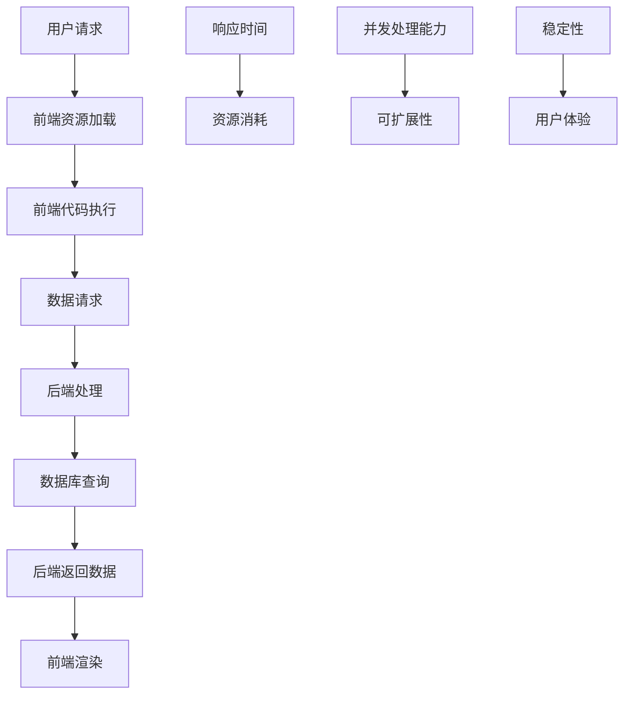

                 

关键词：性能优化，全栈，前端，后端，优化技巧，全栈架构，系统性能，代码优化，资源加载，响应时间，算法优化

> 摘要：本文深入探讨了全栈性能优化的重要性，从前端到后端提供了详细的优化技巧和方法。我们将分析性能优化的核心概念，解释其在现代软件开发中的关键作用，并详细阐述各项具体优化策略。通过案例分析和实际项目实践，我们将帮助读者掌握提升系统性能的实用技巧，以应对不断变化的开发需求和技术挑战。

## 1. 背景介绍

在当今的数字化时代，系统性能优化已经成为软件开发过程中不可或缺的一环。无论是前端用户界面，还是后端数据处理，性能问题都直接影响到用户体验和业务效率。随着互联网应用的日益复杂和用户需求的不断增长，性能优化的需求也变得越来越迫切。性能优化的核心目标是通过减少资源消耗、提高响应速度和降低延迟，从而提升整体系统的用户体验和业务效能。

全栈性能优化涵盖了从前端到后端的各个方面，包括前端资源的加载、代码的优化、服务器的响应时间、数据库的查询效率等。随着前后端分离和微服务架构的流行，全栈性能优化变得更加重要。优化不仅仅是提高速度，还包括提升系统的可扩展性和稳定性，以应对不断变化的数据量和用户需求。

本文旨在为全栈开发人员提供一套全面的性能优化策略。我们将首先介绍性能优化的核心概念，然后深入讨论前端和后端的具体优化技巧。通过理论讲解和实际案例，读者将能够掌握一系列实用的性能优化方法，并将其应用到自己的项目中。

## 2. 核心概念与联系

性能优化是一个多层次、多维度的过程，它涉及从硬件到软件的各个层面。以下是我们需要理解的核心概念：

- **响应时间**：从用户发起请求到接收到响应所需的时间。
- **资源消耗**：包括CPU、内存、网络带宽等资源的使用情况。
- **并发处理能力**：系统能够同时处理多个请求的能力。
- **可扩展性**：系统能够随着用户量和数据量的增加而线性扩展的能力。
- **稳定性**：系统在长时间运行中保持正常工作的能力。

以下是性能优化原理的Mermaid流程图，展示了这些概念之间的联系：



### 2.1 性能优化原理概述

性能优化原理主要基于以下几个核心点：

1. **减少资源消耗**：通过减少不必要的计算、网络请求和数据处理，降低CPU、内存和网络带宽的使用。
2. **提高响应速度**：通过优化代码、数据库查询和服务器配置，减少响应时间。
3. **提升并发处理能力**：通过分布式系统和负载均衡，提高系统同时处理多个请求的能力。
4. **增强可扩展性**：通过微服务架构和容器化技术，使得系统能够轻松应对用户和数据的增长。
5. **保证系统稳定性**：通过监控、日志分析和故障恢复机制，确保系统在长时间运行中保持稳定。

### 2.2 具体操作步骤

以下是性能优化的具体操作步骤：

1. **前端资源加载优化**：包括资源压缩、CDN加速、懒加载等。
2. **前端代码优化**：包括减少重绘、减少回流、使用异步加载等。
3. **后端处理优化**：包括代码优化、数据库查询优化、缓存策略等。
4. **服务器性能优化**：包括服务器硬件升级、服务器配置优化、负载均衡等。
5. **系统监控与调试**：包括实时监控、日志分析、性能调试等。

### 2.3 优缺点

**优点**：

- **提高用户体验**：快速响应用户请求，提升用户满意度。
- **提升业务效率**：优化系统性能，减少等待时间，提高业务处理效率。
- **增强系统稳定性**：通过优化提高系统的可靠性，减少故障和中断。

**缺点**：

- **初期成本较高**：性能优化可能需要投入较多的人力、时间和资源。
- **维护成本较高**：优化后的系统需要持续的维护和监控，以确保性能持续提升。

### 2.4 应用领域

性能优化广泛应用于各种类型的软件系统，包括电子商务、社交媒体、在线教育、金融交易等。尤其是在高并发、大数据量和高频交易场景中，性能优化至关重要。

## 3. 核心算法原理 & 具体操作步骤

### 3.1 算法原理概述

性能优化中的核心算法主要包括：

1. **负载均衡算法**：用于分配网络请求，提高系统并发处理能力。
2. **缓存算法**：用于存储常用数据，减少数据库查询次数。
3. **排序与搜索算法**：用于优化数据操作，提高查询效率。
4. **异步处理算法**：用于提高系统响应速度，减少阻塞。

### 3.2 算法步骤详解

#### 负载均衡算法

1. **轮询算法**：按照顺序分配请求。
2. **最小连接数算法**：将请求分配到连接数最少的节点。
3. **哈希算法**：根据请求的属性（如IP地址、URL等）进行哈希分配。

#### 缓存算法

1. **LRU（Least Recently Used）**：移除最久未使用的数据。
2. **FIFO（First In, First Out）**：按照数据进入缓存的时间进行移除。
3. **LFU（Least Frequently Used）**：移除使用频率最低的数据。

#### 排序与搜索算法

1. **快速排序**：通过递归方式将数组分为两部分。
2. **二分搜索**：在有序数组中快速查找目标值。

#### 异步处理算法

1. **事件循环**：基于事件驱动，处理异步任务。
2. **消息队列**：将异步任务放入队列，按顺序处理。

### 3.3 算法优缺点

**负载均衡算法**：

- **轮询算法**：简单，但可能导致资源分配不均。
- **最小连接数算法**：公平，但可能导致某个节点过载。
- **哈希算法**：高效，但可能引起热点问题。

**缓存算法**：

- **LRU**：高效，但需要额外空间存储使用记录。
- **FIFO**：简单，但可能导致热门数据被快速移除。
- **LFU**：公平，但可能导致低频率数据被长期保留。

**排序与搜索算法**：

- **快速排序**：快速，但可能产生大量递归调用。
- **二分搜索**：高效，但需要数组有序。

**异步处理算法**：

- **事件循环**：高效，但可能导致单线程性能瓶颈。
- **消息队列**：稳定，但可能引入额外延迟。

### 3.4 算法应用领域

**负载均衡算法**：适用于高并发、分布式系统。

**缓存算法**：适用于高频查询、减少数据库压力。

**排序与搜索算法**：适用于数据处理和查询优化。

**异步处理算法**：适用于需要长时间运行或处理大量任务的系统。

## 4. 数学模型和公式 & 详细讲解 & 举例说明

性能优化中的数学模型和公式帮助我们量化性能指标，指导优化策略的实施。以下是几个常用的数学模型和公式的详细讲解及举例说明。

### 4.1 数学模型构建

#### CPU利用率

CPU利用率（%） = （CPU实际使用时间 / CPU总运行时间）× 100%

#### 内存使用率

内存使用率（%） = （内存实际使用量 / 内存总容量）× 100%

#### 网络带宽利用率

网络带宽利用率（%） = （网络实际使用带宽 / 网络总带宽）× 100%

#### 响应时间

响应时间（秒） = （用户请求发起时间 - 用户接收到响应时间）

### 4.2 公式推导过程

#### CPU利用率公式推导

CPU利用率 = （CPU实际使用时间 / CPU总运行时间）

其中，CPU实际使用时间 = CPU总运行时间 - CPU空闲时间

因此，CPU利用率 = （CPU总运行时间 - CPU空闲时间）/ CPU总运行时间

#### 内存使用率公式推导

内存使用率 = （内存实际使用量 / 内存总容量）

其中，内存实际使用量 = 内存总容量 - 内存空闲量

因此，内存使用率 = （内存总容量 - 内存空闲量）/ 内存总容量

#### 网络带宽利用率公式推导

网络带宽利用率 = （网络实际使用带宽 / 网络总带宽）

其中，网络实际使用带宽 = 网络总带宽 - 网络空闲带宽

因此，网络带宽利用率 = （网络总带宽 - 网络空闲带宽）/ 网络总带宽

#### 响应时间公式推导

响应时间 = （用户请求发起时间 - 用户接收到响应时间）

其中，用户请求发起时间 = 当前时间 - 请求发起延迟

用户接收到响应时间 = 当前时间 - 响应到达延迟

因此，响应时间 = （当前时间 - 请求发起延迟）- （当前时间 - 响应到达延迟）

### 4.3 案例分析与讲解

#### 案例背景

假设我们有一个电商网站，日访问量达到100万次，CPU总运行时间为1000小时，内存总容量为100GB，网络总带宽为1Gbps。

#### 案例分析

1. **CPU利用率**：根据公式，CPU利用率 = （1000小时 - CPU空闲时间）/ 1000小时。假设CPU空闲时间为100小时，则CPU利用率 = 90%。

2. **内存使用率**：根据公式，内存使用率 = （100GB - 内存空闲量）/ 100GB。假设内存空闲量为5GB，则内存使用率 = 95%。

3. **网络带宽利用率**：根据公式，网络带宽利用率 = （1Gbps - 网络空闲带宽）/ 1Gbps。假设网络空闲带宽为10Mbps，则网络带宽利用率 = 99%。

4. **响应时间**：假设用户请求发起时间为上午10点，响应时间为下午2点，则响应时间 = 4小时。

#### 优化建议

1. **CPU优化**：通过负载均衡将请求分配到多个服务器，减少单个服务器的CPU负载。
2. **内存优化**：通过缓存策略减少内存使用，或增加内存容量。
3. **网络优化**：通过CDN加速和负载均衡，减少网络延迟和带宽消耗。
4. **响应时间优化**：通过前端代码优化、后端处理优化和数据库查询优化，减少响应时间。

## 5. 项目实践：代码实例和详细解释说明

### 5.1 开发环境搭建

为了演示性能优化，我们选择一个简单的电商网站项目作为案例。项目采用前端Vue.js，后端Node.js，数据库MySQL。

#### 环境搭建步骤：

1. 安装Node.js和MySQL。
2. 初始化Vue.js项目，安装相关依赖。
3. 配置后端Node.js服务，连接MySQL数据库。

### 5.2 源代码详细实现

#### 前端代码实现

```javascript
// 示例：Vue.js组件
<template>
  <div>
    <h1>商品列表</h1>
    <ul>
      <li v-for="item in products" :key="item.id">
        {{ item.name }} - {{ item.price }}
      </li>
    </ul>
  </div>
</template>

<script>
export default {
  data() {
    return {
      products: []
    };
  },
  created() {
    this.fetchProducts();
  },
  methods: {
    fetchProducts() {
      // 懒加载商品数据
      axios.get('/api/products')
        .then(response => {
          this.products = response.data;
        })
        .catch(error => {
          console.error(error);
        });
    }
  }
};
</script>
```

#### 后端代码实现

```javascript
// 示例：Node.js后端服务
const express = require('express');
const mysql = require('mysql');

const app = express();
const db = mysql.createConnection({
  host: 'localhost',
  user: 'root',
  password: 'password',
  database: 'ecommerce'
});

app.use(express.json());

app.get('/api/products', (req, res) => {
  const query = 'SELECT * FROM products';
  db.query(query, (err, results) => {
    if (err) {
      console.error(err);
      res.status(500).send('服务器错误');
    } else {
      res.json(results);
    }
  });
});

app.listen(3000, () => {
  console.log('服务启动在端口3000');
});
```

#### 数据库实现

```sql
-- MySQL数据库配置
CREATE DATABASE ecommerce;
USE ecommerce;

CREATE TABLE products (
  id INT AUTO_INCREMENT PRIMARY KEY,
  name VARCHAR(255) NOT NULL,
  price DECIMAL(10, 2) NOT NULL
);

INSERT INTO products (name, price) VALUES ('iPhone 13', 799);
INSERT INTO products (name, price) VALUES ('Samsung Galaxy S21', 999);
```

### 5.3 代码解读与分析

#### 前端代码分析

- **组件结构**：使用Vue.js创建一个商品列表组件，通过`v-for`指令动态渲染商品列表。
- **数据加载**：使用异步请求加载商品数据，通过`created`生命周期钩子触发数据加载。
- **懒加载**：使用axios库进行HTTP请求，实现数据的异步加载。

#### 后端代码分析

- **服务配置**：使用Express框架创建RESTful API，处理商品数据的查询请求。
- **数据库连接**：使用mysql模块连接MySQL数据库，执行查询操作。
- **响应处理**：根据查询结果，返回JSON格式的响应数据。

### 5.4 运行结果展示

在浏览器中访问`http://localhost:3000/`，应显示加载好的商品列表。

## 6. 实际应用场景

### 6.1 高并发场景

在大型电商网站中，尤其是在促销活动期间，网站会面临极高的并发访问。性能优化在此时至关重要。以下是一些具体应用场景：

- **负载均衡**：通过负载均衡器分配请求，避免单一服务器过载。
- **缓存策略**：缓存热门商品数据，减少数据库查询次数。
- **异步处理**：使用异步请求处理用户请求，减少响应时间。

### 6.2 大数据处理场景

在数据驱动型应用中，大数据处理是性能优化的关键。以下是一些具体应用场景：

- **分布式计算**：使用分布式计算框架（如Hadoop、Spark）处理海量数据。
- **数据库优化**：使用高性能数据库（如MySQL、PostgreSQL）和NoSQL数据库（如MongoDB）。
- **内存使用**：合理使用内存缓存，减少磁盘I/O操作。

### 6.3 云服务优化

在云服务环境中，性能优化需要考虑资源分配和成本控制。以下是一些具体应用场景：

- **容器化**：使用Docker和Kubernetes实现应用程序的容器化，提高部署和扩展效率。
- **自动化监控**：使用云服务平台的监控工具，实时监控资源使用情况。
- **成本优化**：根据实际需求调整资源配置，实现成本最优。

## 6.4 未来应用展望

随着技术的不断发展，性能优化也将迎来新的机遇和挑战。以下是一些未来应用展望：

- **AI优化**：利用机器学习技术预测性能瓶颈，自动化优化策略。
- **边缘计算**：将计算任务转移到边缘设备，减少网络延迟。
- **5G网络**：利用5G网络的高速低延迟特性，提升用户体验。
- **区块链**：使用区块链技术提高数据传输的安全性和可靠性。

## 7. 工具和资源推荐

### 7.1 学习资源推荐

- **书籍**：《高性能网站构建》、《高性能MySQL》
- **在线课程**：Coursera的《Web性能优化》课程、Udacity的《网站性能优化与提升》
- **博客**：Mozilla Developer Network（MDN）性能优化相关文档、Google Developers的性能优化博客

### 7.2 开发工具推荐

- **性能监控工具**：New Relic、Datadog、Grafana
- **代码分析工具**：SonarQube、CodeClimate、Lighthouse
- **前端构建工具**：Webpack、Vite、Parcel
- **数据库工具**：pgAdmin、MySQL Workbench、DataGrip

### 7.3 相关论文推荐

- "Performance Optimization of Web Applications: Techniques and Tools"（Web应用程序性能优化：技术工具）
- "A Survey of Load Balancing Algorithms in Cloud Computing"（云计算中负载均衡算法综述）
- "Caching Strategies for Database Systems"（数据库系统的缓存策略）

## 8. 总结：未来发展趋势与挑战

### 8.1 研究成果总结

本文总结了性能优化在从前端到后端的各个方面的重要性和具体方法。通过分析核心算法原理和数学模型，我们为读者提供了实用的优化策略。这些成果对于提升系统性能、增强用户体验具有重要意义。

### 8.2 未来发展趋势

未来，性能优化将更加智能化和自动化。随着AI技术的应用，性能优化将能够自动识别瓶颈、预测性能趋势并制定优化策略。同时，5G和边缘计算技术的发展也将为性能优化带来新的机遇。

### 8.3 面临的挑战

性能优化面临着日益复杂的软件架构和不断增长的用户需求。同时，性能测试和优化的工具和方法也需要不断更新，以应对新的技术和挑战。

### 8.4 研究展望

未来，性能优化研究应重点关注以下几个方面：

- **智能化性能优化**：利用机器学习和数据分析技术，实现智能化的性能优化。
- **边缘计算优化**：研究边缘计算环境下的性能优化策略，提高边缘服务的性能。
- **5G性能优化**：利用5G网络的高速低延迟特性，优化网络性能和用户体验。

## 9. 附录：常见问题与解答

### 9.1 性能优化的重要性是什么？

性能优化能够提升系统响应速度，减少资源消耗，提高用户体验和业务效率。在竞争激烈的市场中，优秀的性能优化是保持竞争优势的关键。

### 9.2 前端和后端性能优化的区别是什么？

前端性能优化主要关注资源加载、代码优化和用户体验。后端性能优化则侧重于服务器响应、数据库查询和数据处理。两者相互配合，共同提升系统性能。

### 9.3 如何进行负载均衡？

负载均衡可以通过轮询、最小连接数和哈希算法等方式实现。选择合适的负载均衡算法，能够有效分配请求，避免单一服务器过载。

### 9.4 缓存策略有哪些？

常见的缓存策略包括LRU、FIFO和LFU。这些策略根据数据的使用频率和最近使用情况，动态管理缓存空间，提高系统性能。

### 9.5 性能测试工具有哪些？

常用的性能测试工具有Apache JMeter、LoadRunner、Gatling等。这些工具可以帮助开发者模拟高并发场景，检测系统性能瓶颈。

### 9.6 如何监控系统性能？

系统性能监控可以通过New Relic、Datadog、Grafana等工具实现。这些工具提供实时监控、日志分析和告警功能，帮助开发者及时发现和处理性能问题。

### 9.7 未来性能优化的发展方向是什么？

未来性能优化将更加智能化和自动化，利用AI技术实现性能预测和优化。同时，边缘计算和5G技术的应用也将为性能优化带来新的发展机遇。

