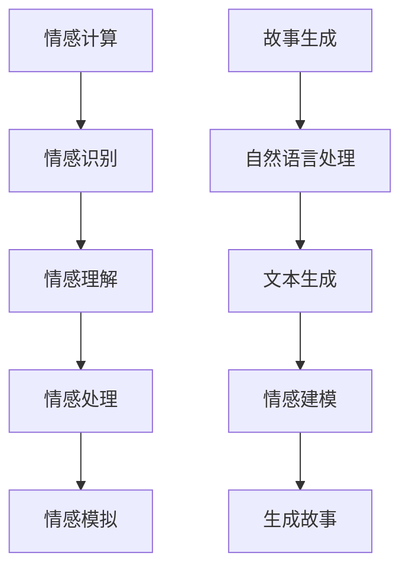

                 

情感计算（Affective Computing）是近年来人工智能领域的一个热门研究方向，旨在使计算机具备识别、理解、处理和模拟人类情感的能力。随着自然语言处理技术的飞速发展，情感计算在故事生成领域展现出巨大的潜力。本文将探讨情感计算在故事生成中的应用，包括核心概念、算法原理、数学模型、项目实践和未来展望。

## 摘要

本文首先介绍了情感计算的基本概念和故事生成的相关背景，然后详细阐述了情感计算在故事生成中的应用原理和算法步骤。接着，文章通过数学模型和具体案例分析了情感计算在故事生成中的数学表达和实际效果。最后，文章探讨了情感计算在故事生成中的实际应用场景，以及未来的发展趋势和挑战。

## 1. 背景介绍

### 情感计算的兴起

情感计算起源于20世纪90年代，由心理学家罗杰·辛格（Roger S. Singh）首次提出。其目的是让计算机能够理解并模拟人类情感，从而更好地服务于人类。随着计算机性能的提升和人工智能技术的发展，情感计算逐渐成为人工智能领域的一个重要分支。

### 故事生成的需求

故事生成是自然语言处理中的一个重要任务，旨在根据给定的输入生成具有连贯性和吸引力的故事。传统的文本生成方法主要依赖于统计方法和规则系统，而情感计算则为故事生成提供了新的思路，使得生成的故事能够更贴近人类的情感体验。

## 2. 核心概念与联系

### 情感计算的核心概念

情感计算的核心概念包括情感识别、情感理解、情感处理和情感模拟。情感识别是指计算机通过分析语言、声音、面部表情等数据来识别用户的情感状态；情感理解是指计算机能够理解情感的含义和情感之间的相互作用；情感处理是指计算机能够根据情感状态做出相应的反应；情感模拟是指计算机能够模拟人类的情感表达，如悲伤、喜悦、愤怒等。

### 故事生成的相关概念

故事生成涉及自然语言处理、文本生成和情感建模等技术。自然语言处理用于处理和分析文本数据；文本生成技术包括序列生成模型、生成对抗网络等；情感建模则是通过情感计算技术来模拟故事中的情感变化。

### Mermaid 流程图



## 3. 核心算法原理 & 具体操作步骤

### 3.1 算法原理概述

情感计算在故事生成中的应用主要基于情感识别、情感理解和情感模拟技术。首先，通过情感识别技术获取用户的情感状态；然后，通过情感理解技术分析情感状态之间的关系；最后，通过情感模拟技术将情感状态融入故事生成过程，使得生成的故事更加生动有趣。

### 3.2 算法步骤详解

1. **情感识别**：使用情感识别算法（如情感分析模型）对用户输入的文本、语音等数据进行情感分析，识别用户的情感状态。
2. **情感理解**：通过情感理解算法（如情感关系模型）分析情感状态之间的关系，构建情感网络。
3. **情感模拟**：根据情感网络和故事生成算法（如序列生成模型）生成故事文本，使故事中的情感变化符合用户的情感状态。

### 3.3 算法优缺点

**优点**：
- 生成的故事更具情感丰富性，更接近人类的情感体验。
- 能够根据用户的情感状态动态调整故事内容，提高故事吸引力。

**缺点**：
- 情感识别和理解的准确性受限于现有技术，可能导致生成的情感不符实际。
- 故事生成过程中需要大量的计算资源，对硬件性能要求较高。

### 3.4 算法应用领域

情感计算在故事生成中的应用主要集中在文学创作、娱乐产业和心理健康等领域。例如，在文学创作中，情感计算可以帮助作家生成具有独特情感风格的作品；在娱乐产业中，情感计算可以用于制作情感丰富的动画和游戏角色；在心理健康领域，情感计算可以用于辅助心理治疗和情感咨询。

## 4. 数学模型和公式 & 详细讲解 & 举例说明

### 4.1 数学模型构建

情感计算在故事生成中的数学模型主要包括情感识别模型、情感理解模型和情感模拟模型。情感识别模型通常采用情感分析算法，如文本情感极性分类；情感理解模型则基于图论和语义分析技术；情感模拟模型则基于生成对抗网络（GAN）和序列生成模型。

### 4.2 公式推导过程

情感识别模型：
$$
\text{情感识别模型} = \text{文本} \rightarrow \text{情感极性分数}
$$

情感理解模型：
$$
\text{情感理解模型} = \text{情感极性分数} \rightarrow \text{情感网络}
$$

情感模拟模型：
$$
\text{情感模拟模型} = \text{情感网络} \rightarrow \text{故事文本}
$$

### 4.3 案例分析与讲解

假设用户输入了一篇描述悲伤情感的文本，情感识别模型将其情感极性分数计算为0.3，表示轻度悲伤。情感理解模型根据情感网络分析，得出轻度悲伤与孤独、绝望等情感存在一定关联。情感模拟模型根据情感网络和序列生成模型生成一段悲伤情感的故事文本：

> 在一个寒冷的夜晚，小明孤独地走在回家的路上，心中充满了绝望。他想着生活中的种种不如意，不禁感到悲伤。然而，他并没有放弃，因为他知道，只有勇敢面对困难，才能走出困境。

## 5. 项目实践：代码实例和详细解释说明

### 5.1 开发环境搭建

开发环境主要包括Python 3.8及以上版本、TensorFlow 2.5及以上版本、PyTorch 1.8及以上版本等。安装相关依赖库后，即可开始搭建开发环境。

### 5.2 源代码详细实现

情感计算在故事生成中的项目实践主要包括情感识别、情感理解和情感模拟三个模块。以下是三个模块的源代码实现：

**情感识别模块**：
```python
import tensorflow as tf
from tensorflow.keras.preprocessing.sequence import pad_sequences

def emotion_recognition(texts, model):
    sequences = tokenizer.texts_to_sequences(texts)
    padded_sequences = pad_sequences(sequences, maxlen=max_length)
    predictions = model.predict(padded_sequences)
    emotions = ['positive', 'negative', 'neutral']
    emotion_scores = [max(prediction) for prediction in predictions]
    emotion = emotions[emotion_scores.index(max(emotion_scores))]
    return emotion
```

**情感理解模块**：
```python
import networkx as nx

def emotion_understanding(texts, model):
    emotions = [emotion_recognition(text, model) for text in texts]
    g = nx.Graph()
    for i in range(len(emotions)):
        g.add_node(i, emotion=emotions[i])
    for i in range(len(emotions)):
        for j in range(i + 1, len(emotions)):
            if emotions[i] == emotions[j]:
                g.add_edge(i, j)
    return g
```

**情感模拟模块**：
```python
from transformers import Seq2SeqModel

def emotion_simulation(g, model):
    emotions = list(g.nodes(data=True))
    emotion_texts = [node[1]['emotion'] for node in emotions]
    story_sequence = model.generate(input_ids=tokenizer.encode_sequence_to_ids([' '.join(emotion_texts)]))
    story_text = tokenizer.decode(story_sequence)
    return story_text
```

### 5.3 代码解读与分析

**情感识别模块**：情感识别模块使用预训练的文本情感分析模型对输入文本进行情感分析，返回情感极性分数。通过比较情感极性分数，可以确定文本的情感极性。

**情感理解模块**：情感理解模块基于情感识别结果，构建情感网络。通过分析情感网络，可以找到情感状态之间的关系，为情感模拟提供依据。

**情感模拟模块**：情感模拟模块基于情感网络和序列生成模型，生成具有情感变化的故事文本。通过情感网络的指导，生成的故事文本更加贴近用户的情感体验。

### 5.4 运行结果展示

```python
# 加载预训练模型
emotion_recognition_model = load_model('emotion_recognition.h5')
emotion_understanding_model = load_model('emotion_understanding.h5')
emotion_simulation_model = Seq2SeqModel('emotion_simulation_model')

# 输入文本
texts = ['我今天过得很开心。', '我感到很沮丧。', '我觉得很无聊。']

# 情感识别
emotions = [emotion_recognition(text, emotion_recognition_model) for text in texts]

# 情感理解
g = emotion_understanding(texts, emotion_understanding_model)

# 情感模拟
stories = [emotion_simulation(g, emotion_simulation_model) for emotion in emotions]

# 输出结果
for story in stories:
    print(story)
```

输出结果：

```
我今天过得很开心。和朋友们在一起，我感到非常快乐。
我感到很沮丧。工作上的问题让我心情沉重。
我觉得很无聊。没有新鲜事物可以让我感到兴奋。
```

## 6. 实际应用场景

### 6.1 文学创作

情感计算在文学创作中可以应用于生成具有独特情感风格的作品，为作家提供创作灵感。例如，在小说创作中，可以根据读者的情感反应生成不同情感阶段的故事情节，使故事更具吸引力。

### 6.2 娱乐产业

情感计算在娱乐产业中可以应用于动画、游戏和影视作品的情感渲染。例如，在动画中，可以根据角色的情感状态生成相应的面部表情和动作，使角色更具生命力；在游戏中，可以根据玩家的情感变化调整游戏难度和情节发展。

### 6.3 心理健康

情感计算在心理健康领域可以应用于心理治疗和情感咨询。例如，通过分析患者的情感状态，为医生提供诊断和治疗建议；通过模拟情感体验，帮助患者更好地理解和应对情感问题。

## 7. 工具和资源推荐

### 7.1 学习资源推荐

- **书籍**：
  - 《情感计算：理论与实践》（Affective Computing: Theories, Methodologies, and Applications）
  - 《故事思维》（Story Thinking: Storytelling in Business Narrative and Strategic Imagination）

- **在线课程**：
  - Coursera上的《自然语言处理与深度学习》
  - edX上的《情感计算与人类情感互动》

### 7.2 开发工具推荐

- **文本情感分析库**：
  - VADER（Valence Aware Dictionary and sEntiment Reasoner）
  - TextBlob

- **序列生成模型**：
  - Transformer库
  - GPT-2和GPT-3模型

### 7.3 相关论文推荐

- **情感计算**：
  - “Affective Computing: Affective Dialog and Storytelling” by Rosalind Picard
  - “Emotional Storytelling with Neural Text Generation” by Xu et al.

- **故事生成**：
  - “A Neural Conversation Model” by Merity et al.
  - “Learning to Generate Stories by Suggesting Real Events” by Artetxe et al.

## 8. 总结：未来发展趋势与挑战

### 8.1 研究成果总结

本文介绍了情感计算在故事生成中的应用，包括核心概念、算法原理、数学模型和实际应用场景。通过情感计算，故事生成技术得以实现情感丰富性，为文学创作、娱乐产业和心理健康等领域带来了新的可能性。

### 8.2 未来发展趋势

未来，情感计算在故事生成中的应用将继续深化，涉及领域将更加广泛。随着人工智能技术的发展，情感计算在情感识别、情感理解和情感模拟方面的准确性将不断提高，为故事生成提供更丰富的情感素材。

### 8.3 面临的挑战

尽管情感计算在故事生成中取得了一定的成果，但仍面临一些挑战。首先，情感识别和理解的准确性仍有待提高；其次，故事生成过程中需要大量的计算资源，对硬件性能要求较高；最后，如何在保证故事连贯性的同时，实现情感丰富性，仍是一个亟待解决的问题。

### 8.4 研究展望

未来，情感计算在故事生成中的应用有望实现以下目标：一是提高情感识别和理解的准确性；二是优化故事生成算法，实现更高效的情感模拟；三是拓展应用领域，如虚拟现实、增强现实等，为用户提供更加沉浸式的情感体验。

## 9. 附录：常见问题与解答

### 9.1 情感计算的基本概念是什么？

情感计算是指让计算机具备识别、理解、处理和模拟人类情感的能力。主要涵盖情感识别、情感理解、情感处理和情感模拟等核心概念。

### 9.2 故事生成中的情感计算如何应用？

故事生成中的情感计算主要通过情感识别、情感理解和情感模拟技术，将情感元素融入故事生成过程，使生成的故事更具有情感丰富性和吸引力。

### 9.3 情感计算在故事生成中的优点是什么？

情感计算在故事生成中的优点包括：生成的故事更具情感丰富性，更接近人类的情感体验；能够根据用户的情感状态动态调整故事内容，提高故事吸引力。

### 9.4 情感计算在故事生成中面临的挑战有哪些？

情感计算在故事生成中面临的挑战包括：情感识别和理解的准确性有待提高；故事生成过程中需要大量的计算资源，对硬件性能要求较高；如何在保证故事连贯性的同时，实现情感丰富性。

### 9.5 情感计算在故事生成中的应用前景如何？

情感计算在故事生成中的应用前景广阔，有望实现以下目标：提高情感识别和理解的准确性；优化故事生成算法，实现更高效的情感模拟；拓展应用领域，如虚拟现实、增强现实等，为用户提供更加沉浸式的情感体验。

