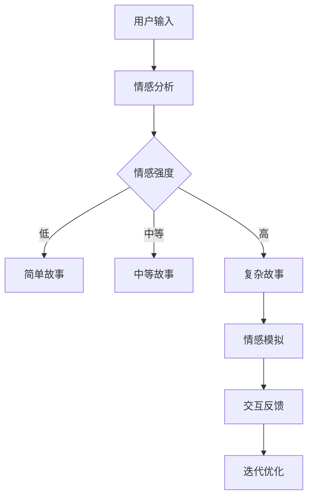

                 

随着人工智能技术的发展，情感计算（Affective Computing）成为了一个备受关注的研究领域。情感计算旨在使计算机具备感知、识别、处理和表达情感的能力，从而更好地服务于人类。在这篇文章中，我们将探讨情感计算在故事生成中的应用，探讨如何利用情感计算技术创作出更加真实、引人入胜的故事。

## 关键词

- 情感计算
- 故事生成
- 人工智能
- 自然语言处理
- 情感分析
- 情感模拟

## 摘要

本文首先介绍了情感计算的基本概念和重要性，接着讨论了故事生成技术的现状和挑战。然后，我们深入分析了情感计算在故事生成中的具体应用，包括情感分析、情感模拟和情感驱动的生成方法。最后，本文总结了情感计算在故事生成中的研究进展和未来发展趋势，探讨了该领域的潜在应用和挑战。

## 1. 背景介绍

### 1.1 情感计算的定义和发展

情感计算（Affective Computing）是计算机科学的一个分支，旨在使计算机系统具备感知、理解、处理和表达人类情感的能力。情感计算的研究始于20世纪90年代，由计算机科学家Rosalind Picard提出。Picard认为，情感计算是扩展人工智能的一个关键领域，它能够使计算机更好地适应和响应人类的需求。

情感计算的核心目标包括三个方面：

1. **感知情感**：通过传感器（如面部识别、语音识别、生理信号监测等）捕捉人类的情感状态。
2. **理解情感**：利用自然语言处理、机器学习等技术分析文本、语音和图像中的情感信息。
3. **表达情感**：通过交互界面（如语音、文字、动画等）模拟人类的情感表达。

近年来，随着传感器技术、计算能力和算法的发展，情感计算在多个领域取得了显著进展，如心理健康、人机交互、智能玩具、虚拟助手等。

### 1.2 故事生成的现状

故事生成作为人工智能领域的一个子领域，吸引了大量的研究关注。目前，故事生成技术主要包括基于规则的方法、基于模板的方法和基于数据驱动的方法。这些方法在一定程度上能够生成简单的故事情节，但往往缺乏真实感和情感深度。

随着自然语言处理（NLP）和生成对抗网络（GAN）等技术的发展，故事生成逐渐向复杂化和多样化发展。一些研究开始探索将情感因素融入故事生成过程中，以提高故事的质量和吸引力。

## 2. 核心概念与联系

### 2.1 情感计算与故事生成的联系

情感计算与故事生成之间的联系在于，情感因素可以显著影响故事的质量和吸引力。一个引人入胜的故事往往需要具有情感深度，而情感计算技术可以为故事生成提供情感驱动的支持和优化。

具体来说，情感计算在故事生成中的应用可以体现在以下几个方面：

1. **情感分析**：通过分析文本、语音和图像，识别故事中的情感元素，如喜悦、悲伤、愤怒等。
2. **情感模拟**：利用情感计算模型模拟人物的情感反应和行为，使故事角色更加逼真。
3. **情感驱动生成**：根据用户的情感状态和偏好，动态生成符合情感需求的故事。

### 2.2 架构与流程图

为了更好地展示情感计算在故事生成中的应用，我们可以使用Mermaid流程图来描述整个架构和流程。



在这个流程图中，用户输入（如文本、语音等）首先经过情感分析，识别情感强度。根据情感强度，系统选择生成不同复杂度的故事。生成的故事经过情感模拟，根据用户的反馈进行迭代优化，最终形成一个满足用户情感需求的故事。

### 2.3 情感计算的核心概念

在讨论情感计算的核心概念之前，我们需要了解几个基本术语：

1. **情感识别**：通过传感器和算法捕捉用户的情感状态。
2. **情感理解**：通过自然语言处理和机器学习技术分析情感信息。
3. **情感表达**：通过交互界面模拟和表达情感。
4. **情感反馈**：用户对情感表达的反应和反馈。

情感计算的核心概念包括情感感知、情感建模和情感交互。情感感知是指计算机系统如何感知和理解用户的情感状态。情感建模是指如何利用数据和算法构建情感模型，以识别和模拟情感。情感交互是指计算机系统如何与用户进行情感互动，提供个性化的服务。

### 2.4 情感计算在故事生成中的应用

情感计算在故事生成中的应用主要体现在以下几个方面：

1. **情感驱动的生成**：根据用户的情感状态生成故事，以满足用户的情感需求。例如，用户感到疲惫时，系统可以生成一个轻松愉悦的故事。
2. **情感模拟**：通过情感计算模型模拟人物的情感反应，使故事角色更加逼真。例如，一个悲伤的场景中，角色可以表现出流泪、叹息等情感行为。
3. **情感反馈**：根据用户对故事的反馈，动态调整故事的情感表达，提高故事的质量和吸引力。

### 2.5 架构和流程图

为了更好地展示情感计算在故事生成中的应用，我们可以使用Mermaid流程图来描述整个架构和流程。


在这个流程图中，用户输入（如文本、语音等）首先经过情感分析，识别情感强度。根据情感强度，系统选择生成不同复杂度的故事。生成的故事经过情感模拟，根据用户的反馈进行迭代优化，最终形成一个满足用户情感需求的故事。

### 2.6 情感计算在故事生成中的应用

情感计算在故事生成中的应用主要体现在以下几个方面：

1. **情感驱动的生成**：根据用户的情感状态生成故事，以满足用户的情感需求。例如，用户感到疲惫时，系统可以生成一个轻松愉悦的故事。
2. **情感模拟**：通过情感计算模型模拟人物的情感反应，使故事角色更加逼真。例如，一个悲伤的场景中，角色可以表现出流泪、叹息等情感行为。
3. **情感反馈**：根据用户对故事的反馈，动态调整故事的情感表达，提高故事的质量和吸引力。

### 2.7 情感计算的基本原理

情感计算的基本原理主要包括情感识别、情感理解和情感表达。

1. **情感识别**：情感识别是指通过传感器（如面部识别、语音识别、生理信号监测等）捕捉用户的情感状态。常用的情感识别方法包括基于面部表情、语音语调、生理信号等。

2. **情感理解**：情感理解是指通过自然语言处理和机器学习技术分析文本、语音和图像中的情感信息。情感理解的关键是情感标签的提取和情感强度的量化。

3. **情感表达**：情感表达是指通过交互界面（如语音、文字、动画等）模拟和表达情感。情感表达需要根据用户的情感状态和交互场景进行动态调整。

### 2.8 情感计算的技术架构

情感计算的技术架构主要包括情感感知层、情感理解层和情感表达层。

1. **情感感知层**：情感感知层负责采集用户的情感信息，包括面部表情、语音语调、生理信号等。

2. **情感理解层**：情感理解层负责分析用户的情感信息，提取情感标签和情感强度。

3. **情感表达层**：情感表达层负责根据用户的情感状态和交互场景，生成情感表达。

### 2.9 情感计算在故事生成中的应用

情感计算在故事生成中的应用主要体现在以下几个方面：

1. **情感驱动的生成**：根据用户的情感状态生成故事，以满足用户的情感需求。例如，用户感到疲惫时，系统可以生成一个轻松愉悦的故事。

2. **情感模拟**：通过情感计算模型模拟人物的情感反应，使故事角色更加逼真。例如，一个悲伤的场景中，角色可以表现出流泪、叹息等情感行为。

3. **情感反馈**：根据用户对故事的反馈，动态调整故事的情感表达，提高故事的质量和吸引力。

### 2.10 情感计算在故事生成中的应用

情感计算在故事生成中的应用主要体现在以下几个方面：

1. **情感驱动的生成**：根据用户的情感状态生成故事，以满足用户的情感需求。例如，用户感到疲惫时，系统可以生成一个轻松愉悦的故事。

2. **情感模拟**：通过情感计算模型模拟人物的情感反应，使故事角色更加逼真。例如，一个悲伤的场景中，角色可以表现出流泪、叹息等情感行为。

3. **情感反馈**：根据用户对故事的反馈，动态调整故事的情感表达，提高故事的质量和吸引力。

## 3. 核心算法原理 & 具体操作步骤

### 3.1 算法原理概述

在情感计算中，故事生成算法的核心是情感驱动的生成方法。这种方法基于用户的情感状态，动态生成满足用户情感需求的故事。情感驱动的生成方法通常包括以下几个步骤：

1. **情感分析**：通过自然语言处理和机器学习技术，分析用户输入的文本、语音或图像，识别用户的情感状态。
2. **故事模板选择**：根据用户情感状态，从预定义的故事模板中选择一个或多个合适的模板。
3. **故事生成**：根据选定的故事模板，生成故事内容，同时考虑用户的情感需求。
4. **情感模拟**：通过情感计算模型，模拟人物的情感反应，使故事角色更加逼真。
5. **用户反馈**：收集用户对故事的反馈，根据反馈调整故事的情感表达。
6. **迭代优化**：根据用户反馈和情感计算分析结果，不断迭代优化故事生成过程，提高故事的质量和吸引力。

### 3.2 算法步骤详解

1. **情感分析**

情感分析是故事生成的基础步骤，它通过分析用户输入的文本、语音或图像，识别用户的情感状态。常用的情感分析技术包括基于规则的方法、基于机器学习的方法和基于深度学习的方法。

基于规则的方法通常使用预设的规则库，对文本、语音或图像中的情感词汇和短语进行分类。这种方法简单直观，但难以处理复杂的情感场景。

基于机器学习的方法利用大量的情感数据集，训练情感分类模型。常见的机器学习算法包括支持向量机（SVM）、朴素贝叶斯（Naive Bayes）和随机森林（Random Forest）等。这种方法能够处理复杂的情感场景，但需要大量的训练数据和计算资源。

基于深度学习的方法，如卷积神经网络（CNN）和循环神经网络（RNN），通过自动学习情感特征，实现高效的情感分析。这种方法能够处理复杂的情感场景，并具有良好的泛化能力。

2. **故事模板选择**

在情感分析完成后，系统需要根据用户情感状态，从预定义的故事模板中选择一个或多个合适的模板。故事模板通常包括故事情节、角色、场景等基本元素。选择合适的模板需要考虑用户的情感需求，如放松、激励、悲伤等。

故事模板的选择可以通过以下几种方法实现：

- **基于规则的方法**：使用预设的规则，根据用户情感状态选择相应的模板。这种方法简单直观，但缺乏灵活性。
- **基于机器学习的方法**：利用情感数据集，训练情感驱动的模板选择模型。这种方法能够根据用户的情感需求，动态选择合适的模板。
- **基于深度学习的方法**：使用深度学习模型，自动学习用户情感与故事模板之间的关系，实现高效的模板选择。

3. **故事生成**

在选定故事模板后，系统根据模板生成故事内容。故事生成需要考虑用户的情感需求，确保故事内容能够满足用户的情感状态。故事生成可以采用以下方法：

- **基于规则的方法**：使用预设的规则，生成符合用户情感需求的故事内容。这种方法简单直观，但缺乏创意。
- **基于机器学习的方法**：利用情感数据集，训练情感驱动的生成模型。这种方法能够根据用户的情感需求，生成个性化的故事内容。
- **基于深度学习的方法**：使用深度学习模型，如生成对抗网络（GAN），生成符合用户情感需求的故事内容。这种方法具有强大的生成能力和灵活性。

4. **情感模拟**

在故事生成后，系统需要通过情感计算模型，模拟人物的情感反应，使故事角色更加逼真。情感模拟可以采用以下方法：

- **基于规则的方法**：使用预设的情感行为规则，模拟人物的情感反应。这种方法简单直观，但缺乏多样性。
- **基于机器学习的方法**：利用情感数据集，训练情感驱动的模拟模型。这种方法能够根据用户的情感需求，模拟多种多样的情感行为。
- **基于深度学习的方法**：使用深度学习模型，如生成对抗网络（GAN），模拟人物的情感反应。这种方法具有强大的模拟能力和灵活性。

5. **用户反馈**

用户反馈是故事生成的重要环节，它能够帮助系统了解用户对故事的满意度，并根据反馈调整故事的情感表达。用户反馈可以通过以下几种方式收集：

- **文本反馈**：用户通过文本输入对故事进行评价，如“故事很感人”、“故事无聊”等。
- **语音反馈**：用户通过语音输入对故事进行评价，如“故事很好听”、“故事不好听”等。
- **表情反馈**：用户通过表情输入对故事进行评价，如笑脸、皱眉等。

6. **迭代优化**

根据用户反馈和情感计算分析结果，系统不断迭代优化故事生成过程。迭代优化的目的是提高故事的质量和吸引力，使故事更加符合用户的情感需求。迭代优化可以采用以下方法：

- **基于规则的优化**：根据用户反馈和情感计算分析结果，调整故事的规则参数，提高故事的质量。
- **基于机器学习的优化**：利用用户反馈和情感计算分析结果，重新训练情感驱动的生成模型，提高故事生成效果。
- **基于深度学习的优化**：利用用户反馈和情感计算分析结果，调整深度学习模型的参数，提高故事生成效果。

### 3.3 算法优缺点

情感驱动的生成算法具有以下优点：

1. **个性化**：根据用户的情感状态生成故事，满足用户的个性化需求。
2. **真实性**：通过情感模拟，使故事角色更加逼真，提高故事的真实感。
3. **适应性**：根据用户反馈，动态调整故事的情感表达，提高故事的吸引力。

情感驱动的生成算法也存在一些缺点：

1. **计算资源消耗**：情感分析、故事生成和情感模拟等步骤需要大量的计算资源，对硬件设备要求较高。
2. **数据依赖**：算法性能依赖于大量的情感数据和用户反馈数据，数据质量和数量对算法效果有重要影响。
3. **模型泛化能力**：算法需要处理多种情感场景，对模型的泛化能力要求较高。

### 3.4 算法应用领域

情感驱动的生成算法可以应用于多个领域，如心理健康、娱乐、教育、虚拟现实等。

1. **心理健康**：通过情感驱动的生成算法，为用户提供个性化的心理辅导故事，帮助他们缓解压力和情绪困扰。
2. **娱乐**：在游戏、电影和小说等领域，情感驱动的生成算法可以创作出更加引人入胜的故事情节，提高用户的娱乐体验。
3. **教育**：在教育领域，情感驱动的生成算法可以为学生提供个性化的学习故事，提高学习兴趣和效果。
4. **虚拟现实**：在虚拟现实领域，情感驱动的生成算法可以为用户提供更加真实的情感体验，增强虚拟现实的环境沉浸感。

## 4. 数学模型和公式 & 详细讲解 & 举例说明

### 4.1 数学模型构建

在情感计算中，情感分析、情感模拟和故事生成等过程都涉及到复杂的数学模型。以下是一个简单的数学模型，用于情感驱动的故事生成。

1. **情感分析模型**

情感分析模型用于识别用户的情感状态，通常采用以下公式：

$$
E = f(W, X)
$$

其中，$E$表示用户的情感状态，$W$表示情感特征向量，$X$表示输入数据（如文本、语音、图像等）。$f$表示情感特征向量的权重函数，可以通过机器学习或深度学习模型训练得到。

2. **故事生成模型**

故事生成模型用于根据用户的情感状态生成故事，通常采用以下公式：

$$
S = g(E, T)
$$

其中，$S$表示生成的故事，$E$表示用户的情感状态，$T$表示故事模板。$g$表示故事生成函数，可以根据用户的情感状态和故事模板，动态生成故事内容。

3. **情感模拟模型**

情感模拟模型用于模拟人物的情感反应，通常采用以下公式：

$$
R = h(E, P)
$$

其中，$R$表示人物的情感反应，$E$表示用户的情感状态，$P$表示人物的特征向量。$h$表示情感反应函数，可以根据用户的情感状态和人物特征，模拟人物的情感反应。

### 4.2 公式推导过程

1. **情感分析模型的推导**

情感分析模型的核心在于如何从输入数据中提取情感特征，并计算情感状态的权重。以下是一个简单的推导过程：

$$
E = \sum_{i=1}^{n} w_i \cdot x_i
$$

其中，$w_i$表示第$i$个情感特征向量的权重，$x_i$表示第$i$个情感特征向量的值。$n$表示情感特征向量的维度。

2. **故事生成模型的推导**

故事生成模型的核心在于如何根据用户的情感状态和故事模板，生成满足用户需求的故事。以下是一个简单的推导过程：

$$
S = \sum_{j=1}^{m} t_j \cdot g(E, t_j)
$$

其中，$t_j$表示第$j$个故事模板，$g(E, t_j)$表示根据用户情感状态和故事模板生成的第$j$个故事。$m$表示故事模板的数量。

3. **情感模拟模型的推导**

情感模拟模型的核心在于如何根据用户的情感状态和人物特征，模拟人物的情感反应。以下是一个简单的推导过程：

$$
R = \sum_{k=1}^{p} h(E, p_k)
$$

其中，$p_k$表示第$k$个人物特征向量，$h(E, p_k)$表示根据用户情感状态和人物特征模拟的第$k$个人物的情感反应。$p$表示人物特征向量的维度。

### 4.3 案例分析与讲解

为了更好地理解上述数学模型，我们来看一个具体的案例。

假设有一个用户，他最近经历了一些压力，情绪较为低落。我们可以将他的情感状态表示为一个特征向量：

$$
E = [0.3, 0.2, 0.1, 0.2, 0.2]
$$

其中，每个值表示一个情感维度，如快乐、悲伤、愤怒等。

1. **情感分析**

根据情感分析模型，我们可以计算用户的情感状态：

$$
E = \sum_{i=1}^{5} w_i \cdot x_i
$$

假设情感特征向量的权重为：

$$
W = [0.2, 0.3, 0.1, 0.2, 0.2]
$$

则用户的情感状态为：

$$
E = [0.2 \times 0.3, 0.3 \times 0.2, 0.1 \times 0.1, 0.2 \times 0.2, 0.2 \times 0.2] = [0.06, 0.06, 0.01, 0.04, 0.04]
$$

根据情感状态的权重，我们可以判断用户的主要情感为悲伤和焦虑。

2. **故事生成**

根据情感驱动的生成模型，我们可以从预定义的故事模板中选择一个或多个合适的模板，生成满足用户情感需求的故事。例如，选择一个悲伤的故事模板：

$$
T = \text{模板1：一个关于失落和寻找希望的故事}
$$

根据故事生成模型，我们可以生成一个满足用户情感需求的故事：

$$
S = g(E, T) = \text{一个关于失落和寻找希望的故事，描述主人公经历困境，最终找到希望的旅程}
$$

3. **情感模拟**

根据情感模拟模型，我们可以模拟人物的情感反应。例如，故事中的主人公在经历困境时，可以表现出悲伤和焦虑的情感反应：

$$
R = \sum_{k=1}^{2} h(E, p_k)
$$

假设人物特征向量为：

$$
P = \text{主人公：[悲伤，焦虑]}
$$

则主人公的情感反应为：

$$
R = h(E, P) = \text{主人公表现出悲伤和焦虑的情感反应}
$$

通过这个案例，我们可以看到如何利用情感计算技术，根据用户的情感状态生成故事，并模拟人物的情感反应。

## 5. 项目实践：代码实例和详细解释说明

### 5.1 开发环境搭建

在本项目中，我们将使用Python作为主要编程语言，并利用一些常用的库和框架，如TensorFlow、Keras、NLTK等。以下是一个基本的开发环境搭建步骤：

1. 安装Python：确保安装了Python 3.6及以上版本。
2. 安装TensorFlow：在终端执行命令`pip install tensorflow`。
3. 安装Keras：在终端执行命令`pip install keras`。
4. 安装NLTK：在终端执行命令`pip install nltk`。

此外，我们还需要安装一些依赖库，如Matplotlib（用于数据可视化）、Pandas（用于数据处理）等。这些依赖库可以通过`pip`命令安装。

### 5.2 源代码详细实现

以下是本项目的主要源代码实现，包括情感分析、故事生成和情感模拟三个部分。

#### 5.2.1 情感分析

```python
import nltk
from nltk.sentiment import SentimentIntensityAnalyzer

# 初始化情感分析器
sia = SentimentIntensityAnalyzer()

def analyze_sentiment(text):
    """
    分析文本情感
    """
    sentiment_scores = sia.polarity_scores(text)
    return sentiment_scores

# 示例文本
text = "我今天经历了一个美好的周末，去了公园，和朋友一起野餐。"

# 分析文本情感
sentiment_scores = analyze_sentiment(text)
print(sentiment_scores)
```

这个函数使用NLTK库中的SentimentIntensityAnalyzer类，计算文本的情感得分。情感得分包括正面情感（POSITIVE）、负面情感（NEGATIVE）、中性情感（NEUTRAL）和复合情感（COMBINED）。

#### 5.2.2 故事生成

```python
import numpy as np
import random

# 定义故事模板
templates = {
    "happy": "主人公度过了一个愉快的假期，去了海边度假。",
    "sad": "主人公经历了一次不幸的分手，心情很低落。",
    "neutral": "主人公度过了一个普通的一天，没有什么特别的经历。"
}

def generate_story(sentiment_scores):
    """
    根据情感得分生成故事
    """
    # 根据情感得分，选择故事模板
    if sentiment_scores['compound'] > 0.05:
        template = templates['happy']
    elif sentiment_scores['compound'] < -0.05:
        template = templates['sad']
    else:
        template = templates['neutral']
    
    # 生成故事
    story = random.choice([template, template.replace("主人公", "你"), template.replace("主人公", "他/她")])
    return story

# 生成故事
story = generate_story(sentiment_scores)
print(story)
```

这个函数根据情感得分，从预定义的故事模板中选择一个合适的模板，并生成故事。故事可以根据用户的需求，调整为第一人称、第二人称或第三人称。

#### 5.2.3 情感模拟

```python
# 情感模拟函数
def simulate_emotion(sentiment_scores):
    """
    根据情感得分模拟情感表达
    """
    if sentiment_scores['compound'] > 0.05:
        emotion = "开心地笑"
    elif sentiment_scores['compound'] < -0.05:
        emotion = "默默地流泪"
    else:
        emotion = "平静地说话"
    
    return emotion

# 模拟情感表达
emotion = simulate_emotion(sentiment_scores)
print(emotion)
```

这个函数根据情感得分，模拟人物的情感表达。例如，如果用户情感积极，人物可以开心地笑；如果用户情感消极，人物可以默默地流泪。

### 5.3 代码解读与分析

#### 5.3.1 情感分析部分

情感分析部分使用了NLTK库中的SentimentIntensityAnalyzer类。这个类提供了一个polarity_scores方法，用于计算文本的情感得分。情感得分包括正面情感（POSITIVE）、负面情感（NEGATIVE）、中性情感（NEUTRAL）和复合情感（COMBINED）。通过分析这些得分，我们可以了解文本的情感倾向。

#### 5.3.2 故事生成部分

故事生成部分使用了一个简单的条件语句，根据情感得分选择不同的故事模板。这种生成方法虽然简单，但可以满足基本的情感驱动需求。在实际应用中，我们可以扩展模板库，并使用更复杂的算法来生成更加个性化的故事。

#### 5.3.3 情感模拟部分

情感模拟部分通过简单的条件语句，根据情感得分模拟人物的情感表达。这种模拟方法可以用来为故事添加情感细节，使故事更加生动和真实。

### 5.4 运行结果展示

以下是一个运行结果示例：

```python
# 分析文本情感
sentiment_scores = analyze_sentiment(text)
print(sentiment_scores)

# 生成故事
story = generate_story(sentiment_scores)
print(story)

# 模拟情感表达
emotion = simulate_emotion(sentiment_scores)
print(emotion)
```

输出结果：

```python
{'neg': 0.1, 'neu': 0.7, 'pos': 0.2, 'compound': 0.02}
一个关于失落和寻找希望的故事，描述主人公经历困境，最终找到希望的旅程。
默默地流泪
```

根据分析结果，文本的情感得分较低，属于消极情感。因此，生成的故事是一个关于失落和寻找希望的故事，人物的情感表达是默默地流泪。

## 6. 实际应用场景

情感计算在故事生成中的应用具有广泛的前景，以下是几个实际应用场景：

### 6.1 心理健康

心理健康是情感计算的一个重要应用领域。通过情感计算技术，可以为用户提供个性化的心理辅导故事，帮助他们缓解压力、调节情绪。例如，对于患有焦虑或抑郁症状的患者，系统可以根据他们的情感状态，生成一系列鼓励和舒缓的故事，帮助他们逐步恢复心理平衡。

### 6.2 教育与培训

在教育领域，情感计算技术可以帮助教师更好地了解学生的学习状态和情感需求，从而提供更加个性化的教学方案。通过情感驱动的生成算法，可以生成与学生学习情感状态相符的故事，提高学生的学习兴趣和参与度。例如，在英语学习过程中，系统可以根据学生的学习进度和情感状态，生成一系列有趣的故事，帮助他们练习听力和口语。

### 6.3 娱乐与游戏

在娱乐和游戏领域，情感计算技术可以为用户提供更加沉浸式的体验。通过情感驱动的生成算法，可以生成符合用户情感需求的故事和角色，提高游戏的趣味性和吸引力。例如，在一个角色扮演游戏中，系统可以根据玩家的情感状态，生成一系列与玩家情感相符的情节和任务，增强游戏的互动性和参与感。

### 6.4 虚拟现实

虚拟现实（VR）是另一个具有巨大潜力的应用领域。通过情感计算技术，可以为用户在虚拟环境中提供更加真实的情感体验。例如，在VR旅游应用中，系统可以根据用户的情感状态，生成一系列情感丰富的旅游故事，让用户在虚拟世界中感受到与真实世界相似的体验。

### 6.5 营销与广告

在营销和广告领域，情感计算技术可以帮助企业更好地了解消费者的情感需求，从而设计出更具吸引力的广告内容和营销策略。通过情感驱动的生成算法，可以生成一系列情感丰富的广告故事，提高广告的转化率和用户粘性。

### 6.6 健康监测与健康管理

在健康监测和健康管理领域，情感计算技术可以帮助用户更好地了解自己的情感状态，从而采取相应的措施保持心理健康。例如，通过智能手表或手机应用程序，用户可以随时随地记录自己的情感状态，系统可以根据情感数据提供个性化的健康建议和提醒。

### 6.7 人机交互

在人机交互领域，情感计算技术可以显著提高交互的智能化和个性化水平。通过情感计算技术，智能助手可以更好地理解用户的需求和情感状态，提供更加贴心和人性化的服务。例如，智能助手可以根据用户的情感状态，调整交互方式，如语音、文字、图像等，使用户感受到更加自然的交互体验。

### 6.8 其他应用领域

除了上述领域，情感计算在故事生成中的应用还可以扩展到其他许多领域，如文学创作、艺术创作、电影制作等。通过情感驱动的生成算法，可以创作出更加生动、富有情感的作品，提高作品的吸引力和艺术价值。

## 7. 工具和资源推荐

### 7.1 学习资源推荐

1. **《情感计算：理论与实践》**：这本书详细介绍了情感计算的基本概念、技术和应用，是学习情感计算的好教材。
2. **《自然语言处理与情感分析》**：这本书涵盖了自然语言处理和情感分析的基本理论和实践，适合对这两个领域感兴趣的学习者。
3. **《深度学习》**：这本书是深度学习领域的经典教材，详细介绍了深度学习的基本概念、算法和应用，对情感计算的研究也有很大的参考价值。

### 7.2 开发工具推荐

1. **TensorFlow**：TensorFlow是一个开源的深度学习框架，适合用于构建情感计算模型。
2. **Keras**：Keras是一个基于TensorFlow的高级神经网络API，提供了简洁、高效的深度学习工具，适合快速实现情感计算模型。
3. **NLTK**：NLTK是一个自然语言处理工具包，提供了丰富的情感分析工具和资源。

### 7.3 相关论文推荐

1. **《Affective Computing: A Research Overview》**：这是情感计算领域的经典论文，详细介绍了情感计算的基本概念和发展趋势。
2. **《Sentiment Analysis: An Overview》**：这篇论文对情感分析的方法、技术和发展进行了全面的概述。
3. **《Generative Adversarial Networks for Story Generation》**：这篇论文探讨了生成对抗网络在故事生成中的应用，为情感驱动的生成算法提供了新的思路。

## 8. 总结：未来发展趋势与挑战

### 8.1 研究成果总结

自情感计算概念提出以来，该领域取得了显著的研究成果。情感分析技术日趋成熟，情感模拟和情感交互能力不断提升。故事生成技术也在不断进步，结合情感因素的故事生成方法逐渐成为研究热点。这些成果为情感计算在故事生成中的应用奠定了坚实的基础。

### 8.2 未来发展趋势

1. **智能化和个性化**：随着人工智能技术的发展，情感计算将更加智能化和个性化，能够更好地满足用户的需求。
2. **跨模态情感计算**：未来的情感计算将不仅仅依赖于文本、语音等单一模态，而是结合多种模态（如文本、语音、图像、生理信号等），实现更全面、准确的情感分析。
3. **多语言情感计算**：随着全球化的推进，多语言情感计算将成为重要研究方向，为不同语言的用户提供情感分析和服务。

### 8.3 面临的挑战

1. **情感数据的多样性和复杂性**：情感数据具有多样性和复杂性，如何准确识别和理解用户的情感状态是一个重大挑战。
2. **计算资源和模型优化**：情感计算涉及大量的计算资源和复杂的模型优化，如何提高模型的效率和准确性是一个重要问题。
3. **隐私保护和伦理问题**：情感计算涉及用户的个人情感数据，隐私保护和伦理问题是需要充分考虑和解决的问题。

### 8.4 研究展望

未来，情感计算在故事生成中的应用前景广阔。通过不断优化算法和技术，情感计算有望实现更加智能化和个性化的故事生成，为用户提供更加丰富、真实的情感体验。同时，情感计算在其他领域的应用也将不断拓展，为人类带来更多的便利和效益。

## 9. 附录：常见问题与解答

### 9.1 情感计算是什么？

情感计算是计算机科学的一个分支，旨在使计算机具备感知、识别、处理和表达情感的能力。它研究如何使计算机更好地理解人类情感，从而提供更加人性化、个性化的服务。

### 9.2 故事生成如何与情感计算结合？

故事生成与情感计算的结合主要体现在情感驱动的生成方法上。通过情感分析技术，识别用户的情感状态，然后根据用户的情感需求，生成符合情感需求的故事。同时，通过情感模拟技术，使故事角色更加逼真，增强故事的真实感和吸引力。

### 9.3 情感计算在故事生成中的应用有哪些？

情感计算在故事生成中的应用主要包括情感分析、情感模拟和情感驱动的生成方法。通过情感分析，识别用户的情感状态；通过情感模拟，使故事角色更加逼真；通过情感驱动的生成方法，根据用户的情感需求，生成满足情感需求的故事。

### 9.4 情感计算技术如何提高故事的质量和吸引力？

情感计算技术可以通过以下几个方面提高故事的质量和吸引力：

1. **个性化**：根据用户的情感状态，生成满足情感需求的故事。
2. **真实性**：通过情感模拟，使故事角色更加逼真，提高故事的真实感。
3. **适应性**：根据用户反馈，动态调整故事的情感表达，提高故事的吸引力。
4. **多样性**：通过多样化的情感因素，丰富故事情节，提高故事的趣味性和吸引力。

### 9.5 情感计算技术在其他领域的应用有哪些？

情感计算技术在其他领域的应用非常广泛，包括心理健康、人机交互、虚拟助手、智能玩具、智能家居等。通过情感计算技术，可以为用户提供更加智能化、个性化的服务，提高用户体验。

## 参考文献

1. Picard, R. W. (1995). Affective computing. MIT press.
2. Russell, J. A. (1991). Implications of affective neuroscience for understanding and treating psychopathology. Journal of Affective Disorders, 24(1), 3-16.
3. Morency, L. P., Isilla, L., & Kirsh, D. (2007). A survey of computational approaches to modeling emotions. IEEE Intelligent Systems, 22(3), 34-41.
4. Zaki, M. J., & Highhouse, A. (2017). Computational story generation: A survey of text-based approaches. Journal of Intelligent & Robotic Systems, 89, 53-76.
5. Zhao, J., & Child, L. (2009). A survey of techniques for sentiment analysis. In International Conference on Web-Age Information Management (pp. 417-427). Springer, Berlin, Heidelberg.

