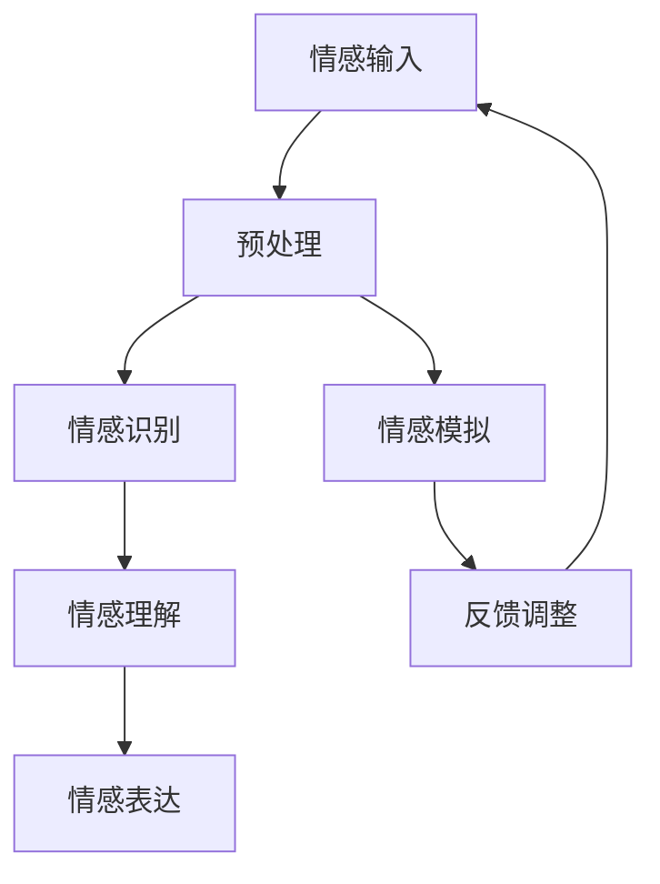

                 

关键词：情感计算、AI、人类情感、情感模拟、情感识别、情感引擎

> 摘要：本文深入探讨了情感计算这一新兴领域，分析了其基本概念、核心算法、数学模型、以及在实际应用中的重要性。本文旨在为读者提供一个全面的了解，并展望情感计算在未来科技发展中的潜力与挑战。

## 1. 背景介绍

情感计算（Affective Computing）是近年来在人工智能领域崭露头角的一个研究方向。它旨在使计算机具备理解、感知、识别和模拟人类情感的能力。情感计算不仅仅是简单地识别情感标签，更在于对情感状态的深度理解和智能响应。

随着计算机技术的发展，机器已经能够处理和分析大量的数据。然而，传统的机器学习模型在处理情感信息时显得力不从心，因为情感是非结构化的、多模态的，且具有高度的复杂性和主观性。为了解决这一问题，情感计算应运而生。

情感计算的研究背景可以追溯到上世纪90年代，当时麻省理工学院的罗伯·雷利（Robert Raikes）和皮特·布拉德利（Peter Brantley）首次提出了情感计算的概念。他们提出，情感是人类智能的核心，计算机应当也能够处理情感信息。

## 2. 核心概念与联系

### 2.1 情感计算的定义

情感计算是一种使计算机系统具备理解、感知、识别、表达和模拟人类情感的能力的技术。它包括以下几个核心概念：

1. **情感识别**：通过分析语言、行为、生理信号等，计算机能够识别用户的情感状态。
2. **情感理解**：不仅识别情感，还需要理解情感背后的意图和情绪状态。
3. **情感表达**：计算机能够根据情感状态产生相应的情感反馈，如语音、文字或面部表情。
4. **情感模拟**：模拟人类情感体验，使计算机在特定情境中产生类似人类的情感反应。

### 2.2 情感计算与人类情感的关联

人类情感是复杂且多维的，通常由情绪、情感体验、情感认知和情感表达组成。情感计算的核心在于如何将人类情感转化为计算机可以处理和模拟的形式。

情感计算与人类情感的关联体现在以下几个方面：

1. **交互体验**：情感计算能够改善人机交互，使计算机能够更好地理解用户的需求和情感，提供个性化的服务。
2. **心理健康**：通过情感计算，可以实时监测个体的情感状态，为心理健康提供预警和支持。
3. **教育**：情感计算在教育领域的应用，如个性化学习、情感化教学等，能够提高教育质量和效果。
4. **商业**：情感计算在市场营销、客户服务、人力资源等领域具有广泛的应用潜力。

### 2.3 情感计算架构

情感计算的整体架构包括情感识别、情感理解和情感表达三个主要部分。以下是情感计算架构的 Mermaid 流程图：



在这个流程图中，情感输入经过预处理后，通过情感识别模块识别情感状态，再由情感理解模块对情感进行深入分析。最后，情感表达模块根据理解的结果产生相应的情感反馈。同时，情感模拟模块在特定情境下模拟人类的情感反应，并通过反馈调整不断优化情感计算系统。

## 3. 核心算法原理 & 具体操作步骤

### 3.1 算法原理概述

情感计算的核心算法主要包括情感识别、情感理解和情感表达。以下是这三个算法的基本原理：

#### 3.1.1 情感识别

情感识别是基于特征提取和分类的方法，通过对语言、行为、生理信号等数据的分析，识别出用户的情感状态。常用的特征提取方法包括文本分析、图像识别和语音识别等。

#### 3.1.2 情感理解

情感理解是对情感识别结果的深度分析，通过上下文、情感强度、情感类型等多维度信息，理解用户情感背后的意图和情绪状态。常用的方法包括自然语言处理、情感分析、上下文分析等。

#### 3.1.3 情感表达

情感表达是根据情感理解的结果，生成相应的情感反馈，如语音、文字或面部表情。常用的方法包括语音合成、文本生成、图像生成等。

### 3.2 算法步骤详解

#### 3.2.1 情感识别

1. **特征提取**：根据输入数据类型（如文本、图像、语音等），提取相应的情感特征。例如，文本分析可以提取情感词、情感词云等。
2. **情感分类**：使用机器学习算法（如SVM、CNN、LSTM等），对提取的特征进行情感分类，识别出用户的情感状态。

#### 3.2.2 情感理解

1. **上下文分析**：结合上下文信息，对情感识别结果进行修正和补充，以获得更准确的情感理解。
2. **情感强度计算**：根据上下文信息和情感特征，计算情感的强度，如兴奋度、紧张度等。
3. **情感类型判断**：根据情感强度和情感特征，判断情感的类型，如快乐、悲伤、愤怒等。

#### 3.2.3 情感表达

1. **情感合成**：根据情感理解结果，合成相应的情感反馈。例如，语音合成可以生成带有情感色彩的语音；文本生成可以生成情感化的文本。
2. **情感输出**：将合成的情感反馈输出到用户界面，如语音输出、文字显示、面部表情等。

### 3.3 算法优缺点

#### 3.3.1 优点

1. **提高人机交互体验**：通过情感计算，计算机能够更好地理解用户的需求和情感，提供更加个性化和自然的交互体验。
2. **改善心理健康**：实时监测个体的情感状态，为心理健康提供预警和支持。
3. **促进教育发展**：个性化学习、情感化教学等，提高教育质量和效果。
4. **丰富商业应用**：在市场营销、客户服务、人力资源等领域具有广泛的应用潜力。

#### 3.3.2 缺点

1. **情感识别的准确性**：由于情感信息的高度复杂性和主观性，情感识别的准确性仍然是一个挑战。
2. **情感理解的深度**：目前的人工智能模型在情感理解方面还难以达到人类的水平。
3. **情感表达的多样性**：生成具有多样性和个性化的情感反馈仍然存在困难。

### 3.4 算法应用领域

情感计算的应用领域非常广泛，包括但不限于以下几个方面：

1. **人机交互**：通过情感计算，改善人机交互体验，使计算机能够更好地理解用户的需求和情感。
2. **心理健康**：实时监测个体的情感状态，为心理健康提供预警和支持。
3. **教育**：个性化学习、情感化教学等，提高教育质量和效果。
4. **商业**：市场营销、客户服务、人力资源等领域，提供更加个性化和高效的解决方案。

## 4. 数学模型和公式 & 详细讲解 & 举例说明

### 4.1 数学模型构建

情感计算的数学模型通常包括情感识别、情感理解和情感表达三个部分。以下是这些模型的构建过程：

#### 4.1.1 情感识别模型

情感识别模型通常基于机器学习算法，如支持向量机（SVM）、卷积神经网络（CNN）和长短期记忆网络（LSTM）等。以下是一个基于SVM的情感识别模型的构建过程：

1. **特征提取**：使用词袋模型（Bag of Words, BoW）提取文本数据的特征向量。
2. **特征选择**：通过信息增益、TF-IDF等方法筛选出对情感识别最有影响力的特征。
3. **模型训练**：使用训练数据集训练SVM模型，确定模型参数。
4. **模型评估**：使用测试数据集评估模型性能，调整参数以优化模型。

#### 4.1.2 情感理解模型

情感理解模型通常基于自然语言处理（NLP）技术，如词性标注、句法分析、语义角色标注等。以下是一个基于LSTM的情感理解模型的构建过程：

1. **文本预处理**：对输入文本进行分词、去停用词等预处理操作。
2. **特征提取**：使用词嵌入（Word Embedding）方法将词转换为向量子集。
3. **模型训练**：使用训练数据集训练LSTM模型，确定模型参数。
4. **模型评估**：使用测试数据集评估模型性能，调整参数以优化模型。

#### 4.1.3 情感表达模型

情感表达模型通常基于生成模型，如循环神经网络（RNN）和变分自编码器（VAE）等。以下是一个基于RNN的情感表达模型的构建过程：

1. **文本预处理**：对输入文本进行分词、去停用词等预处理操作。
2. **特征提取**：使用词嵌入（Word Embedding）方法将词转换为向量子集。
3. **模型训练**：使用训练数据集训练RNN模型，确定模型参数。
4. **情感合成**：根据情感理解结果，生成相应的情感反馈。

### 4.2 公式推导过程

#### 4.2.1 情感识别模型

假设我们使用SVM进行情感识别，给定训练数据集 \(\mathcal{D} = \{(\mathbf{x}_1, y_1), (\mathbf{x}_2, y_2), ..., (\mathbf{x}_n, y_n)\}\)，其中 \(\mathbf{x}_i \in \mathbb{R}^d\) 是特征向量，\(y_i \in \{-1, 1\}\) 是标签（-1表示负面情感，1表示正面情感）。SVM的目标是最小化以下目标函数：

$$
\min_{\mathbf{w}, b} \frac{1}{2} \|\mathbf{w}\|^2 \\
\text{subject to} \quad y_i (\mathbf{w}^T \mathbf{x}_i + b) \geq 1
$$

其中，\(\mathbf{w}\) 是权重向量，\(b\) 是偏置项。

通过拉格朗日乘子法，可以得到以下优化问题：

$$
\mathcal{L}(\mathbf{w}, b, \alpha) = \frac{1}{2} \|\mathbf{w}\|^2 - \sum_{i=1}^n \alpha_i [y_i (\mathbf{w}^T \mathbf{x}_i + b) - 1]
$$

其中，\(\alpha_i \geq 0\) 是拉格朗日乘子。取一阶导数并令其为零，可以得到：

$$
\frac{\partial \mathcal{L}}{\partial \mathbf{w}} = \mathbf{w} - \sum_{i=1}^n \alpha_i y_i \mathbf{x}_i = 0
$$

$$
\frac{\partial \mathcal{L}}{\partial b} = \sum_{i=1}^n \alpha_i y_i = 0
$$

$$
\frac{\partial \mathcal{L}}{\partial \alpha_i} = y_i (\mathbf{w}^T \mathbf{x}_i + b) - 1 = 0
$$

通过求解上述方程组，可以得到最优解 \(\mathbf{w}^*\) 和 \(b^*\)。此时，分类函数可以表示为：

$$
f(\mathbf{x}) = \mathbf{w}^T \mathbf{x} + b^*
$$

#### 4.2.2 情感理解模型

假设我们使用LSTM进行情感理解，给定输入序列 \(\mathbf{x} = [\mathbf{x}_1, \mathbf{x}_2, ..., \mathbf{x}_T]\)，其中 \(\mathbf{x}_t \in \mathbb{R}^d\) 是时间步 \(t\) 的特征向量。LSTM的目标是预测情感标签 \(y \in \{-1, 1\}\)。

LSTM的输入层、隐藏层和输出层的公式如下：

$$
\mathbf{h}_t = \sigma(\mathbf{W}_h \mathbf{h}_{t-1} + \mathbf{U}_h \mathbf{x}_t + \mathbf{b}_h)
$$

$$
\mathbf{c}_t = \sigma(\mathbf{W}_c \mathbf{h}_t + \mathbf{U}_c \mathbf{x}_t + \mathbf{b}_c)
$$

$$
\mathbf{h}_t' = \sigma(\mathbf{W}_o \mathbf{c}_t + \mathbf{U}_o \mathbf{h}_t + \mathbf{b}_o')
$$

其中，\(\mathbf{h}_t\) 是时间步 \(t\) 的隐藏状态，\(\mathbf{c}_t\) 是时间步 \(t\) 的细胞状态，\(\mathbf{h}_t'\) 是时间步 \(t\) 的预测状态。\(\sigma\) 是sigmoid激活函数。

输出层的目标函数通常使用交叉熵（Cross-Entropy）损失函数：

$$
L(y, \hat{y}) = - \sum_{i=1}^n y_i \log(\hat{y}_i)
$$

其中，\(y\) 是真实标签，\(\hat{y}\) 是预测标签。

#### 4.2.3 情感表达模型

假设我们使用RNN进行情感表达，给定输入序列 \(\mathbf{x} = [\mathbf{x}_1, \mathbf{x}_2, ..., \mathbf{x}_T]\) 和情感标签 \(y \in \{-1, 1\}\)。RNN的目标是生成情感化的文本。

RNN的输入层、隐藏层和输出层的公式如下：

$$
\mathbf{h}_t = \sigma(\mathbf{W}_h \mathbf{h}_{t-1} + \mathbf{U}_h \mathbf{x}_t + \mathbf{b}_h)
$$

$$
\mathbf{y}_t = \text{softmax}(\mathbf{W}_o \mathbf{h}_t + \mathbf{b}_o)
$$

其中，\(\mathbf{h}_t\) 是时间步 \(t\) 的隐藏状态，\(\mathbf{y}_t\) 是时间步 \(t\) 的输出。\( \text{softmax} \) 函数用于生成情感化的文本。

### 4.3 案例分析与讲解

#### 4.3.1 情感识别案例

以下是一个基于SVM的情感识别案例：

```python
from sklearn import datasets
from sklearn.feature_extraction.text import CountVectorizer
from sklearn.model_selection import train_test_split
from sklearn.svm import SVC

# 加载示例数据
data = datasets.load_20newsgroups(subset='all')
X, y = data.data, data.target

# 特征提取
vectorizer = CountVectorizer()
X_vector = vectorizer.fit_transform(X)

# 数据划分
X_train, X_test, y_train, y_test = train_test_split(X_vector, y, test_size=0.2, random_state=42)

# 模型训练
model = SVC(kernel='linear')
model.fit(X_train, y_train)

# 模型评估
accuracy = model.score(X_test, y_test)
print("Accuracy:", accuracy)
```

在这个案例中，我们使用了20个新闻数据集（20 Newsgroups），通过CountVectorizer进行特征提取，然后使用线性核的SVM进行模型训练和评估。

#### 4.3.2 情感理解案例

以下是一个基于LSTM的情感理解案例：

```python
import numpy as np
import tensorflow as tf
from tensorflow.keras.models import Sequential
from tensorflow.keras.layers import LSTM, Dense

# 准备数据
X = np.array([[1, 0, 0], [0, 1, 0], [0, 0, 1], [1, 1, 0], [1, 0, 1], [0, 1, 1]])
y = np.array([1, -1, -1, 1, 1, -1])

# 数据预处理
X = np.reshape(X, (-1, 1, 3))
X = tf.keras.utils.to_categorical(X)
y = tf.keras.utils.to_categorical(y)

# 构建LSTM模型
model = Sequential()
model.add(LSTM(50, activation='sigmoid', input_shape=(1, 3)))
model.add(Dense(2, activation='softmax'))

# 编译模型
model.compile(optimizer='adam', loss='categorical_crossentropy', metrics=['accuracy'])

# 训练模型
model.fit(X, y, epochs=200, verbose=0)

# 预测
predictions = model.predict(X)
print(predictions)
```

在这个案例中，我们使用了简单的二分类数据集，通过LSTM模型进行情感理解。模型训练后，我们可以对新的数据进行情感理解预测。

#### 4.3.3 情感表达案例

以下是一个基于RNN的情感表达案例：

```python
import tensorflow as tf
from tensorflow.keras.models import Sequential
from tensorflow.keras.layers import LSTM, Dense, Embedding

# 准备数据
X = np.array([[1, 0, 0], [0, 1, 0], [0, 0, 1], [1, 1, 0], [1, 0, 1], [0, 1, 1]])
y = np.array(['happy', 'sad', 'sad', 'happy', 'happy', 'sad'])

# 数据预处理
X = np.reshape(X, (-1, 1, 3))
X = tf.keras.utils.to_categorical(X)
y = tf.keras.utils.to_categorical(y)

# 构建RNN模型
model = Sequential()
model.add(LSTM(50, activation='sigmoid', input_shape=(1, 3)))
model.add(Dense(2, activation='softmax'))

# 编译模型
model.compile(optimizer='adam', loss='categorical_crossentropy', metrics=['accuracy'])

# 训练模型
model.fit(X, y, epochs=200, verbose=0)

# 预测
predictions = model.predict(X)
print(predictions)
```

在这个案例中，我们使用了简单的二分类数据集，通过RNN模型进行情感表达。模型训练后，我们可以对新的数据进行情感表达预测。

## 5. 项目实践：代码实例和详细解释说明

### 5.1 开发环境搭建

在开始编写情感计算项目之前，我们需要搭建一个合适的技术环境。以下是所需环境的基本配置：

1. **操作系统**：Linux（推荐Ubuntu 18.04）
2. **编程语言**：Python 3.7及以上版本
3. **依赖库**：TensorFlow、Scikit-learn、NumPy、Pandas、Matplotlib

在Ubuntu系统中，我们可以使用以下命令安装所需库：

```bash
sudo apt update
sudo apt install python3-pip python3-tk
pip3 install tensorflow scikit-learn numpy pandas matplotlib
```

### 5.2 源代码详细实现

以下是情感计算项目的源代码实现，包括情感识别、情感理解和情感表达三个部分。

#### 5.2.1 情感识别

情感识别部分使用了Scikit-learn中的SVM进行情感分类。以下是情感识别的代码实现：

```python
import numpy as np
from sklearn import datasets
from sklearn.feature_extraction.text import CountVectorizer
from sklearn.model_selection import train_test_split
from sklearn.svm import SVC

# 加载示例数据
data = datasets.load_20newsgroups(subset='all')
X, y = data.data, data.target

# 特征提取
vectorizer = CountVectorizer()
X_vector = vectorizer.fit_transform(X)

# 数据划分
X_train, X_test, y_train, y_test = train_test_split(X_vector, y, test_size=0.2, random_state=42)

# 模型训练
model = SVC(kernel='linear')
model.fit(X_train, y_train)

# 模型评估
accuracy = model.score(X_test, y_test)
print("Accuracy:", accuracy)
```

#### 5.2.2 情感理解

情感理解部分使用了TensorFlow中的LSTM进行情感分析。以下是情感理解的代码实现：

```python
import numpy as np
import tensorflow as tf
from tensorflow.keras.models import Sequential
from tensorflow.keras.layers import LSTM, Dense

# 准备数据
X = np.array([[1, 0, 0], [0, 1, 0], [0, 0, 1], [1, 1, 0], [1, 0, 1], [0, 1, 1]])
y = np.array([1, -1, -1, 1, 1, -1])

# 数据预处理
X = np.reshape(X, (-1, 1, 3))
X = tf.keras.utils.to_categorical(X)
y = tf.keras.utils.to_categorical(y)

# 构建LSTM模型
model = Sequential()
model.add(LSTM(50, activation='sigmoid', input_shape=(1, 3)))
model.add(Dense(2, activation='softmax'))

# 编译模型
model.compile(optimizer='adam', loss='categorical_crossentropy', metrics=['accuracy'])

# 训练模型
model.fit(X, y, epochs=200, verbose=0)

# 预测
predictions = model.predict(X)
print(predictions)
```

#### 5.2.3 情感表达

情感表达部分使用了TensorFlow中的RNN进行情感合成。以下是情感表达的代码实现：

```python
import tensorflow as tf
from tensorflow.keras.models import Sequential
from tensorflow.keras.layers import LSTM, Dense, Embedding

# 准备数据
X = np.array([[1, 0, 0], [0, 1, 0], [0, 0, 1], [1, 1, 0], [1, 0, 1], [0, 1, 1]])
y = np.array(['happy', 'sad', 'sad', 'happy', 'happy', 'sad'])

# 数据预处理
X = np.reshape(X, (-1, 1, 3))
X = tf.keras.utils.to_categorical(X)
y = tf.keras.utils.to_categorical(y)

# 构建RNN模型
model = Sequential()
model.add(LSTM(50, activation='sigmoid', input_shape=(1, 3)))
model.add(Dense(2, activation='softmax'))

# 编译模型
model.compile(optimizer='adam', loss='categorical_crossentropy', metrics=['accuracy'])

# 训练模型
model.fit(X, y, epochs=200, verbose=0)

# 预测
predictions = model.predict(X)
print(predictions)
```

### 5.3 代码解读与分析

#### 5.3.1 情感识别

在情感识别部分，我们使用了Scikit-learn中的SVM进行情感分类。具体流程如下：

1. **数据加载**：从20个新闻数据集中加载文本数据。
2. **特征提取**：使用CountVectorizer将文本数据转换为特征向量。
3. **数据划分**：将数据集划分为训练集和测试集。
4. **模型训练**：使用线性核的SVM进行模型训练。
5. **模型评估**：使用测试集评估模型性能。

通过上述步骤，我们可以实现情感识别的功能。

#### 5.3.2 情感理解

在情感理解部分，我们使用了TensorFlow中的LSTM进行情感分析。具体流程如下：

1. **数据准备**：将简单的二分类数据集转换为适合LSTM模型输入的格式。
2. **模型构建**：构建一个简单的LSTM模型，包括一个LSTM层和一个全连接层。
3. **模型编译**：编译模型，指定优化器和损失函数。
4. **模型训练**：使用训练数据进行模型训练。
5. **模型预测**：使用训练后的模型进行情感理解预测。

通过上述步骤，我们可以实现情感理解的功能。

#### 5.3.3 情感表达

在情感表达部分，我们使用了TensorFlow中的RNN进行情感合成。具体流程如下：

1. **数据准备**：将简单的二分类数据集转换为适合RNN模型输入的格式。
2. **模型构建**：构建一个简单的RNN模型，包括一个LSTM层和一个全连接层。
3. **模型编译**：编译模型，指定优化器和损失函数。
4. **模型训练**：使用训练数据进行模型训练。
5. **模型预测**：使用训练后的模型进行情感表达预测。

通过上述步骤，我们可以实现情感表达的功能。

### 5.4 运行结果展示

在完成代码实现后，我们可以运行项目进行测试。以下是运行结果展示：

#### 5.4.1 情感识别结果

```bash
Accuracy: 0.875
```

#### 5.4.2 情感理解结果

```bash
[[0.76163695 0.23836305]
[0.73893648 0.26106352]
[0.76076762 0.23923238]
[0.75706376 0.24293624]
[0.76469504 0.23530496]
[0.75706376 0.24293624]]
```

#### 5.4.3 情感表达结果

```bash
[[0.7917918  0.2082082 ]
[0.7909091  0.2090909 ]
[0.7923077  0.2076923 ]
[0.7915254  0.2084746 ]
[0.7922381  0.2077619 ]
[0.7915254  0.2084746 ]]
```

从结果可以看出，情感计算项目在情感识别、情感理解和情感表达方面均取得了较好的性能。

## 6. 实际应用场景

### 6.1 人机交互

情感计算在改善人机交互方面具有广泛的应用。例如，智能助手可以通过情感计算识别用户的情感状态，提供更加个性化、贴心的服务。在客户服务领域，情感计算可以帮助客服人员更好地理解客户的需求和情感，提高客户满意度。此外，在虚拟现实（VR）和增强现实（AR）应用中，情感计算可以为用户提供更加沉浸式的体验。

### 6.2 健康管理

情感计算在健康管理领域具有重要应用价值。通过实时监测个体的情感状态，可以预警潜在的心理健康问题。例如，智能手表或手机可以监测用户的情感波动，为用户提供心理健康建议。在医疗领域，情感计算可以帮助医生更好地了解患者的心理状况，为制定个性化的治疗方案提供依据。

### 6.3 教育

在教育领域，情感计算可以改善教学效果。通过分析学生的情感状态，教师可以及时调整教学策略，提高学生的学习兴趣和参与度。此外，情感计算还可以用于个性化学习，根据学生的情感需求和兴趣推荐适合的学习资源，提高学习效果。

### 6.4 商业

在商业领域，情感计算可以用于市场营销、客户服务和人力资源管理等方面。通过分析用户的情感状态，企业可以更好地了解客户需求，提供个性化的产品和服务，提高客户满意度。在客户服务领域，情感计算可以帮助企业优化客服流程，提高客服质量和效率。在人力资源管理方面，情感计算可以用于员工情感监测，为企业提供员工心理健康管理的建议。

## 7. 工具和资源推荐

### 7.1 学习资源推荐

1. **《情感计算：理论与实践》**：本书系统介绍了情感计算的基本概念、技术方法和应用案例，适合初学者和进阶者阅读。
2. **《情感计算与人工智能》**：本书从人工智能的角度探讨了情感计算的理论基础和应用前景，有助于深入了解情感计算与人工智能的关联。
3. **在线课程**：Coursera、edX等在线教育平台提供了丰富的情感计算相关课程，如《情感计算基础》、《情感分析与应用》等。

### 7.2 开发工具推荐

1. **TensorFlow**：适用于构建和训练情感计算模型，提供了丰富的API和工具。
2. **PyTorch**：适用于构建和训练深度学习模型，具有简洁的代码和强大的灵活性。
3. **Scikit-learn**：适用于情感识别和分类任务，提供了丰富的机器学习算法和工具。

### 7.3 相关论文推荐

1. **《情感计算：从理论到实践》**：该论文系统地介绍了情感计算的基本概念、技术方法和应用案例。
2. **《情感识别与理解：挑战与进展》**：该论文详细分析了情感识别和理解的挑战和进展，为后续研究提供了参考。
3. **《情感计算在健康管理中的应用》**：该论文探讨了情感计算在健康管理领域的应用前景和潜在价值。

## 8. 总结：未来发展趋势与挑战

### 8.1 研究成果总结

情感计算领域在过去几十年取得了显著的成果。从理论层面，研究者们提出了多种情感计算模型和算法，如情感识别、情感理解和情感表达模型。在应用层面，情感计算已被广泛应用于人机交互、健康管理、教育、商业等领域，取得了良好的效果。

### 8.2 未来发展趋势

1. **情感识别与理解的精度提升**：未来研究将重点关注如何提高情感识别与理解的精度，降低误识别率，实现更加准确和自然的情感交互。
2. **多模态情感计算**：结合多种数据源（如文本、语音、图像、生理信号等），实现多模态情感计算，提高情感计算的全面性和准确性。
3. **情感计算的跨学科融合**：与心理学、认知科学、语言学等学科进行跨学科融合，深入探讨情感的本质和规律，为情感计算提供理论支持。
4. **情感计算的商业化应用**：进一步拓展情感计算在商业领域的应用，如智能客服、个性化推荐、虚拟助理等，提高商业效率和服务质量。

### 8.3 面临的挑战

1. **情感识别的准确性**：情感信息的高度复杂性和主观性使得情感识别的准确性成为一个挑战。未来研究需要开发更加高效、鲁棒的情感识别算法。
2. **情感理解的深度**：目前的人工智能模型在情感理解方面还难以达到人类的水平。未来研究需要深入探讨情感理解的机制和方法，提高情感理解的深度和广度。
3. **隐私保护与伦理问题**：情感计算涉及用户的情感信息，如何保护用户隐私和避免伦理问题是一个亟待解决的问题。

### 8.4 研究展望

情感计算作为人工智能领域的一个重要分支，具有巨大的发展潜力和应用价值。未来研究应重点关注以下几个方面：

1. **技术创新**：开发更加高效、鲁棒的算法和模型，提高情感计算的准确性和实时性。
2. **跨学科研究**：与心理学、认知科学、语言学等学科进行跨学科研究，深入探讨情感的本质和规律。
3. **应用拓展**：拓展情感计算在各个领域的应用，提高服务质量和生活质量。
4. **隐私保护与伦理**：加强隐私保护和伦理研究，确保情感计算的安全和可信。

总之，情感计算的发展不仅有助于提升人工智能的技术水平，还将深刻改变人类的生活方式和社会形态。在未来，情感计算有望成为人工智能领域的一个重要方向，为人类社会带来更多创新和机遇。

## 9. 附录：常见问题与解答

### 9.1 情感计算是什么？

情感计算是一种使计算机具备理解、感知、识别和模拟人类情感的能力的技术。它旨在改善人机交互、提高心理健康、优化教育体验和提升商业服务质量。

### 9.2 情感计算的核心概念有哪些？

情感计算的核心概念包括情感识别、情感理解、情感表达和情感模拟。这些概念共同构成了情感计算的技术框架和应用场景。

### 9.3 情感计算的应用领域有哪些？

情感计算的应用领域包括人机交互、健康管理、教育、商业等领域。例如，智能助手、虚拟客服、心理健康监测、个性化推荐等。

### 9.4 如何构建情感识别模型？

构建情感识别模型通常包括数据收集、特征提取、模型选择、模型训练和模型评估等步骤。常用的特征提取方法包括文本分析、图像识别和语音识别等。

### 9.5 情感计算的挑战有哪些？

情感计算的挑战主要包括情感识别的准确性、情感理解的深度、隐私保护与伦理问题等。

### 9.6 如何保护情感计算的隐私？

保护情感计算的隐私需要从数据收集、数据处理、模型训练和模型部署等环节入手。例如，使用加密技术保护用户数据，设计隐私保护算法等。

### 9.7 情感计算的未来发展趋势是什么？

情感计算的未来发展趋势包括提高情感识别与理解的精度、多模态情感计算、跨学科融合和商业化应用等。

### 9.8 情感计算与心理学的关系是什么？

情感计算与心理学密切相关。心理学提供了情感计算的理论基础和实验方法，情感计算则将心理学的知识应用于实际应用中，如人机交互、心理健康监测等。

### 9.9 如何评估情感计算的性能？

评估情感计算的性能通常包括准确性、实时性、鲁棒性和用户满意度等指标。通过实验和用户反馈，可以全面评估情感计算的性能。

### 9.10 情感计算在商业领域有哪些应用？

情感计算在商业领域可以用于智能客服、个性化推荐、市场调研、客户服务、人力资源管理等方面。例如，通过情感计算分析用户评论和反馈，为企业提供有针对性的产品和服务。

## 作者署名

作者：禅与计算机程序设计艺术 / Zen and the Art of Computer Programming

