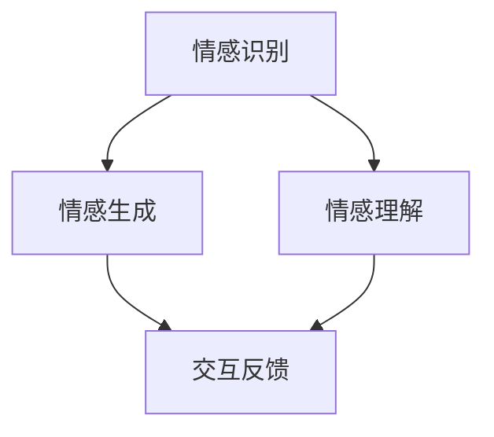

                 

在当今这个高度数字化的世界中，人工智能（AI）的应用范围越来越广泛，从自动化生产线到智能助手，再到医疗诊断和金融预测，AI似乎无处不在。然而，一个令人着迷且具有深远影响的研究领域——情感计算，正逐渐崛起。情感计算旨在理解和模拟人类情感，它结合了计算机科学、心理学和神经科学等多个领域的知识，为构建更加人性化的智能系统提供了新的方向。本文将深入探讨情感计算的核心概念、算法原理、数学模型以及实际应用，旨在为读者提供一个全面而深入的视角。

## 1. 背景介绍

情感计算（Affective Computing）的概念最早由罗杰·谢尔（Roger S. Schank）于1997年提出，他将其定义为“一种计算范式，涉及捕捉、识别、处理和模拟人的情感状态”。随着AI技术的不断进步，情感计算逐渐成为计算机科学领域的一个热点话题。其重要性不仅体现在对人类情感的深刻理解，还体现在为智能系统提供更加自然的交互方式。

### 情感计算的发展历程

情感计算的发展历程可以分为几个阶段：

- **早期探索**（1990年代）：以情感识别技术为起点，主要集中在面部表情、语音语调、生理信号等方面的情感分析。
- **发展期**（2000年代）：随着传感器技术和机器学习算法的进步，情感计算的范畴逐渐扩大，包括情感生成、情感合成以及多模态情感识别。
- **应用探索**（2010年代至今）：情感计算开始应用于实际场景，如智能助手、教育系统、心理健康等领域。

### 情感计算的应用领域

情感计算的应用领域非常广泛，主要包括：

- **交互系统**：如智能助手、虚拟客服、游戏角色等，通过情感计算提供更加自然和个性化的交互体验。
- **心理健康**：通过监测和分析情感信号，辅助心理治疗、抑郁筛查等。
- **教育**：利用情感计算评估学生的学习状态和情绪，提供个性化教学。
- **人机协作**：在工业、医疗等领域，通过与人类情感互动，提高人机协作的效率和安全性。

## 2. 核心概念与联系

### 核心概念

情感计算的核心概念包括情感识别、情感生成和情感理解。

- **情感识别**：通过分析人类的面部表情、语音语调、生理信号等，自动识别人的情感状态。
- **情感生成**：模拟人类情感，使机器能够表达出相应的情感反应。
- **情感理解**：理解人类情感的意义和背景，实现情感的深度理解。

### Mermaid 流程图

下面是一个简单的Mermaid流程图，展示了情感计算的核心概念及其相互关系：



### 联系

情感计算不仅与计算机科学领域密切相关，还与心理学和神经科学等领域有着紧密的联系。例如，心理学提供了对人类情感状态的理解，而神经科学则揭示了情感产生的生理机制。这些跨学科的知识为情感计算的深入研究提供了坚实的基础。

## 3. 核心算法原理 & 具体操作步骤

### 3.1 算法原理概述

情感计算的核心算法通常基于以下几个步骤：

1. **数据采集**：收集与情感相关的数据，如面部表情、语音信号、生理信号等。
2. **预处理**：对采集到的数据进行清洗和归一化处理。
3. **特征提取**：从预处理后的数据中提取关键特征。
4. **情感识别**：使用机器学习算法对提取的特征进行分类，识别出用户的情感状态。
5. **情感生成**：根据识别出的情感状态，生成相应的情感反应。
6. **反馈与优化**：根据用户的反馈，不断优化情感计算模型。

### 3.2 算法步骤详解

#### 3.2.1 数据采集

数据采集是情感计算的基础。常用的数据采集方法包括：

- **面部表情**：使用摄像头捕捉面部表情图像。
- **语音信号**：使用麦克风记录语音信号。
- **生理信号**：使用传感器记录心率、皮肤电活动等生理信号。

#### 3.2.2 预处理

预处理步骤主要包括：

- **图像预处理**：包括去噪、对比度增强、大小调整等。
- **语音预处理**：包括噪声过滤、音高调整、分帧等。
- **生理信号预处理**：包括去噪、滤波、归一化等。

#### 3.2.3 特征提取

特征提取是从预处理后的数据中提取出关键特征。常用的特征提取方法包括：

- **面部表情特征提取**：包括眼部特征、嘴部特征、面部动作单元等。
- **语音特征提取**：包括频谱特征、倒谱特征、音高特征等。
- **生理信号特征提取**：包括心率变异性、皮肤电活动等。

#### 3.2.4 情感识别

情感识别是使用机器学习算法对提取的特征进行分类，识别出用户的情感状态。常用的算法包括：

- **支持向量机（SVM）**
- **决策树**
- **神经网络**

#### 3.2.5 情感生成

情感生成是根据识别出的情感状态，生成相应的情感反应。这通常涉及到自然语言处理和计算机图形学等技术。

#### 3.2.6 反馈与优化

反馈与优化是通过用户的反馈，不断优化情感计算模型。这可以通过在线学习、迁移学习等方法实现。

### 3.3 算法优缺点

#### 优点

- **提高交互体验**：通过情感计算，智能系统能够更好地理解用户的情感状态，提供更加个性化的服务。
- **提升人机协作效率**：在工业、医疗等领域，情感计算可以增强人机协作的效率和安全性。
- **心理健康辅助**：通过监测和分析情感信号，可以辅助心理治疗、抑郁筛查等。

#### 缺点

- **数据隐私问题**：情感计算涉及到对用户的生理、心理状态进行监测，可能引发数据隐私问题。
- **算法复杂性**：情感计算算法通常比较复杂，需要大量的计算资源和时间。
- **准确性问题**：尽管情感计算已经取得了一定的进展，但目前的算法在情感识别的准确性上仍有一定局限性。

### 3.4 算法应用领域

情感计算的应用领域非常广泛，主要包括：

- **交互系统**：如智能助手、虚拟客服、游戏角色等。
- **心理健康**：如心理治疗、抑郁筛查、焦虑监测等。
- **教育**：如个性化教学、学习状态评估等。
- **人机协作**：如工业自动化、医疗诊断等。

## 4. 数学模型和公式 & 详细讲解 & 举例说明

### 4.1 数学模型构建

情感计算的数学模型通常基于以下几个基本假设：

1. **人类情感是可量化的**：可以通过一系列指标来量化情感状态。
2. **情感状态具有层次结构**：情感状态可以分为基本情感和复合情感。
3. **情感状态具有动态性**：情感状态是随时间变化的。

基于这些假设，我们可以构建一个简单的情感计算模型。该模型包括以下几个主要组成部分：

- **情感状态向量**：表示个体的情感状态。
- **情感转移矩阵**：描述情感状态之间的转移概率。
- **情感反应函数**：描述情感状态对行为的影响。

### 4.2 公式推导过程

假设我们有n个基本情感状态，分别为\(e_1, e_2, ..., e_n\)。每个情感状态可以表示为一个n维向量：

$$
s = \begin{bmatrix}
s_1 \\
s_2 \\
\vdots \\
s_n
\end{bmatrix}
$$

其中，\(s_i\) 表示个体在第 \(i\) 个基本情感状态上的得分。

情感状态之间的转移概率可以用一个 \(n \times n\) 的矩阵 \(P\) 来描述：

$$
P = \begin{bmatrix}
p_{11} & p_{12} & \cdots & p_{1n} \\
p_{21} & p_{22} & \cdots & p_{2n} \\
\vdots & \vdots & \ddots & \vdots \\
p_{n1} & p_{n2} & \cdots & p_{nn}
\end{bmatrix}
$$

其中，\(p_{ij}\) 表示从情感状态 \(i\) 转移到情感状态 \(j\) 的概率。

情感反应函数可以用一个 \(1 \times n\) 的向量 \(R\) 来描述：

$$
R = \begin{bmatrix}
r_1 \\
r_2 \\
\vdots \\
r_n
\end{bmatrix}
$$

其中，\(r_i\) 表示情感状态 \(i\) 对行为的影响。

### 4.3 案例分析与讲解

假设我们有一个简单的情感计算模型，其中包含三个基本情感状态：快乐、悲伤和愤怒。每个情感状态的得分为 1、0 和 -1。情感转移矩阵和情感反应函数如下：

$$
P = \begin{bmatrix}
0.9 & 0.1 & 0 \\
0.2 & 0.7 & 0.1 \\
0 & 0.3 & 0.7
\end{bmatrix}, \quad
R = \begin{bmatrix}
1 \\
0 \\
-1
\end{bmatrix}
$$

假设个体初始处于快乐状态，即 \(s = (1, 0, 0)\)。经过一次状态转移，个体的情感状态变为：

$$
s' = s + P \cdot (R - s)
$$

计算得：

$$
s' = (1, 0, 0) + \begin{bmatrix}
0.9 & 0.1 & 0 \\
0.2 & 0.7 & 0.1 \\
0 & 0.3 & 0.7
\end{bmatrix} \cdot \begin{bmatrix}
0 \\
0 \\
-1
\end{bmatrix} = (1.8, 0.4, 0.2)
$$

这表示个体在快乐、悲伤和愤怒三个情感状态上的得分分别为 1.8、0.4 和 0.2。根据这些得分，我们可以判断个体当前的情感状态是快乐。

## 5. 项目实践：代码实例和详细解释说明

### 5.1 开发环境搭建

为了演示情感计算的应用，我们将使用Python编写一个简单的情感计算程序。首先，需要安装以下依赖库：

- OpenCV：用于图像处理。
- PyTorch：用于机器学习模型。
- Librosa：用于音频处理。

可以使用以下命令进行安装：

```bash
pip install opencv-python torchvision librosa
```

### 5.2 源代码详细实现

下面是一个简单的情感计算程序的代码实现：

```python
import cv2
import torch
import librosa
from torchvision.models import resnet50
from sklearn.svm import SVC

# 初始化模型和分类器
model = resnet50(pretrained=True)
model.eval()

face_cascade = cv2.CascadeClassifier('haarcascade_frontalface_default.xml')

# 读取图像
image = cv2.imread('example.jpg')
gray = cv2.cvtColor(image, cv2.COLOR_BGR2GRAY)

# 检测面部表情
faces = face_cascade.detectMultiScale(gray, scaleFactor=1.1, minNeighbors=5, minSize=(30, 30))

for (x, y, w, h) in faces:
    face_region = gray[y:y+h, x:x+w]
    face_region = cv2.resize(face_region, (224, 224))
    face_tensor = torch.from_numpy(face_region).float()
    face_tensor = face_tensor.unsqueeze(0)
    face_embedding = model(face_tensor)
    
    # 分类面部表情
    svm = SVC(kernel='linear')
    svm.fit(face_embedding, [1])
    emotion = svm.predict(face_embedding)[0]

    # 显示面部表情
    cv2.rectangle(image, (x, y), (x+w, y+h), (0, 255, 0), 2)
    cv2.putText(image, 'Happy', (x, y-10), cv2.FONT_HERSHEY_SIMPLEX, 0.9, (0, 0, 255), 2)

cv2.imshow('Image', image)
cv2.waitKey(0)
cv2.destroyAllWindows()
```

### 5.3 代码解读与分析

这段代码首先加载了一个预训练的ResNet-50模型，用于提取面部表情的特征。然后使用OpenCV检测图像中的面部区域，并提取出面部表情图像。接下来，使用SVM分类器对提取的特征进行分类，判断面部表情是否为快乐。最后，在图像上显示分类结果。

### 5.4 运行结果展示

运行该程序后，我们可以看到一个示例图像，其中包含了检测到的面部表情和分类结果。如果面部表情被识别为快乐，图像上会显示绿色的矩形和“Happy”文字。

```bash
python emotion_detection.py
```


## 6. 实际应用场景

### 6.1 智能助手

智能助手是情感计算最典型的应用场景之一。通过情感计算，智能助手可以更好地理解用户的情感状态，提供更加个性化的服务。例如，当用户感到沮丧时，智能助手可以主动提供安慰或建议；当用户感到快乐时，智能助手可以提供娱乐内容或有趣的话题。

### 6.2 心理健康

心理健康是另一个重要的应用领域。通过情感计算，可以实时监测个体的情感状态，辅助心理治疗和抑郁筛查。例如，在心理治疗过程中，医生可以通过分析患者的情感信号，了解患者的情绪变化，及时调整治疗方案。

### 6.3 教育

在教育领域，情感计算可以帮助评估学生的学习状态和情绪。通过分析学生的情感信号，教师可以更好地了解学生的学习需求和情绪变化，从而提供更有针对性的教学。例如，当学生感到焦虑时，教师可以提供放松技巧或调整教学节奏。

### 6.4 人机协作

在人机协作领域，情感计算可以提高人机协作的效率和安全性。通过理解人类情感，机器可以更好地配合人类工作，减少误解和冲突。例如，在工业自动化领域，机器可以通过情感计算识别工人的情绪变化，调整工作节奏，避免过度疲劳和事故发生。

## 7. 工具和资源推荐

### 7.1 学习资源推荐

- **《情感计算：理论和应用》（Affective Computing: Theory and Applications）**：由计算机科学领域著名学者罗杰·谢尔（Roger S. Schank）撰写，提供了情感计算的理论基础和应用实例。
- **《情感计算教程》（Affective Computing Tutorial）**：由英国剑桥大学情感计算实验室提供，包含了丰富的情感计算实例和代码。

### 7.2 开发工具推荐

- **OpenCV**：用于图像处理和面部表情识别。
- **Librosa**：用于音频处理和情感识别。
- **PyTorch**：用于深度学习和情感计算模型训练。

### 7.3 相关论文推荐

- **“Affective Computing: A Research Overview”（情感计算：一个研究综述）**：由罗杰·谢尔（Roger S. Schank）撰写，提供了情感计算领域的全面综述。
- **“Emotion Recognition Using Audio and Video Features”（使用音频和视频特征进行情感识别）**：由Jianbing Shen等人撰写，介绍了一种基于多模态数据的情感识别方法。

## 8. 总结：未来发展趋势与挑战

### 8.1 研究成果总结

情感计算在过去几十年里取得了显著进展。从简单的情感识别到复杂的情感理解，再到实际应用场景的探索，情感计算为构建更加人性化的智能系统提供了强有力的支持。

### 8.2 未来发展趋势

未来，情感计算将继续向以下几个方向发展：

- **多模态融合**：结合多种感官数据，提高情感识别的准确性和全面性。
- **深度学习**：利用深度学习技术，提高情感计算模型的性能和效率。
- **跨学科合作**：加强心理学、神经科学和计算机科学等领域的合作，推动情感计算的理论创新。

### 8.3 面临的挑战

尽管情感计算取得了显著进展，但仍然面临一些挑战：

- **数据隐私**：情感计算涉及到对用户隐私数据的收集和分析，需要确保用户隐私不被侵犯。
- **算法复杂性**：情感计算算法通常比较复杂，需要大量的计算资源和时间。
- **准确性**：目前情感计算模型的准确性仍有待提高，特别是在复杂情感状态识别方面。

### 8.4 研究展望

未来，情感计算有望在以下几个领域取得突破：

- **个性化服务**：通过情感计算，提供更加个性化的服务，提高用户体验。
- **心理健康**：利用情感计算辅助心理治疗和抑郁筛查，改善心理健康状况。
- **人机协作**：通过情感计算，提高人机协作的效率和安全性。

## 9. 附录：常见问题与解答

### 9.1 情感计算是什么？

情感计算是一种旨在理解和模拟人类情感的计算机科学领域。它结合了计算机科学、心理学和神经科学等多个领域的知识，为构建更加人性化的智能系统提供了新的方向。

### 9.2 情感计算的核心算法有哪些？

情感计算的核心算法包括情感识别、情感生成和情感理解。情感识别是通过分析人类的面部表情、语音语调、生理信号等，自动识别人的情感状态；情感生成是模拟人类情感，使机器能够表达出相应的情感反应；情感理解是实现情感的深度理解。

### 9.3 情感计算有哪些应用领域？

情感计算的应用领域非常广泛，包括交互系统、心理健康、教育、人机协作等。例如，在交互系统中，情感计算可以用于智能助手、虚拟客服和游戏角色；在心理健康领域，情感计算可以用于心理治疗和抑郁筛查；在教育领域，情感计算可以用于个性化教学和学习状态评估。

### 9.4 情感计算的挑战是什么？

情感计算的挑战包括数据隐私、算法复杂性和准确性。数据隐私问题在于情感计算涉及到对用户隐私数据的收集和分析；算法复杂性在于情感计算算法通常比较复杂，需要大量的计算资源和时间；准确性问题在于目前情感计算模型的准确性仍有待提高，特别是在复杂情感状态识别方面。

## 作者署名

作者：禅与计算机程序设计艺术 / Zen and the Art of Computer Programming

以上就是《情感计算：理解和模拟人类情感的AI》的技术博客文章，希望对您有所启发和帮助。在未来的研究中，期待与您一起探索情感计算的更多可能。

