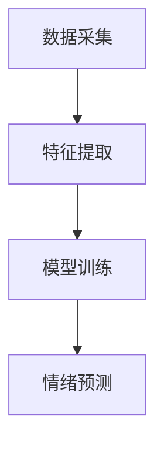

                 

关键词：情绪识别，人机交互，情感分析，创业，人工智能，情感维度，商业模式，技术挑战

> 摘要：随着人工智能技术的不断发展，情绪识别在人机交互领域正日益受到关注。本文将探讨情绪识别在创业中的重要性，详细分析其技术原理、应用场景、商业前景以及面临的挑战，并提出相应的解决方案，为创业者提供有价值的参考。

## 1. 背景介绍

### 1.1 情绪识别的定义与意义

情绪识别是指通过分析人类情感表达，识别出个体的情绪状态。在人机交互领域，情绪识别具有重大的意义。首先，它能够提高人机交互的智能化水平，使计算机能够更好地理解用户需求，提供更个性化的服务。其次，情绪识别可以帮助企业更好地了解客户情绪，优化产品和服务，提升用户体验。此外，情绪识别在医疗、教育、心理咨询等领域也具有广泛的应用前景。

### 1.2 人工智能与人机交互

人工智能技术作为当今科技发展的热点，正在不断推动人机交互的革新。从最初的键盘输入，到语音识别、手势控制，再到如今的情感识别，人机交互正在从被动响应向主动互动转变。在这种背景下，情绪识别技术成为人机交互发展的重要驱动力。

## 2. 核心概念与联系

### 2.1 情绪识别技术原理

情绪识别技术主要基于以下三个维度：

- **面部表情分析**：通过识别面部表情特征，如眉毛、眼睛、嘴巴等，判断用户的情绪状态。
- **语音分析**：通过分析语音的音调、音量、节奏等参数，识别用户的情绪。
- **文本分析**：通过自然语言处理技术，从文本中提取情感信息，识别用户的情绪。

### 2.2 情绪识别架构

情绪识别系统通常包括数据采集、特征提取、模型训练和情绪预测四个主要模块。下面是一个简单的情绪识别系统架构图：



### 2.3 情绪识别与相关技术的联系

情绪识别与人脸识别、语音识别等技术密切相关。在应用过程中，这些技术相互配合，共同实现人机交互的智能化。

## 3. 核心算法原理 & 具体操作步骤

### 3.1 算法原理概述

情绪识别算法主要分为基于传统机器学习和深度学习的两大类。传统机器学习算法如支持向量机（SVM）、决策树等，通过特征工程提取关键特征，进行分类。而深度学习算法如卷积神经网络（CNN）和循环神经网络（RNN）等，通过多层神经网络自动提取特征，实现端到端的学习。

### 3.2 算法步骤详解

1. **数据采集**：收集包含情绪标签的面部表情、语音和文本数据。
2. **特征提取**：对于面部表情，提取 facial landmarks 和表情特征；对于语音，提取音调、音量、节奏等特征；对于文本，提取情感词汇和句法特征。
3. **模型训练**：使用收集到的数据训练分类模型，如SVM、CNN或RNN。
4. **情绪预测**：将新的面部表情、语音或文本输入模型，预测其情绪状态。

### 3.3 算法优缺点

- **传统机器学习算法**：优点是算法简单，易于理解；缺点是特征工程繁琐，且效果有限。
- **深度学习算法**：优点是自动提取特征，效果更好；缺点是模型复杂，训练时间较长。

### 3.4 算法应用领域

情绪识别技术广泛应用于智能客服、虚拟助手、智能家居、教育等领域。

## 4. 数学模型和公式 & 详细讲解 & 举例说明

### 4.1 数学模型构建

情绪识别的数学模型通常是一个分类模型，如SVM、CNN或RNN。以SVM为例，其模型公式为：

$$
\text{arg}\min_w \frac{1}{2} ||w||^2 + C \sum_{i=1}^n \xi_i
$$

其中，$w$为权重向量，$C$为惩罚参数，$\xi_i$为松弛变量。

### 4.2 公式推导过程

以SVM为例，其推导过程如下：

1. **目标函数**：最小化分类间隔，即$||w||^2$。
2. **约束条件**：所有样本点满足分类条件，即$y_i ( \langle w , x_i \rangle - b ) \geq 1$。
3. **Lagrange 函数**：构建Lagrange函数，引入松弛变量$\xi_i$。
4. **对偶问题**：求解Lagrange函数的优化问题，得到SVM的决策函数。

### 4.3 案例分析与讲解

以一个简单的二分类问题为例，说明情绪识别的过程：

1. **数据采集**：收集正面和负面情绪的面部表情数据。
2. **特征提取**：提取面部表情的 facial landmarks 和表情特征。
3. **模型训练**：使用SVM训练分类模型。
4. **情绪预测**：输入新的面部表情数据，预测其情绪状态。

## 5. 项目实践：代码实例和详细解释说明

### 5.1 开发环境搭建

- 硬件环境：计算机，摄像头，麦克风等。
- 软件环境：Python 3.8，OpenCV 4.5，scikit-learn 0.24，TensorFlow 2.7。

### 5.2 源代码详细实现

```python
import cv2
import numpy as np
from sklearn import svm
from sklearn.model_selection import train_test_split
from sklearn.metrics import accuracy_score

# 数据采集
data = []
labels = []
# 这里假设已经收集了正面和负面情绪的面部表情数据

# 特征提取
def extract_features(image):
    # 提取面部表情的 facial landmarks
    landmarks = cv2.face.genFaces(image)
    # 提取表情特征
    features = []
    for landmark in landmarks:
        feature = []
        for point in landmark:
            feature.append(point[0])
            feature.append(point[1])
        features.append(feature)
    return np.array(features)

# 模型训练
def train_model(X, y):
    model = svm.SVC()
    model.fit(X, y)
    return model

# 情绪预测
def predict_emotion(model, image):
    features = extract_features(image)
    prediction = model.predict([features])
    return prediction

# 测试
X_train, X_test, y_train, y_test = train_test_split(data, labels, test_size=0.2, random_state=42)
model = train_model(X_train, y_train)
predictions = [predict_emotion(model, image) for image in X_test]
accuracy = accuracy_score(y_test, predictions)
print("Accuracy:", accuracy)
```

### 5.3 代码解读与分析

这段代码实现了基于面部表情的情绪识别过程。首先，从数据中提取面部表情特征，然后使用SVM模型进行训练，最后输入新的面部表情数据，预测其情绪状态。

## 6. 实际应用场景

### 6.1 智能客服

智能客服是情绪识别技术的典型应用场景。通过情绪识别，智能客服能够更好地理解用户的需求，提供更个性化的服务。例如，当用户表达愤怒情绪时，智能客服可以主动提供解决方案，缓解用户情绪。

### 6.2 虚拟助手

虚拟助手也是情绪识别技术的重要应用领域。虚拟助手能够通过情绪识别，与用户进行更自然的互动，提升用户体验。例如，在智能家居场景中，虚拟助手可以识别家庭成员的情绪，调整家庭氛围。

### 6.3 教育

在教育领域，情绪识别技术可以帮助教师更好地了解学生的情绪状态，调整教学策略，提高教学效果。例如，当学生表现出焦虑情绪时，教师可以及时给予关怀和支持，帮助学生缓解情绪。

## 7. 未来应用展望

随着技术的不断进步，情绪识别在未来的应用前景将更加广泛。例如，在医疗领域，情绪识别可以用于抑郁症、焦虑症等心理疾病的诊断和治疗；在金融领域，情绪识别可以用于风险管理和投资决策。

## 8. 总结：未来发展趋势与挑战

### 8.1 研究成果总结

情绪识别技术在近年来取得了显著的成果，应用领域不断拓展。然而，技术仍存在一定的局限性，如情绪识别准确率有待提高、数据隐私问题等。

### 8.2 未来发展趋势

未来，情绪识别技术将在以下方面取得突破：

- **算法优化**：提高情绪识别的准确率和实时性。
- **多模态融合**：结合多种传感器数据，实现更全面、准确的情绪识别。
- **数据隐私保护**：加强数据隐私保护，保障用户权益。

### 8.3 面临的挑战

情绪识别技术在未来发展过程中将面临以下挑战：

- **数据质量**：高质量的情绪数据是模型训练的基础，需要收集和标注更多的情绪数据。
- **跨文化适应**：情绪识别模型需要具备跨文化适应能力，以满足不同地区和民族的需求。

### 8.4 研究展望

情绪识别技术在未来的发展具有广阔的前景。我们期待在不久的将来，情绪识别技术能够更好地服务于人类，为人类社会带来更多福祉。

## 9. 附录：常见问题与解答

### 9.1 情绪识别技术的难点是什么？

情绪识别技术的难点主要包括：

- **情绪表达的多样性**：情绪表达因个体差异、情境变化而具有多样性，给情绪识别带来挑战。
- **数据隐私保护**：情绪识别涉及个人隐私，需要加强数据隐私保护。

### 9.2 如何提高情绪识别的准确率？

提高情绪识别准确率的方法包括：

- **多模态融合**：结合多种传感器数据，提高情绪识别的准确性。
- **数据增强**：通过数据增强技术，增加训练数据的多样性。
- **模型优化**：使用更先进的模型和算法，提高情绪识别的性能。

---

作者：禅与计算机程序设计艺术 / Zen and the Art of Computer Programming
----------------------------------------------------------------
### 文章结构模板 Conclusion

本文详细探讨了情绪识别技术在人机交互领域的应用及其创业前景。通过分析情绪识别的核心概念、算法原理、数学模型以及实际应用案例，我们展示了情绪识别技术的广泛应用和巨大潜力。同时，我们也指出了情绪识别技术面临的挑战，如数据质量和跨文化适应等问题。

未来，情绪识别技术将在算法优化、多模态融合和数据隐私保护等方面取得突破，为人机交互带来更多创新。创业者可以关注这一领域，抓住市场机遇，为用户提供更智能、更个性化的服务。

总之，情绪识别技术具有广阔的发展前景，将在人工智能和人机交互领域发挥重要作用。让我们共同期待情绪识别技术为人类带来的美好未来。

