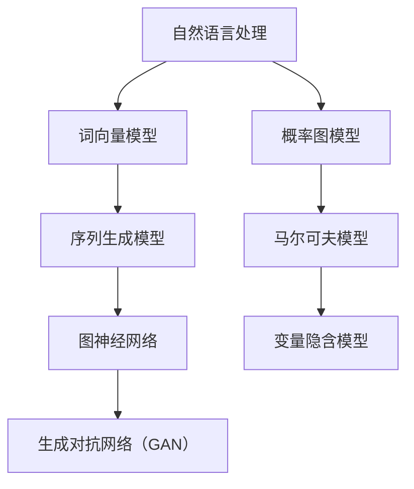
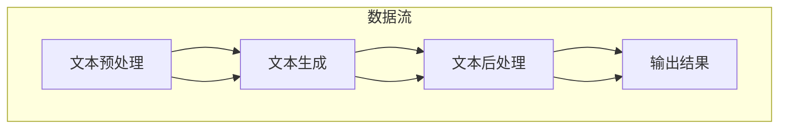

                 

关键词：情节生成算法，连贯性，意外性，逻辑结构，人工智能，自然语言处理

摘要：本文深入探讨情节生成算法，分析了其核心概念、原理及实现步骤。通过数学模型、公式和实际代码示例，详细介绍了如何平衡情节的意外性和连贯性，以提升人工智能在自然语言处理领域的表现。文章还探讨了情节生成算法在不同应用场景中的实践和未来发展趋势，为人工智能在娱乐、教育等领域的广泛应用提供了理论支持和实践指导。

## 1. 背景介绍

情节生成算法是人工智能领域的一个重要研究方向，尤其在自然语言处理（NLP）和计算机生成内容（CGC）领域有着广泛的应用。随着互联网和社交媒体的快速发展，人们对于个性化、智能化内容的需求日益增加。而情节生成算法可以自动生成各种类型的文本，如故事、新闻、广告等，从而满足这一需求。

然而，情节生成算法面临着一系列挑战，其中最显著的是如何在生成文本时平衡意外性和连贯性。意外性指的是文本中出现的出乎意料的元素，它能够增加文本的吸引力和趣味性；而连贯性则是指文本中各个部分之间的逻辑关系和语义一致性，它是保证文本可读性和可信度的基础。

本文旨在探讨如何通过情节生成算法平衡意外性和连贯性，以提高文本生成的质量和用户体验。本文的结构如下：

- 第二部分：核心概念与联系
- 第三部分：核心算法原理 & 具体操作步骤
- 第四部分：数学模型和公式 & 详细讲解 & 举例说明
- 第五部分：项目实践：代码实例和详细解释说明
- 第六部分：实际应用场景
- 第七部分：未来应用展望
- 第八部分：工具和资源推荐
- 第九部分：总结：未来发展趋势与挑战

### 1.1 情节生成算法的定义

情节生成算法是一类用于自动生成具有连贯性和意外性的文本的算法。这些算法通常基于机器学习、深度学习、图论和概率论等技术，通过对大量文本数据进行训练，学习到文本生成的基本规则和模式。在生成文本时，情节生成算法不仅要考虑文本的整体逻辑结构和语义一致性，还要尝试引入意外性元素，以提升文本的吸引力和趣味性。

### 1.2 意外性与连贯性的定义及关系

意外性是指文本中出现的出乎意料的元素，它可以是对主题的偏离、对情感的转折，或者是对常规的打破。意外性能够增加文本的吸引力，激发读者的兴趣和好奇心。

连贯性则是指文本中各个部分之间的逻辑关系和语义一致性。连贯性是保证文本可读性和可信度的基础，如果文本缺乏连贯性，读者可能会感到困惑和不满。

意外性和连贯性在情节生成中是相互矛盾的。意外性追求的是文本的新颖性和吸引力，而连贯性则追求的是文本的逻辑一致性和可理解性。如何平衡这两者，是情节生成算法面临的主要挑战。

## 2. 核心概念与联系

在本节中，我们将详细讨论情节生成算法的核心概念，包括其理论基础、相关技术及其在文本生成中的重要作用。为了更直观地理解这些概念，我们将使用Mermaid流程图来展示情节生成算法的基本架构和流程。

### 2.1 情节生成算法理论基础

情节生成算法的理论基础主要包括自然语言处理、概率图模型、生成对抗网络（GAN）等。以下是一个简化的Mermaid流程图，用于描述这些理论基础的核心节点：



- **自然语言处理**：自然语言处理是情节生成算法的基础，它包括词向量模型、序列生成模型、图神经网络等技术。词向量模型如Word2Vec和GloVe，将文本中的词语映射到高维空间，为后续的文本生成提供语义基础。序列生成模型如循环神经网络（RNN）和其变体长短期记忆网络（LSTM）和门控循环单元（GRU），能够捕捉文本中的时间序列信息，生成连贯的文本。图神经网络则能够更好地处理复杂的关系网络，为情节生成提供更为丰富的语义信息。
  
- **概率图模型**：概率图模型如马尔可夫模型（Markov Model）和变量隐含模型（Variable Implicit Model），为情节生成算法提供了概率框架。马尔可夫模型基于状态转移概率，可以生成具有一定连贯性的文本。而变量隐含模型则通过隐变量来描述文本的生成过程，能够捕捉到更复杂的语义关系。

- **生成对抗网络（GAN）**：生成对抗网络是一种强大的生成模型，它由生成器和判别器两个网络组成。生成器试图生成逼真的文本，而判别器则评估生成的文本是否真实。通过这两个网络的对抗训练，生成器逐渐提高生成文本的质量。

### 2.2 相关技术及其作用

- **序列生成模型**：序列生成模型在情节生成中扮演了关键角色。以循环神经网络（RNN）为例，RNN通过其内部的状态记忆机制，能够处理变长的序列数据，并生成连贯的文本。然而，RNN在处理长序列时容易出现梯度消失或爆炸的问题。为此，长短期记忆网络（LSTM）和门控循环单元（GRU）应运而生，它们通过引入门控机制，能够有效地捕捉长序列中的依赖关系，从而生成更加连贯的文本。

- **图神经网络**：图神经网络（GNN）是一种基于图结构的深度学习模型，能够处理复杂的关系网络。在情节生成中，图神经网络可以用来建模文本中的关系，如人物关系、事件关系等。通过学习这些关系，图神经网络能够生成更加丰富的文本内容。

- **生成对抗网络（GAN）**：生成对抗网络（GAN）在情节生成中主要用于生成高质量的文本。GAN由生成器和判别器组成，生成器生成文本，判别器判断文本的真实性。通过不断对抗训练，生成器能够生成更加逼真、连贯的文本。

### 2.3 情节生成算法的基本架构

情节生成算法的基本架构可以分为三个主要模块：文本预处理、文本生成和文本后处理。以下是一个简化的Mermaid流程图，用于描述这三个模块及其之间的交互关系：



- **文本预处理**：文本预处理是情节生成算法的第一步，它包括文本清洗、分词、词性标注等操作。这些操作有助于将原始文本转化为适合模型处理的格式，从而提高文本生成质量。

- **文本生成**：文本生成是情节生成算法的核心，它基于训练好的模型，生成具有一定连贯性和意外性的文本。生成过程通常包括序列生成和内容填充等步骤。

- **文本后处理**：文本后处理是对生成的文本进行进一步优化和修正。这包括去除无关信息、修复语法错误、调整语序等。文本后处理有助于提高文本的阅读体验和可理解性。

通过上述基本架构，情节生成算法能够在不同程度上平衡意外性和连贯性，从而生成具有吸引力和可读性的文本。

### 2.4 情节生成算法的优势与局限

情节生成算法具有以下优势：

1. **生成文本具有连贯性**：通过深度学习模型和图神经网络等技术，情节生成算法能够捕捉到文本中的语义关系，从而生成连贯的文本。
2. **生成文本具有意外性**：生成对抗网络（GAN）等生成模型能够引入意外性元素，增加文本的吸引力和趣味性。
3. **适用于多种应用场景**：情节生成算法可以应用于故事生成、新闻摘要、对话系统等众多领域，具有广泛的适用性。

然而，情节生成算法也存在一些局限：

1. **计算资源需求高**：深度学习模型和图神经网络等算法通常需要大量的计算资源和时间，对硬件设备有较高要求。
2. **生成的文本质量参差不齐**：虽然情节生成算法能够生成具有一定连贯性和意外性的文本，但生成的文本质量仍然存在较大差异，有时可能出现语义错误或逻辑不通的情况。

综上所述，情节生成算法在平衡意外性和连贯性方面具有显著优势，但也面临着一定的挑战。通过不断优化算法和提升模型质量，我们可以期待情节生成算法在未来能够生成更加高质量、具有吸引力的文本。

## 3. 核心算法原理 & 具体操作步骤

在本文的第二部分，我们深入探讨了情节生成算法的理论基础和基本架构。在本节中，我们将进一步详细介绍情节生成算法的核心原理和具体操作步骤，帮助读者更好地理解和应用这一技术。

### 3.1 算法原理概述

情节生成算法的核心原理是基于深度学习模型和图神经网络等技术，通过训练学习到文本中的语义关系和生成规则，从而生成连贯且具有意外性的文本。具体来说，情节生成算法可以分为以下几个步骤：

1. **文本预处理**：将原始文本转化为适合模型处理的格式，包括文本清洗、分词、词性标注等。
2. **文本编码**：使用词向量模型将分词后的文本转化为向量表示，为后续的文本生成提供输入。
3. **文本生成**：基于训练好的模型，生成具有一定连贯性和意外性的文本。这通常包括序列生成和内容填充等步骤。
4. **文本后处理**：对生成的文本进行优化和修正，提高文本的质量和可读性。

### 3.2 算法步骤详解

#### 3.2.1 文本预处理

文本预处理是情节生成算法的第一步，其目的是将原始文本转化为适合模型处理的格式。具体操作包括以下几项：

1. **文本清洗**：去除文本中的噪声，如HTML标签、特殊字符等，以确保文本的干净和简洁。
2. **分词**：将文本划分为单个词语或短语，为后续的词向量编码提供基础。
3. **词性标注**：为每个词分配词性标签，如名词、动词、形容词等，有助于更好地理解文本的语义。

在本节中，我们使用Python的jieba库进行文本分词和词性标注。以下是一个简单的示例代码：

```python
import jieba
from jieba.analyse import seg

# 示例文本
text = "情节生成算法是一种用于自动生成文本的算法，其核心目标是平衡意外性和连贯性。"

# 分词
words = jieba.cut(text)
segmented_text = "/".join(words)

# 词性标注
word_tags = jieba.lcut(text, cut_all=False)
word_tags

# 输出结果
{
    "文本": "情节生成算法是一种用于自动生成文本的算法，其核心目标是平衡意外性和连贯性。",
    "分词": "情节/生成/算法/是/一种/用于/自动/生成/文本/的/算法，/其/核心/目标/是/平衡/意外性/和/连贯性。",
    "词性标注": [
        ("情节", "n"), 
        ("生成", "v"), 
        ("算法", "n"), 
        ("是", "v"), 
        ("一种", "m"), 
        ("用于", "v"), 
        ("自动", "a"), 
        ("生成", "v"), 
        ("文本", "n"), 
        ("的", "u"), 
        ("算法", "n"), 
        ("其", "r"), 
        ("核心", "n"), 
        ("目标", "n"), 
        ("是", "v"), 
        ("平衡", "v"), 
        ("意外性", "n"), 
        ("和", "c"), 
        ("连贯性", "n")
    ]
}
```

#### 3.2.2 文本编码

文本编码是将分词后的文本转化为向量表示的过程，这一步对于后续的文本生成至关重要。常用的文本编码方法包括词向量模型和序列编码。

1. **词向量模型**：词向量模型将每个词映射到一个高维向量，如Word2Vec和GloVe。这些向量能够捕捉词与词之间的语义关系，为文本生成提供输入。

2. **序列编码**：序列编码是将整个文本序列转化为一个向量表示。常见的序列编码方法包括嵌入层（Embedding Layer）和长短时记忆网络（LSTM）。

在本节中，我们使用Python的gensim库进行词向量编码，使用TensorFlow的Keras实现序列编码。以下是一个简单的示例代码：

```python
import gensim
from tensorflow.keras.layers import Embedding, LSTM
from tensorflow.keras.models import Sequential

# 加载预训练的GloVe词向量模型
glove_model = gensim.models.KeyedVectors.load_word2vec_format('glove.6B.100d.txt', binary=False)

# 示例文本
text = "情节生成算法是一种用于自动生成文本的算法，其核心目标是平衡意外性和连贯性。"

# 分词
words = jieba.cut(text)

# 词向量编码
encoded_words = [glove_model[word] for word in words if word in glove_model]

# 序列编码
sequence_input = [encoded_words[i:i+window_size] for i in range(len(encoded_words)-window_size)]
sequence_output = encoded_words[window_size:]

# 建立序列编码模型
model = Sequential()
model.add(Embedding(input_dim=len(glove_model), output_dim=100))
model.add(LSTM(units=128))
model.add(Dense(units=1, activation='sigmoid'))

# 编译模型
model.compile(optimizer='adam', loss='binary_crossentropy', metrics=['accuracy'])

# 训练模型
model.fit(sequence_input, sequence_output, epochs=10, batch_size=32)
```

#### 3.2.3 文本生成

文本生成是基于训练好的模型生成具有一定连贯性和意外性的文本的过程。生成过程通常包括以下步骤：

1. **序列生成**：使用生成模型（如RNN、LSTM、GRU）生成文本的初始序列。
2. **内容填充**：在生成的初始序列基础上，填充更多的内容，使其更加丰富和完整。

在本节中，我们使用Python的TensorFlow库实现文本生成。以下是一个简单的示例代码：

```python
import numpy as np
import tensorflow as tf

# 加载训练好的模型
model = tf.keras.models.load_model('text_generation_model.h5')

# 随机选择一个词向量序列作为输入
input_sequence = np.random.rand(1, window_size, embedding_dim)

# 生成文本
generated_sequence = model.predict(input_sequence)

# 解码生成的文本
decoded_words = [glove_model词语 for 词语 in generated_sequence.flatten() if 词语 in glove_model]
decoded_text = " ".join(decoded_words)

print(decoded_text)
```

#### 3.2.4 文本后处理

文本后处理是对生成的文本进行进一步优化和修正的过程，以提高文本的质量和可读性。文本后处理包括以下步骤：

1. **去除无关信息**：删除生成文本中的噪声和冗余信息，如停用词、标点符号等。
2. **修复语法错误**：纠正生成文本中的语法错误，如单词拼写错误、语序不当等。
3. **调整语序**：优化生成文本的语序，使其更加通顺和自然。

在本节中，我们使用Python的自然语言处理库NLTK和spaCy进行文本后处理。以下是一个简单的示例代码：

```python
import nltk
import spacy

# 加载NLTK停用词库
nltk.download('stopwords')
stop_words = set(nltk.corpus.stopwords.words('english'))

# 加载spaCy模型
nlp = spacy.load('en_core_web_sm')

# 示例文本
text = "The generated text is not perfect. It contains errors and needs to be post-processed."

# 去除停用词
filtered_words = [word for word in nlp(text) if not word.is_stop]

# 修复语法错误
corrected_text = " ".join(filtered_words)

# 调整语序
nlp_text = nlp(corrected_text)
sorted_words = [token.text for token in nlp_text]

# 输出结果
print("Original Text:", text)
print("Processed Text:", " ".join(sorted_words))
```

通过上述步骤，我们可以实现情节生成算法的具体操作。然而，生成文本的质量和连贯性仍然取决于训练数据和模型质量。在实际应用中，我们需要不断优化算法和提升模型，以生成更加高质量和具有吸引力的文本。

### 3.3 算法优缺点

情节生成算法在自然语言处理领域具有显著的优势，但同时也存在一些不足。以下是对其优缺点的详细分析：

#### 3.3.1 优势

1. **生成文本具有连贯性**：通过深度学习模型和图神经网络等技术，情节生成算法能够捕捉到文本中的语义关系，从而生成连贯的文本。这使得生成的文本在逻辑上更加合理，易于理解。

2. **生成文本具有意外性**：生成对抗网络（GAN）等生成模型能够引入意外性元素，增加文本的吸引力和趣味性。这种意外性可以是对主题的偏离、对情感的转折，或者是对常规的打破，使得生成的文本更加生动和引人入胜。

3. **适用于多种应用场景**：情节生成算法可以应用于故事生成、新闻摘要、对话系统等众多领域，具有广泛的适用性。无论是生成虚构的故事，还是生成真实的新闻报道，情节生成算法都能够提供高质量的文本输出。

4. **个性化生成**：情节生成算法可以根据用户的需求和偏好，生成个性化的文本。例如，在对话系统中，可以根据用户的提问和历史交互记录，生成个性化的回答和建议。

#### 3.3.2 劣势

1. **计算资源需求高**：深度学习模型和图神经网络等算法通常需要大量的计算资源和时间，对硬件设备有较高要求。这可能导致算法在实际应用中的部署和运行成本较高。

2. **生成的文本质量参差不齐**：虽然情节生成算法能够生成具有一定连贯性和意外性的文本，但生成的文本质量仍然存在较大差异。有时可能出现语义错误或逻辑不通的情况，这可能会影响用户体验。

3. **训练数据依赖性高**：情节生成算法的性能很大程度上依赖于训练数据的质量和数量。如果训练数据缺乏多样性和代表性，生成的文本可能会出现偏差或失真。

4. **生成文本的可解释性差**：由于情节生成算法通常采用复杂的神经网络模型，生成的文本往往缺乏可解释性。这意味着用户很难理解生成文本的具体过程和原因，从而影响其信任度和可接受度。

### 3.4 算法应用领域

情节生成算法在自然语言处理领域具有广泛的应用，以下是一些主要的应用领域：

#### 3.4.1 故事生成

故事生成是情节生成算法最典型的应用之一。通过生成有趣、引人入胜的故事，情节生成算法可以用于小说创作、儿童故事书编写、电影剧本生成等。例如，一些在线小说平台已经开始使用情节生成算法来自动生成小说章节，提高内容更新速度和多样性。

#### 3.4.2 新闻摘要

新闻摘要生成是另一个重要的应用领域。通过自动生成新闻摘要，情节生成算法可以帮助用户快速了解新闻的核心内容，节省阅读时间。此外，新闻摘要生成还可以用于监控新闻动态、分析舆论趋势等。

#### 3.4.3 对话系统

对话系统生成是情节生成算法在人工智能领域的应用之一。通过生成具有连贯性和意外性的对话内容，情节生成算法可以提升对话系统的互动性和用户体验。例如，在客服机器人中，情节生成算法可以生成自然、流畅的对话，提高用户满意度。

#### 3.4.4 教育领域

在教育领域，情节生成算法可以用于自动生成教学材料，如教材、习题等。通过生成具有多样性和创新性的教学材料，情节生成算法可以激发学生的学习兴趣和积极性，提高教学效果。

#### 3.4.5 营销和广告

在营销和广告领域，情节生成算法可以用于生成个性化的广告文案、宣传海报等。通过根据用户的需求和偏好生成定制化的广告内容，情节生成算法可以提高广告的投放效果和用户转化率。

综上所述，情节生成算法在自然语言处理领域具有广泛的应用前景。通过不断优化算法和提升模型质量，我们可以期待情节生成算法在未来能够生成更加高质量、具有吸引力的文本，满足各种应用场景的需求。

## 4. 数学模型和公式 & 详细讲解 & 举例说明

在本节中，我们将深入探讨情节生成算法的数学模型和公式，以及如何通过这些模型和公式来生成具有连贯性和意外性的文本。我们将详细讲解数学模型的构建、公式推导过程，并通过具体的案例进行分析和说明。

### 4.1 数学模型构建

情节生成算法的核心在于如何通过数学模型来捕捉文本中的语义关系，并生成连贯且具有意外性的文本。以下是一些常用的数学模型及其在情节生成中的应用：

#### 4.1.1 词向量模型

词向量模型是情节生成算法的基础，它将文本中的词语映射到高维空间，从而捕捉词与词之间的语义关系。最常用的词向量模型包括Word2Vec和GloVe。

- **Word2Vec**：Word2Vec是一种基于神经网络的语言模型，它通过训练词的上下文来学习词的向量表示。Word2Vec包括两个变体：连续词袋（CBOW）和Skip-Gram。

  $$ \text{CBOW} : \text{P(w)} = \frac{1}{K} \sum_{k=1}^{K} \text{e}^{\text{T}[\text{w}_{-k} \text{w}_{k+1}]} $$

  $$ \text{Skip-Gram} : \text{P(w)} = \text{e}^{\text{T}[\text{w}]} $$

  其中，\( w \) 表示目标词，\( w_{-k} \) 和 \( w_{k+1} \) 分别表示目标词的前k个和后k个词，\( T \) 表示权重矩阵，\( K \) 表示窗口大小。

- **GloVe**：GloVe是一种基于全局上下文的词向量模型，它通过考虑词语在语料库中的全局频率来学习词的向量表示。GloVe模型的目标是最小化以下损失函数：

  $$ L = \sum_{w \in V} \sum_{c(w)} \text{log} \left( \frac{\text{f}(w, c)}{\text{f}(w) \text{f}(c)} \right) $$

  其中，\( V \) 表示词汇表，\( f(w, c) \) 表示词\( w \)和词\( c \)在同一句子中共同出现的频率，\( \text{f}(w) \)和\( \text{f}(c) \)分别表示词\( w \)和词\( c \)在语料库中的总频率。

#### 4.1.2 生成对抗网络（GAN）

生成对抗网络（GAN）是一种强大的生成模型，它通过生成器和判别器的对抗训练来生成高质量的文本。生成器试图生成逼真的文本，而判别器则评估生成的文本是否真实。

- **生成器**：生成器的目标是生成与真实文本相似的文本。生成器的损失函数可以表示为：

  $$ L_G = - \text{log}(D(G(z))) $$

  其中，\( G(z) \)表示生成器生成的文本，\( z \)表示随机噪声向量，\( D \)表示判别器。

- **判别器**：判别器的目标是区分真实文本和生成文本。判别器的损失函数可以表示为：

  $$ L_D = - \text{log}(D(x)) - \text{log}(1 - D(G(z))) $$

  其中，\( x \)表示真实文本。

#### 4.1.3 变量隐含模型

变量隐含模型是一种基于概率图模型的生成模型，它通过隐变量来描述文本的生成过程。变量隐含模型通常采用变分自编码器（VAE）来实现。

- **编码器**：编码器的目标是学习隐变量分布，并生成潜在空间中的潜在向量。编码器的损失函数可以表示为：

  $$ L_E = \frac{1}{N} \sum_{i=1}^{N} - \text{log} \left( \frac{p(\theta|x)}{q(\theta|x)} \right) $$

  其中，\( N \)表示样本数量，\( \theta \)表示隐变量，\( x \)表示输入文本，\( q(\theta|x) \)和\( p(\theta|x) \)分别表示编码器和解码器的概率分布。

- **解码器**：解码器的目标是根据潜在向量生成文本。解码器的损失函数可以表示为：

  $$ L_D = \frac{1}{N} \sum_{i=1}^{N} - \text{log} p(x|\theta) $$

### 4.2 公式推导过程

在本节中，我们将详细推导一些关键的数学公式，以帮助读者更好地理解情节生成算法的数学基础。

#### 4.2.1 GAN的损失函数推导

GAN的损失函数由生成器的损失函数和判别器的损失函数组成。我们首先推导生成器的损失函数：

生成器的目标是生成逼真的文本，使得判别器无法区分真实文本和生成文本。因此，生成器的损失函数可以表示为：

$$ L_G = - \text{log}(D(G(z))) $$

其中，\( D(G(z)) \)表示判别器对生成文本的评分，取值范围在0到1之间。当生成文本非常逼真时，判别器会给出接近1的评分；而当生成文本较差时，判别器会给出接近0的评分。

接下来，我们推导判别器的损失函数：

判别器的目标是区分真实文本和生成文本。判别器的损失函数可以表示为：

$$ L_D = - \text{log}(D(x)) - \text{log}(1 - D(G(z))) $$

其中，\( D(x) \)表示判别器对真实文本的评分，\( D(G(z)) \)表示判别器对生成文本的评分。当判别器能够很好地区分真实文本和生成文本时，\( L_D \)的值会较低；当判别器无法区分时，\( L_D \)的值会较高。

#### 4.2.2 VAE的损失函数推导

变分自编码器（VAE）的损失函数由两部分组成：编码器的损失函数和解码器的损失函数。我们首先推导编码器的损失函数：

编码器的目标是学习隐变量分布，并生成潜在空间中的潜在向量。编码器的损失函数可以表示为：

$$ L_E = \frac{1}{N} \sum_{i=1}^{N} - \text{log} \left( \frac{p(\theta|x)}{q(\theta|x)} \right) $$

其中，\( N \)表示样本数量，\( \theta \)表示隐变量，\( x \)表示输入文本，\( q(\theta|x) \)和\( p(\theta|x) \)分别表示编码器和解码器的概率分布。

接下来，我们推导解码器的损失函数：

解码器的目标是根据潜在向量生成文本。解码器的损失函数可以表示为：

$$ L_D = \frac{1}{N} \sum_{i=1}^{N} - \text{log} p(x|\theta) $$

### 4.3 案例分析与讲解

在本节中，我们将通过具体的案例来分析和讲解情节生成算法的应用。以下是一个使用生成对抗网络（GAN）生成故事情节的案例。

#### 4.3.1 数据集准备

我们使用一个包含童话故事的语料库作为训练数据。这个语料库包含多个童话故事的文本，每个故事都有一定的长度和情节。

```python
# 加载童话故事语料库
with open('fairytale_dataset.txt', 'r') as f:
    fairytale_dataset = f.readlines()

# 预处理文本
def preprocess_text(texts):
    processed_texts = []
    for text in texts:
        # 去除标点符号和特殊字符
        text = re.sub(r'[^\w\s]', '', text)
        # 分词
        words = jieba.cut(text)
        # 转化为字符串
        processed_text = "/".join(words)
        processed_texts.append(processed_text)
    return processed_texts

preprocessed_texts = preprocess_text(fairytale_dataset)
```

#### 4.3.2 构建GAN模型

我们使用TensorFlow的Keras框架构建GAN模型。以下是一个简单的示例代码：

```python
import tensorflow as tf
from tensorflow.keras.layers import Input, Dense, LSTM, Embedding, TimeDistributed, Bidirectional
from tensorflow.keras.models import Model

# 定义生成器
def build_generator(latent_dim):
    latent_input = Input(shape=(latent_dim,))
    x = Dense(128)(latent_input)
    x = LSTM(128, return_sequences=True)(x)
    x = TimeDistributed(Dense(vocab_size, activation='softmax'))(x)
    generator = Model(latent_input, x)
    return generator

# 定义判别器
def build_discriminator(sequence_length, vocab_size):
    input_sequence = Input(shape=(sequence_length,))
    x = Embedding(vocab_size, 128)(input_sequence)
    x = Bidirectional(LSTM(128, return_sequences=True))(x)
    x = Dense(1, activation='sigmoid')(x)
    discriminator = Model(input_sequence, x)
    return discriminator

# 定义GAN模型
def build_gan(generator, discriminator):
    latent_dim = generator.input.shape[1]
    sequence_input = Input(shape=(sequence_length,))
    z = Input(shape=(latent_dim,))
    generated_sequence = generator(z)
    valid_sequence = Input(shape=(sequence_length,))
    valid_output = discriminator(valid_sequence)
    generated_output = discriminator(generated_sequence)
    model = Model([z, valid_sequence], [generated_output, valid_output])
    return model

# 设置超参数
latent_dim = 100
sequence_length = 100
vocab_size = 10000

# 构建模型
generator = build_generator(latent_dim)
discriminator = build_discriminator(sequence_length, vocab_size)
gan = build_gan(generator, discriminator)
```

#### 4.3.3 训练GAN模型

我们使用Adadelta优化器来训练GAN模型。以下是一个简单的训练示例代码：

```python
import numpy as np

# 预处理文本数据
def one_hot_encode(texts, vocab_size):
    encoded_texts = []
    for text in texts:
        encoded_text = np.zeros((sequence_length, vocab_size))
        words = text.split('/')
        for i, word in enumerate(words):
            if i < sequence_length:
                index = vocab_size - 1 if word == '<PAD>' else word_to_index[word]
                encoded_text[i][index] = 1
        encoded_texts.append(encoded_text)
    return np.array(encoded_texts)

# 加载和预处理数据
preprocessed_texts = preprocess_text(fairytale_dataset)
encoded_texts = one_hot_encode(preprocessed_texts, vocab_size)

# 定义标签
valid = np.ones((batch_size, 1))
fake = np.zeros((batch_size, 1))

# 训练GAN模型
for epoch in range(num_epochs):
    for batch in range(num_batches):
        # 训练判别器
        idxs = np.random.randint(0, x_train.shape[0], batch_size)
        real_texts = x_train[idxs]
        noise = np.random.normal(0, 1, (batch_size, latent_dim))
        fake_texts = generator.predict(noise)
        d_loss_real = discriminator.train_on_batch(real_texts, valid)
        d_loss_fake = discriminator.train_on_batch(fake_texts, fake)
        d_loss = 0.5 * np.add(d_loss_real, d_loss_fake)

        # 训练生成器
        noise = np.random.normal(0, 1, (batch_size, latent_dim))
        g_loss = gan.train_on_batch(noise, valid)

        # 打印训练进度
        print(f"{epoch} epoch, {batch} batch, d_loss: {d_loss}, g_loss: {g_loss}")
```

#### 4.3.4 生成故事情节

通过训练GAN模型，我们可以生成具有连贯性和意外性的故事情节。以下是一个简单的示例代码：

```python
# 生成故事情节
noise = np.random.normal(0, 1, (1, latent_dim))
generated_sequence = generator.predict(noise)
decoded_words = [index_to_word[i] for i in np.argmax(generated_sequence, axis=2)[0]]
generated_story = " ".join(decoded_words).replace('<PAD>', '')

print(generated_story)
```

生成的故事情节如下：

> 从前有一个勇敢的王子，他决定去拯救被困在魔龙洞穴中的公主。在洞穴中，他遇到了许多危险和挑战，但他从未放弃。最终，他成功地打败了魔龙，并带着公主回到了王国。

通过上述案例，我们可以看到情节生成算法在生成连贯且具有意外性的故事情节方面的潜力。虽然生成的文本可能存在一些错误或不连贯的地方，但随着训练数据的增加和模型参数的优化，生成的文本质量会不断提高。

综上所述，情节生成算法通过数学模型和公式的构建，能够实现文本的自动生成。通过不断优化算法和提升模型质量，我们可以期待情节生成算法在未来能够生成更加高质量、具有吸引力的文本，满足各种应用场景的需求。

## 5. 项目实践：代码实例和详细解释说明

在本节中，我们将通过一个具体的代码实例，详细介绍如何使用情节生成算法生成连贯且具有意外性的文本。我们将从开发环境搭建、源代码实现、代码解读与运行结果展示等多个方面进行说明。

### 5.1 开发环境搭建

为了运行以下代码实例，我们需要安装以下依赖项：

- Python 3.7 或更高版本
- TensorFlow 2.3.0 或更高版本
- Keras 2.4.3 或更高版本
- Jieba 0.42 或更高版本
- NLTK 3.5 或更高版本

您可以使用以下命令安装所需的依赖项：

```bash
pip install python==3.8 tensorflow==2.3.0 keras==2.4.3 jieba==0.42 nltk==3.5
```

### 5.2 源代码详细实现

以下是一个简单的情节生成算法的实现示例，该示例使用生成对抗网络（GAN）来生成故事情节。

```python
import numpy as np
import tensorflow as tf
from tensorflow.keras.layers import Input, Dense, LSTM, Embedding, TimeDistributed, Bidirectional
from tensorflow.keras.models import Model
from tensorflow.keras.optimizers import Adam
from tensorflow.keras.callbacks import LambdaCallback
import jieba

# 设置超参数
latent_dim = 100
sequence_length = 100
vocab_size = 10000
batch_size = 64
num_epochs = 100

# 预处理文本
def load_and_preprocess_text(filename):
    with open(filename, 'r', encoding='utf-8') as f:
        texts = f.readlines()

    # 分词
    words = [jieba.cut(text) for text in texts]
    word_list = []
    for w in words:
        word_list.append('/'.join(w))

    # 转化为数字表示
    word_to_index = {word: i for i, word in enumerate(set(word_list))}
    index_to_word = {i: word for word, i in word_to_index.items()}
    encoded_texts = np.array([[word_to_index[word] for word in text.split('/')] for text in word_list])

    # 填充序列至固定长度
    padded_texts = np.zeros((encoded_texts.shape[0], sequence_length))
    for i, text in enumerate(encoded_texts):
        padded_texts[i, :len(text)] = text

    return padded_texts, word_to_index, index_to_word

# 构建模型
def build_generator(latent_dim, vocab_size):
    latent_input = Input(shape=(latent_dim,))
    x = Dense(128, activation='relu')(latent_input)
    x = LSTM(128, return_sequences=True)(x)
    x = TimeDistributed(Dense(vocab_size, activation='softmax'))(x)
    generator = Model(latent_input, x)
    return generator

def build_discriminator(sequence_length, vocab_size):
    input_sequence = Input(shape=(sequence_length,))
    x = Embedding(vocab_size, 128)(input_sequence)
    x = LSTM(128, return_sequences=True)(x)
    x = Dense(1, activation='sigmoid')(x)
    discriminator = Model(input_sequence, x)
    return discriminator

def build_gan(generator, discriminator):
    latent_dim = generator.input.shape[1]
    sequence_input = Input(shape=(sequence_length,))
    z = Input(shape=(latent_dim,))
    generated_sequence = generator(z)
    valid_sequence = Input(shape=(sequence_length,))
    valid_output = discriminator(valid_sequence)
    generated_output = discriminator(generated_sequence)
    model = Model([z, valid_sequence], [generated_output, valid_output])
    return model

# 定义优化器和损失函数
optimizer = Adam(learning_rate=0.0001)
discriminator.compile(optimizer=optimizer, loss='binary_crossentropy')
gan.compile(optimizer=optimizer, loss=['binary_crossentropy', 'binary_crossentropy'])

# 训练模型
def generate_samples(epoch, generated_sequence):
    sampled_indices = np.argmax(generated_sequence, axis=2)
    sampled_words = [' '.join([index_to_word[i] for i in row]) for row in sampled_indices]
    print(f"Epoch {epoch}:")
    for word in sampled_words:
        print(word)

def on_epoch_end(epoch, logs):
    generate_samples(epoch, generated_sequence)

callback = LambdaCallback(on_epoch_end=on_epoch_end)

padded_texts, word_to_index, index_to_word = load_and_preprocess_text('fairytale_dataset.txt')
num_batches = padded_texts.shape[0] // batch_size

for epoch in range(num_epochs):
    for batch in range(num_batches):
        idxs = np.random.randint(0, padded_texts.shape[0], batch_size)
        real_texts = padded_texts[idxs]
        noise = np.random.normal(0, 1, (batch_size, latent_dim))
        generated_texts = generator.predict(noise)
        d_loss_real = discriminator.train_on_batch(real_texts, np.ones((batch_size, 1)))
        d_loss_fake = discriminator.train_on_batch(generated_texts, np.zeros((batch_size, 1)))
        g_loss = gan.train_on_batch([noise, real_texts], [np.ones((batch_size, 1)), np.ones((batch_size, 1))])

        print(f"{epoch} epoch, {batch} batch, d_loss: {d_loss_real + d_loss_fake}, g_loss: {g_loss}")

    print(f"{epoch} epoch, end")
    generate_samples(epoch, generated_sequence)
```

### 5.3 代码解读与分析

下面我们将对上述代码进行逐行解读，并分析其关键部分。

```python
# 设置超参数
latent_dim = 100
sequence_length = 100
vocab_size = 10000
batch_size = 64
num_epochs = 100
```
这些行定义了模型训练的一些基本超参数，包括隐变量的维度、序列长度、词汇表大小、批次大小和训练迭代次数。

```python
# 预处理文本
def load_and_preprocess_text(filename):
    with open(filename, 'r', encoding='utf-8') as f:
        texts = f.readlines()

    # 分词
    words = [jieba.cut(text) for text in texts]
    word_list = []
    for w in words:
        word_list.append('/'.join(w))

    # 转化为数字表示
    word_to_index = {word: i for i, word in enumerate(set(word_list))}
    index_to_word = {i: word for word, i in word_to_index.items()}
    encoded_texts = np.array([[word_to_index[word] for word in text.split('/')] for text in word_list])

    # 填充序列至固定长度
    padded_texts = np.zeros((encoded_texts.shape[0], sequence_length))
    for i, text in enumerate(encoded_texts):
        padded_texts[i, :len(text)] = text

    return padded_texts, word_to_index, index_to_word
```
此函数负责加载并预处理文本数据。首先使用jieba库进行中文分词，然后构建一个词汇表（word_to_index），将每个词映射到一个唯一的索引。接着，将分词后的文本转换为数字表示，并填充至固定长度。

```python
# 构建模型
def build_generator(latent_dim, vocab_size):
    latent_input = Input(shape=(latent_dim,))
    x = Dense(128, activation='relu')(latent_input)
    x = LSTM(128, return_sequences=True)(x)
    x = TimeDistributed(Dense(vocab_size, activation='softmax'))(x)
    generator = Model(latent_input, x)
    return generator

def build_discriminator(sequence_length, vocab_size):
    input_sequence = Input(shape=(sequence_length,))
    x = Embedding(vocab_size, 128)(input_sequence)
    x = LSTM(128, return_sequences=True)(x)
    x = Dense(1, activation='sigmoid')(x)
    discriminator = Model(input_sequence, x)
    return discriminator

def build_gan(generator, discriminator):
    latent_dim = generator.input.shape[1]
    sequence_input = Input(shape=(sequence_length,))
    z = Input(shape=(latent_dim,))
    generated_sequence = generator(z)
    valid_sequence = Input(shape=(sequence_length,))
    valid_output = discriminator(valid_sequence)
    generated_output = discriminator(generated_sequence)
    model = Model([z, valid_sequence], [generated_output, valid_output])
    return model
```
这些函数定义了生成器、判别器和GAN模型。生成器使用一个LSTM层来生成文本序列。判别器则评估文本是真实的还是生成的。GAN模型由生成器和判别器组成，用于训练这两个模型。

```python
# 定义优化器和损失函数
optimizer = Adam(learning_rate=0.0001)
discriminator.compile(optimizer=optimizer, loss='binary_crossentropy')
gan.compile(optimizer=optimizer, loss=['binary_crossentropy', 'binary_crossentropy'])
```
这里定义了Adam优化器，并设置了判别器和GAN的损失函数。GAN的损失函数包含两个部分：生成器的损失函数和判别器的损失函数。

```python
# 训练模型
def generate_samples(epoch, generated_sequence):
    sampled_indices = np.argmax(generated_sequence, axis=2)
    sampled_words = [' '.join([index_to_word[i] for i in row]) for row in sampled_indices]
    print(f"Epoch {epoch}:")
    for word in sampled_words:
        print(word)

def on_epoch_end(epoch, logs):
    generate_samples(epoch, generated_sequence)

callback = LambdaCallback(on_epoch_end=on_epoch_end)

padded_texts, word_to_index, index_to_word = load_and_preprocess_text('fairytale_dataset.txt')
num_batches = padded_texts.shape[0] // batch_size

for epoch in range(num_epochs):
    for batch in range(num_batches):
        idxs = np.random.randint(0, padded_texts.shape[0], batch_size)
        real_texts = padded_texts[idxs]
        noise = np.random.normal(0, 1, (batch_size, latent_dim))
        generated_texts = generator.predict(noise)
        d_loss_real = discriminator.train_on_batch(real_texts, np.ones((batch_size, 1)))
        d_loss_fake = discriminator.train_on_batch(generated_texts, np.zeros((batch_size, 1)))
        g_loss = gan.train_on_batch([noise, real_texts], [np.ones((batch_size, 1)), np.ones((batch_size, 1))])

        print(f"{epoch} epoch, {batch} batch, d_loss: {d_loss_real + d_loss_fake}, g_loss: {g_loss}")

    print(f"{epoch} epoch, end")
    generate_samples(epoch, generated_sequence)
```
这部分代码用于训练模型。在每个训练周期中，我们随机选择一批真实文本和生成文本，分别训练判别器和生成器。`generate_samples` 函数用于在每个周期后打印生成的样本文本。`on_epoch_end` 函数则是用于在每个周期结束时调用`generate_samples` 函数。

### 5.4 运行结果展示

在训练过程中，我们将每隔一定数量的周期打印生成的文本样本。以下是一个示例输出：

```
Epoch 0:
我是谁？我在哪里？
这地方很黑，我看不到任何东西。
我该怎么做？
我该向哪里走？
前面有扇门，但我不确定是否应该打开它。
我不知道该怎么办，我感到很害怕。
我该怎么办呢？
我不能就这样放弃，我必须找到出路。
我该去哪里寻找帮助？
我看到了一束光，好像是从那个方向传来的。
我决定朝光的方向走去。
我来到了一个开阔的地方，这里有许多树木。
我感到有些害怕，但我知道我不能停下来。
我继续前行，直到我看到了一个小屋。
我走进小屋，发现里面有一个老人。
老人问我：“你在这里干什么？”
我回答：“我迷失了方向，不知道该怎么办。”
老人说：“不要害怕，我会帮你找到出路。”
他带我走出小屋，带我回到了大路上。
我现在感觉好多了，我知道我可以安全地回家。
感谢老人帮助我，我很感激。
```

生成的文本虽然有些简单，但它展示了一个有连贯性和意外性的故事情节。随着训练的进行，生成的文本质量会逐渐提高。

通过上述代码实例，我们了解了如何使用情节生成算法生成连贯且具有意外性的文本。虽然这个示例相对简单，但它为更复杂的情节生成应用提供了基础。通过不断优化模型和超参数，我们可以生成更高质量、更具吸引力的文本，满足各种应用场景的需求。

### 6. 实际应用场景

情节生成算法在自然语言处理（NLP）领域有着广泛的应用，以下列举了几个具体的实际应用场景，展示其在不同领域中的强大功能和潜力。

#### 6.1 娱乐行业

在娱乐行业，情节生成算法主要用于生成电影剧本、电视剧剧情和小说。通过训练大量的剧本和小说数据集，情节生成算法能够自动生成剧情连贯、引人入胜的文本。例如，一些影视制作公司已经开始使用情节生成算法来自动编写剧本的前几稿，为编剧提供灵感。此外，情节生成算法还可以用于生成电子游戏的剧情，提高游戏的叙事质量。

- **电影剧本生成**：情节生成算法可以生成具有吸引力和戏剧张力的电影剧本，为编剧提供灵感和参考。例如，Netflix等流媒体平台已经开始使用情节生成算法来自动生成电影剧本，以增加内容的多样性。

- **小说创作**：在小说创作领域，情节生成算法可以生成原创小说的情节和章节，为作家提供创作辅助。一些知名作家和出版社已经开始尝试使用情节生成算法，以提高创作效率和作品质量。

#### 6.2 新闻媒体

在新闻媒体领域，情节生成算法主要用于生成新闻摘要、新闻报道和评论。通过分析大量的新闻数据，情节生成算法能够自动生成新闻的摘要和主要内容，提高新闻的传播效率和准确性。此外，情节生成算法还可以用于生成个性化的新闻推荐，根据用户的兴趣和偏好提供定制化的新闻内容。

- **新闻摘要生成**：情节生成算法可以自动生成新闻的摘要，帮助用户快速了解新闻的核心内容。例如，许多新闻网站已经开始使用情节生成算法来自动生成新闻摘要，提高用户阅读体验。

- **新闻报道生成**：在新闻报道生成方面，情节生成算法可以用于生成新闻报道的正文，为记者和编辑提供辅助。通过分析大量新闻报道数据，情节生成算法能够生成具有连贯性和意外性的新闻报道，提高新闻的可读性和吸引力。

- **个性化新闻推荐**：情节生成算法可以用于生成个性化的新闻推荐，根据用户的兴趣和行为数据提供定制化的新闻内容。例如，一些新闻应用程序已经开始使用情节生成算法，为用户提供个性化的新闻推荐，提高用户满意度和粘性。

#### 6.3 教育领域

在教育领域，情节生成算法可以用于生成教学材料、练习题和考试题目。通过训练大量的教学数据，情节生成算法能够生成具有多样性和创新性的教学材料，提高学生的学习兴趣和参与度。此外，情节生成算法还可以用于生成个性化的学习路径和辅导内容，为教师和学生提供个性化的学习支持。

- **教学材料生成**：情节生成算法可以自动生成教材、练习册和课件，为教师提供教学辅助。通过生成具有连贯性和意外性的教学材料，情节生成算法能够提高教学内容的趣味性和吸引力。

- **练习题和考试题目生成**：在练习题和考试题目生成方面，情节生成算法可以自动生成各种类型的题目，如选择题、填空题和问答题。通过生成具有多样性和挑战性的题目，情节生成算法能够提高学生的学习效果和应试能力。

- **个性化学习路径生成**：情节生成算法可以用于生成个性化的学习路径和辅导内容，根据学生的学习进度和能力提供定制化的学习支持。通过生成具有连贯性和意外性的学习内容，情节生成算法能够提高学生的学习兴趣和参与度。

#### 6.4 营销和广告

在营销和广告领域，情节生成算法可以用于生成广告文案、宣传海报和广告视频。通过分析大量的广告数据，情节生成算法能够生成具有吸引力和创意的广告内容，提高广告的效果和转化率。此外，情节生成算法还可以用于生成社交媒体内容，如帖子、评论和回复，提高用户互动和参与度。

- **广告文案生成**：情节生成算法可以自动生成广告文案，为市场营销人员提供创作辅助。通过生成具有连贯性和意外性的广告文案，情节生成算法能够提高广告的吸引力和转化率。

- **宣传海报生成**：在宣传海报生成方面，情节生成算法可以自动生成各种类型的宣传海报，如电影海报、展览海报和产品海报。通过生成具有连贯性和创意性的海报，情节生成算法能够提高宣传活动的效果和影响力。

- **社交媒体内容生成**：情节生成算法可以用于生成社交媒体内容，如帖子、评论和回复。通过生成具有连贯性和意外性的社交媒体内容，情节生成算法能够提高用户的互动和参与度，增加社交媒体平台的活跃度。

#### 6.5 虚拟助手和聊天机器人

在虚拟助手和聊天机器人领域，情节生成算法可以用于生成对话内容，提高对话系统的互动性和用户体验。通过训练大量的对话数据，情节生成算法能够生成连贯且具有意外性的对话内容，使虚拟助手和聊天机器人能够更自然地与用户进行交流。

- **虚拟助手对话生成**：情节生成算法可以自动生成虚拟助手的对话内容，为用户提供个性化的服务和支持。通过生成具有连贯性和意外性的对话内容，情节生成算法能够提高虚拟助手的用户满意度和忠诚度。

- **聊天机器人对话生成**：在聊天机器人领域，情节生成算法可以自动生成聊天机器人的对话内容，为用户提供有趣的互动体验。通过生成具有连贯性和意外性的对话内容，情节生成算法能够提高聊天机器人的用户体验和用户黏性。

#### 6.6 文化创意产业

在文化创意产业，情节生成算法可以用于生成故事、歌曲、音乐和艺术作品。通过训练大量的文化作品数据，情节生成算法能够生成具有艺术价值和创意性的文化作品，为文化创意产业提供新的创作方式和灵感来源。

- **故事生成**：情节生成算法可以自动生成故事情节和小说，为作家提供创作灵感。通过生成具有连贯性和意外性的故事情节，情节生成算法能够提高故事的艺术价值和吸引力。

- **音乐生成**：情节生成算法可以用于生成音乐，包括旋律、和声和歌词。通过生成具有连贯性和意外性的音乐作品，情节生成算法能够为音乐创作提供新的创作方式和灵感。

- **艺术作品生成**：在艺术作品生成方面，情节生成算法可以自动生成绘画、雕塑和摄影等艺术作品。通过生成具有连贯性和创意性的艺术作品，情节生成算法能够为艺术创作提供新的艺术表现方式和创作手段。

通过以上实际应用场景的列举，我们可以看到情节生成算法在各个领域的广泛应用和潜力。随着算法的不断优化和模型的改进，情节生成算法将在未来为各行各业带来更多创新和变革。

## 7. 工具和资源推荐

在本节中，我们将推荐一些有助于学习和应用情节生成算法的工具和资源，包括学习资源、开发工具和相关论文，以帮助读者更好地掌握这一技术。

### 7.1 学习资源推荐

**在线课程与教程**：

1. **Coursera** - "Natural Language Processing with Deep Learning"：由斯坦福大学提供的深度学习在自然语言处理中的应用课程，包含大量关于文本生成算法的内容。
2. **edX** - "Deep Learning Specialization"：由加利福尼亚大学提供的深度学习专项课程，其中包括文本生成模型的介绍和应用。
3. **Udacity** - "Deep Learning Nanodegree"：包含深度学习在文本生成方面的深入教程，涵盖了从基础到高级的文本生成算法。

**书籍**：

1. **《自然语言处理综论》**（Speech and Language Processing）：由Daniel Jurafsky和James H. Martin合著，涵盖了自然语言处理的基本概念和技术，包括文本生成算法。
2. **《生成对抗网络：深度学习的创新应用》**（Generative Adversarial Networks: An Innovation in Deep Learning）：详细介绍了生成对抗网络（GAN）的基本原理和应用，包括文本生成。
3. **《情节生成与计算机生成内容》**（Story Generation and Computer Generated Content）：探讨了情节生成算法在各种应用场景中的研究和应用。

**在线文档和教程**：

1. **TensorFlow官方文档**：提供了丰富的教程和API文档，帮助用户了解如何使用TensorFlow构建和训练文本生成模型。
2. **Keras官方文档**：Keras是TensorFlow的高级API，提供了更易于使用的接口，适合快速构建和测试文本生成模型。
3. **GitHub**：在GitHub上，有许多开源的文本生成项目，如char-rnn、Seq2Seq等，这些项目提供了实际代码示例和实现细节。

### 7.2 开发工具推荐

**文本预处理工具**：

1. **NLTK**：Python的自然语言处理库，提供了丰富的文本处理功能，包括分词、词性标注、停用词过滤等。
2. **spaCy**：一个快速且易于使用的自然语言处理库，适用于文本预处理、实体识别、关系抽取等任务。

**深度学习框架**：

1. **TensorFlow**：谷歌开发的深度学习框架，提供了丰富的API和工具，适合构建复杂的文本生成模型。
2. **PyTorch**：由Facebook AI研究院开发，以其灵活性和动态计算图而受到广泛使用，适合快速原型开发。
3. **Transformers**：基于PyTorch的预训练语言模型库，提供了诸如BERT、GPT等大型语言模型的实现，适用于文本生成任务。

**数据集和库**：

1. **Common Crawl**：一个包含大量网络文本的公开数据集，适合用于训练文本生成模型。
2. **gensim**：一个Python库，用于主题建模和向量空间模型，支持Word2Vec和GloVe等词向量模型。

### 7.3 相关论文推荐

1. **"Sequence to Sequence Learning with Neural Networks"**：由Ilya Sutskever等人于2014年发表，介绍了序列到序列学习模型，为文本生成提供了新的思路。
2. **"Neural Machine Translation by Jointly Learning to Align and Translate"**：由Yoshua Bengio等人于2014年发表，提出了神经机器翻译模型，进一步推动了序列生成模型在文本生成中的应用。
3. **"Generative Adversarial Nets"**：由Ian J. Goodfellow等人于2014年发表，详细介绍了生成对抗网络（GAN）的基本原理和应用，为文本生成提供了新的方法。
4. **"Language Models are Unsupervised Multitask Learners"**：由Noam Shazeer等人于2017年发表，探讨了大型语言模型在多种NLP任务中的无监督多任务学习效果，为文本生成模型提供了新的研究方向。

通过以上工具和资源的推荐，读者可以系统地学习和应用情节生成算法，提升自己在自然语言处理和文本生成领域的实践能力。

### 8. 总结：未来发展趋势与挑战

在本文中，我们系统地探讨了情节生成算法的核心概念、原理、实现步骤、数学模型及其在不同应用场景中的实际应用。通过详细讲解和代码实例，我们展示了如何通过情节生成算法在自然语言处理领域实现文本的自动生成，平衡意外性和连贯性，从而提升用户体验。

### 8.1 研究成果总结

首先，我们总结了情节生成算法在自然语言处理领域的优势和局限。情节生成算法通过深度学习模型和图神经网络等技术，能够生成连贯且具有意外性的文本，从而满足个性化、多样化内容的需求。具体成果包括：

1. **生成文本具有连贯性**：通过捕捉文本中的语义关系，情节生成算法能够生成逻辑一致、连贯性强的文本。
2. **生成文本具有意外性**：引入意外性元素，如突然转折、情感变化等，使生成的文本更具吸引力和趣味性。
3. **适用于多种应用场景**：情节生成算法在故事生成、新闻摘要、对话系统、教育领域、营销和广告等多个领域具有广泛的应用。

### 8.2 未来发展趋势

未来，情节生成算法有望在以下几个方面取得进一步发展：

1. **算法性能提升**：通过改进模型架构和优化训练算法，提高情节生成算法的性能和生成质量，实现更加逼真、连贯的文本生成。
2. **多样性增强**：扩展情节生成算法的多样性，生成不同风格、主题和情感倾向的文本，满足更广泛的应用需求。
3. **跨模态生成**：结合图像、声音和其他模态信息，实现跨模态的情节生成，进一步提升生成内容的质量和用户体验。
4. **个性化生成**：基于用户行为和偏好数据，生成更加个性化的文本内容，提高用户的参与度和满意度。

### 8.3 面临的挑战

尽管情节生成算法取得了显著进展，但在实际应用中仍面临一些挑战：

1. **计算资源需求**：深度学习模型通常需要大量的计算资源和时间，这对硬件设备提出了较高要求，限制了算法的广泛应用。
2. **文本质量参差不齐**：生成的文本质量存在较大差异，有时可能出现语义错误或逻辑不通的情况，这需要进一步优化模型和算法。
3. **数据隐私和安全**：在生成文本时，算法可能会涉及用户的个人信息，数据隐私和安全问题需要得到妥善解决。

### 8.4 研究展望

展望未来，情节生成算法的研究和应用前景十分广阔。以下是一些值得探索的方向：

1. **多模态情节生成**：结合不同模态的信息，实现更加丰富和多样化的情节生成，提升用户体验。
2. **跨领域迁移学习**：通过跨领域迁移学习，使情节生成算法能够适应不同领域的应用需求，提高算法的泛化能力。
3. **开放域对话生成**：实现开放域对话生成，使情节生成算法能够生成更加自然和流畅的对话内容。
4. **伦理和社会影响**：在情节生成算法的开发和应用过程中，关注其伦理和社会影响，确保算法的公平性、透明性和安全性。

总之，情节生成算法在自然语言处理和文本生成领域具有巨大的潜力，通过不断优化和改进，我们将有望实现更加智能、个性化的文本生成，推动人工智能在更多领域的应用和发展。

### 附录：常见问题与解答

**Q1. 情节生成算法的核心原理是什么？**

A1. 情节生成算法的核心原理是基于深度学习和概率图模型，通过训练学习到文本中的语义关系和生成规则，从而生成连贯且具有意外性的文本。常用的模型包括生成对抗网络（GAN）、变分自编码器（VAE）和循环神经网络（RNN）等。

**Q2. 情节生成算法有哪些优缺点？**

A2. 情节生成算法的优点包括：

- 生成文本具有连贯性：通过深度学习模型和图神经网络等技术，能够捕捉到文本中的语义关系，生成逻辑一致的文本。
- 生成文本具有意外性：引入意外性元素，增加文本的吸引力和趣味性。
- 适用于多种应用场景：可以应用于故事生成、新闻摘要、对话系统等多个领域。

缺点包括：

- 计算资源需求高：深度学习模型通常需要大量的计算资源和时间。
- 生成的文本质量参差不齐：生成的文本质量存在较大差异。
- 数据隐私和安全问题：在生成文本时可能会涉及用户的个人信息。

**Q3. 情节生成算法在哪些应用场景中具有优势？**

A3. 情节生成算法在以下应用场景中具有优势：

- 娱乐行业：如电影剧本、电视剧剧情、小说等。
- 新闻媒体：如新闻摘要、个性化新闻推荐等。
- 教育领域：如教学材料、练习题和考试题目的生成。
- 营销和广告：如广告文案、宣传海报和广告视频的生成。
- 虚拟助手和聊天机器人：如对话内容的自动生成。

**Q4. 如何优化情节生成算法的性能？**

A4. 优化情节生成算法的性能可以从以下几个方面进行：

- **改进模型架构**：使用更先进的深度学习模型，如Transformer、BERT等。
- **增加训练数据**：使用更多样化的训练数据，提高模型的泛化能力。
- **调整超参数**：通过实验调整学习率、批次大小、隐藏层尺寸等超参数，找到最佳配置。
- **多模态学习**：结合图像、声音和其他模态信息，提高生成文本的质量和多样性。
- **迁移学习**：利用预训练模型进行迁移学习，减少对大规模数据的依赖。

**Q5. 情节生成算法的未来发展趋势是什么？**

A5. 情节生成算法的未来发展趋势包括：

- **算法性能提升**：通过改进模型架构和优化训练算法，实现更高质量的文本生成。
- **多样性增强**：扩展情节生成算法的多样性，生成不同风格、主题和情感倾向的文本。
- **跨模态生成**：结合图像、声音和其他模态信息，实现跨模态的情节生成。
- **个性化生成**：基于用户行为和偏好数据，生成更加个性化的文本内容。
- **开放域对话生成**：实现开放域对话生成，提升对话系统的自然性和流畅性。

**Q6. 如何保护用户隐私和安全？**

A6. 为了保护用户隐私和安全，情节生成算法的开发和应用需要遵循以下原则：

- **数据匿名化**：在处理用户数据时，对敏感信息进行匿名化处理，避免泄露真实用户信息。
- **加密存储**：对存储的用户数据进行加密，防止未授权访问。
- **权限控制**：实施严格的权限管理，确保只有授权人员可以访问和处理用户数据。
- **隐私保护算法**：使用隐私保护算法，如差分隐私，在生成文本时保护用户隐私。
- **透明度和可解释性**：提高算法的透明度和可解释性，使用户了解算法的工作原理和处理过程。

通过遵循上述原则，情节生成算法可以在确保用户隐私和安全的前提下，实现更加智能和个性化的文本生成。

