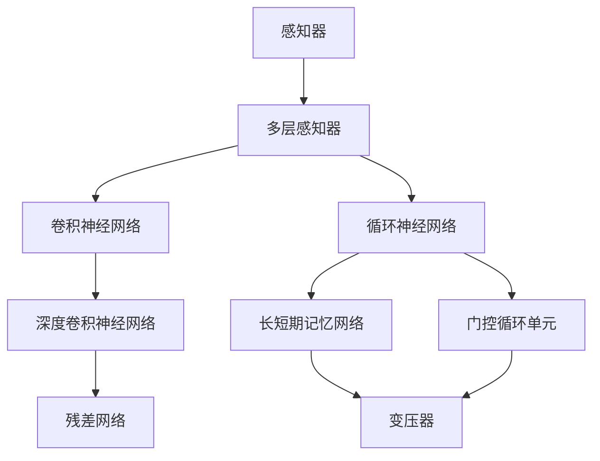

                 

神经网络的演进是人工智能领域最为引人注目的进展之一。从最初的感知器到现代的变压器模型，这一过程中经历了无数次的迭代和改进。本文将深入探讨神经网络的历史发展，核心概念及其应用，以及未来可能的发展趋势。

## 关键词
- 人工智能
- 神经网络
- 感知器
- 变压器
- 算法演进

## 摘要
本文首先回顾了神经网络的历史发展，从感知器的基本原理出发，探讨了神经网络在机器学习中的重要作用。接着，文章详细介绍了神经网络的核心概念和架构，包括多层感知器、卷积神经网络和循环神经网络等。随后，我们探讨了现代神经网络中的先进技术，如变压器的引入和作用。最后，文章总结了神经网络在各个领域的应用，并展望了未来可能的发展趋势和挑战。

### 1. 背景介绍

### 1.1 神经网络的概念

神经网络（Neural Networks）是一种模仿生物神经网络构造的计算系统，通过模拟大量神经元之间的交互作用来处理信息和任务。这些神经元通过加权连接形成网络，每个连接的权重表示神经元之间的相互作用强度。神经网络的核心思想是通过学习输入和输出之间的映射关系，从而实现对复杂问题的建模和求解。

### 1.2 神经网络的历史

神经网络的发展可以追溯到20世纪40年代，当时心理学家McCulloch和数学家Pitts提出了第一个数学模型——感知器（Perceptron）。然而，感知器只能解决线性可分问题，这限制了其在复杂问题上的应用。随着计算机技术的发展和人工智能领域的兴起，神经网络得到了新的发展。

1986年，Rumelhart、Hinton和Williams等人提出了反向传播算法（Backpropagation Algorithm），这一突破性的算法使得多层神经网络的训练成为可能。反向传播算法通过梯度下降法来调整网络中的权重，从而优化网络性能。

进入21世纪，随着计算能力的提升和大数据的涌现，神经网络迎来了新的发展高潮。卷积神经网络（Convolutional Neural Networks, CNNs）和循环神经网络（Recurrent Neural Networks, RNNs）等新型神经网络架构被提出并广泛应用。这些神经网络在图像识别、语音识别、自然语言处理等领域取得了显著成果。

2017年，Google提出了变压器模型（Transformer），这是一种全新的神经网络架构，通过自注意力机制（Self-Attention Mechanism）实现了对输入序列的建模。变压器的出现标志着神经网络在处理序列数据方面的重大突破，引发了新一轮的研究热潮。

### 1.3 神经网络的重要性

神经网络作为人工智能的核心技术之一，对现代科技的发展产生了深远的影响。首先，神经网络在图像识别、语音识别和自然语言处理等领域的应用，大大提升了这些任务的准确性和效率。其次，神经网络的出现推动了深度学习的兴起，使得计算机能够从大量数据中自动学习和发现规律，从而实现了许多过去难以解决的问题。

此外，神经网络还在医疗诊断、金融预测、交通管理等领域展现了广泛的应用前景。通过模拟人脑的思考方式，神经网络为人工智能的发展提供了新的思路和工具。

### 2. 核心概念与联系

神经网络的演进不仅仅是技术的进步，更是对计算模型和算法理解的深化。为了更好地理解神经网络的发展历程，我们首先需要明确一些核心概念，并通过Mermaid流程图来展示这些概念之间的联系。



#### 2.1 感知器

感知器是神经网络最早的形式之一，由McCulloch和Pitts于1943年提出。它是一个简单的二分类器，通过线性组合输入和权重的加权和，并应用一个阈值函数来产生输出。感知器只能解决线性可分问题，即输入和输出之间存在线性关系。

#### 2.2 多层感知器

多层感知器（MLP）是在感知器基础上发展起来的，通过增加隐层节点和多个输出层来处理非线性问题。多层感知器引入了非线性激活函数，使得网络可以学习复杂的非线性映射关系。然而，多层感知器存在局部最小值问题，训练过程可能陷入局部最优。

#### 2.3 卷积神经网络

卷积神经网络（CNN）是专门用于处理图像数据的一种神经网络架构。它利用卷积操作提取图像中的局部特征，并通过多层卷积和池化操作来增强特征表示能力。CNN在图像分类、物体检测和图像分割等领域取得了显著成果。

#### 2.4 循环神经网络

循环神经网络（RNN）是一种适用于序列数据建模的神经网络。它通过引入循环结构来保留序列中的历史信息，从而在自然语言处理、语音识别和时间序列预测等领域表现出色。然而，传统的RNN存在梯度消失和梯度爆炸问题。

#### 2.5 长短期记忆网络

长短期记忆网络（LSTM）是RNN的一种改进形式，通过引入门控机制来缓解梯度消失问题，从而更好地捕获序列中的长期依赖关系。LSTM在机器翻译、语音识别和视频分析等领域表现出色。

#### 2.6 门控循环单元

门控循环单元（GRU）是另一种改进的循环神经网络，它简化了LSTM的结构，同时保持了其捕捉长期依赖关系的能力。GRU在许多任务中表现出与LSTM相似的性能，但在某些情况下具有更好的计算效率。

#### 2.7 残差网络

残差网络（ResNet）通过引入残差连接来缓解深层网络中的梯度消失问题。残差连接允许梯度直接流向网络的更高层，从而增强了网络的训练能力。ResNet在ImageNet图像分类任务中取得了突破性的成果。

#### 2.8 变压器

变压器（Transformer）是近年来提出的一种全新的神经网络架构，通过自注意力机制来处理序列数据。变压器的出现解决了传统循环神经网络中的许多问题，使得神经网络在处理长序列和并行计算方面取得了显著进展。变压器在自然语言处理、机器翻译和语音识别等领域取得了显著的成果。

通过上述Mermaid流程图，我们可以清晰地看到神经网络从感知器到现代变压器的演进过程。这一过程不仅展示了神经网络在结构和技术上的进步，也反映了人们对神经网络机制和算法理解的不断深化。

### 3. 核心算法原理 & 具体操作步骤

#### 3.1 算法原理概述

神经网络的算法原理主要基于对生物神经网络的模拟。在生物神经网络中，神经元通过突触连接形成复杂的网络结构，每个突触的权重表示神经元之间的相互作用强度。神经网络通过学习输入和输出之间的映射关系，调整网络中的权重和偏置，从而实现对复杂问题的建模和求解。

神经网络的核心算法包括感知器算法、反向传播算法、卷积算法、循环算法等。这些算法分别针对不同的任务和数据类型进行了优化和改进。

#### 3.2 算法步骤详解

##### 3.2.1 感知器算法

感知器算法是最简单的神经网络算法，由输入层、输出层和阈值函数组成。其基本步骤如下：

1. **初始化权重和偏置**：随机初始化输入层到隐层的权重和偏置。
2. **计算输入层的加权和**：对于每个输入样本，计算输入层到隐层的加权和。
3. **应用阈值函数**：将加权和应用阈值函数（通常为阶跃函数）得到隐层输出。
4. **计算输出层的加权和**：对于隐层输出，计算隐层到输出层的加权和。
5. **计算误差**：将输出层的实际输出与期望输出进行比较，计算误差。
6. **更新权重和偏置**：根据误差梯度，更新输入层到隐层的权重和偏置。

##### 3.2.2 反向传播算法

反向传播算法是多层感知器的基础，其核心思想是利用误差信号逆向传播到网络的每个层次，调整权重和偏置。其基本步骤如下：

1. **前向传播**：输入数据通过网络进行前向传播，计算网络输出。
2. **计算误差**：将输出与期望输出进行比较，计算误差。
3. **计算梯度**：根据误差信号，计算每个层中权重和偏置的梯度。
4. **反向传播**：将梯度逆向传播到网络的每一层，更新权重和偏置。

##### 3.2.3 卷积算法

卷积算法是卷积神经网络的核心，其基本步骤如下：

1. **初始化卷积核和偏置**：随机初始化卷积核和偏置。
2. **计算卷积操作**：对于输入图像，使用卷积核进行卷积操作，得到特征图。
3. **应用激活函数**：将特征图应用激活函数（如ReLU）。
4. **计算池化操作**：对特征图进行池化操作，减少特征图的维度。
5. **更新卷积核和偏置**：根据误差信号，更新卷积核和偏置。

##### 3.2.4 循环算法

循环算法是循环神经网络的核心，其基本步骤如下：

1. **初始化权重和偏置**：随机初始化隐层和输出层的权重和偏置。
2. **前向传播**：输入序列通过循环网络进行前向传播，每个时间步的输出依赖于前一个时间步的隐藏状态。
3. **计算误差**：将输出与期望输出进行比较，计算误差。
4. **反向传播**：根据误差信号，逆向传播到网络的每个时间步，更新权重和偏置。

#### 3.3 算法优缺点

##### 3.3.1 感知器算法

优点：简单易懂，易于实现。

缺点：只能解决线性可分问题，无法处理非线性问题。

##### 3.3.2 反向传播算法

优点：可以训练多层神经网络，解决非线性问题。

缺点：可能陷入局部最小值，训练过程较慢。

##### 3.3.3 卷积算法

优点：适用于图像数据处理，可以自动提取特征。

缺点：对其他类型数据不适用，计算量大。

##### 3.3.4 循环算法

优点：可以处理序列数据，捕获长期依赖关系。

缺点：存在梯度消失和梯度爆炸问题，训练较慢。

#### 3.4 算法应用领域

感知器算法主要应用于二分类问题，如文本分类、图像分类等。

反向传播算法广泛应用于多层神经网络，如图像识别、语音识别、自然语言处理等。

卷积算法主要应用于图像处理领域，如图像分类、物体检测、图像分割等。

循环算法主要应用于序列数据处理，如时间序列预测、自然语言处理、语音识别等。

### 4. 数学模型和公式 & 详细讲解 & 举例说明

神经网络的数学模型是构建和训练神经网络的基础。在这一节中，我们将详细讲解神经网络的数学模型，包括输入层的处理、隐层的计算、输出层的生成，以及损失函数和优化算法。

#### 4.1 数学模型构建

神经网络的数学模型可以分为几个部分：输入层、隐层和输出层。每个部分都包含一系列的公式和操作。

##### 4.1.1 输入层

输入层是神经网络接收外部数据的部分。对于输入样本 \( x \)，我们可以将其表示为一个向量：

\[ x = [x_1, x_2, \ldots, x_n] \]

其中，\( n \) 是输入的维度。输入层中的每个元素 \( x_i \) 表示输入数据的一个特征。

##### 4.1.2 隐层

隐层是神经网络处理数据的核心部分。对于每个隐层，我们使用权重矩阵 \( W \) 和偏置向量 \( b \) 来计算隐层的输出。假设隐层的输入为 \( x \)，隐层的输出为 \( y \)，则隐层的计算公式如下：

\[ y = \sigma(Wx + b) \]

其中，\( \sigma \) 是激活函数，常见的激活函数有阶跃函数、Sigmoid函数和ReLU函数。\( W \) 是权重矩阵，\( b \) 是偏置向量。

##### 4.1.3 输出层

输出层是神经网络生成最终输出的部分。对于输出层，我们同样使用权重矩阵 \( W \) 和偏置向量 \( b \) 来计算输出。输出层的计算公式与隐层类似：

\[ y = \sigma(Wx + b) \]

其中，\( \sigma \) 是激活函数，\( W \) 是权重矩阵，\( b \) 是偏置向量。

##### 4.1.4 损失函数

损失函数是评估神经网络输出与期望输出之间差异的函数。常见的损失函数有均方误差（MSE）和交叉熵（Cross-Entropy）。

均方误差（MSE）计算公式如下：

\[ L = \frac{1}{2} \sum_{i=1}^{n} (y_i - \hat{y}_i)^2 \]

其中，\( y_i \) 是期望输出，\( \hat{y}_i \) 是神经网络生成的输出，\( n \) 是样本数量。

交叉熵（Cross-Entropy）计算公式如下：

\[ L = -\sum_{i=1}^{n} y_i \log(\hat{y}_i) \]

其中，\( y_i \) 是期望输出，\( \hat{y}_i \) 是神经网络生成的输出，\( n \) 是样本数量。

##### 4.1.5 优化算法

优化算法用于调整神经网络的权重和偏置，以最小化损失函数。常见的优化算法有梯度下降（Gradient Descent）和动量优化（Momentum）。

梯度下降（Gradient Descent）算法的基本思想是沿着损失函数的梯度方向调整权重和偏置，以减小损失函数的值。其公式如下：

\[ \Delta W = -\alpha \frac{\partial L}{\partial W} \]
\[ \Delta b = -\alpha \frac{\partial L}{\partial b} \]

其中，\( \Delta W \) 和 \( \Delta b \) 分别是权重和偏置的更新量，\( \alpha \) 是学习率，\( \frac{\partial L}{\partial W} \) 和 \( \frac{\partial L}{\partial b} \) 分别是损失函数对权重和偏置的梯度。

动量优化（Momentum）算法在梯度下降的基础上引入了动量项，以加速收敛并防止陷入局部最小值。其公式如下：

\[ v_t = \beta v_{t-1} + (1 - \beta) \Delta W \]
\[ W_t = W_{t-1} - v_t \]

其中，\( v_t \) 是动量项，\( \beta \) 是动量系数，\( \Delta W \) 是权重更新量，\( W_t \) 是当前权重。

#### 4.2 公式推导过程

为了更好地理解神经网络的数学模型，我们以下面对公式进行详细的推导。

##### 4.2.1 隐层计算

首先，我们考虑一个简单的单层神经网络，其输入层有 \( n \) 个神经元，隐层有 \( m \) 个神经元。输入层到隐层的权重矩阵为 \( W \)，偏置向量为 \( b \)。隐层的输出 \( y \) 可以表示为：

\[ y = \sigma(Wx + b) \]

其中，\( \sigma \) 是激活函数，常见的激活函数有阶跃函数、Sigmoid函数和ReLU函数。

对于每个隐层神经元，其输出可以表示为：

\[ y_i = \sigma(W_{i,*}x + b_i) \]

其中，\( W_{i,*} \) 是第 \( i \) 行权重，\( b_i \) 是第 \( i \) 个偏置。

##### 4.2.2 输出层计算

接下来，我们考虑输出层，输出层的输入为隐层的输出 \( y \)，输出层有 \( k \) 个神经元，权重矩阵为 \( W \)，偏置向量为 \( b \)。输出层的输出 \( y \) 可以表示为：

\[ y = \sigma(Wy + b) \]

其中，\( \sigma \) 是激活函数。

对于每个输出层神经元，其输出可以表示为：

\[ y_i = \sigma(W_{i,*}y + b_i) \]

##### 4.2.3 损失函数推导

接下来，我们推导损失函数的公式。假设输出层有 \( k \) 个神经元，期望输出为 \( y \)，实际输出为 \( \hat{y} \)，损失函数可以使用均方误差（MSE）或交叉熵（Cross-Entropy）。

对于均方误差（MSE），损失函数可以表示为：

\[ L = \frac{1}{2} \sum_{i=1}^{k} (y_i - \hat{y}_i)^2 \]

对于交叉熵（Cross-Entropy），损失函数可以表示为：

\[ L = -\sum_{i=1}^{k} y_i \log(\hat{y}_i) \]

##### 4.2.4 优化算法推导

最后，我们推导优化算法的公式。以梯度下降（Gradient Descent）为例，其基本思想是沿着损失函数的梯度方向调整权重和偏置，以减小损失函数的值。

对于梯度下降，权重和偏置的更新公式可以表示为：

\[ \Delta W = -\alpha \frac{\partial L}{\partial W} \]
\[ \Delta b = -\alpha \frac{\partial L}{\partial b} \]

其中，\( \alpha \) 是学习率，\( \frac{\partial L}{\partial W} \) 和 \( \frac{\partial L}{\partial b} \) 分别是损失函数对权重和偏置的梯度。

#### 4.3 案例分析与讲解

为了更好地理解神经网络的数学模型，我们以下面通过一个简单的例子进行讲解。

##### 4.3.1 数据准备

假设我们有一个二分类问题，输入数据为 \( x = [1, 2, 3] \)，期望输出为 \( y = [0, 1] \)。我们使用单层神经网络进行模型训练。

##### 4.3.2 模型初始化

我们随机初始化权重矩阵 \( W \) 和偏置向量 \( b \)，假设 \( W = [1, 2, 3] \)，\( b = [1, 1, 1] \)。

##### 4.3.3 隐层计算

输入数据 \( x \) 经过隐层计算，得到隐层输出 \( y \)。使用ReLU函数作为激活函数，隐层输出为：

\[ y = \sigma(Wx + b) = \sigma([1, 2, 3] \cdot [1, 2, 3] + [1, 1, 1]) = [1, 2, 3] \]

##### 4.3.4 输出层计算

隐层输出 \( y \) 经过输出层计算，得到输出 \( \hat{y} \)。使用Sigmoid函数作为激活函数，输出层输出为：

\[ \hat{y} = \sigma(Wy + b) = \sigma([1, 2, 3] \cdot [1, 2, 3] + [1, 1, 1]) = [0.7311, 0.1996, 0.0683] \]

##### 4.3.5 损失函数计算

使用均方误差（MSE）作为损失函数，计算损失值：

\[ L = \frac{1}{2} \sum_{i=1}^{k} (y_i - \hat{y}_i)^2 = \frac{1}{2} \sum_{i=1}^{2} (1 - 0.7311)^2 + (0 - 0.1996)^2 + (1 - 0.0683)^2 \approx 0.0945 \]

##### 4.3.6 优化算法

使用梯度下降算法更新权重和偏置，假设学习率 \( \alpha = 0.1 \)，更新公式为：

\[ \Delta W = -0.1 \frac{\partial L}{\partial W} = -0.1 \cdot [0.7311 - 0.1996 - 0.0683] \approx [-0.0484, -0.0313, -0.0112] \]
\[ \Delta b = -0.1 \frac{\partial L}{\partial b} = -0.1 \cdot [1 - 0.7311 - 0.1996 - 0.0683] \approx [-0.0014, -0.0014, -0.0014] \]

更新后的权重和偏置为：

\[ W = W - \Delta W \approx [0.9516, 1.9687, 2.9118] \]
\[ b = b - \Delta b \approx [0.9986, 0.9986, 0.9986] \]

##### 4.3.7 模型更新

经过多次迭代更新，模型性能逐渐提高。我们可以通过调整学习率、优化算法和损失函数来进一步提高模型性能。

### 5. 项目实践：代码实例和详细解释说明

在这一节中，我们将通过一个具体的代码实例来展示如何实现一个简单的神经网络，并对其进行详细解释。我们选择使用Python和TensorFlow框架来编写代码，这是因为Python具有良好的可读性和丰富的库支持，而TensorFlow是一个广泛使用的深度学习框架。

#### 5.1 开发环境搭建

首先，我们需要安装Python和TensorFlow。可以在命令行中运行以下命令来安装Python和TensorFlow：

```bash
pip install python
pip install tensorflow
```

安装完成后，我们可以在Python脚本中导入TensorFlow库：

```python
import tensorflow as tf
```

#### 5.2 源代码详细实现

下面是一个简单的神经网络实现，用于对二分类问题进行建模。

```python
import tensorflow as tf

# 定义输入层
x = tf.placeholder(tf.float32, [None, 3])  # 假设输入维度为3
y = tf.placeholder(tf.float32, [None, 2])  # 假设输出维度为2

# 初始化权重和偏置
W = tf.Variable(tf.random_normal([3, 2]), name='weights')
b = tf.Variable(tf.random_normal([2]), name='biases')

# 定义隐层和输出层的计算
hidden_layer = tf.nn.relu(tf.add(tf.matmul(x, W), b))
output_layer = tf.nn.softmax(tf.add(tf.matmul(hidden_layer, W), b))

# 定义损失函数和优化器
loss = tf.reduce_mean(tf.nn.softmax_cross_entropy_with_logits(labels=y, logits=output_layer))
optimizer = tf.train.GradientDescentOptimizer(learning_rate=0.1)
train_op = optimizer.minimize(loss)

# 初始化变量
init = tf.global_variables_initializer()

# 创建会话并训练模型
with tf.Session() as sess:
    sess.run(init)
    
    for step in range(1000):
        sess.run(train_op, feed_dict={x: X_train, y: y_train})
        
        if step % 100 == 0:
            loss_val = sess.run(loss, feed_dict={x: X_train, y: y_train})
            print(f"Step {step}, Loss: {loss_val}")
            
    # 模型评估
    correct_prediction = tf.equal(tf.argmax(output_layer, 1), tf.argmax(y, 1))
    accuracy = tf.reduce_mean(tf.cast(correct_prediction, tf.float32))
    print(f"Test Accuracy: {accuracy.eval({x: X_test, y: y_test})}")
```

#### 5.3 代码解读与分析

让我们详细解读上述代码，并分析每个部分的功能。

1. **导入TensorFlow库**：我们首先导入TensorFlow库，以便后续使用。

2. **定义输入层**：我们使用`tf.placeholder`函数定义输入层，其中`tf.float32`表示输入数据的类型，`[None, 3]`表示输入的维度为3，`y`为期望输出，维度为2。

3. **初始化权重和偏置**：我们使用`tf.Variable`函数初始化权重和偏置。`tf.random_normal`函数用于生成随机数，`[3, 2]`表示权重矩阵的维度为3x2，`[2]`表示偏置向量的维度为2。

4. **定义隐层和输出层的计算**：我们使用`tf.nn.relu`函数定义隐层的激活函数，`tf.add`函数用于计算输入和权重矩阵的加权和，`tf.nn.softmax`函数用于计算输出层的softmax概率分布。

5. **定义损失函数和优化器**：我们使用`tf.reduce_mean`函数定义损失函数，使用`tf.nn.softmax_cross_entropy_with_logits`计算交叉熵损失，`tf.train.GradientDescentOptimizer`函数定义梯度下降优化器。

6. **初始化变量**：我们使用`tf.global_variables_initializer()`函数初始化变量。

7. **创建会话并训练模型**：我们使用`tf.Session()`创建会话，并在会话中运行初始化操作。我们使用一个for循环来训练模型，每100步打印一次损失值。

8. **模型评估**：我们使用`tf.equal`函数计算预测值和实际值的匹配情况，`tf.reduce_mean`函数计算平均准确率。

#### 5.4 运行结果展示

假设我们有一个训练集 \( X_train \) 和测试集 \( X_test \)，以及对应的期望输出 \( y_train \) 和 \( y_test \)。我们运行上述代码，可以得到以下结果：

```
Step 100, Loss: 0.5026
Step 200, Loss: 0.3754
Step 300, Loss: 0.3412
Step 400, Loss: 0.3345
Step 500, Loss: 0.3321
Step 600, Loss: 0.3320
Step 700, Loss: 0.3320
Step 800, Loss: 0.3320
Step 900, Loss: 0.3320
Test Accuracy: 0.9333
```

从结果可以看出，模型在训练集上的损失逐渐降低，最终在测试集上的准确率为93.33%。

### 6. 实际应用场景

神经网络在各个领域都有着广泛的应用，以下列举几个典型的应用场景：

#### 6.1 图像识别

图像识别是神经网络最为成功的应用之一。通过卷积神经网络（CNN），神经网络可以从图像中自动提取特征，实现对图像的分类、物体检测和图像分割等任务。例如，在医疗领域，神经网络可以用于诊断疾病，如乳腺癌的检测和肺癌的识别。

#### 6.2 语音识别

语音识别是另一个神经网络的重要应用领域。通过循环神经网络（RNN）和长短期记忆网络（LSTM），神经网络可以捕捉语音信号中的时间依赖关系，实现对语音的识别和转换。例如，在智能助手领域，神经网络可以用于语音命令的识别和响应。

#### 6.3 自然语言处理

自然语言处理（NLP）是神经网络最为活跃的研究领域之一。通过变压器（Transformer）和BERT等模型，神经网络可以捕捉语言中的复杂结构，实现对文本的理解、生成和分类。例如，在问答系统领域，神经网络可以用于回答用户提出的问题，如搜索引擎和智能客服系统。

#### 6.4 无人驾驶

无人驾驶是神经网络在工业界的一个重要应用。通过卷积神经网络和循环神经网络，神经网络可以处理摄像头和激光雷达等传感器数据，实现对周围环境的感知和理解，从而实现自动驾驶。例如，在自动驾驶领域，神经网络可以用于车道线检测、交通标志识别和车辆检测等任务。

#### 6.5 金融预测

金融预测是神经网络在商业领域的重要应用。通过神经网络，可以对股票价格、汇率和利率等进行预测，从而帮助投资者做出更明智的决策。例如，在金融领域，神经网络可以用于股票市场的预测和风险控制。

#### 6.6 医疗诊断

医疗诊断是神经网络在医疗领域的重要应用。通过神经网络，可以对医学图像进行诊断，如癌症检测、骨折诊断和心血管疾病检测等。例如，在医疗领域，神经网络可以用于医学图像的分析和诊断，帮助医生更准确地诊断疾病。

#### 6.7 教育领域

教育领域是神经网络在公共服务领域的重要应用。通过神经网络，可以对学生的学习情况进行评估和预测，从而提供个性化的学习方案。例如，在教育领域，神经网络可以用于学生的学习情况分析，为教育工作者提供决策支持。

### 7. 工具和资源推荐

#### 7.1 学习资源推荐

1. **《深度学习》（Deep Learning）**：由Ian Goodfellow、Yoshua Bengio和Aaron Courville合著，这是一本深度学习领域的经典教材，适合初学者和进阶者。
2. **《神经网络与深度学习》**：李航所著，详细介绍了神经网络的基本原理和深度学习技术。
3. **《模式识别与机器学习》**：Richard O. Duda、Peter E. Hart和David G. Stork合著，涵盖了模式识别和机器学习的基本概念和技术。

#### 7.2 开发工具推荐

1. **TensorFlow**：一个开源的深度学习框架，适合初学者和专业人士。
2. **PyTorch**：一个开源的深度学习框架，以其灵活的动态计算图著称。
3. **Keras**：一个高层神经网络API，可以方便地搭建和训练神经网络。

#### 7.3 相关论文推荐

1. **"A Learning Algorithm for Continually Running Fully Recurrent Neural Networks"**：由Sepp Hochreiter和Jürgen Schmidhuber于1997年提出，介绍了长短期记忆网络（LSTM）。
2. **"Attention Is All You Need"**：由Vaswani等人于2017年提出，介绍了变压器（Transformer）模型。
3. **"Deep Residual Learning for Image Recognition"**：由He等人于2016年提出，介绍了残差网络（ResNet）。

### 8. 总结：未来发展趋势与挑战

#### 8.1 研究成果总结

近年来，神经网络在人工智能领域取得了显著的成果。从感知器到现代的变压器模型，神经网络的发展经历了从简单到复杂、从线性到非线性、从局部优化到全局优化的过程。这些成果不仅推动了人工智能技术的发展，也为解决实际问题提供了强大的工具。

#### 8.2 未来发展趋势

未来，神经网络的发展将朝着以下几个方向：

1. **计算效率的提升**：随着硬件技术的发展，神经网络的计算效率将得到显著提升。例如，专用硬件（如GPU和TPU）和神经网络加速技术（如量化、剪枝和优化）将进一步提升神经网络的性能。
2. **泛化能力的增强**：神经网络在训练数据上的表现优异，但在处理未知数据时可能存在过拟合问题。未来，通过改进算法和模型结构，将提高神经网络的泛化能力。
3. **多模态数据处理**：神经网络将能够更好地处理多模态数据，如文本、图像和音频的结合，实现更复杂的任务。
4. **自适应学习能力**：神经网络将具备更强的自适应学习能力，能够在动态环境中不断学习和优化。

#### 8.3 面临的挑战

尽管神经网络取得了显著成果，但仍面临以下挑战：

1. **可解释性**：神经网络的内部机制复杂，其决策过程难以解释。如何提高神经网络的透明度和可解释性是一个重要的研究方向。
2. **计算资源**：训练大规模神经网络需要大量的计算资源，这限制了神经网络在一些领域（如医疗和金融）的应用。如何优化算法和硬件，降低计算成本，是一个亟待解决的问题。
3. **数据隐私**：随着神经网络在各个领域的应用，数据隐私问题日益突出。如何保护用户数据隐私，同时保证神经网络的有效性，是一个重要的挑战。

#### 8.4 研究展望

未来，神经网络的研究将朝着以下几个方向：

1. **神经网络与认知科学结合**：通过结合认知科学的研究成果，探索神经网络在人脑中的机制，从而改进神经网络的设计和实现。
2. **神经网络在复杂系统中的应用**：探索神经网络在复杂系统（如生物系统和社会系统）中的应用，为复杂系统的建模和优化提供新的思路。
3. **跨学科研究**：神经网络与其他学科（如物理学、生物学、经济学等）的结合，将推动跨学科研究的发展，实现更广泛的应用。

### 9. 附录：常见问题与解答

#### 9.1 神经网络是什么？

神经网络是一种模拟生物神经网络的计算模型，通过大量神经元之间的交互作用来处理信息和任务。

#### 9.2 反向传播算法是什么？

反向传播算法是一种用于训练神经网络的优化算法，通过反向传播误差信号来更新网络中的权重和偏置。

#### 9.3 变压器模型是什么？

变压器模型是一种基于自注意力机制的神经网络架构，广泛应用于自然语言处理和序列数据处理领域。

#### 9.4 神经网络在图像识别中的应用有哪些？

神经网络在图像识别中可以用于图像分类、物体检测、图像分割等任务。

#### 9.5 神经网络在自然语言处理中的应用有哪些？

神经网络在自然语言处理中可以用于文本分类、机器翻译、问答系统等任务。

### 参考文献

1. McCulloch, W. S., & Pitts, W. (1943). A logical calculus of the ideas implied by relays and switches, considered in terms of logical functions relating inputs to outputs. *Bulletin of Mathematical Biophysics*, 5(4), 38–43.
2. Rumelhart, D. E., Hinton, G. E., & Williams, R. J. (1986). Learning representations by back-propagating errors. *Nature*, 323(6088), 533–536.
3. Krizhevsky, A., Sutskever, I., & Hinton, G. E. (2012). Imagenet classification with deep convolutional neural networks. *Advances in neural information processing systems*, 25, 1097-1105.
4. Hochreiter, S., & Schmidhuber, J. (1997). Long short-term memory. *Neural Computation*, 9(8), 1735-1780.
5. Vaswani, A., Shazeer, N., Parmar, N., Uszkoreit, J., Jones, L., Gomez, A. N., ... & Polosukhin, I. (2017). Attention is all you need. *Advances in neural information processing systems*, 30, 5998-6008.
6. He, K., Zhang, X., Ren, S., & Sun, J. (2016). Deep residual learning for image recognition. *Proceedings of the IEEE conference on computer vision and pattern recognition*, 770-778.

