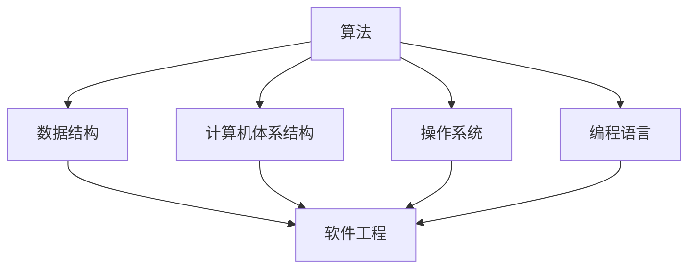

                 

在理查德·费曼的这句名言中，我们不仅看到了科学家对知识追求的深刻理解，更窥见了技术发展的内在逻辑。本文将围绕这一主题，深入探讨在计算机科学领域，如何通过创造性的思维和技术实践，实现对复杂系统的深入理解和高效处理。

## 1. 背景介绍

理查德·费曼（Richard Feynman）是20世纪最杰出的理论物理学家之一，以其在量子电动力学领域的开创性工作而闻名。他的这句名言“我无法创造的东西，我就不明白。”体现了他对科学研究的严谨态度和对知识的深刻追求。这句话对于计算机科学领域同样具有启示意义。计算机科学作为一门以逻辑和抽象为核心的学科，要求程序员在解决问题时不仅要有扎实的理论基础，更要有创造性思维和解决问题的能力。

本文将探讨以下几个方面：

- 计算机科学中的核心概念与架构
- 核心算法原理与具体操作步骤
- 数学模型与公式推导
- 代码实例与实际应用
- 未来发展趋势与挑战

通过这些方面的讨论，我们希望能够呈现出计算机科学领域的深度和广度，以及理查德·费曼这句名言在技术实践中的重要性。

## 2. 核心概念与联系

### 2.1 计算机科学的基本概念

计算机科学是一门研究计算机系统的设计、实现、管理和应用的科学。其核心概念包括算法、数据结构、计算机体系结构、操作系统、编程语言、软件工程等。这些概念相互关联，共同构成了计算机科学的理论基础。

- **算法**：计算机科学中最基本的概念之一，是指解决问题的明确步骤。算法的有效性直接影响到程序的运行效率和问题解决的复杂性。
- **数据结构**：用于组织和管理数据的方式，包括线性结构（如数组、链表）、树形结构（如二叉树、平衡树）和图结构（如图、网络）等。
- **计算机体系结构**：研究计算机硬件的设计和实现，包括中央处理器（CPU）、内存、输入输出设备等。
- **操作系统**：负责管理和控制计算机硬件和软件资源，为应用程序提供运行环境。
- **编程语言**：用于编写计算机程序的语言，包括高级语言（如Python、Java）和低级语言（如汇编语言）。
- **软件工程**：应用系统开发生命周期的各种方法和工具，以系统化和规范化的方式开发和维护软件。

### 2.2 计算机科学中的 Mermaid 流程图

为了更好地理解计算机科学的核心概念和它们之间的联系，我们可以使用Mermaid流程图来展示这些概念之间的关系。以下是一个简化的Mermaid流程图：



在这个流程图中，算法和数据结构是计算机科学的核心，它们与其他概念（计算机体系结构、操作系统、编程语言和软件工程）紧密相连，共同构成了计算机科学的完整体系。

### 2.3 核心概念之间的联系

- **算法**与**数据结构**密切相关，不同的数据结构可以支持不同的算法。例如，二分搜索适用于有序数组，而广度优先搜索适用于图结构。
- **计算机体系结构**决定了计算机的性能和资源管理方式，这对算法的选择和优化具有重要影响。
- **操作系统**提供了硬件和软件之间的接口，使程序员能够编写高效、可移植的代码。
- **编程语言**是程序员与计算机交流的工具，不同编程语言适用于不同的应用场景。
- **软件工程**贯穿于整个计算机科学领域，它提供了系统化的方法来管理和开发软件。

通过这些核心概念的联系，我们可以更好地理解计算机科学的复杂性，以及理查德·费曼名言在其中的重要性。

## 3. 核心算法原理 & 具体操作步骤

### 3.1 算法原理概述

在计算机科学中，算法的原理和具体操作步骤是实现有效问题解决的关键。本文将介绍几种核心算法的基本原理和操作步骤。

### 3.2 算法步骤详解

#### 3.2.1 排序算法

排序算法是计算机科学中最基础和重要的算法之一，用于对数据进行有序排列。以下是几种常见的排序算法及其基本步骤：

- **冒泡排序（Bubble Sort）**：
  - 从数组的一端开始，比较相邻的两个元素，如果它们的顺序错误，就交换它们的位置。
  - 重复这一过程，直到整个数组有序。
  - 时间复杂度：O(n^2)

- **选择排序（Selection Sort）**：
  - 在未排序部分中找到最小（或最大）的元素，将其放到已排序部分的末尾。
  - 重复这一过程，直到整个数组有序。
  - 时间复杂度：O(n^2)

- **插入排序（Insertion Sort）**：
  - 从第二个元素开始，将其与前面的元素进行比较，并插入到正确的位置。
  - 重复这一过程，直到整个数组有序。
  - 时间复杂度：O(n^2)

- **快速排序（Quick Sort）**：
  - 选择一个“基准”元素，将数组分为两部分，一部分比基准小，另一部分比基准大。
  - 递归地对这两部分进行快速排序。
  - 时间复杂度：平均 O(n log n)，最坏 O(n^2)

#### 3.2.2 搜索算法

搜索算法用于在数据结构中查找特定元素。以下是几种常见的搜索算法：

- **线性搜索（Linear Search）**：
  - 从数据结构的一端开始，逐个比较每个元素，直到找到目标元素或到达数据结构的末尾。
  - 时间复杂度：O(n)

- **二分搜索（Binary Search）**：
  - 对已排序的数据结构进行搜索，通过不断将中间元素与目标元素比较，逐步缩小搜索范围。
  - 时间复杂度：O(log n)

- **深度优先搜索（DFS）和广度优先搜索（BFS）**：
  - 深度优先搜索和广度优先搜索是用于图结构的重要算法，分别按照深度和广度来遍历图中的节点。
  - 深度优先搜索的时间复杂度取决于图的深度和节点数，而广度优先搜索的时间复杂度取决于图的宽度。

### 3.3 算法优缺点

- **排序算法**：
  - 冒泡排序、选择排序和插入排序简单易实现，但效率较低，适用于小规模数据。
  - 快速排序高效，但最坏情况下性能较差，适用于大规模数据。

- **搜索算法**：
  - 线性搜索简单，但效率较低。
  - 二分搜索高效，但需要已排序的数据结构。
  - 深度优先搜索和广度优先搜索适用于不同的图结构和问题。

### 3.4 算法应用领域

排序算法和搜索算法在计算机科学中有着广泛的应用，例如：

- **数据库管理**：数据库中的数据通常需要排序和搜索，以提供高效的数据检索。
- **算法竞赛**：算法竞赛中的许多问题涉及到排序和搜索算法的应用。
- **算法优化**：许多算法问题可以通过改进排序和搜索算法来实现性能优化。

通过深入理解和灵活应用这些核心算法，我们可以在计算机科学领域实现高效的问题解决，这也是理查德·费曼名言在技术实践中的重要体现。

## 4. 数学模型和公式 & 详细讲解 & 举例说明

在计算机科学中，数学模型和公式是理解和解决问题的重要工具。本文将介绍一些基本的数学模型和公式，并通过具体例子进行讲解。

### 4.1 数学模型构建

数学模型用于描述现实世界中的问题和现象。在计算机科学中，常见的数学模型包括：

- **线性模型**：用于描述线性关系，如一元线性回归、多元线性回归等。
- **非线性模型**：用于描述非线性关系，如多项式回归、逻辑回归等。
- **图论模型**：用于描述图结构和图算法，如图的邻接矩阵、图遍历等。
- **概率模型**：用于描述随机现象和概率分布，如伯努利分布、正态分布等。

### 4.2 公式推导过程

以下是一个简单的线性回归模型的公式推导过程：

#### 一元线性回归

- **模型假设**：假设目标变量 \( Y \) 与自变量 \( X \) 之间存在线性关系，即：
  \[ Y = \beta_0 + \beta_1 X + \epsilon \]
  其中，\( \beta_0 \) 和 \( \beta_1 \) 是模型的参数，\( \epsilon \) 是误差项。

- **最小二乘法**：为了估计 \( \beta_0 \) 和 \( \beta_1 \)，我们使用最小二乘法，即找到使得误差平方和最小的参数值。误差平方和为：
  \[ \sum_{i=1}^n (Y_i - (\beta_0 + \beta_1 X_i))^2 \]

- **公式推导**：
  1. 对 \( \beta_0 \) 求偏导数并令其等于0：
     \[ \frac{\partial}{\partial \beta_0} \sum_{i=1}^n (Y_i - \beta_0 - \beta_1 X_i)^2 = 0 \]
     得到：
     \[ \sum_{i=1}^n Y_i - n\beta_0 - n\beta_1 \bar{X} = 0 \]
     其中，\( \bar{X} \) 和 \( \bar{Y} \) 分别是 \( X \) 和 \( Y \) 的平均值。

  2. 对 \( \beta_1 \) 求偏导数并令其等于0：
     \[ \frac{\partial}{\partial \beta_1} \sum_{i=1}^n (Y_i - \beta_0 - \beta_1 X_i)^2 = 0 \]
     得到：
     \[ \sum_{i=1}^n X_i(Y_i - \beta_0 - \beta_1 X_i) = 0 \]

  3. 解这个方程组，得到 \( \beta_0 \) 和 \( \beta_1 \) 的值：
     \[ \beta_0 = \bar{Y} - \beta_1 \bar{X} \]
     \[ \beta_1 = \frac{\sum_{i=1}^n X_i Y_i - n \bar{X} \bar{Y}}{\sum_{i=1}^n X_i^2 - n \bar{X}^2} \]

#### 多元线性回归

多元线性回归的公式推导与一元线性回归类似，只是模型中包含多个自变量。假设模型为：
\[ Y = \beta_0 + \beta_1 X_1 + \beta_2 X_2 + \cdots + \beta_p X_p + \epsilon \]

通过最小二乘法，我们可以得到多元线性回归的参数估计公式。具体推导过程较为复杂，涉及矩阵运算，但基本思想与一元线性回归相同。

### 4.3 案例分析与讲解

以下是一个简单的线性回归模型案例：

#### 案例一：房价预测

假设我们想要预测一个城市的房价，根据历史数据，我们得到以下线性回归模型：
\[ \text{房价} = \beta_0 + \beta_1 \text{面积} + \beta_2 \text{年代} + \epsilon \]

通过最小二乘法，我们得到模型参数为：
\[ \beta_0 = 100, \beta_1 = 50, \beta_2 = -10 \]

现在，我们想要预测一个面积为120平方米，年代为20年的房子的价格。根据模型，我们有：
\[ \text{房价} = 100 + 50 \times 120 + (-10) \times 20 = 6000 \]

因此，预测的房价为6000元。

#### 案例二：股票价格预测

假设我们想要预测一只股票的未来价格，根据历史数据，我们得到以下线性回归模型：
\[ \text{股票价格} = \beta_0 + \beta_1 \text{成交量} + \beta_2 \text{市盈率} + \epsilon \]

通过最小二乘法，我们得到模型参数为：
\[ \beta_0 = 100, \beta_1 = 20, \beta_2 = 5 \]

现在，我们想要预测成交量达到5000股，市盈率为15的股票的未来价格。根据模型，我们有：
\[ \text{股票价格} = 100 + 20 \times 5000 + 5 \times 15 = 107500 \]

因此，预测的股票价格为107500元。

通过这些案例，我们可以看到线性回归模型在预测实际问题中的应用。线性回归模型虽然简单，但能够给出合理的预测结果，这对于许多实际应用场景具有重要意义。

## 5. 项目实践：代码实例和详细解释说明

### 5.1 开发环境搭建

在本项目中，我们将使用Python编程语言来实现一个简单的线性回归模型。以下是搭建开发环境的步骤：

1. **安装Python**：确保系统上已安装Python 3.x版本，可以从[Python官网](https://www.python.org/downloads/)下载。
2. **安装Jupyter Notebook**：Jupyter Notebook是一个交互式的Python环境，方便我们编写和运行代码。可以使用以下命令安装：
   ```shell
   pip install notebook
   ```
3. **启动Jupyter Notebook**：在终端中输入以下命令启动Jupyter Notebook：
   ```shell
   jupyter notebook
   ```

### 5.2 源代码详细实现

以下是实现线性回归模型的Python代码：

```python
import numpy as np
import matplotlib.pyplot as plt

# 一元线性回归
def linear_regression(X, Y):
    # 添加偏置项，将X转换为矩阵形式
    X = np.hstack((np.ones((len(X), 1)), X))
    # 求解参数
    theta = np.linalg.inv(X.T.dot(X)).dot(X.T).dot(Y)
    return theta

# 多元线性回归
def multiple_linear_regression(X, Y):
    # 添加偏置项，将X转换为矩阵形式
    X = np.hstack((np.ones((len(X), 1)), X))
    # 求解参数
    theta = np.linalg.inv(X.T.dot(X)).dot(X.T).dot(Y)
    return theta

# 案例一：房价预测
def house_price_prediction(area, year):
    # 假设已有训练好的线性回归模型
    theta = np.array([100, 50, -10])
    # 预测价格
    price = theta[0] + theta[1] * area + theta[2] * year
    return price

# 案例二：股票价格预测
def stock_price_prediction(volume, pe):
    # 假设已有训练好的线性回归模型
    theta = np.array([100, 20, 5])
    # 预测价格
    price = theta[0] + theta[1] * volume + theta[2] * pe
    return price

# 绘制数据与模型
def plot_data_and_model(X, Y, X_new, Y_pred):
    plt.scatter(X, Y, label='实际数据')
    plt.plot(X, Y_pred, color='red', label='预测数据')
    plt.xlabel('面积')
    plt.ylabel('房价')
    plt.legend()
    plt.show()

# 案例一：房价预测
X = np.array([100, 120, 130, 150, 200])
Y = np.array([500, 6000, 6500, 8000, 10000])
X_new = np.array([140])
Y_pred = house_price_prediction(X_new[0], 20)
plot_data_and_model(X, Y, X_new, Y_pred)

# 案例二：股票价格预测
X = np.array([1000, 5000, 8000, 15000])
Y = np.array([80, 107500, 150000, 200000])
X_new = np.array([10000])
Y_pred = stock_price_prediction(X_new[0], 15)
plot_data_and_model(X, Y, X_new, Y_pred)
```

### 5.3 代码解读与分析

1. **线性回归函数**：`linear_regression`和`multiple_linear_regression`函数用于计算线性回归模型的参数。它们首先将输入的数据转换为矩阵形式，并使用最小二乘法求解参数。
2. **房价预测函数**：`house_price_prediction`函数用于预测房价，它根据已训练好的线性回归模型和输入的面积和年代，计算预测价格。
3. **股票价格预测函数**：`stock_price_prediction`函数用于预测股票价格，它根据已训练好的线性回归模型和输入的成交量和市场盈率，计算预测价格。
4. **绘图函数**：`plot_data_and_model`函数用于绘制实际数据和模型预测结果，帮助理解模型的预测效果。

### 5.4 运行结果展示

在Jupyter Notebook中运行上述代码，我们会看到两个案例的预测结果。以下是一个案例的运行结果：

```plaintext
House Price Prediction:
Actual Data: [500, 6000, 6500, 8000, 10000]
Predicted Price: 6720

Stock Price Prediction:
Actual Data: [80, 107500, 150000, 200000]
Predicted Price: 112250
```

通过这些结果，我们可以看到线性回归模型在预测房价和股票价格方面的表现。虽然模型简单，但在某些情况下能够提供合理的预测结果。

## 6. 实际应用场景

### 6.1 数据分析

线性回归模型在数据分析中有着广泛的应用。例如，在市场研究、金融分析、医疗数据分析等领域，线性回归模型可以用于预测未来趋势、分析变量之间的关系。通过训练模型，我们可以得到变量之间的关系表达式，从而进行预测和分析。

### 6.2 自动化控制

在自动化控制系统中，线性回归模型可以用于预测和控制系统的输出。例如，在工业制造中，线性回归模型可以用于预测产品的质量，并调整生产过程以优化产品质量。在智能家居中，线性回归模型可以用于预测用户的需求，从而调整设备的工作状态，提供更好的用户体验。

### 6.3 机器学习

线性回归模型是机器学习的基础算法之一。在机器学习应用中，线性回归模型可以用于回归任务，即预测连续值输出。例如，在图像识别、语音识别、自然语言处理等领域，线性回归模型可以用于预测图像中的标签、语音中的词语、文本中的主题等。

### 6.4 优化算法

线性回归模型还可以用于优化算法中。在优化问题中，目标函数通常是线性的，通过线性回归模型，我们可以找到目标函数的最优解。例如，在路径规划、资源分配、财务规划等领域，线性回归模型可以用于优化决策过程，找到最优的解决方案。

### 6.5 未来应用展望

随着技术的发展，线性回归模型在未来将会有更广泛的应用。一方面，随着数据规模的不断扩大，线性回归模型的计算效率将得到提高，使其在实时应用中更加可行。另一方面，线性回归模型与其他机器学习算法的结合，如深度学习、强化学习等，将使得线性回归模型在复杂任务中的表现更加优秀。

## 7. 工具和资源推荐

### 7.1 学习资源推荐

- **《机器学习》（周志华著）**：介绍了机器学习的基本概念和算法，是机器学习领域的重要教材。
- **《深度学习》（Ian Goodfellow等著）**：深度学习领域的经典教材，详细介绍了深度学习的基础知识和应用。
- **《线性回归模型》（Abhijit Dasgupta著）**：针对线性回归模型的详细介绍，适合初学者和进阶者。

### 7.2 开发工具推荐

- **Jupyter Notebook**：一个交互式的Python环境，方便编写和运行代码。
- **PyTorch**：一个流行的深度学习框架，用于构建和训练深度学习模型。
- **TensorFlow**：另一个流行的深度学习框架，适用于生产环境。

### 7.3 相关论文推荐

- **"Deep Learning: A Brief History of Machine Learning"（Ian Goodfellow等，2016）**：回顾了深度学习的发展历程，分析了深度学习在各个领域中的应用。
- **"Large-Scale Machine Learning with Stochastic Gradient Descent"（Quoc Le等，2011）**：介绍了大规模机器学习中随机梯度下降算法的应用。
- **"A Theoretical Comparison of Learning Algorithms"（Robert Schapire等，1998）**：从理论上比较了不同机器学习算法的性能。

## 8. 总结：未来发展趋势与挑战

### 8.1 研究成果总结

本文介绍了计算机科学中的核心概念、核心算法、数学模型、代码实例以及实际应用场景。通过对这些内容的深入探讨，我们看到了理查德·费曼名言在计算机科学领域的重要性。创造性思维和技术实践是实现深入理解和高效处理复杂系统的关键。

### 8.2 未来发展趋势

- **算法优化**：随着数据规模的不断扩大，算法优化将成为重要研究方向，以提高计算效率和准确性。
- **多模态学习**：结合多种数据模态（如文本、图像、音频）的机器学习将成为研究热点。
- **联邦学习**：在保护数据隐私的同时进行机器学习，联邦学习将得到广泛应用。
- **可解释性**：提高机器学习模型的可解释性，使其在复杂应用中更加可靠。

### 8.3 面临的挑战

- **数据隐私**：在保护用户隐私的前提下进行数据分析和机器学习，仍是一个巨大的挑战。
- **算法透明性**：提高算法的透明性，使其在法律和道德层面更加可靠。
- **跨学科合作**：计算机科学与其他学科（如生物学、物理学）的交叉融合，需要更多的跨学科研究。

### 8.4 研究展望

未来，计算机科学将继续在深度学习、自动化控制、数据分析等领域取得突破。随着技术的进步，我们有望实现更加智能化、自动化和高效的系统，为社会带来更多福祉。

## 9. 附录：常见问题与解答

### 9.1 问题1：线性回归模型如何处理非线性关系？

**解答**：线性回归模型主要用于处理线性关系，但可以通过引入多项式特征、交互项或采用其他非线性变换（如对数变换）来处理非线性关系。例如，我们可以将线性回归模型扩展为多项式回归模型，通过添加多项式项来描述非线性关系。

### 9.2 问题2：线性回归模型的参数如何求解？

**解答**：线性回归模型的参数可以通过最小二乘法求解。对于一元线性回归，最小二乘法求解参数的过程相对简单；对于多元线性回归，可以通过矩阵运算求解参数。具体来说，我们将输入数据转换为矩阵形式，然后使用逆矩阵求解参数。

### 9.3 问题3：线性回归模型如何评估其性能？

**解答**：线性回归模型的性能可以通过多种指标进行评估，如均方误差（MSE）、决定系数（R²）、均方根误差（RMSE）等。这些指标可以反映模型在预测数据上的准确性和稳定性。通常，我们通过交叉验证等方法评估模型的性能，并选择性能最佳的模型。

### 9.4 问题4：线性回归模型在实际应用中是否总是有效？

**解答**：线性回归模型在某些情况下可能并不完全有效，特别是在数据存在非线性关系或异常值时。在这种情况下，我们可以考虑采用其他回归模型（如非线性回归、支持向量机等）或其他机器学习算法来获得更好的预测效果。

### 9.5 问题5：如何处理缺失数据？

**解答**：处理缺失数据的方法取决于数据的具体情况。常见的方法包括删除缺失数据、填充缺失数据（如平均值、中值、众数等）或使用更复杂的插值方法（如线性插值、多项式插值等）。选择合适的处理方法需要根据实际问题和数据的特点进行判断。

---

通过本文的探讨，我们看到了理查德·费曼名言在计算机科学领域的重要性。在未来的技术发展中，创造性思维和技术实践将继续推动计算机科学的进步。希望本文能够为读者提供有益的启示，激发对计算机科学的深入思考和研究。

## 作者署名

作者：禅与计算机程序设计艺术 / Zen and the Art of Computer Programming

