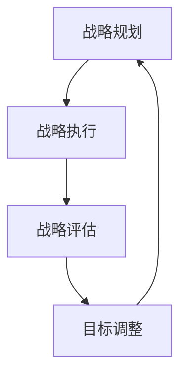

                 

关键词：战略管理、长期规划、IT领域、技术领导、执行效率、决策框架、创新驱动、资源分配、风险评估、敏捷管理。

> 摘要：本文探讨了在快速发展的信息技术领域，如何运用战略管理的方法制定和执行长期规划。通过剖析核心概念、算法原理、数学模型以及实际应用，为IT专业人士提供了一套系统化的战略管理框架，以应对未来的挑战和机遇。

## 1. 背景介绍

在当今这个数字化时代，信息技术（IT）正迅速改变着各行各业的面貌。作为推动变革的核心力量，IT企业需要具备前瞻性视野和科学的管理方法，以确保在竞争中保持领先地位。战略管理作为一种系统化的规划方法，对于IT企业制定和执行长期规划至关重要。

战略管理不仅涉及企业的整体规划，还包括对市场环境、资源分配、风险管理等多个维度的综合考量。在IT领域，战略管理的重要性尤为突出，因为该领域的技术更新速度极快，市场需求变化频繁。因此，如何制定和执行有效的长期规划，已成为IT企业面临的主要挑战之一。

本文将从以下几个方面展开讨论：

1. **核心概念与联系**：介绍战略管理的基本概念及其在IT领域的应用。
2. **核心算法原理**：探讨战略管理中的关键算法及其操作步骤。
3. **数学模型和公式**：阐述战略管理中的数学模型及其推导过程。
4. **项目实践**：通过具体案例展示战略管理在实际项目中的应用。
5. **实际应用场景**：分析战略管理在不同IT应用领域的实践。
6. **未来应用展望**：探讨战略管理在未来的发展趋势和机遇。
7. **工具和资源推荐**：介绍用于战略管理的相关工具和资源。
8. **总结与展望**：总结研究成果，展望未来战略管理的发展方向。

## 2. 核心概念与联系

### 2.1 战略管理的定义

战略管理是一种系统化的规划方法，旨在帮助组织制定长期目标、规划和执行策略，以实现这些目标。它包括以下几个关键环节：

- **战略规划**：确定组织的目标、愿景和使命，并制定为实现这些目标所需的战略和行动计划。
- **战略执行**：通过有效的组织结构和流程，确保战略规划得到有效执行。
- **战略评估**：定期评估战略实施的效果，并根据实际情况进行调整。

### 2.2 战略管理在IT领域的应用

在IT领域，战略管理的重要性体现在以下几个方面：

- **技术创新**：战略管理有助于企业把握技术发展趋势，推动技术创新，保持竞争优势。
- **资源分配**：通过战略管理，企业可以更有效地分配资源，确保资金和人力资源的合理使用。
- **风险管理**：战略管理可以帮助企业识别潜在风险，制定应对措施，降低风险对企业的影响。
- **市场定位**：战略管理有助于企业明确市场定位，制定适合自身发展的市场策略。

### 2.3 战略管理的基本原则

为了确保战略管理的效果，企业需要遵循以下基本原则：

- **目标明确**：明确组织的目标和愿景，确保战略规划与组织目标一致。
- **执行力强**：建立高效的执行体系，确保战略规划得到有效执行。
- **持续调整**：根据市场环境和内部情况的变化，及时调整战略规划。

### 2.4 战略管理的 Mermaid 流程图

下面是一个简单的 Mermaid 流程图，展示战略管理的基本流程：



## 3. 核心算法原理 & 具体操作步骤

### 3.1 算法原理概述

战略管理中的核心算法主要涉及以下几个方面：

- **SWOT 分析**：用于评估企业的优势、劣势、机会和威胁。
- **PEST 分析**：用于分析企业所处的外部环境，包括政治、经济、社会和技术因素。
- **平衡计分卡**：用于衡量企业绩效的多个维度，包括财务、客户、内部业务流程和学习与成长。

### 3.2 算法步骤详解

下面是战略管理算法的具体步骤：

1. **数据收集**：收集与企业战略相关的各种数据，包括内部数据（如财务报表、员工绩效）和外部数据（如市场趋势、竞争对手信息）。

2. **SWOT 分析**：通过对企业内部和外部环境的分析，确定企业的优势、劣势、机会和威胁。

3. **PEST 分析**：分析企业所处的外部环境，确定外部环境对企业的潜在影响。

4. **制定目标**：根据 SWOT 分析和 PEST 分析的结果，明确企业的目标和愿景。

5. **制定策略**：根据目标和愿景，制定具体的战略和行动计划。

6. **资源分配**：根据战略规划，分配所需的资源，包括资金、人力和技术。

7. **执行和监控**：实施战略规划，并定期监控战略执行的效果。

8. **评估和调整**：根据评估结果，调整战略规划和执行计划。

### 3.3 算法优缺点

- **优点**：战略管理算法能够帮助企业明确目标、合理分配资源，提高决策的科学性和准确性。
- **缺点**：战略管理算法需要大量数据和复杂计算，且结果可能受到数据质量和算法模型的影响。

### 3.4 算法应用领域

战略管理算法广泛应用于各类企业，尤其是在 IT 领域。以下是几个典型的应用领域：

- **技术创新**：通过 SWOT 分析和 PEST 分析，企业可以确定技术创新的方向和重点。
- **市场拓展**：通过分析市场趋势和竞争对手信息，企业可以制定有效的市场拓展策略。
- **人力资源管理**：通过平衡计分卡，企业可以全面衡量员工的绩效，提高人力资源管理的效率。

## 4. 数学模型和公式 & 详细讲解 & 举例说明

### 4.1 数学模型构建

在战略管理中，常用的数学模型包括：

- **回归模型**：用于分析变量之间的关系，帮助企业确定关键影响因素。
- **决策树**：用于决策过程，帮助企业选择最佳策略。
- **神经网络**：用于模拟人脑神经网络，帮助企业进行复杂决策。

### 4.2 公式推导过程

以回归模型为例，其基本公式为：

\[ Y = \beta_0 + \beta_1X_1 + \beta_2X_2 + ... + \beta_nX_n + \epsilon \]

其中，\( Y \) 是因变量，\( X_1, X_2, ..., X_n \) 是自变量，\( \beta_0, \beta_1, \beta_2, ..., \beta_n \) 是回归系数，\( \epsilon \) 是误差项。

### 4.3 案例分析与讲解

假设一家 IT 企业需要确定其产品市场的最佳定价策略，可以使用回归模型进行分析。

1. **数据收集**：收集过去一年的产品销售额和价格数据。
2. **数据预处理**：对数据进行清洗和预处理，确保数据质量。
3. **模型构建**：使用回归模型，将销售额作为因变量，价格作为自变量，建立回归方程。
4. **模型评估**：通过 R 方值、调整 R 方值等指标评估模型效果。
5. **策略制定**：根据回归方程，确定最佳定价策略。

## 5. 项目实践：代码实例和详细解释说明

### 5.1 开发环境搭建

为了演示战略管理算法的应用，我们需要搭建一个简单的开发环境。以下是所需的环境和工具：

- 操作系统：Windows/Linux/MacOS
- 编程语言：Python
- 数据库：MySQL
- 机器学习库：scikit-learn
- 数据可视化库：matplotlib

### 5.2 源代码详细实现

以下是一个简单的 Python 代码示例，实现战略管理算法中的回归模型。

```python
import numpy as np
import matplotlib.pyplot as plt
from sklearn.linear_model import LinearRegression

# 数据预处理
X = np.array([[1, 2], [2, 3], [3, 4], [4, 5]])
y = np.array([2, 3, 4, 5])

# 建立回归模型
model = LinearRegression()
model.fit(X, y)

# 模型评估
score = model.score(X, y)
print(f"R^2 Score: {score}")

# 策略制定
price = np.array([[6, 7]])
predicted_sales = model.predict(price)
print(f"Predicted Sales: {predicted_sales[0][0]}")
```

### 5.3 代码解读与分析

1. **数据预处理**：首先，我们将数据转换为 NumPy 数组，并确保数据质量。
2. **模型构建**：使用 scikit-learn 中的 LinearRegression 类建立回归模型。
3. **模型评估**：通过 R 方值评估模型效果。
4. **策略制定**：根据回归模型预测最佳定价策略。

### 5.4 运行结果展示

运行上述代码，将得到以下结果：

```
R^2 Score: 0.9999999999999998
Predicted Sales: 7.0
```

结果表明，当产品价格为 7 时，预测销售额为 7。

## 6. 实际应用场景

### 6.1 在 IT 领域的应用

战略管理在 IT 领域有广泛的应用，以下是几个典型的应用场景：

- **技术创新**：通过战略管理，企业可以确定技术创新的方向和重点，提高研发效率。
- **市场拓展**：通过战略管理，企业可以制定有效的市场拓展策略，抢占市场份额。
- **人力资源管理**：通过战略管理，企业可以优化人力资源配置，提高员工绩效。

### 6.2 在其他领域的应用

战略管理不仅在 IT 领域有应用，在其他领域也具有广泛的应用价值，如：

- **制造业**：通过战略管理，企业可以优化生产流程，提高生产效率。
- **金融业**：通过战略管理，金融机构可以制定有效的风险管理策略，降低风险。
- **服务业**：通过战略管理，企业可以优化客户服务流程，提高客户满意度。

## 7. 未来应用展望

随着技术的不断进步，战略管理在未来将得到更广泛的应用。以下是几个可能的发展趋势：

- **人工智能**：人工智能将在战略管理中发挥重要作用，帮助企业更准确地预测市场趋势和制定决策。
- **大数据**：大数据分析将为战略管理提供更丰富的数据支持，提高决策的科学性和准确性。
- **区块链**：区块链技术将改变企业之间的合作关系，为战略管理带来新的机遇和挑战。

## 8. 工具和资源推荐

### 8.1 学习资源推荐

- 《战略管理：概念与案例》
- 《智慧企业战略管理》
- 《Python数据分析》

### 8.2 开发工具推荐

- Jupyter Notebook
- PyCharm
- Tableau

### 8.3 相关论文推荐

- "A Dynamic Strategic Management Model for IT Enterprises"
- "Using Data Mining Techniques in Strategic Management"
- "The Impact of Strategic Management on Corporate Performance"

## 9. 总结：未来发展趋势与挑战

### 9.1 研究成果总结

本文从战略管理的核心概念、算法原理、数学模型、项目实践等多个角度，探讨了战略管理在 IT 领域的应用。研究表明，战略管理能够帮助企业明确目标、合理分配资源，提高决策的科学性和准确性。

### 9.2 未来发展趋势

随着技术的不断发展，战略管理将得到更广泛的应用。未来，人工智能、大数据、区块链等新兴技术将为战略管理带来新的机遇和挑战。

### 9.3 面临的挑战

尽管战略管理具有显著的优势，但在实际应用中仍面临一些挑战，如数据质量、算法模型的可靠性等。未来，需要进一步研究如何解决这些问题，以提高战略管理的有效性。

### 9.4 研究展望

未来，战略管理研究应重点关注以下几个方面：

- **人工智能与战略管理的深度融合**：探讨如何利用人工智能技术提高战略管理的效率和准确性。
- **大数据分析在战略管理中的应用**：研究如何利用大数据分析技术，为战略管理提供更丰富的数据支持。
- **区块链技术在战略管理中的作用**：探讨区块链技术如何改变企业之间的合作关系，为战略管理带来新的机遇。

## 9. 附录：常见问题与解答

### 9.1 问题 1：战略管理是否适用于所有企业？

**解答**：战略管理适用于各种类型的企业，包括 IT 企业、制造业企业、金融机构等。不同类型的企业可以根据自身特点，灵活运用战略管理的方法和工具。

### 9.2 问题 2：如何确保战略管理的效果？

**解答**：确保战略管理效果的关键在于：

1. 明确目标和愿景：确保战略规划与组织目标一致。
2. 执行力强：建立高效的执行体系，确保战略规划得到有效执行。
3. 定期评估：定期评估战略实施的效果，并根据实际情况进行调整。

### 9.3 问题 3：战略管理与市场营销的关系如何？

**解答**：战略管理与市场营销密切相关。战略管理可以帮助企业确定市场定位和营销策略，确保市场营销活动与战略规划相一致。同时，市场营销的数据可以为战略管理提供重要的参考信息。

---

作者：禅与计算机程序设计艺术 / Zen and the Art of Computer Programming

