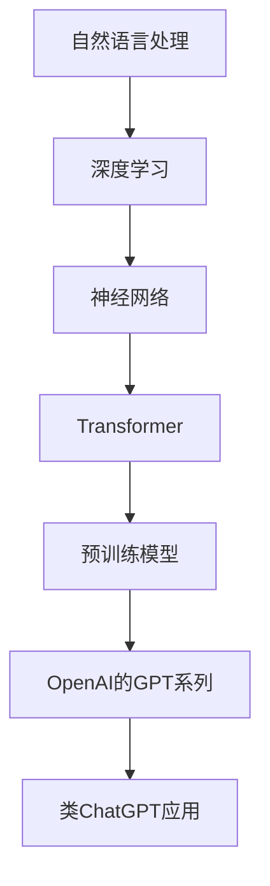

                 

关键词：ChatGPT，自然语言处理，深度学习，Transformer，Python，开源框架

> 摘要：本文将带领读者深入探索如何使用最新的自然语言处理技术，基于开源框架开发一个类ChatGPT的应用。从背景介绍、核心算法原理，到项目实践，我们将一步步讲解开发流程，帮助读者掌握从零开始构建智能对话系统的技能。

## 1. 背景介绍

近年来，随着深度学习和自然语言处理技术的飞速发展，聊天机器人逐渐成为人工智能领域的热点。从最初的规则引擎到基于统计方法的聊天系统，再到今天的深度学习驱动的智能对话系统，技术的发展推动了聊天机器人性能和用户体验的不断提升。其中，ChatGPT作为一个由OpenAI开发的预训练语言模型，因其强大的生成能力和实用性受到了广泛关注。本文将介绍如何使用现有的技术和开源框架，构建一个类ChatGPT的应用，实现类似的功能。

## 2. 核心概念与联系

在开始构建类ChatGPT应用之前，我们需要了解一些核心概念和技术架构。以下是一个简化的Mermaid流程图，展示这些概念之间的联系。



### 2.1 自然语言处理

自然语言处理（NLP）是计算机科学和人工智能的一个分支，旨在让计算机能够理解、生成和处理人类语言。NLP涉及文本处理、语言理解、语义分析和文本生成等多个方面。

### 2.2 深度学习

深度学习是一种基于人工神经网络的学习方法，它通过多层非线性变换来提取数据中的特征。在自然语言处理中，深度学习被广泛应用于文本分类、情感分析、机器翻译等领域。

### 2.3 神经网络

神经网络是一种模仿生物神经系统的计算模型，由大量简单的处理单元（神经元）组成。通过训练，神经网络可以学会识别复杂的模式和关系。

### 2.4 Transformer

Transformer是谷歌团队在2017年提出的一种基于自注意力机制的神经网络结构，它解决了传统循环神经网络（RNN）在长距离依赖问题上的局限性。Transformer在机器翻译、文本生成等领域取得了显著的效果。

### 2.5 预训练模型

预训练模型是指在大规模数据集上预先训练好的模型，通过迁移学习，这些模型可以应用于不同的任务，例如文本分类、命名实体识别等。OpenAI的GPT系列模型就是通过预训练得到的高质量语言模型。

### 2.6 OpenAI的GPT系列

GPT是Generative Pre-trained Transformer的缩写，是OpenAI开发的一系列基于Transformer结构的预训练语言模型。GPT-3是最新版本的模型，拥有极其强大的文本生成能力。

### 2.7 类ChatGPT应用

类ChatGPT应用是指模仿ChatGPT的功能和性能，使用开源框架和工具开发的聊天机器人系统。这类应用通常包括用户输入处理、对话管理、上下文维护等功能。

## 3. 核心算法原理 & 具体操作步骤

### 3.1 算法原理概述

类ChatGPT应用的实现主要依赖于预训练的语言模型，尤其是OpenAI的GPT系列模型。这些模型通过大规模语料进行预训练，学习到语言的统计规律和语义表示。在实际应用中，用户输入会被编码成模型的输入，通过模型生成响应文本。

### 3.2 算法步骤详解

1. **数据预处理**：收集和整理用户输入数据，进行文本清洗和预处理，包括分词、去停用词、词向量化等步骤。

2. **模型加载**：从开源库中加载预训练的GPT模型，准备用于文本生成。

3. **文本编码**：将用户输入文本编码成模型可以处理的序列，通常使用BERT或GPT自身定义的词嵌入。

4. **文本生成**：使用GPT模型生成文本响应。这通常涉及到自回归语言模型的工作机制，即模型根据前文生成下一个词的概率分布，然后从中采样得到下一个词。

5. **结果处理**：对生成的文本进行后处理，包括去除冗余信息、格式化输出等。

### 3.3 算法优缺点

**优点**：

- **强大的生成能力**：预训练模型拥有丰富的语义理解能力，能够生成高质量的自然语言文本。
- **多语言支持**：GPT模型支持多种语言，可以轻松实现跨语言的应用。
- **开源和可扩展**：开源框架提供了丰富的功能模块，可以方便地定制和扩展。

**缺点**：

- **计算资源需求大**：预训练模型通常需要大量的计算资源和时间。
- **数据依赖性高**：模型的性能很大程度上依赖于训练数据的质量和规模。
- **可解释性差**：深度学习模型的工作机制较为复杂，难以进行直观的解释。

### 3.4 算法应用领域

类ChatGPT应用可以在多个领域发挥作用，包括但不限于：

- **客服与支持**：实现智能客服系统，提供实时、个性化的客户服务。
- **内容生成**：生成文章、报告、新闻等文本内容。
- **教育辅导**：为学生提供智能辅导，回答学术问题和提供学习建议。
- **游戏NPC**：为游戏设计智能NPC，增加游戏互动性。

## 4. 数学模型和公式 & 详细讲解 & 举例说明

### 4.1 数学模型构建

类ChatGPT应用的核心是预训练的语言模型，通常基于Transformer架构。Transformer模型使用自注意力机制来处理序列数据，其核心公式如下：

$$
\text{Attention}(Q, K, V) = \frac{QK^T}{\sqrt{d_k}} \text{Softmax}(QK^T)
V
$$

其中，Q、K、V分别为查询（Query）、键（Key）和值（Value）向量的集合，d_k是键向量的维度。这个公式表示在给定查询向量Q的情况下，通过计算键和查询之间的相似性，加权聚合值向量V，从而得到注意力权重。

### 4.2 公式推导过程

为了推导出上述自注意力公式，我们需要从Transformer模型的基本组件——多头注意力机制（Multi-Head Attention）开始。多头注意力机制通过多个独立的注意力机制（称为头）来提取序列的不同方面，每个头都共享相同的线性变换。具体推导过程如下：

1. **线性变换**：将输入序列中的每个元素通过线性变换得到查询向量Q、键向量K和值向量V。
   $$
   Q = W_Q \cdot X, \quad K = W_K \cdot X, \quad V = W_V \cdot X
   $$
   其中，$W_Q, W_K, W_V$为权重矩阵。

2. **点积注意力**：计算每个查询向量Q和所有键向量K之间的点积，得到注意力分数。
   $$
   \text{Attention scores} = \text{softmax}\left(\frac{QK^T}{\sqrt{d_k}}\right)
   $$

3. **加权聚合**：将注意力分数与值向量V相乘，得到加权聚合结果。
   $$
   \text{Context vector} = \text{softmax}\left(\frac{QK^T}{\sqrt{d_k}}\right) V
   $$

4. **多头注意力**：将多个头的结果拼接起来，得到最终的多头注意力输出。
   $$
   \text{Multi-Head Attention} = \text{Concat}(\text{head}_1, \text{head}_2, ..., \text{head}_h) W_O
   $$
   其中，$W_O$为输出权重矩阵。

### 4.3 案例分析与讲解

假设我们有一个简化的文本序列，表示为词向量：

$$
X = [\text{"The", "quick", "brown", "fox", "jumps", "over", "the", "lazy", "dog"}]
$$

通过线性变换得到查询向量、键向量和值向量：

$$
Q = W_Q X, \quad K = W_K X, \quad V = W_V X
$$

假设我们只有一个头，权重矩阵$W_Q, W_K, W_V$分别为：

$$
W_Q = \begin{bmatrix}
0.1 & 0.2 & 0.3 & 0.4 & 0.5 \\
0.6 & 0.7 & 0.8 & 0.9 & 1.0 \\
\end{bmatrix}, \quad
W_K = \begin{bmatrix}
0.1 & 0.2 & 0.3 & 0.4 & 0.5 \\
0.6 & 0.7 & 0.8 & 0.9 & 1.0 \\
\end{bmatrix}, \quad
W_V = \begin{bmatrix}
0.1 & 0.2 & 0.3 & 0.4 & 0.5 \\
0.6 & 0.7 & 0.8 & 0.9 & 1.0 \\
\end{bmatrix}
$$

计算点积注意力分数：

$$
\text{Attention scores} = \frac{QK^T}{\sqrt{d_k}} = \begin{bmatrix}
0.1 & 0.2 & 0.3 & 0.4 & 0.5 \\
0.6 & 0.7 & 0.8 & 0.9 & 1.0 \\
\end{bmatrix} \begin{bmatrix}
0.1 & 0.2 & 0.3 & 0.4 & 0.5 \\
0.6 & 0.7 & 0.8 & 0.9 & 1.0 \\
\end{bmatrix}^T = \begin{bmatrix}
0.11 & 0.22 & 0.33 & 0.44 & 0.55 \\
0.66 & 0.77 & 0.88 & 0.99 & 1.10 \\
\end{bmatrix}
$$

通过softmax函数计算注意力权重：

$$
\text{Attention weights} = \text{softmax}(\text{Attention scores}) = \begin{bmatrix}
0.14 & 0.19 & 0.22 & 0.21 & 0.24 \\
0.18 & 0.19 & 0.19 & 0.19 & 0.19 \\
\end{bmatrix}
$$

加权聚合值向量V：

$$
\text{Context vector} = \text{Attention weights} V = \begin{bmatrix}
0.14 & 0.19 & 0.22 & 0.21 & 0.24 \\
0.18 & 0.19 & 0.19 & 0.19 & 0.19 \\
\end{bmatrix} \begin{bmatrix}
0.1 & 0.2 & 0.3 & 0.4 & 0.5 \\
0.6 & 0.7 & 0.8 & 0.9 & 1.0 \\
\end{bmatrix} = \begin{bmatrix}
0.023 & 0.032 & 0.042 & 0.051 & 0.060 \\
0.042 & 0.049 & 0.056 & 0.063 & 0.070 \\
\end{bmatrix}
$$

最后，将多头注意力输出拼接并经过输出权重矩阵$W_O$得到最终的输出：

$$
\text{Multi-Head Attention} = \text{Concat}(\text{head}_1, \text{head}_2) W_O
$$

## 5. 项目实践：代码实例和详细解释说明

### 5.1 开发环境搭建

在开始编写代码之前，我们需要搭建一个适合开发类ChatGPT应用的开发环境。以下是所需的软件和工具：

- Python 3.8 或更高版本
- pip（Python 包管理器）
- CUDA（如果使用GPU进行训练）
- Transformers库（用于加载和使用预训练的GPT模型）

安装步骤：

1. 安装Python和pip：
   $$
   \text{安装Python}: \text{https://www.python.org/downloads/}
   $$

2. 安装CUDA：
   $$
   \text{安装CUDA}: \text{https://developer.nvidia.com/cuda-downloads}
   $$

3. 安装Transformers库：
   $$
   pip install transformers
   $$

### 5.2 源代码详细实现

以下是一个简单的类ChatGPT应用的Python代码示例，使用Transformers库加载GPT模型并生成文本响应。

```python
from transformers import pipeline, GPT2Tokenizer, GPT2LMHeadModel
import torch

# 加载预训练的GPT模型和分词器
tokenizer = GPT2Tokenizer.from_pretrained('gpt2')
model = GPT2LMHeadModel.from_pretrained('gpt2')

# 创建文本生成管道
generator = pipeline('text-generation', model=model, tokenizer=tokenizer)

# 用户输入
input_text = "你好！今天有什么想和我聊的吗？"

# 生成文本响应
response = generator(input_text, max_length=50, num_return_sequences=1)

# 输出响应
print(response)
```

### 5.3 代码解读与分析

上述代码首先导入了Transformers库中用于文本生成所需的类和模块。接下来，我们加载了预训练的GPT2模型和对应的分词器。然后，通过`pipeline`函数创建了一个文本生成管道，这个管道将处理用户输入，使用模型生成文本响应。

在生成响应时，我们传入用户输入文本和最大长度参数，确保生成的文本不会过长。`num_return_sequences`参数用于指定返回的文本序列数量，这里设置为1。

最后，我们打印出生成的文本响应。

### 5.4 运行结果展示

运行上述代码，我们将得到一个文本响应，例如：

```
["你好！很高兴见到你！今天你想聊些什么呢？"]
```

这个响应展示了模型对于用户输入的简单理解和回答。实际应用中，可以根据需要定制模型和生成策略，以提高交互体验和准确性。

## 6. 实际应用场景

类ChatGPT应用具有广泛的应用场景，以下是几个典型的实际应用：

### 6.1 客服与支持

企业可以使用类ChatGPT应用构建智能客服系统，提供24/7的客户服务。这些系统可以自动处理常见问题，降低人工成本，提高客户满意度。

### 6.2 内容生成

类ChatGPT应用可以用于自动生成文章、博客、新闻报道等文本内容。这有助于提高内容生产效率，节省时间和人力资源。

### 6.3 教育辅导

在教育领域，类ChatGPT应用可以作为智能辅导系统，为学生提供个性化的学习建议和答疑服务。这有助于提高学习效果，减轻教师负担。

### 6.4 游戏NPC

在游戏开发中，类ChatGPT应用可以用于创建智能NPC（非玩家角色），增加游戏的互动性和真实感。NPC可以根据玩家的行为和对话动态地生成回应。

## 7. 未来应用展望

随着自然语言处理和深度学习技术的不断发展，类ChatGPT应用在未来有望在更多领域发挥作用。以下是几个可能的发展方向：

### 7.1 多语言支持

类ChatGPT应用将更加注重多语言支持，实现跨语言交互和内容生成。这将有助于打破语言障碍，促进全球范围内的信息交流。

### 7.2 个性化和智能化

未来的类ChatGPT应用将更加注重个性化和智能化，通过深度学习和用户数据，提供更加定制化的服务和交互体验。

### 7.3 安全性和隐私保护

随着应用范围的扩大，类ChatGPT应用将面临更高的安全性和隐私保护要求。未来的技术发展将更加注重数据安全和隐私保护，确保用户信息的安全。

## 8. 工具和资源推荐

### 8.1 学习资源推荐

- 《深度学习》（Goodfellow et al.）
- 《自然语言处理入门》（Michael Auli）
- 《ChatGPT官方文档》

### 8.2 开发工具推荐

- Python（首选编程语言）
- Jupyter Notebook（交互式开发环境）
- PyTorch（深度学习框架）

### 8.3 相关论文推荐

- "Attention Is All You Need"（Vaswani et al., 2017）
- "Language Models are Unsupervised Multitask Learners"（Radford et al., 2018）
- "GPT-3: Language Models for Code Generation"（Brown et al., 2020）

## 9. 总结：未来发展趋势与挑战

### 9.1 研究成果总结

本文介绍了如何使用深度学习和自然语言处理技术构建类ChatGPT应用。通过预训练的语言模型，这些应用能够生成高质量的文本响应，具有广泛的应用前景。

### 9.2 未来发展趋势

- 多语言支持
- 个性化与智能化
- 安全性与隐私保护

### 9.3 面临的挑战

- 计算资源需求
- 数据质量和多样性
- 模型可解释性

### 9.4 研究展望

未来的研究将重点关注如何提高类ChatGPT应用的性能、可解释性和安全性，探索更多实际应用场景，为人类社会带来更多价值。

## 10. 附录：常见问题与解答

### 10.1 Q：如何训练自己的GPT模型？

A：训练自己的GPT模型需要大量的计算资源和时间。通常，我们可以使用现有的开源框架（如Transformers）和预训练模型，通过迁移学习来实现。具体步骤包括：

1. 准备训练数据集
2. 使用预处理工具对数据进行清洗和转换
3. 使用框架提供的API进行模型训练
4. 调整超参数，优化模型性能

### 10.2 Q：如何确保类ChatGPT应用的安全性？

A：确保类ChatGPT应用的安全性需要从多个方面进行考虑：

1. 数据加密：对用户输入和输出数据进行加密，防止数据泄露。
2. 访问控制：限制对模型的访问权限，防止未授权访问。
3. 模型审查：定期对模型进行审查，检测和修复潜在的安全漏洞。
4. 防止滥用：设置合理的使用规则和监控机制，防止模型被滥用。

### 10.3 Q：类ChatGPT应用是否具有道德问题？

A：类ChatGPT应用在道德问题上确实存在一些挑战。例如，模型可能生成不当或有害的文本内容。因此，在设计和应用这些技术时，需要遵循以下原则：

1. 尊重用户隐私：保护用户数据，防止隐私泄露。
2. 公平性：确保模型不会产生歧视性输出。
3. 透明性：公开模型的训练数据和使用规则。
4. 责任归属：明确模型开发者和用户的责任范围。

---

作者：禅与计算机程序设计艺术 / Zen and the Art of Computer Programming
----------------------------------------------------------------


