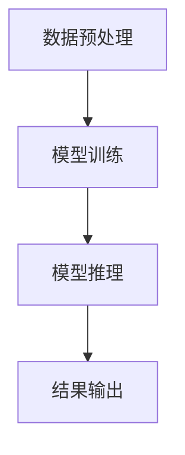

                 

在这个充满变革的时代，人工智能（AI）已经成为科技发展的核心驱动力。特别是大型语言模型（LLM）如ChatGPT的兴起，为自然语言处理（NLP）领域带来了革命性的变化。在这篇文章中，我们将深入探讨如何开发一个类ChatGPT的应用，以展示AI的强大潜力。本文的目标是提供一个全面、易懂的指导，帮助您从零开始，构建自己的大型语言模型应用。

## 文章关键词
- 人工智能
- 语言模型
- ChatGPT
- 开发指南
- 自然语言处理

## 文章摘要
本文将详细介绍开发类ChatGPT应用的全过程，包括背景介绍、核心概念、算法原理、数学模型、项目实践以及未来应用展望。无论您是AI领域的初学者还是有经验的技术人员，都将在这篇文章中找到有价值的信息。

## 1. 背景介绍

### 1.1 ChatGPT的崛起
ChatGPT是由OpenAI于2022年11月推出的一个基于GPT-3.5的大型语言模型，它能够进行自然的对话，理解复杂的问题，并生成高质量的自然语言文本。ChatGPT的成功迅速引起了全球的关注，并激发了人们对于AI语言模型无限可能性的探索。

### 1.2 类ChatGPT应用的重要性
开发类ChatGPT应用不仅能够满足个人和企业的需求，还能够推动AI技术的普及和应用。这些应用可以用于客服、内容生成、教育、医疗等多个领域，具有广泛的应用前景。

### 1.3 当前挑战与机遇
尽管ChatGPT展示了巨大的潜力，但其开发和应用仍然面临诸多挑战，如计算资源需求、模型训练时间、数据隐私和安全等。然而，随着技术的进步和计算能力的提升，这些挑战正逐渐被克服，为类ChatGPT应用的开发提供了更多机遇。

## 2. 核心概念与联系

在开发类ChatGPT应用之前，我们需要了解一些核心概念和原理，它们构成了整个系统的基石。

### 2.1 自然语言处理（NLP）
自然语言处理是计算机科学和人工智能领域的一个分支，旨在使计算机能够理解、解释和生成自然语言。NLP技术包括文本处理、语音识别、情感分析、机器翻译等。

### 2.2 机器学习与深度学习
机器学习和深度学习是AI的核心技术，用于训练模型以识别模式和生成预测。在类ChatGPT应用中，深度学习模型如变换器（Transformer）和自注意力（Self-Attention）机制起着关键作用。

### 2.3 大型语言模型
大型语言模型是一种复杂的神经网络，可以学习并生成高质量的自然语言文本。这些模型通常基于大量文本数据进行训练，以学习语言的复杂性和上下文关系。

### 2.4 Mermaid流程图
以下是类ChatGPT应用的核心流程图，展示了从数据预处理到模型训练和推理的整个过程。



## 3. 核心算法原理 & 具体操作步骤

### 3.1 算法原理概述
类ChatGPT应用的核心算法是变换器（Transformer）模型，它通过自注意力（Self-Attention）机制和多头注意力（Multi-Head Attention）来捕捉文本中的长距离依赖关系。

### 3.2 算法步骤详解

#### 3.2.1 数据预处理
1. 数据收集：收集大量文本数据，如对话记录、文章、书籍等。
2. 数据清洗：去除无关的标记和噪声，如HTML标签、特殊字符等。
3. 数据编码：将文本转换为数字序列，通常使用词嵌入（Word Embedding）技术。

#### 3.2.2 模型训练
1. 模型初始化：初始化变换器模型，包括嵌入层、自注意力层和输出层。
2. 训练过程：使用梯度下降（Gradient Descent）等优化算法，通过反向传播（Backpropagation）来更新模型参数。
3. 评估与调整：使用验证集对模型进行评估，并调整超参数以提高性能。

#### 3.2.3 模型推理
1. 输入编码：将输入文本编码为数字序列。
2. 模型预测：通过变换器模型生成预测文本。
3. 输出解码：将生成的数字序列解码为自然语言文本。

### 3.3 算法优缺点
#### 优点
- 强大的文本生成能力：变换器模型可以生成高质量的自然语言文本。
- 长距离依赖捕捉：自注意力机制可以捕捉文本中的长距离依赖关系。
- 广泛的应用场景：适用于各种NLP任务，如文本分类、问答系统等。

#### 缺点
- 计算资源需求高：模型训练和推理需要大量的计算资源。
- 数据依赖性大：模型的性能高度依赖于训练数据的质量和数量。

### 3.4 算法应用领域
- 客户服务：构建智能客服系统，提供自然、流畅的对话体验。
- 内容生成：自动生成文章、报告、摘要等，节省人力和时间成本。
- 教育：辅助学生进行写作、翻译等任务，提供个性化学习支持。

## 4. 数学模型和公式 & 详细讲解 & 举例说明

### 4.1 数学模型构建
类ChatGPT应用的数学模型主要包括变换器（Transformer）模型和自注意力（Self-Attention）机制。

### 4.2 公式推导过程

#### 4.2.1 嵌入层
$$
\text{Embedding}(x) = \text{W}_{\text{emb}}x
$$

其中，$x$ 是输入的词索引序列，$\text{W}_{\text{emb}}$ 是嵌入矩阵。

#### 4.2.2 自注意力
$$
\text{Self-Attention}(Q, K, V) = \text{softmax}\left(\frac{QK^T}{\sqrt{d_k}}\right)V
$$

其中，$Q$、$K$、$V$ 分别是查询（Query）、键（Key）和值（Value）向量的集合，$d_k$ 是键向量的维度。

#### 4.2.3 多头注意力
$$
\text{Multi-Head Attention}(Q, K, V) = \text{Concat}(\text{head}_1, \text{head}_2, \ldots, \text{head}_h)W^O
$$

其中，$h$ 是头数，$\text{head}_i = \text{Self-Attention}(QW_i^Q, KW_i^K, VW_i^V)$，$W_i^O$ 是输出权重。

### 4.3 案例分析与讲解

#### 4.3.1 文本分类
假设我们有以下文本数据集：

| 标签 | 文本 |
|------|------|
| 正面 | 这是一部非常棒的电影。 |
| 负面 | 这部电影太糟糕了。 |

我们可以使用变换器模型进行文本分类。首先，将文本转换为嵌入向量，然后通过多层变换器来提取特征，最后使用softmax激活函数进行分类。

#### 4.3.2 文本生成
假设我们要生成一个关于旅游的段落。首先，我们输入一个关键词，如“巴黎”，然后变换器模型会生成与巴黎相关的文本。例如：

> 巴黎，这座浪漫的法国城市，以其独特的艺术氛围和悠久的历史而闻名。游客可以欣赏到埃菲尔铁塔、卢浮宫等著名景点，品尝地道的法式美食，感受这座城市的魅力。

## 5. 项目实践：代码实例和详细解释说明

### 5.1 开发环境搭建
在开始编写代码之前，我们需要搭建一个合适的开发环境。以下是一个基本的步骤：

1. 安装Python（建议使用3.8及以上版本）。
2. 安装PyTorch，这是一个强大的深度学习框架。
3. 安装其他必要的依赖，如NumPy、Pandas等。

### 5.2 源代码详细实现

```python
import torch
import torch.nn as nn
import torch.optim as optim

# 定义变换器模型
class TransformerModel(nn.Module):
    def __init__(self, vocab_size, embedding_dim, hidden_dim, n_layers, n_heads):
        super(TransformerModel, self).__init__()
        self.embedding = nn.Embedding(vocab_size, embedding_dim)
        self.transformer = nn.Transformer(embedding_dim, n_layers, n_heads)
        self.fc = nn.Linear(embedding_dim, vocab_size)
        
    def forward(self, src, tgt):
        src = self.embedding(src)
        tgt = self.embedding(tgt)
        output = self.transformer(src, tgt)
        output = self.fc(output)
        return output

# 初始化模型、优化器和损失函数
model = TransformerModel(vocab_size=10000, embedding_dim=512, hidden_dim=512, n_layers=3, n_heads=8)
optimizer = optim.Adam(model.parameters(), lr=0.001)
criterion = nn.CrossEntropyLoss()

# 训练模型
for epoch in range(num_epochs):
    for src, tgt in train_loader:
        optimizer.zero_grad()
        output = model(src, tgt)
        loss = criterion(output.view(-1, vocab_size), tgt)
        loss.backward()
        optimizer.step()
```

### 5.3 代码解读与分析
在上面的代码中，我们首先定义了一个变换器模型，包括嵌入层、变换器层和输出层。接着，我们初始化模型、优化器和损失函数，并开始训练模型。在训练过程中，我们使用梯度下降算法来更新模型参数，并使用交叉熵损失函数来计算损失。

### 5.4 运行结果展示
在完成训练后，我们可以使用测试集来评估模型的性能。以下是一个简单的评估代码：

```python
# 评估模型
with torch.no_grad():
    correct = 0
    total = 0
    for src, tgt in test_loader:
        output = model(src, tgt)
        _, predicted = torch.max(output, 1)
        total += tgt.size(0)
        correct += (predicted == tgt).sum().item()

accuracy = 100 * correct / total
print(f'测试集准确率: {accuracy:.2f}%')
```

## 6. 实际应用场景

类ChatGPT应用具有广泛的应用场景，以下是其中几个典型的例子：

### 6.1 客户服务
构建智能客服系统，提供24/7的在线支持，提高客户满意度和服务效率。

### 6.2 内容生成
自动生成文章、摘要、新闻报道等，节省时间和人力成本。

### 6.3 教育
为学生提供个性化的学习支持，如写作辅导、翻译练习等。

### 6.4 医疗咨询
提供智能医疗咨询服务，解答患者常见问题，辅助医生进行诊断。

## 6.4 未来应用展望

随着技术的进步和数据的积累，类ChatGPT应用将在更多领域得到应用。以下是几个未来的发展方向：

### 6.4.1 更高效的计算
随着硬件性能的提升，将能够更快地训练和推理大型语言模型。

### 6.4.2 更精细的模型
通过改进模型结构和训练方法，使模型能够更好地理解和生成自然语言。

### 6.4.3 数据隐私保护
加强数据隐私保护措施，确保用户数据的安全和隐私。

### 6.4.4 跨领域应用
探索类ChatGPT应用在金融、医疗、教育等领域的应用，实现更广泛的价值。

## 7. 工具和资源推荐

### 7.1 学习资源推荐
- 《深度学习》（Goodfellow, Bengio, Courville）
- 《自然语言处理综论》（Jurafsky, Martin）
- 《机器学习实战》（Hastie, Tibshirani, Friedman）

### 7.2 开发工具推荐
- PyTorch：强大的深度学习框架，适合构建和训练变换器模型。
- Hugging Face：提供丰富的预训练模型和工具，方便开发者进行实验和部署。

### 7.3 相关论文推荐
- “Attention Is All You Need”（Vaswani et al., 2017）
- “Generative Pre-trained Transformers”（Brown et al., 2020）

## 8. 总结：未来发展趋势与挑战

类ChatGPT应用代表了AI领域的最新进展，具有巨大的潜力。然而，随着应用的广泛推广，我们也需要关注其带来的挑战，如计算资源需求、数据隐私和安全等问题。未来的发展趋势将包括更高效的计算、更精细的模型和更广泛的应用。通过持续的研究和技术创新，我们有理由相信，类ChatGPT应用将在未来发挥更大的作用。

## 9. 附录：常见问题与解答

### Q: 如何处理中文文本？
A: 可以使用预训练的中文模型，如基于BERT的中文预训练模型，或者使用专门为中文设计的预训练模型。

### Q: 如何提高模型的性能？
A: 可以尝试增加模型的层数、使用更大的词汇表、优化训练过程等。

### Q: 如何部署类ChatGPT应用？
A: 可以使用云计算平台（如AWS、Azure等）提供的深度学习服务，或者使用自己的服务器进行部署。

---

通过本文的详细讲解，您应该已经对开发类ChatGPT应用有了全面的了解。希望这篇文章能够帮助您开启AI语言模型开发之旅，并激发您在这一领域的进一步探索。作者：禅与计算机程序设计艺术 / Zen and the Art of Computer Programming。

