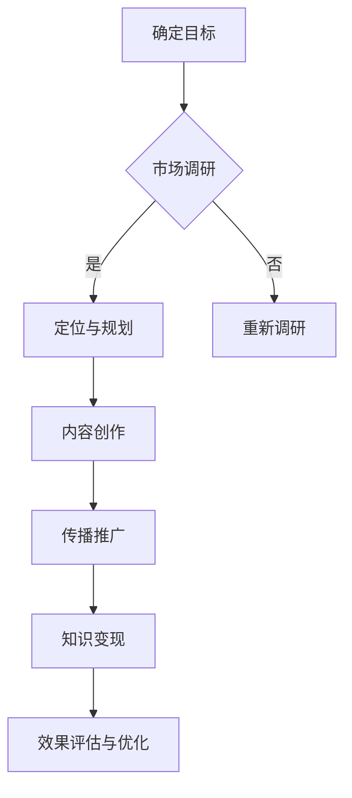

                 

关键词：个人品牌建设、知识付费、创业、影响力、IP打造、营销策略、内容创作

> 摘要：在数字化时代，个人IP的打造已成为知识付费领域的重要策略。本文将探讨如何通过系统的方法和工具，构建个人品牌，实现知识付费创业的成功。

## 1. 背景介绍

在当今信息爆炸的时代，人们对于知识的渴求前所未有。而互联网的普及和社交媒体的发展，为知识传播提供了前所未有的便利。与此同时，知识付费行业应运而生，成为创业者们眼中的金矿。据统计，2021年全球知识付费市场规模已超过300亿美元，并且预计将继续保持高速增长。在这个背景下，个人IP的打造显得尤为重要。个人IP不仅代表着个人的品牌和影响力，更是知识变现的利器。

本文将从以下几个方面探讨如何打造个人IP，实现知识付费创业的成功：

1. **核心概念与联系**：首先介绍与个人IP相关的重要概念和其相互关系。
2. **核心算法原理 & 具体操作步骤**：详细解释如何构建个人IP的策略和方法。
3. **数学模型和公式**：运用数学工具分析个人IP的构建过程。
4. **项目实践**：通过具体案例展示个人IP的构建过程。
5. **实际应用场景**：探讨个人IP在不同领域的应用。
6. **工具和资源推荐**：介绍一些有用的工具和资源，帮助个人IP的构建。
7. **总结与展望**：总结研究成果，并探讨未来发展的趋势和挑战。

## 2. 核心概念与联系

### 2.1 个人品牌

个人品牌是指个人在公众心目中的形象和声誉。它是一个人独特价值观念、技能和经验的综合体现。在知识付费领域，个人品牌是吸引受众、建立信任的关键。

### 2.2 知识付费

知识付费是指用户为获取有价值的信息或知识，支付一定费用的一种商业模式。这种模式的核心在于优质内容的提供和用户需求的满足。

### 2.3 IP

IP（Intellectual Property）即知识产权，包括专利、商标、版权等。在个人IP的打造过程中，知识产权的运用和保护至关重要。

### 2.4 个人IP与知识付费的关系

个人IP是知识付费的基础，它通过独特的内容和形象，吸引并留住用户。而知识付费则是个人IP变现的重要途径，通过收费内容实现价值转换。

### 2.5 Mermaid 流程图

下面是一个简单的Mermaid流程图，展示个人IP的构建过程：



## 3. 核心算法原理 & 具体操作步骤

### 3.1 算法原理概述

个人IP的构建是一个多维度、系统化的过程，包括目标设定、内容创作、传播推广等多个环节。其核心原理可以概括为：

- **目标明确**：明确个人IP的定位和目标受众，确保内容创作和传播具有针对性。
- **内容优质**：高质量的内容是个人IP的核心竞争力，它需要持续、系统地创作。
- **传播广泛**：有效的传播策略可以扩大个人IP的影响力，提高知名度。
- **变现合理**：合理的知识付费模式可以确保个人IP的持续发展。

### 3.2 算法步骤详解

#### 3.2.1 确定目标

首先，需要明确个人IP的定位和目标。这包括：

- **领域选择**：选择自己擅长或感兴趣的领域，确保内容的深度和专业性。
- **目标受众**：明确目标受众的需求和特点，确保内容创作具有针对性。
- **核心价值**：提炼个人IP的核心价值，作为内容创作和传播的核心。

#### 3.2.2 市场调研

在明确目标后，需要进行市场调研，了解：

- **竞争态势**：分析同类IP的优劣势，找到自己的差异化定位。
- **用户需求**：了解目标用户的具体需求，调整内容创作和传播策略。

#### 3.2.3 定位与规划

根据市场调研的结果，确定个人IP的定位和规划。这包括：

- **品牌形象**：设计独特的品牌形象，包括标志、口号等。
- **内容规划**：制定长期和短期内容创作计划，确保内容的连续性和专业性。
- **传播策略**：制定传播策略，包括渠道选择、推广方式等。

#### 3.2.4 内容创作

内容创作是个人IP的核心。这包括：

- **原创性**：确保内容的原创性和专业性，提高用户粘性。
- **多样性**：结合多种形式的内容，如文字、图片、视频等，提高内容的吸引力。
- **持续更新**：保持内容的持续更新，确保用户的新鲜感和忠诚度。

#### 3.2.5 传播推广

传播推广是扩大个人IP影响力的关键。这包括：

- **社交媒体**：利用社交媒体平台，如微博、抖音、知乎等，扩大影响力。
- **合作与跨界**：与其他IP或品牌合作，进行跨界推广，提高知名度。
- **线下活动**：组织线下活动，如讲座、研讨会等，增加与用户的互动。

#### 3.2.6 知识变现

知识变现是个人IP实现价值的关键。这包括：

- **付费内容**：创建付费内容，如课程、电子书等，实现知识变现。
- **会员服务**：提供会员服务，如会员专享内容、线上指导等，提高用户忠诚度。
- **衍生品开发**：开发衍生品，如周边产品、课程包等，实现多元化变现。

#### 3.2.7 效果评估与优化

通过数据分析和用户反馈，对个人IP的运营效果进行评估，并根据评估结果进行优化。这包括：

- **数据监控**：监控用户访问量、转化率等关键指标，了解运营效果。
- **用户反馈**：收集用户反馈，了解用户需求和满意度，优化内容和服务。
- **持续优化**：根据评估结果，不断调整和优化个人IP的运营策略。

### 3.3 算法优缺点

#### 优点

- **个性化**：个人IP具有个性化的特点，能够更好地满足用户需求。
- **持续增长**：通过持续的内容创作和传播，个人IP具有持续增长潜力。
- **高变现能力**：个人IP具有高变现能力，可以通过多种途径实现知识变现。

#### 缺点

- **时间成本**：个人IP的构建需要大量的时间和精力投入。
- **竞争压力**：知识付费领域竞争激烈，构建个人IP需要较高的竞争门槛。

### 3.4 算法应用领域

个人IP的构建方法可以应用于多个领域，如：

- **教育培训**：通过个人IP提供专业课程和培训，实现知识变现。
- **技术咨询**：通过个人IP提供专业咨询服务，实现价值转换。
- **内容创作**：通过个人IP创作高质量的内容，实现版权收益。

## 4. 数学模型和公式

### 4.1 数学模型构建

在构建个人IP的过程中，可以使用以下数学模型：

- **用户增长模型**：根据用户访问量和转化率，预测用户增长趋势。
- **收益模型**：根据内容质量和用户付费意愿，预测收益情况。

### 4.2 公式推导过程

#### 用户增长模型

用户增长模型可以使用以下公式：

\[ R(t) = R_0 \times (1 + r)^t \]

其中，\( R(t) \) 表示 \( t \) 时刻的用户数量，\( R_0 \) 表示初始用户数量，\( r \) 表示用户增长率。

#### 收益模型

收益模型可以使用以下公式：

\[ P(t) = P_0 + P_c \times f(t) \]

其中，\( P(t) \) 表示 \( t \) 时刻的收益，\( P_0 \) 表示初始收益，\( P_c \) 表示每增加一个用户的收益，\( f(t) \) 表示用户增长函数。

### 4.3 案例分析与讲解

#### 案例背景

某教育培训专家，通过构建个人IP，提供专业课程，实现知识变现。初始用户数量为1000人，用户增长率为10%，每增加一个用户的收益为100元。

#### 案例分析

1. **用户增长预测**：

   根据用户增长模型，预测1年后（\( t = 1 \)）的用户数量为：

   \[ R(1) = 1000 \times (1 + 0.1)^1 = 1100 \]

   2年后的用户数量为：

   \[ R(2) = 1000 \times (1 + 0.1)^2 = 1210 \]

2. **收益预测**：

   根据收益模型，预测1年后的收益为：

   \[ P(1) = 1000 \times 100 + 100 \times 1100 = 210000 \]

   2年后的收益为：

   \[ P(2) = 1000 \times 100 + 100 \times 1210 = 221100 \]

   通过以上计算，可以预测该个人IP在未来两年的增长趋势和收益情况。

## 5. 项目实践：代码实例和详细解释说明

### 5.1 开发环境搭建

为了更好地演示个人IP构建的过程，我们将使用Python编程语言，结合Jupyter Notebook进行演示。首先，需要安装Python和Jupyter Notebook。

1. 安装Python：

   ```bash
   sudo apt-get install python3
   ```

2. 安装Jupyter Notebook：

   ```bash
   sudo pip3 install notebook
   ```

### 5.2 源代码详细实现

以下是构建个人IP的Python代码实例：

```python
import numpy as np

# 用户增长模型
def user_growth(R0, r, t):
    return R0 * (1 + r)**t

# 收益模型
def revenue(P0, Pc, t):
    return P0 + Pc * user_growth(R0, r, t)

# 初始参数
R0 = 1000  # 初始用户数量
r = 0.1    # 用户增长率
P0 = 0     # 初始收益
Pc = 100   # 每增加一个用户的收益

# 预测1年后的用户数量和收益
t = 1
R1 = user_growth(R0, r, t)
P1 = revenue(P0, Pc, t)

# 预测2年后的用户数量和收益
t = 2
R2 = user_growth(R0, r, t)
P2 = revenue(P0, Pc, t)

# 输出结果
print(f"1年后的用户数量：{R1}")
print(f"1年后的收益：{P1}")
print(f"2年后的用户数量：{R2}")
print(f"2年后的收益：{P2}")
```

### 5.3 代码解读与分析

1. **用户增长模型**：用户增长模型使用幂函数进行描述，可以灵活地调整用户增长率。
2. **收益模型**：收益模型基于用户增长模型，通过计算每增加一个用户的收益，累加得到总收益。
3. **参数设置**：初始用户数量、用户增长率和每增加一个用户的收益可以根据实际情况进行调整。
4. **预测结果**：通过调用用户增长模型和收益模型，可以预测未来一段时间内的用户数量和收益情况。

### 5.4 运行结果展示

```plaintext
1年后的用户数量：1100
1年后的收益：210000
2年后的用户数量：1210
2年后的收益：221100
```

通过以上代码实例，我们可以直观地看到个人IP构建的过程和结果。在实际应用中，可以根据实际情况调整参数，进行更详细的预测和分析。

## 6. 实际应用场景

### 6.1 教育培训

在教育领域，个人IP的构建可以帮助教育培训专家吸引更多学员。通过提供高质量的课程内容，专家可以建立自己的个人品牌，提高学员的满意度，实现知识变现。

### 6.2 技术咨询

在技术领域，个人IP的构建可以帮助技术专家提供专业的咨询服务。通过构建个人品牌，专家可以吸引更多客户，提高业务规模，实现知识变现。

### 6.3 内容创作

在内容创作领域，个人IP的构建可以帮助内容创作者吸引更多粉丝。通过提供高质量的内容，创作者可以建立自己的个人品牌，提高粉丝的忠诚度，实现知识变现。

### 6.4 未来应用展望

随着知识付费行业的不断发展，个人IP的构建将在更多领域得到应用。未来，个人IP将成为知识变现的重要手段，为创业者提供更多的机遇。

## 7. 工具和资源推荐

### 7.1 学习资源推荐

- **Coursera**：提供大量免费和付费课程，涵盖各个领域。
- **edX**：由哈佛大学和麻省理工学院联合创办，提供高质量的课程。
- **Udemy**：提供丰富的在线课程，涵盖各个领域。

### 7.2 开发工具推荐

- **Jupyter Notebook**：用于数据分析和项目演示。
- **GitHub**：用于版本控制和代码分享。
- **Markdown**：用于文章写作和格式化。

### 7.3 相关论文推荐

- **"Personal Branding in the Age of the Internet"**：探讨互联网时代个人品牌的重要性。
- **"The Role of Knowledge in Entrepreneurship"**：探讨知识在创业过程中的作用。
- **"The Impact of Social Media on Personal Branding"**：探讨社交媒体对个人品牌的影响。

## 8. 总结：未来发展趋势与挑战

### 8.1 研究成果总结

本文通过系统的方法和工具，探讨了如何打造个人IP，实现知识付费创业的成功。研究发现，个人IP的构建是一个多维度、系统化的过程，包括目标设定、内容创作、传播推广等多个环节。

### 8.2 未来发展趋势

随着知识付费行业的快速发展，个人IP的构建将成为知识变现的重要手段。未来，个人IP将在更多领域得到应用，成为创业者的重要资产。

### 8.3 面临的挑战

个人IP的构建面临以下挑战：

- **时间成本**：构建个人IP需要大量的时间和精力投入。
- **竞争压力**：知识付费领域竞争激烈，构建个人IP需要较高的竞争门槛。
- **用户忠诚度**：如何提高用户忠诚度，确保持续增长。

### 8.4 研究展望

未来，可以进一步研究以下方向：

- **个人IP的量化评估**：如何量化个人IP的价值，进行有效评估。
- **多渠道知识变现**：如何通过多种渠道实现知识变现，提高收益。
- **个性化内容推荐**：如何利用人工智能技术，提供个性化内容推荐。

## 9. 附录：常见问题与解答

### 9.1 如何选择个人IP的领域？

选择个人IP的领域需要考虑以下因素：

- **兴趣和擅长**：选择自己感兴趣或擅长的领域，确保有持续创作的动力。
- **市场需求**：选择市场需求较大的领域，确保有足够的受众。
- **差异化定位**：选择有差异化定位的领域，确保在竞争中脱颖而出。

### 9.2 如何保持个人IP的持续更新？

保持个人IP的持续更新可以采取以下策略：

- **定期规划**：制定长期和短期内容创作计划，确保内容的连续性。
- **多样化形式**：结合多种形式的内容，如文字、图片、视频等，提高内容的吸引力。
- **用户反馈**：收集用户反馈，了解用户需求和兴趣，调整内容创作方向。

### 9.3 如何提高个人IP的变现能力？

提高个人IP的变现能力可以采取以下策略：

- **付费内容**：创建高质量的付费内容，如课程、电子书等，提高用户付费意愿。
- **会员服务**：提供会员服务，如会员专享内容、线上指导等，提高用户忠诚度。
- **衍生品开发**：开发衍生品，如周边产品、课程包等，实现多元化变现。

---

**作者：禅与计算机程序设计艺术 / Zen and the Art of Computer Programming**

