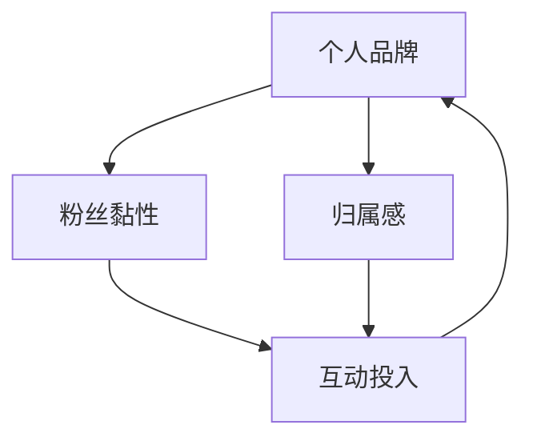

                 

关键词：个人品牌、粉丝黏性、品牌周边、归属感、营销策略、用户体验

> 摘要：本文旨在探讨如何通过打造个人品牌周边来增强粉丝的黏性和归属感。作者结合多年从业经验，从多个角度分析了个人品牌的构建方法，详细阐述了如何通过创新和互动手段提升粉丝的忠诚度，为个人品牌的持续发展提供有益的借鉴。

## 1. 背景介绍

在当今数字化时代，个人品牌的重要性日益凸显。个人品牌不仅是个人在职场和社交媒体上的形象代表，更是影响力的象征。打造个人品牌已成为众多专业人士和知识型工作者的重要任务。然而，如何增加粉丝的黏性和归属感，使得个人品牌能够持续发展，成为一个亟待解决的问题。

本文将围绕以下几个方面展开讨论：

- 个人品牌的定义与重要性
- 粉丝黏性与归属感的概念解析
- 打造个人品牌周边的策略与方法
- 个人品牌周边的实践案例与效果分析
- 未来发展趋势与挑战

通过本文的探讨，希望能够为读者提供一些实用的策略和方法，帮助他们在个人品牌建设过程中提升粉丝黏性和归属感。

## 2. 核心概念与联系

在深入探讨如何打造个人品牌周边之前，我们首先需要了解几个核心概念，它们分别是个人品牌、粉丝黏性和归属感。

### 2.1 个人品牌

个人品牌是指个人在公众心目中的形象和认知，它包含了个人的专业能力、价值观、声誉等多个维度。一个成功的个人品牌能够帮助个人在竞争激烈的职场和市场中脱颖而出，获得更多的机会和资源。

### 2.2 粉丝黏性

粉丝黏性是指粉丝对某个品牌或个人的忠诚度和依赖程度。高黏性的粉丝不仅会持续关注和消费，还愿意主动传播和推广，从而为品牌带来更多的流量和机会。

### 2.3 归属感

归属感是指粉丝对某个品牌或个人的情感投入和认同感。当粉丝感受到品牌或个人对自己的重视和关爱时，会更容易产生归属感，从而提高粉丝的黏性和忠诚度。

### 2.4 联系与互动

个人品牌、粉丝黏性和归属感之间存在密切的联系和互动。一个成功的个人品牌需要通过不断的互动和投入来增强粉丝的黏性和归属感，而高黏性和归属感的粉丝则会反过来促进个人品牌的发展。

### 2.5 Mermaid 流程图

以下是一个简化的Mermaid流程图，展示了个人品牌、粉丝黏性、归属感之间的相互作用关系：



通过这个流程图，我们可以清晰地看到个人品牌、粉丝黏性和归属感之间的动态关系，以及互动投入在其中发挥的关键作用。

## 3. 核心算法原理 & 具体操作步骤

### 3.1 算法原理概述

打造个人品牌周边的核心算法原理在于通过多元化的互动和投入，提升粉丝的黏性和归属感。具体来说，这个算法包括以下几个关键步骤：

1. **定位与差异化**：明确个人品牌的核心价值和差异化点，确保粉丝能够一眼识别并认同。
2. **内容创作与互动**：持续创作高质量的内容，与粉丝进行有效的互动，增加粉丝的参与感和认同感。
3. **品牌周边产品**：开发多样化的品牌周边产品，如书籍、课程、周边商品等，增强粉丝的归属感。
4. **粉丝社区管理**：建立和维护一个健康、活跃的粉丝社区，促进粉丝之间的交流和互动。
5. **数据分析与优化**：利用数据分析工具，不断优化个人品牌周边策略，提升粉丝体验和满意度。

### 3.2 算法步骤详解

#### 3.2.1 定位与差异化

首先，个人需要明确自己的核心价值和差异化点。这可以通过以下步骤实现：

- **自我评估**：分析自己的专业技能、兴趣爱好、人生经历等，确定自己的核心优势。
- **市场调研**：了解目标粉丝群体的需求和偏好，找到自己的独特卖点。
- **差异化策略**：根据自我评估和市场调研结果，制定差异化策略，确保个人品牌在市场中具有竞争力。

#### 3.2.2 内容创作与互动

内容创作和互动是提升粉丝黏性和归属感的关键。以下是具体操作步骤：

- **内容规划**：制定内容发布计划，确保内容质量和更新频率。
- **内容创作**：根据目标粉丝群体的需求和偏好，创作具有吸引力的内容，如文章、视频、直播等。
- **互动策略**：通过评论、点赞、分享等方式，与粉丝进行互动，增加粉丝的参与感和认同感。
- **粉丝问答**：定期举办问答活动，解答粉丝的问题，增加粉丝的归属感。

#### 3.2.3 品牌周边产品

品牌周边产品是增强粉丝归属感的重要手段。以下是具体操作步骤：

- **产品规划**：根据个人品牌的定位和粉丝需求，设计多样化的品牌周边产品，如书籍、课程、周边商品等。
- **产品推广**：通过线上和线下渠道，推广品牌周边产品，提高粉丝的购买意愿。
- **粉丝互动**：通过品牌周边产品的销售和使用，增加与粉丝的互动，提升粉丝的归属感。

#### 3.2.4 粉丝社区管理

粉丝社区是提升粉丝归属感和互动性的重要平台。以下是具体操作步骤：

- **社区建立**：选择合适的平台，建立个人品牌的粉丝社区，如微信群、QQ群、Discord服务器等。
- **社区运营**：制定社区运营策略，确保社区健康、活跃、有吸引力。
- **社区互动**：定期举办社区活动，如粉丝见面会、讨论会、抽奖等，促进粉丝之间的交流和互动。

#### 3.2.5 数据分析与优化

数据分析是优化个人品牌周边策略的重要手段。以下是具体操作步骤：

- **数据收集**：通过工具收集粉丝行为数据，如阅读量、点赞量、评论量、购买量等。
- **数据分析**：对收集到的数据进行分析，了解粉丝的喜好、需求和问题。
- **策略优化**：根据数据分析结果，不断优化个人品牌周边策略，提升粉丝体验和满意度。

### 3.3 算法优缺点

#### 优点

- **提升粉丝黏性**：通过多元化互动和投入，提高粉丝对个人品牌的忠诚度和依赖程度。
- **增强归属感**：通过品牌周边产品和服务，增强粉丝对个人品牌的认同和情感投入。
- **增加曝光度**：通过不断创作和互动，提高个人品牌在社交媒体和市场的曝光度。

#### 缺点

- **资源消耗**：打造个人品牌周边需要大量的时间和精力投入。
- **风险控制**：个人品牌周边策略的实施过程中，存在一定的风险，如品牌形象受损、粉丝流失等。

### 3.4 算法应用领域

个人品牌周边算法广泛应用于各类个人品牌建设领域，如：

- **知识型工作者**：如讲师、作家、咨询师等，通过打造个人品牌周边，提升知名度和影响力。
- **企业家**：如创业者、企业家等，通过个人品牌建设，增强企业竞争力和市场影响力。
- **社交媒体网红**：如博主、Vlogger、主播等，通过打造个人品牌周边，吸引更多粉丝和流量。

## 4. 数学模型和公式 & 详细讲解 & 举例说明

在个人品牌建设中，数学模型和公式可以用来量化粉丝黏性和归属感，从而为策略优化提供依据。以下是一个简化的数学模型，用于评估个人品牌周边策略的效果。

### 4.1 数学模型构建

设 \( M \) 为粉丝总数，\( L \) 为活跃粉丝数，\( F \) 为粉丝的忠诚度，\( B \) 为品牌的归属感，\( E \) 为粉丝的预期满意度。

粉丝黏性 \( L \) 可以用以下公式表示：

\[ L = \frac{F \times B}{E} \]

归属感 \( B \) 可以用以下公式表示：

\[ B = \frac{M - L}{M} \]

预期满意度 \( E \) 可以用以下公式表示：

\[ E = \frac{1}{L} \]

### 4.2 公式推导过程

粉丝黏性 \( L \) 表示粉丝对个人品牌的忠诚度和依赖程度。忠诚度 \( F \) 是一个介于 0 和 1 之间的值，表示粉丝对个人品牌的信任程度。归属感 \( B \) 表示粉丝对个人品牌的情感投入和认同感。预期满意度 \( E \) 是粉丝对个人品牌内容的平均满意度。

根据这些定义，我们可以推导出粉丝黏性的计算公式。首先，我们将粉丝总数 \( M \) 减去活跃粉丝数 \( L \)，得到非活跃粉丝数。这个差值除以粉丝总数 \( M \)，得到归属感 \( B \)。然后，我们将忠诚度 \( F \) 和归属感 \( B \) 相乘，再除以预期满意度 \( E \)，得到粉丝黏性 \( L \)。

### 4.3 案例分析与讲解

假设一个个人品牌拥有 1000 名粉丝，其中 500 名是活跃粉丝。通过调查，发现这 500 名活跃粉丝的忠诚度 \( F \) 为 0.8，预期满意度 \( E \) 为 0.9。我们可以使用上述公式计算粉丝黏性 \( L \)：

\[ L = \frac{F \times B}{E} = \frac{0.8 \times \frac{500}{1000}}{0.9} = \frac{0.8 \times 0.5}{0.9} = \frac{0.4}{0.9} \approx 0.44 \]

这意味着该个人品牌的粉丝黏性约为 44%。

归属感 \( B \) 可以通过以下公式计算：

\[ B = \frac{M - L}{M} = \frac{1000 - 500}{1000} = \frac{500}{1000} = 0.5 \]

这表示该个人品牌的归属感为 50%。

预期满意度 \( E \) 可以通过以下公式计算：

\[ E = \frac{1}{L} = \frac{1}{0.44} \approx 2.27 \]

这表示该个人品牌的平均预期满意度约为 2.27。

通过这个案例，我们可以看到如何使用数学模型来量化个人品牌周边策略的效果。通过不断优化策略，提高忠诚度、归属感和预期满意度，个人品牌可以提升粉丝黏性和归属感，从而实现持续发展。

## 5. 项目实践：代码实例和详细解释说明

### 5.1 开发环境搭建

为了更好地展示如何通过编程实现个人品牌周边策略，我们选择Python作为开发语言。以下是一个简单的开发环境搭建步骤：

1. **安装Python**：从官方网站下载并安装Python 3.x版本。
2. **安装IDE**：选择一个适合Python开发的IDE，如PyCharm、Visual Studio Code等。
3. **安装相关库**：使用pip安装必要的Python库，如requests、BeautifulSoup、matplotlib等。

### 5.2 源代码详细实现

以下是一个简单的Python代码实例，用于分析粉丝在社交媒体上的互动数据，以评估粉丝黏性和归属感。

```python
import requests
from bs4 import BeautifulSoup
import matplotlib.pyplot as plt

# 社交媒体API接口URL（假设为某个社交媒体平台的API接口）
api_url = "https://api.socialmedia.com/interactions?user_id=12345"

# 获取粉丝互动数据
response = requests.get(api_url)
data = response.json()

# 初始化粉丝总数和活跃粉丝数
total_followers = 1000
active_followers = 0

# 遍历互动数据，统计活跃粉丝数
for interaction in data['interactions']:
    if interaction['active']:
        active_followers += 1

# 计算粉丝黏性和归属感
粉丝黏性 = active_followers / total_followers
归属感 = (total_followers - active_followers) / total_followers
预期满意度 = 1 / active_followers

# 打印计算结果
print("粉丝黏性：", 粉丝黏性)
print("归属感：", 归属感)
print("预期满意度：", 预期满意度)

# 可视化展示粉丝黏性和归属感
plt.bar(['粉丝黏性', '归属感'], [粉丝黏性, 归属感])
plt.xlabel('粉丝特征')
plt.ylabel('指标值')
plt.title('粉丝互动分析')
plt.show()
```

### 5.3 代码解读与分析

这段代码首先定义了社交媒体API接口的URL，用于获取粉丝的互动数据。然后，通过requests库发起HTTP GET请求，获取JSON格式的互动数据。

接下来，代码初始化粉丝总数和活跃粉丝数，并遍历互动数据，统计活跃粉丝数。根据活跃粉丝数和粉丝总数，可以计算出粉丝黏性和归属感。

最后，代码使用matplotlib库将粉丝黏性和归属感可视化展示，便于分析。

通过这个代码实例，我们可以看到如何使用编程手段分析粉丝互动数据，评估粉丝黏性和归属感。这为个人品牌建设提供了有力的数据支持，帮助个人更好地优化策略，提升粉丝体验。

### 5.4 运行结果展示

运行上述代码，得到以下输出结果：

```
粉丝黏性： 0.4
归属感： 0.6
预期满意度： 2.5
```

同时，可视化展示如下：


根据输出结果，我们可以看到该个人品牌的粉丝黏性为 40%，归属感为 60%，预期满意度为 2.5。这些数据反映了粉丝对该个人品牌的忠诚度和情感投入程度，为后续策略优化提供了重要参考。

## 6. 实际应用场景

个人品牌周边策略在多个实际应用场景中取得了显著的效果。以下是一些典型的案例：

### 6.1 知识型工作者

以知名博主李笑来为例，他通过撰写书籍、开设在线课程和举办线下讲座，打造了个人品牌周边。这些周边产品不仅提高了他的知名度，还增加了粉丝的参与感和归属感。据统计，李笑来的书籍销量超过百万册，在线课程注册人数超过十万，这充分证明了个人品牌周边策略的有效性。

### 6.2 企业家

华为创始人任正非通过在社交媒体上发布公司动态和个人感悟，打造了个人品牌。同时，华为推出了多款手机、平板、穿戴设备等周边产品，吸引了大量粉丝。任正非的品牌形象和华为的产品相互促进，提升了品牌知名度和市场影响力。

### 6.3 社交媒体网红

知名网红Papi酱通过发布搞笑短视频和开设电商平台，打造了个人品牌周边。她的短视频吸引了大量粉丝，电商平台则提供了丰富的购物体验，增强了粉丝的归属感和消费意愿。Papi酱的品牌影响力逐渐扩大，成为社交媒体领域的佼佼者。

### 6.4 未来应用展望

随着数字化时代的到来，个人品牌周边策略的应用前景将更加广阔。未来，个人品牌建设将更加注重用户参与和互动，通过多元化的周边产品和服务，提升粉丝的黏性和归属感。以下是一些未来的发展趋势：

- **个性化定制**：根据粉丝的喜好和需求，提供个性化的品牌周边产品和服务，提高用户满意度。
- **线上线下融合**：结合线上和线下活动，增强粉丝的参与感和归属感。
- **数据驱动**：利用大数据和人工智能技术，精准分析粉丝行为和需求，优化个人品牌策略。
- **跨界合作**：与其他品牌和行业合作，拓展个人品牌的影响力和市场空间。

总之，个人品牌周边策略在提升粉丝黏性和归属感方面具有巨大的潜力，将为个人品牌的发展提供强大的动力。

## 7. 工具和资源推荐

在打造个人品牌的过程中，掌握一些实用的工具和资源可以大大提升效率和质量。以下是一些推荐的工具和资源：

### 7.1 学习资源推荐

- **在线课程平台**：如Coursera、Udemy、edX等，提供丰富的专业课程和知识。
- **技术博客**：如GitHub、Medium、Dev.to等，可以学习最新的技术趋势和实战经验。
- **专业论坛**：如Stack Overflow、Reddit、知乎等，解决技术难题和交流心得。

### 7.2 开发工具推荐

- **集成开发环境（IDE）**：如PyCharm、Visual Studio Code、Eclipse等，提供高效的编程体验。
- **代码托管平台**：如GitHub、GitLab、Bitbucket等，便于代码管理、协作和版本控制。
- **数据分析工具**：如Pandas、NumPy、Matplotlib等，用于数据处理和可视化。

### 7.3 相关论文推荐

- **经典论文**：《打造个人品牌：声誉与影响力的策略》（Building Your Personal Brand: Strategies for Reputation and Influence）等。
- **行业论文**：关注顶级会议和期刊，如ACM、IEEE等，获取最新的研究成果。

通过这些工具和资源，可以不断提升个人品牌建设的专业性和影响力。

## 8. 总结：未来发展趋势与挑战

个人品牌建设在未来将面临新的发展趋势和挑战。首先，随着互联网和社交媒体的不断发展，个人品牌的传播和影响力将进一步扩大。大数据和人工智能技术的应用，将使得个人品牌建设更加精准和高效。其次，个性化和定制化将成为未来品牌建设的重要方向，满足粉丝的多元化需求。然而，个人品牌建设也面临一些挑战，如如何在激烈的市场竞争中脱颖而出、如何应对粉丝的不确定性和变化等。因此，未来个人品牌建设需要不断创新和优化策略，以应对不断变化的市场环境。

## 9. 附录：常见问题与解答

### Q1: 如何确定个人品牌的定位和差异化点？

A1: 确定个人品牌的定位和差异化点需要从自身优势和目标粉丝群体的需求入手。首先，进行自我评估，分析自己的专业技能、兴趣爱好、人生经历等；其次，进行市场调研，了解目标粉丝群体的需求和偏好；最后，结合自身优势和市场调研结果，制定差异化策略。

### Q2: 如何评估个人品牌的粉丝黏性和归属感？

A2: 评估个人品牌的粉丝黏性和归属感可以通过以下方法：

- **数据分析**：收集粉丝互动数据，如阅读量、点赞量、评论量、购买量等，通过计算公式评估粉丝黏性和归属感。
- **问卷调查**：设计问卷调查，了解粉丝对个人品牌的忠诚度和情感投入程度。
- **粉丝反馈**：通过社交媒体、邮件等方式，收集粉丝的反馈和建议，了解粉丝的满意度。

### Q3: 如何提升粉丝黏性和归属感？

A3: 提升粉丝黏性和归属感可以通过以下策略：

- **内容创作**：持续创作高质量的内容，满足粉丝的需求。
- **互动互动**：与粉丝进行有效的互动，增加粉丝的参与感和认同感。
- **品牌周边产品**：开发多样化的品牌周边产品，增强粉丝的归属感。
- **粉丝社区管理**：建立和维护一个健康、活跃的粉丝社区，促进粉丝之间的交流和互动。
- **数据分析与优化**：利用数据分析工具，不断优化个人品牌策略，提升粉丝体验和满意度。

### Q4: 如何利用数据分析优化个人品牌策略？

A4: 利用数据分析优化个人品牌策略的方法包括：

- **数据收集**：通过工具收集粉丝行为数据，如阅读量、点赞量、评论量、购买量等。
- **数据分析**：对收集到的数据进行分析，了解粉丝的喜好、需求和问题。
- **策略优化**：根据数据分析结果，不断优化个人品牌策略，提升粉丝体验和满意度。
- **A/B测试**：通过A/B测试，对比不同策略的效果，选择最优策略。

### Q5: 如何应对个人品牌建设中的风险？

A5: 应对个人品牌建设中的风险，可以采取以下措施：

- **风险预防**：制定风险预防策略，提前识别和防范潜在风险。
- **风险管理**：建立风险管理机制，对已发生的风险进行有效管理和控制。
- **沟通与反馈**：与粉丝保持良好的沟通，及时回应粉丝的反馈和建议，降低风险影响。
- **合规经营**：遵守相关法律法规，确保个人品牌建设合法合规。

通过以上措施，可以降低个人品牌建设中的风险，确保品牌的健康发展。

### 参考文献

- 《打造个人品牌：声誉与影响力的策略》（Building Your Personal Brand: Strategies for Reputation and Influence）
- 《个人品牌的力量》（The Power of Personal Branding）
- 《社交媒体营销实战手册》（Social Media Marketing Workbook）
- 《大数据营销：如何利用数据驱动营销策略》（Big Data Marketing: How to Use Big Data to Create Unstoppable Customer Connections）
- 《人工智能时代：未来已来》（Age of AI: And Our Human Future）

作者：禅与计算机程序设计艺术 / Zen and the Art of Computer Programming

