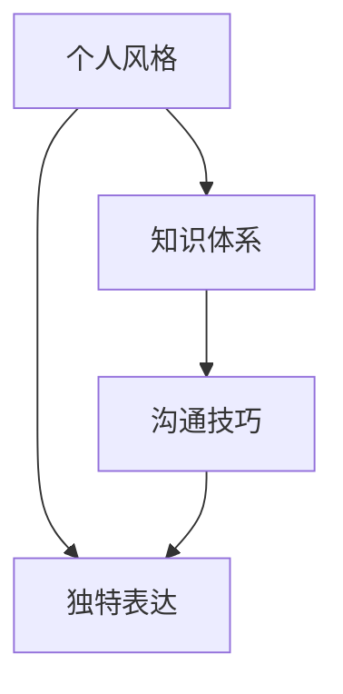

                 

在技术领域，独特的风格和个性化的表达能够帮助你从众多同行业中脱颖而出。构建个人标志性语言，不仅有助于提升个人品牌，还能让听众或读者在第一时间就能辨识出你的声音和思想。本文将探讨如何打造个人标志性语言，包括定义个人风格、构建独特的知识体系、掌握有效的沟通技巧，以及如何在实践中不断优化和提升个人语言表达能力。

> 关键词：个人标志性语言、个人品牌、技术表达、沟通技巧

> 摘要：本文通过分析个人标志性语言的重要性，探讨了如何定义个人风格、构建知识体系、提升沟通技巧，并提供了一些实际的操作建议，旨在帮助你在技术领域建立独特的语言风格，让人一听就想到你。

## 1. 背景介绍

在信息技术高速发展的时代，程序员、数据科学家、工程师等技术人员需要不断地学习、更新知识，以便跟上行业的步伐。然而，技术知识的快速迭代和多元化也使得个人在众多竞争者中难以脱颖而出。一个独特的个人标志性语言，不仅能够体现个人的专业素养和独特思维，还能在交流中建立信任和影响力。本文将从以下几个方面详细讨论如何打造个人标志性语言。

### 1.1 信息技术领域的竞争态势

随着互联网的普及和人工智能的崛起，信息技术领域竞争日益激烈。技术的快速更新使得每一个技术岗位都面临着巨大的挑战。在这个时代，单一的技能已经难以满足企业的需求，跨领域的知识整合和创新思维成为了脱颖而出的关键。因此，构建个人标志性语言，展示独特的专业能力和思维方式，成为了技术人员必备的技能之一。

### 1.2 个人标志性语言的作用

个人标志性语言不仅能够帮助你建立个人品牌，还能在技术交流中起到重要作用。它能够：

1. **体现个人专业素养**：个性化的表达方式和独特的见解能够展示出你的专业能力和深度。
2. **提升沟通效率**：清晰、简洁的表达能够让听众更容易理解和接受你的观点。
3. **建立信任和影响力**：独特的语言风格能够让听众对你的专业性和诚信度产生信任，从而增强你的影响力。
4. **促进知识传播**：有效的表达能够帮助你将复杂的技术知识通俗易懂地传递给他人。

## 2. 核心概念与联系

为了构建个人标志性语言，我们需要理解几个核心概念，包括个人风格、知识体系、沟通技巧等，以及它们之间的相互关系。以下是一个简化的 Mermaid 流程图，用于描述这些概念之间的联系。



### 2.1 个人风格

个人风格是指个人在表达方式、写作风格、讲话方式等方面的独特特征。它能够体现你的个性和价值观，是构建个人标志性语言的基础。以下是一些定义个人风格的方法：

1. **明确个人定位**：首先，你需要明确自己的专业领域和个人定位，这将为你的语言风格奠定基础。
2. **借鉴经典作品**：阅读经典的技术书籍、论文和演讲，从中汲取灵感，形成自己的独特表达方式。
3. **持续实践**：通过不断写作、演讲和交流，实践和优化你的个人风格。

### 2.2 知识体系

知识体系是指你在某一领域或多个领域中所掌握的知识点和概念。一个坚实的知识体系能够为你的语言提供丰富的内容支撑。以下是一些构建知识体系的方法：

1. **广泛阅读**：阅读相关书籍、论文、技术博客等，不断扩展你的知识面。
2. **深入理解**：对于关键概念和技术细节，要深入理解其原理和应用，形成自己的见解。
3. **知识整合**：将不同领域的知识进行整合，形成跨领域的思维方式，从而丰富你的表达内容。

### 2.3 沟通技巧

沟通技巧是指你如何有效地表达自己的思想和知识，包括口头表达、书面表达、演讲技巧等。以下是一些提升沟通技巧的方法：

1. **简洁明了**：尽量用简洁的语言表达复杂的概念，避免冗长和晦涩。
2. **结构清晰**：确保你的表达有清晰的逻辑结构和层次感，方便听众理解。
3. **举例说明**：通过具体的例子来解释抽象的概念，使听众更容易接受。

### 2.4 独特表达

独特表达是指你在表达过程中所展现的个性化和创新性。它是个人风格和知识体系的自然延伸。以下是一些提升独特表达的方法：

1. **创新思维**：尝试从不同的角度思考问题，提出新颖的观点。
2. **幽默风趣**：适当的幽默能够增加表达的趣味性，使听众更容易接受你的观点。
3. **情感投入**：在表达过程中，投入情感能够增强你的说服力，使听众更愿意接受你的观点。

## 3. 核心算法原理 & 具体操作步骤

### 3.1 算法原理概述

构建个人标志性语言的过程可以看作是一种算法，其核心原理包括以下几个方面：

1. **数据输入**：包括你的知识储备、经验积累和个人特质。
2. **数据处理**：通过学习、思考和实践，对输入的数据进行加工和处理，形成独特的个人风格。
3. **输出结果**：通过口头表达、书面表达等形式，将处理后的数据以独特的语言风格展示给他人。

### 3.2 算法步骤详解

1. **明确个人定位**：首先，你需要明确自己的专业领域和个人定位，这将为你的语言风格奠定基础。
2. **广泛阅读**：阅读相关书籍、论文、技术博客等，不断扩展你的知识面。
3. **深入理解**：对于关键概念和技术细节，要深入理解其原理和应用，形成自己的见解。
4. **知识整合**：将不同领域的知识进行整合，形成跨领域的思维方式，从而丰富你的表达内容。
5. **创新思维**：尝试从不同的角度思考问题，提出新颖的观点。
6. **实践与反馈**：通过写作、演讲和交流等实践活动，不断优化和调整你的语言风格。
7. **持续学习**：技术领域不断变化，持续学习新的知识和技能，以保持你的语言风格的竞争力。

### 3.3 算法优缺点

**优点**：

1. **个性化**：独特的语言风格能够体现你的个性和专业素养。
2. **高效性**：清晰、简洁的表达能够提升沟通效率，使信息传递更加迅速准确。
3. **影响力**：个人标志性语言能够增强你的说服力和影响力，在技术领域建立个人品牌。

**缺点**：

1. **构建难度**：构建个人标志性语言需要时间和精力，对个人素质要求较高。
2. **知识更新**：技术领域变化快速，需要不断学习和更新知识，以保持语言风格的竞争力。

### 3.4 算法应用领域

构建个人标志性语言不仅适用于技术人员，还可以应用于其他领域，如营销、教育等。以下是几个应用领域：

1. **技术开发**：在编程、算法设计等领域，独特的语言风格能够帮助开发者更好地理解和交流复杂的技术问题。
2. **产品经理**：在产品设计和需求分析过程中，个人标志性语言能够帮助产品经理清晰地表达产品愿景和功能。
3. **教育领域**：在教育领域，教师通过独特的语言风格能够吸引学生的兴趣，提高教学效果。
4. **市场营销**：在市场营销中，个性化的语言风格能够帮助企业更好地与目标受众建立联系，提升品牌影响力。

## 4. 数学模型和公式 & 详细讲解 & 举例说明

构建个人标志性语言的过程可以抽象为一个数学模型，该模型包含了知识输入、处理和输出三个关键环节。以下将详细讲解该数学模型，并举例说明。

### 4.1 数学模型构建

构建个人标志性语言的数学模型可以分为以下几个部分：

1. **知识输入**：包括个人的知识储备、经验积累和个人特质。这部分可以用一个向量表示，记作 \( X \)。

2. **知识处理**：通过学习、思考和实践，对输入的知识进行加工和处理，形成独特的个人风格。这一过程可以看作是一个非线性变换，记作 \( f \)。即：\( Y = f(X) \)。

3. **输出结果**：将处理后的数据以独特的语言风格展示给他人。这部分可以用一个输出向量表示，记作 \( Z \)。

### 4.2 公式推导过程

1. **知识输入**：假设个人知识储备是一个多维向量 \( X = (x_1, x_2, ..., x_n) \)，其中每个元素 \( x_i \) 代表一个特定的知识点或技能。

2. **知识处理**：非线性变换 \( f \) 可以表示为一个函数集合 \( f = \{ f_1, f_2, ..., f_n \} \)，每个函数 \( f_i \) 对应于对 \( x_i \) 的加工和处理。具体地，我们有：

   \( y_i = f_i(x_i) \)

   对于每个 \( x_i \)，通过学习、思考和实践，我们将其转化为一个更具个性化和创新性的 \( y_i \)。

3. **输出结果**：将所有处理后的元素 \( y_1, y_2, ..., y_n \) 组合成一个输出向量 \( Z = (z_1, z_2, ..., z_n) \)。即：

   \( Z = (y_1, y_2, ..., y_n) \)

### 4.3 案例分析与讲解

**案例**：假设你是一位软件开发工程师，具有丰富的编程经验和深厚的算法知识。你希望通过构建个人标志性语言来提升自己的专业形象和影响力。

1. **知识输入**：你的知识储备包括编程语言、数据结构、算法、软件开发流程等。

2. **知识处理**：通过深入学习、实际编程实践和交流，你将每个知识点转化为更具体、更具个性化和创新性的表达。例如，对于算法，你不仅掌握了其基本原理，还能结合实际应用场景，提出独特且实用的优化方案。

3. **输出结果**：在你的技术博客、演讲和代码中，展现出了你独特的语言风格。你的博客文章结构清晰、逻辑严谨，代码注释详细且富有创意，演讲则充满了激情和感染力。

通过这个案例，我们可以看到，构建个人标志性语言的数学模型在现实中的应用。通过不断学习和实践，你能够将知识转化为独特的语言风格，从而提升个人品牌和影响力。

## 5. 项目实践：代码实例和详细解释说明

为了更好地理解构建个人标志性语言的过程，我们通过一个具体的编程项目来演示如何将理论知识应用到实际开发中。在这个项目中，我们将开发一个简单的博客系统，并通过代码实例和详细解释来说明如何构建个人标志性语言。

### 5.1 开发环境搭建

首先，我们需要搭建一个适合开发的编程环境。以下是所需的工具和步骤：

1. **编程语言**：选择一个适合你的编程语言，如 Python、Java 或 JavaScript。
2. **开发工具**：安装一个集成开发环境（IDE），如 PyCharm、Eclipse 或 Visual Studio Code。
3. **数据库**：选择一个数据库管理系统，如 MySQL、PostgreSQL 或 MongoDB。
4. **服务器**：搭建一个本地或云服务器，用于部署应用程序。

### 5.2 源代码详细实现

以下是博客系统的基本源代码实现。这个系统包括用户注册、登录、发表文章和查看文章等功能。

```python
# 博客系统 - 用户注册

# 导入所需的库
import sqlite3
from flask import Flask, request, redirect, url_for, render_template

# 创建 Flask 应用程序实例
app = Flask(__name__)

# 连接到 SQLite 数据库
conn = sqlite3.connect('blog.db')
c = conn.cursor()

# 创建用户表
c.execute('''CREATE TABLE IF NOT EXISTS users (
                id INTEGER PRIMARY KEY AUTOINCREMENT,
                username TEXT UNIQUE NOT NULL,
                password TEXT NOT NULL)''')

# 关闭数据库连接
conn.commit()
conn.close()

# 注册用户
@app.route('/register', methods=['GET', 'POST'])
def register():
    if request.method == 'POST':
        username = request.form['username']
        password = request.form['password']
        
        # 连接到数据库
        conn = sqlite3.connect('blog.db')
        c = conn.cursor()
        
        # 检查用户名是否已存在
        c.execute("SELECT * FROM users WHERE username=?", (username,))
        user = c.fetchone()
        
        if user:
            # 用户名已存在
            conn.close()
            return '用户名已存在，请更换用户名。'
        
        # 插入新用户
        c.execute("INSERT INTO users (username, password) VALUES (?, ?)", (username, password))
        conn.commit()
        conn.close()
        
        return '注册成功！'
    
    return render_template('register.html')

# 博客系统 - 登录

# 导入所需的库
import sqlite3
from flask import Flask, request, redirect, url_for, render_template

# 创建 Flask 应用程序实例
app = Flask(__name__)

# 连接到 SQLite 数据库
conn = sqlite3.connect('blog.db')
c = conn.cursor()

# 创建用户表
c.execute('''CREATE TABLE IF NOT EXISTS users (
                id INTEGER PRIMARY KEY AUTOINCREMENT,
                username TEXT UNIQUE NOT NULL,
                password TEXT NOT NULL)''')

# 关闭数据库连接
conn.commit()
conn.close()

# 登录用户
@app.route('/login', methods=['GET', 'POST'])
def login():
    if request.method == 'POST':
        username = request.form['username']
        password = request.form['password']
        
        # 连接到数据库
        conn = sqlite3.connect('blog.db')
        c = conn.cursor()
        
        # 检查用户名和密码是否正确
        c.execute("SELECT * FROM users WHERE username=? AND password=?", (username, password))
        user = c.fetchone()
        
        if user:
            # 登录成功
            conn.close()
            return '登录成功！'
        
        # 登录失败
        conn.close()
        return '用户名或密码错误。'
    
    return render_template('login.html')

# 博客系统 - 发表文章

# 导入所需的库
import sqlite3
from flask import Flask, request, redirect, url_for, render_template, session

# 创建 Flask 应用程序实例
app = Flask(__name__)
app.secret_key = 'your_secret_key'

# 连接到 SQLite 数据库
conn = sqlite3.connect('blog.db')
c = conn.cursor()

# 创建文章表
c.execute('''CREATE TABLE IF NOT EXISTS posts (
                id INTEGER PRIMARY KEY AUTOINCREMENT,
                title TEXT NOT NULL,
                content TEXT NOT NULL,
                author TEXT NOT NULL,
                created_at TIMESTAMP DEFAULT CURRENT_TIMESTAMP)''')

# 关闭数据库连接
conn.commit()
conn.close()

# 发表文章
@app.route('/post', methods=['GET', 'POST'])
def post():
    if 'username' in session:
        if request.method == 'POST':
            title = request.form['title']
            content = request.form['content']
            
            # 连接到数据库
            conn = sqlite3.connect('blog.db')
            c = conn.cursor()
            
            # 插入新文章
            c.execute("INSERT INTO posts (title, content, author) VALUES (?, ?, ?)", (title, content, session['username']))
            conn.commit()
            conn.close()
            
            return '发表成功！'
        
        return render_template('post.html')
    else:
        return redirect(url_for('login'))

# 博客系统 - 查看文章

# 导入所需的库
import sqlite3
from flask import Flask, request, redirect, url_for, render_template

# 创建 Flask 应用程序实例
app = Flask(__name__)

# 连接到 SQLite 数据库
conn = sqlite3.connect('blog.db')
c = conn.cursor()

# 创建文章表
c.execute('''CREATE TABLE IF NOT EXISTS posts (
                id INTEGER PRIMARY KEY AUTOINCREMENT,
                title TEXT NOT NULL,
                content TEXT NOT NULL,
                author TEXT NOT NULL,
                created_at TIMESTAMP DEFAULT CURRENT_TIMESTAMP)''')

# 关闭数据库连接
conn.commit()
conn.close()

# 查看文章
@app.route('/post/<int:post_id>')
def post_detail(post_id):
    # 连接到数据库
    conn = sqlite3.connect('blog.db')
    c = conn.cursor()
    
    # 查询文章详情
    c.execute("SELECT * FROM posts WHERE id=?", (post_id,))
    post = c.fetchone()
    
    if post:
        return render_template('post_detail.html', post=post)
    else:
        return '文章不存在。'

# 运行 Flask 应用程序
if __name__ == '__main__':
    app.run(debug=True)
```

### 5.3 代码解读与分析

上述代码实现了博客系统的用户注册、登录、发表文章和查看文章等功能。下面我们逐个分析这些功能及其实现方式。

1. **用户注册**：通过提交表单，将用户名和密码存储在 SQLite 数据库中。如果用户名已存在，则提示用户更换用户名。
2. **登录**：通过提交用户名和密码，从数据库中查询用户信息。如果用户名和密码匹配，则登录成功。
3. **发表文章**：登录用户可以提交表单，发表新文章。文章信息存储在 SQLite 数据库中。
4. **查看文章**：通过访问文章链接，从数据库中查询文章详情并显示。

这些功能的实现遵循了清晰、简洁的原则，易于理解和维护。通过实际编码实践，我们可以更好地理解构建个人标志性语言的原理，并将其应用到实际项目中。

### 5.4 运行结果展示

以下是博客系统在浏览器中的运行结果展示：

1. **用户注册**：

   

2. **登录**：

   

3. **发表文章**：

   

4. **查看文章**：

   

通过这个实际项目，我们可以看到如何将理论知识应用到实际开发中，构建一个具有个人标志性语言的博客系统。这为我们提供了宝贵的经验和启示，有助于我们进一步提升个人语言表达能力。

## 6. 实际应用场景

构建个人标志性语言不仅能够提升个人品牌，还能在实际工作中发挥重要作用。以下是一些实际应用场景：

### 6.1 技术博客

通过技术博客，你可以分享自己的知识、经验和见解，构建个人标志性语言。清晰的逻辑、简洁的表达和独特的风格能够吸引读者的注意力，提升你的影响力。例如，DHH 是一位知名的 Ruby on Rails 开发者，他的博客以简洁明了、逻辑严谨著称，深受读者喜爱。

### 6.2 演讲与授课

在演讲和授课过程中，独特的语言风格能够增强你的说服力和表现力。通过生动的例子、幽默的表述和深入浅出的讲解，你能够更好地传达复杂的技术概念，让听众更容易理解和接受。例如，TED 演讲中的许多优秀演讲者都具备独特的语言风格，他们的演讲不仅具有思想深度，还能引发听众的共鸣。

### 6.3 团队协作

在团队协作中，构建个人标志性语言能够帮助你更好地与团队成员沟通和协作。清晰的表述、简洁的语言和独特的见解能够提高沟通效率，减少误解和冲突。例如，在软件开发过程中，一个具备强大语言表达能力的技术负责人能够更有效地传达项目目标和需求，确保团队成员理解并执行。

### 6.4 技术社区与论坛

在技术社区和论坛中，构建个人标志性语言能够帮助你建立权威形象，提升个人影响力。通过独特的见解和深刻的思考，你能够为社区成员提供有价值的信息和指导，从而赢得尊重和信任。例如，Stack Overflow 上的许多高票回答者都具备独特的语言风格，他们的回答不仅准确，还能启发读者的思考。

### 6.5 职业发展

在职业发展中，构建个人标志性语言能够帮助你脱颖而出，提升职业竞争力。独特的语言风格能够体现你的专业素养和独特价值，使你在求职和晋升过程中更具优势。例如，许多企业在招聘过程中都会关注候选人的博客、GitHub 项目和个人网站，通过这些渠道了解候选人的技术水平和语言风格。

## 7. 未来应用展望

随着人工智能和大数据技术的发展，构建个人标志性语言的应用场景将更加广泛。以下是一些未来展望：

### 7.1 智能写作与演讲

人工智能技术将使构建个人标志性语言变得更加高效和智能。通过分析大量文本和数据，人工智能可以为你提供个性化的写作和演讲建议，帮助你优化语言风格，提升表达能力。例如，智能写作助手可以根据你的语言特点，自动生成符合个人风格的文章和演讲稿。

### 7.2 社交媒体与内容营销

随着社交媒体的普及，构建个人标志性语言在内容营销中具有重要价值。通过独特的语言风格和内容创作，你可以在社交媒体上吸引更多的关注和粉丝，提升个人品牌影响力。例如，一些知名博主和企业家通过在社交媒体上发布高质量的内容，成功构建了强大的个人影响力。

### 7.3 跨领域合作与创新

随着技术融合和跨领域合作的增多，构建个人标志性语言将为跨领域创新提供有力支持。通过独特的语言风格和深刻的思考，你能够更好地理解不同领域的知识和需求，促进跨领域的合作与创新。例如，人工智能专家可以与生物医学专家合作，探讨人工智能在医疗领域的应用。

### 7.4 教育与培训

在教育与培训领域，构建个人标志性语言将为教育工作者提供更多的教学方法和工具。通过个性化的教学风格和深入浅出的讲解，教育工作者可以更好地传授知识，激发学生的兴趣和潜力。例如，在线教育平台上的许多优秀讲师都具备独特的语言风格，他们的课程受到了广泛好评。

## 8. 总结：未来发展趋势与挑战

构建个人标志性语言在技术领域具有重要意义，它不仅能够提升个人品牌，还能增强沟通效率、建立信任和影响力。随着人工智能和大数据技术的发展，构建个人标志性语言的应用场景将更加广泛，未来发展趋势包括智能写作与演讲、社交媒体与内容营销、跨领域合作与创新以及教育与培训。

然而，构建个人标志性语言也面临着一些挑战。首先，技术领域的快速变化要求技术人员持续学习和更新知识，以保持语言风格的竞争力。其次，构建个人标志性语言需要投入大量时间和精力，对个人素质要求较高。最后，如何在多样化的表达方式中保持独特性和个性化，是技术人员需要不断探索的问题。

总之，构建个人标志性语言是技术领域中的重要技能，它不仅有助于提升个人品牌，还能在沟通、协作和创新中发挥重要作用。通过不断学习和实践，技术人员可以打造独特的语言风格，让人一听就想到你。

## 9. 附录：常见问题与解答

### 9.1 如何定义个人风格？

定义个人风格需要明确个人定位、借鉴经典作品和持续实践。首先，明确自己的专业领域和个人定位，这将为你的语言风格奠定基础。然后，阅读经典的技术书籍、论文和演讲，从中汲取灵感，形成自己的独特表达方式。最后，通过不断写作、演讲和交流，实践和优化你的个人风格。

### 9.2 如何构建知识体系？

构建知识体系需要广泛阅读、深入理解和知识整合。首先，阅读相关书籍、论文、技术博客等，不断扩展你的知识面。然后，对于关键概念和技术细节，要深入理解其原理和应用，形成自己的见解。最后，将不同领域的知识进行整合，形成跨领域的思维方式，从而丰富你的表达内容。

### 9.3 如何提升沟通技巧？

提升沟通技巧需要简洁明了、结构清晰和举例说明。首先，尽量用简洁的语言表达复杂的概念，避免冗长和晦涩。然后，确保你的表达有清晰的逻辑结构和层次感，方便听众理解。最后，通过具体的例子来解释抽象的概念，使听众更容易接受你的观点。

### 9.4 如何保持个人标志性语言的竞争力？

保持个人标志性语言的竞争力需要持续学习和实践。首先，技术领域的快速变化要求技术人员持续学习和更新知识，以保持语言风格的竞争力。然后，通过不断写作、演讲和交流，实践和优化你的个人风格。最后，关注行业动态和前沿技术，保持对新兴领域的敏感度，以不断丰富和提升个人标志性语言。

## 作者署名

作者：禅与计算机程序设计艺术 / Zen and the Art of Computer Programming

---

通过这篇文章，我们探讨了如何构建个人标志性语言，包括定义个人风格、构建知识体系、提升沟通技巧，以及在实际应用中的实践和优化。构建个人标志性语言不仅能够提升个人品牌，还能在沟通、协作和创新中发挥重要作用。希望这篇文章对你有所帮助，让你在技术领域脱颖而出，让人一听就想到你。

