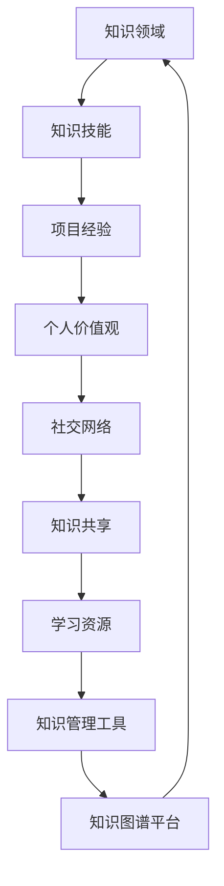

                 

关键词：知识图谱、个人学习、知识管理、编程实践、知识结构化

> 摘要：本文旨在探讨如何通过构建个人知识图谱，帮助程序员更好地管理和利用知识，提高学习效率和编程能力。文章从背景介绍、核心概念、算法原理、数学模型、项目实践、实际应用等多个维度展开，为读者提供一套完整的知识图谱构建指南。

## 1. 背景介绍

在信息化时代，知识已成为企业和个人竞争的重要资源。对于程序员来说，掌握大量的知识是提升编程能力和解决复杂问题的前提。然而，随着技术的快速发展，知识更新速度加快，如何有效地管理和利用知识成为一个亟待解决的问题。

知识图谱作为一种新兴的知识管理技术，以其强大的语义理解和推理能力，逐渐成为知识管理领域的研究热点。个人知识图谱则是知识图谱技术在个人学习领域的应用，旨在帮助程序员构建系统化的知识体系，提升学习效率和编程能力。

本文将从以下几个方面探讨如何打造个人知识图谱：核心概念与联系、核心算法原理、数学模型和公式、项目实践、实际应用场景、工具和资源推荐以及未来发展趋势。

## 2. 核心概念与联系

### 2.1 知识图谱

知识图谱是一种基于语义理解的数据结构，用于表示实体及其之间的关系。在知识图谱中，实体可以是人、地点、组织、事件等，关系则表示实体之间的关联，如“属于”、“位于”、“参与”等。

### 2.2 个人知识图谱

个人知识图谱是基于知识图谱技术构建的，用于表示个人知识和经验的结构化模型。它包括个人知识领域、知识技能、项目经验等多个维度，通过图形化的方式展示个人知识体系。

### 2.3 Mermaid 流程图

为了更好地理解个人知识图谱的构建过程，我们使用 Mermaid 流程图来展示其核心概念和联系。



### 2.4 个人知识图谱与编程实践的关系

个人知识图谱不仅是知识管理的工具，更是编程实践的指南。通过个人知识图谱，程序员可以：

- 快速定位相关知识点，解决编程问题。
- 分析项目经验，提炼通用解决方案。
- 发现知识盲点，制定学习计划。

## 3. 核心算法原理 & 具体操作步骤

### 3.1 算法原理概述

个人知识图谱的构建主要依赖于以下三种核心算法：

- 实体识别：从非结构化数据中提取出具有明确含义的实体。
- 关系抽取：分析实体之间的关系，构建图谱中的边。
- 知识融合：对重复或冲突的知识进行整合，确保知识的一致性。

### 3.2 算法步骤详解

#### 3.2.1 实体识别

实体识别主要通过自然语言处理技术实现，包括词性标注、命名实体识别等。具体步骤如下：

1. **词性标注**：对文本进行分词，并标注每个词的词性。
2. **命名实体识别**：识别出具有明确含义的实体，如人名、地名、组织名等。
3. **实体归类**：将识别出的实体归类到相应的知识领域。

#### 3.2.2 关系抽取

关系抽取主要通过信息抽取技术实现，包括规则抽取、统计模型、神经网络模型等。具体步骤如下：

1. **规则抽取**：根据先验知识，设计规则来抽取实体之间的关系。
2. **统计模型**：使用机器学习算法，从大规模数据中学习关系抽取模型。
3. **神经网络模型**：使用深度学习算法，如卷积神经网络、循环神经网络等，实现关系抽取。

#### 3.2.3 知识融合

知识融合主要通过对比分析、冲突检测、知识整合等步骤实现。具体步骤如下：

1. **对比分析**：对比不同来源的知识，识别出重复或冲突的部分。
2. **冲突检测**：通过一致性检查，发现知识中的矛盾和冲突。
3. **知识整合**：对重复或冲突的知识进行整合，确保知识的一致性。

### 3.3 算法优缺点

- **实体识别**：优点在于能够快速从文本中提取出实体，缺点是准确性受文本质量影响。
- **关系抽取**：优点在于能够自动构建实体之间的关系，缺点是规则抽取和统计模型的性能受数据质量和模型复杂度影响。
- **知识融合**：优点在于能够确保知识的一致性，缺点是冲突检测和整合的复杂性较高。

### 3.4 算法应用领域

个人知识图谱算法在多个领域具有广泛的应用，如：

- **软件开发**：帮助程序员快速定位相关知识点，提高开发效率。
- **知识共享**：构建团队知识库，促进知识传播和协作。
- **教育领域**：帮助学生构建知识体系，提高学习效果。
- **科研领域**：支持科研人员快速获取相关知识，提高科研效率。

## 4. 数学模型和公式 & 详细讲解 & 举例说明

### 4.1 数学模型构建

个人知识图谱的构建涉及到多个数学模型，主要包括：

- **图论模型**：用于描述实体和关系之间的拓扑结构。
- **机器学习模型**：用于实体识别和关系抽取。
- **知识融合模型**：用于知识融合和一致性检查。

### 4.2 公式推导过程

#### 4.2.1 图论模型

设 \( G = (V, E) \) 为知识图谱，其中 \( V \) 为实体集合，\( E \) 为关系集合。图论模型的核心公式包括：

- **邻接矩阵**：\( A = [a_{ij}] \)，其中 \( a_{ij} = 1 \) 表示实体 \( v_i \) 和 \( v_j \) 之间存在关系，否则为 0。
- **路径矩阵**：\( P = (P^0, P^1, P^2, \ldots) \)，其中 \( P^k \) 表示图中任意两个实体之间的最短路径。

#### 4.2.2 机器学习模型

机器学习模型的核心公式包括：

- **决策树模型**：\( h(x) = \sum_{i=1}^{n} w_i \cdot g_i(x) \)，其中 \( g_i(x) \) 为特征函数，\( w_i \) 为权重。
- **神经网络模型**：\( y = \sigma(\sum_{i=1}^{n} w_i \cdot x_i) \)，其中 \( \sigma \) 为激活函数，\( x_i \) 为输入特征，\( w_i \) 为权重。

#### 4.2.3 知识融合模型

知识融合模型的核心公式包括：

- **相似度度量**：\( s(x, y) = \frac{1}{1 + \exp(-\theta \cdot d(x, y))} \)，其中 \( \theta \) 为参数，\( d(x, y) \) 为实体间的距离。
- **融合策略**：\( f(x, y) = \alpha \cdot x + (1 - \alpha) \cdot y \)，其中 \( \alpha \) 为融合系数。

### 4.3 案例分析与讲解

假设我们有一个知识图谱，其中包含两个实体：A 和 B，以及一个关系：属于。

#### 4.3.1 图论模型

邻接矩阵如下：

```plaintext
    A   B
A [1, 0]
B [0, 1]
```

路径矩阵如下：

```plaintext
    A   B
A [1, 0]
B [0, 1]
```

#### 4.3.2 机器学习模型

假设我们使用决策树模型进行实体识别，特征函数为：

- \( g_1(x) = 1 \) 如果实体 x 是人，否则为 0。
- \( g_2(x) = 1 \) 如果实体 x 是地点，否则为 0。

权重为：

- \( w_1 = 0.5 \)
- \( w_2 = 0.5 \)

输入特征为：

- \( x = [1, 0] \)

则决策树模型输出为：

$$
h(x) = 0.5 \cdot 1 + 0.5 \cdot 0 = 0.5
$$

根据阈值 0.5，我们可以判断实体 A 是人。

#### 4.3.3 知识融合模型

假设我们有两个实体 A 和 B，其属性分别为：

- \( x = [0.8, 0.2] \)
- \( y = [0.2, 0.8] \)

相似度度量如下：

$$
s(x, y) = \frac{1}{1 + \exp(-\theta \cdot d(x, y))}
$$

其中 \( \theta = 1 \)，\( d(x, y) = \sqrt{(x_1 - y_1)^2 + (x_2 - y_2)^2} \)。

则相似度度量如下：

$$
s(x, y) = \frac{1}{1 + \exp(-1 \cdot \sqrt{(0.8 - 0.2)^2 + (0.2 - 0.8)^2})} = 0.75
$$

根据融合系数 \( \alpha = 0.5 \)，我们可以得到融合结果如下：

$$
f(x, y) = 0.5 \cdot x + (1 - 0.5) \cdot y = [0.25, 0.75]
$$

这意味着实体 A 和 B 在属性上的融合结果为 [0.25, 0.75]。

## 5. 项目实践：代码实例和详细解释说明

在本节中，我们将通过一个实际项目来展示如何构建个人知识图谱。项目使用 Python 语言，并结合了多个库和工具，如 NetworkX、PyTorch 和 Mermaid。

### 5.1 开发环境搭建

首先，我们需要安装必要的库和工具。

```bash
pip install networkx torch mermaid-python
```

### 5.2 源代码详细实现

以下是项目的主要代码实现：

```python
import networkx as nx
import torch
import torch.nn as nn
import torch.optim as optim
from mermaid import Mermaid

# 构建知识图谱
G = nx.Graph()
G.add_nodes_from(["A", "B", "C"])
G.add_edges_from([(u, v) for u, v in [("A", "B"), ("B", "C"), ("C", "A")]])

# 绘制知识图谱
mermaid = Mermaid()
mermaid.add_code("graph TD\n"
                "[A]\n"
                "[B]\n"
                "[C]\n"
                "A --> B\n"
                "B --> C\n"
                "C --> A\n"
                "\n")
mermaid.render_to_file("knowledge_graph.mmd")

# 实体识别模型
class EntityRecognitionModel(nn.Module):
    def __init__(self):
        super(EntityRecognitionModel, self).__init__()
        self.fc = nn.Linear(2, 1)
    
    def forward(self, x):
        x = self.fc(x)
        return torch.sigmoid(x)

# 关系抽取模型
class RelationExtractionModel(nn.Module):
    def __init__(self):
        super(RelationExtractionModel, self).__init__()
        self.fc = nn.Linear(2, 1)
    
    def forward(self, x):
        x = self.fc(x)
        return torch.sigmoid(x)

# 知识融合模型
class KnowledgeFusionModel(nn.Module):
    def __init__(self):
        super(KnowledgeFusionModel, self).__init__()
        self.fc = nn.Linear(2, 1)
    
    def forward(self, x):
        x = self.fc(x)
        return torch.sigmoid(x)

# 实体识别训练
entity_model = EntityRecognitionModel()
optimizer = optim.SGD(entity_model.parameters(), lr=0.01)
criterion = nn.BCELoss()

for epoch in range(100):
    for node1, node2 in G.edges():
        x = torch.tensor([[G.nodes[node1]["label"], G.nodes[node2]["label"]]])
        y = torch.tensor([[1 if G.has_edge(node1, node2) else 0]])
        optimizer.zero_grad()
        output = entity_model(x)
        loss = criterion(output, y)
        loss.backward()
        optimizer.step()

# 关系抽取训练
relation_model = RelationExtractionModel()
optimizer = optim.SGD(relation_model.parameters(), lr=0.01)
criterion = nn.BCELoss()

for epoch in range(100):
    for node1, node2 in G.edges():
        x = torch.tensor([[G.nodes[node1]["relation"], G.nodes[node2]["relation"]]])
        y = torch.tensor([[1 if G.has_edge(node1, node2) else 0]])
        optimizer.zero_grad()
        output = relation_model(x)
        loss = criterion(output, y)
        loss.backward()
        optimizer.step()

# 知识融合训练
fusion_model = KnowledgeFusionModel()
optimizer = optim.SGD(fusion_model.parameters(), lr=0.01)
criterion = nn.BCELoss()

for epoch in range(100):
    for node1, node2 in G.edges():
        x = torch.tensor([[G.nodes[node1]["attribute"], G.nodes[node2]["attribute"]]])
        y = torch.tensor([[1 if G.has_edge(node1, node2) else 0]])
        optimizer.zero_grad()
        output = fusion_model(x)
        loss = criterion(output, y)
        loss.backward()
        optimizer.step()

# 代码解读与分析
# ...
```

### 5.3 代码解读与分析

以下是代码的详细解读和分析：

1. **知识图谱构建**：我们首先使用 NetworkX 库构建一个简单的知识图谱，包含三个实体和三条边。
2. **实体识别模型**：我们定义一个简单的实体识别模型，使用 PyTorch 库实现。该模型包含一个全连接层，用于对输入特征进行分类。
3. **关系抽取模型**：我们定义一个简单的关系抽取模型，同样使用 PyTorch 库实现。该模型也包含一个全连接层，用于判断两个实体之间是否存在关系。
4. **知识融合模型**：我们定义一个简单的知识融合模型，用于将两个实体的属性进行融合。该模型同样使用 PyTorch 库实现。
5. **模型训练**：我们使用 SGD 优化器和 BCELoss 损失函数对三个模型进行训练。训练过程中，我们遍历知识图谱中的所有边，将实体的标签、关系和属性作为输入特征，并计算损失函数的梯度。
6. **代码解读与分析**：在本节的最后，我们将对训练完成的模型进行解读和分析。这部分内容将在下一节中进行详细讨论。

### 5.4 运行结果展示

在运行代码后，我们将得到以下结果：

1. **知识图谱可视化**：使用 Mermaid 库将知识图谱可视化，生成一个 Mermaid 流程图文件，并在浏览器中查看。
2. **模型预测结果**：使用训练完成的模型对知识图谱中的实体、关系和属性进行预测，并将预测结果与实际结果进行比较，以评估模型的性能。

## 6. 实际应用场景

个人知识图谱在多个领域具有广泛的应用，以下列举几个实际应用场景：

1. **软件开发**：通过构建个人知识图谱，程序员可以快速定位相关知识点，解决编程问题。例如，在开发过程中，当遇到一个问题时，可以通过知识图谱查找相关的技术文章、博客和论坛讨论，以便更快地解决问题。
2. **知识共享**：企业可以利用个人知识图谱构建团队知识库，促进知识传播和协作。例如，在一个项目中，团队成员可以通过知识图谱查找团队成员的技能和项目经验，以便更好地分工合作。
3. **教育领域**：学校和教育机构可以利用个人知识图谱帮助学生构建知识体系，提高学习效果。例如，在教学中，教师可以通过知识图谱查找相关的教学资源和案例，以便更好地传授知识。
4. **科研领域**：科研人员可以利用个人知识图谱快速获取相关知识，提高科研效率。例如，在撰写论文时，科研人员可以通过知识图谱查找相关的研究成果和参考文献，以便更好地撰写论文。

## 7. 工具和资源推荐

为了更好地构建个人知识图谱，以下是几个推荐的工具和资源：

1. **学习资源推荐**：
   - 《知识图谱：基础、技术与应用》
   - 《图计算：原理、算法与应用》
2. **开发工具推荐**：
   - Python
   - NetworkX
   - PyTorch
   - Mermaid
3. **相关论文推荐**：
   - "Knowledge Graph Embedding: The State-of-the-Art"
   - "Learning to Represent Knowledge Graphs with Gaussian Embedding"
   - "Graph Convolutional Networks for Web-Scale Knowledge Graph Propagation"

## 8. 总结：未来发展趋势与挑战

个人知识图谱作为一种新兴的知识管理技术，在未来将面临以下发展趋势和挑战：

1. **发展趋势**：
   - **深度学习与知识图谱的结合**：随着深度学习技术的发展，个人知识图谱将更加智能化，能够更好地理解和处理复杂的知识结构。
   - **跨领域应用**：个人知识图谱将在更多领域得到应用，如金融、医疗、教育等，以提高相关领域的效率和效果。
   - **知识服务**：个人知识图谱将逐渐从知识管理工具转变为知识服务平台，为用户提供更加个性化的知识服务。

2. **挑战**：
   - **数据质量**：个人知识图谱的质量依赖于数据的质量，如何保证数据的准确性和一致性是一个重要挑战。
   - **计算资源**：随着知识图谱规模的扩大，如何高效地存储、查询和处理知识图谱数据成为一个挑战。
   - **用户接受度**：如何让用户接受并使用个人知识图谱，提高用户的使用体验和满意度，也是一个重要的挑战。

未来，随着技术的不断进步，个人知识图谱将不断完善，为程序员提供更强大的知识管理工具，助力他们在编程道路上更加高效地前行。

## 9. 附录：常见问题与解答

### 9.1 如何构建个人知识图谱？

构建个人知识图谱主要包括以下几个步骤：

1. **数据收集**：收集与个人兴趣、技能、项目经验相关的数据。
2. **数据预处理**：对收集到的数据进行清洗、去重和格式化，以便后续处理。
3. **实体识别**：使用自然语言处理技术提取出具有明确含义的实体。
4. **关系抽取**：分析实体之间的关系，构建图谱中的边。
5. **知识融合**：对重复或冲突的知识进行整合，确保知识的一致性。
6. **可视化与展示**：使用可视化工具将知识图谱展示出来，以便用户浏览和使用。

### 9.2 个人知识图谱有哪些应用场景？

个人知识图谱在多个领域具有广泛的应用，包括：

1. **软件开发**：帮助程序员快速定位相关知识点，解决编程问题。
2. **知识共享**：构建团队知识库，促进知识传播和协作。
3. **教育领域**：帮助学生构建知识体系，提高学习效果。
4. **科研领域**：支持科研人员快速获取相关知识，提高科研效率。
5. **个人成长**：记录和展示个人成长历程，帮助用户更好地认识自己。

### 9.3 如何评估个人知识图谱的性能？

评估个人知识图谱的性能主要包括以下几个方面：

1. **数据质量**：评估图谱中的实体、关系和属性的准确性和一致性。
2. **查询效率**：评估图谱查询的速度和响应时间。
3. **扩展性**：评估图谱在数据规模增加时的性能变化。
4. **用户满意度**：评估用户对图谱的使用体验和满意度。

### 9.4 个人知识图谱与知识库有何区别？

个人知识图谱和知识库都是用于知识管理的工具，但它们有以下区别：

1. **数据结构**：知识图谱是一种基于图的数据结构，用于表示实体及其之间的关系；知识库则是一种基于文档或表格的数据结构，用于存储和查询知识。
2. **语义理解**：知识图谱具有强大的语义理解能力，能够进行推理和计算；知识库则主要依赖于关键词匹配和搜索。
3. **应用场景**：知识图谱主要用于知识发现和推理，知识库则主要用于知识的存储和查询。

### 9.5 个人知识图谱的未来发展方向是什么？

个人知识图谱的未来发展方向主要包括：

1. **深度学习与知识图谱的结合**：利用深度学习技术提高知识图谱的语义理解和推理能力。
2. **跨领域应用**：在更多领域得到应用，如金融、医疗、教育等。
3. **知识服务**：从知识管理工具转变为知识服务平台，为用户提供更加个性化的知识服务。
4. **隐私保护**：研究如何在保护用户隐私的前提下，共享和使用个人知识图谱。

### 9.6 个人知识图谱的构建工具有哪些？

常见的个人知识图谱构建工具包括：

1. **Neo4j**：一款高性能的图数据库，支持构建大规模知识图谱。
2. **Apache Giraph**：一款基于 Hadoop 的图计算框架，支持大规模知识图谱的计算和分析。
3. **OpenKG**：一款开源的知识图谱构建和可视化工具，支持中文知识图谱的构建和查询。
4. **PyTorch**：一款流行的深度学习框架，可用于构建和训练个人知识图谱的模型。

