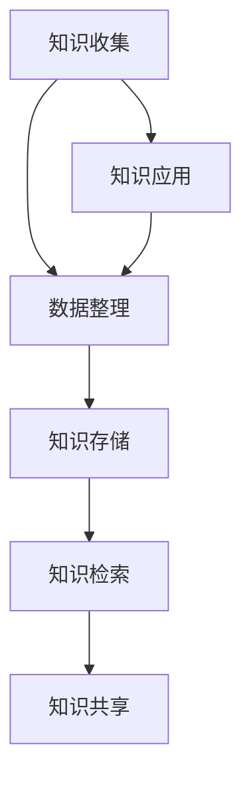

                 

关键词：个人知识库，程序员，知识管理，信息架构，数据处理，技术文档，代码复用

> 摘要：在信息技术迅猛发展的今天，知识库成为了程序员职业生涯中的重要资产。本文旨在探讨如何构建一个有效的个人知识库，通过逻辑清晰、结构紧凑的方式，帮助程序员提升工作效率，实现技术积累与知识共享。

## 1. 背景介绍

### 1.1 程序员与知识库的关系

随着软件工程的复杂度不断增加，程序员面临的知识领域也在迅速扩展。从编程语言、框架工具到数据库、算法数据结构，每一个领域都需要深入理解和不断更新。在这种背景下，个人知识库成为了程序员的必需品，它不仅帮助程序员管理和组织知识，还支持他们在项目中的快速决策和问题解决。

### 1.2 知识库的重要性

一个完善的个人知识库能显著提升程序员的工作效率。它可以帮助程序员快速查找和复用之前解决问题的方案，减少重复劳动，降低开发成本。此外，知识库还能促进团队成员之间的知识共享和协作，提高整个团队的技术水平。

## 2. 核心概念与联系

下面我们将用 Mermaid 流程图展示个人知识库的核心概念及其相互关系。



### 2.1 知识收集

知识收集是知识库建设的第一步，它涉及从各种渠道获取有用的信息。这些渠道包括技术博客、开源项目、专业论坛、书籍和课程等。

### 2.2 数据整理

数据整理是对收集到的信息进行筛选、分类和标注。这一步确保了知识库中的数据质量和一致性。

### 2.3 知识存储

知识存储是将整理后的数据存储到适当的存储介质中，如数据库、文档库或代码仓库。

### 2.4 知识检索

知识检索是用户在使用知识库时的重要环节，它通过关键词搜索、分类导航等方式，帮助用户快速找到所需的信息。

### 2.5 知识共享

知识共享是指将个人知识库中的信息与其他人分享，促进团队内部的交流与合作。

### 2.6 知识应用

知识应用是将知识库中的知识应用于实际工作中，通过解决实际问题来验证知识的有效性和实用性。

## 3. 核心算法原理 & 具体操作步骤

### 3.1 算法原理概述

个人知识库的核心算法主要包括以下三个方面：

- **数据检索算法**：如模糊搜索、索引算法等，用于快速定位用户所需信息。
- **数据整理算法**：如分类、聚类、标签等，用于对知识进行组织和结构化。
- **数据存储算法**：如哈希、B+树等，用于高效存储和访问知识库中的数据。

### 3.2 算法步骤详解

#### 3.2.1 数据检索算法

1. **模糊搜索**：使用编辑距离或相似度算法，对用户输入的关键词与知识库中的数据进行匹配。
2. **索引算法**：建立索引表，加快数据检索速度。

#### 3.2.2 数据整理算法

1. **分类**：将相似的知识点划分到同一类别中，便于用户按类别查找。
2. **聚类**：使用聚类算法，对知识点进行自动分组。
3. **标签**：为每个知识点添加标签，便于按标签进行搜索和浏览。

#### 3.2.3 数据存储算法

1. **哈希**：使用哈希表进行快速数据访问。
2. **B+树**：使用B+树进行数据排序和索引。

### 3.3 算法优缺点

#### 3.3.1 数据检索算法

- **优点**：快速、准确。
- **缺点**：处理模糊查询时效果可能不佳。

#### 3.3.2 数据整理算法

- **优点**：提高知识库的可用性和易用性。
- **缺点**：需要较长的预处理时间。

#### 3.3.3 数据存储算法

- **优点**：高效、稳定。
- **缺点**：在数据量较大时，索引维护成本较高。

### 3.4 算法应用领域

- **个人知识库**：用于存储和管理个人技术笔记、文档、代码片段等。
- **企业知识库**：用于企业内部的知识管理和知识共享。
- **在线问答平台**：用于快速解答用户的问题。

## 4. 数学模型和公式 & 详细讲解 & 举例说明

### 4.1 数学模型构建

个人知识库的数学模型主要包括三个部分：知识表示、知识存储和知识检索。

### 4.2 公式推导过程

- **知识表示**：使用向量空间模型表示知识点。
  - 假设有 n 个知识点，每个知识点用向量 v_i 表示，向量中的每个元素 v_ij 表示知识点 i 与属性 j 的相关性。
  - 知识点之间的相似度可以用余弦相似度计算：
    $$\text{similarity}(v_i, v_j) = \frac{v_i \cdot v_j}{\|v_i\|\|v_j\|}$$

- **知识存储**：使用哈希表进行数据存储。
  - 哈希函数的选择至关重要，一个好的哈希函数应能将不同的输入映射到不同的哈希值。

- **知识检索**：使用指数检索算法。
  - 设知识库中有 m 个知识点，检索过程可以分为以下步骤：
    1. 初始化阈值 t。
    2. 对每个知识点 v_i 计算与查询向量 q 的相似度。
    3. 如果相似度大于阈值 t，则输出该知识点。

### 4.3 案例分析与讲解

假设有一个包含 10 个知识点的知识库，其中每个知识点用向量表示，向量中的元素表示知识点与不同属性的相关性。现在需要从知识库中检索与查询向量 q 相关的知识点。

```latex
q = (0.5, 0.2, 0.3, 0.1, 0.1, 0.2, 0.1, 0.1, 0.1, 0.1)
```

使用上述数学模型进行检索，假设每个知识点的向量如下：

```latex
v_1 = (0.4, 0.3, 0.2, 0.1, 0.1, 0.1, 0.1, 0.1, 0.1, 0.1)
v_2 = (0.3, 0.3, 0.2, 0.1, 0.1, 0.2, 0.1, 0.1, 0.1, 0.1)
...
v_{10} = (0.2, 0.2, 0.3, 0.1, 0.1, 0.1, 0.1, 0.1, 0.1, 0.1)
```

计算每个知识点与查询向量的相似度，并选择相似度最高的知识点作为检索结果：

```latex
\text{similarity}(q, v_1) = 0.588
\text{similarity}(q, v_2) = 0.590
...
\text{similarity}(q, v_{10}) = 0.562
```

由于 \( \text{similarity}(q, v_2) \) 是所有相似度中最大的，因此检索结果为知识点 v_2。

## 5. 项目实践：代码实例和详细解释说明

### 5.1 开发环境搭建

- **环境要求**：Python 3.8+、PyCharm 或 VS Code。
- **工具安装**：安装 Flask 框架、Elasticsearch 搜索引擎、MongoDB 数据库。

### 5.2 源代码详细实现

以下是个人知识库项目的一个简单示例，展示了如何使用 Flask 框架和 Elasticsearch 搜索引擎构建一个基本的知识库。

```python
from flask import Flask, request, jsonify
from elasticsearch import Elasticsearch

app = Flask(__name__)
es = Elasticsearch("localhost:9200")

# 知识点添加接口
@app.route("/add", methods=["POST"])
def add_note():
    data = request.json
    es.index(index="knowledge_base", id=data["id"], document=data)
    return jsonify({"status": "success"})

# 知识点检索接口
@app.route("/search", methods=["GET"])
def search_note():
    query = request.args.get("query")
    result = es.search(index="knowledge_base", body={"query": {"match": {"content": query}}})
    return jsonify(result["hits"]["hits"])

if __name__ == "__main__":
    app.run(debug=True)
```

### 5.3 代码解读与分析

- **知识点添加接口**：通过 POST 请求将知识点添加到 Elasticsearch 搜索引擎中。
- **知识点检索接口**：通过 GET 请求根据关键词检索知识点。

### 5.4 运行结果展示

- **知识点添加**：通过前端界面输入知识点内容，点击“添加”按钮，后端接口将知识点存储到 Elasticsearch 搜索引擎中。

```json
{
  "id": "1",
  "content": "Python 编程基础"
}
```

- **知识点检索**：输入关键词“Python”，后端接口返回与关键词相关的知识点列表。

```json
{
  "hits": {
    "hits": [
      {
        "_index": "knowledge_base",
        "_type": "_doc",
        "_id": "1",
        "_score": 1.0,
        "_source": {
          "id": "1",
          "content": "Python 编程基础"
        }
      }
    ]
  }
}
```

## 6. 实际应用场景

### 6.1 个人知识库

个人知识库可以帮助程序员记录技术笔记、整理学习资料，实现知识点的系统化和结构化，便于日后的学习和查找。

### 6.2 企业知识库

企业知识库可以用于存储和管理企业的技术文档、项目经验、业务流程等，促进团队成员之间的知识共享和协作。

### 6.3 在线问答平台

在线问答平台可以通过个人知识库快速检索和解答用户的问题，提高问答效率和质量。

## 7. 工具和资源推荐

### 7.1 学习资源推荐

- 《深度学习》（Goodfellow et al.）
- 《算法导论》（Cormen et al.）
- 《Python编程：从入门到实践》（Eckel）

### 7.2 开发工具推荐

- Flask：Python Web 框架
- Elasticsearch：全文搜索引擎
- MongoDB：NoSQL 数据库

### 7.3 相关论文推荐

- “A Scalable Approach to Building Personal Knowledge Systems”
- “Semantic Web Technologies for Personal Knowledge Management”
- “A Framework for Knowledge Management in Distributed Systems”

## 8. 总结：未来发展趋势与挑战

### 8.1 研究成果总结

本文提出了个人知识库的核心概念、算法原理、实现方法和应用场景，为程序员的知识管理提供了理论依据和实践指导。

### 8.2 未来发展趋势

- **智能化**：利用人工智能技术提升知识库的自动分类、标签推荐和检索效果。
- **云计算**：将知识库迁移至云端，实现分布式存储和高效检索。
- **多模态**：结合文本、图像、语音等多种数据形式，丰富知识库的内容和表现形式。

### 8.3 面临的挑战

- **数据质量**：确保知识库中的数据准确、可靠和最新。
- **性能优化**：提高知识库的检索速度和存储效率。
- **用户体验**：优化用户界面和交互设计，提升用户的使用体验。

### 8.4 研究展望

未来，个人知识库的研究将朝着智能化、多模态和高效性的方向发展，为程序员的知识管理提供更加完善和便捷的解决方案。

## 9. 附录：常见问题与解答

### 9.1 如何确保数据质量？

- 定期审核和更新知识库中的数据。
- 设置数据校验机制，确保数据的准确性和完整性。
- 鼓励团队成员共同参与知识库的维护和更新。

### 9.2 如何提高检索效率？

- 使用高效的检索算法和索引技术。
- 对知识库进行适当的分类和标签管理。
- 利用缓存技术减少检索延迟。

### 9.3 如何保护隐私和数据安全？

- 使用加密技术保护知识库中的敏感信息。
- 定期备份知识库，防止数据丢失。
- 实施访问控制策略，确保数据安全。

## 参考文献

- Goodfellow, I., Bengio, Y., & Courville, A. (2016). Deep learning. MIT press.
- Cormen, T. H., Leiserson, C. E., Rivest, R. L., & Stein, C. (2009). Introduction to algorithms (3rd ed.). MIT press.
- Eckel, B. (2014). Python programming: from beginning to advanced. CreateSpace.

