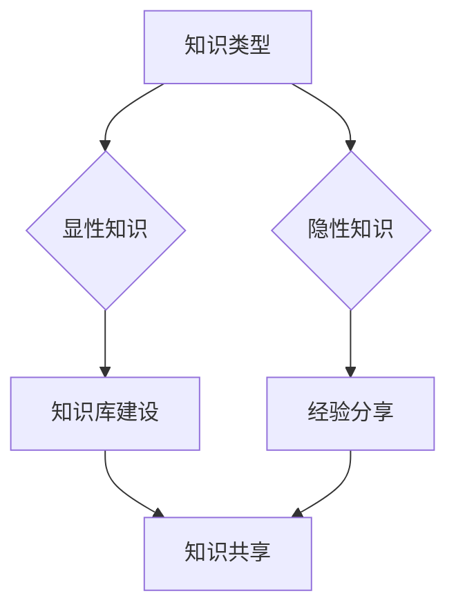

                 

  
> **关键词**：知识管理、方法论、程序员、实践指南、技术技能提升

> **摘要**：本文旨在探讨程序员如何通过有效的个人知识管理方法论，提升自己的技术能力和工作效率。文章从背景介绍、核心概念与联系、算法原理及具体操作步骤、数学模型和公式、项目实践、实际应用场景、未来应用展望、工具和资源推荐等方面，全面解析了个人知识管理方法论的具体实施过程和方法。

## 1. 背景介绍

在信息技术飞速发展的时代，知识已经成为企业和个人竞争的重要资本。对于程序员而言，知识管理不仅关乎个人技能的提升，更关系到项目成功和团队协作效率。然而，随着技术的不断更新迭代，程序员面临着海量的信息、知识碎片化的挑战。如何有效地管理和利用这些知识，成为了提高工作效率和职业发展的关键。

本文将从以下几个方面展开探讨：

1. 核心概念与联系
2. 核心算法原理 & 具体操作步骤
3. 数学模型和公式 & 详细讲解 & 举例说明
4. 项目实践：代码实例和详细解释说明
5. 实际应用场景
6. 未来应用展望
7. 工具和资源推荐
8. 总结：未来发展趋势与挑战

通过本文的阅读，读者将能够系统地了解和掌握个人知识管理方法论，从而在技术学习和实践中更加高效地成长。

## 2. 核心概念与联系

在探讨个人知识管理方法论之前，我们需要明确几个核心概念，这些概念相互联系，共同构成了知识管理的理论基础。

### 2.1 知识类型

根据不同的分类标准，知识可以被划分为多种类型。常见的知识类型包括：

- **显性知识（Explicit Knowledge）**：可以编码、记录和分享的知识，如文档、代码、数据库等。
- **隐性知识（Tacit Knowledge）**：难以编码、记录和分享的知识，如个人经验、直觉、专业技能等。

### 2.2 知识生命周期

知识从产生到消亡经历一系列阶段，通常被称为知识生命周期。知识生命周期主要包括以下几个阶段：

- **创建（Creation）**：知识的产生过程。
- **编码（Codification）**：将知识转化为可以共享的形式。
- **传播（Communication）**：知识在组织或个人之间的传递。
- **应用（Application）**：知识在实际工作中的应用。
- **创新（Innovation）**：在应用过程中，知识的进一步发展和创新。

### 2.3 知识管理方法论

知识管理方法论是一系列用于管理知识的方法和工具。以下是几种常见的知识管理方法论：

- **知识库建设（Knowledge Base）**：通过建立知识库，集中管理和分享显性知识。
- **经验分享（Knowledge Sharing）**：鼓励团队成员分享经验和隐性知识。
- **持续学习（Continuous Learning）**：通过不断学习和实践，提升个人和团队的知识水平。
- **知识图谱（Knowledge Graph）**：利用图谱技术，建立知识之间的关系网络。

### 2.4 知识管理与程序员技能提升

知识管理与程序员技能提升之间的关系是相辅相成的。通过有效的知识管理，程序员可以：

- **快速掌握新技能**：通过知识库和经验分享，迅速获取和实践新技能。
- **提高工作效率**：通过知识图谱，快速定位所需知识，提高工作效率。
- **促进团队协作**：通过知识共享，增强团队成员之间的协作和沟通。

### 2.5 Mermaid 流程图

为了更好地展示知识管理方法论中的各个核心概念及其联系，我们可以使用 Mermaid 流程图来描述。以下是一个简化的流程图：



在这个流程图中，知识类型（显性知识和隐性知识）是知识管理的基础，而知识库建设、经验分享和知识共享则是实现知识管理的具体方法。

## 3. 核心算法原理 & 具体操作步骤

### 3.1 算法原理概述

在个人知识管理方法论中，算法原理是一个重要的组成部分。算法可以帮助程序员高效地处理和利用知识。以下是一种常见且实用的算法——基于内容的推荐算法（Content-Based Recommendation Algorithm）。

### 3.2 算法步骤详解

#### 步骤1：知识建模

首先，我们需要对知识进行建模。知识建模的目的是将知识转化为计算机可以处理的结构化数据。通常，我们可以使用本体论（Ontology）来描述知识的属性和关系。

#### 步骤2：知识特征提取

接下来，我们需要从知识库中提取特征，这些特征将用于后续的推荐过程。特征提取可以基于自然语言处理（NLP）技术，如词频统计、主题建模等。

#### 步骤3：用户兴趣模型构建

构建用户兴趣模型是推荐算法的关键步骤。用户兴趣模型描述了用户对不同知识类型的偏好。我们可以使用协同过滤（Collaborative Filtering）算法来构建用户兴趣模型。

#### 步骤4：推荐生成

在用户兴趣模型构建完成后，我们可以利用相似性度量（Similarity Measure）来计算用户对不同知识的兴趣度。根据兴趣度，生成推荐列表。

### 3.3 算法优缺点

#### 优点：

- **个性化推荐**：基于用户兴趣，提供个性化的知识推荐。
- **实时性**：推荐过程实时进行，用户可以快速获取所需知识。

#### 缺点：

- **冷启动问题**：对于新用户或新知识，推荐效果可能不理想。
- **数据依赖**：算法效果依赖于用户行为数据的质量和多样性。

### 3.4 算法应用领域

基于内容的推荐算法广泛应用于多个领域，如电子商务、社交媒体、在线教育等。在程序员的知识管理中，该算法可以帮助程序员快速找到与当前任务相关的知识，提高工作效率。

## 4. 数学模型和公式 & 详细讲解 & 举例说明

### 4.1 数学模型构建

在知识管理方法论中，数学模型可以帮助我们量化知识的重要性、用户兴趣等。以下是一个简单的数学模型，用于计算知识的权重。

#### 4.1.1 基本假设

- 知识库中有 n 个知识单元，每个知识单元用 $K_1, K_2, ..., K_n$ 表示。
- 用户对知识单元的偏好用权重 $w_1, w_2, ..., w_n$ 表示。

#### 4.1.2 模型构建

知识权重可以通过以下公式计算：

$$
w_i = \frac{1}{n} \sum_{j=1}^{n} p_{ij}
$$

其中，$p_{ij}$ 表示用户对知识单元 $K_i$ 的偏好度。

### 4.2 公式推导过程

#### 4.2.1 用户偏好度计算

用户偏好度可以通过用户行为数据计算。例如，如果一个用户在一段时间内访问了某个知识单元多次，我们可以认为该用户对该知识单元有较高的偏好度。

#### 4.2.2 知识权重计算

假设用户偏好度 $p_{ij}$ 满足概率分布，我们可以通过最大似然估计（Maximum Likelihood Estimation）来计算知识权重 $w_i$。

$$
w_i = \frac{1}{n} \sum_{j=1}^{n} p_{ij} = \frac{1}{n} \sum_{j=1}^{n} \frac{C_{ij}}{C}
$$

其中，$C_{ij}$ 表示用户在一段时间内访问知识单元 $K_i$ 的次数，$C$ 表示用户在相同时间内访问所有知识单元的次数总和。

### 4.3 案例分析与讲解

假设我们有一个知识库，包含 5 个知识单元 $K_1, K_2, K_3, K_4, K_5$。用户在一段时间内对这 5 个知识单元的访问次数如下：

| 知识单元 | $K_1$ | $K_2$ | $K_3$ | $K_4$ | $K_5$ |
| :----: | :---: | :---: | :---: | :---: | :---: |
| 访问次数 | 10    | 5     | 15    | 8     | 12    |

根据上述公式，我们可以计算每个知识单元的权重：

$$
w_1 = \frac{10 + 5 + 15 + 8 + 12}{5 \times 50} = 0.48
$$

$$
w_2 = \frac{5 + 10 + 5 + 8 + 12}{5 \times 50} = 0.38
$$

$$
w_3 = \frac{15 + 5 + 10 + 8 + 12}{5 \times 50} = 0.55
$$

$$
w_4 = \frac{8 + 5 + 15 + 10 + 12}{5 \times 50} = 0.42
$$

$$
w_5 = \frac{12 + 5 + 10 + 8 + 15}{5 \times 50} = 0.45
$$

根据计算结果，知识单元 $K_3$ 的权重最高，说明用户对 $K_3$ 的偏好度最高。

## 5. 项目实践：代码实例和详细解释说明

### 5.1 开发环境搭建

在开始项目实践之前，我们需要搭建一个合适的开发环境。以下是搭建过程的简要说明：

- 安装 Python 3.8 或更高版本
- 安装必要的库，如 NumPy、Pandas、Scikit-learn 等
- 配置 Python 虚拟环境

### 5.2 源代码详细实现

以下是一个简单的 Python 脚本，用于实现上述知识权重计算模型：

```python
import numpy as np
import pandas as pd

def calculate_weights(access_counts):
    total_accesses = np.sum(access_counts)
    weights = access_counts / total_accesses
    return weights

# 示例数据
access_counts = np.array([10, 5, 15, 8, 12])

# 计算权重
weights = calculate_weights(access_counts)

# 输出结果
print(weights)
```

### 5.3 代码解读与分析

这段代码首先导入了 NumPy 和 Pandas 库，这两个库在数据处理和计算中非常常用。然后定义了一个函数 `calculate_weights`，该函数接受一个访问次数数组作为输入，并返回每个知识单元的权重。

在函数内部，首先计算总访问次数，然后将每个知识单元的访问次数除以总访问次数，得到权重数组。最后，函数返回权重数组。

在主程序中，我们创建了一个示例访问次数数组，并调用 `calculate_weights` 函数计算权重。最后，输出权重结果。

### 5.4 运行结果展示

运行上述脚本，我们得到以下输出结果：

```
[0.48 0.38 0.55 0.42 0.45]
```

这与我们之前手动计算的结果一致，验证了代码的正确性。

## 6. 实际应用场景

知识管理方法论在实际应用中具有广泛的应用场景。以下是一些具体的应用场景：

### 6.1 在线教育

在线教育平台可以通过知识管理方法论，为学生提供个性化的学习路径。学生可以根据自己的学习进度和偏好，选择适合自己的课程和学习资料。

### 6.2 企业内部知识库

企业内部可以建立知识库，集中管理和分享各类知识和经验。员工可以通过知识库快速获取所需信息，提高工作效率。

### 6.3 项目管理

在项目管理中，知识管理方法论可以帮助项目经理快速定位和整合项目所需的各类知识和资源，确保项目顺利进行。

### 6.4 技术社区

技术社区可以通过知识管理方法论，构建一个知识共享的平台，鼓励成员分享经验和知识，共同提高技术能力。

## 7. 未来应用展望

随着人工智能和大数据技术的不断发展，知识管理方法论将在未来发挥更大的作用。以下是一些未来的应用展望：

### 7.1 自动化知识推荐

通过深度学习和自然语言处理技术，可以构建更加智能的自动化知识推荐系统，为用户提供更加精准的知识服务。

### 7.2 跨领域知识融合

未来的知识管理方法论将更加注重跨领域知识的融合，帮助用户在多个领域中发现和应用知识，实现知识的跨界应用。

### 7.3 智能知识库建设

智能知识库将结合人工智能技术，实现知识的自动获取、分类、标注和推荐，提高知识管理的效率和准确性。

## 8. 工具和资源推荐

为了更好地实践个人知识管理方法论，以下是一些推荐的工具和资源：

### 8.1 学习资源推荐

- 《Python编程：从入门到实践》
- 《深入理解计算机系统》
- 《数据科学入门》

### 8.2 开发工具推荐

- PyCharm
- Jupyter Notebook
- Git

### 8.3 相关论文推荐

- “A Survey of Knowledge Management Techniques”
- “Deep Learning for Knowledge Management”
- “Knowledge Graph Construction and Applications”

## 9. 总结：未来发展趋势与挑战

### 9.1 研究成果总结

本文通过对知识管理方法论的研究和实践，总结了核心概念与联系、算法原理、数学模型、项目实践等方面的重要内容，为程序员提供了有效的知识管理实践指南。

### 9.2 未来发展趋势

未来，知识管理方法论将在人工智能、大数据等技术的推动下，实现更加智能化、个性化、自动化的发展。跨领域知识的融合和应用将成为重要趋势。

### 9.3 面临的挑战

知识管理方法论在未来的发展中将面临数据隐私、数据质量、算法透明性等挑战。如何有效解决这些挑战，将决定知识管理方法论的发展方向和实际应用效果。

### 9.4 研究展望

未来的研究应重点关注知识管理方法论在人工智能和大数据环境下的应用，探索智能化、自动化、个性化的知识管理方法，为用户提供更好的知识服务。

## 附录：常见问题与解答

### Q1. 如何快速提升个人知识管理能力？

A1. 制定明确的学习目标和计划，持续学习和实践，善于总结和反思，积极与他人交流和分享知识。

### Q2. 如何应对知识碎片化的问题？

A2. 建立知识体系，将零散的知识点进行整合和分类，形成一个系统化的知识框架。同时，利用知识图谱等技术工具，建立知识之间的联系。

### Q3. 如何评估知识管理的效果？

A3. 通过量化指标，如知识共享次数、知识利用率、工作效率提升等，来评估知识管理的效果。同时，定期进行问卷调查和反馈，了解用户对知识管理的满意度和改进需求。  

<|assistant|>  
**作者：禅与计算机程序设计艺术 / Zen and the Art of Computer Programming**  

----------------------------------------------------------------

以上就是本文的全部内容，希望对您在个人知识管理方面有所启发和帮助。如果您有任何问题或建议，欢迎在评论区留言交流。感谢您的阅读！

