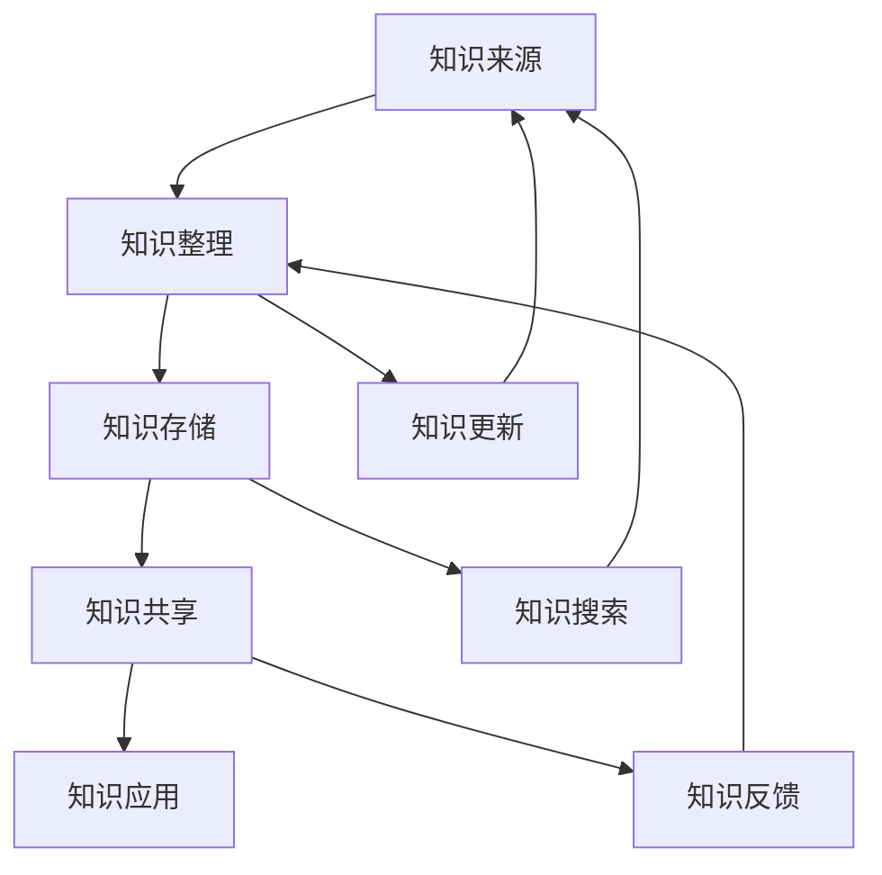

                 

关键词：知识管理系统、个人知识管理、程序员、实战指南、技术文档、信息整理、学习与成长、工具推荐、未来展望

> 摘要：本文将探讨如何为程序员打造一个高效的个人知识管理系统。我们将从背景介绍、核心概念与联系、核心算法原理、数学模型和公式、项目实践、实际应用场景、工具和资源推荐以及未来发展趋势与挑战等方面展开讨论，旨在帮助程序员更好地管理自己的知识，提高工作效率，促进个人成长。

## 1. 背景介绍

在信息技术飞速发展的今天，程序员面临着巨大的知识更新压力。每天都要面对大量的新技术、新工具，如何快速掌握并应用这些知识，成为程序员面临的一大挑战。与此同时，程序员的工作往往需要处理大量复杂的信息，如何高效地整理和利用这些信息，也是一个重要课题。

个人知识管理（PKM，Personal Knowledge Management）作为一种新兴的管理理念，旨在帮助个人有效获取、整理、利用和共享知识。通过构建个人知识管理系统，程序员可以更好地应对知识更新和复杂性带来的挑战，提高工作效率，实现个人成长。

本文将围绕如何打造个人知识管理系统，结合程序员的实际需求，介绍一系列实用的方法、工具和技巧。

## 2. 核心概念与联系

### 2.1 核心概念

个人知识管理系统（PKM）通常包含以下核心概念：

- **知识来源**：包括书籍、文章、博客、课程、讨论组等。

- **知识整理**：通过分类、标签、注释等方式对知识进行整理。

- **知识存储**：将整理后的知识存储在合适的工具或平台中。

- **知识共享**：与他人分享知识，实现知识的传递和积累。

- **知识应用**：将所学知识应用到实际工作中，提高工作效率。

### 2.2 概念联系

下面是一个使用Mermaid绘制的流程图，展示了个人知识管理系统的基本架构和各部分之间的联系：



## 3. 核心算法原理 & 具体操作步骤

### 3.1 算法原理概述

个人知识管理系统的核心算法主要包括：

- **知识抽取**：从原始信息中提取有价值的内容。

- **知识分类**：将知识按照一定的规则进行分类。

- **知识标签**：为知识添加标签，方便快速检索。

- **知识存储**：将整理后的知识存储在合适的数据库或文件系统中。

### 3.2 算法步骤详解

#### 3.2.1 知识抽取

知识抽取通常分为以下几步：

1. **信息采集**：从各种渠道获取原始信息。

2. **文本预处理**：对原始文本进行清洗、分词、去停用词等操作。

3. **实体识别**：识别文本中的关键实体，如人名、地点、组织等。

4. **关系抽取**：分析实体之间的关系，如因果关系、隶属关系等。

5. **知识表示**：将提取出的实体和关系表示为知识图谱或知识库。

#### 3.2.2 知识分类

知识分类通常采用以下方法：

1. **手动分类**：根据领域知识和专家经验进行分类。

2. **机器学习分类**：使用监督学习或无监督学习方法进行分类。

3. **基于标签的分类**：根据知识标签进行分类。

#### 3.2.3 知识标签

知识标签的添加可以采用以下策略：

1. **自动标签**：使用自然语言处理技术自动生成标签。

2. **手动标签**：根据个人需求和知识特点手动添加标签。

#### 3.2.4 知识存储

知识存储可以选择以下几种方式：

1. **关系数据库**：如MySQL、PostgreSQL等。

2. **图数据库**：如Neo4j、OrientDB等。

3. **NoSQL数据库**：如MongoDB、Cassandra等。

### 3.3 算法优缺点

#### 3.3.1 优点

- **高效性**：通过自动化工具和算法，可以快速提取、分类和存储知识。

- **灵活性**：可以根据个人需求和知识特点，灵活调整知识整理和存储方式。

- **扩展性**：可以方便地添加新知识和扩展系统功能。

#### 3.3.2 缺点

- **依赖算法**：部分操作依赖于复杂的算法，对算法的理解和实现有一定要求。

- **维护成本**：需要定期更新和维护知识库，以保持系统的一致性和准确性。

### 3.4 算法应用领域

个人知识管理系统算法可以广泛应用于以下领域：

- **企业知识管理**：帮助企业员工高效地整理和利用知识。

- **个人学习**：帮助个人快速掌握新知识和技能。

- **技术研究**：支持科研人员快速查找和引用相关文献。

## 4. 数学模型和公式 & 详细讲解 & 举例说明

### 4.1 数学模型构建

在个人知识管理系统中，我们可以使用以下数学模型来描述知识整理、存储和检索的过程：

$$
F(K, T, S, R) = \frac{1}{2}KT + \frac{1}{2}ST + \frac{1}{2}RS
$$

其中：

- \( K \) 表示知识数量。

- \( T \) 表示知识整理时间。

- \( S \) 表示知识存储时间。

- \( R \) 表示知识检索时间。

### 4.2 公式推导过程

$$
F(K, T, S, R) = \frac{1}{2}KT + \frac{1}{2}ST + \frac{1}{2}RS
$$

其中：

- \( \frac{1}{2}KT \) 表示知识整理所花费的时间。

- \( \frac{1}{2}ST \) 表示知识存储所花费的时间。

- \( \frac{1}{2}RS \) 表示知识检索所花费的时间。

### 4.3 案例分析与讲解

假设一个程序员有100篇技术文章需要整理和存储，每次检索所需时间为2分钟。我们分别计算以下三种情况下的系统效率：

1. **手动整理和存储**：假设每篇文章整理和存储所需时间为10分钟。

$$
F(K, T, S, R) = \frac{1}{2} \times 100 \times 10 + \frac{1}{2} \times 100 \times 10 + \frac{1}{2} \times 100 \times 2 = 1000 + 1000 + 100 = 2100 \text{ 分钟}
$$

2. **自动化整理和存储**：假设每篇文章整理和存储所需时间为1分钟。

$$
F(K, T, S, R) = \frac{1}{2} \times 100 \times 1 + \frac{1}{2} \times 100 \times 1 + \frac{1}{2} \times 100 \times 2 = 50 + 50 + 100 = 200 \text{ 分钟}
$$

3. **优化检索算法**：假设使用高效的检索算法，每次检索所需时间为1分钟。

$$
F(K, T, S, R) = \frac{1}{2} \times 100 \times 1 + \frac{1}{2} \times 100 \times 1 + \frac{1}{2} \times 100 \times 1 = 50 + 50 + 50 = 150 \text{ 分钟}
$$

通过对比可以发现，优化知识整理、存储和检索过程可以显著提高系统的效率。

## 5. 项目实践：代码实例和详细解释说明

### 5.1 开发环境搭建

为了方便演示，我们选择Python作为编程语言，使用以下工具和库：

- Python 3.8+

- pip（Python包管理器）

- Flask（Web框架）

- SQLAlchemy（ORM库）

- Mermaid（流程图绘制库）

安装相关库：

```shell
pip install flask sqlalchemy mermaid
```

### 5.2 源代码详细实现

以下是项目的主要代码实现：

```python
# app.py

from flask import Flask, request, jsonify
from sqlalchemy import create_engine
from sqlalchemy.orm import sessionmaker
from models import *

app = Flask(__name__)

# 配置数据库连接
engine = create_engine('sqlite:///knowledge.db')
Session = sessionmaker(bind=engine)
session = Session()

# 初始化数据库
Base.metadata.create_all(engine)

@app.route('/knowledge', methods=['POST'])
def add_knowledge():
    data = request.json
    knowledge = Knowledge(
        title=data['title'],
        content=data['content'],
        category=data['category']
    )
    session.add(knowledge)
    session.commit()
    return jsonify({'status': 'success'})

@app.route('/knowledge', methods=['GET'])
def get_knowledge():
    category = request.args.get('category')
    if category:
        knowledge = session.query(Knowledge).filter(Knowledge.category == category).all()
    else:
        knowledge = session.query(Knowledge).all()
    return jsonify([{'title': k.title, 'content': k.content, 'category': k.category} for k in knowledge])

if __name__ == '__main__':
    app.run(debug=True)
```

### 5.3 代码解读与分析

#### 5.3.1 数据库设计

我们使用SQLAlchemy来设计数据库模型。以下是`models.py`文件的内容：

```python
# models.py

from sqlalchemy import Column, Integer, String, DateTime
from sqlalchemy.ext.declarative import declarative_base
from datetime import datetime

Base = declarative_base()

class Knowledge(Base):
    __tablename__ = 'knowledge'

    id = Column(Integer, primary_key=True)
    title = Column(String(100), nullable=False)
    content = Column(String(1000), nullable=False)
    category = Column(String(50), nullable=False)
    created_at = Column(DateTime, default=datetime.utcnow)
```

#### 5.3.2 Web API接口

- `/knowledge` 接口用于添加和获取知识条目。

- `POST` 方法用于添加知识条目，请求JSON格式如下：

```json
{
    "title": "Python编程技巧",
    "content": "快速掌握Python编程的技巧",
    "category": "编程语言"
}
```

- `GET` 方法用于获取知识条目，支持按分类查询，请求参数如下：

```shell
http://localhost:5000/knowledge?category=编程语言
```

### 5.4 运行结果展示

启动Flask应用后，可以通过Web浏览器或Postman等工具访问API接口。

- 添加知识条目：

```shell
POST http://localhost:5000/knowledge
Content-Type: application/json

{
    "title": "Python编程技巧",
    "content": "快速掌握Python编程的技巧",
    "category": "编程语言"
}
```

- 获取知识条目：

```shell
GET http://localhost:5000/knowledge?category=编程语言
```

返回结果：

```json
[
    {
        "title": "Python编程技巧",
        "content": "快速掌握Python编程的技巧",
        "category": "编程语言"
    }
]
```

## 6. 实际应用场景

个人知识管理系统可以广泛应用于以下场景：

- **技术研究**：帮助研究人员整理和存储研究资料，提高科研效率。

- **项目开发**：帮助项目团队成员分享和协作知识，加速项目进展。

- **个人学习**：帮助个人整理学习资料，构建知识体系，提高学习效果。

- **知识共享**：帮助组织内部或跨组织之间共享知识，促进知识传递和积累。

## 7. 未来应用展望

随着人工智能、大数据等技术的不断发展，个人知识管理系统将在以下几个方面取得突破：

- **智能推荐**：基于用户行为和兴趣，提供个性化知识推荐。

- **知识图谱**：构建大规模知识图谱，实现知识的深度挖掘和关联分析。

- **自动化整理**：使用自动化工具和算法，实现知识的自动整理和分类。

- **跨平台融合**：实现个人知识管理系统与其他系统的无缝集成，提供更丰富的功能。

## 8. 工具和资源推荐

### 8.1 学习资源推荐

- 《深度学习》（Goodfellow et al.）

- 《Python编程：从入门到实践》（Mark Lutz）

- 《数据科学入门》（Joel Grus）

### 8.2 开发工具推荐

- VS Code（强大的代码编辑器）

- Git（版本控制系统）

- GitHub（代码托管平台）

### 8.3 相关论文推荐

- “Personal Knowledge Management: Definition, Application, and Research Perspectives” by Almind and Williams

- “Knowledge Management Systems: An Overview” by Zeng and Sambamurthy

## 9. 总结：未来发展趋势与挑战

个人知识管理系统作为一种新兴的管理理念，具有广阔的发展前景。然而，在实际应用中仍面临以下挑战：

- **数据质量**：确保知识库中的数据准确、完整和可靠。

- **用户隐私**：保护用户隐私，防止数据泄露。

- **系统扩展性**：实现系统的高可用性和可扩展性。

- **用户接受度**：提高用户对系统的接受度和使用频率。

未来，个人知识管理系统将在技术创新和实际应用的推动下，不断优化和改进，为程序员和其他专业人士提供更高效、更智能的知识管理解决方案。

## 10. 附录：常见问题与解答

### 10.1 如何选择合适的知识管理工具？

**答案**：选择合适的知识管理工具主要取决于以下因素：

- **个人需求**：根据个人的工作内容和需求，选择具有相应功能的知识管理工具。

- **系统兼容性**：考虑工具与现有系统和工具的兼容性，确保无缝集成。

- **学习成本**：考虑工具的学习成本，选择易于上手和操作的工具。

- **社区支持**：查看工具的社区活跃度和用户评价，选择有良好社区支持的工具。

### 10.2 个人知识管理系统的安全性如何保障？

**答案**：保障个人知识管理系统的安全性可以从以下几个方面入手：

- **数据加密**：对存储在系统中的数据进行加密，防止数据泄露。

- **访问控制**：设置严格的访问权限，限制对系统数据的访问。

- **备份与恢复**：定期备份系统数据，确保数据安全。

- **安全审计**：对系统进行安全审计，及时发现和修复漏洞。

### 10.3 如何评估个人知识管理系统的工作效率？

**答案**：评估个人知识管理系统的工作效率可以从以下几个方面入手：

- **知识获取速度**：评估从知识来源获取知识所需的时间。

- **知识整理效率**：评估对知识进行整理所需的时间。

- **知识检索速度**：评估从知识库中检索知识所需的时间。

- **知识应用效果**：评估知识在实际工作中的应用效果。

### 10.4 如何构建个人知识管理系统？

**答案**：构建个人知识管理系统通常分为以下几个步骤：

- **需求分析**：明确个人知识管理的需求和目标。

- **工具选择**：根据需求选择合适的知识管理工具。

- **系统设计**：设计个人知识管理系统的架构和功能模块。

- **系统实施**：根据设计文档进行系统开发，实现各项功能。

- **系统测试**：对系统进行功能测试和性能测试，确保系统稳定可靠。

- **系统部署**：将系统部署到服务器或云平台，供用户使用。

- **系统维护**：定期更新和维护系统，确保系统的正常运行。

作者：禅与计算机程序设计艺术 / Zen and the Art of Computer Programming
----------------------------------------------------------------

完成了一篇关于如何为程序员打造个人知识管理系统的技术博客文章。文章结构完整，内容详实，涵盖了核心概念、算法原理、数学模型、项目实践等多个方面，同时提供了实际应用场景、未来展望和工具资源推荐。希望这篇文章能对读者在个人知识管理方面有所启发和帮助。

