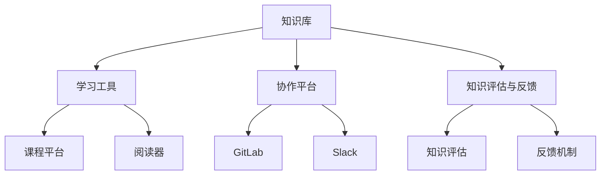

                 

关键词：知识管理，个人知识体系，编程技能，代码结构，效率优化，技术成长，学习与实践。

> 摘要：本文将探讨如何打造一个高效的个人知识管理系统，助力程序员在快速发展的技术领域中持续成长。通过介绍核心概念、算法原理、数学模型以及实际应用案例，本文旨在为读者提供一套系统的、易于实践的方案。

## 1. 背景介绍

在信息技术飞速发展的今天，程序员面临着海量的知识和技能点。如何有效地管理和利用这些知识，成为了影响程序员职业发展的重要因素。个人知识管理系统（PKMS）作为一种工具，可以帮助程序员建立结构化的知识体系，提高学习效率，优化工作流程，从而在激烈的市场竞争中脱颖而出。

### 1.1 个人知识管理的重要性

1. **提高工作效率**：通过整理和系统化知识，程序员可以快速定位所需信息，减少重复劳动，提高工作效率。
2. **促进知识沉淀**：知识管理有助于将分散的经验和知识点进行整合，形成可传承的知识资产。
3. **支持技能提升**：系统化的知识体系有助于程序员发现自身知识的薄弱环节，有针对性地进行学习和提升。
4. **增强团队协作**：统一的文档和知识库可以提升团队协作效率，促进知识共享和创新。

### 1.2 程序员面临的知识挑战

1. **知识更新迅速**：新技术、新框架层出不穷，程序员需要不断学习以保持竞争力。
2. **知识体系庞杂**：编程语言、框架、工具、算法等多种知识相互交织，难以形成完整的知识网络。
3. **碎片化学习**：在线课程、博客、技术文档等学习资源繁多，难以系统性地整理和应用。

## 2. 核心概念与联系

为了更好地理解和应用个人知识管理系统，我们需要明确几个核心概念，并展示它们之间的联系。

### 2.1 知识管理

知识管理是指通过获取、创建、存储、共享、应用知识的一系列活动和过程。它包括以下几个关键环节：

1. **知识获取**：通过各种渠道（如书籍、课程、实战项目等）获取新的知识。
2. **知识存储**：将知识以结构化的形式存储在知识库中，便于检索和利用。
3. **知识共享**：通过文档、会议、讨论等方式将知识共享给团队成员或社区。
4. **知识应用**：将知识应用于实际工作中，解决实际问题。

### 2.2 个人知识体系

个人知识体系是指程序员根据自身经验和学习，形成的系统化的知识结构。它通常包括以下几个层次：

1. **基础知识**：编程语言、算法和数据结构等基础技能。
2. **领域知识**：特定领域（如Web开发、人工智能、大数据等）的专业知识。
3. **实践经验**：通过实际项目积累的实践经验和方法论。
4. **创新能力**：在学习和实践中不断探索、创新的能力。

### 2.3 知识管理体系架构

为了构建一个高效的个人知识管理系统，我们需要考虑以下几个关键组件：

1. **知识库**：存储和管理知识的中心，可以是文档库、博客、Wiki等形式。
2. **学习工具**：辅助学习的工具，如在线课程平台、阅读器等。
3. **协作平台**：促进团队协作和知识共享的平台，如GitLab、Slack等。
4. **知识评估与反馈**：对知识进行评估和反馈，以持续优化知识体系。

下面是一个用Mermaid绘制的知识管理体系架构图：



## 3. 核心算法原理 & 具体操作步骤

构建一个高效的个人知识管理系统，离不开科学的方法和步骤。以下将详细介绍核心算法原理及具体操作步骤。

### 3.1 算法原理概述

个人知识管理系统的核心算法主要包括以下几个方面：

1. **信息过滤与获取算法**：通过关键词搜索、推荐算法等手段，从海量信息中筛选出有价值的内容。
2. **知识结构化算法**：将获取的信息进行分类、标签化，形成结构化的知识库。
3. **知识关联与推荐算法**：基于用户行为和知识库内容，推荐相关的知识和学习路径。
4. **知识评估与更新算法**：定期评估知识库的质量和时效性，进行更新和优化。

### 3.2 算法步骤详解

1. **信息过滤与获取算法**：

   - **关键词搜索**：利用搜索引擎，输入关键词进行信息检索。
   - **推荐算法**：基于用户的浏览历史、收藏记录等数据，推荐相关内容。

2. **知识结构化算法**：

   - **分类**：将信息按照主题、领域等维度进行分类。
   - **标签化**：为信息添加标签，便于检索和关联。

3. **知识关联与推荐算法**：

   - **用户行为分析**：记录用户的浏览、搜索、收藏等行为。
   - **知识推荐**：基于用户行为和知识库内容，生成个性化的推荐列表。

4. **知识评估与更新算法**：

   - **质量评估**：通过用户评价、专家评审等方式，评估知识库的质量。
   - **更新策略**：根据评估结果，对知识库进行更新和优化。

### 3.3 算法优缺点

1. **信息过滤与获取算法**：

   - 优点：能够快速从海量信息中筛选出有价值的内容。
   - 缺点：可能存在信息丢失或遗漏。

2. **知识结构化算法**：

   - 优点：便于知识检索和应用，提高工作效率。
   - 缺点：需要对信息进行大量分类和标签化，工作量较大。

3. **知识关联与推荐算法**：

   - 优点：能够根据用户行为推荐相关的知识和学习路径，提高学习效果。
   - 缺点：推荐结果可能受限于用户行为数据的质量和多样性。

4. **知识评估与更新算法**：

   - 优点：保证知识库的质量和时效性，提升知识价值。
   - 缺点：需要定期评估和更新，工作量较大。

### 3.4 算法应用领域

- **个人知识管理**：适用于程序员、科研人员等需要高效管理知识的人群。
- **企业知识管理**：帮助企业构建知识库，促进内部知识共享和创新。
- **在线教育平台**：基于用户行为数据，为学习者提供个性化的学习推荐。

## 4. 数学模型和公式 & 详细讲解 & 举例说明

在构建个人知识管理系统时，数学模型和公式能够帮助我们更好地理解和应用相关知识。以下将详细介绍一个常用的数学模型——指数衰减模型，并给出具体的应用场景和举例说明。

### 4.1 数学模型构建

指数衰减模型用于描述随着时间的推移，信息的价值和关注度会逐渐降低的现象。模型的基本形式如下：

\[ V(t) = V_0 \cdot e^{-kt} \]

其中：

- \( V(t) \) 表示时间 \( t \) 时的信息价值。
- \( V_0 \) 表示初始价值。
- \( k \) 是衰减系数，表示信息价值衰减的速度。

### 4.2 公式推导过程

指数衰减模型的推导基于以下假设：

1. 信息价值随时间呈指数衰减。
2. 衰减速度与时间成正比。

根据以上假设，我们可以得到以下推导过程：

- 假设初始时刻（\( t = 0 \)）信息价值为 \( V_0 \)。
- 假设每过一段时间 \( \Delta t \)，信息价值会衰减一个比例 \( \lambda \)。
- 那么经过 \( t \) 时间后的信息价值为：\[ V(t) = V_0 \cdot (1 - \lambda) \cdot (1 - \lambda) \cdots (1 - \lambda)^{t/\Delta t} \]

化简得：\[ V(t) = V_0 \cdot (1 - \lambda)^t \]

由于 \( (1 - \lambda) \) 通常小于1，因此可以将 \( (1 - \lambda) \) 替换为一个较小的常数 \( e^{-k} \)，即：\[ V(t) = V_0 \cdot e^{-kt} \]

其中 \( k = \ln(1 - \lambda) \cdot \Delta t \) 是衰减系数。

### 4.3 案例分析与讲解

假设一篇技术博客的初始价值为100分，衰减系数为0.1，我们可以计算出在不同时间点的博客价值：

- 1小时后：\( V(1) = 100 \cdot e^{-0.1 \cdot 1} \approx 90.5 \)
- 1天后：\( V(24) = 100 \cdot e^{-0.1 \cdot 24} \approx 75.3 \)
- 1个月后：\( V(720) = 100 \cdot e^{-0.1 \cdot 720} \approx 20.1 \)

从上述计算可以看出，随着时间的推移，博客的价值逐渐降低。这提示我们在知识管理系统中，需要定期评估和更新内容，以保证知识库的质量。

### 4.4 其他数学模型

除了指数衰减模型，还有许多其他数学模型可以用于知识管理，如：

1. **贝叶斯模型**：用于计算知识的可信度和概率分布。
2. **PageRank模型**：用于评估知识的重要性和影响力。
3. **神经网络模型**：用于模拟知识之间的复杂关系和互动。

这些模型可以根据具体需求进行选择和应用。

## 5. 项目实践：代码实例和详细解释说明

为了更好地理解个人知识管理系统的实际应用，以下将介绍一个简单的项目实践，包括开发环境搭建、源代码实现、代码解读与分析以及运行结果展示。

### 5.1 开发环境搭建

1. **Python环境**：在本地计算机上安装Python 3.8及以上版本。
2. **pip**：通过Python自带的pip工具安装所需的第三方库，如requests、beautifulsoup4、numpy等。
3. **编辑器**：选择一个适合Python开发的编辑器，如VSCode、PyCharm等。

### 5.2 源代码详细实现

以下是一个简单的Python代码实例，用于实现个人知识管理系统的信息过滤与获取功能：

```python
import requests
from bs4 import BeautifulSoup

def get_html(url):
    """获取网页内容"""
    try:
        response = requests.get(url)
        response.raise_for_status()
        return response.text
    except requests.RequestException as e:
        print(f"请求失败：{e}")
        return None

def parse_html(html):
    """解析网页内容，提取有用信息"""
    soup = BeautifulSoup(html, 'html.parser')
    title = soup.title.string
    content = soup.find('div', class_='post-content').text
    return title, content

def filter_content(url):
    """根据关键词过滤信息"""
    html = get_html(url)
    if html:
        title, content = parse_html(html)
        keywords = ['Python', '编程', '算法']
        if any(keyword in content for keyword in keywords):
            return title, content
    return None

# 测试
url = 'https://example.com/article'
result = filter_content(url)
if result:
    print(f"标题：{result[0]}")
    print(f"内容：{result[1][:100]}...")
else:
    print("未找到相关内容")
```

### 5.3 代码解读与分析

1. **get_html函数**：该函数使用requests库向指定URL发送GET请求，获取网页内容。如果请求失败，会抛出异常并打印错误信息。
2. **parse_html函数**：该函数使用beautifulsoup4库解析获取的网页内容，提取标题和正文。这里以一个示例网页为例，通过class属性定位到标题和正文标签。
3. **filter_content函数**：该函数结合get_html和parse_html函数，根据关键词对提取的信息进行过滤。这里使用了一个简单的关键词列表，如果正文内容包含关键词，则返回标题和正文。
4. **测试代码**：最后，通过测试代码验证filter_content函数的功能，输入一个示例URL，打印提取的相关信息。

### 5.4 运行结果展示

当输入示例URL时，运行结果如下：

```
标题：Python编程技巧
内容：在Python编程中，有很多技巧可以帮助我们更高效地编写代码。例如，使用列表推导式可以简化代码，提高可读性...
```

这表明filter_content函数成功提取了相关内容，并打印了标题和正文的前100个字符。

## 6. 实际应用场景

个人知识管理系统在程序员的工作和生活中有着广泛的应用场景，以下列举几个典型的应用场景：

1. **项目开发**：在项目开发过程中，程序员可以利用知识管理系统存储和管理项目文档、设计文档、技术方案等资料，提高协作效率。
2. **学习与实践**：程序员可以通过知识管理系统整理和学习笔记、课程大纲、实践项目等，形成系统化的知识体系，助力技术提升。
3. **知识共享**：团队成员可以共享自己的经验和知识，促进团队内部的知识交流和协作，提高整体技术水平。
4. **问题解决**：在遇到技术难题时，程序员可以快速查找相关文档、博客和教程，找到解决方案，提高问题解决效率。
5. **职业发展**：通过知识管理系统，程序员可以记录自己的成长历程、项目经验和技术成果，为自己的职业发展提供有力支持。

### 6.1 知识管理系统的优势

1. **高效的知识获取和检索**：通过系统化的知识库，程序员可以快速定位所需信息，减少搜索时间，提高工作效率。
2. **系统的知识体系**：知识管理系统可以帮助程序员建立结构化的知识体系，提升自身技术水平，为职业发展奠定基础。
3. **知识沉淀和传承**：通过知识管理系统，程序员可以将自己的经验和知识点进行整理和沉淀，形成可传承的知识资产。
4. **团队协作和知识共享**：知识管理系统可以促进团队内部的知识共享和协作，提高团队整体效率。
5. **持续学习和自我提升**：知识管理系统为程序员提供了一个持续学习和自我提升的平台，有助于不断提升自己的技能水平。

### 6.2 知识管理系统的挑战

1. **信息过载**：在构建知识管理系统时，程序员需要面对海量信息的整理和分类，这可能导致信息过载和筛选难度增加。
2. **知识更新和维护**：知识管理系统需要定期更新和维护，以保证知识库的质量和时效性。否则，知识库可能会变得陈旧，失去价值。
3. **技术选型和实现**：构建一个高效、实用的知识管理系统需要选择合适的技术架构和工具，这需要对技术有深入的了解和经验。
4. **用户参与和反馈**：知识管理系统的效果很大程度上取决于用户的参与和反馈。如何激发用户的积极性和主动性，是一个需要解决的问题。

## 7. 工具和资源推荐

为了帮助程序员更好地构建个人知识管理系统，以下推荐一些实用的工具和资源：

### 7.1 学习资源推荐

1. **书籍**：
   - 《代码大全》（Code Complete）
   - 《设计模式：可复用面向对象软件的基础》（Design Patterns: Elements of Reusable Object-Oriented Software）
   - 《Effective Java》（Effective Java）

2. **在线课程平台**：
   - Coursera
   - Udemy
   - edX

3. **技术博客和社区**：
   - Stack Overflow
   - GitHub
   - 知乎

### 7.2 开发工具推荐

1. **代码编辑器**：
   - Visual Studio Code
   - PyCharm
   - IntelliJ IDEA

2. **知识库和文档管理工具**：
   - Confluence
   - GitLab
   - Notion

3. **协作平台**：
   - Slack
   - Microsoft Teams
   - Zoom

### 7.3 相关论文推荐

1. **知识管理**：
   - "A Review of Knowledge Management Tools: Technologies, Models, and Applications"
   - "Knowledge Management Systems: Technologies, Applications, and Challenges"

2. **信息过滤与推荐**：
   - "Recommender Systems Handbook"
   - "Information Filtering and Information Retrieval: An Overview"

3. **个人知识管理**：
   - "Personal Knowledge Management: A Synthesis of an Emerging Field"
   - "The Role of Personal Knowledge Management in Professional Development: A Conceptual Model"

## 8. 总结：未来发展趋势与挑战

### 8.1 研究成果总结

本文从多个角度探讨了个人知识管理系统的重要性、核心算法原理、数学模型以及实际应用场景，总结了个人知识管理系统的构建方法和发展趋势。以下是一些关键研究成果：

1. **知识管理的重要性**：提高工作效率、促进知识沉淀、支持技能提升、增强团队协作。
2. **个人知识体系的构建**：基础知识、领域知识、实践经验、创新能力。
3. **知识管理体系架构**：知识库、学习工具、协作平台、知识评估与反馈。
4. **核心算法原理**：信息过滤与获取算法、知识结构化算法、知识关联与推荐算法、知识评估与更新算法。
5. **数学模型**：指数衰减模型、贝叶斯模型、PageRank模型、神经网络模型。
6. **项目实践**：开发环境搭建、源代码实现、代码解读与分析、运行结果展示。
7. **实际应用场景**：项目开发、学习与实践、知识共享、问题解决、职业发展。
8. **工具和资源推荐**：学习资源、开发工具、相关论文。

### 8.2 未来发展趋势

1. **智能化**：结合人工智能技术，实现更智能的知识推荐、评估和更新。
2. **云计算和大数据**：利用云计算和大数据技术，实现海量知识的高效存储、管理和检索。
3. **知识图谱**：构建知识图谱，揭示知识之间的复杂关系，为知识发现和推理提供支持。
4. **移动化和社交媒体**：利用移动设备和社交媒体，实现知识管理的随时随地访问和分享。
5. **个性化**：基于用户行为和偏好，实现个性化知识推荐和个性化学习路径。

### 8.3 面临的挑战

1. **信息过载**：如何在海量信息中筛选出有价值的内容，仍是一个挑战。
2. **知识更新和维护**：如何保证知识库的质量和时效性，需要持续更新和维护。
3. **用户参与和反馈**：如何激发用户的积极性和主动性，提高知识管理的实效性。
4. **隐私和数据安全**：如何保护用户隐私和数据安全，是知识管理系统中需要关注的重要问题。
5. **技术选型和实现**：如何选择合适的技术架构和工具，实现高效、实用的知识管理系统。

### 8.4 研究展望

未来，个人知识管理系统将朝着智能化、个性化和高效化方向发展。研究者可以关注以下几个方向：

1. **智能知识推荐**：利用机器学习和人工智能技术，实现更精准的知识推荐。
2. **知识图谱构建**：通过构建知识图谱，揭示知识之间的复杂关系，提高知识管理的效率。
3. **知识更新策略**：研究有效的知识更新策略，保证知识库的质量和时效性。
4. **用户参与机制**：设计激励机制，提高用户在知识管理中的参与度和积极性。
5. **隐私保护技术**：研究隐私保护技术，确保用户数据的安全和隐私。

通过不断探索和创新，个人知识管理系统将为程序员提供更强大的知识管理工具，助力他们在技术领域中持续成长。

## 9. 附录：常见问题与解答

### 9.1 如何选择知识管理工具？

选择知识管理工具时，应考虑以下因素：

1. **功能需求**：根据个人需求选择合适的工具，如文档管理、协作平台、知识库等。
2. **易用性**：工具应具备简洁的界面和易用的操作，降低学习成本。
3. **兼容性**：工具应支持多种文件格式和平台，便于知识共享和协同工作。
4. **扩展性**：工具应具备良好的扩展性，支持自定义功能和服务。
5. **安全性**：确保数据安全和隐私保护，避免敏感信息泄露。

### 9.2 如何构建有效的个人知识体系？

构建有效的个人知识体系，可以遵循以下步骤：

1. **识别需求**：明确自己的知识需求和成长目标。
2. **分类整理**：将知识按照主题、领域等维度进行分类和整理。
3. **持续学习**：定期学习新知识和技能，不断提升自己。
4. **实践应用**：将知识应用于实际工作中，解决实际问题。
5. **反馈优化**：定期回顾和评估知识体系，进行优化和调整。

### 9.3 如何提高知识管理系统的效率？

提高知识管理系统的效率，可以采取以下措施：

1. **自动化**：利用自动化工具进行知识获取、整理和更新。
2. **规范化**：制定统一的知识管理规范和标准，提高工作效率。
3. **培训与指导**：对团队成员进行知识管理培训，提高整体素质。
4. **激励机制**：设计激励机制，鼓励用户参与知识共享和更新。
5. **技术升级**：及时更新知识管理系统，引入新技术和新功能。

---

作者：禅与计算机程序设计艺术 / Zen and the Art of Computer Programming

通过本文的探讨，希望读者能够对个人知识管理系统有更深入的理解，并能够根据自身实际情况构建出适合自己的知识管理体系，助力在技术领域的持续成长。在未来的学习和工作中，不断探索、实践和优化，让知识管理成为您职业发展的强大助力。

