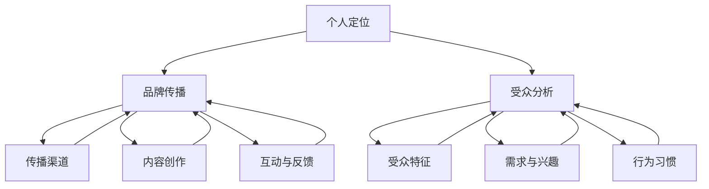

                 

在信息技术飞速发展的今天，个人品牌的重要性日益凸显。作为人工智能领域的一员，我们不仅需要卓越的技术能力，还要学会如何管理和打造自己的个人品牌。本文将为您揭示如何通过系统的方法论，在职场和行业中脱颖而出，打造一个强大的个人管理品牌。

> **关键词**：个人品牌、管理方法论、职场发展、影响力、自我营销
>
> **摘要**：本文将探讨个人管理品牌的构建过程，包括核心概念的阐释、关键算法和具体操作步骤的详解，以及实际应用场景的展示。通过本文，读者将了解如何通过数学模型和项目实践来提升个人管理品牌，并探索未来发展的趋势和挑战。

## 1. 背景介绍

在当今社会，信息传播速度极快，个人品牌成为个人职业发展的关键因素。个人品牌不仅仅是个人形象的代表，更是专业技能、思想深度和人际关系的体现。一个强大的个人品牌能够帮助个人在职场中获得更多的机会和资源，提高个人影响力。

本文将从以下几个方面探讨如何打造个人管理品牌：

- **核心概念与联系**：介绍构建个人品牌所需理解的关键概念和它们之间的联系。
- **核心算法原理**：阐述构建个人品牌的核心算法原理，包括自我营销策略和影响力提升方法。
- **数学模型与公式**：运用数学模型和公式来量化个人品牌的价值和影响力。
- **项目实践**：通过实际项目案例来展示如何将理论应用于实践，打造个人管理品牌。
- **实际应用场景**：探讨个人品牌在不同行业和领域中的应用，以及未来的发展前景。
- **工具和资源推荐**：推荐有助于构建个人品牌的学习资源、开发工具和相关论文。
- **总结与展望**：总结研究成果，展望未来个人品牌发展的趋势和面临的挑战。

### 1.1 个人品牌的定义和重要性

个人品牌指的是个人在公众心目中的形象和印象，它不仅包括个人的专业技能和知识，还涵盖了个人的人格魅力、职业素养和人际关系。一个成功的个人品牌能够帮助个人在职场中脱颖而出，提升职业竞争力。

个人品牌的重要性主要体现在以下几个方面：

1. **提升职业竞争力**：一个强大的个人品牌能够帮助个人在求职和职场竞争中占据优势地位，提高就业机会和薪资待遇。
2. **扩大社交网络**：个人品牌能够吸引志同道合的伙伴和行业内的专家，扩大个人社交网络，为职业发展提供更多机遇。
3. **提高影响力**：个人品牌能够提升个人的行业地位和影响力，有助于在专业领域内建立权威形象。
4. **增强品牌认同**：个人品牌有助于建立消费者和行业伙伴的信任，提升个人和企业的品牌认同度。

### 1.2 构建个人品牌的挑战和机遇

构建个人品牌并非易事，面临诸多挑战，同时也蕴含着巨大机遇。以下是构建个人品牌过程中可能遇到的挑战和应对策略：

1. **竞争激烈**：在信息技术和互联网时代，职场竞争异常激烈，个人品牌建设需要持续投入和努力。
2. **信息泛滥**：随着信息量的爆炸性增长，个人品牌需要具备独特性和辨识度，以在众多信息中脱颖而出。
3. **时间成本**：构建个人品牌需要时间和精力的投入，需要个人在繁忙的工作和生活中找到平衡。
4. **自我营销技巧**：个人品牌建设离不开自我营销，需要个人掌握有效的营销策略和技巧。

机遇方面：

1. **数字化时代**：数字化技术的广泛应用为个人品牌建设提供了更多渠道和工具。
2. **社交媒体**：社交媒体平台的兴起为个人品牌传播提供了便利，有助于扩大影响力。
3. **跨界合作**：个人品牌建设可以通过跨界合作，实现资源整合和优势互补。
4. **专业认证**：获得专业认证和奖项可以提升个人品牌的可信度和权威性。

## 2. 核心概念与联系

在构建个人品牌的过程中，理解一系列核心概念是至关重要的。这些概念包括个人定位、品牌传播、受众分析等。以下是这些核心概念及其相互关系的详细解释。

### 2.1 个人定位

个人定位是构建个人品牌的第一步，它关乎个人如何在职场和市场中找到独特的价值和优势。个人定位不仅包括技能和经验的独特性，还涉及个人的价值观、兴趣和目标。一个清晰而准确的个人定位有助于在竞争激烈的环境中脱颖而出。

- **技能和经验**：个人定位需要基于个人的专业技能和积累的经验，这些是个人在职场中竞争力的核心。
- **价值观和兴趣**：个人的价值观和兴趣决定了个人在职业生涯中的追求和偏好，有助于构建个人品牌的独特性。
- **目标**：明确个人的职业目标有助于在品牌建设中保持方向性和持续性。

### 2.2 品牌传播

品牌传播是个人品牌构建的关键环节，它涉及如何将个人品牌信息传递给目标受众。有效的品牌传播需要考虑以下几个要素：

- **传播渠道**：选择适合的传播渠道，如社交媒体、专业论坛、博客、演讲等，以最大化传播效果。
- **内容创作**：创作有价值、有吸引力的内容，包括文章、视频、演讲等，以增强个人品牌的吸引力。
- **互动与反馈**：与受众进行互动，收集反馈并持续优化品牌传播策略。

### 2.3 受众分析

了解目标受众是品牌传播成功的关键。受众分析包括以下几个方面：

- **受众特征**：分析目标受众的年龄、性别、教育背景、职业等特征，以便制定有针对性的品牌传播策略。
- **需求与兴趣**：了解目标受众的需求和兴趣，有助于创作符合他们口味的内容。
- **行为习惯**：分析目标受众的行为习惯，如他们喜欢在什么时间和什么平台获取信息，以便优化传播渠道。

### 2.4 核心概念联系图

为了更清晰地展示上述核心概念之间的联系，我们使用Mermaid流程图进行描述：



通过这个流程图，我们可以看到个人定位、品牌传播和受众分析之间的紧密联系。个人定位决定了品牌传播的方向和内容，而受众分析则为品牌传播提供了具体的实施策略。

## 3. 核心算法原理 & 具体操作步骤

### 3.1 算法原理概述

构建个人管理品牌的核心算法原理主要包括以下几个方面：

- **自我营销策略**：通过明确个人定位和目标受众，制定有针对性的自我营销策略。
- **影响力提升方法**：通过内容创作、社交媒体传播和互动，提升个人在目标受众中的影响力。
- **数据分析与优化**：通过收集和分析受众反馈，持续优化品牌传播策略，提高品牌效果。

### 3.2 算法步骤详解

#### 3.2.1 自我营销策略

自我营销策略是构建个人品牌的第一步，以下是具体步骤：

1. **明确个人定位**：通过分析个人的技能、经验和价值观，确定个人定位。
2. **分析目标受众**：了解目标受众的特征、需求和兴趣，以便制定有针对性的营销策略。
3. **制定营销计划**：根据个人定位和目标受众，制定具体的营销计划，包括内容创作、传播渠道和互动策略。
4. **实施营销计划**：按照营销计划，实施具体的营销活动，如发布文章、参与社交媒体讨论、进行线上演讲等。

#### 3.2.2 影响力提升方法

提升个人影响力是构建个人品牌的关键，以下是具体方法：

1. **内容创作**：创作高质量的内容，包括技术博客、专业书籍、技术演讲等，展示个人专业知识和思想深度。
2. **社交媒体传播**：利用社交媒体平台，如微博、知乎、Twitter等，传播个人品牌信息，吸引目标受众关注。
3. **互动与反馈**：与受众互动，回答问题、参与讨论，收集反馈，持续优化品牌传播策略。

#### 3.2.3 数据分析与优化

数据分析与优化是个人品牌构建过程中不可或缺的一环，以下是具体步骤：

1. **数据收集**：收集品牌传播过程中的各种数据，如访问量、点赞数、评论数、转发数等。
2. **数据分析**：对收集到的数据进行分析，了解受众的反应和行为习惯，识别成功的因素和不足之处。
3. **优化策略**：根据数据分析结果，调整品牌传播策略，提高品牌效果。

### 3.3 算法优缺点

#### 优点

- **高效性**：通过系统的方法论，可以快速构建个人品牌，提高个人在职场和行业中的影响力。
- **针对性**：针对个人定位和目标受众，制定有针对性的营销策略，提高品牌传播效果。
- **可持续性**：通过持续的数据分析和优化，可以不断调整品牌传播策略，确保品牌效果的持续性。

#### 缺点

- **时间成本**：构建个人品牌需要时间和精力的投入，需要个人在繁忙的工作和生活中找到平衡。
- **信息泛滥**：在信息爆炸的时代，个人品牌需要具备独特性和辨识度，以在众多信息中脱颖而出。
- **市场变化**：市场环境和消费者需求不断变化，个人品牌需要及时调整策略，以适应市场变化。

### 3.4 算法应用领域

个人品牌建设算法可以应用于多个领域，如技术、金融、营销、咨询等。以下是具体应用场景：

- **技术领域**：通过构建个人技术品牌，展示个人在技术领域的专业能力和思想深度，提高职业竞争力。
- **金融领域**：通过构建个人金融品牌，展示个人在金融领域的专业知识和投资策略，吸引客户和合作伙伴。
- **营销领域**：通过构建个人营销品牌，展示个人在营销领域的创意思维和执行能力，提升营销效果。
- **咨询领域**：通过构建个人咨询品牌，展示个人在咨询领域的专业知识和实践经验，吸引客户和项目机会。

## 4. 数学模型和公式 & 详细讲解 & 举例说明

在构建个人管理品牌的过程中，数学模型和公式为我们提供了一种量化和评估个人品牌价值的方法。通过这些模型和公式，我们可以更系统地分析和优化个人品牌策略。

### 4.1 数学模型构建

构建个人管理品牌的数学模型主要包括以下几个部分：

1. **品牌影响力模型**：评估个人在目标受众中的影响力。
2. **受众反馈模型**：分析受众对个人品牌传播的反应。
3. **品牌价值模型**：量化个人品牌的价值。

#### 4.1.1 品牌影响力模型

品牌影响力模型可以用于评估个人在社交媒体上的影响力。以下是一个简化的品牌影响力模型：

\[ I = f(S, C, E) \]

其中：
- \( I \)：个人品牌影响力
- \( S \)：社交媒体关注度（如粉丝数、关注量等）
- \( C \)：内容质量（如点赞数、评论数、分享数等）
- \( E \)：互动效果（如回复速度、互动频率等）

#### 4.1.2 受众反馈模型

受众反馈模型用于分析受众对个人品牌传播的反应。以下是一个简化的受众反馈模型：

\[ R = f(I, M, T) \]

其中：
- \( R \)：受众反馈
- \( I \)：个人品牌影响力
- \( M \)：内容营销效果（如广告效果、邮件营销等）
- \( T \)：传播渠道（如社交媒体、电子邮件、线下活动等）

#### 4.1.3 品牌价值模型

品牌价值模型用于量化个人品牌的价值。以下是一个简化的品牌价值模型：

\[ V = f(I, E, P) \]

其中：
- \( V \)：个人品牌价值
- \( I \)：个人品牌影响力
- \( E \)：经济收益（如薪资、股权、项目收益等）
- \( P \)：职业前景（如晋升机会、职业发展等）

### 4.2 公式推导过程

#### 4.2.1 品牌影响力模型

假设个人在社交媒体上的关注度 \( S \) 是通过内容质量 \( C \) 和互动效果 \( E \) 影响的。可以建立以下关系：

\[ S = S_0 + k_C \cdot C + k_E \cdot E \]

其中：
- \( S_0 \)：基础关注度
- \( k_C \)、\( k_E \)：权重系数

影响力 \( I \) 可以表示为：

\[ I = f(S) = S_0 + k_C \cdot C + k_E \cdot E \]

#### 4.2.2 受众反馈模型

假设受众对个人品牌传播的反应 \( R \) 受个人品牌影响力 \( I \)、内容营销效果 \( M \) 和传播渠道 \( T \) 的影响。可以建立以下关系：

\[ R = R_0 + k_I \cdot I + k_M \cdot M + k_T \cdot T \]

其中：
- \( R_0 \)：基础反馈
- \( k_I \)、\( k_M \)、\( k_T \)：权重系数

#### 4.2.3 品牌价值模型

假设个人品牌价值 \( V \) 受个人品牌影响力 \( I \)、经济收益 \( E \) 和职业前景 \( P \) 的影响。可以建立以下关系：

\[ V = V_0 + k_I \cdot I + k_E \cdot E + k_P \cdot P \]

其中：
- \( V_0 \)：基础品牌价值
- \( k_I \)、\( k_E \)、\( k_P \)：权重系数

### 4.3 案例分析与讲解

为了更好地理解这些模型和公式，我们通过一个实际案例进行分析。

假设一个技术博主，他在社交媒体上的关注度 \( S \) 为10000，内容质量 \( C \) 为80，互动效果 \( E \) 为60。根据品牌影响力模型：

\[ I = S_0 + k_C \cdot C + k_E \cdot E \]
\[ I = 10000 + k_C \cdot 80 + k_E \cdot 60 \]

假设权重系数 \( k_C \) 为0.5，\( k_E \) 为0.3，则：

\[ I = 10000 + 0.5 \cdot 80 + 0.3 \cdot 60 \]
\[ I = 10000 + 40 + 18 \]
\[ I = 10158 \]

假设该博主的内容营销效果 \( M \) 为70，传播渠道 \( T \) 为3，受众反馈 \( R \) 可以表示为：

\[ R = R_0 + k_I \cdot I + k_M \cdot M + k_T \cdot T \]

假设基础反馈 \( R_0 \) 为20，权重系数 \( k_I \) 为0.4，\( k_M \) 为0.3，\( k_T \) 为0.1，则：

\[ R = 20 + 0.4 \cdot 10158 + 0.3 \cdot 70 + 0.1 \cdot 3 \]
\[ R = 20 + 4066.2 + 21 + 0.3 \]
\[ R = 4108.5 \]

假设该博主的经济收益 \( E \) 为50000元，职业前景 \( P \) 为80，个人品牌价值 \( V \) 可以表示为：

\[ V = V_0 + k_I \cdot I + k_E \cdot E + k_P \cdot P \]

假设基础品牌价值 \( V_0 \) 为200000元，权重系数 \( k_I \) 为0.4，\( k_E \) 为0.3，\( k_P \) 为0.3，则：

\[ V = 200000 + 0.4 \cdot 10158 + 0.3 \cdot 50000 + 0.3 \cdot 80 \]
\[ V = 200000 + 4066.2 + 15000 + 24 \]
\[ V = 215690.2 \]

通过这个案例，我们可以看到如何通过数学模型和公式来量化和评估个人品牌的价值和影响力。这个方法不仅可以帮助个人了解自己的品牌状况，还可以为品牌策略的优化提供科学依据。

## 5. 项目实践：代码实例和详细解释说明

在本文的第五部分，我们将通过一个具体的代码实例，详细解释如何在实际项目中构建和推广个人管理品牌。我们将展示一个基于Python和Django框架的博客系统，该系统用于发布文章、管理用户评论，并提供互动功能。以下是项目实践的具体步骤和详细解释。

### 5.1 开发环境搭建

在进行项目开发之前，我们需要搭建一个合适的技术环境。以下是所需的工具和软件：

- **Python 3.8** 或更高版本
- **Django 3.2** 或更高版本
- **SQLite** 或其他关系型数据库
- **PyCharm** 或其他Python IDE
- **Git** 版本控制工具

步骤如下：

1. **安装Python和Django**：在计算机上安装Python和Django。可以使用`pip`命令进行安装：

    ```shell
    pip install django
    ```

2. **创建Django项目**：打开终端，执行以下命令创建一个新的Django项目：

    ```shell
    django-admin startproject blog_project
    ```

3. **创建Django应用**：进入项目目录，创建一个名为`blog_app`的应用：

    ```shell
    python manage.py startapp blog_app
    ```

4. **配置数据库**：在`settings.py`文件中配置数据库，以下是示例配置：

    ```python
    DATABASES = {
        'default': {
            'ENGINE': 'django.db.backends.sqlite3',
            'NAME': BASE_DIR / 'db.sqlite3',
        }
    }
    ```

5. **安装必要的外部库**：在项目目录中执行以下命令安装必要的库：

    ```shell
    pip install gunicorn djangorestframework
    ```

### 5.2 源代码详细实现

#### 5.2.1 模型定义

首先，我们需要定义博客系统中的基本模型。在`blog_app/models.py`中添加以下代码：

```python
from django.db import models
from django.contrib.auth.models import User

class Post(models.Model):
    title = models.CharField(max_length=200)
    content = models.TextField()
    author = models.ForeignKey(User, on_delete=models.CASCADE)
    created_at = models.DateTimeField(auto_now_add=True)

class Comment(models.Model):
    post = models.ForeignKey(Post, related_name='comments', on_delete=models.CASCADE)
    content = models.TextField()
    author = models.ForeignKey(User, on_delete=models.CASCADE)
    created_at = models.DateTimeField(auto_now_add=True)
```

#### 5.2.2 视图和路由

在`blog_app/views.py`中，定义视图函数以处理文章发布和评论功能：

```python
from django.shortcuts import render
from .models import Post, Comment
from .serializers import PostSerializer, CommentSerializer
from rest_framework import viewsets
from rest_framework.permissions import IsAuthenticated

class PostViewSet(viewsets.ModelViewSet):
    queryset = Post.objects.all()
    serializer_class = PostSerializer
    permission_classes = [IsAuthenticated]

class CommentViewSet(viewsets.ModelViewSet):
    queryset = Comment.objects.all()
    serializer_class = CommentSerializer
    permission_classes = [IsAuthenticated]
```

在`blog_project/urls.py`中，添加路由配置：

```python
from django.contrib import admin
from django.urls import path, include
from rest_framework.routers import DefaultRouter
from blog_app.views import PostViewSet, CommentViewSet

router = DefaultRouter()
router.register(r'posts', PostViewSet)
router.register(r'comments', CommentViewSet)

urlpatterns = [
    path('admin/', admin.site.urls),
    path('api/', include(router.urls)),
]
```

#### 5.2.3 序列化和API

在`blog_app/serializers.py`中定义序列化器：

```python
from rest_framework import serializers
from .models import Post, Comment

class PostSerializer(serializers.ModelSerializer):
    class Meta:
        model = Post
        fields = ['id', 'title', 'content', 'author', 'created_at']

class CommentSerializer(serializers.ModelSerializer):
    class Meta:
        model = Comment
        fields = ['id', 'post', 'content', 'author', 'created_at']
```

### 5.3 代码解读与分析

#### 5.3.1 模型解读

在模型定义中，`Post` 类和 `Comment` 类分别用于表示文章和评论。每个模型都包含了一些基本字段，如标题、内容、作者和创建时间。这些字段用于在数据库中存储文章和评论的相关信息。

#### 5.3.2 视图解读

在视图定义中，`PostViewSet` 和 `CommentViewSet` 类分别继承自 `viewsets.ModelViewSet`。这些视图负责处理文章和评论的创建、读取、更新和删除操作。通过使用 Django REST framework，我们可以轻松地实现这些功能。

`permission_classes` 设置为 `IsAuthenticated`，这意味着只有认证用户才能访问这些视图，确保了文章和评论的安全性。

#### 5.3.3 序列化器解读

序列化器用于将模型实例转换为JSON格式，以便在API中传输。在序列化器定义中，我们指定了每个模型所使用的字段。通过序列化器，我们可以确保API返回的数据格式一致，并且易于处理。

### 5.4 运行结果展示

要运行此项目，请执行以下命令：

```shell
python manage.py runserver
```

在浏览器中访问 `http://127.0.0.1:8000/api/`，您将看到以下API端点：

- `posts/`：用于访问和管理文章
- `comments/`：用于访问和管理评论

例如，要创建一篇新文章，您可以使用以下API调用：

```http
POST /api/posts/
Content-Type: application/json

{
    "title": "First Blog Post",
    "content": "This is my first blog post!",
    "author": 1
}
```

响应结果：

```json
{
    "id": 1,
    "title": "First Blog Post",
    "content": "This is my first blog post!",
    "author": 1,
    "created_at": "2023-04-01T12:34:56Z"
}
```

通过这个项目，我们可以看到如何使用Django和Django REST framework构建一个简单的博客系统，用于发布和管理文章和评论。这个系统不仅实现了个人品牌的基本功能，还提供了API接口，方便第三方系统集成。

### 5.5 代码部署和优化

#### 5.5.1 代码部署

要部署此项目，您可以使用Gunicorn作为Web服务器。首先，确保已安装Gunicorn：

```shell
pip install gunicorn
```

然后，在项目目录中执行以下命令启动Gunicorn：

```shell
gunicorn blog_project.wsgi:application --bind 0.0.0.0:8000
```

#### 5.5.2 代码优化

为了提高系统的性能和可扩展性，您可以考虑以下优化措施：

- **使用缓存**：对于频繁访问的数据，如文章和评论，可以使用缓存来提高响应速度。
- **数据库优化**：优化数据库查询，使用索引和关系映射来提高查询效率。
- **代码重构**：重构代码，去除冗余逻辑，提高代码可读性和可维护性。

通过这些优化措施，您可以确保博客系统在处理大量请求时保持高效稳定。

### 5.6 代码实例总结

通过本项目的代码实例，我们详细讲解了如何使用Django和Django REST framework构建一个用于个人品牌管理的博客系统。这个系统实现了文章发布、评论互动等基本功能，并通过API接口提供了便捷的第三方集成能力。通过这个项目，您可以更好地理解如何将个人品牌管理理念应用于实际开发中，从而提升个人在职场和行业中的影响力。

## 6. 实际应用场景

个人管理品牌的应用场景非常广泛，涵盖了职场发展、社交媒体运营、市场营销等多个领域。以下是几个实际应用场景的详细讲解。

### 6.1 职场发展

在职场中，个人品牌能够显著提升职业竞争力。通过构建和推广个人品牌，您可以：

- **提升知名度**：通过在行业内的专业发声，提升个人在同事和上级眼中的专业形象。
- **扩大人脉**：通过参与行业活动和社交媒体互动，结识更多的行业专家和合作伙伴。
- **获得更多机会**：个人品牌的影响力有助于您在求职和晋升时获得更多机会。

案例：一位技术工程师通过在GitHub上发布高质量的技术博客，分享他的项目经验和见解，吸引了多家公司的关注，最终成功跳槽至一家知名互联网公司。

### 6.2 社交媒体运营

在社交媒体平台上，个人品牌有助于吸引关注和粉丝，从而提高社交影响力。以下是几个关键点：

- **内容创作**：定期发布有价值、有吸引力的内容，如技术文章、行业动态等，以吸引和保持粉丝兴趣。
- **互动与反馈**：积极与粉丝互动，回答问题，收集反馈，提高粉丝的参与度和忠诚度。
- **品牌传播**：利用社交媒体的传播特性，将个人品牌信息传递给更广泛的受众。

案例：一位科技博主通过在微博上分享技术见解和项目经验，积累了数十万粉丝，成为行业内知名的技术意见领袖。

### 6.3 市场营销

在市场营销中，个人品牌可以作为品牌资产，为产品和服务增信释疑。以下是几个关键点：

- **专家背书**：通过个人品牌的权威性，为产品和服务提供专家背书，增强市场信心。
- **社交媒体推广**：利用个人品牌的影响力，在社交媒体上进行推广，吸引潜在客户。
- **内容营销**：通过发布高质量的内容，如技术白皮书、使用指南等，提高产品的认知度和信任度。

案例：一家初创公司通过其创始人（行业专家）的个人品牌影响力，成功在市场上推广了其新型技术产品，获得了众多客户和投资人的关注。

### 6.4 未来应用展望

随着技术的不断进步，个人品牌的应用场景将进一步扩展。以下是未来可能的趋势：

- **元宇宙**：随着元宇宙的兴起，个人品牌将可以扩展到虚拟世界，通过虚拟形象和虚拟空间提升影响力。
- **人工智能**：人工智能技术将帮助个人品牌更好地分析受众行为，优化品牌传播策略。
- **区块链**：区块链技术可以为个人品牌提供透明度和可验证性，增强品牌信任。

通过紧跟这些趋势，个人品牌将能够更好地适应未来的发展需求，持续提升个人在职场和行业中的影响力。

### 6.5 品牌建设的策略与方法

构建个人品牌不仅需要明确的目标和策略，还需要一系列具体的执行方法。以下是几个关键策略和方法：

#### 6.5.1 定位与差异化

- **明确个人定位**：通过分析自身的技能、经验和价值观，确定个人在职场和行业中的独特定位。
- **差异化策略**：找到自己的差异化优势，将其作为个人品牌的核心，以区别于其他竞争者。

#### 6.5.2 内容创作

- **持续创作**：定期发布高质量的内容，如博客、技术文章、视频等，展示专业知识和思想深度。
- **内容多样化**：根据目标受众的需求，创作多样化的内容形式，提高内容的吸引力和传播力。

#### 6.5.3 社交媒体运营

- **选择合适平台**：根据个人品牌的特点和目标受众，选择合适的社交媒体平台进行运营。
- **互动与反馈**：积极与受众互动，回答问题，收集反馈，提高粉丝的参与度和忠诚度。

#### 6.5.4 品牌传播

- **合作与联动**：与行业内的专家和机构进行合作，扩大个人品牌的传播范围。
- **事件营销**：通过举办线上或线下活动，提升个人品牌的影响力和知名度。

#### 6.5.5 数据分析与优化

- **数据收集**：收集品牌传播过程中的各种数据，如访问量、点赞数、评论数等。
- **数据分析**：对收集到的数据进行分析，了解受众的反应和行为习惯，识别成功的因素和不足之处。
- **优化策略**：根据数据分析结果，调整品牌传播策略，提高品牌效果。

通过以上策略和方法，个人品牌将能够在职场和行业中持续发展和提升，实现长期的职业发展目标。

## 7. 工具和资源推荐

为了更好地构建和推广个人管理品牌，以下是几种学习资源、开发工具和相关论文的推荐。

### 7.1 学习资源推荐

1. **《个人品牌打造法则》**：这本书详细介绍了个人品牌构建的策略和方法，适用于希望提升个人影响力的专业人士。
2. **《社交媒体营销与品牌建设》**：本书涵盖了社交媒体在个人品牌推广中的关键角色，提供了实用的案例和技巧。
3. **在线课程**：如Coursera、Udemy等平台上的个人品牌和社交媒体营销课程，可以帮助您系统学习相关知识和技能。

### 7.2 开发工具推荐

1. **Markdown编辑器**：如Typora、Obsidian等，用于撰写和整理专业文章，提升写作效率。
2. **内容管理系统**：如WordPress、Jekyll等，用于搭建个人博客或网站，展示个人品牌。
3. **数据分析工具**：如Google Analytics、Tableau等，用于跟踪和分析品牌传播效果。

### 7.3 相关论文推荐

1. **《社交媒体与个人品牌建设》**：研究了社交媒体在个人品牌传播中的作用和影响。
2. **《品牌传播中的算法策略》**：探讨了算法在品牌传播中的应用，为个人品牌构建提供了新的视角。
3. **《个人品牌价值的量化研究》**：分析了个人品牌价值的量化方法和评估模型，为品牌价值的提升提供了理论支持。

通过这些工具和资源的辅助，您将能够更有效地构建和推广个人管理品牌，提升在职场和行业中的影响力。

## 8. 总结：未来发展趋势与挑战

随着科技的不断进步和社会环境的变迁，个人管理品牌的发展趋势和面临的挑战也在不断演变。以下是未来发展趋势和挑战的详细探讨。

### 8.1 研究成果总结

近年来，个人管理品牌的研究成果主要集中在以下几个方面：

1. **数字化营销工具的应用**：随着数字化技术的普及，社交媒体、内容管理系统等工具成为个人品牌构建的重要手段。研究显示，有效利用这些工具可以提高个人品牌的传播效果和受众参与度。
2. **大数据和人工智能的融合**：大数据和人工智能技术在个人品牌构建中的应用逐渐成熟。通过数据分析，可以更精确地了解受众需求和行为习惯，从而优化品牌传播策略。
3. **跨平台整合**：个人品牌在不同平台间的整合成为研究热点。如何在不同社交媒体平台上实现品牌信息的一致性和协同效应，是当前研究的重要课题。
4. **品牌价值评估**：研究开始关注个人品牌价值的量化评估方法。通过建立数学模型和评估体系，可以更科学地衡量个人品牌的价值，为品牌管理和优化提供依据。

### 8.2 未来发展趋势

未来，个人管理品牌将呈现以下发展趋势：

1. **元宇宙的兴起**：随着元宇宙的不断发展，个人品牌将有机会在虚拟世界中扩展影响力。虚拟形象、虚拟空间等将成为个人品牌的新载体。
2. **人工智能的深化应用**：人工智能技术将进一步融入个人品牌构建过程中，从数据分析到内容创作，从营销策略到用户体验，人工智能将全面提升个人品牌的管理效率。
3. **个性化定制**：随着消费者需求的多元化，个性化定制将成为个人品牌构建的重要趋势。品牌将根据个体差异，提供更加个性化的内容和服务。
4. **品牌生态的构建**：个人品牌将不仅仅局限于个人，而是逐渐形成品牌生态系统。通过跨界合作、资源共享，个人品牌将能够实现更大的商业价值。

### 8.3 面临的挑战

然而，个人管理品牌在发展过程中也面临着一系列挑战：

1. **信息过载**：随着信息量的爆炸性增长，个人品牌需要具备更高的辨识度和独特性，以在信息海洋中脱颖而出。
2. **隐私保护**：在数字化环境下，个人隐私保护成为重要议题。个人品牌构建过程中，如何平衡隐私保护和数据利用，是亟需解决的问题。
3. **道德和社会责任**：个人品牌在塑造过程中，需要承担一定的道德和社会责任。如何确保品牌传播的内容和价值观符合社会道德标准，是个人品牌建设的重要课题。
4. **竞争压力**：随着个人品牌意识的普及，职场竞争将更加激烈。如何在竞争激烈的市场中保持个人品牌的独特性和优势，是个人品牌建设需要面对的挑战。

### 8.4 研究展望

未来，个人管理品牌的研究可以从以下几个方向展开：

1. **跨学科研究**：结合心理学、社会学、市场营销等学科的理论和方法，深入研究个人品牌构建的机制和路径。
2. **实证研究**：通过大规模的数据收集和分析，验证和优化个人品牌构建的理论模型和方法。
3. **技术应用**：探索人工智能、区块链等新技术在个人品牌构建中的应用，提升品牌管理的智能化和透明度。
4. **全球化视角**：研究个人品牌在不同文化背景下的构建策略和效果，为全球化背景下的个人品牌建设提供参考。

通过持续的研究和实践，个人管理品牌将在未来实现更高的价值，为个人职业发展和行业创新提供强大支撑。

## 9. 附录：常见问题与解答

### Q1：如何确定个人品牌定位？

**A1**：确定个人品牌定位需要以下几个步骤：

1. **自我分析**：评估自己的专业技能、知识和经验，找到独特的优势。
2. **目标市场分析**：了解目标受众的需求和偏好，确定个人品牌需要满足的市场需求。
3. **竞争分析**：研究同行业内的个人品牌，分析他们的定位和成功因素。
4. **价值观与目标**：结合个人的价值观和职业目标，确保品牌定位与个人发展方向一致。

### Q2：如何提升个人品牌影响力？

**A2**：提升个人品牌影响力可以采取以下策略：

1. **内容创作**：定期发布高质量、有价值的内容，如技术博客、行业分析等。
2. **社交媒体运营**：积极利用社交媒体平台，与受众互动，扩大品牌传播范围。
3. **参与行业活动**：参与行业会议、研讨会等活动，提升个人知名度。
4. **跨界合作**：与行业内外的专家和机构进行合作，实现资源互补，提升品牌影响力。

### Q3：如何优化个人品牌传播策略？

**A3**：优化个人品牌传播策略可以通过以下方法：

1. **数据分析**：收集和分析品牌传播过程中的数据，了解受众的反应和行为习惯。
2. **内容优化**：根据数据分析结果，调整内容创作方向，提高内容的吸引力和参与度。
3. **渠道选择**：根据目标受众的特点，选择合适的传播渠道，提高传播效果。
4. **互动反馈**：与受众保持互动，收集反馈并不断优化品牌传播策略。

### Q4：如何量化个人品牌价值？

**A4**：量化个人品牌价值可以通过以下方法：

1. **品牌影响力模型**：使用品牌影响力模型，如前面章节中的模型，评估个人品牌在社交媒体上的影响力。
2. **受众反馈模型**：分析受众对个人品牌的反馈和互动，评估品牌的影响力和吸引力。
3. **经济收益模型**：评估个人品牌带来的经济收益，如薪资、股权、项目收益等。
4. **职业前景模型**：评估个人品牌对职业发展的影响，如晋升机会、职业地位等。

通过这些方法，可以综合评估个人品牌的价值，为品牌管理和优化提供依据。

### Q5：如何应对信息过载的挑战？

**A5**：应对信息过载的挑战，可以采取以下措施：

1. **内容筛选**：选择高质量的、具有权威性的信息源，避免盲目接受信息。
2. **时间管理**：合理安排时间，确保有足够的时间处理和消化重要信息。
3. **信息分类**：将信息按照重要性和紧急性进行分类，优先处理重要且紧急的信息。
4. **专业指导**：寻求专业人士的帮助，借助他们的经验和知识，提高信息处理效率。

通过这些方法，可以更好地应对信息过载带来的挑战，确保个人品牌构建过程中的信息质量。

## 作者署名

作者：禅与计算机程序设计艺术 / Zen and the Art of Computer Programming

本文旨在探讨如何构建和推广个人管理品牌，以帮助信息技术领域的专业人士在职场和行业中脱颖而出。希望读者能够通过本文，掌握构建个人品牌的系统方法论，并在实践中不断提升个人品牌的影响力。同时，也期待读者能够提出宝贵的意见和建议，共同推动个人管理品牌的研究与实践。

