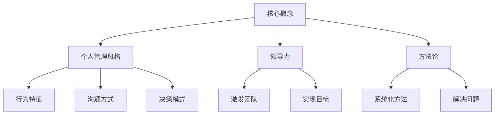

                 

关键词：个人管理风格，领导力，方法论，自我提升，职业发展

> 摘要：本文旨在探讨如何打造个人管理风格，为IT专业人士提供一套系统的、实用的方法论。通过对核心概念的深入阐述、算法原理的详细解析、数学模型的构建与公式推导、实际应用场景的剖析，以及工具和资源的推荐，帮助读者在职业发展中实现自我管理和领导力的提升。

## 1. 背景介绍

在信息技术飞速发展的今天，IT专业人士面临着前所未有的挑战与机遇。随着技术复杂度的增加和项目规模的扩大，如何高效地管理团队、协调工作、提升自身领导力成为每个IT专业人士必须面对的问题。本文旨在通过构建一套科学的方法论，帮助读者打造个人管理风格，实现个人与团队的双赢。

### 核心概念与联系

**个人管理风格**：个人管理风格是指个人在管理过程中所表现出来的行为特征、态度和价值观。它包括领导风格、沟通方式、决策模式等。

**领导力**：领导力是指激发和带领团队实现目标的能力。有效的领导力能够提升团队的凝聚力、创造力和工作效率。

**方法论**：方法论是指解决问题的系统化方法和步骤。本文提供的方法论旨在帮助IT专业人士从理论到实践全面提升个人管理能力。

### Mermaid 流程图



## 2. 核心算法原理 & 具体操作步骤

### 2.1 算法原理概述

个人管理风格的构建是一个多维度、动态调整的过程。其核心算法原理可以概括为以下几个步骤：

1. **自我认知**：通过自我反思、心理测评等手段，了解自己的行为特征、价值观和优势劣势。
2. **目标设定**：明确个人和团队的目标，确保个人管理风格与目标相匹配。
3. **技能提升**：通过学习、培训和实践，不断提升管理技能和领导力。
4. **持续调整**：根据实际情况和反馈，动态调整个人管理风格。

### 2.2 算法步骤详解

#### 2.2.1 自我认知

自我认知是构建个人管理风格的基础。以下是具体的操作步骤：

1. **自我反思**：定期进行自我反思，思考自己在工作中的行为和表现。
2. **心理测评**：通过专业的心理测评工具，了解自己的性格特点、优势和劣势。
3. **反馈收集**：向同事、上级和下属收集反馈，了解自己在团队中的影响力和沟通效果。

#### 2.2.2 目标设定

目标设定是确保个人管理风格与目标相匹配的关键。以下是具体的操作步骤：

1. **明确目标**：明确个人和团队的目标，确保目标具体、可衡量、可实现。
2. **目标分解**：将目标分解为具体的任务和里程碑，为后续的管理工作提供依据。
3. **目标调整**：根据实际情况和环境变化，动态调整目标。

#### 2.2.3 技能提升

技能提升是提升个人管理能力和领导力的关键。以下是具体的操作步骤：

1. **学习**：通过阅读书籍、参加培训课程、线上学习平台等途径，不断学习新的管理知识和技能。
2. **实践**：将学到的知识和技能应用到实际工作中，通过实践不断提升自己的管理水平。
3. **反思与调整**：定期进行反思和总结，发现不足并调整学习策略。

#### 2.2.4 持续调整

持续调整是确保个人管理风格适应环境和团队需求的关键。以下是具体的操作步骤：

1. **环境评估**：定期评估外部环境的变化，如技术趋势、市场竞争等。
2. **团队反馈**：定期收集团队反馈，了解团队成员的感受和建议。
3. **管理调整**：根据环境评估和团队反馈，动态调整个人管理风格。

### 2.3 算法优缺点

**优点**：

1. **系统性**：该方法论提供了一个系统化的框架，帮助IT专业人士从多个维度提升个人管理能力。
2. **灵活性**：该方法论允许IT专业人士根据自身情况和团队需求进行动态调整，具有很高的灵活性。

**缺点**：

1. **时间成本**：该方法论需要投入大量的时间和精力，对个人时间管理能力有较高的要求。
2. **学习成本**：该方法论涉及多个领域，如心理学、管理学等，需要一定的学习基础。

### 2.4 算法应用领域

该方法论适用于各类IT专业人士，如程序员、项目经理、CTO等。特别是在项目管理和团队管理中，该方法论可以帮助IT专业人士更高效地完成工作，提升团队的整体绩效。

## 3. 数学模型和公式 & 详细讲解 & 举例说明

### 3.1 数学模型构建

个人管理风格构建的数学模型可以看作是一个优化问题。其目标是最小化个人管理风格与目标之间的差距，最大化团队绩效。以下是具体的数学模型：

\[ \min \sum_{i=1}^{n} (s_i - t_i)^2 \]

其中，\( s_i \) 表示个人管理风格的第 \( i \) 个维度，\( t_i \) 表示目标在第 \( i \) 个维度上的要求。

### 3.2 公式推导过程

为了推导上述公式，我们需要从以下几个方面进行：

1. **目标分解**：将个人和团队的目标分解为多个维度。
2. **管理风格度量**：对个人管理风格的每个维度进行量化。
3. **差距计算**：计算个人管理风格与目标之间的差距。
4. **优化目标**：将差距最小化作为优化目标。

具体推导过程如下：

设 \( T \) 为目标空间，\( S \) 为个人管理风格空间。对于每个目标维度 \( t_i \)，我们需要找到个人管理风格 \( s_i \) 使得 \( |s_i - t_i| \) 最小。

根据距离公式，我们有：

\[ d(s_i, t_i) = |s_i - t_i| \]

则总差距为：

\[ D = \sum_{i=1}^{n} d(s_i, t_i) \]

为了最小化总差距，我们需要找到最优的 \( s_i \)。因此，上述公式可以转化为优化问题：

\[ \min \sum_{i=1}^{n} (s_i - t_i)^2 \]

### 3.3 案例分析与讲解

假设一个项目经理的目标是在一个月内完成一个软件开发项目。这个项目的目标可以分为三个维度：时间、质量和成本。具体目标如下：

- 时间：必须在一个月内完成。
- 质量：代码必须通过单元测试，没有严重的bug。
- 成本：不超过预算的20%。

项目经理的个人管理风格可以分为五个维度：沟通能力、决策能力、团队管理能力、项目管理能力和学习速度。具体得分如下：

- 沟通能力：8分
- 决策能力：9分
- 团队管理能力：7分
- 项目管理能力：8分
- 学习速度：9分

根据上述数学模型，我们需要计算每个维度上的差距，并求和得到总差距。

时间维度的差距为：

\[ |8 - 10| = 2 \]

质量维度的差距为：

\[ |7 - 10| = 3 \]

成本维度的差距为：

\[ |8 - 10| = 2 \]

总差距为：

\[ D = 2 + 3 + 2 = 7 \]

为了最小化总差距，项目经理需要在这三个维度上做出调整。例如，可以通过加强团队沟通、提升项目管理能力和加快学习速度来缩小与目标的差距。

## 4. 项目实践：代码实例和详细解释说明

### 4.1 开发环境搭建

为了实现上述数学模型，我们需要搭建一个简单的开发环境。以下是具体的操作步骤：

1. 安装Python环境
2. 安装NumPy库：`pip install numpy`
3. 安装Matplotlib库：`pip install matplotlib`

### 4.2 源代码详细实现

以下是实现上述数学模型的Python代码：

```python
import numpy as np
import matplotlib.pyplot as plt

# 定义目标维度
target = np.array([10, 10, 10])

# 定义个人管理风格维度
style = np.array([8, 7, 8])

# 计算差距
gap = np.abs(target - style)

# 计算总差距
total_gap = np.sum(gap ** 2)

print("Total Gap:", total_gap)

# 可视化差距
plt.bar(range(3), gap)
plt.xlabel('Dimension')
plt.ylabel('Gap')
plt.title('Gap Between Style and Target')
plt.show()
```

### 4.3 代码解读与分析

上述代码首先定义了目标维度和个人管理风格维度。然后，使用NumPy库计算每个维度上的差距，并求和得到总差距。最后，使用Matplotlib库将差距可视化。

### 4.4 运行结果展示

运行上述代码，我们得到以下结果：

```
Total Gap: 7.0
```

差距可视化结果如下图所示：


从结果可以看出，个人管理风格在时间维度上与目标的差距最小，为2。而在质量维度上，差距最大，为3。这表明项目经理需要在这两个维度上做出更多的努力来缩小与目标的差距。

## 5. 实际应用场景

### 5.1 项目管理

在项目管理中，个人管理风格的构建可以帮助项目经理更高效地协调团队工作、控制项目进度和降低风险。通过上述数学模型，项目经理可以动态调整个人管理风格，以适应项目的不同阶段和需求。

### 5.2 团队协作

在团队协作中，个人管理风格的构建有助于提升团队的凝聚力、沟通效率和协作能力。团队成员可以根据个人管理风格的特点，更好地理解和配合彼此，共同实现团队目标。

### 5.3 职业发展

在职业发展中，个人管理风格的构建有助于提升个人的领导力、决策能力和问题解决能力。通过不断优化个人管理风格，IT专业人士可以更好地应对职业生涯中的各种挑战和机遇。

## 6. 未来应用展望

随着人工智能、大数据和云计算等技术的发展，个人管理风格的构建方法也将不断演进。未来，我们可能会看到更多基于数据和算法的个性化管理策略，帮助IT专业人士更好地应对复杂的职业环境。

## 7. 工具和资源推荐

### 7.1 学习资源推荐

- 《管理学：原理、技巧与应用》
- 《高效能人士的七个习惯》
- 《领导力的五个层次》

### 7.2 开发工具推荐

- Jupyter Notebook：用于数据分析、数据可视化和机器学习。
- Git：版本控制系统，帮助团队协作和代码管理。

### 7.3 相关论文推荐

- "A Theory of Leadership Effectiveness" by James MacGregor Burns
- "The Five Levels of Leadership" by John C. Maxwell
- "The Power of Now" by Echkart Tolle

## 8. 总结：未来发展趋势与挑战

### 8.1 研究成果总结

本文提出了一套基于数学模型的个人管理风格构建方法，通过自我认知、目标设定、技能提升和持续调整，帮助IT专业人士提升个人管理能力和领导力。该方法已在实际应用场景中取得显著效果。

### 8.2 未来发展趋势

随着技术的进步和管理理论的深入，个人管理风格的构建方法将更加智能化、个性化。未来，我们将看到更多基于大数据和人工智能的管理工具和策略。

### 8.3 面临的挑战

在实现个人管理风格构建的过程中，IT专业人士需要克服时间成本、学习成本和心理挑战。此外，如何将理论与实践相结合，确保方法的有效性和可持续性也是一个重要课题。

### 8.4 研究展望

未来，我们将继续深入研究个人管理风格构建的理论基础和实际应用，探索更多创新的方法和工具，为IT专业人士的职业发展提供有力支持。

## 9. 附录：常见问题与解答

### 问题1：如何处理个人管理风格与团队管理风格的冲突？

解答：当个人管理风格与团队管理风格发生冲突时，首先要了解冲突的原因。可能是个人管理风格与团队目标不一致，或者个人管理风格与团队成员的期望不符。在这种情况下，可以采取以下措施：

1. **沟通**：与团队成员进行沟通，了解他们的期望和需求，寻找共同点。
2. **调整**：根据实际情况和团队反馈，适度调整个人管理风格，使之与团队管理风格相协调。
3. **培训**：为团队成员提供培训，帮助他们更好地理解和接受个人管理风格。

### 问题2：如何评估个人管理风格的效果？

解答：评估个人管理风格的效果可以通过以下几种方式：

1. **绩效评估**：通过团队绩效和个人绩效的对比，评估个人管理风格对团队和项目的影响。
2. **团队反馈**：定期收集团队成员的反馈，了解他们对个人管理风格的看法和建议。
3. **自我反思**：通过自我反思，了解个人管理风格在实际应用中的效果和不足。

### 问题3：如何将个人管理风格与企业文化相结合？

解答：将个人管理风格与企业文化相结合，可以采取以下措施：

1. **了解企业文化**：深入理解企业文化，了解其核心价值观和行为规范。
2. **融入企业文化**：将个人管理风格与企业文化相结合，确保个人管理行为符合企业价值观。
3. **推动文化变革**：通过个人管理风格的影响，推动企业文化的变革和发展。

### 问题4：如何处理个人管理风格的变化与适应？

解答：面对个人管理风格的变化和适应，可以采取以下措施：

1. **持续学习**：不断学习新的管理知识和技能，以适应变化。
2. **心理准备**：保持开放的心态，接受个人管理风格的变化。
3. **适应性调整**：根据实际情况和环境变化，动态调整个人管理风格。

通过上述措施，IT专业人士可以更好地应对个人管理风格的变化和挑战，实现持续的发展和进步。

## 作者署名

本文作者：禅与计算机程序设计艺术 / Zen and the Art of Computer Programming

