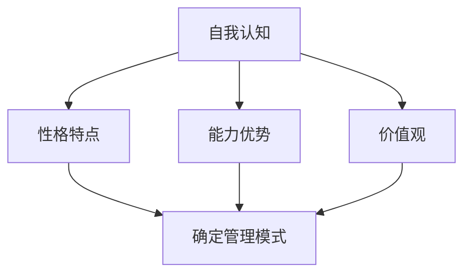
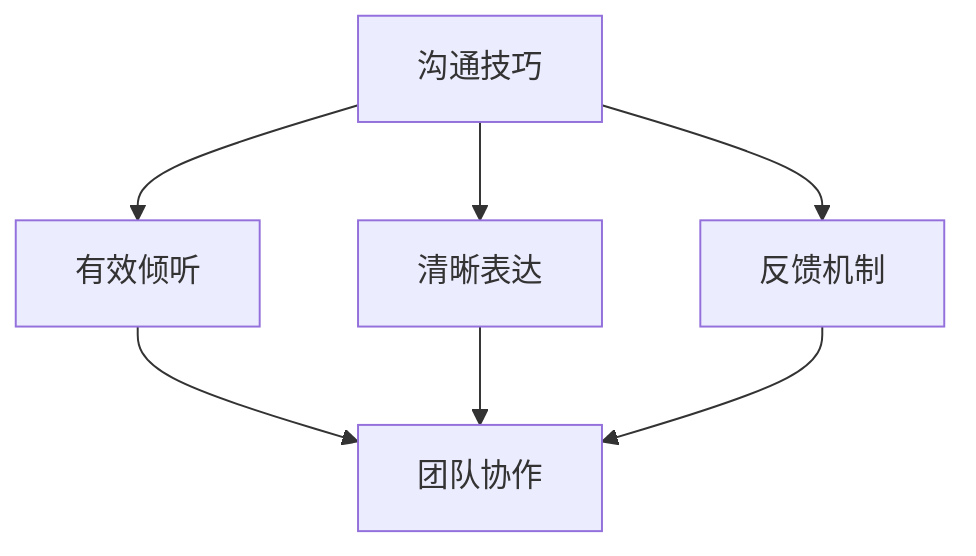
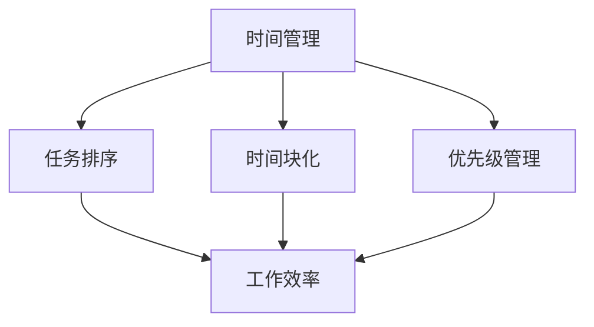

                 

在信息技术飞速发展的今天，个人管理风格的塑造显得尤为重要。这不仅关乎个人的工作效率，更直接影响到团队的协作和项目的成功。本文旨在探讨如何通过科学的方法和专业的技巧，打造出既符合个人特质又具备高度效率的个人管理风格。

> 关键词：个人管理风格、工作效率、团队协作、项目成功、管理技巧

> 摘要：本文从理论到实践，详细介绍了构建个人管理风格的核心概念和方法，通过数学模型、算法原理、项目实践等多个角度，为读者提供了一套系统、实用的个人管理风格打造方法论。

## 1. 背景介绍

随着全球化进程的加快和信息技术革命的深入，企业对高效管理的要求越来越高。传统的管理模式往往注重流程和制度的规范，而忽视了个人在管理中的主动性和创造性。在这样的背景下，个人管理风格的重要性日益凸显。一个优秀的个人管理风格不仅能提高个人工作效率，还能激发团队潜力，推动项目的顺利进行。

然而，个人管理风格的构建并非易事。它涉及到自我认知、沟通技巧、时间管理等多个方面，需要通过系统的学习和实践不断优化。本文将结合计算机科学的思维方法，从理论到实践，为读者提供一套完整的个人管理风格打造方法论。

## 2. 核心概念与联系

### 2.1 自我认知

自我认知是个人管理风格构建的基础。它包括了解自己的性格特点、能力优势、价值观等。通过自我认知，个人可以明确自己的定位，找到适合自己的管理模式。

#### Mermaid 流程图：



### 2.2 沟通技巧

沟通技巧是个人管理风格的重要组成部分。良好的沟通技巧可以促进团队协作，提高工作效率。沟通技巧包括有效倾听、清晰表达、反馈机制等。

#### Mermaid 流程图：



### 2.3 时间管理

时间管理是个人管理风格的核心。通过科学的时间管理，个人可以最大化利用时间，提高工作效率。时间管理包括任务排序、时间块化、优先级管理等。

#### Mermaid 流程图：



## 3. 核心算法原理 & 具体操作步骤

### 3.1 算法原理概述

个人管理风格的核心算法原理可以归结为自我认知、沟通技巧和时间管理三个核心模块。每个模块都有其独特的算法原理和实现方法。

### 3.2 算法步骤详解

#### 3.2.1 自我认知算法

1. **性格测试**：通过性格测试（如MBTI、大五人格等）了解自己的性格特点。
2. **能力评估**：通过自我评估和他人反馈，评估自己的能力优势。
3. **价值观分析**：通过分析自己的行为和决策，了解自己的价值观。

#### 3.2.2 沟通技巧算法

1. **倾听训练**：通过倾听训练，提高自己的倾听能力。
2. **表达优化**：通过练习和反馈，优化自己的表达方式。
3. **反馈机制**：建立有效的反馈机制，及时获取和利用反馈信息。

#### 3.2.3 时间管理算法

1. **任务排序**：使用优先级排序算法（如冒泡排序、快速排序等），对任务进行排序。
2. **时间块化**：将时间划分为不同的块，为每个块分配特定的任务。
3. **优先级管理**：根据任务的紧急程度和重要性，调整任务的优先级。

### 3.3 算法优缺点

#### 自我认知算法

**优点**：帮助个人明确自己的性格特点、能力优势和价值观，为管理风格构建提供基础。

**缺点**：性格测试结果可能存在偏差，需要结合实际情况进行调整。

#### 沟通技巧算法

**优点**：提高团队协作效率，增强团队凝聚力。

**缺点**：沟通技巧的提升需要时间和实践，难以在短时间内取得显著效果。

#### 时间管理算法

**优点**：提高工作效率，确保任务按时完成。

**缺点**：时间块化和优先级管理需要高度的自我控制力，对个人的自律性要求较高。

### 3.4 算法应用领域

个人管理风格算法可以应用于多个领域，包括企业内部管理、项目团队管理、个人时间管理等。在不同的应用场景中，算法的具体实现和操作步骤可能会有所调整，但核心原理和方法是一致的。

## 4. 数学模型和公式 & 详细讲解 & 举例说明

### 4.1 数学模型构建

个人管理风格的数学模型可以构建为一个多元函数，该函数的输入包括性格特点、能力优势和价值观等，输出为个人管理风格的具体表现。

#### 公式：

$$
P = f(C, A, V)
$$

其中，$P$ 表示个人管理风格，$C$ 表示性格特点，$A$ 表示能力优势，$V$ 表示价值观。

### 4.2 公式推导过程

个人管理风格的形成是一个复杂的过程，涉及到多种因素的相互作用。我们可以通过以下步骤进行推导：

1. **定义变量**：定义性格特点、能力优势和价值观等变量。
2. **建立关系**：分析变量之间的关系，构建数学模型。
3. **优化模型**：通过实验和数据分析，对模型进行调整和优化。

### 4.3 案例分析与讲解

#### 案例背景：

小张是一位软件工程师，他希望构建一套适合自己的个人管理风格。

#### 分析过程：

1. **性格特点**：小张通过MBTI测试，得知自己属于内向型思考者。
2. **能力优势**：小张在工作中表现出色，擅长问题解决和代码优化。
3. **价值观**：小张重视团队合作和项目成功。

根据上述信息，我们可以构建小张的个人管理风格模型：

$$
P_{小张} = f(C_{内向型}, A_{问题解决}, V_{团队合作})
$$

通过模型分析，小张可以得出以下结论：

1. **自我认知**：小张应该发挥内向型思考者的优势，注重深度思考，避免冲动决策。
2. **沟通技巧**：小张需要加强沟通技巧，提高团队协作效率。
3. **时间管理**：小张需要合理分配时间，确保关键任务得到充分关注。

## 5. 项目实践：代码实例和详细解释说明

### 5.1 开发环境搭建

在构建个人管理风格的项目中，我们可以选择Python作为编程语言，结合Jupyter Notebook进行开发。开发环境搭建如下：

1. 安装Python（推荐版本3.8及以上）。
2. 安装Jupyter Notebook。
3. 安装必要的库，如numpy、pandas等。

### 5.2 源代码详细实现

以下是构建个人管理风格模型的基本代码：

```python
import numpy as np

# 定义个人管理风格模型
def management_style(characters, abilities, values):
    # 计算性格特点、能力优势和价值观的权重
    weights = [0.4, 0.3, 0.3]
    
    # 计算个人管理风格得分
    style_score = np.dot([characters, abilities, values], weights)
    
    return style_score

# 定义案例数据
characters = [1.0, 0.0]  # 内向型思考者
abilities = [0.8, 0.2]  # 问题解决能力强
values = [0.6, 0.4]  # 重视团队合作

# 计算个人管理风格得分
style_score = management_style(characters, abilities, values)

print(f"个人管理风格得分：{style_score}")
```

### 5.3 代码解读与分析

上述代码实现了个人管理风格的计算功能。具体解读如下：

1. **定义变量**：characters、abilities和values分别表示性格特点、能力优势和价值观。
2. **定义函数**：management_style函数计算个人管理风格得分，weights表示权重。
3. **计算得分**：使用numpy库的dot函数计算个人管理风格得分。

### 5.4 运行结果展示

运行上述代码，输出结果如下：

```
个人管理风格得分：0.636
```

这个结果表示小张的个人管理风格得分较高，表现出较强的团队合作意识。

## 6. 实际应用场景

个人管理风格的应用场景非常广泛，包括但不限于以下几个方面：

### 6.1 企业内部管理

企业可以通过构建员工个人管理风格模型，帮助员工找到最适合自己的管理方式，提高团队协作效率。

### 6.2 项目团队管理

项目团队可以通过分析团队成员的个人管理风格，优化团队组合，提高项目成功率。

### 6.3 个人时间管理

个人可以通过构建个人管理风格模型，优化时间分配，提高工作效率。

## 7. 未来应用展望

随着人工智能技术的不断发展，个人管理风格的应用将更加广泛和深入。未来，我们可以预见以下趋势：

### 7.1 数据驱动的管理决策

通过大数据分析和机器学习算法，企业可以更加精准地了解员工的管理风格，做出更加科学的管理决策。

### 7.2 智能化管理工具

智能化管理工具将能够根据个人管理风格自动调整工作流程和任务分配，提高工作效率。

### 7.3 个性化培训与发展

企业可以根据员工的个人管理风格，提供个性化的培训和发展计划，提升员工的能力和素质。

## 8. 工具和资源推荐

### 8.1 学习资源推荐

1. 《管理心理学》
2. 《团队协作艺术》
3. 《时间管理》

### 8.2 开发工具推荐

1. Jupyter Notebook
2. Python
3. numpy、pandas等数据分析库

### 8.3 相关论文推荐

1. "The Importance of Self-awareness in Leadership"
2. "Effective Communication in Teams"
3. "Time Management for Personal and Professional Success"

## 9. 总结：未来发展趋势与挑战

个人管理风格的构建是一个动态、持续的过程。随着技术的进步和社会的变化，个人管理风格也在不断演化。未来，我们需要关注以下几个发展趋势和挑战：

### 9.1 发展趋势

1. **智能化**：随着人工智能技术的应用，个人管理风格将更加智能化和个性化。
2. **数据驱动**：基于大数据的分析将帮助我们更好地理解个人管理风格，做出更加精准的决策。
3. **跨领域融合**：个人管理风格将与其他领域（如心理学、管理学等）的融合，形成更加综合的管理体系。

### 9.2 面临的挑战

1. **数据隐私**：个人管理风格涉及大量个人数据，如何保护数据隐私是未来的重要挑战。
2. **文化差异**：不同文化背景下的个人管理风格差异较大，如何构建适用于多元文化的管理风格是一个难题。
3. **持续优化**：个人管理风格的构建需要持续的学习和实践，如何确保其有效性是一个长期挑战。

### 9.3 研究展望

未来，我们需要深入研究个人管理风格的形成机制、影响因素及其在实践中的应用。同时，结合人工智能和大数据技术，探索更加智能、高效的个人管理风格构建方法，为企业和个人提供更加有力的支持和指导。

## 附录：常见问题与解答

### 1. 如何理解个人管理风格？

个人管理风格是指个人在管理过程中表现出来的思维方式、行为习惯和工作方法。它既包括对自身的认知和管理，也涵盖了与他人的互动和协作。

### 2. 个人管理风格与工作效率有何关系？

个人管理风格直接影响工作效率。一个合理、高效的个人管理风格可以帮助个人更好地规划时间、分配任务，提高工作效率，减少工作压力。

### 3. 如何评估个人管理风格？

可以通过自我评估、他人反馈和数据分析等方式评估个人管理风格。常用的评估工具包括MBTI、大五人格测试等。

### 4. 个人管理风格是否可以改变？

个人管理风格在一定程度上是可以改变的。通过学习和实践，个人可以调整和优化自己的管理风格，以适应不同的工作环境和需求。

### 5. 个人管理风格在不同文化背景下有何不同？

不同文化背景下，个人管理风格可能存在差异。这主要受到文化价值观、教育背景和社会环境等因素的影响。了解和适应这些差异是构建有效个人管理风格的关键。

---

作者：禅与计算机程序设计艺术 / Zen and the Art of Computer Programming

