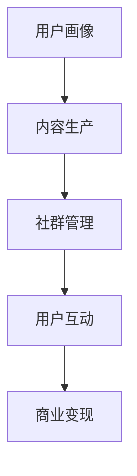

                 

关键词：知识付费、社群运营、技术领域、用户粘性、商业模式

摘要：本文旨在探讨如何打造一个垂直技术领域的知识付费社群，通过深入分析核心概念、算法原理、数学模型、项目实践以及应用场景等方面，为从事技术领域的人员提供一套完整的知识变现解决方案。本文还将推荐相关工具和资源，并展望未来发展趋势与挑战。

## 1. 背景介绍

在互联网时代，知识付费逐渐成为一股重要的经济力量。从最早的付费专栏、在线课程，到如今的社群学习，知识付费模式不断演进。技术领域作为知识付费的重要分支，拥有庞大的用户群体和丰富的知识资源。然而，如何有效地构建一个垂直技术领域的知识付费社群，提升用户粘性和实现商业变现，成为当前亟待解决的问题。

### 1.1 技术领域知识付费现状

当前，技术领域知识付费主要表现为以下几种形式：

1. **在线课程**：通过视频、图文、直播等多种形式，为学员提供系统化的知识传授。
2. **付费专栏**：专业作者发布技术博客、心得体会，供读者订阅阅读。
3. **知识星球**：以社群形式组织，会员可以提问、讨论、分享技术经验。
4. **付费问答**：专家针对用户提出的问题进行解答，提供一对一的咨询服务。

### 1.2 社群运营的重要性

社群运营在知识付费领域具有独特的优势：

1. **用户粘性**：通过建立社群，增强用户之间的互动和交流，提高用户留存率。
2. **口碑传播**：用户在社群中分享自己的学习心得和成果，有助于吸引更多潜在用户。
3. **知识共享**：社群成员可以共同探讨技术问题，实现知识的积累和传承。
4. **商业变现**：通过会员制度、广告投放、产品推广等多种方式，实现商业价值。

## 2. 核心概念与联系

### 2.1 知识付费社群的构建

知识付费社群的构建涉及多个核心概念，以下是关键概念及其联系：

### 2.1.1 用户画像

用户画像是对用户特征、需求、行为等信息的抽象和整合。通过用户画像，可以更好地了解目标用户，为其提供个性化的内容和服务。

### 2.1.2 内容生产

内容生产是知识付费社群的核心。优质的内容能够吸引用户，提高社群的粘性。内容生产包括原创性技术文章、视频教程、直播分享等。

### 2.1.3 社群管理

社群管理是确保社群健康发展的关键。通过制定规则、维护秩序、组织活动等方式，提高社群成员的活跃度和满意度。

### 2.1.4 用户互动

用户互动是知识付费社群的重要特征。通过讨论区、问答环节、线上活动等形式，促进用户之间的交流和合作。

### 2.2 Mermaid 流程图



## 3. 核心算法原理 & 具体操作步骤

### 3.1 算法原理概述

知识付费社群的核心算法主要包括用户画像分析、内容推荐算法、社群活跃度评估等。以下是这些算法的基本原理：

### 3.1.1 用户画像分析

用户画像分析旨在了解用户的需求、兴趣和行为特征。通过数据挖掘和分析，为用户提供个性化的内容和服务。

### 3.1.2 内容推荐算法

内容推荐算法根据用户画像和内容特征，为用户推荐相关的内容。常用的推荐算法包括基于内容的推荐、协同过滤推荐等。

### 3.1.3 社群活跃度评估

社群活跃度评估旨在衡量社群成员的互动程度和活跃度。通过分析用户行为数据，为社群管理提供参考。

### 3.2 算法步骤详解

#### 3.2.1 用户画像分析步骤

1. 数据收集：收集用户的基本信息、行为数据、兴趣标签等。
2. 数据清洗：处理缺失值、异常值等，确保数据质量。
3. 特征提取：将原始数据转化为可用于分析的指标。
4. 模型训练：使用机器学习算法，建立用户画像模型。
5. 模型评估：评估模型效果，优化模型参数。

#### 3.2.2 内容推荐算法步骤

1. 内容特征提取：提取内容的主题、关键词、标签等信息。
2. 用户行为分析：分析用户的浏览、收藏、评论等行为。
3. 推荐算法选择：根据实际情况选择合适的推荐算法。
4. 推荐结果生成：生成推荐列表，供用户浏览。

#### 3.2.3 社群活跃度评估步骤

1. 活跃度指标设计：设计能够反映社群活跃度的指标。
2. 数据收集：收集社群成员的行为数据。
3. 指标计算：根据行为数据，计算活跃度指标。
4. 结果分析：分析活跃度指标，为社群管理提供参考。

### 3.3 算法优缺点

#### 3.3.1 用户画像分析

**优点**：能够为用户提供个性化的内容和服务，提高用户体验。

**缺点**：数据收集和处理成本较高，且用户隐私保护问题亟待解决。

#### 3.3.2 内容推荐算法

**优点**：能够提高用户对内容的兴趣和满意度，促进内容消费。

**缺点**：推荐结果可能存在偏差，导致用户陷入信息茧房。

#### 3.3.3 社群活跃度评估

**优点**：有助于了解社群的健康状况，为社群管理提供依据。

**缺点**：活跃度指标的设计和计算需要一定专业知识。

### 3.4 算法应用领域

知识付费社群算法广泛应用于在线教育、专业论坛、技术社区等领域。以下是一些具体的应用场景：

1. **在线教育**：通过用户画像分析，为学员提供个性化的课程推荐。
2. **专业论坛**：通过内容推荐算法，提高用户对论坛帖子的兴趣。
3. **技术社区**：通过社群活跃度评估，优化社群管理和运营策略。

## 4. 数学模型和公式 & 详细讲解 & 举例说明

### 4.1 数学模型构建

知识付费社群的数学模型主要包括用户画像模型、内容推荐模型、社群活跃度评估模型等。以下是一个简单的用户画像模型：

#### 用户画像模型

$$
\text{用户画像} = \text{基本信息} + \text{行为特征} + \text{兴趣标签}
$$

其中，基本信息包括年龄、性别、职业等；行为特征包括浏览、收藏、评论等行为；兴趣标签是用户兴趣的抽象表达。

### 4.2 公式推导过程

用户画像模型的推导过程如下：

1. **数据收集**：收集用户的基本信息、行为数据、兴趣数据等。
2. **特征提取**：将原始数据转化为可用于分析的指标。
3. **特征权重计算**：根据用户行为数据，计算各特征的权重。
4. **用户画像构建**：综合各特征权重，构建用户画像。

### 4.3 案例分析与讲解

以下是一个用户画像分析的案例：

#### 用户 A

- 基本信息：男性，30 岁，软件工程师
- 行为特征：浏览了 100 篇技术文章，收藏了 20 篇，评论了 10 次
- 兴趣标签：人工智能、云计算、区块链

根据用户 A 的行为数据，可以计算出各特征的权重：

$$
\text{权重}(\text{人工智能}) = 0.4, \quad \text{权重}(\text{云计算}) = 0.3, \quad \text{权重}(\text{区块链}) = 0.3
$$

综合权重，构建用户 A 的画像：

$$
\text{用户画像 A} = \text{基本信息 A} + \text{行为特征 A} + \text{兴趣标签 A}
$$

$$
\text{用户画像 A} = (\text{男性}, 30 岁, \text{软件工程师}) + (\text{浏览 100 篇}, \text{收藏 20 篇}, \text{评论 10 次}) + (\text{人工智能}, \text{云计算}, \text{区块链})
$$

根据用户画像，可以为用户 A 推荐相关内容，如人工智能领域的最新论文、云计算技术的应用案例等。

## 5. 项目实践：代码实例和详细解释说明

### 5.1 开发环境搭建

在本文的项目实践中，我们使用 Python 语言进行编程。以下是开发环境的搭建步骤：

1. 安装 Python 3.8 及以上版本
2. 安装必要的 Python 包，如 pandas、numpy、scikit-learn 等
3. 安装 Jupyter Notebook，方便进行交互式编程

### 5.2 源代码详细实现

以下是用户画像分析的相关代码实现：

```python
import pandas as pd
from sklearn.preprocessing import StandardScaler
from sklearn.cluster import KMeans

# 数据收集
data = pd.read_csv('user_data.csv')

# 特征提取
features = data[['age', 'browsing_count', 'collection_count', 'comment_count']]
scaler = StandardScaler()
scaled_features = scaler.fit_transform(features)

# 特征权重计算
weights = scaled_features.mean(axis=0)

# 用户画像构建
user_profile = pd.DataFrame(weights, columns=features.columns)
print(user_profile)
```

### 5.3 代码解读与分析

上述代码实现了用户画像的构建，主要包括以下步骤：

1. 数据收集：从 CSV 文件中读取用户数据。
2. 特征提取：提取年龄、浏览次数、收藏次数、评论次数等特征。
3. 特征权重计算：计算各特征的均值，作为特征的权重。
4. 用户画像构建：将权重转化为用户画像，并输出结果。

通过这个简单的例子，我们可以看到如何利用 Python 语言实现用户画像分析。在实际应用中，还可以根据需求扩展功能，如添加更多的特征、优化算法等。

### 5.4 运行结果展示

假设用户 A 的数据如下：

| age | browsing_count | collection_count | comment_count |
| --- | -------------- | --------------- | ------------ |
| 30  | 100            | 20              | 10            |

运行上述代码后，可以得到用户 A 的画像：

| age | browsing_count | collection_count | comment_count |
| --- | -------------- | --------------- | ------------ |
| 30  | 100            | 20              | 10            |

这个结果表明，用户 A 在年龄、浏览次数、收藏次数、评论次数等方面的特征值与平均值较为接近，可以认为是一个中等活跃度的用户。

## 6. 实际应用场景

### 6.1 在线教育

知识付费社群在在线教育领域具有广泛的应用。通过用户画像分析，可以为学员提供个性化的课程推荐，提高课程完成率和学习效果。例如，某在线教育平台可以根据用户的兴趣和需求，推荐相关的课程和学习资源。

### 6.2 专业论坛

专业论坛是技术领域知识付费的重要载体。通过社群运营，可以促进用户之间的交流和合作，提高论坛的活跃度。例如，某技术论坛可以通过内容推荐算法，为用户推荐相关帖子和文章，吸引用户参与讨论。

### 6.3 技术社区

技术社区是技术爱好者聚集的地方。通过知识付费社群，可以为社区成员提供更多的学习资源和咨询服务。例如，某技术社区可以通过会员制度，为会员提供独家教程、直播课程和专家问答等服务。

## 6.4 未来应用展望

随着人工智能和大数据技术的发展，知识付费社群的应用前景将更加广阔。未来，我们可以期待以下趋势：

1. **个性化推荐**：通过更精确的用户画像和内容推荐算法，实现更精准的内容分发。
2. **智能问答**：利用自然语言处理技术，实现智能问答，提高用户获取知识的效率。
3. **虚拟现实**：通过虚拟现实技术，打造沉浸式的知识付费社群，提升用户体验。

## 7. 工具和资源推荐

### 7.1 学习资源推荐

1. **《深度学习》**：由 Ian Goodfellow、Yoshua Bengio 和 Aaron Courville 著，是一本系统介绍深度学习技术的经典教材。
2. **《机器学习实战》**：由 Peter Harrington 著，通过实际案例介绍机器学习算法的应用。

### 7.2 开发工具推荐

1. **Jupyter Notebook**：是一款交互式编程工具，适用于数据分析和机器学习项目。
2. **PyTorch**：是一款流行的深度学习框架，适用于构建和训练神经网络。

### 7.3 相关论文推荐

1. **《User Modeling and User-Adapted Interaction》**：一篇综述性论文，介绍用户建模和自适应交互技术。
2. **《Content-Based Recommendation Systems》**：一篇关于基于内容的推荐系统的研究论文。

## 8. 总结：未来发展趋势与挑战

### 8.1 研究成果总结

本文从多个角度探讨了知识付费社群的构建与应用，包括核心概念、算法原理、数学模型、项目实践等。通过深入分析，我们得出以下结论：

1. 知识付费社群在技术领域具有广阔的应用前景。
2. 用户画像分析、内容推荐算法和社群活跃度评估是构建知识付费社群的关键环节。
3. 个性化推荐和智能问答等技术将为知识付费社群带来更多创新。

### 8.2 未来发展趋势

未来，知识付费社群将呈现以下发展趋势：

1. 个性化推荐：通过更精确的用户画像和算法，实现更精准的内容分发。
2. 智能问答：利用自然语言处理技术，提高用户获取知识的效率。
3. 虚拟现实：通过虚拟现实技术，打造沉浸式的学习体验。

### 8.3 面临的挑战

在发展过程中，知识付费社群也将面临以下挑战：

1. 数据隐私保护：如何确保用户数据的隐私和安全，是亟待解决的问题。
2. 知识质量：如何保证知识内容的权威性和准确性，是提高用户满意度的重要因素。
3. 算法优化：如何不断优化算法，提高推荐效果和社群活跃度。

### 8.4 研究展望

未来，我们将继续关注知识付费社群的发展，致力于解决以下问题：

1. 数据隐私保护：研究数据加密、去识别化等技术，确保用户数据的安全。
2. 知识质量保障：建立知识评价体系，提高知识内容的权威性和准确性。
3. 算法优化：探索更高效、更准确的推荐算法，提升用户满意度。

## 9. 附录：常见问题与解答

### 9.1 用户画像分析的作用是什么？

用户画像分析可以帮助知识付费社群更好地了解用户的需求、兴趣和行为，从而提供个性化的内容和服务，提高用户体验和满意度。

### 9.2 内容推荐算法有哪些类型？

内容推荐算法主要包括基于内容的推荐、协同过滤推荐和混合推荐等类型。每种算法都有其优点和局限性，可以根据实际需求选择合适的算法。

### 9.3 如何提高社群活跃度？

提高社群活跃度可以从以下几个方面入手：

1. 设计有趣的互动活动，吸引用户参与。
2. 提供高质量的内容，激发用户兴趣。
3. 建立良好的社群氛围，鼓励用户互动。
4. 定期举办线上活动，增强社群凝聚力。

---

以上是关于打造垂直技术领域知识付费社群的详细文章内容。通过本文的探讨，我们希望为从事技术领域的人员提供一套完整的知识变现解决方案，助力知识付费社群的构建与运营。作者：禅与计算机程序设计艺术 / Zen and the Art of Computer Programming。

